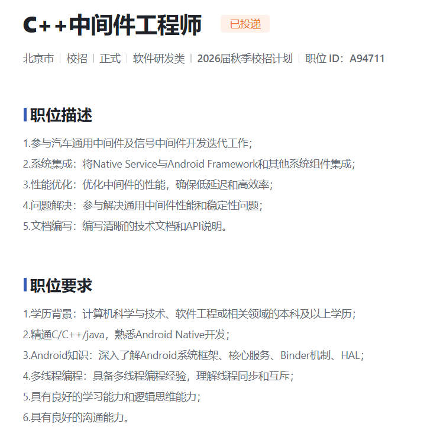
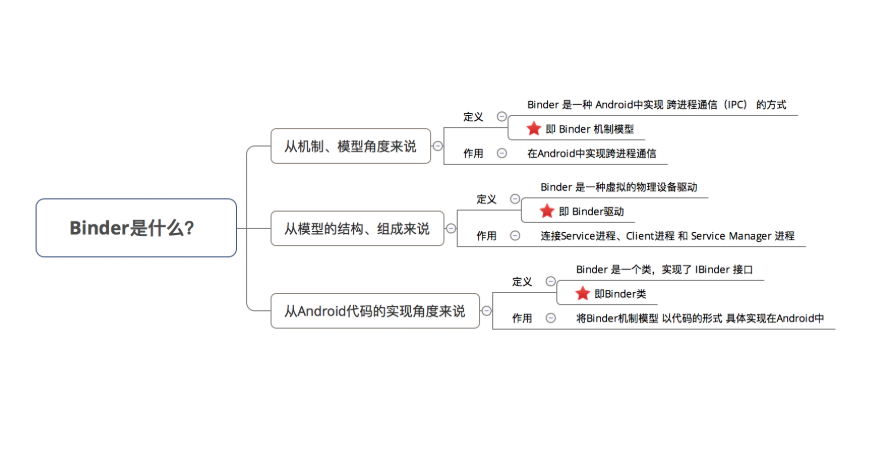
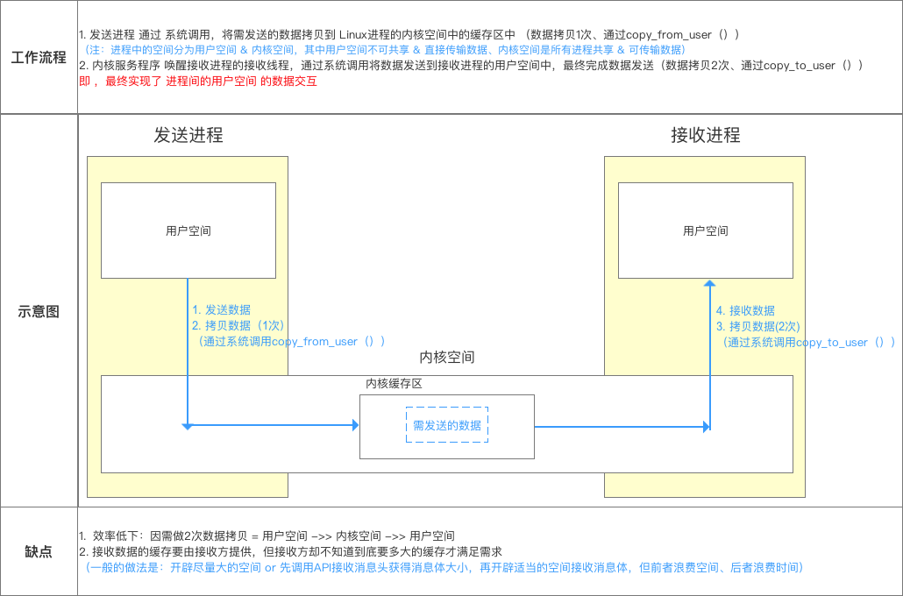
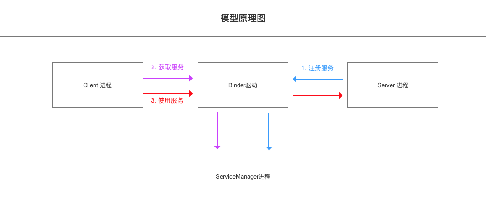
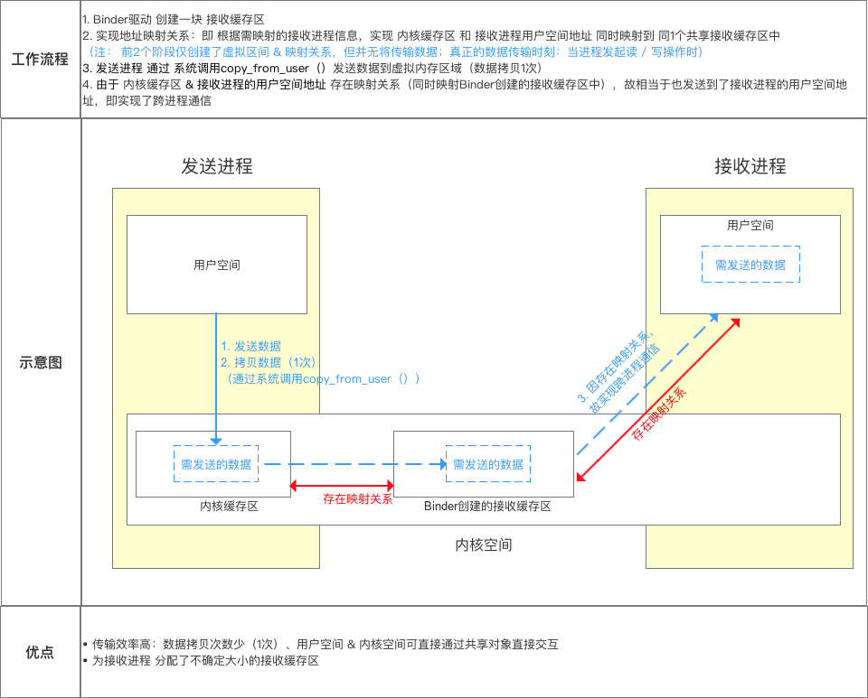
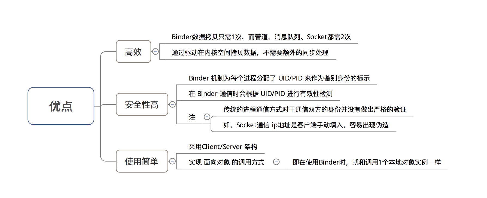

# Android

学习目标：



# 跨进程通信binder

中文即 粘合剂，意思为粘合了两个不同的进程

网上有很多对Binder的定义，但都说不清楚：Binder是跨进程通信方式、它实现了IBinder接口，是连接 ServiceManager的桥梁blabla，估计大家都看晕了，没法很好的理解

我认为：对于Binder的定义，在不同场景下其定义不同




## Linux进程

- 一个进程空间分为 用户空间 & 内核空间（`Kernel`），即把进程内 用户 & 内核 隔离开来
- 二者区别：
  1. 进程间，用户空间的数据不可共享，所以用户空间 = 不可共享空间
  2. 进程间，内核空间的数据可共享，所以内核空间 = 可共享空间

- 进程内 用户空间 & 内核空间 进行交互 需通过 **系统调用**，主要通过函数：

> 1. copy_from_user（）：将用户空间的数据拷贝到内核空间
> 2. copy_to_user（）：将内核空间的数据拷贝到用户空间


## 进程隔离 跨进程通信（IPC）

- 进程隔离
  为了保证 安全性 & 独立性，一个进程 不能直接操作或者访问另一个进程，即`Android`的进程是**相互独立、隔离的**
- 跨进程通信（ `IPC` ）
  即进程间需进行数据交互、通信
- 跨进程通信的基本原理




## Binder 跨进程通信机制 模型

`Binder` 跨进程通信机制 模型 基于 `Client - Server` 模式




- `Binder`跨进程通信的核心原理

> 关于其核心原理：内存映射，具体请看文章：[操作系统：图文详解 内存映射](https://www.jianshu.com/p/719fc4758813)




- 模型原理步骤


## Binder机制 在Android中的具体实现原理

- `Binder`机制在 `Android`中的实现主要依靠 `Binder`类，其实现了`IBinder` 接口

- 实例说明：`Client`进程 需要调用 `Server`进程的加法函数（将整数a和b相加）

  即：

  1. `Client`进程 需要传两个整数给 `Server`进程
  2. `Server`进程 需要把相加后的结果 返回给`Client`进程

---

**步骤1：注册服务**
过程描述
Server进程 通过Binder驱动 向 Service Manager进程 注册服务
代码实现

```
    
    Binder binder = new Stub();
    // 步骤1：创建Binder对象 ->>分析1

    // 步骤2：创建 IInterface 接口类 的匿名类
    // 创建前，需要预先定义 继承了IInterface 接口的接口 -->分析3
    IInterface plus = new IPlus(){

          // 确定Client进程需要调用的方法
          public int add(int a,int b) {
               return a+b;
         }

          // 实现IInterface接口中唯一的方法
          public IBinder asBinder（）{ 
                return null ;
           }
};
          // 步骤3
          binder.attachInterface(plus，"add two int");
         // 1. 将（add two int，plus）作为（key,value）对存入到Binder对象中的一个Map<String,IInterface>对象中
         // 2. 之后，Binder对象 可根据add two int通过queryLocalIInterface（）获得对应IInterface对象（即plus）的引用，可依靠该引用完成对请求方法的调用
        // 分析完毕，跳出


<-- 分析1：Stub类 -->
    public class Stub extends Binder {
    // 继承自Binder类 ->>分析2

          // 复写onTransact（）
          @Override
          boolean onTransact(int code, Parcel data, Parcel reply, int flags){
          // 具体逻辑等到步骤3再具体讲解，此处先跳过
          switch (code) { 
                case Stub.add： { 

                       data.enforceInterface("add two int"); 

                       int  arg0  = data.readInt();
                       int  arg1  = data.readInt();

                       int  result = this.queryLocalIInterface("add two int") .add( arg0,  arg1); 

                        reply.writeInt(result); 

                        return true; 
                  }
           } 
      return super.onTransact(code, data, reply, flags); 

}
// 回到上面的步骤1，继续看步骤2

<-- 分析2：Binder 类 -->
 public class Binder implement IBinder{
    // Binder机制在Android中的实现主要依靠的是Binder类，其实现了IBinder接口
    // IBinder接口：定义了远程操作对象的基本接口，代表了一种跨进程传输的能力
    // 系统会为每个实现了IBinder接口的对象提供跨进程传输能力
    // 即Binder类对象具备了跨进程传输的能力

        void attachInterface(IInterface plus, String descriptor)；
        // 作用：
          // 1. 将（descriptor，plus）作为（key,value）对存入到Binder对象中的一个Map<String,IInterface>对象中
          // 2. 之后，Binder对象 可根据descriptor通过queryLocalIInterface（）获得对应IInterface对象（即plus）的引用，可依靠该引用完成对请求方法的调用

        IInterface queryLocalInterface(Stringdescriptor) ；
        // 作用：根据 参数 descriptor 查找相应的IInterface对象（即plus引用）

        boolean onTransact(int code, Parcel data, Parcel reply, int flags)；
        // 定义：继承自IBinder接口的
        // 作用：执行Client进程所请求的目标方法（子类需要复写）
        // 参数说明：
        // code：Client进程请求方法标识符。即Server进程根据该标识确定所请求的目标方法
        // data：目标方法的参数。（Client进程传进来的，此处就是整数a和b）
        // reply：目标方法执行后的结果（返回给Client进程）
         // 注：运行在Server进程的Binder线程池中；当Client进程发起远程请求时，远程请求会要求系统底层执行回调该方法

        final class BinderProxy implements IBinder {
         // 即Server进程创建的Binder对象的代理对象类
         // 该类属于Binder的内部类
        }
        // 回到分析1原处
}

<-- 分析3：IInterface接口实现类 -->

 public interface IPlus extends IInterface {
          // 继承自IInterface接口->>分析4
          // 定义需要实现的接口方法，即Client进程需要调用的方法
         public int add(int a,int b);
// 返回步骤2
}

<-- 分析4：IInterface接口类 -->
// 进程间通信定义的通用接口
// 通过定义接口，然后再服务端实现接口、客户端调用接口，就可实现跨进程通信。
public interface IInterface
{
    // 只有一个方法：返回当前接口关联的 Binder 对象。
    public IBinder asBinder();
}
  // 回到分析3原处

```


---

**步骤2：获取服务**

- `Client`进程 使用 某个 `service`前（此处是 **相加函数**），须 通过`Binder`驱动 向 `ServiceManager`进程 获取相应的`Service`信息
- 具体代码实现过程如下：


**此时，`Client`进程与 `Server`进程已经建立了连接**

---

**步骤3：使用服务**

Client进程 根据获取到的 Service信息（Binder代理对象），通过Binder驱动 建立与 该Service所在Server进程通信的链路，并开始使用服务

过程描述

Client进程 将参数（整数a和b）发送到Server进程
Server进程 根据Client进程要求调用 目标方法（即加法函数）
Server进程 将目标方法的结果（即加法后的结果）返回给Client进程

- 过程描述
  1. `Client`进程 将参数（整数a和b）发送到`Server`进程
  2. `Server`进程 根据`Client`进程要求调用 目标方法（即加法函数）
  3. `Server`进程 将目标方法的结果（即加法后的结果）返回给`Client`进程
- 代码实现过程

1. client进程将参数（整数a和b）发送给server进程

   ```
   // 1. Client进程 将需要传送的数据写入到Parcel对象中
   // data = 数据 = 目标方法的参数（Client进程传进来的，此处就是整数a和b） + IInterface接口对象的标识符descriptor
     android.os.Parcel data = android.os.Parcel.obtain();
     data.writeInt(a); 
     data.writeInt(b); 
   
     data.writeInterfaceToken("add two int");；
     // 方法对象标识符让Server进程在Binder对象中根据"add two int"通过queryLocalIInterface（）查找相应的IInterface对象（即Server创建的plus），Client进程需要调用的相加方法就在该对象中
   
     android.os.Parcel reply = android.os.Parcel.obtain();
     // reply：目标方法执行后的结果（此处是相加后的结果）
   
   // 2. 通过 调用代理对象的transact（） 将 上述数据发送到Binder驱动
     binderproxy.transact(Stub.add, data, reply, 0)
     // 参数说明：
       // 1. Stub.add：目标方法的标识符（Client进程 和 Server进程 自身约定，可为任意）
       // 2. data ：上述的Parcel对象
       // 3. reply：返回结果
       // 0：可不管
   
   // 注：在发送数据后，Client进程的该线程会暂时被挂起
   // 所以，若Server进程执行的耗时操作，请不要使用主线程，以防止ANR
   
   
   // 3. Binder驱动根据 代理对象 找到对应的真身Binder对象所在的Server 进程（系统自动执行）
   // 4. Binder驱动把 数据 发送到Server 进程中，并通知Server 进程执行解包（系统自动执行）
   
   
   ```

2. server进程根据client要求调用目标方法

   ```
   // 1. 收到Binder驱动通知后，Server 进程通过回调Binder对象onTransact（）进行数据解包 & 调用目标方法
     public class Stub extends Binder {
   
             // 复写onTransact（）
             @Override
             boolean onTransact(int code, Parcel data, Parcel reply, int flags){
             // code即在transact（）中约定的目标方法的标识符
   
             switch (code) { 
                   case Stub.add： { 
                     // a. 解包Parcel中的数据
                          data.enforceInterface("add two int"); 
                           // a1. 解析目标方法对象的标识符
   
                          int  arg0  = data.readInt();
                          int  arg1  = data.readInt();
                          // a2. 获得目标方法的参数
                         
                          // b. 根据"add two int"通过queryLocalIInterface（）获取相应的IInterface对象（即Server创建的plus）的引用，通过该对象引用调用方法
                          int  result = this.queryLocalIInterface("add two int") .add( arg0,  arg1); 
                         
                           // c. 将计算结果写入到reply
                           reply.writeInt(result); 
                           
                           return true; 
                     }
              } 
         return super.onTransact(code, data, reply, flags); 
         // 2. 将结算结果返回 到Binder驱动
   
   
   
   ```

3. server进程将目标方法的结果（加法后的结果）返回给client进程


## 优点




# 四大组件在项目结构中的体现

#### 1. Activity（活动）

- **是什么**：一个包含用户界面的单一屏幕，是用户与应用交互的窗口。

- 

  在项目中的位置

  ：

  - **源代码**：在 `kotlin+java` -> `com.bitcat.todoapp` 包下。图中的 `MainActivity` 就是一个典型的 Activity 组件。你所有的界面逻辑，如设置视图、处理点击事件等，都在这里编写。
  - **声明注册**：**所有四大组件都必须在 `manifests/AndroidManifest.xml` 文件中进行声明**，否则系统无法识别它们。Activity 使用 `<activity>` 标签声明。

#### 2. Service（服务）

- **是什么**：一种在后台执行长时间运行操作、不提供用户界面的组件。例如播放音乐、下载文件。

- 

  在项目中的位置

  ：

  - **源代码**：通常也位于 `kotlin+java` 目录下的某个包中（例如 `service` 包）。它是一个继承自 `Service` 类的 Java/Kotlin 类。
  - **声明注册**：在 `manifests/AndroidManifest.xml` 文件中使用 `<service>` 标签声明。

#### 3. BroadcastReceiver（广播接收器）

- **是什么**：一种用于响应系统范围或应用内广播消息的组件。例如监听电量变化、网络连接状态、开机完成等事件。

- 

  在项目中的位置

  ：

  - **源代码**：通常位于 `kotlin+java` 目录下的某个包中（例如 `receiver` 包）。它是一个继承自 `BroadcastReceiver` 的类。

  - 

    声明注册

    ：有两种方式：

    1. **静态注册**：在 `manifests/AndroidManifest.xml` 文件中使用 `<receiver>` 标签声明。这种接收器可以在应用未启动时接收广播（系统限制越来越多）。
    2. **动态注册**：在代码（如在 Activity 或 Service 中）通过 `registerReceiver()` 方法注册。其生命周期与注册它的组件绑定。

#### 4. ContentProvider（内容提供器）

- **是什么**：管理应用间共享的一套结构化数据。它提供统一的接口对外共享数据（如通讯录、相册），同时也允许其他应用安全地访问和修改这些数据。

- 

  在项目中的位置

  ：

  - **源代码**：通常位于 `kotlin+java` 目录下的某个包中（例如 `provider` 包）。它是一个继承自 `ContentProvider` 的类。
  - **声明注册**：在 `manifests/AndroidManifest.xml` 文件中使用 `<provider>` 标签声明。声明时需要指定一个唯一的 `authority` 属性作为其内容 URI 的标识。


