# 目录
[TOC]


# 关键词

## static

使用static来指定变量，那么这个变量在link的时候只对这个编译单元（obj）里的东西可见


## typeid

查看数据类型。

```cpp
    char a[] = "abc";
    char *b = "abc";
    char *c[] = {"abc","def"};
    char d[] = {'a','b', 'c'};
    cout<< typeid(a).name() << " " << typeid(b).name() << " " << typeid(c).name() << " " << typeid(d).name();

```

| 前缀 |   含义   |              示例              |
| :--: | :------: | :----------------------------: |
| `A`  |   数组   | `A4_c` = 大小为 4 的 char 数组 |
| `P`  |   指针   |        `Pc` = char 指针        |
| `i`  |  `int`   |           `i` = int            |
| `f`  | `float`  |          `f` = float           |
| `d`  | `double` |          `d` = double          |
| `S_` |  结构体  |  `S_MyStruct` = MyStruct 类型  |
| `St` | 类 (C++) |  `St7MyClass` = MyClass 类型   |


## namespace

同名函数/类，要区分

```cpp
#include <iostream>
using namespace std;

// 第一个命名空间
namespace first_space{
   void func(){
      cout << "Inside first_space" << endl;
   }
}
// 第二个命名空间
namespace second_space{
   void func(){
      cout << "Inside second_space" << endl;
   }
}
int main ()
{

   // 调用第一个命名空间中的函数
   first_space::func();

   // 调用第二个命名空间中的函数
   second_space::func(); 

   return 0;
}
```

## malloc

返回的是void类型，需要进行类型转换

## 类型转换

```c++
#include <iostream>
#include <string>

int main ()
{
  int n = 123;
  std::string str = std::to_string(n);
  std::cout << n << " ==> " << str << std::endl;

  return 0;
}
```


## sizeof和strlen

**strlen是计算字符长度，默认忽视了字符终止符的长度；sizeof则一视同仁都要算上**

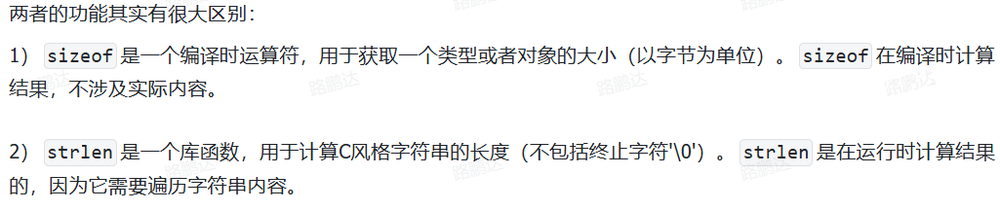

---

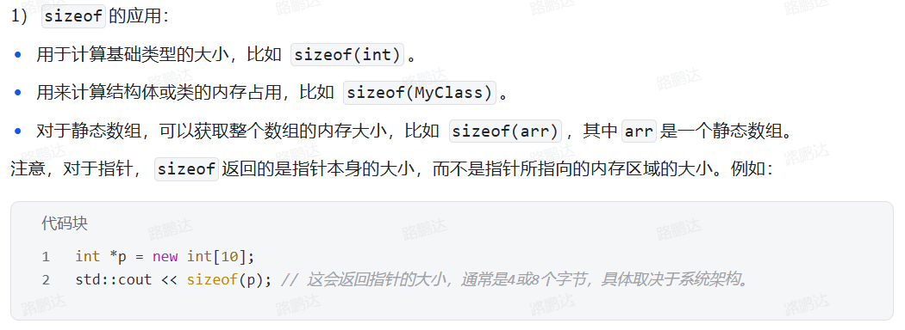

---

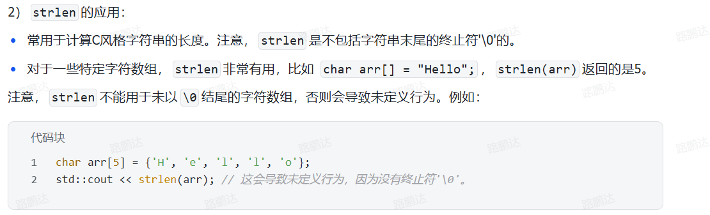

---

```cpp
char a[] = "abc";
char *b = "abc";
char *c[] = {"abc","def"};
char d[3] = {'a','b', 'c'};

// 这四个数据类型分别为：
// A4_c Pc A2_Pc A3_c
// a：字符数组，包含终止符'\0'
// b：字符指针
// c：指针数组，这个数组的每个类型为char*
// d：字符数组，但是缺少了终止符'\0'
```

| 变量 | `sizeof` 输出 | `strlen` 输出 |                             说明                             |
| :--: | :-----------: | :-----------: | :----------------------------------------------------------: |
| `a`  |       4       |       3       |      数组大小为4字节（包含null终止符），字符串长度为3。      |
| `b`  |       8       |       3       |            指针大小为8字节，指向的字符串长度为3。            |
| `c`  |      16       |     无效      | 数组大小为16字节（两个指针），`strlen(c)` 无效（因为 `c` 不是字符串）。 |
| `d`  |       3       |    未定义     |   数组大小为3字节，`strlen(d)` 未定义（缺少null终止符）。    |


## auto和decltype

- auto可以在编译器推导出变量的类型，**并且会忽略引用类型和cv限定（即const和volatile限定）**，一般涉及到引用的时候会定义成`const& a = xxx;`

- decltype用于编译器分析表达式的类型，表达式不会进行运算，**会保留表达式的引用和cv属性**

---

【注意】auto只是推导不出cv限定，但是可以推导出指针的。

```
int a = 5; 
auto *p  = &a; p被推导为什么类型？
```

这里的`p`会被推导为`int*`


## const

tmd你奶奶的，当使用const修饰类对象时，那么会向编译器声明这个对象在整个声明周期都不会改变。

因此调用这个对象的`非constc成员函数`时，会触发编译错误

```c++
#include <iostream>

class T {
public:
    void nonConstFunc() { // 非 const 成员函数
        std::cout << "nonConstFunc() called." << std::endl;
        m_value = 100; // 允许修改成员变量
    }

    void constFunc() const { // const 成员函数
        std::cout << "constFunc() called." << std::endl;
        // m_value = 200; // 错误：不能在 const 成员函数中修改成员变量
    }

private:
    int m_value = 0;
};

int main() {
    const T ob; // 创建一个 const 对象

    // ob.nonConstFunc(); // <-- 这里将导致编译错误！

    ob.constFunc(); // <-- 这个调用是合法的，可以通过编译。

    T nonConstOb; // 创建一个非 const 对象
    nonConstOb.nonConstFunc(); // 合法
    nonConstOb.constFunc();    // 也合法

    return 0;
}
```


## constexpr

该关键词是“常量表达式”（constant expression）的缩写，核心思想是将一些计算从运行时提前到编译时。

如果一个表达式可以在编译期间就被计算出结果，那么他就是常量表达式。用`constexpr`修饰的变量或函数，就是向编译器承诺，**这个变量的值或函数的返回值可以在编译时确定**，编译器会尽力在编译时完成计算，并将结果直接嵌入最终的程序中。

**为什么需要constexpr？**

在 `constexpr` 出现之前，C++ 中定义常量通常使用 `const`。但是 `const` 有一个局限性：它只保证变量是只读的（read-only），但并不保证它的值一定能在编译时确定。

例如：

```
// i 的值在编译时无法确定，因为它依赖于一个函数的运行时返回值
int get_value() { return 5; }
const int i = get_value();

// a 的值可以在编译时确定
const int a = 10;
```

在这里，`i` 是一个 `const` 常量，但它的值需要在运行时调用 `get_value()` 才能确定。而 `a` 的值在编译时就是已知的。

这种不确定性导致 `const` 变量不能用在所有需要“编译期常量”的场景，例如：

- 数组的大小定义
- 非类型模板参数
- 枚举成员的初始值
- `case` 标签

`constexpr` 的出现正是为了解决这个问题。它提供了一种更强的约束，**强制**一个表达式必须在编译期就能被求值。

**`constexpr` 带来的核心好处**：

1. **提升性能**：将计算从运行时转移到编译时，减少了程序运行时的开销。程序启动时，结果已经算好了，直接使用即可。
2. **增强代码能力**：可以在编译期进行更复杂的计算，例如计算斐波那契数列、进行元编程等。
3. **安全性**：编译器会在编译时验证 `constexpr` 表达式是否真的能求值。如果不能，会直接报错，而不是留到运行时出问题。

### `constexpr` 的使用

`constexpr` 可以用于修饰变量、函数（包括构造函数）和 C++17 后的 `if` 语句。

#### a) `constexpr` 变量

`constexpr` 变量必须在定义时就用常量表达式进行初始化。它天生就是 `const` 的。

```c++
constexpr int max_size = 1024;       // OK
constexpr int val = max_size * 2;      // OK, max_size 是常量表达式

int get_runtime_value() { return 10; }
// constexpr int error_val = get_runtime_value(); // 编译错误！
                                                  // get_runtime_value() 不是 constexpr 函数
                                                  // 它的值在编译时无法确定
```

`constexpr` 变量可以被用在所有要求编译期常量的上下文中：

```c++
constexpr int array_size = 10;
int my_array[array_size]; // OK

template<int N>
class MyClass {
    // ...
};
MyClass<array_size> instance; // OK
```

#### b) `constexpr` 函数

`constexpr` 函数是指**可以在编译时执行**的函数。要成为 `constexpr` 函数，它必须满足一些严格的限制。不过这些限制在 C++ 标准的演进中被逐渐放宽。

**核心规则**：当传入 `constexpr` 函数的参数都是常量表达式时，函数的返回值也必须是常量表达式。如果传入的参数是运行时变量，那么它就和普通函数一样，在运行时执行。

**C++11 中的限制 (比较严格)**：

- 函数体必须只有一个 `return` 语句。
- 不能定义变量（`static` 或线程局部变量除外）、不能有循环、`if/switch`（可以使用三元运算符 `?:` 代替）。
- 只能调用其他 `constexpr` 函数。
- 返回值类型必须是字面值类型（Literal Type）。

**示例 (C++11)**:

```c++
#include <iostream>

// C++11 风格的 constexpr 函数，计算阶乘
constexpr long long factorial(int n) {
    return n <= 1 ? 1 : n * factorial(n - 1);
}

int main() {
    // 场景1：在编译时计算
    constexpr long long f5 = factorial(5); // 编译器直接计算出 120
    int arr[factorial(4)];                 // 编译器计算出 24，用于定义数组大小

    std::cout << "Factorial of 5 is: " << f5 << std::endl;
    std::cout << "Size of arr is: " << sizeof(arr) / sizeof(int) << std::endl;

    // 场景2：在运行时计算
    int x = 6;
    long long f6 = factorial(x); // 参数 x 是运行时变量
                                 // factorial(x) 就像一个普通函数一样在运行时被调用
    std::cout << "Factorial of 6 is: " << f6 << std::endl;
    return 0;
}
```

**C++14 及之后的放宽**：

从 C++14 开始，`constexpr` 函数的限制被大大放宽，使其更像一个普通函数。

- 函数体内可以包含多个语句。
- 可以定义局部变量。
- 可以使用 `if`, `switch` 和循环 (`for`, `while`)。

**示例 (C++14)**:

```
// C++14 风格的 constexpr 函数，计算斐波那契数
constexpr int fibonacci(int n) {
    if (n <= 1) {
        return n;
    }
    int a = 0, b = 1;
    for (int i = 2; i <= n; ++i) {
        int temp = a + b;
        a = b;
        b = temp;
    }
    return b;
}

// 在编译时使用
static_assert(fibonacci(10) == 55, "Fibonacci calculation is wrong!");
```

`static_assert` 是一个编译期断言，如果条件为假，程序将无法通过编译。这完美地证明了 `fibonacci(10)` 是在编译时被计算的。

#### c) `constexpr` 构造函数

如果一个类的构造函数被声明为 `constexpr`，那么你就可以在编译时创建这个类的对象。

要成为 `constexpr` 构造函数，它必须：

- 函数体通常为空（C++14 后可以有内容，但必须满足 `constexpr` 函数的规则）。
- 所有成员变量必须通过初始化列表进行初始化，且初始值必须是常量表达式。

**示例**:

```
class Point {
public:
    // constexpr 构造函数
    constexpr Point(double x_val, double y_val) : x(x_val), y(y_val) {}

    constexpr double getX() const { return x; }
    constexpr double getY() const { return y; }

private:
    double x;
    double y;
};

int main() {
    // 在编译时创建一个 Point 对象
    constexpr Point p1(9.0, 1.2);

    // 在编译时调用成员函数，并用其结果初始化一个 constexpr 变量
    constexpr double p1_x = p1.getX();

    int arr[static_cast<int>(p1_x)]; // OK，数组大小在编译时确定为 9
    
    return 0;
}
```


#### d) `constexpr if` (C++17)

C++17 引入了 `if constexpr`，它允许在编译时根据一个常量表达式条件来选择性地编译代码块。这对于编写模板代码特别有用，可以替代复杂的 SFINAE 或模板特化。

```
#include <string>
#include <vector>

template<typename T>
auto get_value_string(const T& value) {
    if constexpr (std::is_pointer_v<T>) {
        // 如果 T 是一个指针类型，这部分代码会被编译
        return get_value_string(*value);
    } else if constexpr (std::is_same_v<T, std::string> || std::is_same_v<T, const char*>) {
        // 如果 T 是字符串类型，这部分代码会被编译
        return value;
    } else {
        // 否则，这部分代码会被编译
        return std::to_string(value);
    }
}
```

在上面的例子中，对于一个给定的类型 `T`，`if constexpr` 的三个分支中只有一个会最终被编译进程序，其他分支会被完全丢弃。这避免了因为类型不匹配而导致的编译错误。

### 总结：`const` vs `constexpr`

| 特性         | `const`                              | `constexpr`                              |
| ------------ | ------------------------------------ | ---------------------------------------- |
| **核心含义** | **只读 (Read-only)**                 | **编译期常量 (Compile-time constant)**   |
| **求值时间** | 可以在运行时求值，也可以在编译时求值 | **必须**在编译时就能求值                 |
| **用途**     | 定义运行时常量、保护数据不被修改     | 定义编译期常量、进行编译期计算、提升性能 |
| **约束**     | 约束较少，只需初始化后不再改变       | 约束严格，初始值/返回值必须是常量表达式  |
| **兼容性**   | `constexpr` 变量天生就是 `const` 的  | `const` 变量不一定是 `constexpr` 的      |

简单来说，当你需要一个**真正的、在编译时就需要知道其值的常量**时（例如数组大小、模板参数），请使用 `constexpr`。当你只是想保证一个变量在初始化后不被修改时，使用 `const` 即可。在现代 C++ 编程中，鼓励尽可能地使用 `constexpr` 来提升代码的性能和稳健性。


## 大端和小端

概念：字节序（endianness）指的是在内存中存储多字节数据类型（例如int, float等），字节的排列顺序，主要有两种字节序，以一个32位十六进制整数`0x12345678`，这个整数包含四个字节：`0x12, 0x34, 0x56, 0x78`

其中，`0x12`是最高有效字节；`0x78`是最低有效字节。

**1.大端字节序（Big-Endian）**

**“所见即所得”**，符合人类的阅读习惯。**高位字节 (MSB) 存储在内存的低地址**，低位字节 (LSB) 存储在内存的高地址。

对于 `0x12345678`：

| 内存地址 | 存储内容 |
| -------- | -------- |
| `0x100`  | `0x12`   |
| `0x101`  | `0x34`   |
| `0x102`  | `0x56`   |
| `0x103`  | `0x78`   |

**记忆方法**：**“大头”在前**，即数据的“大头”（高位字节）放在地址的“开头”（低地址）。

**常见应用**：PowerPC、IBM Z、SPARC 架构以及网络协议（如 TCP/IP）中的网络字节序。

**2. 小端字节序 (Little-Endian)**

**“反向存储”**，与人类的直觉相反。**低位字节 (LSB) 存储在内存的低地址**，高位字节 (MSB) 存储在内存的高地址。

对于 `0x12345678`：

| 内存地址 | 存储内容 |
| -------- | -------- |
| `0x100`  | `0x78`   |
| `0x101`  | `0x56`   |
| `0x102`  | `0x34`   |
| `0x103`  | `0x12`   |

**记忆方法**：**“小头”在前**，即数据的“小头”（低位字节）放在地址的“开头”（低地址）。

**常见应用**：x86、x86-64 架构（Intel、AMD）、ARM 架构（大部分情况下）。我们日常使用的个人电脑绝大多数都是小端模式。

**为什么会有字节序的差异？**

这主要是历史和设计选择的结果。

- **小端模式的优势**：计算机进行数学运算时通常从最低位开始，小端模式下，CPU可以直接从内存低地址开始读取数据进行计算，设计上更方便。例如，类型转换（如从 `int` 转为 `short`）时，只需要截取低地址部分的字节即可。
- **大端模式的优势**：符号位的判断更直接，因为它总是在第一个字节。调试时也更直观，因为内存中的数据排列和我们书写的方式一致。

由于这两种模式并存，当不同字节序的系统进行数据交换时（例如通过网络或文件），就必须约定一种统一的字节序，否则会导致数据解析错误。这就是为什么**网络协议（TCP/IP）规定了统一使用大端字节序（也称为网络字节序）**的原因。

---

使用c判断是不是大端还是小端：

```c
#include <stdio.h>

int main() {
    int num = 1; // 整数 1 在内存中为 0x00000001 (假设32位)
    
    // 将整型指针强制转换为字符指针，
    // char_ptr 指向 num 的起始地址（最低地址）
    char *char_ptr = (char *)&num;

    // 检查这个最低地址上存储的字节内容
    if (*char_ptr == 1) {
        // 如果是 1, 说明最低有效字节 (LSB) 存储在低地址
        printf("当前系统是：小端 (Little-Endian)\n");
    } else {
        // 如果是 0, 说明最高有效字节 (MSB) 存储在低地址
        printf("当前系统是：大端 (Big-Endian)\n");
    }

    return 0;
}
```


## union&int

联合体是C/C++中的一种特殊数据类型，允许在同一内存空间内存储不同的数据类型，所有成员共享同一块内存空间。

```cpp
union {
    int i;       // 占用4字节（32位系统）
    char x[2];   // 占用2字节
} uni;
int main() {
    uni.x[0] = 10;
    uni.x[1] = 1;
    cout << uni.i <<endl;
}
```

这段输出的最后结果是266。

以x86和arm为主的小端序为例：

- 在uni的低位字节分别放置10和1，这两个数是10进制的，那么int的最低两位字节分别为：`0x0A`和`0x01`

- 确定了int的低两位字节后，需要转为int型：

  ```
  // 小端序
  i = 字节0 + 字节1×256 + 字节2×65536 + 字节3×16777216
    = 10 + 1×256 + 随机值1×65536 + 随机值2×16777216
  ```

  **所以得到的最后结果为266**


## extern

该关键词的作用是建立跨文件引用，让编译器知道某个符号是在其他编译单元中定义的，从而在链接阶段解析引用。比如在java/C#中使用extern声明函数，具体的定义在c++中实现。

比如下面两个文件：

```c
两个文件如下 会发生什么呢
// fun.c
#include <stdio.h>
void func_a(int n)
{
	printf("%d",n);

}


// main.c
#include <stdio.h>
extern void func_a(char* str);
int main() {
func_a("hello");
return 0;
}
```

- 编译main阶段：调用`func_a("hello")`时，会检查extern的声明，此时没有问题，并且和声明的形参完全匹配。编译通过。
- 编译fun.c阶段，编译器看到了func_a的定义，没有问题，编译通过。

- 链接阶段：在C语言的默认机制下，链接器只关心函数**名字**是否对得上，它通常**不会去检查参数的类型**是否匹配。
- 运行阶段：`hello`这个参数会首先压入栈中，在调用func函数时，会开辟新的栈帧，然后将实参复制给形参，而传入的实参`hello`是一个字符串，压入栈的其实是他的首地址，比如`0x1000`，然后在复制的过程中发生了**把地址解释成int型的操作**

# 操作符与重载

## 操作符

### 单目运算符

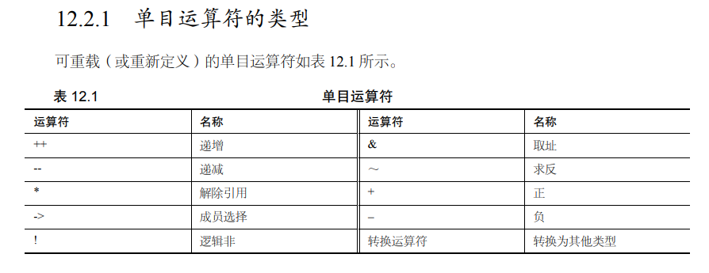


### 双目运算符

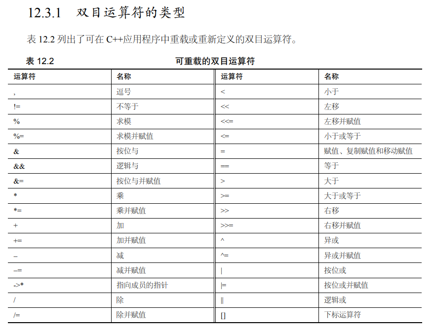


## 运算符重载

运算符重载（operator overloading）允许为类定义的对象定义自定义行为，这样就可以使用常规运算符来执行自定义类的操作。

在 C++ 中，运算符重载（Operator Overloading）允许为自定义类型赋予运算符的特定行为。以下是运算符重载的核心规则、分类及示例：

---

### 一、基本规则
1. **可重载的运算符**  
   C++ 允许重载大部分运算符（如 `+`, `==`, `<<`, `[]`, `()` 等），但以下运算符**不可重载**：
   - `::`（作用域解析）
   - `.*`（成员指针访问）
   - `.`（成员访问）
   - `?:`（三目运算符）
   - `sizeof`、`typeid` 等编译时操作符

2. **重载形式**  
   - **成员函数**：运算符的左操作数是当前类对象（如 `obj + 5`）。
   - **非成员函数**（通常为友元函数）：运算符的左操作数非当前类对象（如 `5 + obj`）。

3. **参数数量**  
   - 一元运算符（如 `++`、`!`）接受 0 个参数（成员函数）或 1 个参数（非成员函数）。
   - 二元运算符（如 `+`、`==`）接受 1 个参数（成员函数）或 2 个参数（非成员函数）。

---

### 二、常见运算符重载示例
#### 1. 算术运算符（`+`, `-`, `*`, `/`）
```cpp
class Vector {
public:
    int x, y;

    // 成员函数形式：实现 obj1 + obj2
    Vector operator+(const Vector& other) const {
        return {x + other.x, y + other.y};
    }

    // 友元函数形式：实现 5 * obj
    friend Vector operator*(int scalar, const Vector& v) {
        return {scalar * v.x, scalar * v.y};
    }
};

// 使用：
Vector v1{1, 2}, v2{3, 4};
Vector v3 = v1 + v2;       // 成员函数调用
Vector v4 = 2 * v1;        // 友元函数调用
```

#### 2. 比较运算符（`==`, `!=`, `<`）
```cpp
class Date {
public:
    int year, month, day;

    bool operator==(const Date& other) const {
        return year == other.year && month == other.month && day == other.day;
    }

    bool operator<(const Date& other) const {
        if (year != other.year) return year < other.year;
        if (month != other.month) return month < other.month;
        return day < other.day;
    }
};

// 使用：
Date d1{2023, 10, 1}, d2{2023, 10, 2};
if (d1 < d2) { /* ... */ }
```

#### 3. 输入/输出运算符（`<<`, `>>`）
```cpp
#include <iostream>
class Student {
public:
    std::string name;
    int age;

    friend std::ostream& operator<<(std::ostream& os, const Student& s) {
        os << "Name: " << s.name << ", Age: " << s.age;
        return os;
    }

    friend std::istream& operator>>(std::istream& is, Student& s) {
        is >> s.name >> s.age;
        return is;
    }
};

// 使用：
Student s;
std::cin >> s;     // 输入
std::cout << s;    // 输出
```

#### 4. 下标运算符（`[]`）
```cpp
class IntArray {
private:
    int data[10];

public:
    // 返回引用以支持修改
    int& operator[](int index) {
        if (index < 0 || index >= 10) throw std::out_of_range("Invalid index");
        return data[index];
    }

    // const 版本
    const int& operator[](int index) const {
        if (index < 0 || index >= 10) throw std::out_of_range("Invalid index");
        return data[index];
    }
};

// 使用：
IntArray arr;
arr[3] = 42;       // 调用非 const 版本
int val = arr[3];  // 调用 const 版本
```

#### 5. 自增/自减运算符（`++`, `--`）
```cpp
class Counter {
private:
    int count;

public:
    // 前缀 ++（返回引用）
    Counter& operator++() {
        ++count;
        return *this;
    }

    // 后缀 ++（int 参数占位符，返回值而非引用）
    Counter operator++(int) {
        Counter temp = *this;
        ++count;
        return temp;
    }
};

// 使用：
Counter c;
++c;    // 前缀
c++;    // 后缀
```

#### 6. 赋值运算符（`=`, `+=`）
```cpp
class String {
private:
    char* buffer;

public:
    // 拷贝赋值
    String& operator=(const String& other) {
        if (this != &other) {  // 防止自赋值
            delete[] buffer;
            buffer = new char[strlen(other.buffer) + 1];
            strcpy(buffer, other.buffer);
        }
        return *this;
    }

    // += 运算符
    String& operator+=(const String& other) {
        // 拼接逻辑
        return *this;
    }
};
```

---

### 三、注意事项
1. **保持语义一致性**  
   - 例如，`operator+` 不应修改操作数，而是返回新对象。

2. **处理自赋值**  
   - 在赋值运算符中检查 `if (this != &other)`。

3. **返回引用还是值**  
   - 赋值类运算符（`=`, `+=`）返回引用以支持链式调用。
   - 算术运算符返回新对象（值类型）。

4. **友元 vs 成员函数**  
   - 当运算符的左操作数不是当前类时（如 `5 + obj`），必须使用友元函数。

---

### 四、特殊运算符
#### 1. 函数调用运算符 `()`
```cpp
class Adder {
public:
    int operator()(int a, int b) const {
        return a + b;
    }
};

// 使用：
Adder add;
int sum = add(3, 4);  // 类似函数调用
```

#### 2. 类型转换运算符
```cpp
class MyInt {
private:
    int value;

public:
    operator int() const {  // 允许隐式转换为 int
        return value;
    }
};

// 使用：
MyInt obj{42};
int x = obj;  // 隐式转换
```

---

### 五、错误示例
#### 1. 不返回引用导致链式调用失败
```cpp
// 错误：返回 void 导致无法链式调用
void operator<<(std::ostream& os, const MyClass& obj) {
    os << obj.data;
}
```

#### 2. 未处理自赋值
```cpp
// 错误：未检查自赋值导致内存泄漏
String& operator=(const String& other) {
    delete[] buffer;  // 如果 other == this，buffer 已被删除
    // ...
}
```

---

### 六、最佳实践
1. **优先实现为成员函数**，除非需要处理左操作数为非类类型的情况。
2. **避免过度使用运算符重载**，确保其行为符合直觉。
3. **为成对运算符提供对称实现**（如 `==` 和 `!=`）。

---

### 总结
运算符重载的核心是为自定义类型赋予直观的操作语义。重点在于：
- 选择成员函数或友元函数的形式。
- 正确处理返回值和参数。
- 遵循语言习惯（如 `operator+` 不修改操作数）。


# 设计模式


# 文件

## 文件写入

```c++
#include <fstream>
int main() {

    ofstream out;
    out.open("./text.txt");
    out << "123" <<  " "<< "hello" <<endl;
    out.close();
}
```


## 1.2二进制文件写入

```c++
#include <iostream>
#include <fstream>
using namespace std;
class CStudent
{
public:
    char szName[20];
    int age;
};
int main()
{
    CStudent s;
    ofstream outFile("students.dat", ios::out | ios::binary);
    while (cin >> s.szName >> s.age)
        outFile.write((char*)&s, sizeof(s));
    outFile.close();
    return 0;
}
```

如果有个字符串s，要保存成二进制文件，需要获取s变量的指针的首地址，然后指定写入长度。


## 1.3获得目录所有文件

- sortfun，根据传输的参数arg1，arg2进行排序，如果是<，则所有的从小到大排；如果是>，则从大到小排。

```c++
void GetFileNames(std::string path, std::vector<std::string> &filenames)
{
    DIR *pDir;
    struct dirent* ptr;
    if(!(pDir = opendir(path.c_str()))){
        std::cout<<"Folder doesn't Exist!"<<std::endl;
        return;
    }
    while((ptr = readdir(pDir))!=0) {
        if (strcmp(ptr->d_name, ".") != 0 && strcmp(ptr->d_name, "..") != 0){
            filenames.push_back(path + "/" + ptr->d_name);
        }
    }
    closedir(pDir);
}
bool sortfun(string str1,string str2)
{
        return str1<str2;
}

int main()
{
        std::vector<std::string> file_name;
        std::string path = "../rgbd/";
        GetFileNames(path, file_name);

        sort(file_name.begin(),file_name.end(),sortfun);
        for(int i = 0; i <file_name.size(); i++)
        {
            std::cout<<file_name[i]<<std::endl;
        }
}
```


# 编译、链接

## 链接

程序生成需要“编译”和“链接”，编译是生成二进制机器码，而链接则是将编译后的obj文件链接起来称为可执行的。

```cpp
#include<iostream>
int multi()
{

}
int hello()
{

}
```

如果只对代码进行编译，则不会有任何问题。但是在build时会出现link的错误，因为没有程序入口，错误如`link1561`.

> 如果是cxxx的错误，则是编译错误，应检查语法

**链接与头文件：**

有三个文件

```cpp
// log.h
void log()
{
cout <<"" <<endl;
}
```

```cpp
// log.cpp
#include <log.h>
void initlog()
{
log();
}
```

```cpp
// main.cpp
#include<iostream>
#include<log.h>
int main()
{

}
```

在经过编译之后，生成的obj文件如下：

```c++
// log.obj
void log()
{
cout <<"" <<endl;
}
void initlog()
{
log();
}
```

```cpp
// main.obj
#include<iostream>
void log()
{
cout <<"" <<endl;
}
int main()
{

}
```

但是在main.obj和log.obj之后都有log函数，在link阶段会出现问题

**如何解决这个问题呢？**

1. 只需要修改log.h

```cpp
// log.h
static void log()
{
cout <<"" <<endl;
}
```

这样，log函数只在对应的obj文件内起作用。其他的obj文件是看不到的，最后链接的时候也就不会出问题。

2. 使用inline

> inline是把对应的函数替换为函数内的语句

```cpp
// log.h
inline void log()
{
cout <<"" <<endl;
}
```

## 库的头文件

在c++工程中，

- 含有main函数的可以生成一个可执行程序的

- 不含有main函数的，编译后被其他程序调用，可以将其打包为库

然后我们会发现，如果编译了opencv的库，不仅会生成系列的动态库，还有头文件，这些头文件的作用只是告诉你有哪些函数可以用，我们可以用`nm libxx.so`查看动态库中的函数，在编译时可以直接链接相应的库，~~没有头文件什么事情，因此头文件只是起到了提示的作用~~或者，换个**场景**：交叉编译的opencv库只需要把so库复制到开发板上就可以了，链接时只需要指定对应的动态库即可，**并不会出现没有头文件导致找不到动态库函数的情况**

在项目中，使用到了一个库的某个对象/函数，需要把这个库的头文件引入进来，这样才能在编译环节展开对应头文件然后找到对应使用的函数，最后才是链接到对应动态库上的函数。

## 程序的组成

程序内存通常分为以下 **5 个核心段**：

| **段名**       | **读写属性** | **存储内容**                                | 典型位置示例        |
| -------------- | ------------ | ------------------------------------------- | ------------------- |
| **代码段**     | 只读         | 程序指令（机器码）                          | `.text` (ELF)       |
| **只读数据段** | 只读         | 常量数据（字符串、全局常量）                | `.rdata`/.`.rodata` |
| **数据段**     | 可读写       | 已初始化的全局变量、静态变量                | `.data`             |
| **BSS 段**     | 可读写       | **未初始化**的全局变量、静态变量（初始为0） | `.bss`              |
| **堆栈段**     | 可读写       | 动态内存（堆）和局部变量（栈）              | `heap`/`stack`      |


## head files

头文件保护符：

> 告诉编译器，这个头文件只被include一次

```
#pragma once
```

```
#ifdef
```

**<>和“”**

区别就是<>引用的是环境里的，而引号引用相对目录里的

```cpp
#include"iostream"
//这样引用的是cpp的标准库
//而c的标准库是带后缀.h的
//为了区别c和cpp 的标准库
```


# 指针

**指针存储的是一个地址，取决于系统的位数。**系统位数越高，寻址空间越大，支持的内存越大。

**指针存储的地址对应内存里的存储空间，这个空间是1个字节。**

一个变量，如类和int等，会在内存中顺序排列。比如一个int型变量，为4个字节，也就是占据了4个内存空间，而指针存储着首地址，在解引用的时候会根据这个类型的指针，自动推算占据的内存空间。所以指针都是存储的地址，但是会有指针类型的概念。

## 定义

指针是一个整数，一个数字，存储着一个内存地址

> ```cpp
> int var = 10;
> void* ptr = &var;
> *ptr = 20;
> ```
>
> 这样是错的，因为ptr指向了一个内存地址，但是void形的，所以编译器不知道要向这个内存地址处写入多少字节的数据

```
double dval; 
double *pd=&dval;
double*pd2=pd;
```

这段c++代码中，pd指什么？

> 这段代码中，pd是一个指向double类型的指针，它指向了dval的地址。也就是说，pd存储了dval的内存位置，你可以通过*pd来访问或修改dval的值。pd2也是一个指向double类型的指针，它被赋值为pd，所以它也指向了dval的地址。你可以通过*pd2来访问或修改dval的值。

**指针声明：**

```cpp
int ival = 1024;
int *p = &ival;
int **p = &p;
// int *p说明p是指针
```

## 数组与指针

```cpp
int ia[] = {0,1,2,3,4,5};
int *ip = ia;
// ip自动指向ia[0]


int *p2 = ip+4;
// p2指向4
```

## 指针+1

```c++
int *sum = new int[10]; // 创建一个动态数组，sum指向第一个元素
for (int i = 0; i < 10; i++) // 用循环给数组赋值
    { sum[i] = i + 1; }
for (int i = 0; i < 10; i++) // 用指针运算输出数组的元素
    { cout << * (sum + i) << " "; }
cout << sizeof(int ) <<endl;
delete [] sum; // 释放数组的内存空间 return 0;
```

输出为：

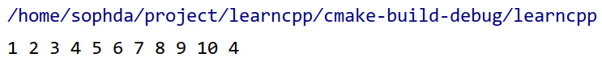

**sum指针指向的是数组的首地址，获取下一个元素只需要sum+1即可。因为指针+1就是默认的下一个该类型元素，会自动执行地址+sizeof(type)这个过程。**


## void型指针

不可以直接对void型指针进行运算

```
void* p = &a;
p++; //这是错误的，需要转换之后才能进行运算
```


## 智能指针

> 智能指针实际上是对传统指针的包装，当创建智能指针时，会调用new并分配内存。在不适用时会自动删除。
>
> 也就是避免了new和delete的过程

### **unique_ptr:**

- 构造

  ```
  std::unique_ptr<T> ptr(new T());       // 从原始指针构造
  auto ptr = std::make_unique<T>(args);  // C++14 起推荐（安全高效）
  ```

- 移动语义（转移所有权）

  ```
  std::unique_ptr<T> ptr2 = std::move(ptr); // 所有权转移
  ```

- 释放资源

  ```
  ptr.reset();             // 释放对象，ptr 置空
  ptr.reset(new T());      // 释放旧对象，管理新对象
  T* raw = ptr.release();  // 释放所有权，返回原始指针（需手动管理）
  ```

- 访问对象

  ```
  T* raw = ptr.get();      // 获取原始指针（不释放所有权）
  T& ref = *ptr;           // 解引用
  ptr->method();           // 成员访问
  ```

  

作用域指针，超出作用域时，会被销毁，然后调用delete

【**warning**】unique_ptr不能够复制，一旦复制，当一个指针被释放，另一个指针会指向被释放的内存。所以叫做unique指针~独一无二的哈~

> unique_ptr是一个显示转换，所以不能用`unique_ptr<Entity> entity=new Enitty()`这种隐式转换
>
> 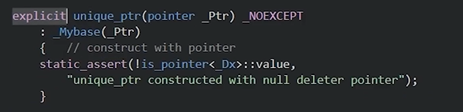

```cpp
class Entity
{
public:
	Entity()
	{}
	~Entity()
	{}
}

int main()
{
	std::unique_ptr<Entity> entity(new Entity());
    // <>内的是模板参数
}
```

```cpp
int main()
{
	std::unique_ptr<Entity> entity = std::make_unique<Entity>();
	// c++14引入，这种构造方式更加安全，不会得到没引用的悬空指针，从而不会造成内存泄露
}
```

---

### **shared_ptr**

>  原理：不同指针之间，存在一个公共的控制块，这个控制块保存着引用计数。当使用`make_shared`创建智能指针时，会创建这个控制块，当指针复制时，会复制这个控制块，同时引用计数+1；

- 构造：

  ```c++
  std::shared_ptr<T> ptr1(new T());      // 不推荐（可能内存泄漏）
  auto ptr = std::make_shared<T>(args);  // 推荐（原子操作更高效）
  std::shared_ptr<T> ptr2(ptr1);         // 拷贝构造（引用计数+1）
  ```

- 引用计数

  ```c++
  long count = ptr.use_count();  // 获取引用计数（调试用）
  bool unique = (ptr.use_count() == 1); // 是否唯一持有者
  ```

- 管理与替换

  ```
  ptr.reset();        // 引用计数-1，若为0则销毁对象
  ptr.reset(new T()); // 替换管理对象
  ```

- 访问对象

  ```
  T* raw = ptr.get(); // 获取原始指针
  if (ptr) { ... }    // 检查是否为空
  ```

- 自定义删除器

  ```
  auto deleter = [](T* p) { delete p; };
  std::unique_ptr<T, decltype(deleter)> ptr(new T(), deleter);
  ```

- 检查是否唯一

  ```c++
  if (sp.unique()) { /* 引用计数为1 */ } // C++20前可用
  ```

通过引用计数，可以跟踪指针有多少引用，一旦引用计数为0，那么就被删除了

> 1. 在unique_ptr中，不直接调用new保证异常安全
> 2. 在shared_ptr中，需要分配另一块内存，叫做控制块，用来存储引用计数，可以用new

```cpp
int main()
{
	std::shared_ptr<Entity> sharedEntity = std::make_shared<Entity>();
	// OR:
	std::shared_ptr<Entity> sharedEntity1(new Entity())
        
    //此时shared_ptr也可以进行复制操作
    std::shared_ptr<Entity> e0 = sharedEntity;
}
```

```cpp
int main()
{
	{
	std::shared_ptr<Entity> e0;//执行完这句，创建了Entity类的空指针，没有执行构造函数
	{
	std::shared_ptr<Entity> sharedEntity = std::make_shared<Entity>();//执行这句，在堆上新建了Entity对象（执行构造函数），然后返回类的指针给sharedEntity
	e0 = sharedEntity; //将共享指针复制
	} //{}作用域内执行完毕，在{}的变量销毁，sharedEntity会被销毁，还保留e0，shared_ptr的引用数为1
	} //执行完后，e0被销毁，shared_ptr应用数为0，指针对象执行析构函数
}
```

[创建和使用shared_ptr的方法有以下几种](https://learn.microsoft.com/en-us/cpp/cpp/how-to-create-and-use-shared-ptr-instances?view=msvc-170)[1](https://learn.microsoft.com/en-us/cpp/cpp/how-to-create-and-use-shared-ptr-instances?view=msvc-170)[2](https://www.nextptr.com/tutorial/ta1358374985/shared_ptr-basics-and-internals-with-examples)[3](https://en.cppreference.com/w/cpp/memory/shared_ptr)：

- 使用make_shared函数创建shared_ptr。这种方法是异常安全的，它使用同一个调用来分配控制块和资源的内存，从而减少了构造开销。例如：`auto sp = make_shared<int>(42);`
- 使用new运算符创建shared_ptr。这种方法需要显式地指定要管理的对象类型，并且可能抛出异常。例如：`auto sp = shared_ptr<int>(new int(42));`
- 使用现有的shared_ptr或weak_ptr来初始化或赋值shared_ptr。这种方法会增加共享所有权的计数，并且可以实现别名构造，即让一个shared_ptr拥有另一个对象的所有权信息，但持有不相关的指针。例如：`auto sp1 = make_shared<int>(42); auto sp2 = sp1; auto sp3 = shared_ptr<int>(sp1, &x);`
- 使用unique_ptr或其他智能指针来初始化或赋值shared_ptr。这种方法会转移所有权，并且可以指定自定义删除器。例如：`auto up = unique_ptr<int>(new int(42)); auto sp = shared_ptr<int>(move(up));`

使用shared_ptr时，可以通过解引用运算符（*）或箭头运算符（->）来访问其所管理的对象，也可以通过get()函数来获取原始指针，或者通过use_count()函数来获取共享所有权的数量。

---

### **weak_ptr**

- 构造

  ```
  std::weak_ptr<T> weak(shared_ptr); // 从 shared_ptr 创建
  ```

- 检查有效性

  ```
  if (auto locked = weak.lock()) { 
    // 对象存活，locked 是 shared_ptr
  } else {
    // 对象已被销毁
  }
  ```

- 检查是否被销毁

  ```
  bool expired = weak.expired(); // 检查对象是否被销毁
  ```

- 提升为shared_ptr

  ```
  std::shared_ptr<T> sp = weak.lock(); // 尝试提升为 shared_ptr
  ```

  

本身不拥有对象的所有权，也不会增加所指对象的引用计数，主要解决的是shared_ptr的**循环引用问题**，可以看成对shared_ptr的观察者。

【warning】不能直接从原始指针或者`unique_ptr`构造

`weak_ptr<Myclass> wp1(make_shared<Myclass>(...));`

- `wp1.reset()`表示将`weak_ptr`置空，不再观察任何对象

- `wp1.lock()`尝试将弱引用提升为强引用`shared_ptr`,如果关联的`shared_ptr`管理的对象还有效，则返回一个新的有效的`shared_ptr`

  如果是已经释放的shared_ptr，则返回空指针。

- `wp1.expired()`检查观察的对象是否被释放，等价于检查`lock()==nullptr`


---

## 显式和隐式转换

1. 显式转换（Explicit Conversion）：
   显式转换是由程序员明确指定要进行类型转换的代码。它需要使用类型转换运算符（如static_cast、dynamic_cast、const_cast和reinterpret_cast）来执行转换。显式转换可以在任何情况下进行，包括非法的类型转换。例如：

   ```
   int a = 10;  
   double b = static_cast<double>(a);  // 显式地将int转换为double
   ```

2. 隐式转换（Implicit Conversion）：
   隐式转换是由编译器自动进行的类型转换，无需程序员显式指定。这种转换通常发生在赋值操作、函数调用、表达式计算等场景中。隐式转换通常要求转换后的类型与原始类型兼容，并且不会导致数据丢失或不可预测的行为。例如：

```cpp
int a = 10;  
double b = a;  // 隐式地将int转换为double
```

在上述示例中，变量a的类型是int，变量b的类型是double。在将a赋值给b时，编译器会自动将int类型的a隐式地转换为double类型，并将结果赋值给变量b。

总结：
显式转换和隐式转换的主要区别在于是否由程序员明确指定要进行类型转换。显式转换需要使用特定的类型转换运算符，而隐式转换则由编译器自动完成。在使用显式转换时，程序员应该清楚地知道正在进行的类型转换是否合法和预期的，而在使用隐式转换时，编译器会根据需要进行适当的类型转换。

## 上行转换和下行转换

其实：

- 上行转换就是子类向基类转换
- 下行转换就是基类向子类转换


## 类型转换（各种cast）

> 可以看成，将c语言中的类型强转拆分成为4个cast

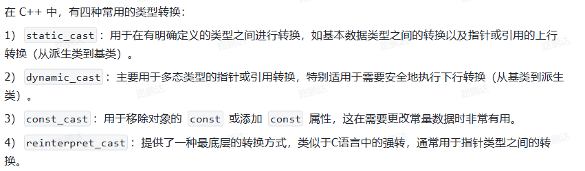

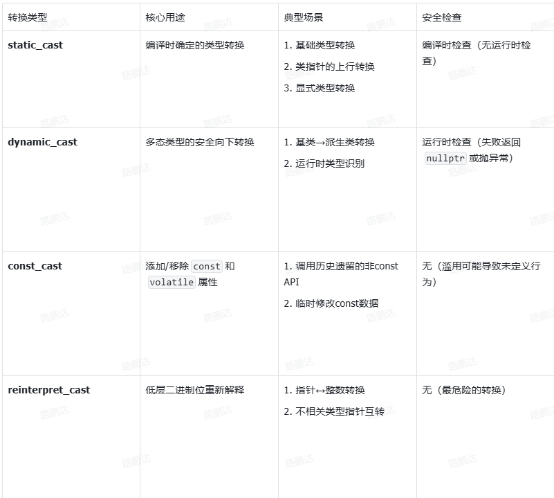


### static_cast

编译器检查、运行时不检查

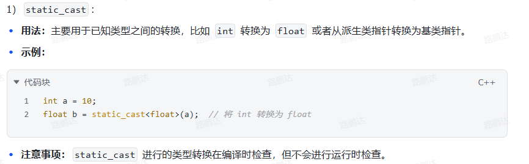


### dynamic_cast

运行时检查，类包含虚函数可行

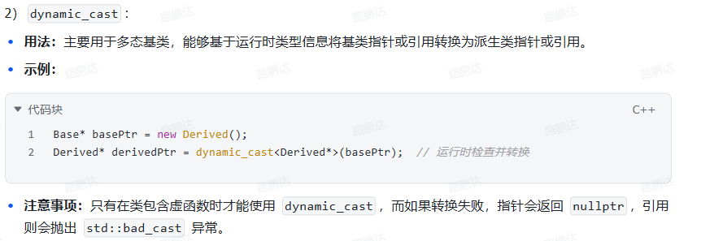

### const_cast

谨慎使用

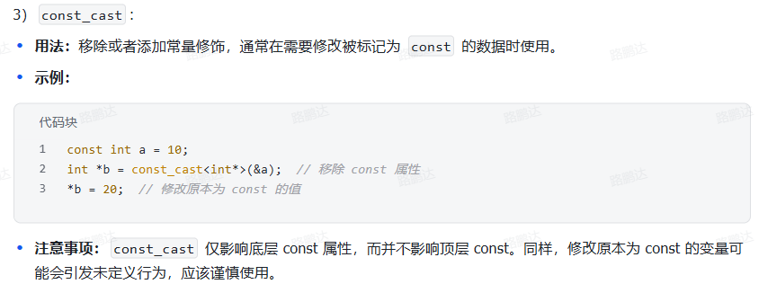

### reinterpret_cast

这个的作用是重新解释，也就是对一块内存区域重新解释含义，并不修改内存区域的值。

有什么用捏？

- 比如写的是数据库或者网络协议栈，可能原始数据都是字节流，比如用unsigned char []来接收那个字节流，那么在解码的时候就需要根据额外的信息（比如规定这个数据的类型，类的结构等）来推断这个字节流表示的是什么数据类型
- 修改指针的类型

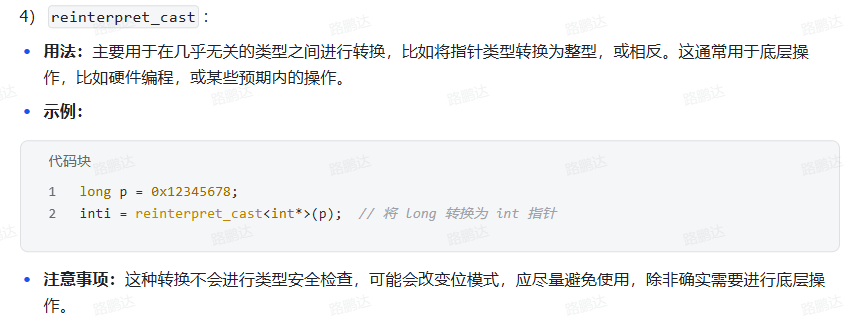

# 引用

**总结一下自己使用引用的经验：一般在使用函数的时候定义引用实参，替代指针这样可以直接在函数内修改外部的变量。不要在返回的时候使用引用，会导致悬垂引用**

```
int main()
{
	int a = 5;
	int b = 8;
	int* ref = &a;
	ref = 
}
```

c++中增加了一种**给函数传递地址的途径**，就是按引用传递，也存在于其他语言中

引用的本质是取别名

int &b = a; //给a取别名为b   &在左边为**取别名**，在右边为**地址**

**引用初始化之后不能改变**

**1.给数组取别名**

```c
int a[5] = [1,2,3,4,5];
int (&array) = a;  //给a取别名为array
//也可以：
int a[5] = [1,2,3,4,5];
typedef int ARR[5];
ARR & arr = a;
```

**2.函数引用**(通过传递引用，可以访问到参数的地址，进而改变调用函数的值)

```c
函数引用
void swap(int &x , int &y) //引用的方式 ，即int &x = a , int &y = b
{
    int tem = x;
    x = y;
    y = tmp;
}
void main()
{
    int a=10;
    int b=20;
    swap(x,y); //实现x，y的交换

}
// 通过引用改变了xy的
```

```c
函数引用返回：
int & test()
{
    static int b = 100;
    int a = 10;
    return a ; //是错误的  不能返回局部变量的应用
    return b； //可以返回静态的变量引用
}
```

**3.传递指向指针的引用**

```cpp
void ptrswap(int *&v1,int *&v2)
{
    int *tmp = v2;
    v2 = v1;
    v1 = tmp;
}
// 作用是使用“指向指针的引用”来交换两个指针
```


## 左值引用

```c++
// 定义函数
int add(int a, int b)
{
  int c = a+b;
  return c;
}

```

其中add返回的是值，也就是把add看成是1、2、3这样的数字，因此，如果要对add返回的值进行引用，要使用**右值引用**或者**const修饰的左值引用（用于延长add作用域的生命周期，与引用一样的生命周期）**，如下方法是可行的：

```c++
int a = add(1, 2);    // 合法：将右值拷贝到左值 `a`
int& b = add(1, 2);   // 非法！右值无法绑定到非 const 左值引用
const int& c = add(1, 2); // 合法：const 左值引用可以绑定到右值（生命周期被延长）
int&& d = add(1, 2);  // 合法：右值引用可以绑定到右值
```

---


要注意一种**不可行的情况**：

```c++
int& add(int a, int b) {
    int c = a + b;  // c 是局部变量，函数结束后会被销毁
    return c;        // 返回 c 的引用（错误！）
}
```

这样子是返回的c的引用，但是当add执行完之后，会释放c的内存空间，导致**悬垂引用**

这时无论怎么延长生命周期也不管用：

```c++
const int & a = add(5,6);
```

因为函数中的a，b都是临时变量。

---

```c++
int& add(int & a, int b) {
    a = a + b;  // c 是局部变量，函数结束后会被销毁
    return a;        // 返回 c 的引用（错误！）
}

    int c= 15;
    int &a = add(c,6);
    printf("%d",a);
```

这种情况倒是可以的。

# 函数

## 函数重载

函数的名字是可以重名的，也就是可以有多个相同函数名的函数存在，名字相同，意义不同

条件：

**1.参数个数不同  调用相应的函数**

**2.参数类型不同**

**3.参数顺序不同**

**函数返回值不能作为函数重载的条件**


## 函数传递vector

c++中常用的[vector](https://so.csdn.net/so/search?q=vector&spm=1001.2101.3001.7020)容器作为参数时，有三种传参方式，分别如下（为说明问题，用二维vector）：

- function1(std::vector<std::vector > vec)，传值
- **function2(std::vector<std::vector >& vec)，传引用**
- function3(std::vector<std::vector >* vec)，传指针

三种方式对应的调用形式分别为：

- function1(vec)，传入值
- **function2(vec)，传入引用**
- function3(&vec), 传入地址

> 1. 传入值是传入的形参，对实参本身不会造成影响
> 2. 传入引用是传入的变量的别名，可以改变原参数的值。与传值相比，可以节省开支
> 3. 传入指针：在函数内部的栈内可以直接修改原来的参数
>
> 传入参数要进行操作，所以一定要初始化

```cpp
#include <iostream>
#include <vector>

using namespace std;

void function1(std::vector<std::vector<int> > vec)
{
    cout<<"-----------------------------------------"<<endl;
    //打印vec的地址
    cout<<"function1.&vec:"<<&vec<<endl;
    //打印vec[i]的地址（即第一层vector的地址）
    cout<<"function1.&vec[i]:"<<endl;
    for(int i=0;i<2;i++)
        cout<<&vec[i]<<endl;
    //打印vec的各元素地址
    cout<<"function1.&vec[i][j]:"<<endl;
    for(int i=0;i<2;i++)
    {
        for(int j=0;j<3;j++)
            cout<<&vec[i][j]<<" ";
        cout<<endl;
    }
    cout<<"---------------------------"<<endl;
    //打印vec的各元素值
    cout<<"function1.vec[i][j]:"<<endl;
    vec[0][0] = 10000;//进行修改的
    for(int i=0;i<2;i++)
    {
        for(int j=0;j<3;j++)
            cout<<vec[i][j]<<" ";
        cout<<endl;
    }

}
void function2(std::vector<std::vector<int> >& vec)
{
    cout<<"-----------------------------------------"<<endl;
    //打印vec的地址
    cout<<"function2.&vec:"<<&vec<<endl;
    //打印vec[i]的地址（即第一层vector的地址）
    cout<<"function2.&vec[i]:"<<endl;
    for(int i=0;i<2;i++)
        cout<<&vec[i]<<endl;
    //打印vec的各元素地址
    cout<<"function2.&vec[i][j]:"<<endl;
    for(int i=0;i<2;i++)
    {
        for(int j=0;j<3;j++)
            cout<<&vec[i][j]<<" ";
        cout<<endl;
    }
    cout<<"---------------------------"<<endl;
    //打印vec的各元素值
    cout<<"function2.vec[i][j]:"<<endl;
    vec[0][0] = 10000;//进行修改的
    for(int i=0;i<2;i++)
    {
        for(int j=0;j<3;j++)
            cout<<vec[i][j]<<" ";
        cout<<endl;
    }

}
void function3(std::vector<std::vector<int> > *vec)
{
    cout<<"-----------------------------------------"<<endl;
    //打印vec的地址
    cout<<"function3.&vec:"<<vec<<endl;
    //打印vec[i]的地址（即第一层vector的地址）
    cout<<"function3.&vec[i]:"<<endl;
    for(int i=0;i<2;i++)
        cout<<&(*vec)[i]<<endl;
    //打印vec的各元素地址
    cout<<"function3.&vec[i][j]:"<<endl;
    for(int i=0;i<2;i++)
    {
        for(int j=0;j<3;j++)
            cout<<&(*vec)[i][j]<<" ";
        cout<<endl;
    }
    cout<<"---------------------------"<<endl;
    //打印vec的各元素值
    cout<<"function3.vec[i][j]:"<<endl;
    (*vec)[0][0] = 10000;//进行修改的
    for(int i=0;i<2;i++)
    {
        for(int j=0;j<3;j++)
            cout<<(*vec)[i][j]<<" ";
        cout<<endl;
    }
}

int main()
{
    //创建2*3的vector容器v,初始值均初始化为0 1 2 1 2 3
    std::vector<std::vector<int> > v(2,std::vector<int>(3,0));
    for(int i=0;i<2;i++)
    {
        for(int j=0;j<3;j++)
            v[i][j]=i+j;
    }

    //打印v的地址
    cout<<"&v:"<<&v<<endl;
    //打印v[i]的地址（即第一层vector的地址）
    cout<<"&v[i]:"<<endl;
    for(int i=0;i<2;i++)
        cout<<&v[i]<<endl;
    //打印v的各元素地址
    cout<<"&v[i][j]:"<<endl;
    for(int i=0;i<2;i++)
    {
        for(int j=0;j<3;j++)
            cout<<&v[i][j]<<" ";
        cout<<endl;
    }

    cout<<"---------------------------"<<endl;
    //打印v的各元素值
    cout<<"v[i][j]:"<<endl;
    for(int i=0;i<2;i++)
    {
        for(int j=0;j<3;j++)
            cout<<v[i][j]<<" ";
        cout<<endl;
    }

    function1(v);

    cout<<"---------------------------"<<endl;
    //打印v的各元素值
    cout<<"v[i][j]:"<<endl;
    for(int i=0;i<2;i++)
    {
        for(int j=0;j<3;j++)
            cout<<v[i][j]<<" ";
        cout<<endl;
    }


    function2(v);

    cout<<"---------------------------"<<endl;
    //打印v的各元素值
    cout<<"v[i][j]:"<<endl;
    for(int i=0;i<2;i++)
    {
        for(int j=0;j<3;j++)
            cout<<v[i][j]<<" ";
        cout<<endl;
    }

    function3(&v);
    cout<<"---------------------------"<<endl;
    //打印v的各元素值
    cout<<"v[i][j]:"<<endl;
    for(int i=0;i<2;i++)
    {
        for(int j=0;j<3;j++)
            cout<<v[i][j]<<" ";
        cout<<endl;
    }

    return 0;
}


```

## 内联函数

```c
inline int add(int a,int b)
{
    return a+b;
}
//定义内联函数
void main()
{
    int a=5,b=5;
    c = add(a,b)*5; //替换发生在编译阶段
}
```

- 内联函数省去了函数调用时的压栈，跳转，返回的开销
- 可以理解为用空间换时间


## lambda函数

创建匿名函数对象，也称为闭包的方式。

```
[capture-list] (parameters) -> return-type { 
    // function body 
}
```

1. **`[capture-list]` （捕获列表）：**
   - 这是 lambda 的核心机制，决定了 lambda **如何访问其定义范围（外围作用域）内的变量**。
   - 捕获方式：
     - **`[]`:** **不捕获任何外部变量**。只能使用 lambda 自身的参数和在 lambda 内部定义的局部变量。
     - **`[var]`:** **值捕获**。捕获变量 `var` 的一个 **副本**。在 lambda 内部对该变量的修改不影响外部原始变量。
     - **`[&var]`:** **引用捕获**。捕获变量 `var` 的 **引用**。在 lambda 内部对变量的修改直接影响外部原始变量。
     - **`[=]`:** **隐式值捕获**。捕获所有外部变量（**在 lambda 被定义时**存在的且 **需要使用的**）的值副本。等价于在 `[]` 中显式列出所有需要用到的变量并用 `[var]` 方式捕获。
     - **`[&]`:** **隐式引用捕获**。捕获所有外部变量（**在 lambda 被定义时**存在的且 **需要使用的**）的引用。等价于在 `[]` 中显式列出所有需要用到的变量并用 `[&var]` 方式捕获。
     - **`[this]`:** 捕获当前类对象的指针 `this`。允许在 lambda 内部访问该对象的成员变量和成员函数（即使它们是 `private` 的）。
     - **混合捕获:** 如 `[x, &y]`（值捕获 `x`，引用捕获 `y`）、`[=, &z]`（隐式值捕获所有，但显式引用捕获 `z`）、`[&, a]`（隐式引用捕获所有，但显式值捕获 `a`）。
     - **初始化捕获 (C++14):** `[var = expression]` 或 `[&ref = expression]`。创建一个新的成员变量 `var`/`ref` 并**用表达式 `expression` 初始化它**，而不是捕获外部同名变量。`expression` 可以是不在捕获范围内的东西（如右值、新对象）。特别强大用于移动捕获 (`[var = std::move(other_var)]`) 或初始化“仅用于 lambda”的状态。
2. **`(parameters)` （参数列表）：**
   - 与普通函数的参数列表语法完全相同。指定 lambda 调用时需要接收的参数。
   - 可以为空 `()`，表示不接受任何参数。
   - 可以使用 `auto` 作为参数类型（C++14 起），实现泛型 lambda。
3. **`-> return-type` （返回类型）：**
   - **可选**。显式指定 lambda 表达式的返回类型。
   - 如果省略：
     - `return` 语句类型一致：编译器自动推导返回类型。
     - 没有 `return` 语句 或 `return` 语句返回 `void`：返回类型被推导为 `void`。
     - `return` 语句类型不一致（错误）：需要显式指定。
   - **注意:** `-> return-type` 需要写在参数列表之后，`{}` 之前，不能放在其他地方。如果 `return-type` 是 `void` 且 lambda 体只有单个 `return;` 语句或无 `return`，可以省略 `-> void`。
4. **`{ function-body }` （函数体）：**
   - 包含了 lambda 被执行时运行的代码块。
   - 可以使用捕获列表中捕获的变量和传递进来的参数。

**简单示例：**

```cpp
// 1. 最简单的 lambda: 无捕获、无参数、返回 void、打印一句话
auto greet = [] { std::cout << "Hello, Lambda!" << std::endl; };
greet(); // 输出: Hello, Lambda!

// 2. 带参数和返回值的 lambda (显式指定返回类型)
auto add = [](int a, int b) -> int { return a + b; };
int sum = add(5, 3); // sum = 8

// 3. 值捕获示例
int x = 10;
auto copyX = [x] { std::cout << "Inside lambda, x (captured by value) = " << x << std::endl; };
x = 20;
copyX(); // 输出: Inside lambda, x (captured by value) = 10 （外部修改不影响内部副本）

// 4. 引用捕获示例
auto refX = [&x] { std::cout << "Inside lambda, x (captured by ref) = " << x << std::endl; };
x = 30;
refX(); // 输出: Inside lambda, x (captured by ref) = 30 （外部修改反映在内部引用）

// 5. 在 STL 算法中使用 lambda (最常见场景)
std::vector<int> nums = {1, 2, 3, 4, 5};
// 使用 lambda 作为谓词进行过滤 (找出偶数)
auto isEven = [](int n) { return n % 2 == 0; };
auto evenEnd = std::remove_if(nums.begin(), nums.end(), isEven); // 移除非偶数
nums.erase(evenEnd, nums.end());
// 现在 nums 包含: 2, 4

// 使用 for_each 遍历并修改 (引用捕获)
std::for_each(nums.begin(), nums.end(), [](int& n) { n *= n; }); // 平方每个元素
// 现在 nums 包含: 4, 16

// 6. 泛型 lambda (C++14) - 使用 auto 参数
auto genericMultiply = [](auto a, auto b) { return a * b; };
double dResult = genericMultiply(2.5, 3.0); // 7.5
int iResult = genericMultiply(2, 4); // 8

// 7. 初始化捕获 (C++14) - 移动捕获示例
std::unique_ptr<MyClass> ptr = std::make_unique<MyClass>();
auto lambdaWithResource = [myPtr = std::move(ptr)] { // 移动ptr到lambda内部
    if (myPtr) myPtr->doSomething();
}; // ptr 现在为 nullptr (所有权转移给 lambda)
```

---

**【warning】**如果用lambda捕获一个shared_ptr，会发生什么呢？

```cpp
std::weak_ptr<connection> weak = shared_from_this(); // ① 创建弱引用
asio::post(socket_.get_executor(), [this, weak, sp_data, req_id, req_type] {
    auto conn = weak.lock(); // ② 尝试获取对象的强引用
    if (conn) { 
        // ③ 对象存活：执行响应操作（在 IO 线程中安全操作 socket_）
        response_interal(req_id, std::move(sp_data), req_type);
    }
    // 若 conn 为空，忽略操作（对象已销毁）
});
```

- 这是一个异步编程，通过asio::post提交任务的函数，在lambda中有要捕获的参数列表
- lambda捕获一个`shared_ptr`时，在lambda表达式创建的那一刻就会捕获变量（而不是在执行的时候），因此原始的shared_ptr引用计数会+1
- 这里捕获的是`weak_ptr`，不会导致原来的`sharedptr`+1，但是在lambda表达式的内部有`weak_ptr.lock()`，这也会导致原来的`shared_ptr`+1，但是区别是：定义在lambda内部，表明这个函数已经执行了，conn对象在lambda执行完后即可释放
- 如果捕获的是`shared_ptr`，在表达式创建的时候原来的`shared_ptr`会+1，即使这个lambda表达式在队列中永远没有执行，但是只要存在队列中，内部捕获的`shared_ptr`副本就会一直存在，导致原来的connection对象引用计数一直维持，无法释放。

# 类

## 定义

> 类与结构体的区别：
>
> 类可以指定成员是否可以被访问
>
> 使用public、private等关键词

1. 引用和类对象结合

   ```cpp
   class Player
   {
   public: 
   	int x,y;
   	int speed;
   };
   void move(Player& player,int x)
   {
   player.x = x;
   }
   ```

   **这里move函数传入了类Player的对象的引用**，相当于传入了一个实例化的player的别名（reference）

```cpp
class Entity
{
public:
	void move();
}
class player : public Entity
{
public: 
	int x;
	
}
int main()
{
	Player player;
	player.move();
	player.x = 5;
}

// player对象继承了父类entity的所有内容
```

```cpp
class example
{
private:
	int x,y,z;
	std::string m_Name;
public:
	example()
		// 这是初始化的操作
		:x(0),y(0),z(0),m_Name("hello")
		{
		
		}
}
```

但是，但我们将初始化不用：表示时，

```cpp
class example
{
private:
	int x,y,z;
	std::string m_Name;
	// 在这里构造了一次
public:
	example()
		// 这是初始化的操作
		:x(0),y(0),z(0)
		{
		m_Name = "hello";
		//不用：进行初始化，这里会把上面初始化的删除，
		// 然后再用“hello”覆盖掉上面的
		// 所以是构造了两次，浪费了性能
		}
}
```

## 和struct的区别

主要区别是默认访问级别：

- struct的默认成员为public
- class默认成员为private


## NEW

new其实就是告诉计算机开辟一段新的空间，但是和一般的声明不同的是，**new开辟的空间在堆上，而一般声明的变量存放在栈上**。通常来说，当在局部函数中new出一段新的空间，该段空间在局部函数调用结束后仍然能够使用，可以用来向主函数传递参数。另外需要注意的是，**new的使用格式，new出来的是一段空间的首地址**。

```cpp
因为new出来的时首地址，所以一般搭配着指针使用：
Person* pp1( new Person{30,40} );
///////////////////////////
pcl::PointCloud<pcl::PointXYZRGB>::Ptr cloud(new pcl::PointCloud<pcl::PointXYZRGB>);
```

使用`new`关键字来初始化对象：

### 类对象指针

```cpp
Person* pp1( new Person{30,40} );
// 此时pp1是指向类对象的一个指针
pp1->age;
(*pp1).age;
//可用这两种方法来查看类成员变量；
```

### 常规初始化

```cpp
Person pp1 = new Person{30,40};
// Person pp1( new Person{30,40} )；这样是错误的写法
```

> new 关键词返回指针！！！

```cpp
class Entity
{
public:
	Entity()
	{}
}

int main()
{
	Entity* entity = new Entity();
	// 这句话会执行类的初始化
    Entity* b = (Entity*)malloc(sizeof(Entity))
    // 仅仅申请Entity大小的空间，b指向这段空间。没有初始化过程
}
            
```


## protected、public、private

有public, protected, private三种继承方式，它们相应地改变了基类成员的访问属性。

**1.public继承：**基类public成员，protected成员，private成员的访问属性在派生类中分别变成：public, protected, private

**2.protected继承：**基类public成员，protected成员，private成员的访问属性在派生类中分别变成：protected, protected, private

**3.private继承：**基类public成员，protected成员，private成员的访问属性在派生类中分别变成：private, private, private

**总结表 1: 成员访问权限**

| 访问位置                | `public` 成员 | `protected` 成员 | `private` 成员 |
| ----------------------- | ------------- | ---------------- | -------------- |
| **类的内部**            | ✅ 可访问      | ✅ 可访问         | ✅ 可访问       |
| **派生类的内部**        | ✅ 可访问      | ✅ 可访问         | ❌ **不可访问** |
| **类的外部 (通过对象)** | ✅ 可访问      | ❌ **不可访问**   | ❌ **不可访问** |


---

## private对象访问

### 允许访问的场景

1. **通过公有成员函数访问**（标准做法）

   ```cpp
   class MyClass {
   private:
       int secret;
   public:
       void setSecret(int value) { secret = value; } // 公有方法修改私有变量
       int getSecret() const { return secret; }      // 公有方法读取私有变量
   };
   
   int main() {
       MyClass obj;
       obj.setSecret(10);         // 合法：通过公有函数间接访问
       int val = obj.getSecret(); // 合法
       return 0;
   }
   ```

2. **友元函数/类**（谨慎使用）

   ```cpp
   class MyClass {
   private:
       int secret;
       friend void hack(MyClass&); // 声明友元
   };
   
   void hack(MyClass& obj) {
       obj.secret = 42; // 友元可直接访问私有成员
   }
   ```

------

### 重要细节

- **同类对象间的访问**：
   类成员函数中可访问**其他同类对象**的私有成员：

  ```cpp
  class MyClass {
  public:
      void copySecret(const MyClass& other) {
          this->secret = other.secret; // 合法：同类型对象的私有成员互访
      }
  private:
      int secret;
  };
  ```

- **访问控制基于类而非对象**：
   如上例所示，同类对象的私有数据在成员函数中无访问壁垒。

------

### 总结

| 访问方式                 | 是否合法 | 说明               |
| ------------------------ | -------- | ------------------ |
| `obj.privateVar`         | ❌ 非法   | 外部直接访问       |
| 内部成员函数访问         | ✔️ 合法   | 类内无限制         |
| 公有成员函数间接访问     | ✔️ 合法   | 推荐做法（封装性） |
| 友元函数                 | ✔️ 合法   | 打破封装（慎用）   |
| 同类对象在成员函数中访问 | ✔️ 合法   | 类作用域内权限共享 |


## 构造函数

1. 有参构造

2. 无参构造

3. 拷贝构造

   拷贝构造函数是向另一个类赋值的时候调用的。

   ```c++
   class Person{
   	Person(const Person &p){
   	
   	}
   }
   ```

   拷贝构造有要注意`const Person &p`：（常量引用）

   - const:表明传入进来的值是不变的
   - 声明的是一个引用，如果是Person(Person p)的话，那么如果执行构造的话，如：Person p1; Person a(p1); 形参会先生成一个p的对象，然后将p1赋值给p，但是这个时候又会调用p对象的拷贝构造函数，这样就会一直迭代下去。


## 函数传参

函数传参默认的是**拷贝语义**，也就是在传参的时候，会生成一个临时变量。

```c++
class B {};

B func_a(B b){
    return b;
}
// 这里在函数传参的时候，拷贝语义，执行了 B b = 传入进来的b; 执行了B的拷贝构造函数
// 在函数返回的时候，同样将b拷贝给一个临时变量，B 返回b = b，再执行一次B的拷贝构造


B func_a(){
    B b;
    return b; //类构造在函数内部，编译器可以直接构造b到调用处，避免拷贝
}
// 区别于上面的，当类的实例化写在函数里面时，会执行“构造函数”，在返回的时候，由于编译器优化，即“编译器优化返回值RVO”，直接将b构造到拷贝处，避免了返回值的临时对象构造。


B fun_b(B &b){
    return b;
}
// 函数传参时拷贝语义，那么在传参时会执行：B &b = 传进来的b;也就是仅仅定义了一个引用值，没有执行 对象的拷贝。这里参考一下类的拷贝构造定义，形参也是一个引用，也就是无法触发拷贝构造，进而避免死循环

B& fun_c(){}
// 尽量避免，返回的引用要是没有const延长变量生命周期，会造成悬垂引用
```


## ::

双冒号 :: 操作符被称为域操作符(scope operator)，含义和用法如下：

- 在类外部声明成员函数。void
  Point::Area(){};

- 调用全局函数；表示引用成员函数变量及作用域，作用域成员运算符
  例：System::Math::Sqrt() 相当于System.Math.Sqrt()。

- 调用类的静态方法：
  如：CDisplay::display()。
  把域看作是一个可视窗口全局域的对象在它被定义的整个文件里，一直到文件末尾都是可见的。在一个函数内被定义的对象是局域的（local scope），
  它只在定义其的函数体内可见。每个类维持一个域，在这个域之外 ，它的成员是不可见的。类域操作符告诉编译器后面的标识符可在该类的范围内被找到。

**2 类的初始化，非静态成员的初始化**

与类同名的函数是构造函数，用于初始化类

```cpp
class     Person 
{
public:
    void showw();
    int num;
    int num2;
    Person(int num1, int num2)
        :num{ 1 }, num2{3}
    {
        //类的初始化
    }
};
```

```cpp
#include<iostream>
using namespace std;
class Person
{
    public :
        void showw()
            {}
        int num;
        int num2;
        Person (int x,int y)
            :num{x},num2{y}
            {
                //类的初始化，在初始化时进行
                cout <<"初始化成功"<<endl;
                cout << num <<" "<< num2 <<endl;
            }
}


int main()
{
    Person p1{1,2}
}
```


**3  委托函数**

使用函数重载，参数不同进行委托，不同的参数使用不同函数进行初始化

```cpp
#include<iostream>
using namespace std;
class    Person 
{
public:
        void showw()
        {
        }
        int num;
        int num2;
        Person(int x)
                :Person {20, 10}  //委托函数
        {
                //函数重载，一个参数
        }
        Person(int x, int y)
                :num{ x}, num2{y}
        {
                //类的初始化,初始化时执行
                cout << "初始化成功" << endl;
                cout << num <<"    "<< num2 << endl;
        }
};
int main()
{
        Person  p1{50,60}; //初始化类
        Person p2{2};  //调用委托函数
}
```

**4 析构函数**

**析构函数**是另一个特殊的类的成员函数的时那个类的一个对象被销毁时执行。构造函数旨在初始化类，而析构函数旨在帮助清除

> 当对象正常超出范围，或使用delete关键字显式删除动态分配的对象时，将自动调用类析构函数（如果存在）以进行必要的清理，然后将其从内存中删除。对于简单的类（那些仅初始化普通成员变量的值的类），不需要析构函数，因为C ++会自动为您清除内存。

**析构函数命名**

像构造函数一样，析构函数具有特定的命名规则：

1）析构函数必须与类具有相同的名称，后跟波浪号（〜）。

2）析构函数不能接受参数。

3）析构函数没有返回类型。

请注意，规则2暗示每个类只能存在一个析构函数，因为无法重载析构函数，因为无法根据参数将它们彼此区分开。

```cpp
#include<iostream>
using namespace std;
class    Person 
{
public:
        void showw()
        {
                cout << num << "  -showw-   " << num2 << endl;
        }
        int num;
        int num2;
        Person(int x)
                :Person {20, 10}  //委托函数
        {
                //函数重载，一个参数
        }
        Person(int x, int y)
                :num{ x}, num2{y}
        {
                //类的初始化,初始化时执行
                cout << "初始化成功" << endl;
                cout << num <<"    "<< num2 << endl;
        }
        ~Person()
        {
                cout << "删除对象" << endl;
        }
};
int main()
{
        Person* pp1{ new Person{30,40} }; //新建了一个指针
        pp1->showw(); //指针通过该方式调用类方法
        delete pp1; //删除时调用析构函数

}
```

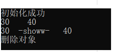

##  this

新的面向对象的程序员经常问的关于类的问题之一是：“当调用成员函数时，C ++如何跟踪它在哪个对象上被调用？”。答案是C ++使用了一个名为“ this”的隐藏指针！让我们更详细地看一下“ this”。

放在一起：

1）当我们调用时simple.setID(2)，**编译器实际上会调用setID（＆simple，2）。**

2）在setID（）中，“ this”指针将对象的地址保持为简单。

3）setID（）中的任何成员变量都以“ this->”为前缀。因此，当我们说时m_id = id，编译器实际上正在执行this->m_id = id，在这种情况下，它将simple.m_id更新为id。

4)类方法setID（）定义时：

```cpp
void setID(Simple* const this, int id) { this->m_id = id; }
```

好消息是，所有这些操作都是自动发生的，而您是否记得它是如何工作的，这并不重要。您需要记住的是，所有普通成员函数都有一个“ this”指针，该指针指向调用该函数的对象。

显示使用this：

首先，如果您的构造函数（或成员函数）具有与成员变量同名的参数，则可以使用“this”消除它们的歧义:

```cpp
class Something
{
private:
    int data;

public:
    Something(int data)
    {
        this->data = data; // this->data is the member, data is the local parameter
    }
};
```


**6 链接成员函数**

```cpp
class Calc
{
private:
    int m_value{};

public:
    Calc& add(int value) { m_value += value; return *this; }
    Calc& sub(int value) { m_value -= value; return *this; }
    Calc& mult(int value) { m_value *= value; return *this; }

    int getValue() { return m_value; }
};
```

每个函数都返回 *this，即该对象的指针


## 友元类

对于一个没有定义public访问权限的**类**，能够让其他的类操作他的私有变量。

```
class Node
{
	private :
		int data;
		int key;
	friend class BinaryTree;
}

class BinaryTree
{
    Node *node;
}

int main()
{
    BinaryTree tree;
    tree.node->key ....;
}


```


## 禁止一个类被继承

使用`final`关键字

```cpp
class Base final {
    // ...
};
// class Derived : public Base {}; // 编译错误
```


## enable_shared_from_this

### 定义与使用

当一个类通过`shared_ptr`进行管理时，当这个类中尝试获取自身的智能指针，就需要使用`enable_shared_from_this`

使用方法：

```cpp
class MyClass : public std::enable_shared_from_this<MyClass> {
public:
    void safe() {
        auto self = shared_from_this(); // 正确：共享所有权
    }
};
```

---

### 使用场景

- 异步编程


### 为什么不使用`make_shared<T>(this)`

调用make_shared时，会使得该指针创建第二个独立的计数控制块，会导致资源的双重释放

如：

```cpp
class MyClass {
public:
    void dangerous() {
        auto self = std::make_shared<MyClass>(this); // 严重错误！
    }
};
```

1. **多个独立控制块**：
   当对象已被其他 `shared_ptr` 管理时，此方式会为**同一个对象**创建**第二个独立的引用计数控制块**。

2. **双重释放**：

   ```cpp
   auto ptr1 = std::make_shared<MyClass>();  // 控制块A
   ptr1->dangerous();                       // 创建控制块B
   ```

   - 函数结束时 `self` 销毁 → 触发对象析构（控制块B）
   - `ptr1` 销毁时 → **再次析构同一对象** → 未定义行为（通常崩溃）

3. **内存泄漏风险**：
   若对象不是通过 `shared_ptr` 创建（如栈对象），`make_shared<T>(this)` 会错误接管所有权，导致非法释放。


## 一个类包含另一个类的初始化

```cpp
#include<iostream>
using namespace std;
class A
{
public:
	A()
	{
		cout << "A is constructed!" << endl;
	}
};
class B
{
private:
	A a;
public:
	B()
	{
		a = A();
		cout << "B is constructed!" << endl;
	}
};
int main()
{
	B b = B{};
 
	system("pause");
}
```

这时候，A一共初始化了两次，1、b在确立时a进行了初始化，2、b在执行初始化时A有进行了初始化

**为了避免重复初始化消耗内存，如何才能让a只初始化一次呢？**

可以用指针来解决：

```cpp
#include<iostream>
using namespace std;
class A
{
public:
	A()
	{
		cout << "A is constructed!" << endl;
	}
};
class B
{
private:
	A *a;
public:
	B()
	{
		a = new A();
		cout << "B is constructed!" << endl;
	}
	~B()
	{
		delete a;
	}
};
int main()
{
	B b = B{};
	system("pause");
}
```

b在构造时，只是创造了个A类型的空指针，在执行构造函数，即b初始化时，会把A类型的空指针指向new出来的A（）对象，也就是A初始化了一次。

【**总结**】**：一个类包含另外一个类，在声明类成员变量时，声明一个指针，然后在构造函数中，或其他类成员函数中将指针指向具体的对象。**欧耶~


## 类的生命周期

一个类的定义如下：

```c++
class MyClass{
private:
    int a,b;
    friend class boost::serialization::access;

    template<class Archive>
    void serialize(Archive &ar ,const unsigned int version){
        ar & a;
        ar & b;
    }
public:
    void print_()
    {
        cout << a<<" "<<b<<endl;
    }
    MyClass()
    {

    }
    ~MyClass()
    {
        cout<< "delete class"<<endl;
    }
    MyClass(int x,int y):
    a{x},b{y}
    {
        cout<< "created"<<endl;
    }

};
```

- 如果是**类的对象**

  ```
  int main() {
  
      MyClass a = MyClass(10,20);
  
      cout << "exec exit" <<endl;
  }
  ```

  这样写会输出：

  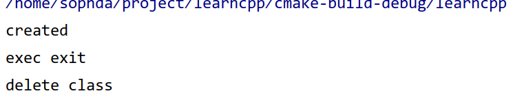

  也就是说：先调用类的初始化函数，然后输出字符串，最后main函数结束的时候，在执行类的析构函数，输出delete class

- 如果**类的对象存在于{}，也就是栈中**

  ```
  int main() {
      
      {
          MyClass a = MyClass(10,20);
      }
      cout << "exec exit" <<endl;
  }
  ```

  这样会输出：

  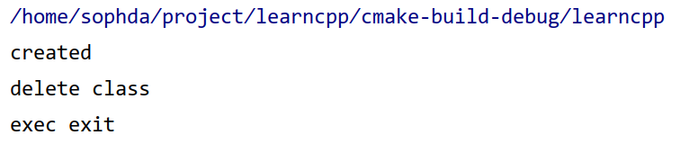

  也就是说，**类的对象放在栈上的，当这部分作用域结束时，就执行了类的析构函数**

- 如果**类的对象申请在堆上，也就是new**

  ```
  int main() {
  
      {
          MyClass *a = new MyClass(10,20);
      }
      cout << "exec exit" <<endl;
  }
  ```

  这样会输出：

  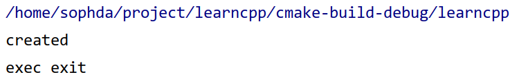

  哼哼哼啊啊啊啊啊，也就是说这个对象根本没有执行析构函数，到这个进程结束也没有啊啊啊！！**就是因为这个对象的内存存在于堆上**

  这也就是c++容易内存溢出的原因，需要手动delete这个对象。

  但是！！！！如果这样写：

  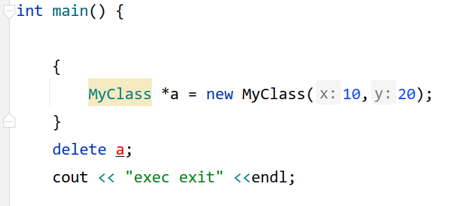

  **因为a这个指针存在于栈上，所以超出了作用域，a这个指针是消失了，但是内存并没有被释放。所以在{}空间内，也就是栈中（常见的比如：函数等）不要去new一个内存**

  所以这个a指针，需要手动去delete：

  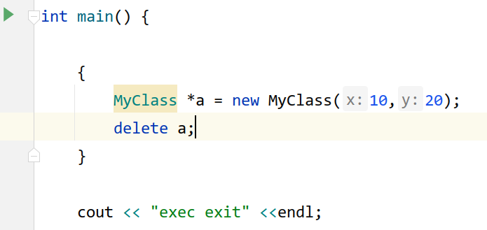

  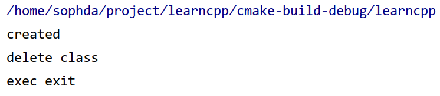

  可以看到，在调用`delete a;`的时候，执行了类的析构函数。


## const修饰成员函数

一般使用const修饰的类中的函数表示这个函数不会修改类的其他成员。如果有一个类tensor实例化后使用了const修饰，那么在使用类的函数的时候，只能使用类的const修饰的函数


## 隐式转换与显式转换

```cpp
class Entity
{
public:
	int m_age;
	Entity(int age)
		:m_age(age)
		{}
}

int main()
{
	Entity a = 22;
	// 此时会发生隐式转换
	Entity b(20);
	// 这样是显式转换
}
```

但是，如果在构造函数前放一个`explicit`关键词，那么隐式转换`implicit`就会被屏蔽，从而使用显式的构造函数

```
class Entity
{
public:
	int m_age;
	explicit Entity(int age)
		:m_age(age)
		{}
}

int main()
{
	Entity a = 22; //error
	// 此时隐式转换会错误
	
	Entity b(20);
	// 只能用显式转换
	Entity b = Entity(20);
	// 这样也可以
}
```


## 堆和栈(包含隐式转换的解释)

1. **栈的作用域：{}，所以一旦离开了栈的作用域，作用域内的内容会消失**

2. 使用new关键词新建的内容是在**堆**上，所以即使是离开{}的作用域，指针也会继续存在 

**作用域指针(类)：**

> 这一类指针同样在**作用域内生效**，尽管使用new申请了堆上的内存，**但是离开作用域时，对象也会析构** 
>
> **这就是智能指针哦**

> ScopedPtr是一个智能指针，它包装了new操作符在堆上分配的动态对象，能够保证动态创建的对象在任何时候都可以被正确地删除。它与auto_ptr/unique_ptr类似，但是它不能被复制或赋值给其他指针
>
> e是一个ScopedPtr类型的变量，它指向一个Entity类的对象。当e离开作用域时（即大括号结束时），它会自动调用析构函数来删除指向的Entity对象。

> ScopedPtr e = new Entity(); 这段话会执行以下步骤：（**发生隐式转换**，new返回指针，然后赋值给m_Ptr）
>
> 1. 使用new表达式在堆上分配一个Entity类的对象，并返回一个指向它的指针。
> 2. 调用ScopedPtr的构造函数，将这个指针作为参数传递，并将它赋值给m_Ptr成员变量。
> 3. 创建一个ScopedPtr类型的变量e，它包装了这个指针，并管理它的生命周期

```cpp
class ScopedPtr
{
private:
	Enitty* m_Ptr;
public:
	ScopedPtr(Entity* ptr)
		:m_Ptr(ptr)
		{}
	~ScopedPtr()
	{
        delete m_Ptr;
    }
};

int main()
{
	{
	ScopedPtr e = new Entity();
	}
}
```


# 虚函数与类的内存模型

## 概念

### 虚函数表（vtable）的物理存储

- **全局数据区**：每个类的虚函数表在内存中是**唯一且全局共享**的
- **只读内存段**：编译器将其放置在 `.rodata` (只读数据段) 中
- **初始化时机**：在程序**装载时**由系统初始化，在整个程序生命周期内保持不变

###  虚函数表指针（vptr）的位置

- **对象内部**：每个包含虚函数的对象实例中
- **内存偏移量**：通常位于对象内存布局的**起始位置**(0偏移处)
- **大小**：与系统指针大小相同（x64系统为8字节）


## 虚函数

- 虚函数必须要提供实现，子类选择性重写
- 纯虚函数不需要提供实现，强制子类重写

virtual关键词表示这个类的派生类可以 **重写** 这个函数，那么在派生类中重写的时候可以加也可以不加virtual关键词，主要看这个类的派生类需不需要重写  

---

基类的虚函数如果有定义，在子类中可以选择覆盖或者不动，如果不动也可以使用基类的虚函数。

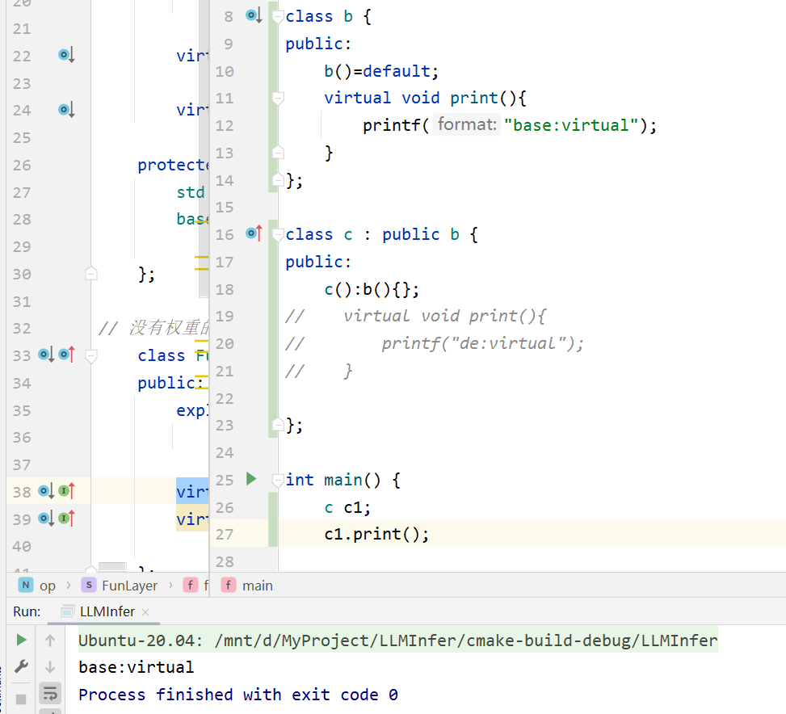


---


1. 例子

```cpp
#include<iostream>
#include<string>
using namespace std;
class Entity
{
public:
	std::string GetName(){ reuturn "Entity"; }
};
class Player : public Entity
{
private :
	std::string m_Name;
public:
	Player(const std::string& name)
	:m_Name(name){}
	std::string GetName(){ return  m_Name;}
}

int main()
{
	Entity* e = new Entity();
    // 这里是一个对象指针
	std::cout<<e->GetName() <<std::endl;
	
	Player* p = new Player("hello");
	std::cout << p->GetName() << std::endl;
	
}
// 此时会正常输出
```

```cpp
// 但是当把main函数改为
int main()
{
	Entity* e = new Entity();
	//std::cout<<e->GetName() <<std::endl;
	
	Player* p = new Player("hello");
	//std::cout << p->GetName() << std::endl;
	
	Entity* entity = p;
	cout<<entity->GetName()<<endl;
	
}
// 此时会输出entity
```

```cpp
void printName(Entity* entity)
{
	cout<< entity->GetName() <<endl;
}

// 但是当把main函数改为
int main()
{
	Entity* e = new Entity();
	printName(e);
	
	Player* p = new Player("hello");
	printName(p);
//按道理来说，printName(e);会打印entity
// printname(p)会打印hello
//  但是printName()这个函数入口的是 entity类的，所以会访问
//entity的方法，不会访问player的
}

```

但是！！ 改写了root类之后：

```cpp
#include<iostream>
#include<string>
using namespace std;
class Entity
{
public:
	virtual std::string GetName(){ reuturn "Entity"; }
};
class Player : public Entity
{
private :
	std::string m_Name;
public:
	Player(const std::string& name)
	:m_Name(name){}
	std::string GetName(){ return  m_Name;}
}
```

此时：

```cpp
void printName(Entity* entity)
{
	cout<< entity->GetName() <<endl;
}

// 但是当把main函数改为
int main()
{
	Entity* e = new Entity();
	printName(e);
	
	Player* p = new Player("hello");
	printName(p);
// 因为root类实用virtual,所以子类会对GetName()方法进行改写。printName(e)会打印entity
// printname(p)会打印hello

}
```

**纯虚函数：**

```cpp
class Entity
{
public:
	virtual std::string GetName()=0;
}
// 令这个函数为零，则必须在子类里定义，否则子类将无法被实例化
//
Entity *e = new Entity();
// 也是错误的，因为GetName么有定义

```

2. **纯虚函数是为了多态而生，可以实现子类在继承的时候为虚函数创建虚函数表，进而实现即使强制转换，调用虚函数也会不同情况。**

   > 回调：把函数作为变量，进行调用

   那上面的例子来说，在基类entity中定义了函数getname，如果不定义为虚函数，那么子类player继承后，需要进行重写（or覆盖）才能够调用这个函数，并且在`Entity* entity = player`强制转换类型后，子类定义的函数也将无法使用。

3. 纯虚函数的实现

   ```c++
   // 1段
   class IRunner {
   private:
   	size_t a;
   public:
   	IRunner()
   		: a(0){
   	}
   	virtual void run() = 0;
   };
   
   class ISpeaker{
   protected:
   	size_t b;
   public:
   	ISpeaker( size_t _v )
   		: b(_v) 
   	{}
   	virtual void speak() = 0;
   };
   
   class Dog : public ISpeaker {
   public:
   	Dog()
   		: ISpeaker(1)
   	{}
   	//
   	virtual void speak() override {
   		printf("woof! %llu\n", b);
   	}
   };
   
   class RunnerDog : public IRunner, public Dog {
   public:
   	RunnerDog()
   	{}
   
   	virtual void run() override {
   		printf("run with 4 legs\n");
   	}
   };
   
   int main( int argc, char** _argv ) {
   	RunnerDog* pDog = new RunnerDog();
   	Dog* simpleDog = new Dog();
   	pDog->speak();
   	{ // 等价于
   		ISpeaker* speaker1 = static_cast<ISpeaker*>(pDog);
   		speaker1->speak();
   	}
   
   	ISpeaker* speaker = static_cast<ISpeaker*>( simpleDog );	
   	RunnerDog* runnerDog = dynamic_cast<RunnerDog*>(speaker);
   	// RTTI 信息
   	if(runnerDog){
   		runnerDog->run();
   	}
   	//
   	// 子类 -> 基类 （ static_cast<>() ）
   	// 基类 -> 子类 （ dynamic_cast<>() ）
   	// 有可能变化
   	// RunnerDog* runnerDog = (RunnerDog*)(speaker);
    	return 0;
   }
   ```

   ```c++
   // 2段
   extern "C" {
   
   	#define RTTI_INFORMATION
   
   	struct RunnerTable {
   		RTTI_INFORMATION
   		void(* run)(void* _ptr);
   	};
   
   	struct SpeakerTable {
   		RTTI_INFORMATION
   		void(* speak )( void* _ptr );
   	};
   
   	void __dog_run( void* _ptr ) {
   		printf("run with 4 legs");
   	}
   
   	void __dog_speak( void* _ptr ) {
   		uint8_t* p = (uint8_t*)_ptr;
   		p+=sizeof(SpeakerTable*);
   		size_t b = *((size_t*)p);
   		printf("woof! %llu\n", b);
   	}
   
   	const static RunnerTable __dogRunnerTable = {
   		RTTI_INFORMATION
   		__dog_run
   	};
   
   	const static SpeakerTable __dogSpeakTable = {
   		RTTI_INFORMATION
   		__dog_speak
   	};
   
   	struct __dog {
   		const SpeakerTable* vt;
   		size_t b;
   	};
   
   	struct __runner_dog {
   		const RunnerTable* vt1;
   		size_t a;
   		const SpeakerTable* vt2;
   		size_t b;
   	};
   
   	__dog * createDog() {
   		__dog* ptr = (__dog*)malloc(sizeof(__dog));
   		ptr->vt = &__dogSpeakTable;
   		ptr->b = 0;
   		return ptr;
   	}
   
   	__runner_dog* createRunnerDog() {
   		__runner_dog* ptr = (__runner_dog*)malloc(sizeof(__runner_dog));
   		ptr->vt1 = &__dogRunnerTable;
   		ptr->a = 0;
   		ptr->vt2 = &__dogSpeakTable;
   		ptr->b = 1;
   		return ptr;
   	}
   
   };
   
   int main( int _argc, char** _argv ) {
       __dog* dog = createDog();
   	__runner_dog* runnerDog = createRunnerDog();
   
   	SpeakerTable** speaker = nullptr;{
   		uint8_t* ptr = (uint8_t*)runnerDog;
   		union {
   			const SpeakerTable* __runner_dog::* memOffset;
   			size_t offset;
   		} u;
   		u.memOffset = &__runner_dog::vt2;
   		ptr += u.offset;
   		speaker = (SpeakerTable**)ptr;
   	}
   	(*speaker)->speak(speaker);
   	// 等价于
   	runnerDog->vt2->speak(speaker);
   	// 但不等价于
   	runnerDog->vt2->speak(runnerDog); // 这是错误的
   	//
   	return 0;
   }
   ```

   1段展示了纯虚函数的应用，2段则表示了纯虚函数的实现。

   - 如果一个基类中，有纯虚函数的定义，那么该基类的内存模型中，首先是虚函数表，然后是其他变量
   - 有个子类对基类进行了继承，则需要对虚函数进行定义，这时会给子类也分配一个**虚函数表**，该虚函数表指针指向该子类的函数定义，本质上是回调。
   - 对子类强转为基类指针，虚函数表并不会被修改，此时会出现：调用基类的函数，会出现不同情况

## 虚表与虚表指针

### 概念

- 虚表：当一个类声明了虚函数（或者是继承了有虚函数的基类），编译器会为这个类创建一个虚表。虚表是一个存储该类所有虚函数地址的静态数组。
- 虚表指针：编译器会在每个包含虚函数的类的对象实例中，添加一个隐藏的成员，即虚表指针（vptr），这个指针指向该类对应的虚表。

---

### **基类指针与子类指针指向同一对象是否相等？**

- **值相等，类型不同。** 当一个基类指针 `Base* b_ptr` 和一个子类指针 `Derived* d_ptr` 指向同一个子类对象时，它们存储的内存地址是相同的。你可以通过 `static_cast<void*>(b_ptr) == static_cast<void*>(d_ptr)` 来验证，结果为 `true`。

- 但是它们的类型是不同的，`b_ptr` 的类型是 `Base*`，`d_ptr` 的类型是 `Derived*`。这意味着通过 `b_ptr` 只能访问基类中定义的成员（包括虚函数），而通过 `d_ptr` 可以访问所有成员。

---

### **类中虚表的个数？**

一个类只有一个虚表指针，即使这个类有多重继承，只要他有虚函数，其**对象也只有一个vptr，指向一个包含了所有基类和自身虚函数地址的合并后的虚表。**

---

### **基类指针与子类指针指向同一对象时，这两个指针是否相等？**

- **值相等，类型不同。** 当一个基类指针 `Base* b_ptr` 和一个子类指针 `Derived* d_ptr` 指向同一个子类对象时，它们存储的内存地址是相同的。你可以通过 `static_cast<void*>(b_ptr) == static_cast<void*>(d_ptr)` 来验证，结果为 `true`。

- 但是它们的类型是不同的，`b_ptr` 的类型是 `Base*`，`d_ptr` 的类型是 `Derived*`。这意味着通过 `b_ptr` 只能访问基类中定义的成员（包括虚函数），而通过 `d_ptr` 可以访问所有成员。

---

### **虚表指针的初始化**

0. 虚表指针是在构造函数中完成初始化的。

1. 当创建子类对象时，首先会调用基类的构造函数。在基类构造函数执行期间，对象的 vptr 指向基类的虚表。

2. 基类构造函数执行完毕后，再执行子类的构造函数。在子类构造函数中，vptr 会被修改，指向子类自身的虚表。

3. 这个过程确保了在对象的生命周期中，虚函数的调用总是正确的。这也解释了为什么在构造函数和析构函数中调用虚函数时，不会发生多态行为（因为在构造基类时，对象还不是一个完整的子类对象）。

---

### 对象的虚函数指针指向

有一个包含虚函数的类A，实例化了a、b、c等多个对象，那么这些对象中的虚函数指针指向的内容一致吗？

- 虚函数指针是对象的，虚函数表是类的

- 同一个类的不同实例化对象，其vptr的地址不同，但是指向的是同一个虚函数表


## 基类指针和子类指针转换

- 向上转型：将子类转换为基类指针。安全的，可以隐式进行
- 向下转型：将基类指针转为子类指针。不安全，因为基类指针可能没有指向一个子类的对象

---

### 转换方式

- **`static_cast`:**
  - **用途:**主要用于编译时已知的、安全的类型转换，包括向上转型。也可以用于向下转型，但它不会进行任何运行时类型检查。如果转换是错误的（例如，基类指针实际指向的是一个基类对象），`static_cast` 仍然会执行转换，但后续使用这个转换后的指针可能会导致未定义行为。
  - **底层原理:** `static_cast` 在编译时进行类型转换。对于指针，它仅仅是告诉编译器将这块内存地址按照新的类型来解释，不会增加额外的运行时开销。

- **`dynamic_cast`:**
  - **用途:** 专门用于处理多态情况下的向下转型。它会在运行时检查转换的安全性。
  - **底层原理:** `dynamic_cast` 依赖于 RTTI（Run-Time Type Information，运行时类型信息）。当进行 `dynamic_cast` 时，它会检查对象的 vptr 指向的虚表，虚表中包含了类型信息。如果转换是合法的（指针确实指向目标类型或其子类的对象），转换成功，返回有效的指针。如果转换非法，对于指针类型会返回 `nullptr`，对于引用类型会抛出 `std::bad_cast` 异常。`dynamic_cast` 只能用于包含虚函数的类。


## 内存模型

### 有虚函数时的内存布局

> ref:[C++语言中的类在内存中的分布是怎样的？也是内存对齐的吗？对象的虚表指针存放在哪里？C++中类的内存模型，在内存中是如何存储的？虚函数是如何存储的 - 刘冲的博客 (popkx.com)](https://blog.popkx.com/what-is-the-memory-model-of-class-in-c-where-is-the-virtual-pointer/)

众所周知，但是我忘了。。

- char类型占用1个字节，即1b，1b=8bit
- int类型占用4个字节
- double占用8个字节
- 指针的大小为：$2^{电脑位数}$

1. 空类

   ```c++
   class A {
   };
   cout << sizeof(A) << endl; // 输出 1
   ```

2. 类型的成员变量

   ```c++
   class A {
   public:
       int pub_i1;
       int pub_i2;
   };
   A a;
   ```

   此时a的大小为8字节，即两个int相加

   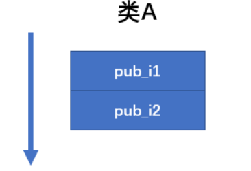

3. 类的成员函数

   ```c++
   class A {
   public:
       int pub_i1;
       int pub_i2;
   
       void pub_foo1() {}
       void pub_foo2() {}
   };
   
   A a;
   cout << "sizeof A: " << sizeof(A) << endl;
   cout << "a addr: " << &a << endl;
   cout << "A::pub_i1 addr: " << &a.pub_i1 << endl;
   cout << "A::pub_i2 addr: " << &a.pub_i2 << endl;
   
   printf("A::pub_foo1() addr: %p\n", (void *)&A::pub_foo1);
   printf("A::pub_foo2() addr: %p\n", (void *)&A::pub_foo2);
   ```

   此时输出为：

   ```
   sizeof A: 8
   a addr: 0x7ffe2dbc3120
   A::pub_i1 addr: 0x7ffe2dbc3128
   A::pub_i2 addr: 0x7ffe2dbc312c
   A::pub_foo1() addr: 0x400b28
   A::pub_foo2() addr: 0x400bc2
   ```

   根据a的大小可以看到，成员函数并没有加入到A类中，而是被分配到了很远的地方。

   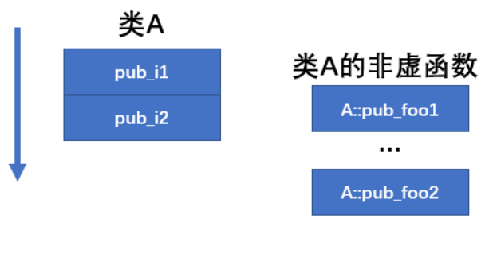

4. 类的私有成员

   ```c++
   class A {
   ...
   private:
       int prv_i1;
       int prv_i2;
   
       void pub_foo1() {
           cout << "A::prv_i1 addr: " << &prv_i1 << endl;
           cout << "A::prv_i2 addr: " << &prv_i2 << endl;
   
           printf("A::prv_foo1() addr: %p\n", (void *)&A::prv_foo1);
           printf("A::prv_foo2() addr: %p\n", (void *)&A::prv_foo2);
       }
       void prv_foo2() {}
   };
   ...
   a.pub_foo1();
   ```

   输出为：

   ```
   sizeof A: 16
   a addr: 0x7ffdbbfe6980
   A::pub_i1 addr: 0x7ffdbbfe6980
   A::pub_i2 addr: 0x7ffdbbfe6984
   A::pub_foo1() addr: 0x400ace
   A::pub_foo2() addr: 0x400bb0
   A::prv_i1 addr: 0x7ffdbbfe6988
   A::prv_i2 addr: 0x7ffdbbfe698c
   A::prv_foo1() addr: 0x400bba
   A::prv_foo2() addr: 0x400bc4
   ```

   可以看到：private类并没有特别之处，变量也是存储到对象内存中的。私有函数也是独立于对象a存储的。重点是非虚函数

   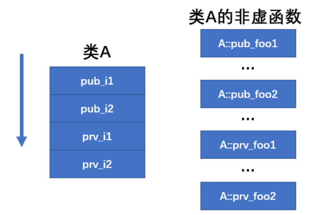

5. 虚函数

   ```c++
   class A {
   public:
       ...
       void pub_foo2() {}
       virtual void pub_vfoo1() {}
       virtual void pub_vfoo2() {}
   private:
       ...
   };
   ...
   printf("A::pub_vfoo1() addr: %p\n", (void *)&A::pub_vfoo1);
   printf("A::pub_vfoo2() addr: %p\n", (void *)&A::pub_vfoo2);
   
   a.pub_foo1();
   ```

   输出为：

   ```
   sizeof A: 24
   a addr: 0x7fffb26a22a0
   A::pub_i1 addr: 0x7fffb26a22a8
   A::pub_i2 addr: 0x7fffb26a22ac
   A::pub_foo1() addr: 0x400b28
   A::pub_foo2() addr: 0x400bc2
   A::pub_vfoo1() addr: 0x400bcc
   A::pub_vfoo2() addr: 0x400bd6
   A::prv_i1 addr: 0x7fffb26a22b0
   A::prv_i2 addr: 0x7fffb26a22b4
   A::prv_foo1() addr: 0x400be0
   A::prv_foo2() addr: 0x400bea
   ```

   可以看到：2个虚函数使得对象增加了1个指针的大小（指针指向内存地址，在这里是64为机器位数，占用内存空间即2^64=8byte）。也就是说，**这个指针即虚函数表的地址**，这个地址指向的内存表空间中存储着两个虚函数。

   

根据内存地址，就可以解释：

```c++
class Entity{
public:
    Entity();
    int a;
    void getname()
    {
        cout<< "Entity" <<endl;
    }
};
class Player : public Entity{
public:
    Player();
    int b;
    void getname()
    {
        cout<< "player" <<endl;
    }
};
int main() {
    Player* p = new Player();
    Entity* e = new Entity();
    Entity* entity = dynamic_cast<Entity* >(p);
    entity->getname();
}
```

上面这一段输出的是Entity，因为getname不是虚函数，基类定义了该函数的地址，在进行类型转换`Entity* entity = dynamic_cast<Entity* >(p);`的时候，getname的地址是Entity类的，所以会输出“Entity”

---

```c++
class Entity{
public:
    Entity();
    int a;
    virtual void getname()
    {
        cout<< "Entity" <<endl;
    }
};
class Player : public Entity{
public:
    Player();
    int b;
    void getname()
    {
        cout<< "player" <<endl;
    }
};
int main() {
    Player* p = new Player();
    Entity* e = new Entity();
    Entity* entity = dynamic_cast<Entity* >(p);
    entity->getname();
}
```

上面这一种情况，因为基类包含virtual函数，则会有个虚函数表指针（大小为指针大小）。子类是继承的，所以也有。**在执行`Entity* entity = dynamic_cast<Entity* >(p);`时，基类的虚函数表指针是在内存中的，属于类的成员变量，那么基类的虚函数表指针也会被赋值为子类的虚函数表指针**，这时，就会执行子类的函数。进而输出“player”

### 继承后的内存布局

在单继承且有虚函数的情况下，对象的内存布局通常是：

1. **虚表指针 (vptr)**
2. **基类成员变量** (按照声明顺序)
3. **子类成员变量** (按照声明顺序)


## 普通成员函数与虚函数

### 普通成员函数

首先看一段可以运行的代码：

```cpp
class Test {
public:
    void hello() {
        printf("hello\n");
    }
};

int main() {
    Test *p = nullptr;
    p->hello();  // 通过空指针调用成员函数
    return 0;
}
```

通过一个空指针调用其成员函数，理论上是错误的，**但是对于非虚成员函数，编译器在编译时就已经将函数的调用绑定到具体的函数地址上，不需要在运行时查找虚函数表。**

在运行时，调用成员函数hello，并且没有访问任何成员变量，也就是没有使用this指针（不涉及解引用），也就是编译器将其转换为普通函数调用`Test::hello(p)`即`Test::hello(nullptr)`，没有涉及到解引用是没问题的。

### 虚函数

然后是一段不可执行的代码：

```cpp
class Base {
public:
    virtual void hello() {
        printf("Base hello\n");
    }
};

class Test : public Base {
public:
    void hello() override { // 重写父类虚函数
        printf("Test hello\n");
    }
};

int main() {
    Base* p = nullptr;
    p->hello(); // 通过基类指针调用虚函数
    return 0;
}
```

这段代码是不可以运行的。

在Base类中，hello是虚函数，也就是需要通过虚函数表指针去获取虚函数表才能调用，但是p没有实例化，也就是没有分配内存，也就没有虚函数指针，无法获取虚函数表，也就无法正常执行。


## 派生类中调用基类虚函数

比如下面这种情况：

```cpp
class Base {
public:
    Base() {};
    virtual void setup() {
        this->a = 10;
    }
    int a = 0;
};

class Derived : public Base {
public:
    Derived(){};
    virtual void setup() {
        cout<<a<<endl;
        Base::setup();
        this->b = 20;
    }
    int b = 0;
};

```

**调用`Base::setup()`时发生了什么**

```
Base::setup()
```

调用这个时，编译器会做两件事：

```cpp
// 等效转换伪代码
Base* basePtr = static_cast<Base*>(this); // 将this指针转为基类指针
basePtr->Base::setup();                   // 静态调用基类函数
```


**在`Base::setup()`内部**

```cpp
void Base::setup(Base* const this) { // 隐含的this参数
    this->a = 10; // 操作对象内存中的Base::a位置
}
```

- 尽管函数属于基类，但`this`指针指向的仍是派生类对象
- 因此实际修改的是派生类对象中的`Base::a`成员

**也就是说，在调用基类的虚函数的时候，会将this（静态转换）转换为基类指针，然后去调用基类的函数，同时根据基类函数的this指针传入当前的对象，完成变量初始化**


## 派生类中的虚析构函数


```cpp
#include <iostream>
using namespace std;

class base {
public:
	int a = 0;
	virtual void f() {
		cout << "base:f" <<endl;
	};
	virtual void c() {
		cout << a <<"base:c" <<endl;
	}
	virtual ~base() {
		cout << "del base" <<endl;
	};

};
class de : public base {
public:
	void f() {
		cout << "de:f" <<endl;
	};
	
	void c() {
		cout << "de:c" <<endl;
	}
	~de() {
		cout << "del derived" << endl;	
	}
};


int main()
{
	base* a = new de();
	delete a;
	return 0;
}
```

在调用`delete a;`时会发生什么？

- a是一个指向派生类的基类指针
- 如果调用a的虚函数，则指向派生类的虚函数实现
- 如果调用a的非虚函数，则调用基类的非虚函数
- 因为基类定义了虚析构函数，那么在a在删除时，会先调用基类的析构，然后调用派生类的析构
- 如果基类没有定义虚析构的话，那么a在删除时，只调用基类的析构，派生类的无法调用析构


## 静态检查与动态绑定

- 静态检查：这是**编译时**的工作
- 动态绑定：这是**运行时**的行为

涉及到**静态检查**的情况：在编译时，如果调用一个**类的函数**，会检查这个类中有没有这个函数的定义，无论是虚函数还是非虚函数。只要声明存在就合法。

涉及到**动态绑定**的情况：通过对象的虚函数指针，去找虚函数表，然后调用。

```cpp
#include <iostream>
using namespace std;

class base {
public:
	int a = 0;
	virtual void f() {
		cout << "base:f" <<endl;
	};
	void c() {
		cout << a <<"base:c" <<endl;
	}
	virtual ~base() {
		cout << "del base" <<endl;
	};

};
class de : public base {
public:
	void f() {
		cout << "de:f" <<endl;
	};
	
	virtual void e() {
		cout<< "d:e" <<endl;
	}
	

	~de() {
		cout << "del derived" << endl;	
	}
};

int main()
{

	de* a = new de();
	a->e();
	delete a;
   return 0;
}
```

这是一种不合法的情况：因为在`base`类中并没有定义`e()`函数


# 模板

模板是让编译器为你写代码。避免手动重载

## 放置位置

必须放在头文件中，这样在预处理阶段可以保证所有的编译单元可见


## 函数模板

只有在调用模板的时候，模板才会被创建。如果模板函数内存在错误，是可以正常编译的。

```c++
template<typename T>
void Print(T value)
{
	std::cout<< value <<std::endl;
}
// 下面这种情况是隐式地调用了模板,可以推断是什么类型的
Print("hello");
Print(5.5f);
//下面则是显式地调用
Print<int>(5);
```


## 类模板

类模板本质上是在避免重复性的工作。

```
template<class name>
class Example
{
 ....
}
int main()
{
	Example<int> ***;
}
```

```c++
template<int N>
class Array
{
private :
	int array[N];
public :
	int GetSize() const {return N;}
}
void main()
{
	Array<5> array;
	std<<cout<<array.GetSize();
}
//输出为5
```

```C++
template<typename T,int N>
class Array
{
private :
	T array[N];
public :
	int GetSize() const {return N;}
}
void main()
{
	Array<std::string,5> array;
	std<<cout<<array.GetSize();
}
//输出为5
```


## C11-尾返回类型

可以先看下面这种情况：

```
decltype(x+y) add(T x, U y)
```

这会导致错误，因为**x和y尚未声明**

---

于是有了尾返回这种形式：**尾返回类型（Trailing Return Type）** 是 C++11 引入的特性，用于**将函数的返回类型声明放在参数列表之后**，语法为 `auto func(...) -> return_type`

```
auto function_name(parameters) -> return_type {
    // 函数体
}
```

---

那么和模板结合在一起，就可以实现下面的效果：

```c++
template<typename T, typename U>
auto add(T x, U y) -> decltype(x+y) {
    return x+y;
}

auto c = add<int, float>(1,5.5);
cout<< c <<endl;
```

卧槽看着有点匪夷所思啊~~

## 万能引用

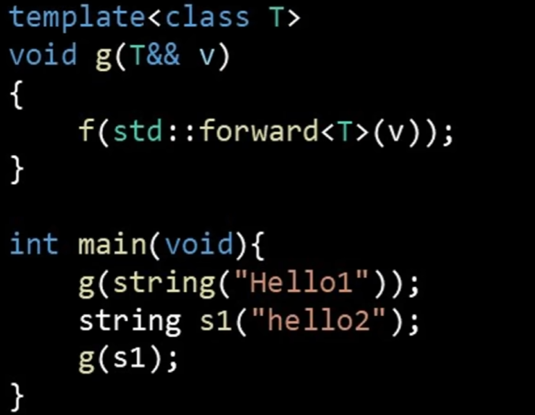

**注意：只有在函数声明的时候写`T&& v`时，是万能引用，这里的T&&并不是真正的右值引用，他既可以绑定左值，也可以绑定右值；其他比如在函数体中写的则是右值引用。**

在类型推导时：实参为右值时，推到为对应的类型T；实参为左值时，推导为实参类型的引用即T&

- 调用g(string("hello"))时，T被推导为T=string

- 调用`string s = "hello"; g(s);`时，s是个左值，推导为s类型的引用即T=string&，此时g函数的实例化版本为：

  ```
  void g<string&>(string& && v) {
  	f(std::forward<string&>(v));
  }
  ```

  **因为出现了引用的引用，因此需要引用折叠规则：**

  - **有左值引用时，折叠为左值引用**
  - **有两个右值引用时，折叠为右值引用**

  

## 可变模板参数

###  模板参数包 (Template Parameter Pack)

在模板定义中，`typename...` 或 `class...` 用来声明一个模板参数包。这个包可以容纳任意数量的类型。

```
template<typename... Args> // Args 是一个模板参数包
class MyClass;

template<typename... Ts>    // Ts 也是一个模板参数包
void myFunction(Ts... args); // args 是一个函数参数包
```

在上面的例子中：

- `Args` 和 `Ts` 就是**模板参数包**，它们可以代表 `int`, `double`, `std::string` 等任意一组类型。
- `args` 是一个**函数参数包**，它包含了所有传递给函数的实际参数。


### 包展开 (Pack Expansion)

你不能直接访问参数包中的每一个参数。相反，你需要**展开 (expand)** 这个包。展开是通过在参数包名字的右边放置 `...` 来实现的。

例如，`Args...` 或 `args...` 就是一个包展开。它会将参数包中的每一个元素应用到某个模式 (pattern) 上。

```cpp
#include <iostream>

// 基本情况：当没有参数时，函数结束递归。
void print() {
    std::cout << "End of arguments." << std::endl;
}

// 递归定义：处理第一个参数，然后用剩下的参数包递归调用自身。
template<typename T, typename... Args>
void print(T firstArg, Args... args) {
    std::cout << firstArg << std::endl; // 打印第一个参数
    print(args...);                    // 递归调用，传入剩余的参数包
}

int main() {
    print(1, 3.14, "hello", 'a');
    return 0;
}
```

### 应用

**1.完美转发 (Perfect Forwarding)**: 这是可变参数模板最核心的应用之一。结合 `std::forward`，我们可以编写一个工厂函数或包装函数，它能接收任意参数，并以“完美”的方式（保持参数的左值/右值属性）转发给另一个函数。`std::make_unique`, `std::make_shared`, `std::vector::emplace_back` 等都依赖于此技术。

```
#include <memory>
#include <utility>

template<typename T, typename... Args>
std::unique_ptr<T> make_unique_custom(Args&&... args) {
    // std::forward<Args>(args)... 将每个参数完美转发给 T 的构造函数
    return std::unique_ptr<T>(new T(std::forward<Args>(args)...));
}
```

**2.类型安全的 `printf`**: 我们可以创建一个类型安全的打印函数，它在编译期就能检查格式字符串和参数类型是否匹配。

**3.元组 (Tuple) 的实现**: `std::tuple` 就是一个典型的可变参数类模板。它可以持有任意数量、任意类型的异构数据。

```
template<class... Types>
class tuple;

std::tuple<int, std::string, double> t(42, "hello", 3.14);
```

**4.可以任意打印的print**

```cpp
template <typename... Args>
void print(Args... args) {
    ([&](){
        cout<< args <<endl;
        }(), ... );
}

#include "solution.h"
int main() {
    print(1,2,3,"hello");
    return 0;
```

为什么可以这样子做呢？

定义了一个lambda表达式即()[]{}

但是这也仅仅是定义了表达式，模板展开中定义了，但是需要执行，就在后面加个小括号，表示执行函数。 `auto f = [](){}`,这个只是定义，`f()`才是执行

### ...的作用

1.在模板参数中或者是函数参数中时，比如`Args... args`表示args是个参数包

2.在函数体中时，`args...`表示包展开，执行的是将args原地展开

3.在一个表达式之后时，执行的是**折叠表达式**，表示这个表达式执行多次，按照顺序执行args中的参数。

```cpp
template <typename... Args>
void p(Args... args) {
    ([&](){
        cout<< args << endl;
    }(),...); // 执行的是折叠表达式
}

template <typename... Args>
void print(Args... args) {
    p(args...);  //将args参数原地展开
}

int main() {
    print(1, 3.14, "hello", 'a');
    return 0;
}
```


### 通过sizeof获取参数个数

```cpp
template <typename... Args>
void p(Args... args) {
    printf("%d\n", sizeof...(Args));
}
p(1,2,"HELLO"); // 输出 3 
```


### 模板匹配

**模板匹配的过程，是编译器通过“对比”【调用函数的实参】和【模板定义的形参模式】，来“推导”出【模板参数】的具体类型。**

这种情况出现在模板参数和函数参数不一致时：

对比一下两种情况：

```cpp
//情况1
template <typename F, typename... Args>
void call(const F& f, 
          std::weak_ptr<connection> ptr, 
          std::string& result, 
          std::tuple<Args...> tp);
          
// 调用
// 假设 my_tuple 是 std::tuple<int, double>
call(f, conn, result, my_tuple);
```

---

```cpp
// 情况2
template <typename F, typename... Args>
void func(const F& f, Args... args);

//调用
// 假设 my_tuple 还是 std::tuple<int, double>
func(f, conn, result, my_tuple);
```

在推导的时候，先根据实参去推导形参类型，然后确定模板参数：

在情况1中：

- `const F& f`对应f类型
- `std::weak_ptr<connection>`对应conn
- `std::string& result`对应result
- `std::tuple<Args...> tp`对应mytuple

因此Args...推导出来的是 int,double。验证：

```cpp
template <typename A,typename... Args>
void call_tp(A a, tuple<Args...> tp) {
    auto seq = make_index_sequence<sizeof...(Args)>();
    printf("args nums: %d\n", sizeof...(Args));
}

int main() {
//    print(1, 3.14, "hello", 'a');
    auto tp = make_tuple(1,2,"hello");
    call_tp(2,tp);
    return 0;}
    
// 最后打印出来的Args的size对应着tuple的参数个数，即3
```

---

在情况2中，去匹配函数形参类型然后类型推导：

- const F&对应f类型
- Args...类型对应着conn, result, my_tuple这三个


### 获取模板参数索引

通过c++14中的`make_index_sequence`获取`Args...`中的参数索引

这里通过打印tuple中的每个元素来举例（打印tuple中的元素就要获取索引哦~）：

```cpp
template <typename... Args>
void p(Args... args) {
//    printf("%d\n", sizeof...(Args));
    ([&](){
        cout<< args << endl;
    }(),...);
}
template <typename... Args>
void print(Args... args) {
    p(args...);
}

template <size_t... I,typename... Args>
void tp_1(index_sequence<I...> seq, std::tuple<Args...> args) {
//    print(get<I>(args)...);
    print("index sequence: ", I...);
    ([args](){
        cout<< "id:" << I << "-" << get<I>(args) <<endl;
    }(), ...);
}

template <typename A,typename... Args>
void call_tp(A a, tuple<Args...> tp) {
    auto seq = make_index_sequence<sizeof...(Args)>();
    printf("args nums: %d\n", sizeof...(Args));
    tp_1(seq, tp);
}

int main() {
//    print(1, 3.14, "hello", 'a');
    auto tp = make_tuple(1,2,"hello");
    call_tp(2,tp);
    return 0;
```

输出：

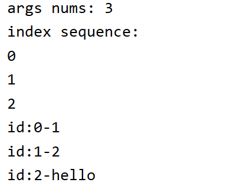

说明：

- tuple中可以存放任意的类型
- 通过是`std::get<id>(tuple)`来获取tuple中的元素
- 第14行 tp_1的定义中，函数形参要写`index_sequence<I...> seq`来匹配实参的`auto seq = make_index_sequence<sizeof...(Args)>();`
- 第26行调用tp_1的时候：
  - tp_1的`index_sequence<I...> seq`对应seq，因此`I...`推导为`0,1,2`
  - tp_1的`std::tuple<Args...> args`对应tp，因此`Args...`推到为`int,int,const char`


# c++并发编程

- 多线程：并行计算
- 异步：并发执行

---

假设你现在要做两件事：**烧一壶水** 和 **洗茶壶、拿茶叶**。

- **方式一：单线程同步 (Synchronous)** 你先站在电水壶前，盯着它，直到水烧开 (阻塞等待)。然后，你才去洗茶壶、拿茶叶。最后泡茶。整个过程你必须一件一件按顺序做，在等水开的时候，你什么也干不了。

  > 这就是**同步**，必须等待一个任务完成后才能开始下一个。

- **方式二：多线程 (Multithreading)** 你觉得一个人太慢，于是叫来你弟弟帮忙。你负责专门烧水，你弟弟负责专门洗茶壶、拿茶叶。你们**两个人同时开始干活**。水烧开的同时，茶具也准备好了，然后你俩一起把茶泡好。

  > 这就是**多线程**。核心是**增加人手（线程）**，让多个任务**真正地并行执行**。它的目标是“缩短完成所有任务的总时间”。

- **方式三：单线程异步 (Asynchronous)** 还是只有你一个人。你先把电水壶插上电，按下开关（发起一个耗时任务），然后你**不站在那里等**，而是立刻转身去洗茶壶、拿茶叶（执行其他任务）。等你把茶具准备好，水壶“嘀”的一声响了（任务完成的通知），你再过去倒水泡茶。

---

技术层面的区别

| 特性         | 多线程 (Multithreading)                                      | 异步 (Asynchronous)                                          |
| ------------ | ------------------------------------------------------------ | ------------------------------------------------------------ |
| **核心目标** | **并行计算 (Parallelism)** <br> 让多个任务**同时运行**，充分利用多核CPU的计算能力。 | **并发处理 (Concurrency)** <br> 避免因等待（尤其是I/O）而**阻塞**，提高程序在单位时间内的任务处理能力。 |
| **本质**     | **增加执行单元（工人）** <br> 是一种**资源密集型**的解决方案，通过增加线程来同时处理多个任务。 | **优化调度流程（工作流）** <br> 是一种**任务调度**的模式，通过事件循环和回调/Future等机制，让单个线程在等待时能去处理其他任务。 |
| **实现层面** | 通常由**操作系统**负责线程的创建、管理和调度。线程是操作系统能够进行运算调度的最小单位。 | 通常由**程序/语言层面**的事件循环（Event Loop）机制实现。可以在单线程上实现，也可以在多线程上实现。 |
| **资源开销** | **高** <br> 每个线程都需要独立的栈空间和内核资源，线程创建和上下文切换有较大开销。 | **低** <br> 通常在单线程或少量线程中运行，任务切换（如执行回调）的开销远小于线程切换。 |
| **适用场景** | **CPU密集型任务** <br> 如科学计算、视频编解码、大规模数据处理。需要强大的并行计算能力来缩短执行时间。 | **I/O密集型任务** <br> 如网络请求、文件读写、数据库操作。任务的大部分时间都在等待I/O返回，CPU处于空闲状态。 |
| **编程模型** | **复杂** <br> 需要处理线程间的同步、资源共享、锁（死锁、活锁）、竞态条件等问题。 | **相对复杂** <br> 逻辑是非线性的，可能导致“回调地狱”(Callback Hell)，但现代编程语言的`async/await`语法糖极大地改善了这一点。 |

# 多线程

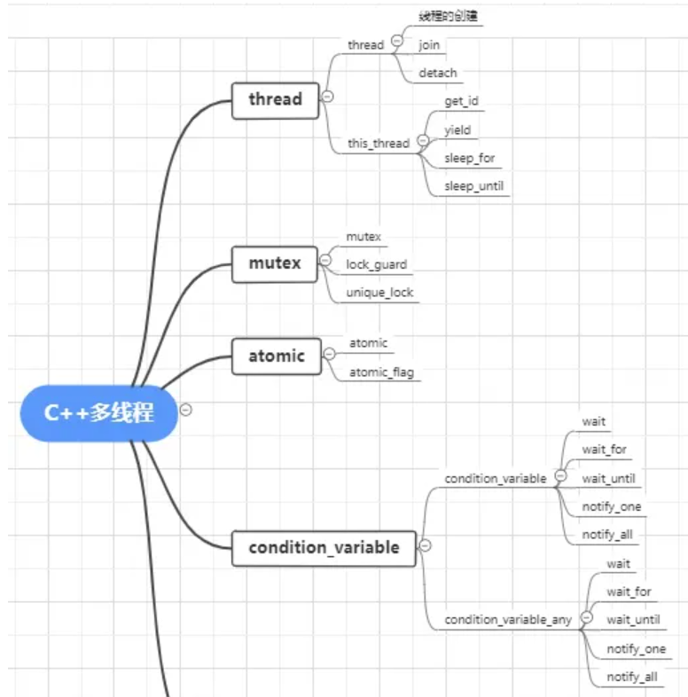

## 定义

在一个程序中，这些独立运行的程序片段叫作“线程”（Thread）

- 一个程序有且只有一个进程，按时可以有多个线程
- 不同的进程有不同的地址空间，互不相关。但是不同的线程有共同进程的地址空间
- 在c中有pthread的库进行多线程编程。但是在c++ 11中出现了std::thread的东西，所以在使用了这个thread的有的库的编译选项不用选择ptread

**基础使用：（只需要把函数名传进去就可以了）**

形式1：

```c++
// Compiler: MSVC 19.29.30038.1
// C++ Standard: C++17
#include <iostream>
#include <thread>
using namespace std;
std::thread myThread ( thread_fun);
//函数形式为void thread_fun()
myThread.join();
```

形式2：

```
std::thread myThread ( thread_fun(100));
myThread.join();
//函数形式为void thread_fun(int x)
//同一个函数可以代码复用，创建多个线程
```

形式3：

```
std::thread (thread_fun,1).detach();
//直接创建线程，没有名字
//函数形式为void thread_fun(int x)
```

## 智能指针的线程安全性

### shared_ptr

- 引用计数（控制块）：

  - **关键点：** `shared_ptr` 的引用计数操作（增加计数、减少计数）是**原子的**，并且通常使用无锁操作（或高效锁）实现。

  - **安全性：** 这意味着多个线程同时拷贝、赋值或析构**指向同一个对象**的 `shared_ptr` 实例是安全的。引用计数本身不会损坏。

    


- shared_ptr对象本身：

  - **读操作：** 多个线程同时通过各自的 `shared_ptr` 实例**读取**（例如 `get()`, `use_count()`，甚至 `operator*` 或 `operator->` 用于只读访问）是安全的。

  - **写操作：** 对**同一个 `shared_ptr` 对象**进行写操作（例如赋值、`reset()`）**不是线程安全的**。修改一个 `shared_ptr` 对象本身（改变它指向的对象）需要同步。

    

- 所管理的对象：

  -  **关键点：** `shared_ptr` **只保证引用计数操作的线程安全，不保证它所指向的对象的线程安全！**

  - **安全性：** 如果多个线程通过各自的 `shared_ptr` 访问（读或写）**同一个底层对象**，你需要额外的同步机制（如互斥锁）来保护对该对象的访问。否则，会发生数据竞争。

    

- 控制块的其他数据：

  - 控制块除了引用计数，还可能存储自定义删除器、分配器以及弱引用计数 (`weak_ptr` 使用)。这些部分的修改也需要同步，但标准库实现通常会确保引用计数的原子性，其他部分可能依赖于引用计数的正确管理。

    

- **`std::weak_ptr` 的交互：** 从 `weak_ptr` 安全地创建 `shared_ptr` (`lock()`) 也是线程安全的，因为它正确地参与了引用计数的原子操作。

  

- 总结：
  - **引用计数操作是线程安全的。** 这是 `shared_ptr` 的核心线程安全保证。
  - **对同一个 `shared_ptr` 对象本身的写操作不是线程安全的。**
  - 对所管理的对象的访问不是线程安全的，需要额外同步。
  - 因此，`std::shared_ptr` **提供了部分线程安全性**（主要是引用计数），但不是完全线程安全的容器或对象包装器。

### unique_ptr

**所有权独占性：** `unique_ptr` 严格独占所有权。一个对象在任何时刻只能由一个 `unique_ptr` 拥有。

**线程安全性：**

- **指针本身的操作（移动、重置、析构）：** 对**同一个 `unique_ptr` 对象**进行非 `const` 操作（如移动赋值、`reset()`、析构）**不是线程安全的**。多个线程同时操作同一个 `unique_ptr` 会导致数据竞争和未定义行为。
- **访问所管理的对象：** 通过 `unique_ptr` 访问其指向的对象（例如 `*ptr`, `ptr->method()`）**不是线程安全的**。你需要额外的同步机制（如互斥锁）来保护对对象本身的并发访问。
- **不同 `unique_ptr` 指向不同对象：** 多个线程各自操作自己拥有的、指向不同对象的 `unique_ptr` 是安全的。

**总结：** `std::unique_ptr` **本身不是线程安全的**。它的设计焦点是资源所有权的清晰管理，而非并发访问。你需要手动管理对 `unique_ptr` 对象本身及其所管理对象的并发访问


### weak_ptr

**线程安全性：** 类似于 `shared_ptr`：

- 引用计数操作（特别是弱引用计数）是线程安全的。
- 对**同一个 `weak_ptr` 对象**本身的写操作（赋值、`reset()`）**不是线程安全的**。
- 使用 `lock()` 方法升级为 `shared_ptr` 是线程安全的。
- 它不提供对所指向对象（如果还存在）的任何访问保护。


## join 和 detach

- detach方式，启动的线程**自主在后台运行，当前的代码继续往下执行，不等待新线程结束**。
- join方式，**等待启动的线程完成，才会继续往下执行**

**join模式：join之后的代码都不会执行。**

```text
#include <iostream>
#include <thread>
using namespace std;
void thread_1()
{
  while(1)
  {
  //cout<<"子线程1111"<<endl;
  }
}
void thread_2(int x)
{
  while(1)
  {
  //cout<<"子线程2222"<<endl;
  }
}
int main()
{
    thread first ( thread_1); // 开启线程，调用：thread_1()
    thread second (thread_2,100); // 开启线程，调用：thread_2(100)

    first.join(); // pauses until first finishes 这个操作完了之后才能destroyed
    second.join(); // pauses until second finishes//join完了之后，才能往下执行。
    while(1)
    {
      std::cout << "主线程\n";
    }
    return 0;
}
```

**detach模式：将子线程放在后台执行，主线程不会被阻塞：**

```
#include <iostream>
#include <thread>
using namespace std;

void thread_1()
{
  while(1)
  {
      cout<<"子线程1111"<<endl;
  }
}

void thread_2(int x)
{
    while(1)
    {
        cout<<"子线程2222"<<endl;
    }
}

int main()
{
    thread first ( thread_1);  // 开启线程，调用：thread_1()
    thread second (thread_2,100); // 开启线程，调用：thread_2(100)

    first.detach();                
    second.detach();            
    for(int i = 0; i < 10; i++)
    {
        std::cout << "主线程\n";
    }
    return 0;
}
```


## Thread使用类成员函数

```
#include <iostream>
#include <thread>
using namespace std;
class Sum{
public:
    int x,y;
    Sum(){
        cout<<"created"<<endl;
    }


    void circle()
    {
        while (1)
            cout<< "hello"<<endl;
    }
};
int main()
{
    Sum test;
    thread *threading_ = new thread(&Sum::circle,&test);
    threading_->join();

}

```

如果是调用类成员函数，需要在`thread()`函数中**加上是哪一个类成员函数，以及哪一个对象的类成员函数**

这个程序包含了一个主线程main（），join的作用就是阻塞主线程，当子线程执行完毕后，主线程才会结束。


## std::mutex

多个线程进行时，如果操作同一个变量，那么肯定会出错，所以出现了这两个东西。

**std::mutex**

mutex可以看成是一个全局性的声明，当有一个线程操作变量时，使用`mutex.lock()`，那么这个变量只能在当前线程进行操作，其他线程无权操作。操作完之后，使用`mutex.unlock()`

```c++
// Compiler: MSVC 19.29.30038.1
// C++ Standard: C++17
#include <iostream>
#include <thread>
#include <mutex>
using namespace std;
int n = 0;
mutex mtx;
void count10000() {
	for (int i = 1; i <= 10000; i++) {
		mtx.lock();
		n++;
		mtx.unlock();
	}
}
int main() {
	thread th[100];
	for (thread &x : th)
		x = thread(count10000);
	for (thread &x : th)
		x.join();
	cout << n << endl;
	return 0;
}

```

如上，100个线程同时操作同一个全局变量n，在每个线程中会将mutex锁住，其他线程都不能执行，所以只有一个线程在执行n的加法。

mutex实例化的对象成员函数：

|      函数       |                             作用                             |
| :-------------: | :----------------------------------------------------------: |
|   void lock()   | 将mutex上锁。如果mutex已经被其它线程上锁，那么会阻塞，直到解锁；如果mutex已经被同一个线程锁住，那么会产生死锁。 |
|  void unlock()  | 解锁mutex，释放其所有权。<br/>如果有线程因为调用lock()不能上锁而被阻塞，则调用此函数会将mutex的主动权随机交给其中一个线程；<br/>如果mutex不是被此线程上锁，那么会引发未定义的异常。 |
| bool try_lock() | 尝试将mutex上锁。<br/>如果mutex未被上锁，则将其上锁并返回true；<br/>如果mutex已被锁则返回false。 |

---

**std::atomic**


## lock_guard

创建lock_guard对象时，它将尝试获取提供给它的互斥锁的所有权。当控制流离开lock_guard对象的作用域时，lock_guard析构并释放互斥量。lock_guard的特点：

- 创建即加锁，作用域结束自动析构并解锁，无需手工解锁
- 不能中途解锁，必须等作用域结束才解锁


## unique_lock

简单地讲，unique_lock 是 lock_guard 的升级加强版，它具有 lock_guard 的所有功能，同时又具有其他很多方法，使用起来更加灵活方便，能够应对更复杂的锁定需要。unique_lock的特点：

- 创建时可以不锁定（通过指定第二个参数为std::defer_lock），而在需要时再锁定
- 可以随时加锁解锁
- 作用域规则同 lock_grard，析构时自动释放锁
- 不可复制，可移动
- **条件变量需要该类型的锁作为参数（此时必须使用unique_lock）**

所有 lock_guard 能够做到的事情，都可以使用 unique_lock 做到，反之则不然。那么何时使lock_guard呢？很简单，需要使用锁的时候，首先考虑使用 lock_guard，因为lock_guard是最简单的锁。

unique_lock是一个类，其中管理了一个私有变量，在初始化的过程中会把mutex复制给这个私有变量。在类初始化的时候，会对着个mutex自动枷锁，执行析构的时候会自动解锁。

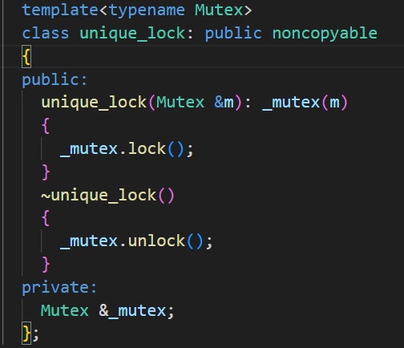

`std::unique_lock` 对象的析构函数在以下情况下执行：

1. 当 `std::unique_lock` **对象超出其作用域时，即离开了对象所在的代码块时，析构函数会被调用**。
2. 当 `std::unique_lock` 对象被显式地销毁时，即通过调用 `std::unique_lock` 对象的 `unlock()` 或 `release()` 成员函数，或者将其赋值为另一个 `std::unique_lock` 对象时，析构函数会被调用。
3. 当 `std::unique_lock` 对象作为参数传递给一个函数，并在函数内部被销毁时，析构函数会被调用。

需要注意的是，当 `std::unique_lock` 对象的析构函数被调用时，它会自动释放所管理的互斥量。这意味着，当 `std::unique_lock` 对象被销毁时，它所持有的互斥量将被解锁。这种自动解锁的机制可以有效地避免忘记手动释放互斥量而导致的死锁等问题。

**众所周知，{}是放在栈上面的，所以离开了作用域后，就会执行析构函数，自动给mutex解锁。**


## 条件变量-condition_variable

在 C++ 多线程编程中，条件变量（`std::condition_variable`）必须与互斥锁（`std::mutex`）搭配使用，主要原因在于 **线程间对共享数据的同步访问** 和 **避免竞态条件**。以下是详细的解释：

---

### 1. **保护共享数据的状态**
条件变量的核心作用是让线程等待某个条件成立（例如“队列非空”或“资源可用”），而条件的判断和修改通常涉及对共享数据的操作（如队列的状态）。  
- **互斥锁的作用**：确保线程在 **检查条件是否成立** 和 **修改共享数据** 时是 **原子操作**。  
- **若不加锁**：多个线程可能同时读写共享数据，导致数据不一致（例如，一个线程正在检查队列是否为空，另一个线程却在修改队列）。

#### 示例场景（生产者-消费者模型）：
```cpp
std::queue<int> queue;  // 共享队列
std::mutex mtx;         // 保护队列的互斥锁

// 消费者线程
void consumer() {
    // 错误示例：不加锁直接访问共享队列
    while (queue.empty()) {  // 非原子操作，可能被其他线程打断
        // 等待队列非空...
    }
    // 取数据...
}
```
- 在无锁的情况下，生产者可能在消费者检查 `queue.empty()` 之后、取数据之前修改队列，导致数据竞争。

---

### 2. **条件变量的等待机制需要锁**
当线程调用 `cv.wait()` 时，条件变量会执行以下操作：  
1. **释放锁**：让其他线程有机会修改共享数据。  
2. **进入等待状态**：直到被 `notify_one()` 或 `notify_all()` 唤醒。  
3. **重新获取锁**：唤醒后自动重新获取锁，确保后续操作的安全性。

#### 关键流程：
```cpp
std::unique_lock<std::mutex> lock(mtx);
cv.wait(lock, [] { return !queue.empty(); });  // 自动释放锁 -> 等待 -> 重新获取锁
```
- **必须使用 `std::unique_lock`**：因为 `wait()` 需要在等待期间释放锁，而 `lock_guard` 不支持手动释放。
- lock_guard必须得是离开作用域之后在解锁，但是wait涉及到频繁的加解锁

---

### 3. **避免虚假唤醒（Spurious Wakeup）**
操作系统可能在某些情况下（如信号中断）导致线程被意外唤醒，即使条件尚未满足。因此，线程在唤醒后必须 **重新检查条件是否成立**。  
- **互斥锁的作用**：确保在检查条件时，共享数据不会被其他线程修改。  
- **条件变量必须与锁绑定**：否则无法保证检查条件的原子性。

#### 正确写法：
```cpp
std::unique_lock<std::mutex> lock(mtx);
// 使用循环或带谓词的 wait() 避免虚假唤醒
cv.wait(lock, [&] { return !queue.empty(); });  // 谓词会循环检查条件
```

---

### 4. **通知机制需要锁**
当线程调用 `notify_one()` 或 `notify_all()` 时，通常需要先修改共享数据（例如向队列中添加数据），而修改操作必须通过锁保护。  
- **锁的作用**：确保其他线程看到的共享数据是修改后的最新状态。

#### 生产者示例：
```cpp
void producer() {
    {
        std::lock_guard<std::mutex> lock(mtx);  // 修改共享数据前加锁
        queue.push(42);
    }  // 锁在作用域结束后自动释放
    cv.notify_one();  // 通知消费者
}
```

---

### 总结：条件变量与互斥锁的关系
| **条件变量**                           | **互斥锁**                          |
| -------------------------------------- | ----------------------------------- |
| 管理线程的等待和通知机制               | 保护共享数据的原子访问              |
| 依赖锁来确保检查条件的原子性           | 提供对共享数据的独占访问            |
| 在等待期间自动释放锁，唤醒后重新获取锁 | 通过 `lock()`/`unlock()` 控制临界区 |

---

### 常见错误
1. **不加锁直接访问共享数据**：导致数据竞争。
2. **使用 `lock_guard` 调用 `cv.wait()`**：`lock_guard` 无法释放锁。
3. **不在循环中检查条件**：可能导致虚假唤醒后误判条件。

---

### 最终答案
条件变量必须与互斥锁搭配使用，因为：  
1. **共享数据的保护**：条件变量本身不保护共享数据，必须通过互斥锁确保条件的检查和修改是原子操作。  
2. **等待/通知的原子性**：`cv.wait()` 需要释放锁以避免死锁，并在唤醒后重新获取锁。  
3. **避免竞态条件**：防止多个线程同时修改和检查共享数据。  

两者的协同工作确保了线程安全的高效同步。


## 条件变量实现线程安全queue

```c++
//
// Created by sophda on 2025/5/9.
//

#ifndef SAFEQUEUE_THREADSAFEQUEUE_H
#define SAFEQUEUE_THREADSAFEQUEUE_H
#include <iostream>
//#include <deque>
#include <mutex>
#include <condition_variable>
#include <queue>

template<class T>
class SafeQueue {

private:
    mutable std::mutex mutex_;
    std::queue<std::shared_ptr<T > > queue_;
    std::condition_variable cond_;

public:
    SafeQueue()=default;

    bool is_empty(){
        std::unique_lock<std::mutex> lock(mutex_);
        return queue_.empty();
    }
    
    void push(std::shared_ptr<T> item)
    {
        std::unique_lock<std::mutex> lock(mutex_);
        queue_.push(item);
        cond_.notify_one();
    };
    
    std::shared_ptr<T > wait_and_pop(){
        std::unique_lock<std::mutex > lock(mutex_);
        
        cond_.wait(lock, [this](){return !queue_.empty();});
        // 对比下面的 写法
        cond_.wait(lock, [this](){return !this->is_empty();});

        std::shared_ptr<T > temp = queue_.front();
        queue_.pop();
        return temp;
    };

};


#endif //SAFEQUEUE_THREADSAFEQUEUE_H

```

需要注意的是，条件变量的`wait`函数的工作机制。当调用`cond_.wait(lock, predicate)`时，`wait`会先释放锁，然后阻塞线程，直到被其他线程的通知唤醒。**当线程被唤醒后，`wait`会重新获取锁，并检查`predicate`条件是否为真。**如果为真，则继续执行；否则，再次释放锁并阻塞。

在wait的过程中，锁是释放的，这时候可以加锁，但是**当被其他线程notify之后，会先上锁，然后检查谓语**，

`cond_.wait(lock, [this](){return !this->is_empty();});`那么这句话会执行什么呢？ 首先被notify后会上锁，然后执行this->is_empty()，也就是说mutex已经被锁住了，但是is_empty会上锁，导致mutex重复上锁，导致未定义的行为。

**谓语中尽量不要上锁，尤其是不要和wait的锁冲突！！**


## 原子操作之std::atomic

**为什么要有内存顺序？**

因为在计算机中，为了发挥极致的性能，编译器和cpu会对代码指令进行重排。

- 编译器重排是指：编译器在生成汇编代码时，如果发现两条指令互相不依赖，可能会调换他们的顺序以优化寄存器使用或改善指令流水线
- CPU重排：为了充分利用执行单元和隐藏内存访问延迟，可能会乱序执行，一个核心的写入可能不会立即被其他的核心看到。

---

### **1.`std::memory_order_relaxed`**

**含义**：最宽松的顺序。

**保证**：只保证当前原子操作的原子性。不提供任何额外的同步或顺序保证。

**比喻**：一个“独行侠”。它只管自己完成任务（原子地读或写），不关心也不影响它前面或后面的任何其他读写操作。编译器和 CPU可以随意地将它与周围的非原子指令重排。

**用途**：适用于那些**不用于同步线程**、只用于计数或统计等“单打独斗”的场景。例如，一个简单的引用计数器或性能监控计数器。

**示例**：

```cpp
std::atomic<int> counter = {0};

// 线程A、B、C...
void increment() {
    // 增加计数器。我们不在乎这个操作和其他内存访问的顺序。
    // 我们只关心它最终被正确地增加了。
    counter.fetch_add(1, std::memory_order_relaxed);
}
```

**警告**：如果你需要根据 `counter` 的值来判断其他共享数据的状态，`relaxed` 就不够了。


### **2.`std::memory_order_release`(释放)和`std::memory_order_acquire`(获取)**

`std::memory_order_release`

- **用于**：**写操作**（`store`, `exchange`, `fetch_add` 等）。
- **保证**：在 `release` 操作**之前**的所有内存读写（原子的或非原子的），都不能被重排到该操作**之后**。它就像一道向上的屏障。
- **比喻**：**“发送方”或“发布者”**。它在发送消息（写入原子变量）前，确保所有要“打包”的数据都已经准备好。它向其他线程“释放”了这些数据的所有权。

`std::memory_order_acquire`

- **用于**：**读操作**（`load`, `exchange`, `fetch_add` 等）。
- **保证**：在 `acquire` 操作之后的所有内存读写，都不能被重排到该操作**之前**。它就像一道向下的屏障。
- **比喻**：**“接收方”或“订阅者”**。它在确认收到消息（读取原子变量）后，才会去“解包”并使用这些数据。它从其他线程“获取”了数据。

**这里的要求的内存顺序重排，是指的在这个线程中，release之前的严格先于release语句；acquire之后的严格后于acquire语句。使用生产者-消费者来说明：必须得先生产出来释放（release）之后，消费才能获取（acquire）**

---

`std::memory_order_release` 和 `std::memory_order_acquire`是如何起作用的？

**这两条指令是约束的一个线程内的行为。**

让我们把这个过程拆解开来，就能彻底明白。

**第一步：`release` 的本地承诺**

想象一个线程 A，它正在执行以下代码：

```cpp
// 线程 A 的代码
void producer() {
    // 1. 普通的内存写入
    shared_data = 42;
    data_is_ready = true;

    // 2. release 操作
    flag.store(true, std::memory_order_release); 
}
```

`std::memory_order_release` 在这里的作用，就像是对编译器和CPU下达了一个命令：

> “听着，`flag.store` 是一个关键的发布点。在我的这个线程里，**任何在代码书写顺序上位于 `flag.store` 之前的读写操作**（比如对 `shared_data` 和 `data_is_ready` 的写入），都**绝对不能**被重排到 `flag.store` 这条指令**之后**去执行。你必须保证，在我宣布‘标志为真’之前，所有准备工作都已完成并刷新到内存中。”

所以，这个“之前”是严格限制在**线程A内部**的指令顺序。它保证了线程A的执行流程是：

1. 完成所有准备工作（写入 `shared_data` 等）。
2. 然后，才去设置那个 `flag`。

这只是故事的一半。到目前为止，这还只是线程A的“一厢情愿”。

**第二步：`acquire` 的跨线程感知**

现在，另一个线程 B 登场了。它如何知道线程 A 的准备工作已经完成？通过 `acquire`。

```cpp
// 线程 B 的代码
void consumer() {
    // 3. acquire 操作
    while (!flag.load(std::memory_order_acquire)) {
        // 等待...
    }

    // 4. 使用数据
    // 到这里时，我们就能安全地使用数据了
    if (data_is_ready) {
        std::cout << "Data is " << shared_data << std::endl; // 保证能看到 42
    }
}
```

当线程 B 的 `flag.load(std::memory_order_acquire)` 成功读取到 `true` 时，一个神奇的跨线程“因果关系”就建立起来了。

`acquire` 语义在这里的作用是：

> “听着，`flag.load` 是一个关键的接收点。一旦我成功读取到了由 `release` 操作写入的值，我就有权**看到**那个 `release` 操作**之前**发生的所有内存写入。并且，在我这个线程里，任何在代码顺序上位于 `flag.load` **之后**的读写操作（比如读取 `shared_data`），都**绝对不能**被重排到 `flag.load` **之前**去。”

---

**通过原子操作实现两个线程打印奇偶数：**

```c++
class PrintJO_ATOMIC {
private:
    std::atomic<bool> is_print_j_{false}; //= {false};
    int num = 0;
public:
    PrintJO_ATOMIC() = default;
    void print_j() {
        for (int i = 1; i < 100; i+=2) {
            while(!is_print_j_.load(std::memory_order_acquire)){} ;
                printf("jshu: %d\n", i);
                is_print_j_.store(false, std::memory_order_release);
        }
    }
    void print_o() {
        for (int i = 0; i < 100; i+=2) {
            while(is_print_j_.load(std::memory_order_acquire)){};
                printf("oshu: %d\n",i);
                is_print_j_.store(true, std::memory_order_release);
        }
    }
    void start() {
        std::thread *p_j = new thread(&PrintJO_ATOMIC::print_j, this);
        std::thread *p_o = new thread(&PrintJO_ATOMIC::print_o, this);
        p_j->join();
        p_o->join();
    }
};
```

- 第9、16行中的while是**忙等待（自旋锁）**，也就是说当条件为真时，不会执行下面的指令
- 因为要在两个线程之间进行切换，所以要设置一个公共变量作为flag，不想让哪个线程工作，就让这个线程的自旋锁工作（while循环），然后另一个线程就可以工作了。
- order acquire之后的指令会严格在order之后执行，当自旋锁的while死循环跳出来之后，说明别的线程已经完成了状态切换，后面就可以按顺序执行了。
- acquire 和 release只保证了在当前线程中按照一定的顺序执行，但是跨线程不能通知，所以设置标志位，但是标志位什么时候知道修改了呢？通过自旋锁不断查询标志位状态，然后执行后续指令。


## 信号量

信号量是多线程中的同步原语，**其核心功能就是在资源不可用时阻塞线程**

---

信号量时一个非负整数计数器，用于控制多个线程对优先数量共享资源的访问，主要有两个原子操作：

1. `acquire`：
   - 尝试获得一个许可证
   - 如果信号量的计数器大于0，那么就减1，然后线程继续执行
   - 如果信号量的计数器等于0，那么就没有许可证，线程会被阻塞，直到其他线程释放许可证。
2. `release`：
   - 释放一个许可证
   - 将信号量的计数器加1
   - 如果此时有其他的线程因为等待该信号量而被阻塞，那么其中一个线程将被唤醒

---

一个绝佳的比喻：停车场

把一个信号量想象成一个停车场的入口处的电子显示牌，上面写着“**剩余车位：N**”。

- **信号量的初始值**：停车场的总车位数（`N`）。
- **`acquire()` 操作**：一辆车想要进入停车场。
  - 如果 `N > 0`，显示牌数字减1，车辆进入。
  - 如果 `N = 0`，入口栏杆不会抬起，车辆必须在外面排队等待（线程被阻塞）。
- **`release()` 操作**：一辆车从停车场离开。
  - 显示牌数字加1。
  - 如果外面有车在排队等待，栏杆抬起，让排在最前面的车进入（唤醒一个被阻塞的线程）。

---

### 1. C++20中的信号量

在C++20标准之前，C++本身没有提供标准的信号量实现，开发者需要依赖操作系统API（如POSIX的`sem_t`）或第三方库（如Boost）。**自C++20起，信号量成为标准库的一部分**，位于`<semaphore>`头文件中。

C++20提供了两种信号量：

1. **`std::counting_semaphore<N>`**:
   - 通用信号量，计数器可以是一个任意的非负数。
   - 这就像上面提到的停车场，可以管理多个资源。`N` 是一个模板参数，代表了计数器的最大值。
   - 构造时需要传入初始的许可证数量。
2. **`std::binary_semaphore`**:
   - 一种特殊的信号量，其计数器的值只能是 `0` 或 `1`。
   - 功能上非常类似于互斥锁（`std::mutex`），用于保护**单个共享资源**，确保同一时间只有一个线程可以访问。
   - **与Mutex的关键区别**：互斥锁要求**同一个线程**必须执行 `lock()` 和 `unlock()`。而二进制信号量允许一个线程 `acquire()`，而由**另一个线程** `release()`，这在某些复杂的同步场景（如生产者-消费者）中非常有用。

---

### 2. C++代码示例

下面的代码模拟了一个**数据库连接池**的场景。假设我们的连接池中只有 **3** 个可用的数据库连接。我们启动10个线程，每个线程都尝试获取连接并执行工作。

```c++
#include <iostream>
#include <thread>
#include <vector>
#include <semaphore>
#include <chrono>

// 假设我们的连接池最多只有3个连接
constexpr int MAX_CONNECTIONS = 3;

// 创建一个计数信号量，初始许可证数量为3
std::counting_semaphore<MAX_CONNECTIONS> connection_pool(MAX_CONNECTIONS);

void use_connection(int thread_id) {
    std::cout << "线程 " << thread_id << " 正在等待数据库连接...\n";

    // 1. acquire: 尝试获取一个连接许可证，如果池满则阻塞
    connection_pool.acquire();

    std::cout << "线程 " << thread_id << " 成功获取连接，正在执行工作...\n";
    // 模拟使用连接进行耗时操作
    std::this_thread::sleep_for(std::chrono::seconds(2));

    std::cout << "线程 " << thread_id << " 工作完成，释放连接。\n";
    
    // 2. release: 将连接许可证归还给池子
    connection_pool.release();
}

int main() {
    std::vector<std::thread> threads;
    // 启动10个线程，但连接池只有3个名额
    for (int i = 0; i < 10; ++i) {
        threads.emplace_back(use_connection, i);
    }

    for (auto& t : threads) {
        t.join();
    }

    return 0;
}
```

**运行分析：** 当你运行这个程序，你会立刻看到3个线程成功获取连接并开始工作。其余的7个线程会打印“正在等待...”然后被阻塞。当最初的3个线程中有任何一个完成工作并调用`release()`后，一个等待中的线程就会立即被唤醒，`acquire()`成功，并开始工作。整个过程，同时工作的线程数量永远不会超过3个。


# 异步

**异步的设计理念是：不阻塞当前线程，去执行其他任务。**

## std::future

`std::future` 是C++标准库中的一个工具，它代表了一个**异步操作**（即在后台运行的任务）的最终结果。你可以把它想象成一张**“提货单”**或者一个**“承诺凭证”**。当你启动一个异步任务时，你不会立即得到结果，而是会立刻拿到这张“提货单”。然后，你可以拿着它在未来的某个时刻去提取任务完成后的真正结果。

这个机制使得主线程不必在原地等待任务完成，可以继续执行其他工作，只在需要结果的时候才去获取，从而提高了程序的效率和响应性。

你不能直接创建 `std::future`，而是通过以下三种主要方式从一个异步任务中获得它：

----

**获取方式**

###  `std::async`

这是最简单的异步运行一个函数的方式。`std::async` 会启动一个函数（可能在一个新线程中），并立即返回一个 `std::future` 对象，这个对象最终将持有该函数的返回值。

```c++
#include <iostream>
#include <future>
#include <chrono>

// 一个耗时的计算函数
int heavy_calculation() {
    std::this_thread::sleep_for(std::chrono::seconds(2));
    return 100;
}

int main() {
    // 启动计算任务，并获取一个指向其结果的 future
    std::future<int> result_future = std::async(std::launch::async, heavy_calculation);

    std::cout << "计算正在后台运行，主线程可以做点别的事情...\n";

    // 调用 .get() 等待并获取结果，如果没有完成才会阻塞线程。在get之前执行其他任务是不会阻塞的
    int result = result_future.get();
    std::cout << "计算结果是: " << result << std::endl;
}
```


### `std::packaged_task`

这个对象可以将一个函数包装起来，以便稍后执行。你可以在任务真正运行前，就从 `packaged_task` 中获取 `std::future`。这对于更复杂的场景（如线程池）非常有用，因为它将“任务的创建”和“任务的执行”分离开来。

```c++
#include <iostream>
#include <future>
#include <thread>

int main() {
    // 将一个 lambda 函数包装进 packaged_task
    std::packaged_task<int()> task([]{ return 200; });

    // 在任务运行前就获取 future
    std::future<int> result_future = task.get_future();

    // 在一个新线程上运行这个任务
    std::thread t(std::move(task));
    t.detach(); // 分离线程，让它在后台独立运行

    // 获取结果
    std::cout << "计算结果是: " << result_future.get() << std::endl;
}
```


###  `std::promise`

`std::promise` 对象可以让你**手动地**设置一个值（或一个异常），而这个值可以被一个与之关联的 `std::future` 获取。这让你能更精细地控制结果在何时变为可用。

```
#include <iostream>
#include <future>
#include <thread>
#include <chrono>

// 这个函数在稍后设置一个值
void set_value_later(std::promise<int> p) {
    std::this_thread::sleep_for(std::chrono::seconds(2));
    p.set_value(300); // 兑现承诺
}

int main() {
    std::promise<int> my_promise;
    std::future<int> result_future = my_promise.get_future();

    std::thread t(set_value_later, std::move(my_promise));
    t.detach();

    std::cout << "正在等待承诺被兑现...\n";
    std::cout << "计算结果是: " << result_future.get() << std::endl;
}
```

------


### 如何使用 `std::future`

`std::future` 对象有几个关键的成员函数来与异步结果进行交互：

- **`get()`**: 等待任务完成，然后返回其结果。**这个函数只能被调用一次**。在 `get()` 被调用后，`future` 对象会变为无效状态。
- **`wait()`**: 阻塞当前线程，直到结果可用，但它**不会**获取结果。之后你仍然可以调用 `get()` 来获取它。
- **`wait_for()`**: 等待指定的时长。它会返回一个状态，用以表明是任务完成了还是等待超时了。
- **`valid()`**: 检查 `future` 是否仍然与一个有效的结果关联。在 `get()` 被调用后，或者 `future` 被移动（move）后，它会返回 `false`。


# STL

## std::string

```
std::string str;
str.size();
```


## std::pair


## std::sort

与lambda结合的方式：

```c++
#include<bits/stdc++.h>
using namespace std;
int a[15]={0,10,9,8,1,5,2,3,6,4,7};
int main()
{
	sort(a,a+11,[](int x,int y){return x>y;});
	for(int i=0;i<=10;i++)
	cout<<a[i]<<" ";
	return 0;
}
```


## std::reverse

用于对容器的内容进行颠倒。

```cpp
vector<int> vec;
reverse(vec.begin(), vec.end());
```


## std::move

### **基本原理**

在 C++ 中，移动语义允许对象的资源所有权（例如动态分配的内存）从一个对象转移到另一个对象，而不是像复制构造函数那样创建资源的副本。这样做可以显著提高性能，尤其是在处理大型数据结构或需要频繁分配和释放资源的场景下。

### **`std::move` 的作用**

- **右值引用**: C++ 引入了**右值引用（`T&&`）的概念**，允许我们通过“移动”而非“复制”来处理资源。`std::move` 通过将一个左值转换为右值引用，启用了移动语义。

- **不进行深拷贝**: 通过使用 `std::move`，对象的资源所有权可以被转移，通常不会发生额外的深拷贝操作，从而提升性能。

- 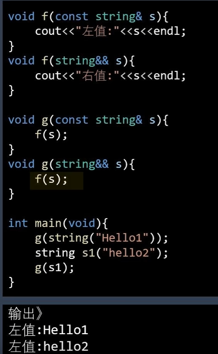

  如图所示：尽管形参中的string && s是个右值引用，但是s本事是有地址的，是个左值。

### **如何使用 `std::move`**

```c++
#include <iostream>
#include <vector>

class MyClass {
public:
    MyClass() { std::cout << "Constructor\n"; }
    MyClass(const MyClass& other) { std::cout << "Copy constructor\n"; }
    MyClass(MyClass&& other) noexcept { std::cout << "Move constructor\n"; }
    ~MyClass() { std::cout << "Destructor\n"; }
};

int main() {
    MyClass a;
    MyClass b = std::move(a);  // Move constructor
}

```

在上面的例子中，`std::move(a)` 将 `a` 转换为右值引用，启用了 `MyClass` 的移动构造函数。这样，`b` 将“接管”`a` 的资源，而不是进行复制。

### **使用场景**

- **容器类的元素转移**: 在使用 `std::vector` 或 `std::string` 等标准容器时，移动语义能够提高性能，避免不必要的拷贝。例如，向容器中插入或返回对象时，`std::move` 可以减少不必要的复制。

```
std::vector<MyClass> vec;
MyClass obj;
vec.push_back(std::move(obj));  // 使用移动语义
```

- **返回大型对象时**: 当函数返回一个大型对象时，`std::move` 可以避免创建副本。

```
MyClass createObject() {
    MyClass obj;
    // Do something with obj
    return obj;  // Move instead of copy
}

MyClass obj2 = createObject();  // Move constructor

```

###  **注意事项**

- **不可重复使用的资源**: 移动后，**源对象的状态是未定义的（通常为空或处于某种有效但未指定的状态）**，因此不能再对其执行操作。尽管如此，源对象仍然可以安全地被销毁。
- **必须显式调用 `std::move`**: `std::move` 是一个类型转换操作，它不会自动执行“移动”。也就是说，在你希望启用移动语义时，必须显式调用 `std::move`。


## std::function & bind

可以完全替代以前那种繁琐的函数指针形式。

使用方法是：`std::function<返回值(形参)> function函数名`

---

声明一个function：

```c++
std::function<void()>：表示一个无参数、无返回值的函数。

std::function<int(int, int)>：表示一个接受两个int参数并返回int的函数。

std::function<double(std::vector<double>&)>：表示一个接受vector<double>引用并返回double的函数。
```

示例：

1. 包装普通函数：

   ```c++
   #include <iostream>
   #include <functional>
   
   int add(int a, int b) {
       return a + b;
   }
   
   int main() {
       std::function<int(int, int)> func = add;
       std::cout << func(2, 3) << std::endl; // 输出5
       return 0;
   }
   ```

2. 包装lambda表达式

   ```c++
   #include <iostream>
   #include <functional>
   
   struct Adder {
       int operator()(int a, int b) const {
           return a + b;
       }
   };
   
   int main() {
       std::function<int(int, int)> func = Adder();
       std::cout << func(5, 6) << std::endl; // 输出11
       return 0;
   }
   ```

3. 包装类成员函数

   ```c++
   #include <iostream>
   #include <functional>
   #include <memory>
   
   class MyClass {
   public:
       int add(int a, int b) {
           return a + b;
       }
   };
   
   int main() {
       MyClass obj;
       // 使用std::bind绑定对象和成员函数
       std::function<int(int, int)> func = std::bind(&MyClass::add, &obj, std::placeholders::_1, std::placeholders::_2);
       std::cout << func(7, 8) << std::endl; // 输出15
   
       // 或者使用lambda表达式
       std::function<int(int, int)> func2 = [&obj](int a, int b) { return obj.add(a, b); };
       std::cout << func2(9, 10) << std::endl; // 输出19
   
       return 0;
   }
   ```

   


## std::tuple


## std::accumulate

### 累加

```cpp
vector<int> nums;
std::accumulate(nums.begin(), nums.end(), 0);
```

`std::accumulate()`传递进去的迭代器是**左闭右开**的形式，也就是说`nums.end()`其实指向的结尾元素的下一个迭代器。

---

如果只知道索引i和j，不知道迭代器，怎么去进行累加呢？

```cpp
// 对下标i->j的元素进行累加
std::accumulate(nums.begin()+i, nums.begin()+j+1,0);
```


# 容器

## 总览

### 顺序容器

（Sequential Containers）

顺序容器中的元素按照**线性顺序**排列，每个元素有特定的位置（通过下标或迭代器访问）。

|      容器类型      |      头文件      |                             特点                             |              适用场景              |
| :----------------: | :--------------: | :----------------------------------------------------------: | :--------------------------------: |
|    **`vector`**    |    `<vector>`    | 动态数组，支持快速随机访问；尾部插入/删除高效，中间操作低效  |  需要随机访问、频繁尾部操作的场景  |
|    **`deque`**     |    `<deque>`     |    双端队列，支持头尾高效插入/删除；随机访问比vector稍慢     | 需要频繁在两端操作的场景（如队列） |
|     **`list`**     |     `<list>`     |   双向链表，任意位置插入/删除高效（O(1)）；不支持随机访问    |   需要频繁在中间插入/删除的场景    |
| **`forward_list`** | `<forward_list>` |       单向链表（C++11），内存占用更小；只支持单向遍历        |     内存敏感场景，只需单向操作     |
|    **`array`**     |    `<array>`     | 固定大小数组（C++11），比原生数组更安全（支持迭代器、STL算法） |       需要固定大小容器的场景       |
|    **`string`**    |    `<string>`    |      类似`vector<char>`，专为字符串设计，支持字符串操作      |              文本处理              |

**关键特性：**

- 元素位置由插入顺序决定
- 支持顺序访问（迭代器遍历）
- 部分支持随机访问（`vector`, `deque`, `array`）

------

### 非顺序容器

（Non-sequential Containers）

非顺序容器中的元素**没有严格物理顺序**，通过键（Key）或哈希值组织元素。

#### A. 关联容器（Associative Containers）

基于**红黑树**实现，元素按键**有序存储**（默认升序）。

|    容器类型    | 头文件  |            特点            |         适用场景         |
| :------------: | :-----: | :------------------------: | :----------------------: |
|   **`set`**    | `<set>` |    唯一键集合，自动排序    |  需要有序唯一元素的集合  |
| **`multiset`** | `<set>` | 允许重复键的集合，自动排序 |    允许重复的有序集合    |
|   **`map`**    | `<map>` |  键值对集合，键唯一且排序  |  字典式数据（如配置项）  |
| **`multimap`** | `<map>` |   允许重复键的键值对集合   | 一键多值映射（如电话簿） |

#### 无序关联容器

（Unordered Associative Containers）

基于**哈希表**实现（C++11），元素**无序存储**。

|         容器类型         |      头文件       |           特点           |        适用场景        |
| :----------------------: | :---------------: | :----------------------: | :--------------------: |
|   **`unordered_set`**    | `<unordered_set>` |      唯一键哈希集合      |    快速查找唯一元素    |
| **`unordered_multiset`** | `<unordered_set>` |   允许重复键的哈希集合   |  快速查找（允许重复）  |
|   **`unordered_map`**    | `<unordered_map>` |   键值对哈希表，键唯一   | 快速键值查找（如缓存） |
| **`unordered_multimap`** | `<unordered_map>` | 允许重复键的键值对哈希表 |    一键多值快速查找    |


### 迭代器失效的情况

|      容器类型       |         插入操作迭代器失效情况         |         删除操作迭代器失效情况         |
| :-----------------: | :------------------------------------: | :------------------------------------: |
|      `vector`       |   插入点之后失效（重分配则全部失效）   |             删除点之后失效             |
|       `deque`       | 首尾插入：首尾可能失效；中间：全部失效 | 首尾删除：被删元素失效；中间：全部失效 |
|       `list`        |           所有迭代器保持有效           |            只有被删元素失效            |
|   `forward_list`    |           所有迭代器保持有效           |            只有被删元素失效            |
|   `set/multiset`    |           所有迭代器保持有效           |            只有被删元素失效            |
|   `map/multimap`    |           所有迭代器保持有效           |            只有被删元素失效            |
| `unordered_set/map` |       重哈希则全部失效，否则有效       |            只有被删元素失效            |


## vector

**definition**

```c
#include<vector>
vector<string> sver;
```

**容器的容器**

```c
vector<vector<string>>
```

**迭代器**

  ***iter 返回迭代器 iter 所指向的元素的引用**

 **iter->mem 对 iter 进行解引用，获取指定元素中名为 mem 的成员。等效于 (*iter).mem**

++iter， iter++ 给 iter 加 1，使其指向容器里的下一个元素

迭代器中点

vector::iterator iter = vec.begin() + vec.size()/2;

创建iter迭代器，指向容器中的元素

5.访问容器

```c
//1.1 iterator显示声明
for (std::map<int, std::string>::iterator iter = test.begin(); iter != test.end(); iter++)
{
    std::cout << iter->second << std::endl;
}

//1.2 iterator auto关键字自动推断类型
for (auto iter = test.begin(); iter != test.end(); iter++)
{
    std::cout << iter->second << std::endl;
}
```

```c
//2.1 for each，类型显示声明
for each (std::pair<int, std::string> tt in test)
{
    std::cout << tt.second << std::endl;
}

//2.2 for each, auto关键字自动推断类型
for each (auto tt in test)
{
    std::cout << tt.second << std::endl;
}
```

```c
//3.1 增强型for循环
for (auto iter : test)
{
    std::cout << iter.second << std::endl;
}
```

### 相关函数

- vector::reserve()

  ```
  /**
  *@function 申请n个元素的内存空间
  *@param n  元素个数
  */
  void reserve (size_type n);
  
  ```

  也就是说reserve是申请内存空间，但是vector可以自动拓展的，也就是根据元素的个数自动申请内存，那么为什么还要使用reverse去申请内存呢？

  对比下两种方法：

  ```
  fun 1：
  vector vec;
  vector.push_back();//调用100次
  
  fun 2 :
  vec.reserve(100);
  vec.push_back(); //调用100次
  ```

  这两种方法中，fun1需要申请100次内存，相当耗时；但是fun2的话就申请了一次内存，相对来说可以减少了很多时间

### 反向迭代（rbegin和rend）

> 比如有一个场景是：需要视频倒放，可以将frame放到vector中，然后使用反向迭代器

主要使用`rbegin` 和`rend`两个关键词，至于使用end和begin进行反向迭代的，由于可能出现越界，所以还是使用下面的比较保险

```c++
for (auto iter = vec_frame.rbegin(); iter != vec_frame.rend(); ++iter)
{
    // 这里对每个元素执行操作
}

```


### 二维容器

```c++
    vector<vector<int>> a;
//    a[0][0] = 1;
    a.push_back({0,1,2,3});
    a.push_back({1,2,3,4});
    cout<< a[1][1];
```

### 动态扩展的原理

当 `vector` 的当前容量（`capacity()`）不足以容纳新元素时，会触发动态扩展：

1. 分配新内存
   - 申请一块更大的内存（通常是当前容量的 **1.5 倍或 2 倍**，具体由编译器实现决定）。
   - GCC 通常使用 **2 倍**，MSVC 使用 **1.5 倍**。
2. 迁移数据
   - 将旧内存中的元素**复制或移动**到新内存。
   - 如果是 C++11 及以上，且元素支持移动语义，则使用移动构造（高效）。
3. 释放旧内存
   - 销毁旧元素并释放原内存块。
4. 添加新元素
   - 在新内存尾部插入新元素。

### vector移动语义

当 `vector` 重新分配内存时，元素迁移会优先尝试使用移动构造，但需要满足以下条件：

- 元素类型必须具有**可访问的移动构造函数**（即定义了 `T(T&&)`）
- 移动构造函数必须为 `noexcept`（或编译器可确定不会抛出异常）

```cpp
class Item {
public:
    // 移动构造函数（必须定义）
    Item(Item&& other) noexcept : data_(std::move(other.data_)) {
        other.data_ = nullptr;
    }

private:
    int* data_;
};
```

------

** 为什么需要 `noexcept`？**

`vector` 需要在重新分配时提供**强异常安全保证**（即使发生异常也不会泄漏资源）。具体规则：

- 如果移动构造函数可能抛出异常（未标记 `noexcept`），`vector` 会**降级为使用拷贝构造函数**
- 如果连拷贝构造函数也不可用，代码将编译失败

```cpp
class UnsafeItem {
public:
    // 无 noexcept → vector 不会使用此移动构造
    UnsafeItem(UnsafeItem&& other) { ... } 
};

std::vector<UnsafeItem> vec;
// 重新分配时会使用拷贝构造而非移动构造
```


## deque

deque是一个双端队列，支持从队首和队尾插入和删除元素

**构造：**

- `std::deque<T> d;` // 空 deque
- `std::deque<T> d(n);` // 包含 n 个默认初始化的元素
- `std::deque<T> d(n, value);` // 包含 n 个值为 value 的元素
- `std::deque<T> d(begin_it, end_it);` // 用迭代器范围构造
- `std::deque<T> d(other_deque);` // 拷贝构造
- `std::deque<T> d(std::move(other_deque));` // 移动构造 (C++11)
- `std::deque<T> d({1, 2, 3});` // 初始化列表构造 (C++11)

---

**元素访问：**

- `d[i]` // 访问索引 i 处的元素（**不检查边界**）
- `d.at(i)` // 访问索引 i 处的元素（**检查边界**，越界抛出 `std::out_of_range`）
- `d.front()` // 访问第一个元素
- `d.back()` // 访问最后一个元素

**迭代器：** 支持所有标准迭代器（`begin`, `end`, `cbegin`, `cend`, `rbegin`, `rend`, `crbegin`, `crend`），用于遍历。

**容量：**

- `d.empty()` // 检查是否为空
- `d.size()` // 返回元素数量
- `d.max_size()` // 返回可能的最大元素数量（理论值）
- `d.shrink_to_fit()` // **请求**移除未使用的容量（**非强制**，实现可能忽略）(C++11)

**修改器：**

- `d.clear()` // 清除所有内容
- `d.insert(pos_it, value)` // 在迭代器 pos_it 前插入 value
- `d.insert(pos_it, n, value)` // 在迭代器 pos_it 前插入 n 个 value
- `d.insert(pos_it, begin_it, end_it)` // 在迭代器 pos_it 前插入迭代器范围
- `d.insert(pos_it, {val1, val2})` // 在迭代器 pos_it 前插入初始化列表 (C++11)
- `d.erase(pos_it)` // 删除迭代器 pos_it 指向的元素
- `d.erase(begin_it, end_it)` // 删除迭代器范围 [begin_it, end_it) 的元素
- `d.push_back(value)` // **在尾部添加元素（拷贝）**
- `d.emplace_back(args...)` // 在尾部**就地构造**元素（避免拷贝/移动）(C++11)
- `d.pop_back()` // **删除尾部元素**
- `d.push_front(value)` // **在头部添加元素（拷贝）**
- `d.emplace_front(args...)` // 在头部**就地构造**元素（避免拷贝/移动）(C++11)
- `d.pop_front()` // **删除头部元素**
- `d.resize(n)` // 改变大小，新元素默认初始化
- `d.resize(n, value)` // 改变大小，新元素初始化为 value
- `d.swap(other_deque)` // 交换两个 deque 的内容


## unordered_map

### 使用

使用哈希表实现，通过下面这个例子看到用法：

即`map[key] = value`

```c++
class Solution {
public:
    vector<int> twoSum(vector<int>& nums, int target) {
        unordered_map<int, int> map_;
        for(int i = 0; i < nums.size(); i++)
        {
            if(map_.find(nums[i]) != map_.end())
            {
                return {map_.find(nums[i]), i };
            }

            map_[target-nums[i]] = i;

        }
    }
};
```

函数：

- map.find 通过key查找，返回迭代器

----

如果索引一个不存在的键：

**`operator[]`的行为**：当你使用 `map[key]`访问一个不存在的键时，`std::unordered_map`会自动插入一个新的键值对。键是 `key`，值被**值初始化**（value-initialized）。对于整数类型（如 `int`），值初始化会将其设置为 `0`。

**递增操作**：随后，`++`操作符会对这个新值进行递增。因此，初始值 `0`经过递增后变为 `1`。

### unordered_map支持自定义类

`std::unordered_map`要求：

1. **哈希函数**（计算键的哈希值）
2. **相等比较**（判断两键是否相同）

#### 方法1：特化`std::hash`并提供`operator==`

```cpp
class TreeNode {
public:
    int id;  // 唯一标识
    // ...

    // 必须重载==运算符
    bool operator==(const TreeNode& other) const {
        return id == other.id;  // 用唯一ID判断相等
    }
};

// 特化std::hash
namespace std {
    template <>
    struct hash<TreeNode> {
        size_t operator()(const TreeNode& node) const {
            return hash<int>()(node.id);  // 用ID生成哈希
        }
    };
}

// 使用
std::unordered_map<TreeNode, std::string> nodeUnorderedMap;
```

#### 方法2：自定义哈希器 + 相等器（推荐）

```cpp
class TreeNode {
public:
    int id;
    std::string name;
    // ...
};

// 自定义哈希器
struct TreeNodeHash {
    size_t operator()(const TreeNode& node) const {
        return std::hash<int>()(node.id) ^ 
              (std::hash<std::string>()(node.name) << 1);
    }
};

// 自定义相等器
struct TreeNodeEqual {
    bool operator()(const TreeNode& a, const TreeNode& b) const {
        return a.id == b.id && a.name == b.name;
    }
};

// 使用（需指定哈希和相等器）
std::unordered_map<
    TreeNode, 
    std::string,
    TreeNodeHash,
    TreeNodeEqual
> nodeUnorderedMap;
```

#### 指针作为键的特殊处理

如果使用`TreeNode*`作为键，需自定义比较/哈希规则：

```cpp
struct TreeNodePtrHash {
    size_t operator()(const TreeNode* node) const {
        return std::hash<uintptr_t>()(reinterpret_cast<uintptr_t>(node));
    }
};

struct TreeNodePtrEqual {
    bool operator()(const TreeNode* a, const TreeNode* b) const {
        return a->id == b->id;
    }
};

std::unordered_map<
    TreeNode*, 
    std::string,
    TreeNodePtrHash,
    TreeNodePtrEqual
> ptrUnorderedMap;
```


## **map**

### 基础使用

按关键词有序保存元素，使用“键--值“对

与普通数组不同的是：map可以实现任意类型到任意类型的映射。

1. 可以将任何基本类型映射到任何基本类型。如int array[100]事实上就是定义了一个int型到int型的映射。
2. map提供一对一的数据处理，key-value键值对，其类型可以自己定义，第一个称为关键字，第二个为关键字的值
3. map内部是自动排序的

**通过迭代器访问**

map可以使用it->first来访问键，使用it->second访问值

```c++
#include<map>
#include<iostream>
using namespace std;
int main()
{
   map<char,int>maps;
   maps['d']=10;
   maps['e']=20;
   maps['a']=30;
   maps['b']=40;
   maps['c']=50;
   maps['r']=60;
   for(map<char,int>::iterator it=mp.begin();it!=mp.end();it++)
   {
       cout<<it->first<<" "<<it->second<<endl;
   }
   return 0;
}
```

**常用函数：**

- maps.insert() 插入

  ```cpp
  // 定义一个map对象
  map<int, string> m;
   
  //用insert函数插入pair
  m.insert(pair<int, string>(111, "kk"));
   
  // 用insert函数插入value_type数据
  m.insert(map<int, string>::value_type(222, "pp"));
   
  // 用数组方式插入
  m[123] = "dd";
  m[456] = "ff";
  ```

- maps.find() 查找一个元素

  find(key): 返回键是key的映射的迭代器

  ```c++
  map<string,int>::iterator it;
  it=maps.find("123");
  ```

  这个find是返回了一个iterator，可以直接对这个值前/后进行遍历。如果直接从map中取值，也可以`map["123"]`

- maps.clear()清空

- maps.erase()删除一个元素

  ```c++
  //迭代器刪除
  it = maps.find("123");
  maps.erase(it);
  
  //关键字删除
  int n = maps.erase("123"); //如果刪除了返回1，否则返回0
  
  //用迭代器范围刪除 : 把整个map清空
  maps.erase(maps.begin(), maps.end());
  //等同于mapStudent.clear()
  ```

- maps.szie()长度

  ```
  int len=maps.size();获取到map中映射的次数
  ```

- maps.begin()返回指向map头部的迭代器

  maps.end()返回指向map末尾的迭代器

  ```
  map< string,int>::iterator it;
  for(it = maps.begin(); it != maps.end(); it++)
      cout<<it->first<<" "<<itr->second<<endl;//输出key 和value值
  ```

- maps.empty()判断其是否为空

- maps.swap()交换两个map

- maps.count()  主要是查找key的，无法查找value

  查找容器中是否存在某个元素，**结果只能是0或1**

  ```
  maps.count("123")
  ```

**count与find的区别：**

- find方法返回的是一个迭代器，查找成功则返回迭代器，迭代器指向需要查找的元素。找不到的话：就返回迭代器，指向end
- count返回1，表示找到了；返回0则相反

***


### map支持自定义类

`std::map`要求键具备**严格弱序（Strict Weak Ordering）**，通常通过定义`<`运算符或提供自定义比较器实现。

**方法1：类内重载`<`运算符**

```cpp
class TreeNode {
public:
    int value;
    TreeNode* left;
    TreeNode* right;

    // 重载<运算符
    bool operator<(const TreeNode& other) const {
        return value < other.value;  // 假设用节点值比较
    }
};

// 使用
std::map<TreeNode, std::string> nodeMap;
```


**方法2：外部比较器（推荐）**

```cpp
class TreeNode {
public:
    int value;
    // ... 其他成员
};

struct TreeNodeCompare {
    bool operator()(const TreeNode& a, const TreeNode& b) const {
        return a.value < b.value;
    }
};

// 使用比较器
std::map<TreeNode, std::string, TreeNodeCompare> nodeMap;
```


## map和unordered_map的区别

### **底层数据结构**

|                  |         `std::map`         |      `std::unordered_map`      |
| :--------------: | :------------------------: | :----------------------------: |
|   **实现方式**   | 红黑树（自平衡二叉搜索树） | 哈希表（桶数组 + 链表/红黑树） |
| **元素组织方式** | 按键排序（二叉搜索树性质） |   按键的哈希值组织（无顺序）   |

------

### **元素排序特性**

|                |        `std::map`        |         `std::unordered_map`         |
| :------------: | :----------------------: | :----------------------------------: |
|  **元素顺序**  | **按键升序排序**（默认） |      **无序**（取决于哈希函数）      |
| **自定义排序** | 支持（通过比较函数对象） |                不支持                |
|  **范围遍历**  | 有序（从最小键到最大键） | 完全随机（与插入顺序和哈希函数有关） |

```cpp
// map 有序遍历
std::map<int, std::string> m = {{3, "Alice"}, {1, "Bob"}};
for (auto& p : m) 
    std::cout << p.first; // 输出 1 3（按键升序）

// unordered_map 无序遍历
std::unordered_map<int, std::string> um = {{3, "Alice"}, {1, "Bob"}};
for (auto& p : um) 
    std::cout << p.first; // 可能输出 3 1 或 1 3（顺序不确定）
```

------

### ** 时间复杂度对比**

|     操作     |  `std::map`  |  `std::unordered_map`  |
| :----------: | :----------: | :--------------------: |
|   **插入**   |   O(log n)   |   平均O(1)，最坏O(n)   |
|   **查找**   |   O(log n)   |   平均O(1)，最坏O(n)   |
|   **删除**   |   O(log n)   |   平均O(1)，最坏O(n)   |
| **范围查询** | O(log n + k) | O(n)（需遍历整个容器） |


## **set**

关键字即值，即只保存关键词的容器

插入删除查找的复杂度为对数级，即使用**红黑树算法**实现，**内部数据是有序的**

可以进行：

1. 去重操作
2. 排序操作

使用方法：

```
set<int> s;
s.insert(x); // 插入元素
s.erase(x);  //删除元素，有就删除，无则不管
s.size(x);
s.find(x);  //查找，返回迭代器
s.count(x);
s.empty();看看是否为空
```

```
#include <iostream>
#include <set>
using namespace std;
int main()
{
	set<int> s;
	
}
```


***


## unordered_set

一种哈希集合，可以用来检查有没有重复字符。

- set.insert()  插入元素
- set.count()  查找元素
- set.find() 查找元素，返回元素的迭代器
- set.erase() 删除元素
- set_.cbegin() set的第一个元素的迭代器（指针）


```
class Solution {
public:
    int singleNumber(vector<int>& nums) {
        unordered_set<int> set_;
        for(auto iter : nums) {
            if(set_.count(iter)) {
                set_.erase(iter);
            } else {
                set_.insert(iter);
            }
        }
        return *(set_.cbegin());
    }
};
```


## **multimap**

关键字可以重复的map


## stack

```
stack<char> stk;
stk.empty()  // 判断是不是空的
stk.pop()  // 弹出
stk.push('A')  // 压栈
stk.

```


# boost

## serialization

> 序列化：如果说我们定义了一个类，然后我们想把这个类的对象保存到文件中去，或者通过网络发送出去，那么我们就可以将这个对象序列化，得到二进制字节流。

boost的序列化可以分为两种模式，一种是**侵入式**，另一种是**非侵入式**

### 侵入式

首先定义一个类：（access就是接触，侵入式的）

```c++
class CMyData
{
private:
	friend class boost::serialization::access; 
 
	template<class Archive>
	void serialize(Archive& ar, const unsigned int version)
	{
		ar & _tag;
		ar & _text;
	}
 

public:
	CMyData():_tag(0), _text(""){}
 
	CMyData(int tag, std::string text):_tag(tag), _text(text){}
 
	int GetTag() const {return _tag;}
	std::string GetText() const {return _text;}
 
private:
	int _tag;
	std::string _text;
};
```

可以看到下面这个代码：

```c++
friend class boost::serialization::access;
 
	template<class Archive>
	void serialize(Archive& ar, const unsigned int version)
	{
		ar & _tag;
		ar & _text;
	}
```

就是把我们需要的`_tag`以及`_text`两个私有变量进行了保存，而其他的类成员是函数。为什么函数不会写进序列化中呢？答：因为保存的只是对象的变量，函数的话保存在类的定义里，需要重新实例化这个类，然后加载相关的数据。

接下来可以通过下面的代码进行保存：

```c++
void TestArchive1()
{
	CMyData d1(2012, "China, good luck");
	std::ostringstream os;
	boost::archive::binary_oarchive oa(os);
	oa << d1;//序列化到一个ostringstream里面
 
	std::string content = os.str();//content保存了序列化后的数据。
 
	CMyData d2;
	std::istringstream is(content);
	boost::archive::binary_iarchive ia(is);
	ia >> d2;//从一个保存序列化数据的string里面反序列化，从而得到原来的对象。
 
	std::cout << "CMyData tag: " << d2.GetTag() << ", text: " << d2.GetText() << "\n";
}
```

**我的例子：**

```c++
class MyClass{
private:
    int a,b;
    friend class boost::serialization::access;

    template<class Archive>
    void serialize(Archive &ar ,const unsigned int version){
        ar & a;
        ar & b;
    }
public:
    void print_()
    {
        cout << a<<" "<<b<<endl;
    }
    MyClass()
    {

    }
    MyClass(int x,int y):
    a{x},b{y}
    {
        cout<< "created"<<endl;
    }

};

int main()
{
    {
    MyClass t = MyClass(123, 456);
    ofstream os("/home/sophda/project/learncpp/file/param.bin");
    boost::archive::binary_oarchive oa(os);
    oa << t;
	}

    MyClass p;
    ifstream is("/home/sophda/project/learncpp/file/param.bin");
    boost::archive::binary_iarchive ina(is);
    ina>>p;
    p.print_();
}
```

**说明**：在main函数中，要将保存序列化的部分放到`{}`中，这样做是保证在`{}`作用域执行完毕后，就可以调用archive的析构函数了，这样才能保证保存的数据没有问题。复习一下：一个类在`{}`中，在`{}`中的部分执行完后，会调用这个类的析构函数。因此unique_lock放在`{}`中，执行完后会执行析构，自动为这个mutex解锁。


# PYTHON

## 配置

```
find_package(PythonLibs REQUIRED)
include_directories(${PYTHON_INCLUDE_DIRS})
target_link_libraries(${PYTHON_LIBRARIES})
```

## 初始化

- PyImport_ImportModule 获得对应的py文件

```c++
#include <Python.h>
#include <numpy/arrayobject.h> 

	Py_Initialize();
	PyObject* sys = PyImport_ImportModule("sys");

	PyRun_SimpleString("import sys"); // 执行 python 中的短语句  
	PyRun_SimpleString("sys.path.append('../')");

	PyObject *pModule(0);
	pModule = PyImport_ImportModule("hdf5");//myModel:Python文件名

	if(pModule){
		cout<<"Python init"<<endl;
	}
```


## 基础数据交互

- PyModule_GetDict 获得py文件中**所有函数**，返回dict
- PyDict_GetItemString  根据dict，以及**函数名**，获得对应的函数
- Py_BuildValue 新建一个变量
- PyObject_CallObject 传入变量，如果py没有输入，则为NULL/nullptr

```c++
PyObject *pDict = PyModule_GetDict(pModule);
PyObject *pinit = PyDict_GetItemString(pDict,"init");
PyObject *pgetimg = PyDict_GetItemString(pDict,"getimg");
PyObject *arg = Py_BuildValue("(i)",10);
PyObject_CallObject(pinit,arg);
```

```python
import numpy as np
import h5py
import cv2
import os
filelist = []
h5 = None
def init(arg):
    print("init")
    # 很奇怪，这个和atlas是在一个路径里的
    h5_path="../rgb/targetvideo_depth.h5"
    save_dir='./'
    global filelist
    global h5
    # print("0000")
    h5 = h5py.File(h5_path, 'r')
    os.makedirs(save_dir, exist_ok=True)
    # filelist = h5.keys()
    for key in h5.keys():
        filelist.append(key)
```


## 传图片

```c++
PyObject *pgetimg = PyDict_GetItemString(pDict,"getimg");
PyObject *arg = Py_BuildValue("(i)",10);
PyObject *pyResult = PyObject_CallObject(pgetimg,arg);
PyArrayObject *arr = (PyArrayObject *) pyResult;

// // PyArrayObject *arr = (PyArrayObject *)np;
// // Mat img = Mat::zeros(720,1280);
cv::Mat  img =cv::Mat::zeros(cv::Size(1280,720),CV_16U);
auto sz = cv::Size(1280,720);
int x = sz.width;
int y = sz.height;
int z = 1;
int size = x*y*z;

memcpy((uchar*)img.data,arr->data,1280*720*2);
cout<(50,50)<<endl;
```

```python
def getimg(id):
    # print("getimg")
    id = int(id)
    key = filelist[id]
    # print(key)
    img = cv2.imdecode(np.array(h5[key]), -1)  # 解码
    # print(size_of(img))
    return img
```

