# cuda

# cuda索引

> 参考[CUDA编程入门极简教程 - 知乎](https://zhuanlan.zhihu.com/p/34587739)


主要是通过grid、block、thread这几个索引进行的。

比如在进行矩阵乘法的时候，将一个Grid中的所有block展开，每一个block中的thread展开，那么每一个线程可以对应一个新的矩阵的对应元素。

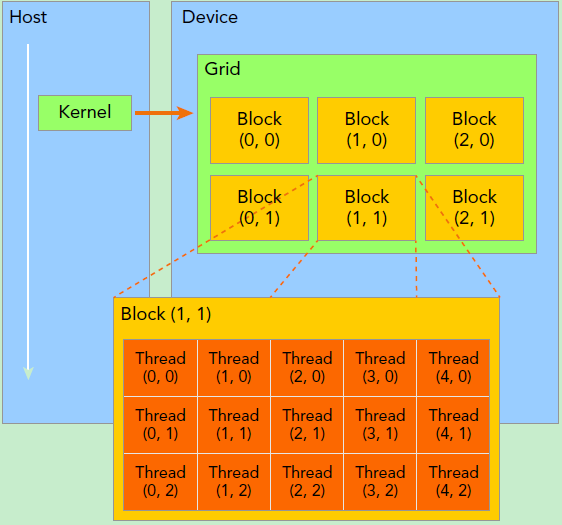


---

比如下面的矩阵乘法的示例中，矩阵C是最后的结果，那么计算C可以用M*N个线程计算。

对于m、n个元素的计算，对应的线程索引为：（也就是每个线程的标记）

```
int m =  blockIdx.y * blockDim.y + threadIdx.y;
int n = blockIdx.x * blockDim.x + threadIdx.x;
```


对应cuda kernel上：

```c++
__global__ void naiveSgemm(
    float * __restrict__ a, float * __restrict__ b, float * __restrict__ c,
    const int M, const int N, const int K) {

    int n = blockIdx.x * blockDim.x + threadIdx.x;
    int m = blockIdx.y * blockDim.y + threadIdx.y;
    if (m < M && n < N) {
        float psum = 0.0;
        #pragma unroll
        for (int k = 0; k < K; k++) {
            psum += a[OFFSET(m, k, K)] * b[OFFSET(k, n, N)];
        }
        c[OFFSET(m, n, N)] = psum;
    }
}
```


# CUDA内存管理

## 高速缓存

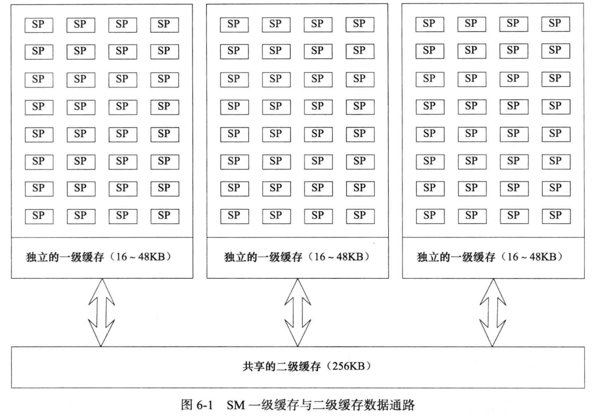


## 寄存器的用法

gpu含有多个sm核心 也就是streaming multiprocessor。一个sm和有很多个sp，也就是streaming processor：

cpu执行多线程，需要多次穿插执行每个线程，所以上下文切换频繁

一个kb是1000*1024个字节，一个字节是8位，即8bit，也是内存的最小调度和访问单元

按照位操作，直接在寄存器上执行，就不用在内存中进行，可以较少内存读写操作，减少很多的指令周期。

---


## 共享内存

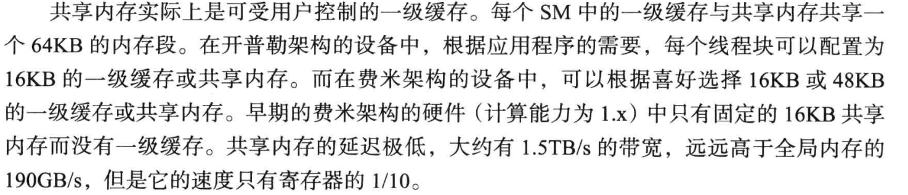

共享内存位于gpu的流式多处理器sm内部，访问速度远快于全局内存（global memory），通常延迟在几个时钟周期。

共享内存的生命周期：与线程块绑定，线程块执行结束之后，共享内存内容被释放。

共享内存作用：减少内存全局访问，允许同一个线程块的线程共享中间结果，适用于需要数据重用的算法，如矩阵运算、卷积、排序等

分配方式：使用`__shared__`关键字进行分配，一般在核函数内部


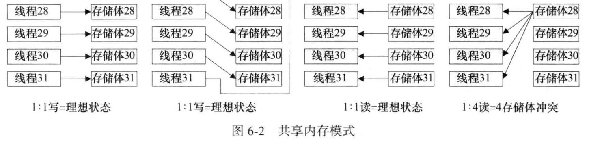

存储体冲突：当多个线程同时访问同一个存储体时，会发生存储体冲突


# 概述

## cuda流程

1. 申请分配 GPU 内存
2. 进行 CPU → GPU 数据搬运
3. 调用 CUDA Kernel 完成计算
4. 进行 GPU → CPU 搬回数据
5. 最后释放 GPU 内存

## cuda执行模型

所有的线程执行相同的代码，每个thread都有一个唯一的ID，用于计算内存地址和做出控制决策。

**在执行的时候，一个kernel对应着一个grid**，grid内的线程在执行时，是通过warp来组织的，一个warp包含了32个线程并且运行在一个SM上，warp内共享指令，每四个周期执行一条warp指令且由sm动态调度。

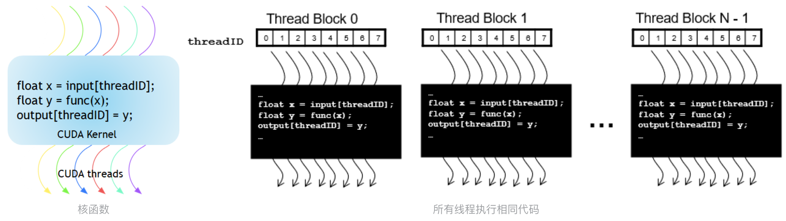

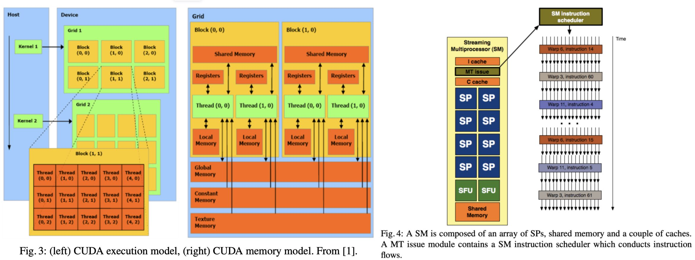


## 线程的层次结构

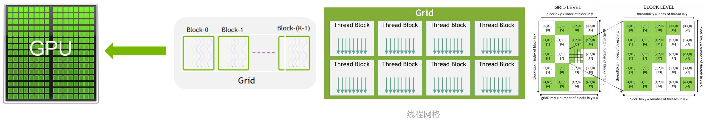

### grid

在执行模型中，一个kernel对应着一个grid。grid是层次结构中最大的概念。一个grid可以包括很多block，这些block可以被组织为一维、二维、三维。

Host 端常采用 `<<<...>>>` 的方式来 Launch Kernel，比如 `MatAdd<<<numBlocks, threadsPerBlock>>>` ，前者用来描述「一个 Grid 包含了多少块」，后者用来描述「一个 Block 包含了多少个线程」


### block

block包含了很多可以并行执行的线程，有一维、二维、三维。

**每个块的线程数量是「有限制」的，因为一个块中的所有线程都应当驻留在同一个处理器核心上，并且共享了该核心有限的内存资源（要 Keep in Mind）。在当前的 GPU 中，一个线程块可能包含多达 1024 个线程。**

**一个块内的线程可以进行协作，协作通过使用一些共享内存(shared memory)来共享数据或通过同步彼此执行来协调内存访问实现。** 更准确地说，可以通过调用 **syncthreads() 内部函数来指定内核中的同步点；** syncthreads() 充当屏障，块中的所有线程必须等待同步，然后才能继续运行。 Shared Memory 给出了一个使用共享内存的例子。 除了 __syncthreads() 之外，Cooperative Groups API 还提供了一组丰富的线程同步示例。

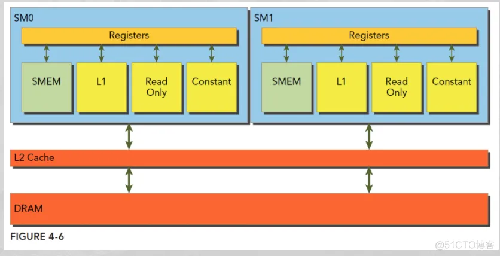

为了高效协作，共享内存是每个「处理器核心」附近的低延迟内存（很像 L1 缓存），并且 __syncthreads() 是轻量级的。不同 Block 下的线程无法进行同步（因为这些线程可能分布在不同的 SM 中）。


### thread

每个执行内核的线程都有一个「唯一的」线程 ID，可以通过内置变量在内核中访问（要 Keep in Mind）。如在前面的 Matmul 代码中，我们能看到类似 threadIdx.x 的内置变量。

线程的索引和它的线程 ID 以一种直接的方式相互关联：

- 对于一维块，它们是相同的；
- 对于大小为(Dx, Dy)的二维块，索引为(x, y)的线程的线程 ID 为 (x + y*Dx)；
- 对于大小为(Dx, Dy, Dz) 的三维块，索引为 (x, y, z) 的线程的线程 ID 为 (x + y*Dx + z*Dx*Dy)


## 数据传输与内存管理

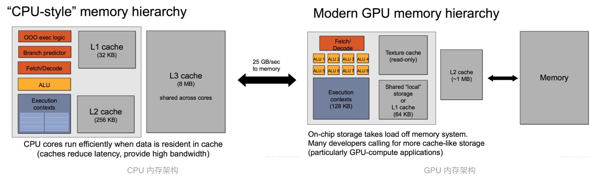

CPU 与 GPU 之间的通信开销是比较大的。

---

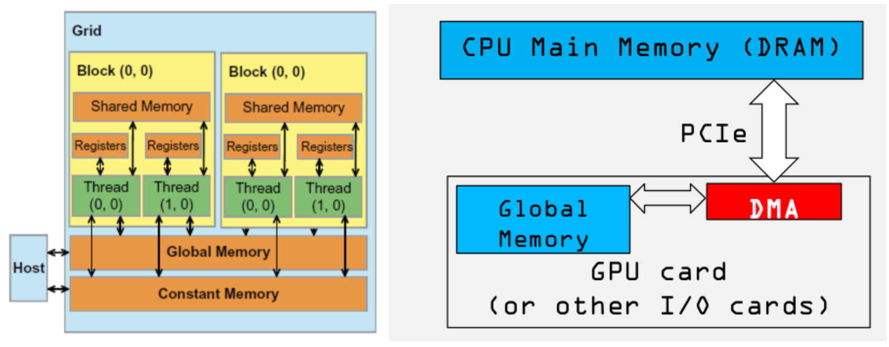

从上图我们可以看出:

1. CPU 和 GPU 之间的总线 bus 是 PCIe，是双向传输的
2. CPU 和 GPU 之间的数据拷贝使用 DMA 机制来实现，非常容易理解，为了更快的传输速度

**CUDA 里的 shared memory 是 Block 级别的**，所以两件事需要 Keep in Mind：

1. 当 allocate shared memory 的时候，其实在「每个 block」里面都创建了一份同样大小「却互相独立」的 share memory
2. 当进行__syncthreads()操作的时候，只能保证「此 block 内」的 thread 在同步，以及此 block 里的 shared memory 在同步


# CUDA编程语言与工具


## 函数执行空间说明符

函数执行空间说明符 (Function Execution Space Specifiers ) 表示函数是在「主机上（即 Host 端）」执行还是在「设备上（即 Device 端）」执行，以及它可「被主机调用」还是可「被设备调用」。

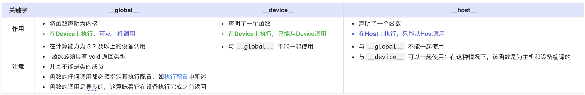


## 变量内存空间说明符

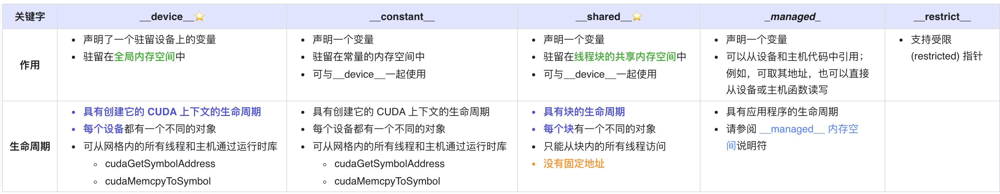

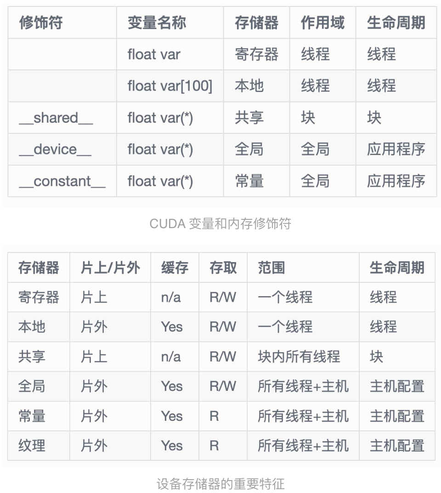


## CUDA内存管理

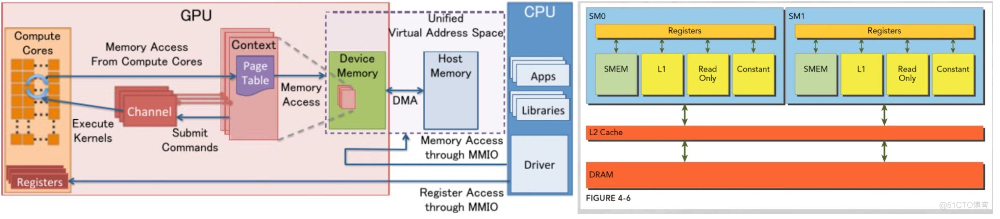


我们用 cudaMalloc() 为 GPU 分配内存，用 malloc() 为 CPU 分配内存。除此之外，CUDA 还提供了自己独有的机制来分配 host 内存：cudaHostAlloc()。 这个函数和 malloc 的区别是什么呢?

**malloc() 分配的标准的，可分页的主机内存**(上面有解释到)；**而 cudaHostAlloc()分配的是页锁定的主机内存，也称作固定内存 pinned memory，或者不可分页内存。它的一个重要特点是操作系统将不会对这块内存分页并交换到磁盘上，从而保证了内存始终驻留在物理内存中。**也正因为如此，操作系统能够安全地使某个应用程序访问该内存的物理地址，因为这块内存将不会被破坏或者重新定位。

由于 GPU 知道内存的「物理地址」，因此就可以使用 DMA 技术来在 GPU 和 CPU 之间复制数据。当使用可分页的内存进行复制时(使用 malloc)，CUDA 驱动程序仍会通过 dram 把数据传给 GPU，这时复制操作会执行两遍：第一遍从可分页内存复制一块到临时的页锁定内存，第二遍是再从这个页锁定内存复制到 GPU 上。当从可分页内存中执行复制时，复制速度将受限制于 PCIE 总线的传输速度和系统前段速度相对较低的一方。在某些系统中，这些总线在带宽上有着巨大的差异，因此当在 GPU 和主机之间复制数据时，这种差异会使页锁定主机内存比标准可分页的性能要高大约 2 倍。即使 PCIE 的速度与前端总线的速度相等。由于可分页内存需要更多一次的 CPU 参与复制操作，也会带来额外的开销。

当我们在调用 `cudaMemcpy(dest, src, ...)` 时，程序会自动检测 dest 或者 src 是否为 Pinned Memory，若不是，则会自动将其内容拷入一不可见的 Pinned Memory 中，然后再进行传输。可以手动指定 Pinned Memory，对应的 API 为：cudaHostAlloc(address, size, option)分配地址，cudaFreeHost(pointer)释放地址。注意，所谓的 Pinned Memory 都是在 Host 端的，而不是 Device 端。

那么，在写代码的过程中是否可以把所有的 malloc 都替换成 cudaHostAlloc()呢？这样也是不对的。

固定内存是一把双刃剑。当时使用固定内存时，虚拟内存的功能就会失去。尤其是在应用程序中使用每个页锁定内存时都需要分配物理内存，而且这些内存不能交换到磁盘上。这将会导致系统内存会很快的被耗尽。因此应用程序在物理内存较少的机器上会运行失败。不仅如此，还会影响系统上其他应用程序的性能。


# CUDA硬件基础

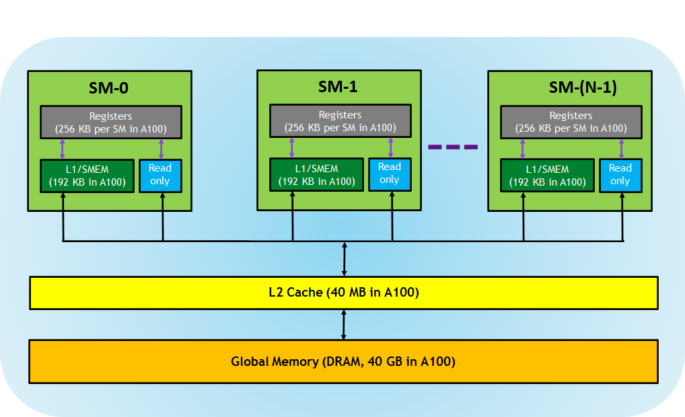

A100 硬件的架构如上图。其中 A100 SM 包含新的第三代 Tensor 内核：

- **Registers**：每个 thread 专用的，这意味着分配给该线程的寄存器对其他线程不可见，编译器做出有关寄存器利用率的决策。 
- *** L1/Shared memory (SMEM)**：在全局内存之外，GPU 还有一块位于芯片上的较小区域，被称为共享内存（SMEM）。每个 SM（流多处理器）都配备了一块共享内存。每个 SM 都有一个快速的 on-chip scratched 存储器，可用作 L1 cache 和 shared memory。CUDA block 中的所有线程可以共享 shared memory，并且在给定 SM 上运行的所有 CUDA Block 可以共享 SM 提供的物理内存资源。**从逻辑上看，共享内存在各个块之间进行了分区。这意味着一个线程可以通过共享内存块与同一块内的其他线程进行通信。共享内存的大小是可配置的，可以通过权衡以获得更大的共享内存而减小 L1 缓存的大小**。
- **Read-only memory**：每个 SM 都具 instruction cache，constant memory，texture 和 RO cache，这对 kernel 代码是只读的
- **L2 cache**：L2 cache 在所有 SM 之间共享，因此每个 CUDA block 中的每个线程都可以访问该内存。
- **Global memory**：这是 GPU 和位于 GPU 中的 DRAM 的帧缓冲区大小。

---

**下面是一个流式多处理器SM的物理图解，一个SM包含了4个tensor core，一个SM可以服务32个block。但是需要区分的是：**

- SM、tensor core是硬件层面的，这张图中的share memory也是物理内存
- block是软件层面上的，一个block可以包含多个线程。每个block的share memory是独立的，其实是被划分的逻辑内存，block之间不可相互访问shared mem
- SM是单指令、多线程架构，基本执行单元是warp（包括了32个线程）。当block被分配到SM上时，由于最小单元是warp，所以一个block可以包含多个warp。如果block线程数不是warp的整数，那么会有一部分的线程处于未激活状态，还是会占用SM资源，所以要分配warp（32个）整数个线程数
- 在下图中，一个SM有4个SM processing Block（SMP），一个smp有很多个cuda core（绿色部分），cuda core也叫做Streaming Processor(SP)。每一个SM有自己的指令缓存，L1缓存，共享内存。而每一个SMP有自己的Warp Scheduler、Register File等。
- **CUDA Core是Single Precision的，也就是计算float单精度的。双精度Double Precision是那个黄色的模块。**所以一个SM里边由64个DP Unit，由64个CUDA Core
- LD/ST 是load store unit，用来内存操作的。SFU是Special function unit，用来做cuda的intrinsic function的，类似于__cos()这种。


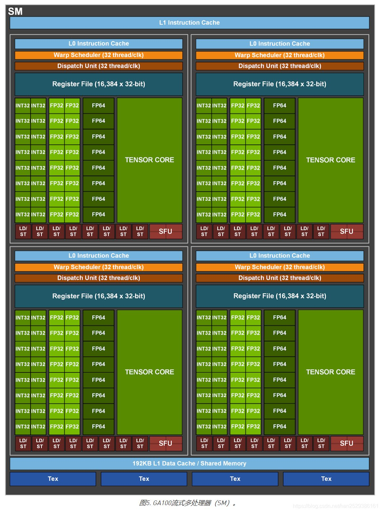

从上图可以看出 GA100 的 SM 架构相比 G80 复杂了很多，占地面积也更大。**每个 SM 包括 4 个区块，每个区块有独立的 L0 指令缓存、Warp 调度器、分发单元，以及 16384 个 32 位寄存器，这使得每个 SM 可以并行执行 4 组不同指令序列。4 个区块共享 L1 指令缓存和数据缓存、shared memory、纹理单元。**

一个cuda core的结构：

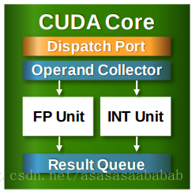

---


从图中也能看出 INT32 计算单元数量与 FP32 一致，而 FP64 计算单元数量是 FP32 的一半，这在后面峰值计算能力中会有体现。

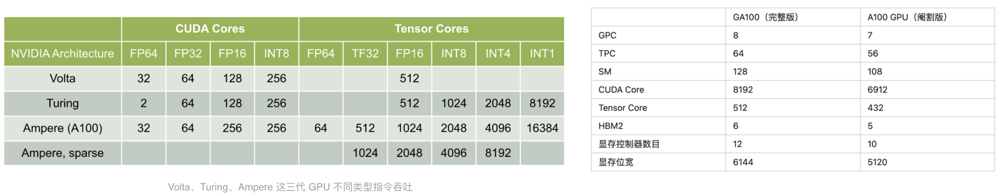

每个 SM 除了 INT32、FP32、FP64 计算单元之外，还有额外 4 个身宽体胖的 **Tensor Core，这是加速 Deep Learning 计算的重磅武器，已发展到第三代，每个时钟周期可做 1024 次 FP16 乘加运算**，与 Volta 和 Turing 相比，每个 SM 的吞吐翻倍，支持的数据类型也更为丰富，包括 FP64、TF32、FP16、BF16、INT8、INT4、INT1。

- 192 KB 的共享内存和 L1 数据缓存组合，比 V100 SM 大 1.5 倍
- 40 MB 的 L2 Cache 比 V100 大了 7 倍，借助新的 partitioned crossbar 结构（2 个 L2 Cache），提供了 V100 的 L2 缓存读取带宽的 2.3 倍。
- 新的异步复制指令将数据直接从「全局存储器」加载到「共享存储器」中，可以绕过 L1 高速缓存，并且不需要中间寄存器文件；


## SM和并行执行模型

**下面我们来详细介绍一下每个 SP 的相关组成：**

- core 也称之为 cuda core，主要用来进行 FP 和 INT 的计算
- DP Unit 主要是在 HPC 场景用来进行 double precison 计算，而机器学习场景基本上不会用到
- SFU 也是一个计算单元，它主要负责 sine, cosine, log and exponential 等函数的计算
- LD/ST 即 load uint 和 store unit 即内存控制器的常用组件
- Register File 即寄存器组
- Tex 即图形渲染时需要用到的内存

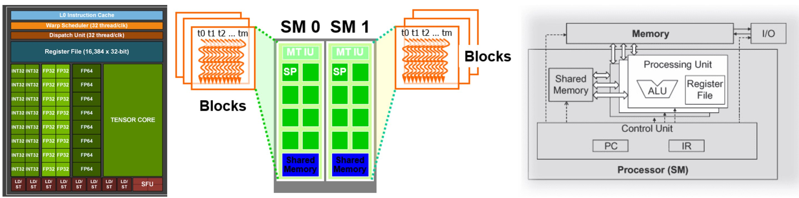

在并行的执行过程中，线程们被打包成一个个 Block 传入 Streaming Multiprocessors (SM)。一个 block 只能调度到一个 Streaming Multiprocessor 上运行。一个 Streaming Multiprocessor 可以同时运行多个 block。但是每个 SM 是有对同时运行的 Block 数量和线程数量的限制，比如较近的 CUDA 装置就限制一个 SM 上最多同时运行 8 个 Block 和 1536 个线程。当然，一个 CUDA 设备上可以有多个 SM，比如一个有 30 个 SM 的 CUDA 设备，如果每个 SM 最多同时运行 1536 个线程，则同时最多可以运行 46080 个线程

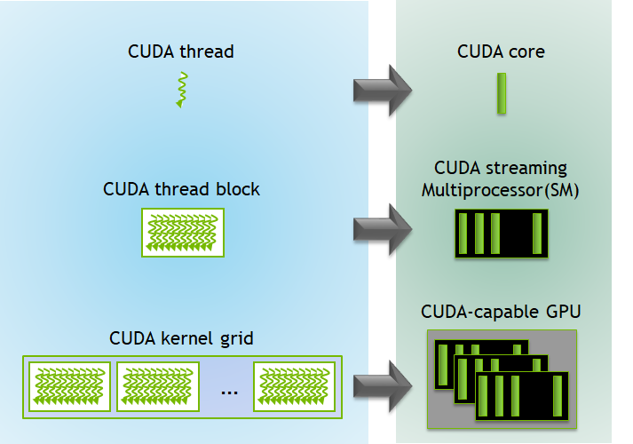


## warp-level

warp是SM的基本执行单元，一个warp中的线程必然存在于同一个block中。

---


**一个 warp 中的 thread 执行相同的指令，有相同的执行时间，如果某一个 thread 阻塞了，同一个 warp 的其他 thread 都会阻塞，因此有了 warp divergence。**所以 warp divergence 只会出现在同一个 warp 中。

一个warp divergence的例子：

如下例子中，同一个线程束的线程根据编号被分为了奇数线程和偶数线程，但是这样就带了一个问题，所有该线程束中的线程先计算 if 语句中的逻辑运算，于是奇数的线程被激活了并且进行 if 中的运算，而未被激活的偶数线程只能等待。假设这是一个 if else 语句，那么轮到 else 的时候则是未被激活的奇数线程等待，由于当前 GPU 总是串形的执行不同的路径，因此我们造成了 50%的计算资源浪费。

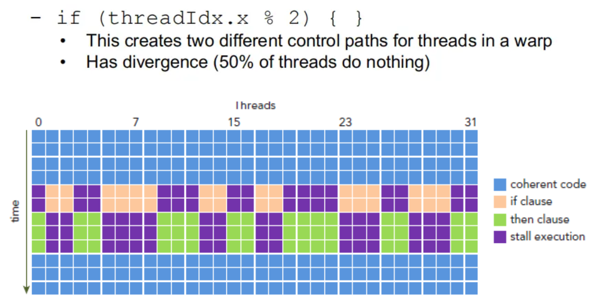

为了更加清晰的说明线程束发散，可以看看如下图例：

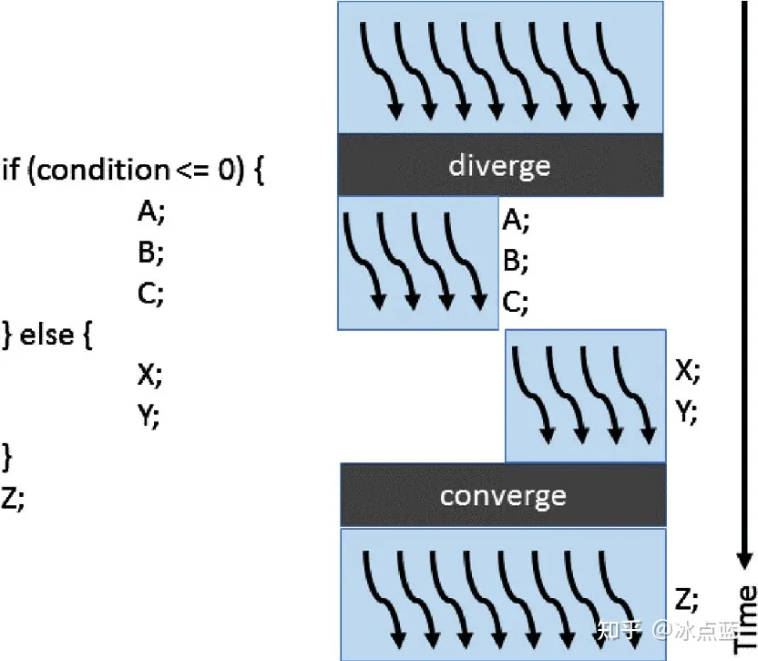

在上述图例中，if else 控制语句将线程束里的 8 个线程（假定一个线程束里 8 个线程）分成左 4 个和右 4 个，在左 4 运行 A,B,C 的时候，右 4 只能等待；同理在右 4 运行 X，Y 的时候左 4 也只能等待。在结束控制语句以后才能会和起来一起运行 Z。这样串形的执行不同路径让左 4 和右 4 都等待了一段时间，造成了计算资源的浪费。

**warp 的 context 包含三个部分：**

1. Program counter
2. Register
3. Shared memory

当一个 block 得到足够的资源时，就成为 active block。block 中的 warp 就称为 active warp。**active warp 又可以被分为下面三类：**

1. Selected warp 被选中的 warp
2. Stalled warp 没准备好要执行的称为 Stalled warp
3. Eligible warp 没被选中，但是已经做好准备被执行的称为 Eligible warp

SM 中 warp 调度器每个 cycle 会挑选 active warp 送去执行。warp 是否「适合执行」需要满足下面两个条件：

1. 32 个 CUDA core 有空
2. 所有当前指令的参数都准备就绪


## Bank Conflict

bank是内存的访问时一种划分方式。

- 在cpu中，访问某个地址的内存时，为了减少读写内存的次数，访问地址并不是随机的，而是一次性访问bank内的内存地址，类似于内存对齐。一次性获取该bank内所有地址内存，以提高内存带宽利用率。

> CUDA中的共享内存（shared memory）：这是cuda中内存模型中的一种内存模式，为一个片上内存，比全局内存要快很多，同时**在同一个block内的所有线程都可以访问到该shared mem中的数据**，和local和global内存相比具有更高的带宽、低延迟的作用。


> 为了提高内存的带宽，共享内存被划分为相同大小的内存模型，称之为bank，这样就可以将n个地址读写合并成n个独立的bank，进而有效的提高了带宽。
>
> 这句话怎么理解呢？
>
> - n个地址读写：当一个block中的多个线程同时尝试访问共享内存时，他们会请求访问不同的内存地址
> - 合成n个独立的bank：**理想情况下，如果 n 个线程同时访问 n 个不同的 bank，那么这 n 次访问就可以并行地进行，因为每个 bank 都可以独立处理一个请求。**这种情况下，内存带宽得到了最大化的利用，因为多个读写操作同时完成。

开始正题，**什么是bank conflict？**

**如果block内多个线程访问的地址落入同一个bank内，那么就会访问同一个bank导致bank conflict，这样并行访问就会编程串行。**

**只要同一个 warp 的不同线程会访问到同一个 bank 的不同地址就会发生 bank conflict，除此之外的都不会发生 bank conflict。**

---

**现在考虑`__shared__ float sData[32][32]`数组：内存布局如下图：**

在一个block内，共享内存被分为32个bank，而共享内存中的数据是以4字节作为一个字，依次放到32个bank中的。

一个bank可以独立地处理32位（4个byte）的访问请求（下图一个thread可以访问一个bank的4个小绿条）

**当有多个线程同时访问一个列中的不同数组时（都在一个bank中，无法并行读取），会发生bank conflict，这时候只能串行执行数据读取**

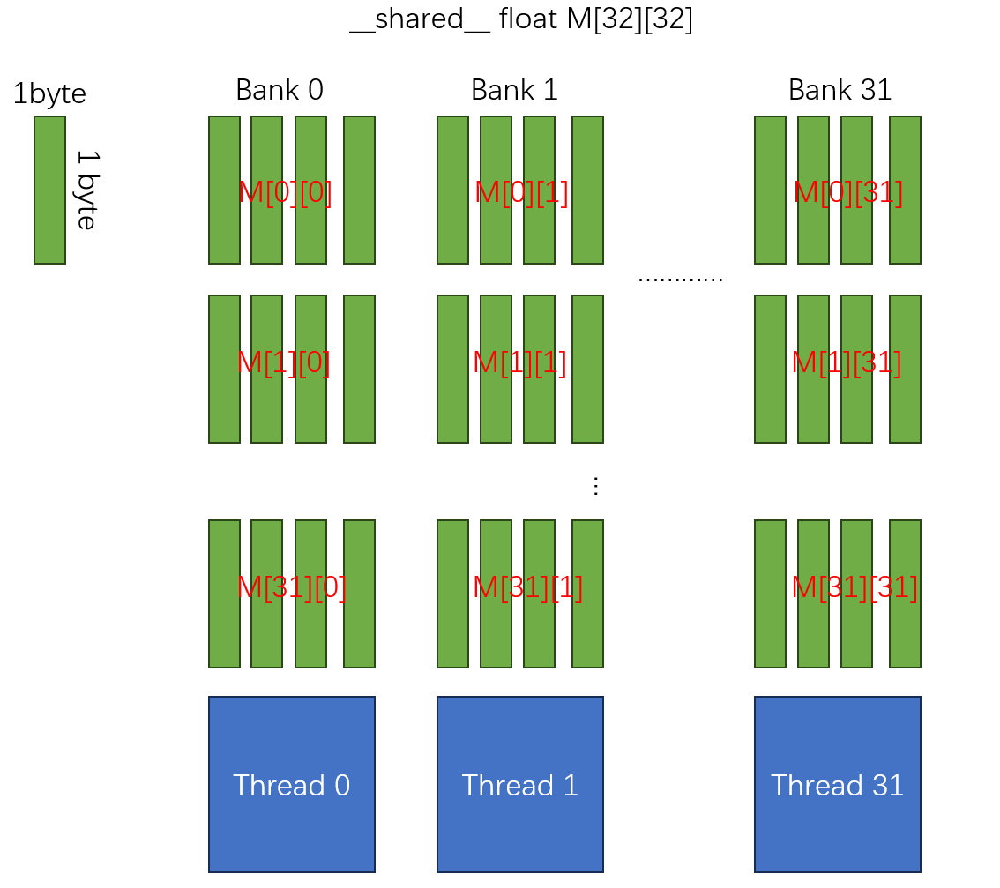

---

如果多个线程同时访问同一列中相同的数组元素 不会产生 bank conflict，将会出发广播，这是 CUDA 中唯一的解决方案，在一个 warp 内访问到相同内存地址，将会将内存广播到其他线程中，**同一个 warp 内访问同一个 bank 内的不同地址貌似还没看到解决方案。**

---

下面这张图中：

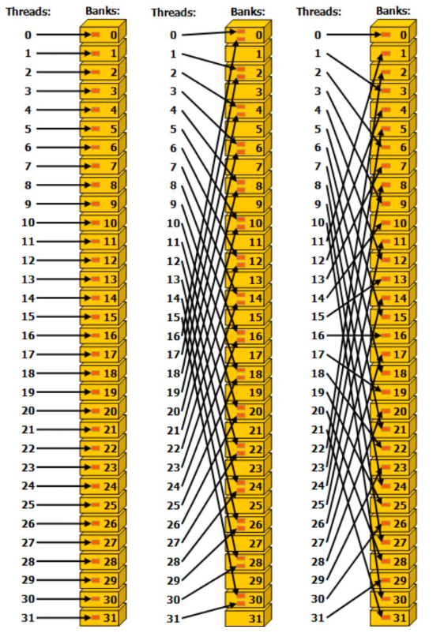

- 左：线性寻址，步幅为一个 32 -bit（无 bank conflict）
- 中：线性寻址，步幅为两个 32 -bit（双向 bank conflict）结合我画的那张图，步幅时2*4字节=8字节，这样数据在分配时，为bank  0、8/4=2、16/4=4、··· 120/4=30、（128/4）%32=0，于是可以看到，当线程在寻址时，会有线程寻址落在同一个bank内的情况，导致竞争->bank conflict
- 右：线性寻址，步幅为三个 32 -bit（无 bank conflict）


# Kernel


## grid、block、thread

GPU 上一般包含很多流式处理器 SM，每个 SM 是 CUDA 架构中的基本计算单元，其可分为若干（如 2~3）个网格，每个网格内包含若干（如 65535）个线程块，每个线程块包含若干（如 512）个线程，概要地理解的话：

- `Thread`: 一个 CUDA Kernel 可以被多个 threads 来执行
- `Block`: 多个 threads 会组成一个 Block，而同一个 block 中的 threads 可以同步，也可以通过 shared memory 通信
- `Grid`: 多个 blocks 可以组成一个 Grid

其中，一个 Grid 可以包含多个 Blocks。Blocks 的分布方式可以是一维的，二维，三维的；Block 包含多个 Threads，Threads 的分布方式也可以是一维，二维，三维的。

---

### block中线程数配置

**以实现矩阵乘法为例**

块中的线程数可以使用一个通常称为 `blockDim` 的变量进行配置，它是一个由三个整数组成的向量。该向量的条目指定了 `blockDim.x`、`blockDim.y` 和 `blockDim.z` 的大小，如下图所示：

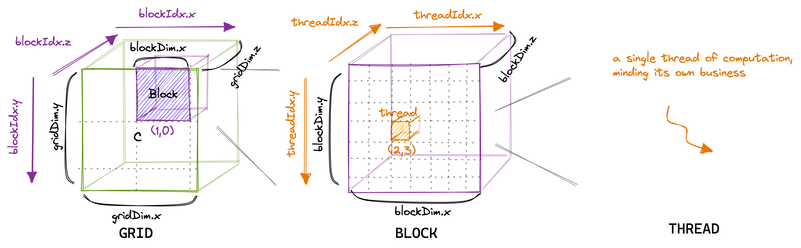

同样，网格中的块数可以使用 `gridDim` 变量进行配置。当我们从主机启动一个新的内核时，它会创建一个包含按照指定方式排列的块和线程的单一网格。

对于我们的第一个内核，我们将使用 `grid`、`block` 和 `thread` 的层次结构，每个线程计算结果矩阵 C 中的一个元素。该线程将计算矩阵 A 相应行和矩阵 B 相应列的点积，并将结果写入矩阵 C。由于矩阵 C 的每个位置仅由一个线程写入，我们无需进行同步。我们将以以下方式启动内核：

```cpp
#define CEIL_DIV(M, N) (((M) + (N)-1) / (N))

dim3 gridDim(CEIL_DIV(M, 32), CEIL_DIV(N, 32), 1);
// 32 * 32 = 1024 thread per block
dim3 blockDim(32, 32, 1);
sgemm_naive<<<gridDim, blockDim>>>(M, N, K, alpha, A, B, beta, C);
```

---


CUDA 代码是从单线程的视角编写的。在内核代码中，我们使用 `blockIdx` 和 `threadIdx`。这些变量的值会根据访问它们的线程而异。在我们的例子中，`threadIdx.x` 和 `threadIdx.y` 将根据线程在网格中的位置从 0 到 31 变化。同样，`blockIdx.x` 和 `blockIdx.y` 也将根据线程块在网格中的位置从 0 到 `CEIL_DIV(N, 32)` 或 `CEIL_DIV(M, 32)` 变化。

```cpp
__global__ void sgemm_naive_kernel(float *A, float *B, float *C, int M, int N, int K)
{
    const uint x = blockIdx.x * blockDim.x + threadIdx.x;
    const uint y = blockIdx.y * blockDim.y + threadIdx.y;
    if (x < M && y < N)
    {
        float sum = 0.0f;
        for (int i = 0; i < K; i++)
        {
            sum += A[x * K + i] * B[i * N + y];
        }
        C[x * N + y] = sum;
    }
}
```


下图可视化了我们的内核的执行方式：

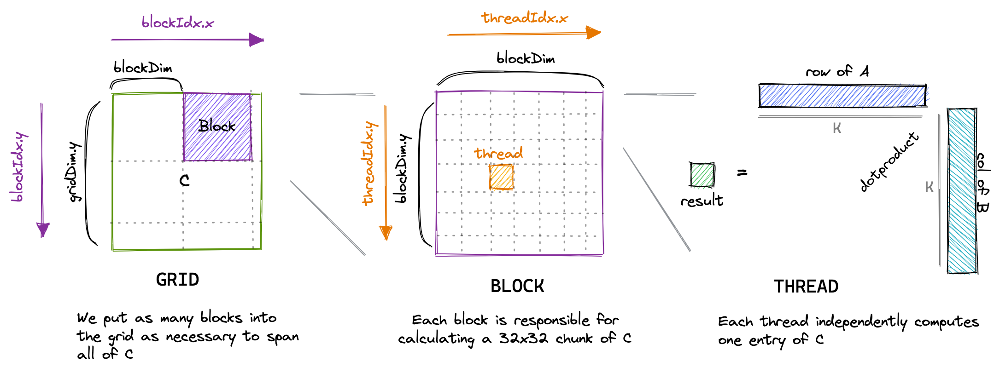

一个好的编程习惯：在代码的最后一定一定记得释放堆内存，避免内存泄漏；并将指针置为空防止野指针的出现。不过这种事很容易忘记，有兴趣的宝贝可以学习下智能指针的用法，本文就不在展开介绍 C++ 的东西。

```cpp
free(cpu_addr); // 释放 CPU 内存
cpu_addr = nullptr; // 置空

cudaFree(cuda_addr); // cudaFree API 释放 cuda 内存
cuda_addr = nullptr; // 置空
```


---

### 一维 Grid

Grid 为 一维，Block 为一维：

```cpp
int threadId = blockIdx.x *blockDim.x + threadIdx.x; 
```


Grid 为 一维，Block 为二维：

```cpp
int threadId = blockIdx.x * blockDim.x * blockDim.y + 
              threadIdx.y * blockDim.x + threadIdx.x;  
```


Grid 为 一维，Block 为三维：

```cpp
int threadId = blockIdx.x * blockDim.x * blockDim.y * blockDim.z + 
              threadIdx.z * blockDim.y * blockDim.x +
              threadIdx.y * blockDim.x + threadIdx.x;  
```


### 二维 Grid

Grid 为 二维，Block 为一维：

```cpp
int blockId = blockIdx.y * gridDim.x + blockIdx.x;  
int threadId = blockId * blockDim.x + threadIdx.x;  
```


**Grid 为 二维，Block 为二维：**

```cpp
int blockId = blockIdx.x + blockIdx.y * gridDim.x;  
int threadId = blockId * (blockDim.x * blockDim.y)  
                       + (threadIdx.y * blockDim.x) + threadIdx.x;  
```


Grid 为 二维，Block 为三维：

```cpp
int blockId = blockIdx.x + blockIdx.y * gridDim.x;  
int threadId = blockId * (blockDim.x * blockDim.y * blockDim.z)  
                       + (threadIdx.z * (blockDim.x * blockDim.y))  
                       + (threadIdx.y * blockDim.x) + threadIdx.x;  
```


### 三维 Grid

Grid 为 三维，Block 为一维：

```cpp
int blockId = blockIdx.x + blockIdx.y * gridDim.x  
             + gridDim.x * gridDim.y * blockIdx.z;  

int threadId = blockId * blockDim.x + threadIdx.x;  
```


Grid 为 三维，Block 为二维：

```cpp
int blockId = blockIdx.x + blockIdx.y * gridDim.x  
             + gridDim.x * gridDim.y * blockIdx.z;  

int threadId = blockId * (blockDim.x * blockDim.y)  
                       + (threadIdx.y * blockDim.x) + threadIdx.x;  
```


Grid 为 三维，Block 为三维：

```cpp
int blockId = blockIdx.x + blockIdx.y * gridDim.x  
             + gridDim.x * gridDim.y * blockIdx.z;  

int threadId = blockId * (blockDim.x * blockDim.y * blockDim.z)  
                       + (threadIdx.z * (blockDim.x * blockDim.y))  
                       + (threadIdx.y * blockDim.x) + threadIdx.x;
```


## 加法

这个好像没什么可说的。

```c++
__global__ void cuda_add_thread(float* x, float* y, float* out, int n) {
    int tid = threadIdx.x + blockDim.x * blockIdx.x;
    if (tid < n) {
        out[tid] = x[tid] + y[tid];
    }
}

void test_add_thread() {
    float* x, *y, *out;
    float* cuda_x, *cuda_y, *cuda_out;
    int N = 10000;
    size_t mem_size = sizeof(float)*N;
    x = static_cast<float*>(malloc(mem_size));
    y = static_cast<float*>(malloc(mem_size));
    out = static_cast<float*>(malloc(mem_size));

    for(int i=0; i<N;i++){
        x[i]=12.;
        y[i]=5.;
    }

    cudaMalloc((void**)&cuda_x,mem_size);
    cudaMemcpy(cuda_x,x,mem_size,cudaMemcpyHostToDevice);

    cudaMalloc((void**)&cuda_y,mem_size);
    cudaMemcpy(cuda_y,y,mem_size,cudaMemcpyHostToDevice);

    cudaMalloc((void**)&cuda_out,mem_size);

    cuda_add_thread<<<50,200>>>(cuda_x,cuda_y,cuda_out,N);

    cudaMemcpy(out, cuda_out, mem_size, cudaMemcpyDeviceToHost);

    cudaDeviceSynchronize();

    print<float,int>(out,N);

    cudaFree(cuda_x);
    cudaFree(cuda_y);
    cudaFree(cuda_out);

    free(x);
    free(y);
    free(out);
}
```


