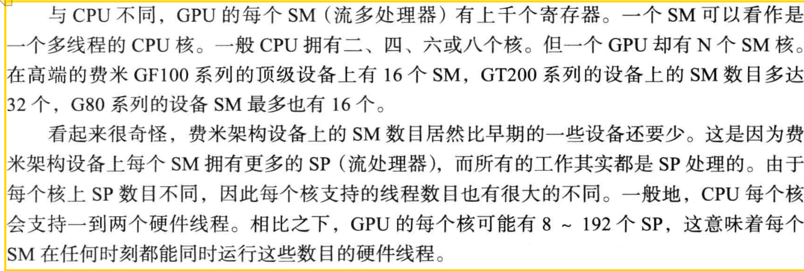
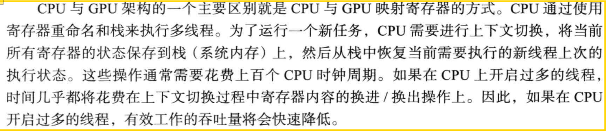
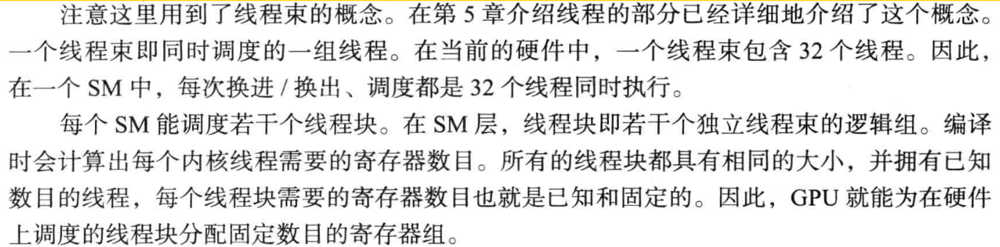
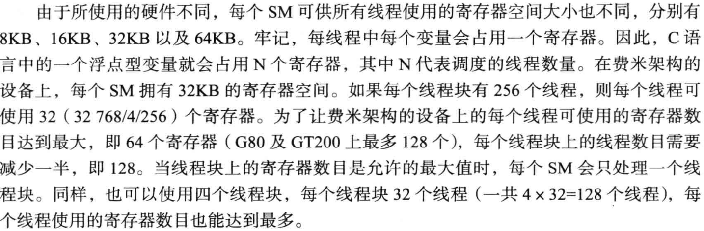
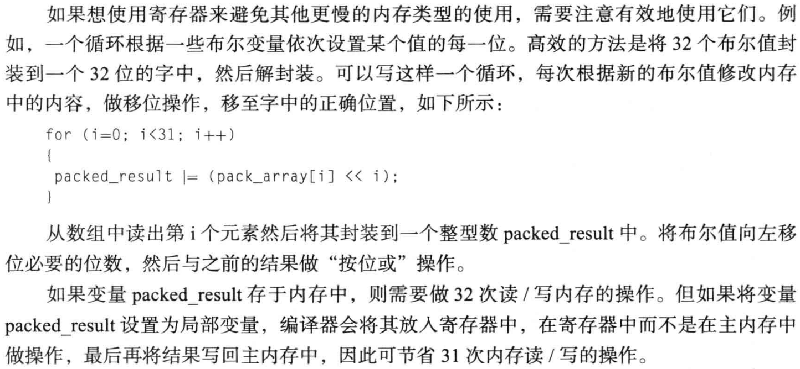
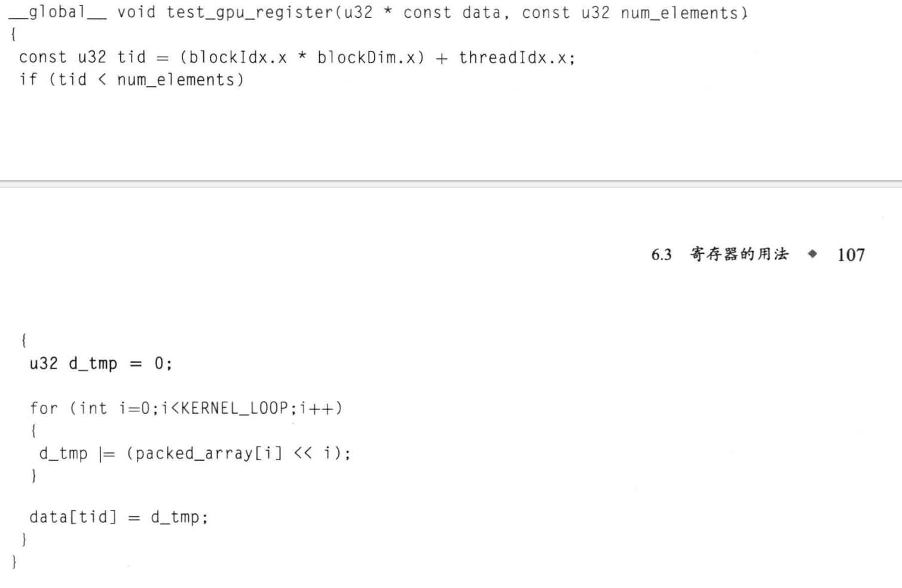
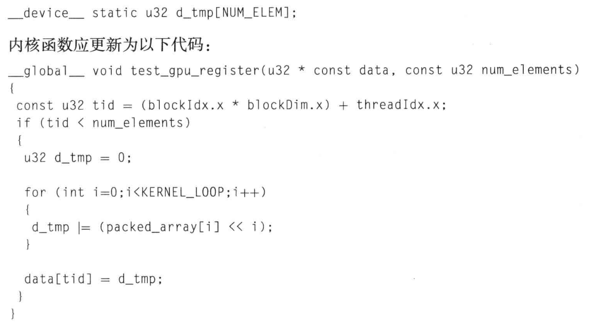
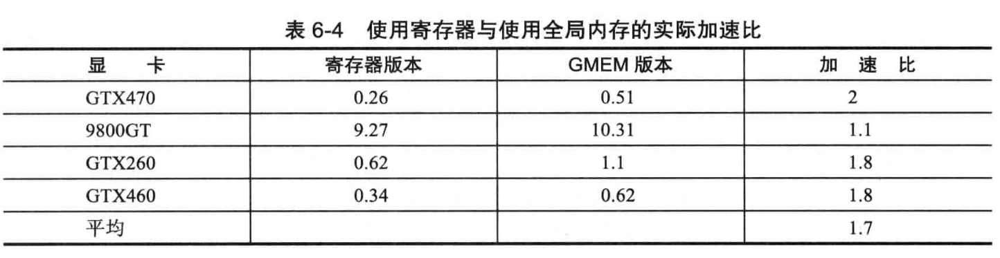

# cuda

# cuda索引

> 参考[CUDA编程入门极简教程 - 知乎](https://zhuanlan.zhihu.com/p/34587739)


主要是通过grid、block、thread这几个索引进行的。

比如在进行矩阵乘法的时候，将一个Grid中的所有block展开，每一个block中的thread展开，那么每一个线程可以对应一个新的矩阵的对应元素。


---

比如下面的矩阵乘法的示例中，矩阵C是最后的结果，那么计算C可以用M*N个线程计算。

对于i，j个元素的计算，对应的线程索引为：（也就是每个线程的标记）

```
int m =  blockIdx.y * blockDim.y + threadIdx.y;
int n = blockIdx.x * blockDim.x + threadIdx.x;
```


对应cuda kernel上：

```c++
__global__ void naiveSgemm(
    float * __restrict__ a, float * __restrict__ b, float * __restrict__ c,
    const int M, const int N, const int K) {

    int n = blockIdx.x * blockDim.x + threadIdx.x;
    int m = blockIdx.y * blockDim.y + threadIdx.y;
    if (m < M && n < N) {
        float psum = 0.0;
        #pragma unroll
        for (int k = 0; k < K; k++) {
            psum += a[OFFSET(m, k, K)] * b[OFFSET(k, n, N)];
        }
        c[OFFSET(m, n, N)] = psum;
    }
}
```


# CUDA内存管理

## 高速缓存


## 寄存器的用法



gpu含有多个sm核心 也就是streaming multiprocessor。一个sm和有很多个sp，也就是streaming processor：

===



cpu执行多线程，需要多次穿插执行每个线程，所以上下文切换频繁

---




---




一个kb是1000*1024个字节，一个字节是8位，即8bit，也是内存的最小调度和访问单元

---




按照位操作，直接在寄存器上执行，就不用在内存中进行，可以较少内存读写操作，减少很多的指令周期。

---


对比一下两段代码：





上面的图是通过寄存器进行或运算，而下面的则是通过全局内存进行的操作，他们两个之间的速度差异很大：



也就是说，最好要规避使用全局内存的做法，使用寄存器进行运算会有更高的计算效率。

---


## 共享内存


共享内存位于gpu的流式多处理器sm内部，访问速度远快于全局内存（global memory），通常延迟在几个时钟周期。

共享内存的生命周期：与线程块绑定，线程块执行结束之后，共享内存内容被释放。

共享内存作用：减少内存全局访问，允许同一个线程块的线程共享中间结果，适用于需要数据重用的算法，如矩阵运算、卷积、排序等

分配方式：使用`__shared__`关键字进行分配，一般在核函数内部


存储体冲突：当多个线程同时访问同一个存储体时，会发生存储体冲突


# Kernel
