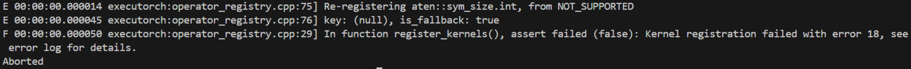
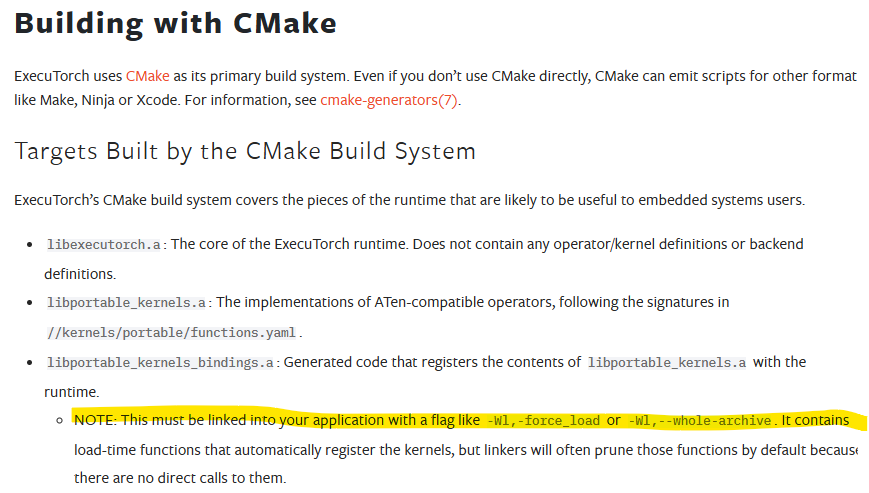

# libtorch & Executorch

# Executorch

## 编译

要把executorch作为一个子库来使用，

在executorch 的同级目录创建文件夹，torchwhole，在里面创建要调用 的子库函数文件夹，如mytorch

### 总工程

在torchwhole文件夹下创建CMakeLists.txt

```
# CMakeLists.txt

cmake_minimum_required(VERSION 3.4.1)
set(PROJECT_NAME torchwhole)
project(${PROJECT_NAME})
set(CMAKE_CXX_STANDARD 17)
set(CMAKE_CXX_STANDARD_REQUIRED True)
set(BUILD_SHARED_LIBS OFF)
option(EXECUTORCH_BUILD_EXTENSION_DATA_LOADER "" ON)
option(EXECUTORCH_BUILD_EXTENSION_MODULE "" ON)
option(EXECUTORCH_BUILD_KERNELS_OPTIMIZED "" ON)
option(EXECUTORCH_BUILD_XNNPACK "" ON) # Build with Xnnpack backend
# set(mytorch_DIR /home/sophda/torch/executorch/torchlib)
# find_package(mytorch REQUIRED)
include_directories(
/home/sophda/torch/
/home/sophda/torch/x64test
)

link_directories(
/home/sophda/torch/executorch/buildx64/lib
# /home/sophda/torch/executorch/arm64/third-party/gflags
# ${TORCH_INCLUDE_DIRS}
)
add_subdirectory(
    /home/sophda/torch/executorch
    /home/sophda/torch/x64bin
)
add_subdirectory(
    /home/sophda/torch/x64test
    /home/sophda/torch/x64testbin
)
add_executable(
    ${PROJECT_NAME} main.cpp
)
target_link_libraries(
    ${PROJECT_NAME}
    executorch
    extension_module_static
    torchtest
)
# target_link_options(${PROJECT_NAME} PRIVATE )

```

- 使用add_subdirectory()分别将executorch、以及自己的字库作为子文件夹进行构建，那么executorch构建的库就可以在总工程以及自己的子库中进行调用了。

构建脚本：

```sh
# rm -rf /home/sophda/torch/x64testbin/*
cd /home/sophda/torch/x64whole/build
# rm -rf ./*
cmake  ..
    # -DEXECUTORCH_BUILD_EXTENSION_DATA_LOADER=ON \
    # -DEXECUTORCH_BUILD_EXTENSION_MODULE=ON \
    # -DEXECUTORCH_BUILD_KERNELS_OPTIMIZED=ON \
make -j12
```

main.cpp

## 子工程

在子工程中创建fun.cpp

```c++
#include "fun.h"
#include <executorch/runtime/core/exec_aten/exec_aten.h>
#include <executorch/runtime/core/exec_aten/util/dim_order_util.h>
#include <executorch/runtime/core/exec_aten/util/tensor_util.h>
#include <executorch/runtime/core/exec_aten/exec_aten.h>
#include <executorch/runtime/core/exec_aten/util/scalar_type_util.h>
using namespace torch::executor;
#include <string>
// using namespace ::torch::executor;
extern "C"
{
int fun(int a)
{

    std::cout<<a<<std::endl;
  // runtime_init();

        
// Create a Module.
Module module("/home/sophda/torch/x64whole/xnn.pte");
module.load();

module.load_method("forward");

const auto method_names = module.method_names();

if (method_names.ok()) {
  std::cout<<"method_names.count"<<std::endl;
}
// names = *name;

// const std::string names = const_cast<std::string&> (name);
    std::cout<<module.is_loaded() <<std::endl;

// Wrap the input data with a Tensor.
float input[1 * 3 * 224 * 224];
Tensor::SizesType sizes[] = {1, 3, 224, 224};
TensorImpl tensor(ScalarType::Float, std::size(sizes), sizes, input);
std::cout<< "size:" <<tensor.size(3) <<std::endl;
// Perform an inference.
const auto result = module.forward({EValue(Tensor(&tensor))});
const auto c = result->at(0);
// Check for success or failure.
if (result.ok()) {
  // Retrieve the output data.
  const auto output = result->at(0).toTensor().const_data_ptr<float>();
//   std::cout<<result->at(0)<<std::endl;
  // std::cout<<"done  "<<output<<std::endl;
}
}
}
```

fun.cpp

```c++
#include <iostream>
#include <executorch/extension/module/module.h>
#include <executorch/extension/data_loader/file_data_loader.h>
#include <executorch/extension/evalue_util/print_evalue.h>
#include <executorch/extension/runner_util/inputs.h>
#include <executorch/runtime/executor/method.h>
#include <executorch/runtime/executor/program.h>
#include <executorch/runtime/platform/log.h>
#include <executorch/runtime/platform/runtime.h>
#include <executorch/runtime/core/exec_aten/exec_aten.h>
#include <executorch/runtime/core/exec_aten/util/dim_order_util.h>
#include <executorch/runtime/core/exec_aten/util/tensor_util.h>
#include <executorch/runtime/platform/assert.h>

#include <executorch/runtime/core/portable_type/tensor.h>
extern "C"
{
int fun(int a);
}
```

cmakelist.txt

```cmake
# CMakeLists.txt

cmake_minimum_required(VERSION 3.4.1)
set(PROJECT_NAME torchtest)
project(${PROJECT_NAME})
set(CMAKE_CXX_STANDARD 17)
set(CMAKE_CXX_STANDARD_REQUIRED True)
set(BUILD_SHARED_LIBS OFF)
# option(EXECUTORCH_BUILD_EXTENSION_DATA_LOADER "" ON)
# option(EXECUTORCH_BUILD_EXTENSION_MODULE "" ON)
# option(EXECUTORCH_BUILD_KERNELS_OPTIMIZED "" ON)
# option(EXECUTORCH_BUILD_XNNPACK "" ON) # Build with Xnnpack backend
# set(mytorch_DIR /home/sophda/torch/executorch/torchlib)
# find_package(mytorch REQUIRED)
include_directories(
/home/sophda/torch/

/home/sophda/torch/x64test
)

link_directories(
/home/sophda/torch/executorch/buildx64/lib
# /home/sophda/torch/executorch/arm64/third-party/gflags
# ${TORCH_INCLUDE_DIRS}
)
# add_subdirectory(
#     /home/sophda/torch/executorch
#     /home/sophda/torch/x64bin
# )
add_library(
    ${PROJECT_NAME}  fun.cpp 
)
target_link_libraries(
)
# target_link_options(${PROJECT_NAME} PRIVATE -Wl,-force_laod)

```

```
https://github.com/pytorch/executorch/issues/3922
```

## 交叉编译

```
rm -rf /home/sophda/torch/mobile/mylib/build
# rm -rf /home/sophda/torch/executorch/arm64
cd /home/sophda/torch/mobile/build
rm -rf ./*
# rm armtorch
cmake -DCMAKE_TOOLCHAIN_FILE=${NDK}/build/cmake/android.toolchain.cmake \
    -DANDROID_PLATFORM=android-23 \
	-DANDROID_ABI="arm64-v8a" \
    ..
make -j12
```


## 编译的相关问题

跟上面说的一样，就是新建一个总工程，然后将几个子库添加进去。但是根据几天的debug，发现了一些注意事项：

1. 库的冲突问题

   主要是针对在**链接**的环节，经不断的尝试，发现`portable_kernels`和`optimized_kernels`会发生冲突，而冲突的表现就是**无法注册内核**，如下图所示：

   

   这个时候只需要把cmakelist中的链接选项修改一下就可以了：**xnnpack_backend是有必要加上的，这是一个cpu运算符库，即后端**

   ```
   target_link_libraries(
       ${PROJECT_NAME}
       # "$<LINK_LIBRARY:WHOLE_ARCHIVE,portable_kernels>"
       # -Wl,--start-group
       executorch
       xnnpack_backend
       portable_kernels
       extension_module_static
   )
   ```

   > 当时看executorch，有一点提到了kernel里的注册函数并不会主动执行，需要用一些链接选项（也就是上面cmake中的第1行），否则会被编译器优化掉。但是，**如果不加这几个选项的话，也是没有问题的！！**  可以参考官方给的几个cmakelist文件示例，都没有这几个选项的身影。。
   >
   > 

2. EValue的符号问题

   这个其实不清楚，，，我他妈就是第二天重新编译了一下，链接库什么都没动，然后就没事了。。。

3. **dlopen failed: library "libclang_rt.ubsan_standalone-aarch64-android.so" not found**

   这个问题。。。。我操他妈的！！！

   我他妈的整整弄了一天，从maui到unity，最后到了Androidstudio，前两个平台是爆出了dllnotfound的错误，如果编译其他的简单测试用例是没问题的，我最初以为是这个executorch导致的。。。折腾了一天反复编译测试不同平台调用接口，还得是Androidstudio啊，直接kotlin调用的时候出现了`"libclang_rt.ubsan_standalone-aarch64-android.so" not found`的错误，网上一搜，好家伙，原来是个debug用的！！！！怎么这么熟悉捏？？？？？？他妈的在子库链接的时候使用了  `-fsanitize=undefined`，没错，就是他妈的这个sb，导致了我的库还需要链接其他的库，而这个库都没法找到。

   ```CMAKE
   target_link_options(${PROJECT_NAME} PUBLIC 
   -fsanitize=undefined
   -Wno-deprecated-declarations
   -fPIC)
   ```

4. 占坑


## 接口

### 调用动态库

```
void calldll()
{
    void* handle = nullptr;
    handle = dlopen("/home/sophda/torch/whole/mylib/build/libmylib.so",RTLD_LAZY );

    if(!handle)
    {
        std::cerr<<"error"<<dlerror()<<std::endl;
    }
    dlerror();
    void (*fun)();
    fun = (void (*)())dlsym(handle, "fun");
    fun();
}
```


### 模型的导出、委托与量化

导出的话需要将模型进行委托，也就是将模型使用一些后端的运算库进行构建；然后将模型量化。

> **有一点需要注意，如果网络中存在dropout层的话，需要使用 model.eval() 将drop层取消作用，因为executorch中并没有dropout算子**
>
> 关于dropout,有`nn.Dropout`和`nn.functional.dropout`两种，如果是使用的是`nn.Dropout`那么在train的过程中会用到dropout，在使用model.eval()后的推理环节就会把dropout层给省略，**也就是所有神经元都会参与作用**
>
> Dropout其实就是在训练的不同批次，随机选择一些神经元进行失活处理，那么**每一个批次的神经元肯定激活的不一样，因为是随机的**，这其实就是在训练一些小的神经元，在model.eval的时候，都激活，相当于将所有的子神经元都参与工作

> 在模型导出阶段使用了model.eval()后，尽管模型中存在drop，训练模型时也用了dropout（但是并没有神经元被删除了，只是分批次训练），最后导出的模型还是可以使用executorch调用

```python
import torch
import torchvision
from torch.autograd import Variable
from torchvision import datasets, transforms
from torch.utils.data import DataLoader
from torch.export import export, ExportedProgram
# from torchvision.models.mobilenetv2 import MobileNet_V2_Weights
from executorch.backends.xnnpack.partition.xnnpack_partitioner import XnnpackPartitioner
from executorch.exir import EdgeProgramManager, ExecutorchProgramManager, to_edge
from executorch.exir.backend.backend_api import to_backend

class Model(torch.nn.Module):
    def __init__(self) :
        super(Model, self).__init__()
        self.conv1 = torch.nn.Sequential(torch.nn.Conv2d(1, 64, 3, 1, 1),
                                         torch.nn.ReLU(),
                                         torch.nn.Conv2d(64, 128, 3, 1, 1),
                                         torch.nn.ReLU(),
                                         torch.nn.MaxPool2d(2, 2)) 
        self.dense = torch.nn.Sequential(torch.nn.Linear(14*14*128, 1024),
                                         torch.nn.ReLU(),
                                        #  torch.nn.Dropout(p = 0.5),
                                         torch.nn.Linear(1024, 10))
        self.dropout = self.dropout = torch.nn.Dropout(p=0.5)
        
    def forward(self, x) :
        x = self.conv1(x)
        x = x.view(-1, 14*14*128)
        x = self.dropout(x)
        x = self.dense(x)
        return x
model = Model()
model.eval()
state = torch.load("/home/sophda/torch/Model/Minist/minist.pth")
model.load_state_dict(state['model'])

sample_inputs = (torch.randn(1, 1, 28, 28), )
inpu = torch.randn(1,1,28,28)
ot = model(inpu)
print(ot.shape)

exported_program: ExportedProgram = export(model, sample_inputs)
edge: EdgeProgramManager = to_edge(exported_program)
edge = edge.to_backend(XnnpackPartitioner())
exec_prog = edge.to_executorch()
with open("/home/sophda/torch/Model/minist.pte", "wb") as file:
    exec_prog.write_to_file(file)
```


## 运行模型
