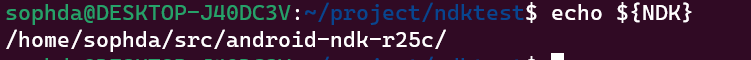
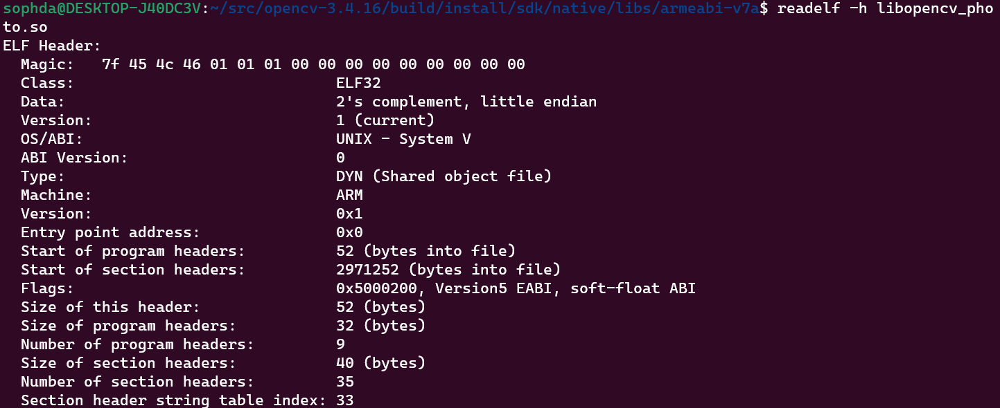

# WSL配置

## 设置内存和swap

在用户目录下新建**.wslconfig**

```
[wsl2]
memory=20GB
swap=20GB
localhostForwarding=true

```

即可设置内存为20G，设置交换内存为20G

# Linux

## 解压缩相关

### 解压

```
tar -xf cv.tar.xz  //解压
```

### 压缩

```
tar -cvf [文件名].tar [文件目录] //打包成.tar文件
tar -jcvf [文件名].tar.bz2 [文件目录] //打包成.bz2文件
tar -zcvf [文件名].tar.gz [文件目录] //打包成.gz文件
```

## 编译

### **动态库编译：**

```
g++ main.cpp -lmath -L/usr/local/lib -o main
//-l指定库  -o指定输出  -L指定路径
```

**编译opencv：**

```
g++ main.cpp -o exam -I/home/sophda/include -L/home/sophda/lib -lopencv_imgcodecs  -lopencv_imgproc -lopencv_core -ldl -lm -lpthread -lrt
```

```
 g++ main.cpp -o exam -I/lib/include -Wl,-rpath,/lib/lib -lopencv_imgcodecs  -lopencv_imgproc -lopencv_core -ldl -lm -lpthread -lrt
```

### **静态库编译：**

```
g++ main.cpp -static -o exam -L/home/cvlib -mfpu=neon -mfloat-abi=hard  -lopencv_imgcodecs  -lopencv_imgproc -lopencv_core -ldl -lm -lpthread -lrt
```

**交叉编译：（静态）**

```
arm-linux-gnueabi-g++ main.cpp -o exam -static -I/home/sophyda/opencv-3.2.0/arm-install/include -L/home/sophyda/opencv-3.2.0/arm-install/lib -lopencv_imgcodecs  -lopencv_imgproc -lopencv_core -ldl -lm -lpthread -lrt
```


# 方法

## 设置环境变量

```
1.设置可执行文件路径
vi ~/.bashrc
//在最后面加上
export PATH=$PATH:value
//其中value表示你的bin可执行文件的地址
```

```
2.设置变量值
vi ~/.bashrc
export NDK=/home/sophda/src/android-ndk-r25c/
//这样就可以直接
echo ${NDK}
```




## 查看动态库

1. readelf

   ```
   readelf -a libhello.so
   ```

   **查看库的平台，x86/arm：**

   ```
   readelf -h libopencv_photo.so
   ```

   

   **查看库的依赖：**

   ```
   readelf -a libxxx.so | grep "Shared"
   ```

   

2. nm

   ```
   nm libhello.so
   ```

3. 查看动态库函数

   ```
   nm -D lib***.so
   ```


4. 查看动态库是32为还是64位

   动态库：

   ```
   file xxx.so
   ```

   静态库

   ```
   objdump -a xxx.a
   ```
   


## 杀死进程

```
pgrep -f your_process_name //获取进程号，即pid
kill -15 pid  //根据pid杀死进程，15表示优雅的退出
```

比如，我的clion界面没有了（cnm在wsl中b事这么多），但是后台还在运行，所以需要kill掉

```
pgrep -f clion
kill -15 pid
```

# 可执行程序移植

我在wsl编译了slam系统，然后出差，打包到虚拟机上面去运行，所以说需要打包程序及相关的动态库。

linux程序在移植的时候，动态库是可以不看路径的。比如说，在wsl上程序依赖的动态库存在于各个文件夹，那么在虚拟机上，就可以把所有的动态库一次性打包过去，然后制定好路径即可。

- 查看程序需要哪些动态库，也就是需要打包的部分

  ```
  ldd ./AtlasORBslam
  ```

  寻找这些动态库：()

  ```
  find / -name libboost_system.so
  ```

  打包这些动态库：

  ```
  cd ....
  tar -cvf boost.tar ./libboost*.so
  ```

- 在虚拟机上面，解压相应的程序及动态库，要让程序能找到这些库，所以：

  ```
  cd /库的路径
  pwd  # 获取库的路径，方便一点，直接复制结果就可以了
  sudo vi /etc/ld.so.conf
  # 添加 库 的路径
  sudo ldconfig
  ```

  

# sh脚本


# 硬盘

## 查看连接的硬盘，即使没有挂载

```
fdisk -l
```


# Nginx

## 配置代理


在/etc/nginx/config.d/nas.conf中配置：

```
server {
    listen 80;
    listen [::]:80;
    server_name www.sophda.top;  # 你的域名

    location /nas {
        proxy_pass http://localhost:20001;  # 转发到本地的20001端口
        proxy_set_header Host $host;
        proxy_set_header X-Real-IP $remote_addr;
        proxy_set_header X-Forwarded-For $proxy_add_x_forwarded_for;
        proxy_set_header X-Forwarded-Proto $scheme;
    }
}
```

上面代码中，第三行特别重要，没有这行就会报错。

然后重启：

```
sudo systemctl restart nginx
```

