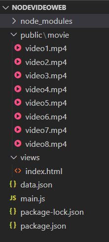

# Nodejs

卧槽了，nodejs运行Javascript，包含了web服务器，可以方便地与数据库通信，可以方便地播放视频。早知道这个我他妈还费劲的跑tomcat个屁啊

然后跑个HTML就能显示界面了，呜呜呜

node.js 一种javascript的运行环境，能够使得javascript能够脱离浏览器运行。以前js只能在浏览器基础上运行，能够操作的也知识浏览器，比如浏览器上的放大缩小操作，前提是浏览器开启的基础上进行操作（浏览器是客户端）。有了node.js之后，js可以在服务端进行操作，直接在系统上进行操作，可以打开、关闭浏览器等操作。

## NPM

要替换为淘宝镜像


## Nodemon

如果不能使用nodemon命令，可以使用`npx`命令

```
npx nodemon
```


## 使用ejs进行视频网页播放

**代码目录：**



**JavaScript代码：**

```javascript
const express = require('express')
const cors = require("cors");
const app = express()
var ejs = require('ejs')

// 数据区域
const data = require('./data.json')


// app.use(cors())
// 初始化ejs
// app.set('view engine','ejs');
// app.set('views',__dirname+'/views'); // 设置模板位置
// app.use(cors())

app.engine('html',ejs.__express);
app.set('view engine','html');
//设置使用ejs渲染html，所以就不用新建.ejs文件


app.use(express.static(__dirname+'/public'));


console.log(__dirname)
app.get('/movie/:id.html',(req,res)=>{
    // res.send('./index.html');
    let id = req.params.id;
    // let videoid = '/movie/'+String(id)+'.mp4';
    let videoid = '/movie/video'+String(id)+'.mp4';
    console.log (id);
    res.render('index',{detail:videoid})
    console.log(videoid)
  
 
}) 
 
app.listen(8080,()=>{
    console.log("http://127.0.0.1:8080/movie/1.html")
    
})

```


**index.html代码：**

```html
<!DOCTYPE html>
<html lang="en">
<head>
    <meta charset="UTF-8">
    <meta http-equiv="X-UA-Compatible" content="IE=edge">
    <meta name="viewport" content="width=device-width, initial-scale=1.0">
    <title>Document</title>
</head>
<body>
    
    <video controls autoplay src="<%= detail %>"></video>
    <!-- 使用此方法和js端通信 -->
    <h1><%= detail %></h1>
</body>
</html>
```
