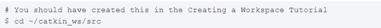
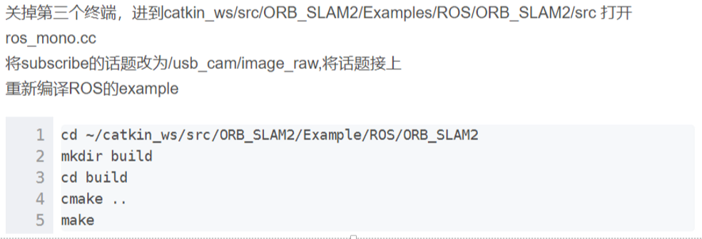
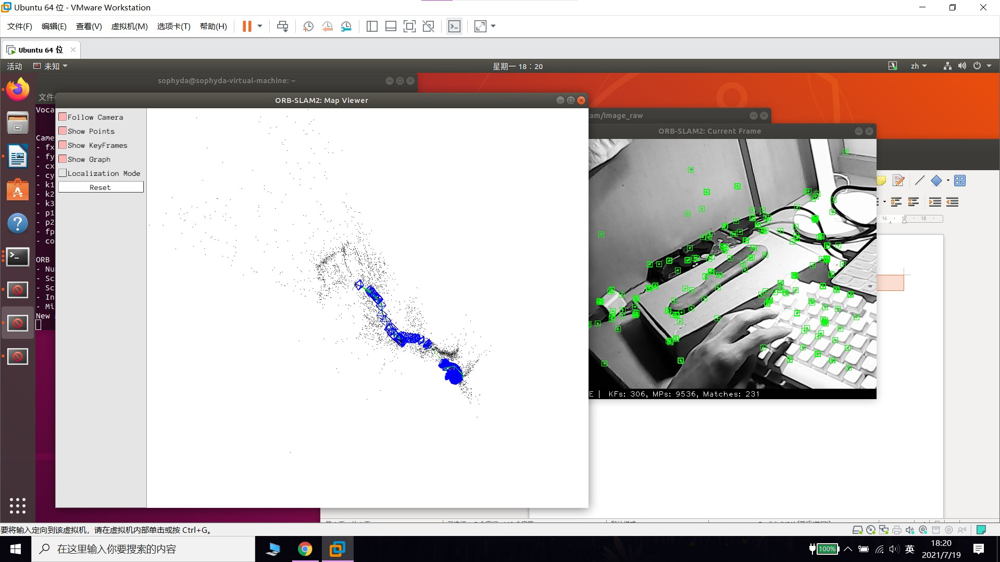
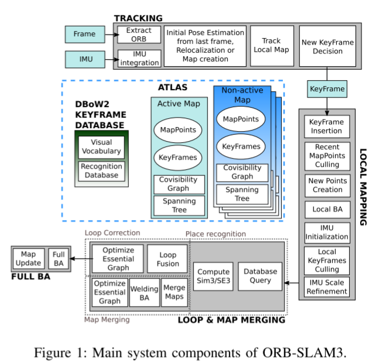
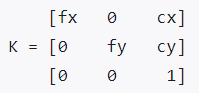
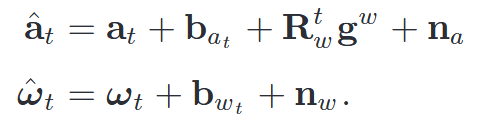
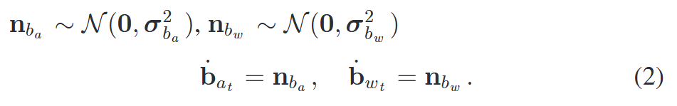
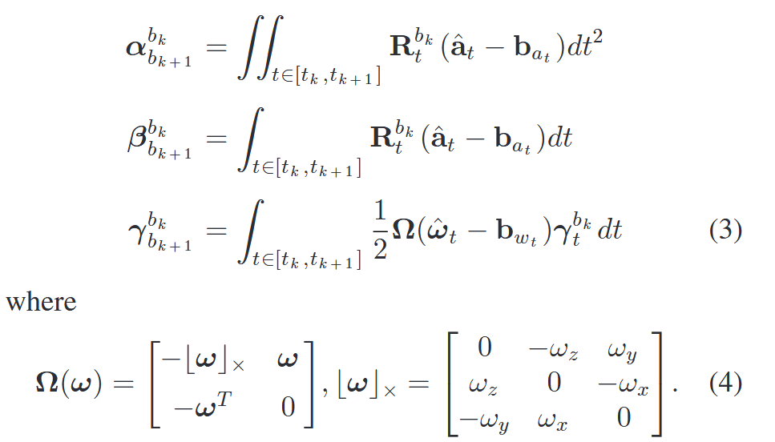

# SLAM

# ROS环境安装

## ros基础包（ros1/2看情况啊）

1. 按照对应的Ubuntu版本选择对应的ros版本。

2. 更新源

3. 设置ros下载源

4. 安装ros

# ros基础

## 概念

1. catkin 
  
   ros 定制的编译构建系统，是对cmake的扩展，catkin工作空间：组织和管理功能包的文件夹，以catkin工具编译，编译完后用source ~/catkin_ws/devel/setup.bash刷新环境

2. rosrun 启动node

```shell
rosrun [package_name] [node_name]


rosnode list 列出当前运行的node信息
rosnode info 显示某个node的详细信息
rosnode kill 结束某个node

oslaunch 启动master和多个node
roslaunch [pkg_name] [filename.launch]
```

3. rviz
  
   rqt用于图形化显示
   
   常用rqt_graph,显示通信架构
   
   rqt_plot,绘制曲线
   
   rqt_console 查看日志

4. rosbag 记录和回访数据流
  
   ```
   $ rosbag record <topic-names> 记录某些topic到bag中
   $ rosbag record -a            记录所有topic到bag中
   $ rosbag play <bag-files>     回放bag
   ```

5. client library
  
   提供ros编程的库，例如：建立node，发布消息，调用服务等
   
   提供的有roscpp,rospy,roslisp

## workspace

1. 工作空间
  
   

2. 创建工作空间
  
   

3. 使用`catkin_create_pkg`创建包，依赖于`std_msgs`,`rospy`，`roscpp`
  
   
   
   执行上述命令后，会生成`beginer_turorials`文件夹，包含`cmakelists.txt`和`package.xml`

4. 编译包
  
   

5. 添加安装文件
  
   

## 包依赖

- `fist-order dependencies`


`rospack`列出了`catkin_create_pkg`使用的依赖，这些以来在`package.xml`文件中展示

- `indirect dependencies`间接依赖


rospack可以递归地查找所有嵌套的依赖

## 定制包

1. 定制`package.xml`
  
   
   
   
   
   
   
   

## catkin_ws

- 创建并初始化一个新的工作空间，
  
  ```shell
  mkdir -p ~/catkin_ws/src
  ```

- 编译该空间
  
  ```shell
  cd ~/catkin_ws
  catkin_make
  ```

- 定义catkin_ws空间所需的环境变量，执行此民工后，ros相关的命令可以找到此工作空间中的package
  
  ```shell
  source ~/catkin_ws/devel/setup.bash
  ```

- 验证ros空间添加到环境变量成功
  
  ```shell
  echo $ROS_PACKAGE_PATH
  ```

- 打开环境变量文件，加入
  
  ```shell
  source ~/catkin_ws/devel/setup.bash
  ```

## ros cpp

```
1 void ros::init()  解析ros参数，为本node命名
2 ros::NodeHandle Class
类成员函数：
  ros::Publisher advertise()
  ros::Subscriber subscribe()..

使用：
ros::NodeHandle nh;
ros::Publisher pub = nh.advertise();


3  ros::master Namespace  命名空间
常用函数：
bool check();
const string&getHost();

使用：
ros::master::check();

4 ros::service Namespace
常用函数：
bool call();
ServiceClient creatClient()
bool exist()
bool waitF

5 ros::names Namespace
常用函数：
string append()
sting clean()
const M_string & getRemapping()orService()
```

## ros topic

  功能描述：两个node，一个发布模拟GPS 信息（格式为自定义，包括坐标和工作状态），另有一个接受并处理该消息（计算到原点的距离）

  步骤：

package  包                        

```shell
cd catkin_ws/src    
catkin_create_pkg topic_demo roscpp rospy
std_msgs                          
```

msg  自定义消息格式

```shell
cd topic_demo

mkdir msg

cd msg

vi gps.msg
```

  定义好msg文件后，catkin编译，就会出现  `~/catkin_ws/devel/include/topic_demo/gps.h`，使用时直接:

```cpp
#include<gps.h>

topic_demo::gps msg;
```

talker.cpp

listener.cpp

CmakeList.txt & package.xml

# ORB_SALM 2

## 跑起来

### 一些准备、编译

1. 编译：使用mkdir命令创建的ws需要编译一下，添加环境变量，将工作空间连接到ros运行环境

2. 相关模块安装
  
    sudo apt-get install libblas-dev liblapack-dev

3. opencv编译安装
  
   这步不多介绍，右手就行

4. pangolin安装
  
   编译安装：
   
   ```shell
   mkdir build
   cd build
   cmake -DCPP11_NO_BOOST=1 ..
   make
   ```

5. eigine
  
   - eigine使用3.2.10版本，否则orb-slam会失败
   
   - 下载源码，进入文件夹
     
     ```shell
     mkdir build 
     cd build 
     cmake ..
     make
     sudo make install
     ```

6. g2o

### orbslam编译

1. 解压`orb-slam`源码，打开终端
  
   ```shell
   chmod +x build.sh
   ./build.sh
   ```

2. `build_ros`编译使用
  
   ```shell
   chmod +x build_ros.sh
   ./build_ros.sh
   ```

3. `usb-cam`编译
  
   查看usb设备型号，（video0/video1），然后在`launch`中修改
   
   ```shell
   mkdir build 
   cd build
   cmake ..
   make
   catkin_make 
   #上面这句话在catkin_ws下进行
   ```

4. 编译后运行
  
   ```shell
   roscore
   roslaunch usb_cam usb_cam-test.launch
   rosrun ORB_SLAM2 Mono /home/sophyda/catkin_ws/src/ORB_SLAM2/Vocabulary/ORBvoc.txt /home/sophyda/catkin_ws/src/ORB_SLAM2/Examples/Monocular/TUM1.yaml
   ```

这时rviz应当是黑屏状态，原因是 orbslam并未订阅usb-cam的节点，所以：



### 问题

1. 提示


```cpp
#include<unistd.h>
```

2. 包问题
  
   
   
   ```shell
   sudo gedit /.bashrc
   export ROS_PACKAGE_PATH=${ROS_PACKAGE_PATH}:/home/sophyda/catkin_ws/ORB_SLAM2/Examples/ROS
   ```
   
   **注意：上述ros package在/.bashrc文件中添加**

***

如果还不行：

```shell
sudo rosdep fix-permissions
rosdep update
```

3. lboost问题
  
   

**结果：**




## 特征检测

### 灰度质心法


# OrbSlam3 

## 主要创新点

1. 完全依赖最大后验估计的单目和立体是解决惯性slam系统，即使是在imu的初始化阶段
2. 改进的召回地图识别，其中候选关键帧首先检查几何一致性，然后与三个共同可见的关键帧，在大多数情况下，已经在地图上的局部一致性。这种策略增加了召回率并使数据关联致密化，从而提高了地图的准确性，但代价是略高的计算成本
3. orb-slam atlas，一个完整的多地图slam系统。可以表示一组断开的映射，并将映射操作应用于：地图识别、相机重定位、环路闭合和精确无缝地图合并。进而实现增量式slam
4. 抽象相机表示，slam不知道所使用的相机模型，通过他们提供的投影、非投影、和雅各比函数来添加新的模型，目前提供了真空和鱼眼相机模型

## System review

**完整的多地图和多会话系统**。可以在纯视觉或视觉惯性模式下进行，使用单目、双目、深度相机



- atlas是由一组**不连接的地图**组成的多地图表示；存在**活动地图**，跟踪线程定位传入关键帧，并且通过本地映射线程利用新的关键帧不断优化和增长，将新地图集中的地方称为非活动地图

  包括covisibility graph：共视图

  spanning tree：生成树

- tracking thread 处理传感器信息并且实时**计算当前帧相对于活动地图的姿态**，从而最小化匹配地图特征的重投影误差；同时决定当前帧是否成为关键帧。在视觉-惯性模式中，通过在优化中包括惯性残差来估计体速度和imu偏差，**当跟踪丢失时，跟踪线程尝试在所有atlas的地图中重新定位当前帧**（每次跟丢了都要在所有地图中定位，是因为这个原因才卡的吗？）。如果重新定位，则回复跟踪；也可以切换活动的地图（演示中的红色点是活动地图）。如果没有重新定位或者切换活动地图的话，在一段时间后，就会映射为非活动，然后从头开始初始化

- local mapping thread 将**关键帧和点添加到活动地图，移除冗余的关键帧和点**，并使用视觉或视觉-惯性约束来细化地图，在接近当前帧的关键帧的本地窗口中操作。此外在惯性的情况下，imu参数的初始化和细化通过使用了新map估计技术的mapping thread完成

- loop and map merging thread 以关键帧率检测活动地图和整个地图集之间的公共区域，如果公共区域属于活动地图，则执行环路矫正（loop correction）；如果属于不同的区域，那么两个地图会被无缝的合并为单个地图（地图有差异，合并；没差异，矫正），同时单个地图映射为活动地图。在循环矫正后，在独立线程中启动完整的BA以进一步细化映射而不影响实时性能。


## Camera Model

假定所有系统组件中均为针孔相机模型（pinhole），目标是通过提取与相机模型相关的所有属性和函数（投影和非投影矩阵、雅各比矩阵等）来从slam pipeline中抽象出相机模型。

**重定位**

**非矫正立体slam**


## Visual-Inertial SLAM

> 建立在orbslam-vi提供的快速准确的imu初始化技术

**基础**  在纯视觉slam中，估计状态仅包含当前相机姿态，但在视觉-惯性slam中，需要计算额外变量。这些就是世界坐标系中的身体姿态（body pose）。
$$
T_i=[R_i,p_i] \in SE(3) 
$$
和速度$v_i$ ,以及陀螺仪和加速度计偏差$b^g_i$ 、$b_i^a$ ,其被假设为根据布朗运动演变。导致状态向量：
$$
S_i=\{T_i,v_i,b_i^g,b_i^a \}
$$
对于视觉-惯性slam，根据（Visual-inertial-aided navigation for high-dynamic motion in built environments without initial conditions,” IEEE
Transactions on Robotics）这篇文章里的理论，对连续视觉帧i和i+1之间预积分IMU，并流型化上述公式。**此时得到了预积分的旋转、速度和位置测量值**，表示为$\Delta R_{i,i+1}$,$\Delta v_{i,i+1}$以及$\Delta p_{i,i+1}$以及整个测量向量的协方差矩阵$\sum _{I_{i,i+1}}$

> 协方差矩阵可以视作两部分组成，分别是方差和协方差，**即方差构成了对角线上的元素，协方差构成了非对角线上的元素**
>
> - 方差用来衡量单个随机变量的离散程度
>
> - 协方差定义为
>   $$
>   \sigma (x,y)=\frac{1}{n-1}\sum_{i=1}^{n}(x_i-\overline x)(y_i-\overline y)
>   $$
>   

   


## 源码


# calibration



# 李群 


# VINS-MONO

## 前端视觉处理

使用稀疏光流track每一个帧

如何选择关键帧：

- 两个图像的视差大于阈值
- 使用imu积分，当旋转&平移大于阈值

## IMU预积分

1. 假定了加速度以及角速度的测量值：



这里作者假定加速度以及陀螺仪测量的**addiive noise**为正态分布nba和nbw服从，也就是下一次的a与w与上次的差值服从一个正态分布。

于是：a和w的偏差的导数有：



2. 预积分（local frame）

预积分对两个连续时间的帧bk与bk+1，由于imu的测量帧率大于照片的速率，于是在两帧之间有很多imu测量值。在local frame中有bk：



