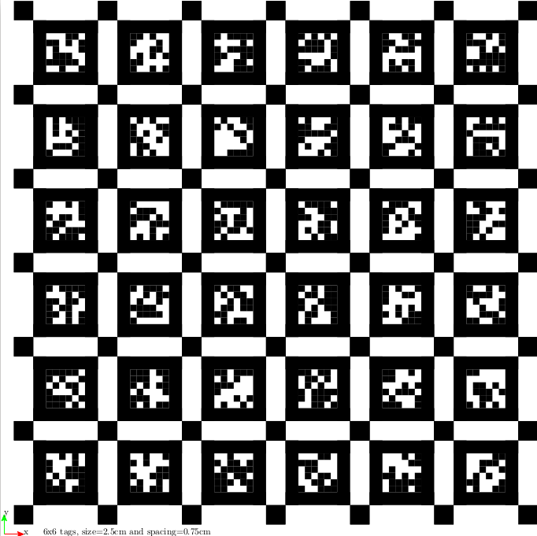
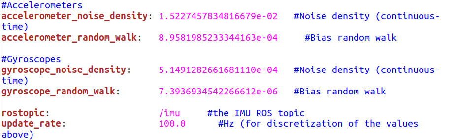
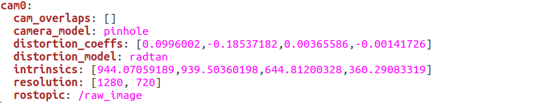
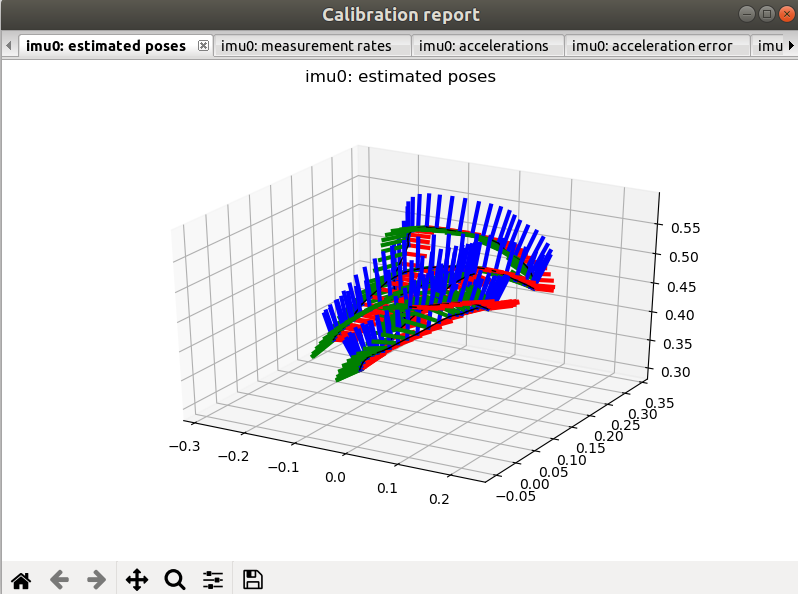
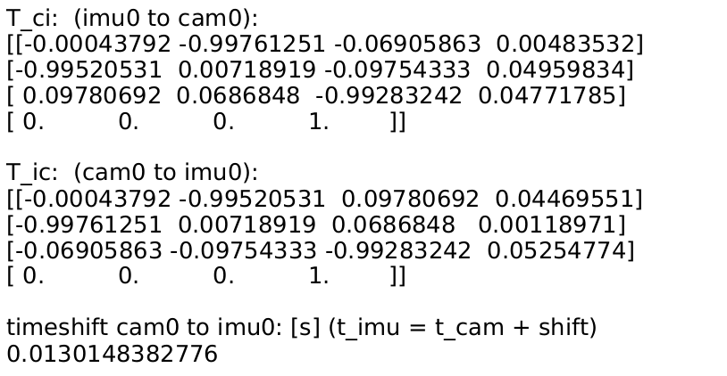

# orbslam+ace=AR

主要是通过ace网络和orbslam3，共同进行重定位

浙大他们是使用的loftr进行的匹配，然后进行的slam定位，我用ace+orbslam3应该也可以达到一样的效果。


# ACE模型

《Accelerated Coordinate Encoding: Learning to Relocalize in Minutes using RGB and Poses》加速坐标编码：使用RGB和位姿在数分钟内学会重定位


## 算法原理

> 算法包括三个部分：
>
> - 特征提取网络，模型提前训练好的
> - 场景特定回归头，基于多层感知机，作用是将特征提取网络提取到的特征映射到场景的3D坐标，作为一个地图。
> - DSAC*，ACE是复用了DSAC*的位姿估计器，也就是采用RANSAC来最小化投影误差解决的有2D-3D约束求解位姿的过程，具体而言

> 模型训练过程：特征提取（特征提取网络）-> 基于MLP的场景特定回归头，将特征映射为3D点->利用特征所在图像的真实位姿，重投影3D点进而得到投影后的2D点->计算2D-2D点之间的损失，反向传播优化MLP部分参数。
>
> 模型预测过程：特征提取（特征提取网络）->基于MLP的场景回归头，得到3D点映射->基于DSAC*的最小化重投影误差得到特征所在图片的位姿。

1.网络架构分离：场景无关骨干网络 + 场景特定回归头

传统方法通常为每个场景训练一个完整的、庞大的卷积神经网络 。ACE 将这个网络拆分为两个核心部分 ：

**场景无关的骨干网络 (Scene-agnostic Backbone)**：这是一个预训练好的、固定的卷积网络，充当一个通用的特征提取器 。它的作用是将输入的图像块（patch）转换成一个高维特征向量 。由于它是场景无关的，所以可以一次性训练好，并在任何新场景中重复使用，无需重新训练 。

**场景特定的回归头 (Scene-specific Head)**：这是一个非常轻量级的多层感知机（MLP），它的作用是将骨干网络提取的特征向量映射到场景中的一个3D坐标 。对于每个新场景，**只需要训练这个小型的MLP头**，这大大减少了需要优化的参数量 。

---

2.梯度去相关与高效训练

这是 ACE 实现加速的核心思想。传统方法一次只处理一张建图图片，从中提取成千上万的像素块进行训练 。这些来自同一张图片的像素块所产生的

**梯度是高度相关的**，导致训练信号不稳定，只能使用较小的学习率，收敛缓慢 。

ACE 通过以下流程解决了这个问题 ：

1.**创建训练缓冲 (Training Buffer)**：首先，使用固定的骨干网络处理**所有**的建图图片，提取出数百万个特征向量，并将它们与对应的相机位姿等信息一起存入一个大型的“特征池”或缓冲区中 。

**随机化批次 (Randomized Batches)**：在训练MLP头时，**从整个缓冲区中随机抽取数千个特征**来构建一个训练批次（batch） 。

**稳定且高效的梯度**：由于一个批次中的特征来自大量不同的图片和视角，它们之间的相关性被打破，产生了非常稳定的训练信号 。这使得算法可以使用**非常高的学习率**进行训练，从而实现极速收敛 。

---

3.课程学习（Curriculum Training）

为了在不牺牲精度的前提下避免耗时的端到端（end-to-end）训练（即反向传播通过位姿求解器），ACE 采用了一种课程学习策略来优化一个简单的重投影损失函数 。

它使用一个**动态变化的“内点”阈值**。在训练初期，阈值设置得比较宽松，允许网络从误差较大的预测中学习；随着训练的进行，阈值变得越来越严格 。这种机制模仿了端到端训练的效果，即引导网络逐渐关注那些已经比较好的、可靠的预测，而忽略那些可能是离群点的预测，最终提升了模型的精度 。

---

ACE 为一个新场景建图的完整流程被设计在5分钟内完成，主要分为两个阶段 ：

阶段一：训练缓冲生成（约 1 分钟）

**输入**：一个新场景的所有建图图片及其相机位姿。

**过程**：将所有图片（经过一些轻微的数据增强）送入预训练好的、**冻结的**场景无关骨干网络中 。

**输出**：从图片中随机采样并提取约800万个高维特征描述子，连同它们对应的2D位置、相机内外参等元数据，存入一个固定的训练缓冲区中 。


阶段二：MLP回归头训练（约 4 分钟）

**初始化**：创建一个新的、随机初始化的轻量级MLP回归头 。

**迭代训练**：

在每个训练周期（epoch）开始前，完全打乱缓冲区中的特征顺序 。

从打乱后的缓冲区中构建包含数千个特征的大批次（batch size: 5120） 。

将特征送入MLP头进行前向传播，预测出3D场景坐标。

根据预测的坐标、真实的相机位姿和课程学习策略计算重投影损失。

使用高学习率（通过 AdamW 优化器和 one-cycle 学习率调度器）进行反向传播，更新**仅仅MLP头**的权重 。

**完成**：在4分钟内，对整个缓冲区进行16次完整的遍历（pass）后，训练完成 。最终得到的训练好的MLP头权重就是该场景的“地图”，大小仅为4MB 。

此外，论文还提到了一些其他的优化技巧，例如使用**半精度浮点数（float16）

进行训练和存储，以进一步提速和减小模型尺寸 ；以及预测

齐次坐标（homogeneous coordinates）**而非直接预测3D坐标，这能带来微小但稳定的精度提升 


## DSAC*

这部分主要是起最小化重投影误差的作用，进而得到最后的位姿。

### 1.重投影误差：

已经有了一个**假定的相机位姿**（位置和旋转方向），我们可以将一个已知的**3D空间点**“投影”回相机的2D图像平面上，得到一个计算出的**2D坐标**。

**重投影误差**就是这个计算出的2D坐标与我们实际在图像中观测到的**原始2D坐标**之间的像素距离 。如果这个误差很小，说明我们假定的相机位姿很可能是准确的；如果误差很大，则说明这个位姿是错误的。

### 2.RANSAC求解

**步骤一：随机采样与假设生成 (Minimal Solver)**

- 从神经网络预测出的大量2D-3D对应关系中，随机抽取一个最小集合。对于求解相机位姿，通常需要3个对应点（这被称为PnP问题，即Perspective-n-Point） 。

- 使用一个“最小求解器”（Minimal Solver），比如PnP算法，根据这3个对应点计算出一个**相机位姿的假设** 。

**步骤二：模型验证与内点计数 (Inlier Counting)**

- 使用上一步生成的位姿假设，将**所有**的3D点都重投影到图像上。

- 计算每个点的重投影误差 。

- 设定一个**误差阈值**（例如，论文中提到为10个像素 ）。如果一个点的重投影误差小于这个阈值，它就被认为是这个位姿假设的“内点”。

- 统计所有内点的数量。

**步骤三：迭代与寻找最佳模型**

- 重复执行步骤一和步骤二很多次（例如，论文中提到会生成64个位姿假设 ）。
- 在所有迭代中，拥有**最多内点数量**的那个位姿假设被认为是当前最好的模型 。


**步骤四：最终优化与精确化 (Refinement)**

- 在找到了拥有最多内点的最佳位姿假设后，丢弃所有的离群点。

- 使用**所有被识别为内点**的对应关系，进行最后一次优化计算，以进一步精确化相机位姿。

- 这个优化过程通常使用一种名为**Levenberg-Marquardt (LM)算法**的非线性最小二乘法来执行 。它的目标是找到一个最优的相机位姿，使得**所有内点的重投影误差之和达到最小** 


# DEBUG

主要是通过ndk stack将堆栈地址转换为对应源文件的地址，这样就可以准确定位出现问题的地方。


# libtorch部署

## 编译libtorch

### 编译

```shell
cd /home/sophda/libtorch/pytorch/arm64build
# rm -rf ./*
cmake \
    -DCMAKE_TOOLCHAIN_FILE=${NDK27}/build/cmake/android.toolchain.cmake \
    -DANDROID_PLATFORM=android-30 \
	-DANDROID_ABI="arm64-v8a" \
    -DUSE_VULKAN=OFF \
    -DCMAKE_BUILD_TYPE=Release \
    -DUSE_MKLDNN=OFF \
    -DUSE_QNNPACK=OFF \
    -DUSE_PYTORCH_QNNPACK=ON \
    -DBUILD_TEST=OFF \
    -DUSE_NNPACK=OFF \
    -DUSE_CUDA=OFF \
    -DBUILD_PYTHON:BOOL=OFF \
    -DBUILD_SHARED_LIBS:BOOL=OFF \
    -DUSE_NNPACK=ON \
    -DUSE_OPENMP=OFF \
    ..

make -j12

```

### 链接

如上文所示，是编译生成的静态库，所以后面调用的时候需要将静态库添加到可执行文件中

- main文件

  ```shell
  #include <iostream>
  #include <torch/torch.h>
  int main(int, char**){
      std::cout << "Hello, from mobile!\n";
      torch::Tensor a = torch::rand({2,3});
      
      std::cout << a <<std::endl;
  }
  
  ```

- cmake

  ```shell
  cmake_minimum_required(VERSION 3.5.0)
  
  project(mobile VERSION 0.1.0 LANGUAGES C CXX)
  # set(name mobile)
  
  include_directories(
    /home/sophda/libtorch/x64/libtorch/include
    /home/sophda/libtorch/x64/libtorch/include/torch/csrc/api/include
  )
  
  set(fbjni_DIR /home/sophda/libtorch/third-party/fbjni)
  set(fbjni_BUILD_DIR /home/sophda/libtorch/third-party/fbjni/build)
  add_subdirectory(${fbjni_DIR} ${fbjni_BUILD_DIR})
  
  # add_library(fbjni STATIC IMPORTED)
  # set_property(
  #     TARGET fbjni
  #     PROPERTY IMPORTED_LOCATION
  #     /home/sophda/libtorch/third-party/fbjni/build/libfbjni.a)
  
  #########################################################################
  function(import_static_lib name)
  add_library(${name} STATIC IMPORTED)
  set_property(
      TARGET ${name}
      PROPERTY IMPORTED_LOCATION
      /home/sophda/libtorch/pytorch/arm64build/lib/${name}.a)
  endfunction(import_static_lib)
  
  
  import_static_lib(libtorch)
  import_static_lib(libtorch_cpu)
  import_static_lib(libc10)
  import_static_lib(libnnpack)
  import_static_lib(libXNNPACK)
  import_static_lib(libpthreadpool)
  import_static_lib(libeigen_blas)
  import_static_lib(libcpuinfo)
  import_static_lib(libclog)
  import_static_lib(libpytorch_qnnpack)
  
  
  # Link most things statically on Android.
  set(pytorch_LIBS
    fbjni
    -Wl,--gc-sections
    -Wl,--whole-archive
    libtorch
    libtorch_cpu
    -Wl,--no-whole-archive
    libc10
    libXNNPACK
    libpthreadpool
    libeigen_blas
    libcpuinfo
    libclog
    libpytorch_qnnpack
    libnnpack
    # openmp
  
  )
  
  add_executable(mobile main.cpp)
  target_link_libraries(mobile ${pytorch_LIBS})
  
  ```

- 构建脚本

  ```shell
  cd /home/sophda/libtorch/mobile/armbuild
  rm -rf ./*
  cmake \
      -DCMAKE_TOOLCHAIN_FILE=${NDK27}/build/cmake/android.toolchain.cmake \
      -DANDROID_PLATFORM=android-30 \
  	-DANDROID_ABI="arm64-v8a" \
      ..
  
  make -j12
  ```


### 静态库编译错误

c10::Error: Tried to register multiple backend fallbacks for the same dispatch key Conjugate; previous registration registered at...

当使用静态库编译时，所有的代码都打包到一块，导致一些些库依赖同样的库，但是在链接时都打包了，导致静态库中出现了相同的符号。

所以编译动态库解决这个问题。

---

编译动态库出现的问题：Android logcat又出现lapack库找不到的情况

lapack是torch的线性代数库，缺少这部分会导致torch中的一些线代操作无法进行。

折中方法：使用eigen库代替lapack库。


## 模型INT8量化

使用torch.jit.trace完成，本来是想用torch script将模型编译成可运行的脚本，这样即使在运行的时候有tensor的切片操作也可以进行相应的处理。但是该模型在运行时需要用到动态索引，所以失败。


## ACE 模型推理

> 由于Python端是使用skimage+PIL进行训练的，而libtorch端需要使用opencv端进行图像读取和处理，因此这里需要对读取的图像进行处理。

```python
# python 端代码
from skimage import color
from skimage import io
from skimage.transform import rotate, resize
import torchvision.transforms.functional as TF
from torchvision import transforms

image_transform = transforms.Compose([
                # transforms.ToPILImage(),
                # transforms.Resize(self.image_height),
                transforms.Grayscale(),
                transforms.ToTensor(),
                # transforms.Normalize(
                #     mean=[0.4],  # statistics calculated over 7scenes training set, should generalize fairly well
                #     std=[0.25]
                # ),
            ])

def resize_image(image, image_height):
    image = TF.to_pil_image(image)
    print("image pil:",image.size)
    image = TF.resize(image, image_height)
    print("image pil after resize:",image.size)

    return image
image = io.imread("/home/sophda/project/ace/datasets/Cambridge_KingsCollege/train/rgb/seq1_frame00001.png")
print(image.shape)

k = np.loadtxt("/home/sophda/project/ace/datasets/Cambridge_KingsCollege/train/calibration/seq1_frame00001.txt")

if len(image.shape)<3:
    image = color.gray2rgb(image)

if k.size == 1:
    focal_length = float(k)
    centre_point = None
elif k.shape == (3, 3):
    k = k.tolist()
    focal_length = [k[0][0], k[1][1]]
    centre_point = [k[0][2], k[1][2]]
else: 
    raise Exception("Calibration file must contain either a 3x3 camera \
        intrinsics matrix or a single float giving the focal length \
        of the camera.")

# The image will be scaled to image_height, adjust focal length as well.
image_height = 480
f_scale_factor = image_height / image.shape[0]
if centre_point:
    centre_point = [c * f_scale_factor for c in centre_point]
    focal_length = [f * f_scale_factor for f in focal_length]
else:
    focal_length *= f_scale_factor

# Rescale image.
image = resize_image(image, image_height)
image = image_transform(image)

intrinsics = torch.eye(3)

# Hardcode the principal point to the centre of the image unless otherwise specified.
if centre_point:
    intrinsics[0, 0] = focal_length[0]
    intrinsics[1, 1] = focal_length[1]
    intrinsics[0, 2] = centre_point[0]
    intrinsics[1, 2] = centre_point[1]
else:
    intrinsics[0, 0] = focal_length
    intrinsics[1, 1] = focal_length
    intrinsics[0, 2] = image.shape[2] / 2
    intrinsics[1, 2] = image.shape[1] / 2

image_B1HW = image.unsqueeze(0)
intrinsics_B33 = intrinsics.unsqueeze(0)

print(image_B1HW.shape)
print(intrinsics_B33.shape)
```

这里主要是使用skimage读取的，出来的尺寸是[H,W,C]

然后转为PIL图像后，变成了[W,H,C]

变成tensor.Tensor之后又变成了[B,C,H,W]，也就是说libtorch 端放入的图像tensor也应该是这种尺寸的。

那么在libtorch 中也要讲图像改成这个形式的。

```c++
void AceLocal::forward(cv::Mat& img, torch::Tensor& output){

    torch::Tensor img_tensor = torch::from_blob(
            img.data,
            {480,854,1},  // H W C
            torch::kFloat32
            );
    img_tensor = img_tensor.permute({2,0,1});
    img_tensor = img_tensor.unsqueeze(0);
    torch::Tensor model_output, dsacstar_output;
    dsacstar_output = torch::zeros({4,4});
    torch::NoGradGuard no_grad;
    model_output = model_({img_tensor}).toTensor();
    }

///////////////////////////////////////////////////////////////////////////////

cv::Mat img = cv::imread(i),
img_r,img_f,img_n;
cv::cvtColor(img,img_r,cv::COLOR_BGR2GRAY);
img_r.convertTo(img_f,CV_32FC3,1/255.0);

cv::Mat normalized;
cv::subtract(img_f, cv::Scalar(0.485, 0.456, 0.406), normalized);
cv::divide(normalized, cv::Scalar(0.229, 0.224, 0.225), normalized);

normalized = img_f;

ace.forward(normalized,pos);

```


# orbslam3

这里倒是没有什么部署难点，主要是orbslam在对单目+imu定位时，yaml会需要一些旋转矩阵之类的，缺少会报错

## 时间戳同步

这里主要是通过两个时间戳相减，然后在补偿另外一个即可

值得注意的是时间戳的来源，unity 使用的是java类中的方法。

---

UPDATE:使用的是imu和图像回调中，ndk返回的时间戳，是long型纳秒数据。


## 使用ros标定IMU-IMG


### kalibr

1.安装：

```
mkdir -p ~/kalibr_workspace/src

cd ~/kalibr_workspace

source /opt/ros/kinetic/setup.bash

catkin init

catkin config --extend /opt/ros/kinetic

catkin config --cmake-args -DCMAKE_BUILD_TYPE=Release

```

```
cd ~/kalibr_workspace/src
git clone https://github.com/ethz-asl/Kalibr.git
cd ~/kalibr_workspace
catkin build -DCMAKE_BUILD_TYPE=Release -j8
```

```
source ~/kalibr_workspace/devel/setup.bash
或者是把这句放到bashrc中
```

### imu-utils

```
// 下面这句话在imu-utils的launch文件中找到
roslaunch imu_utils realsense_imu.launch

// 播放bag文件
rosbag play -r 200 imu.bag
```


### 生成标定板图像

```
rosrun kalibr kalibr_create_target_pdf --type apriltag --nx 6 --ny 6 --tsize 0.025 --tspace 0.3
```




### 录制imu和image

在APP端集成了录制imu和image的功能，这里的保存速率是不设限制的，嘎嘎快。

录制的数据包括：

- img.txt：图像数据的时间戳
- video.avi：视频
- imu.txt：imu数据

---

imu数据如下：

```
74392090275411.00000 0.14583 0.06750 0.00839 9.51715 -0.06341 3.71605 
```

img数据包括时间戳和视频数据：

```
74392115107317 
```

以及一个video。

### 录制bag包（ros free）

环境配置：

> 在windows环境中部署一个Python环境，为啥要录制呢，因为要标定imu和相机

```
2025/04/01  00:26    <DIR>          .
2025/04/01  00:10    <DIR>          ..
2025/04/01  00:19            41,008 catkin-0.7.18-py2.py3-none-any.whl
2022/01/10  17:32             6,058 cv_bridge-1.13.0.post0-py2.py3-none-any.whl
2025/04/01  00:15            25,395 genmsg-0.5.12-py2.py3-none-any.whl
2025/04/01  00:16            37,487 genpy-0.6.12-py2.py3-none-any.whl
2025/04/01  00:26            57,999 geometry_msgs-1.12.7-py2.py3-none-any.whl
2025/04/01  00:14            49,313 rosbag-1.14.3-py2.py3-none-any.whl
2022/01/10  10:41            48,817 rosbag-1.15.11-py2.py3-none-any.whl
2025/04/01  00:23             7,609 roscpp-1.14.3-py2.py3-none-any.whl
2025/04/01  00:17            37,165 rosgraph-1.14.3-py2.py3-none-any.whl
2025/04/01  00:20             7,641 rosgraph_msgs-1.11.2-py2.py3-none-any.whl
2025/04/01  00:16            62,697 roslib-1.14.6-py2.py3-none-any.whl
2025/04/01  00:24            15,474 roslz4-1.14.3.post1-cp38-cp38-win_amd64.whl
2025/04/01  00:16           116,107 rospy-1.14.3-py2.py3-none-any.whl
2025/04/01  00:25            73,481 sensor_msgs-1.12.7-py2.py3-none-any.whl
2025/04/01  00:19            56,124 std_msgs-0.5.12-py2.py3-none-any.whl
```

一共是下载了这些包，一个个试出来的

---

Python录制bag包：

```python
# coding=utf-8
import rosbag
import sys
import os
import numpy as np
import cv2
from sensor_msgs.msg import Image, Imu
from cv_bridge import CvBridge
import rospy
from geometry_msgs.msg import Vector3


def findFiles(root_dir, filter_type, reverse=False):
    """
    在指定目录查找指定类型文件 -> paths, names, files
    :param root_dir: 查找目录
    :param filter_type: 文件类型
    :param reverse: 是否返回倒序文件列表，默认为False
    :return: 路径、名称、文件全路径
    """

    separator = os.path.sep
    paths = []
    names = []
    files = []
    for parent, dirname, filenames in os.walk(root_dir):
        for filename in filenames:
            if filename.endswith(filter_type):
                paths.append(parent + separator)
                names.append(filename)
    for i in range(paths.__len__()):
        files.append(paths[i] + names[i])
    print(names.__len__().__str__() + " files have been found.")
    
    paths = np.array(paths)
    names = np.array(names)
    files = np.array(files)

    index = np.argsort(files)

    paths = paths[index]
    names = names[index]
    files = files[index]

    paths = list(paths)
    names = list(names)
    files = list(files)
    
    if reverse:
        paths.reverse()
        names.reverse()
        files.reverse()
    return paths, names, files

def readIMU(imu_path):
    timestamps = []
    wxs = []
    wys = []
    wzs = []
    axs = []
    ays = []
    azs = []
    fin = open(imu_path, 'r')
    fin.readline()
    line = fin.readline().strip()
    while line:
        parts = line.split(",")
        ts = float(parts[0])/10e8
        wx = float(parts[1])
        wy = float(parts[2])
        wz = float(parts[3])
        ax = float(parts[4])
        ay = float(parts[5])
        az = float(parts[6])
        timestamps.append(ts)

        wxs.append(wx)
        wys.append(wy)
        wzs.append(wz)
        axs.append(ax)
        ays.append(ay)
        azs.append(az)
        line = fin.readline().strip()
    return timestamps, wxs, wys, wzs, axs, ays, azs


if __name__ == '__main__':
    # img_dir = sys.argv[1]   # 影像所在文件夹路径
    # img_type = sys.argv[2]  # 影像文件类型
    # img_topic_name = sys.argv[3]    # 影像Topic名称
    # imu_path = sys.argv[4]  # IMU文件路径
    # imu_topic_name = sys.argv[5]    # IMU Topic名称
    # bag_path = sys.argv[6]  # Bag文件输出路径

    img_dir = "./data/img"
    img_type = "png"
    img_topic_name = "topic_img"

    imu_path = './data/imu/imu.txt'
    imu_topic_name = "topic_imu"
    bag_path = "./bag/img_imu1.bag"

    bag_out = rosbag.Bag(bag_path,'w')

    # 先处理IMU数据
    imu_ts, wxs, wys, wzs, axs, ays, azs = readIMU(imu_path)
    imu_msg = Imu()
    angular_v = Vector3()
    linear_a = Vector3()
    print(imu_ts)
    for i in range(len(imu_ts)):
        imu_ts_ros = rospy.rostime.Time.from_sec(imu_ts[i])
        imu_msg.header.stamp = imu_ts_ros
        
        angular_v.x = wxs[i]
        angular_v.y = wys[i]
        angular_v.z = wzs[i]

        linear_a.x = axs[i]
        linear_a.y = ays[i]
        linear_a.z = azs[i]

        imu_msg.angular_velocity = angular_v
        imu_msg.linear_acceleration = linear_a

        bag_out.write(imu_topic_name, imu_msg, imu_ts_ros)
        print('imu:',i,'/',len(imu_ts))

    # 再处理影像数据
    paths, names, files = findFiles(img_dir,img_type)
    cb = CvBridge()
    
    for i in range(len(files)):
        print('image:',i,'/',len(files))

        frame_img = cv2.imread(files[i])
        timestamp = int(names[i].split(".")[0])/10e8
        print(timestamp)

        ros_ts = rospy.rostime.Time.from_sec(timestamp)
        ros_img = cb.cv2_to_imgmsg(frame_img,encoding='bgr8')
        ros_img.header.stamp = ros_ts
        bag_out.write(img_topic_name,ros_img,ros_ts)
    
    bag_out.close()
```

录制完后有一个bag文件

---

### matlab处理bag文件(aborted)

使用imutils+kalibr吧~，录制了rosbag，matlab读取之后也恢复不出来呜呜呜

```matlab
% function data = ...
%     ros(rosbagFileName, imuTopicName, ...
%     imageTopicName, cameraInfoTopicName)

rosbagFileName = "./img_imu1.bag"
imuTopicName = "topic_imu"
imageTopicName = "topic_img"
cameraInfoTopicName = ""
%helperROSReadData reads accelerometer, gyroscope readings along
%with their time stamps and returns as a timetable.
%
%   Possible syntax:
%
%   data = helperROSReadData(rosbagFileName, imuTopicName) reads
%      only IMU measurements from rosbag into timetable.
%
%   data =
%   helperROSReadData(rosbagFileName, imuTopicName, imageTopicName) reads
%      both IMU measurements and image data from rosbag.
%
%   data = helperROSReadData(rosbagFileName, imuTopicName, imageTopicName, 
%                     cameraInfoTopicName) additionally reads camera
%      intrinsic information rosbag.

% Copyright 2023-2024 The MathWorks, Inc.

% Create ROS bag reader.
fullBag = rosbagreader(rosbagFileName)
% Select IMU topic.
imuBag = select(fullBag,"Topic",imuTopicName);
% Read IMU messages.
imuMessages = readMessages(imuBag,"DataFormat","struct");
% Extract accelerometer, gyroscope readings and time stamp from IMU
% messages. Note that we are reading the time stamps from the message
% header. We can also consider the received time of ROS message
% (imuBag.MessageList.Time). Received time stamp is helpful when sensors
% don't have a common clock.
meas = cellfun(@(in) ...
    [in.LinearAcceleration.X,in.LinearAcceleration.Y,in.LinearAcceleration.Z, ...
    in.AngularVelocity.X,in.AngularVelocity.Y,in.AngularVelocity.Z, ...
    (double(in.Header.Stamp.Sec) + double(in.Header.Stamp.Nsec)*1e-9)],...
    imuMessages,'UniformOutput',false);

meas = vertcat(meas{:})
% Create IMU measurement timetable.
imuMeasurements = timetable(meas(:,1:3),meas(:,4:6), ...
    RowTimes=datetime(meas(:,7),"ConvertFrom","posixtime"),...
    VariableNames={'Accelerometer','Gyroscope'});
data = struct('imuMeasurements',imuMeasurements);


% Select image data topic.
imageBag = select(fullBag,"Topic",imageTopicName);
% Read ROS image messages.
imageMessages = readMessages(imageBag,"DataFormat","struct");
% Extract images.
images = cellfun(@rosReadImage,imageMessages,'UniformOutput',false);
images = cat(4,images{:});
% Extract image time stamps. Note that we are reading the time stamps
% from the message header. We can also consider the received time of
% ROS message (imageBag.MessageList.Time). Received time stamp is
% helpful when sensor don't have a common clock.
imageTimeStamps = datetime(cellfun(@(in)(double(...
    in.Header.Stamp.Sec) + double(...
    in.Header.Stamp.Nsec)*1e-9),imageMessages),...
    "ConvertFrom","posixtime");
data.images = images;
data.imageTime = imageTimeStamps;


% if nargin > 3
%     % Select camera information  topic.
%     camInfoBag = select(fullBag,"Topic",cameraInfoTopicName);
%     % Read messages.
%     camInfoMessages = readMessages(camInfoBag,"DataFormat","struct");
%     data.focalLength = [camInfoMessages{1}.K(1),camInfoMessages{1}.K(1)];
%     data.principalPoint = [camInfoMessages{1}.K(3),camInfoMessages{1}.K(6)];
%     data.radialDistortion = [camInfoMessages{1}.D(1),camInfoMessages{1}.D(2)];
%     data.tangentialDistortion = [camInfoMessages{1}.D(3),camInfoMessages{1}.D(4)];
% end

%%
% Camera intrinsic parameters relevant to this data.
dynamicData = data;
CameraFocalLength = dynamicData.focalLength;
CameraPrincipalPoint = dynamicData.principalPoint;
ImageSize = size(dynamicData.images,[1,2]);

% Checkerboard parameters
CheckerBoardSquareSize = 0.04;
CheckerBoardSize = [8,11];

% Detect checkerboard in dynamic data.
[PatternDetections,~,ImagesUsed] = detectCheckerboardPoints(...
     dynamicData.images,HighDistortion=false,ShowProgressBar=true, ...
     PartialDetections=false);
ImageTime = dynamicData.imageTime(ImagesUsed);

% Retrieve IMU data.
IMUMeasurements = dynamicData.imuMeasurements;
% StaticIMUMeasurements = staticData.imuMeasurements;

% save required data
save CameraIMUCalibrationData CameraFocalLength CameraPrincipalPoint ImageSize CheckerBoardSquareSize CheckerBoardSize StaticIMUMeasurements IMUMeasurements PatternDetections ImageTime
```


---

### imu标定

将手机静止一段很长的时间，然后运行脚本标定imu。这样是标定imu的游走噪声等数据

```
rosrun roslaunch imu_utils k60.launch
rosbag play -r 200 imu.bag
```

得到imu的一系列数据：




### 相机标定

老生常谈的东西了

```
rosrun kalibr kalibr_calibrate_cameras --target april_6x6_24x24mm.yaml --models pinhole-radtan --topics /raw_image --bag img.bag
```




### 相机imu联合标定

主要是结算二者的位姿变换矩阵

通过标定的imu、相机数据，运行下列脚本：

```
rosrun kalibr kalibr_calibrate_imu_camera --target april_6x6_24x24mm.yaml --bag ./image_imu.bag --cam ./k60_img.yaml  --imu k60_imu.yaml --imu-models scale-misalignment --timeoffset-padding 0.1 --bag-from-to 1 15  
```

解算完成后，会有下列结果：





---

orbslam需要的数组是：从相机到IMU的变换（将一个向量从相机坐标系变换到IMU坐标系的矩阵）

```
Transformation from camera to body-frame (imu)

IMU.T_b_c1: !!opencv-matrix
   rows: 4
   cols: 4
   dt: f
   data: [-0.00043792, -0.99520531, 0.09780692, 0.04469551,
          -0.99761251, 0.00718919 , 0.0686848,  0.00118971,
          -0.06905863, -0.09757333, -0.99283242, 0.05254774,
         0.0, 0.0, 0.0, 1.0]
```


# 多线程

## 遇到的问题

1.**类中的多线程对象**

要声明为类的成员函数


## 线程安全队列

主要是使用条件变量和锁实现。用于保存NDK获取的imu和相机数据。


## 线程池

用于并行推理多张图片帧。


# OpenGL YUV2RGB

实现gpu加速yuv转rgb

## API与变量

### GLuint

表示一个32位无符号整数。

### EGLDisplay

是EGL API中的核心数据类型，表示一个与本地窗口系统的链接。**** 它是 EGL 操作的起点。它代表了你程序想要在其上渲染图形的**物理或虚拟显示设备**（屏幕、窗口、离屏表面等）。

```
EGLDisplay display_ = EGL_NO_DISPLAY;
```


### EGLContext


### EGLSurface


### createProgram（自定义）

用于封装创建、编译、链接一个完整的OpenGL着色器程序的过程。

```
createProgram(const char* vertexSrc, const char* fragmentSrc) {
GLuint vertexShader = loadShader(GL_VERTEX_SHADER, vertexSrc);
    if (vertexShader == 0) {
        LOGE("Failed to load vertex shader");
        return 0;
    }

    GLuint fragmentShader = loadShader(GL_FRAGMENT_SHADER, fragmentSrc);
    if (fragmentShader == 0) {
        LOGE("Failed to load fragment shader");
        glDeleteShader(vertexShader);
        return 0;
    }

    GLuint program = glCreateProgram();
    if (program == 0) {
        LOGE("Could not create program");
        glDeleteShader(vertexShader);
        glDeleteShader(fragmentShader);
        return 0;
    }

    glAttachShader(program, vertexShader);
    glAttachShader(program, fragmentShader);
    glLinkProgram(program);

    GLint linked;
    glGetProgramiv(program, GL_LINK_STATUS, &linked);
    if (!linked) {
        GLint infoLen = 0;
        glGetProgramiv(program, GL_INFO_LOG_LENGTH, &infoLen);
        if (infoLen > 1) {
            char* infoLog = (char*)malloc(sizeof(char) * infoLen);
            glGetProgramInfoLog(program, infoLen, nullptr, infoLog);
            LOGE("Error linking program:\n%s", infoLog);
            free(infoLog);
        }
        glDeleteProgram(program);
        return 0;
    }

    // 链接成功后，可以删除着色器对象
    glDetachShader(program, vertexShader);
    glDetachShader(program, fragmentShader);
    glDeleteShader(vertexShader);
    glDeleteShader(fragmentShader);

    return program;
```


### setupTextures（自定义）

```
setupTextures() {
    LOGI("Setting up textures...");
    // --- 为 I420 (planar) 格式创建纹理 ---
    int uvWidth = imageWidth_ / 2;
    int uvHeight = imageHeight_ / 2;

    // 1. Y 纹理
    glGenTextures(1, &yTexture_);
    glBindTexture(GL_TEXTURE_2D, yTexture_);
    glTexParameteri(GL_TEXTURE_2D, GL_TEXTURE_MIN_FILTER, GL_LINEAR);
    glTexParameteri(GL_TEXTURE_2D, GL_TEXTURE_MAG_FILTER, GL_LINEAR);
    glTexParameteri(GL_TEXTURE_2D, GL_TEXTURE_WRAP_S, GL_CLAMP_TO_EDGE);
    glTexParameteri(GL_TEXTURE_2D, GL_TEXTURE_WRAP_T, GL_CLAMP_TO_EDGE);
    // 使用 GL_R8 作为单通道纹理的内部格式 (GLES 3.0+)
    glTexImage2D(GL_TEXTURE_2D, 0, GL_R8, imageWidth_, imageHeight_, 0, GL_RED, GL_UNSIGNED_BYTE, nullptr);

    // 2. U 纹理
    glGenTextures(1, &uTexture_);
    glBindTexture(GL_TEXTURE_2D, uTexture_);
    glTexParameteri(GL_TEXTURE_2D, GL_TEXTURE_MIN_FILTER, GL_LINEAR);
    glTexParameteri(GL_TEXTURE_2D, GL_TEXTURE_MAG_FILTER, GL_LINEAR);
    glTexParameteri(GL_TEXTURE_2D, GL_TEXTURE_WRAP_S, GL_CLAMP_TO_EDGE);
    glTexParameteri(GL_TEXTURE_2D, GL_TEXTURE_WRAP_T, GL_CLAMP_TO_EDGE);
    glTexImage2D(GL_TEXTURE_2D, 0, GL_R8, uvWidth, uvHeight, 0, GL_RED, GL_UNSIGNED_BYTE, nullptr);

    // 3. V 纹理
    glGenTextures(1, &vTexture_);
    glBindTexture(GL_TEXTURE_2D, vTexture_);
    glTexParameteri(GL_TEXTURE_2D, GL_TEXTURE_MIN_FILTER, GL_LINEAR);
    glTexParameteri(GL_TEXTURE_2D, GL_TEXTURE_MAG_FILTER, GL_LINEAR);
    glTexParameteri(GL_TEXTURE_2D, GL_TEXTURE_WRAP_S, GL_CLAMP_TO_EDGE);
    glTexParameteri(GL_TEXTURE_2D, GL_TEXTURE_WRAP_T, GL_CLAMP_TO_EDGE);
    glTexImage2D(GL_TEXTURE_2D, 0, GL_R8, uvWidth, uvHeight, 0, GL_RED, GL_UNSIGNED_BYTE, nullptr);

    // --- 为 NV12/NV21 (semi-planar) 格式创建纹理 ---
    // 4. UV 交错纹理
    glGenTextures(1, &uvTexture_);
    glBindTexture(GL_TEXTURE_2D, uvTexture_);
    glTexParameteri(GL_TEXTURE_2D, GL_TEXTURE_MIN_FILTER, GL_LINEAR);
    glTexParameteri(GL_TEXTURE_2D, GL_TEXTURE_MAG_FILTER, GL_LINEAR);
    glTexParameteri(GL_TEXTURE_2D, GL_TEXTURE_WRAP_S, GL_CLAMP_TO_EDGE);
    glTexParameteri(GL_TEXTURE_2D, GL_TEXTURE_WRAP_T, GL_CLAMP_TO_EDGE);
    // 使用 GL_RG8 作为双通道纹理的内部格式
    glTexImage2D(GL_TEXTURE_2D, 0, GL_RG8, uvWidth, uvHeight, 0, GL_RG, GL_UNSIGNED_BYTE, nullptr);

    // 解绑纹理
    glBindTexture(GL_TEXTURE_2D, 0);
    LOGI("Textures created successfully.");
}
```


### setupFBO

```
setupFBO() {
    LOGI("Setting up Framebuffer Object (FBO)...");
    // 1. 创建 FBO
    glGenFramebuffers(1, &fbo_);

    // 2. 创建一个纹理，作为 FBO 的颜色附件（渲染目标）
    glGenTextures(1, &rgbTexture_);
    glBindTexture(GL_TEXTURE_2D, rgbTexture_);
    glTexParameteri(GL_TEXTURE_2D, GL_TEXTURE_MIN_FILTER, GL_LINEAR);
    glTexParameteri(GL_TEXTURE_2D, GL_TEXTURE_MAG_FILTER, GL_LINEAR);
    glTexParameteri(GL_TEXTURE_2D, GL_TEXTURE_WRAP_S, GL_CLAMP_TO_EDGE);
    glTexParameteri(GL_TEXTURE_2D, GL_TEXTURE_WRAP_T, GL_CLAMP_TO_EDGE);
    // 分配存储空间，格式为 RGB
    glTexImage2D(GL_TEXTURE_2D, 0, GL_RGB8, imageWidth_, imageHeight_, 0, GL_RGB, GL_UNSIGNED_BYTE, nullptr);

    // 3. 将纹理附加到 FBO
    glBindFramebuffer(GL_FRAMEBUFFER, fbo_);
    glFramebufferTexture2D(GL_FRAMEBUFFER, GL_COLOR_ATTACHMENT0, GL_TEXTURE_2D, rgbTexture_, 0);

    // 4. 检查 FBO 状态，这是非常重要的调试步骤
    GLenum status = glCheckFramebufferStatus(GL_FRAMEBUFFER);
    if (status != GL_FRAMEBUFFER_COMPLETE) {
        LOGE("Failed to create complete FBO: 0x%x", status);
    } else {
        LOGI("FBO created successfully.");
    }

    // 5. 解绑 FBO，返回到默认的窗口系统帧缓冲
    glBindTexture(GL_TEXTURE_2D, 0);
    glBindFramebuffer(GL_FRAMEBUFFER, 0);
}
```


### glGenVertexArrays

```
void glGenVertexArrays(GLsizei n, GLuint *arrays);
```

**生成 `n` 个新的顶点数组对象 (Vertex Array Object - VAO) 的名称（ID）**。这些 ID 存储在 `arrays` 指向的数组中。


### glGenBuffers

```
void glGenBuffers(GLsizei n, GLuint *buffers);
```

**生成 `n` 个新的缓冲区对象 (Buffer Object) 的名称（ID）**。这些 ID 存储在 `buffers` 指向的数组中。


### glBindVertexArray

```
void glBindVertexArray(GLuint array);
```

**绑定指定的顶点数组对象 (VAO)。** 所有后续的顶点属性配置 (`glVertexAttribPointer`, `glEnableVertexAttribArray`) 都将记录在这个 VAO 中。如果 `array` 为 0，则解绑当前 VAO（恢复默认顶点数组状态）。


### glBindBuffer

```
void glBindBuffer(GLenum target, GLuint buffer);
```

**将指定的缓冲区对象绑定到给定的目标上。** 后续所有作用于该目标的缓冲区操作（如 `glBufferData`, `glVertexAttribPointer`）都将影响这个绑定的缓冲区。如果 `buffer` 为 0，则解绑当前绑定到 `target` 的缓冲区。


### glBufferData

```
void glBufferData(GLenum target, GLsizeiptr size, const void *data, GLenum usage);
```

**创建并初始化绑定到 `target` 的缓冲区对象的数据存储。** 它分配新的存储空间并用 `data` 的内容填充它（如果 `data` 不是 NULL）。如果该缓冲区已有存储空间，`glBufferData` 会先删除旧存储再创建新存储。


### glEnableVertexAttribArray

```
void glEnableVertexAttribArray(GLuint index);
```

**启用指定索引 (`index`) 的通用顶点属性数组。** 如果启用，当调用绘图命令（如 `glDrawArrays`, `glDrawElements`）时，该索引对应的顶点属性数据将从之前通过 `glVertexAttribPointer` 绑定的缓冲区中获取。如果禁用，则使用为该索引设置的当前顶点属性值（通过 `glVertexAttrib*` 系列函数设置）。


### glVertexAttribPointer

```
void glVertexAttribPointer(GLuint index, GLint size, GLenum type, GLboolean normalized, GLsizei stride, const void *pointer);
```

 **定义绑定到 `GL_ARRAY_BUFFER` 目标的缓冲区中，指定索引 (`index`) 的顶点属性数据的格式和位置。** 它告诉 OpenGL 如何解释缓冲区中的数据以提供给顶点着色器中的特定输入变量。


# 点云处理

## 拟合平面


## 三角化


# 数据交互

## 图片数据

从OpenCV到C#


## MESH数据
