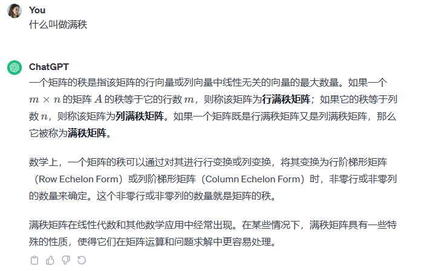
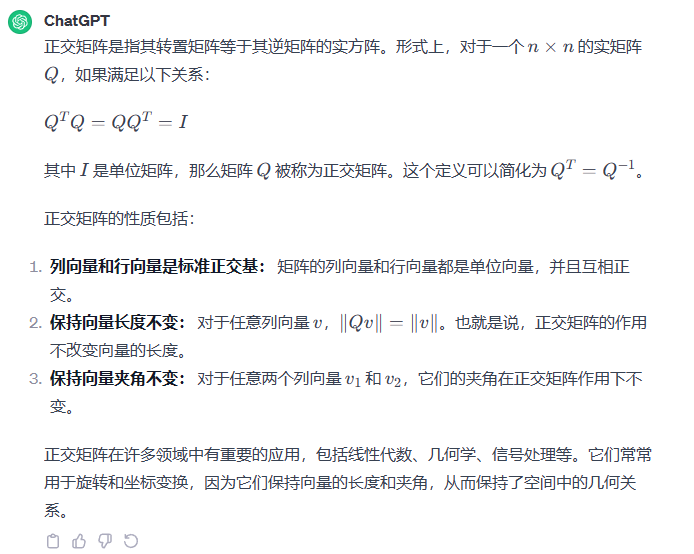
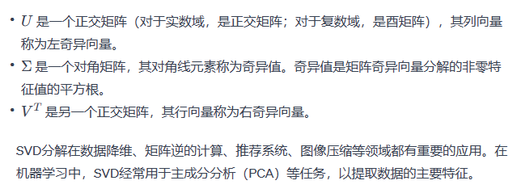
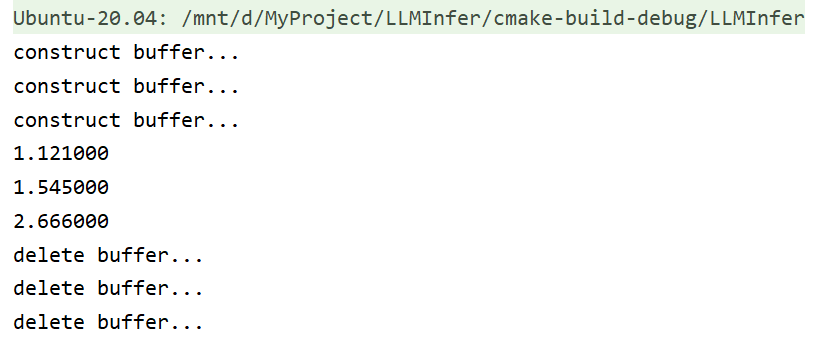

# Matrix

## 基础概念

### 矩阵满秩



### 正交矩阵

正交矩阵的行列式为**正负1**




## svd分解

奇异值分解（Singular Value Decomposition，简称SVD）是一种线性代数的技术，用于将一个矩阵分解为三个矩阵的乘积。这种分解在许多领域，特别是在数值分析和机器学习中，都有广泛的应用。

给定一个实数或复数的矩阵A，其SVD分解可以表示为：
$$
A=U\sum V^T
$$


# c++ Eigen

## 列向量

```
#include <iostream>
#include <Eigen/Dense>

int main() {
    // 创建一个固定大小的列向量 (例如，这里是3维向量)
    Eigen::Vector3d fixedVector;

    // 向固定列向量赋值
    fixedVector << 1, 2, 3;

    std::cout << "Fixed Size Vector:\n" << fixedVector << std::endl;

    return 0;
}

```

## 矩阵

```
#include <iostream>
#include <Eigen/Dense>

int main() {
    // 创建一个3x3的矩阵
    Eigen::Matrix3d matrix3x3;

    // 向矩阵赋值
    matrix3x3 << 1, 2, 3,
                 4, 5, 6,
                 7, 8, 9;

    std::cout << "3x3 Matrix:\n" << matrix3x3 << std::endl;

    return 0;
}

```

## 初始化与索引

Vector3d中的d表示double

```
    // Eigen 中所有向量和矩阵都是Eigen::Matrix，它是一个模板类。它的前三个参数为：数据类型，行，列
    // 声明一个2*3的float矩阵
    Eigen::Matrix<float, 2, 3> matrix_23;

    // 同时，Eigen 通过 typedef 提供了许多内置类型，不过底层仍是Eigen::Matrix
    // 例如 Vector3d 实质上是 Eigen::Matrix<double, 3, 1>，即三维向量
    Eigen::Vector3d v_3d;
	// 这是一样的
    Eigen::Matrix<float,3,1> vd_3d;

    // Matrix3d 实质上是 Eigen::Matrix<double, 3, 3>
    Eigen::Matrix3d matrix_33 = Eigen::Matrix3d::Zero(); //初始化为零
    // 如果不确定矩阵大小，可以使用动态大小的矩阵
    Eigen::Matrix< double, Eigen::Dynamic, Eigen::Dynamic > matrix_dynamic;
    // 更简单的
    Eigen::MatrixXd matrix_x;
    // 这种类型还有很多，我们不一一列举

    // 下面是对Eigen阵的操作
    // 输入数据（初始化）
    matrix_23 << 1, 2, 3, 4, 5, 6;
    // 输出
    cout << matrix_23 << endl;
//    return 0;
    // 用()访问矩阵中的元素
    for (int i=0; i<2; i++) {
        for (int j=0; j<3; j++)
            cout<<matrix_23(i,j)<<"\t";
        cout<<endl;
    }
//    return 0;
    // 矩阵和向量相乘（实际上仍是矩阵和矩阵）
    v_3d << 3, 2, 1;
    vd_3d << 4,5,6;
```

类型转换：四则运算可以提高精度，如float转double，但是在eigen中，需要显式转换，主要是float和double。

```
    Eigen::Matrix<double, 2, 1> result = matrix_23.cast<double>() * v_3d;
    cout <<"result:" << result << endl;

    Eigen::Matrix<float, 2, 1> result2 = matrix_23 * vd_3d;
    cout << "result 2" <<  result2 << endl;
```

# eigen几何模块

## 旋转矩阵

```c++
Eigen::Matrix3d rotation_matrix = Eigen::Matrix3d::Identity();
// 旋转向量使用 AngleAxis, 它底层不直接是Matrix，但运算可以当作矩阵（因为重载了运算符）
Eigen::AngleAxisd rotation_vector ( M_PI/3, Eigen::Vector3d ( 0,0,1 ) );     //沿 Z 轴旋转 45 度
```

```
    Eigen::Vector3d v ( 1,0,0 );
    Eigen::Vector3d v_rotated = rotation_vector * v;
    cout<<"(1,0,0) after rotation = "<<v_rotated.transpose()<<endl;
    // 或者用旋转矩阵
    v_rotated = rotation_matrix * v;
    cout<<"(1,0,0) after rotation = "<<v_rotated.transpose()<<endl;
```

```
    // 欧氏变换矩阵使用 Eigen::Isometry
    Eigen::Isometry3d T=Eigen::Isometry3d::Identity();                // 虽然称为3d，实质上是4＊4的矩阵
    T.rotate ( rotation_vector );                                     // 按照rotation_vector进行旋转
    T.pretranslate ( Eigen::Vector3d ( 1,3,4 ) );                     // 把平移向量设成(1,3,4)
    cout << "Transform matrix = \n" << T.matrix() <<endl;

    // 用变换矩阵进行坐标变换
    Eigen::Vector3d v_transformed = T*v;                              // 相当于R*v+t
    cout<<"v tranformed = "<<v_transformed.transpose()<<endl;
```

```
    // 四元数
    // 可以直接把AngleAxis赋值给四元数，反之亦然
    Eigen::Quaterniond q = Eigen::Quaterniond ( rotation_vector );
    cout<<"quaternion = \n"<<q.coeffs() <<endl;   // 请注意coeffs的顺序是(x,y,z,w),w为实部，前三者为虚部
    // 也可以把旋转矩阵赋给它
    q = Eigen::Quaterniond ( rotation_matrix );
    cout<<"quaternion = \n"<<q.coeffs() <<endl;
    // 使用四元数旋转一个向量，使用重载的乘法即可
    v_rotated = q*v; // 注意数学上是qvq^{-1}
    cout<<"(1,0,0) after rotation = "<<v_rotated.transpose()<<endl;

```


# Eigen内存映射矩阵

如果我有一个指针，float类型的，在指针之后存储着dims维度的数据，要将这些数据恢复成矩阵，可以使用eigen的map映射，将内存直接映射成数据，而不用复制操作，这就有个好处，如果进行矩阵运算，会直接修改指针后面的数据，适合无返回参数的函数。

```c++
// add函数
    void add_cpu(const tensor::Tensor & input1,
                 const tensor::Tensor & input2,
                 const tensor::Tensor & output)
    {
        float* p1 = input1.ptr<float>();
        float* p2 = input2.ptr<float>();
        float* o = output.ptr<float>();
        Eigen::Map<Eigen::MatrixXf> p1_m(p1,input1.dims()[0],input1.dims()[1]);
        Eigen::Map<Eigen::MatrixXf> p2_m(p2,input2.dims()[0],input2.dims()[1]);
        Eigen::Map<Eigen::MatrixXf> output_m(o,output.dims()[0],output.dims()[1]);

        output_m = p1_m + p2_m;

    }
```

```c++
// 调用add函数
    std::shared_ptr<base::CPUDeviceAllocator> cpu = std::make_shared<base::CPUDeviceAllocator>();
    std::vector<int32_t > dims{2,2};
    tensor::Tensor a(base::DataType::kDataTypeFp32, dims, false, cpu);
    tensor::Tensor b(base::DataType::kDataTypeFp32,dims,false,cpu);
    float* bp = b.ptr<float>();
    float* ap = a.ptr<float>();
    *bp = 1.545;
    *ap = 1.121;
    tensor::Tensor c(base::DataType::kDataTypeFp32,dims,false,cpu);
    kernel::add_cpu(a,b,c);

    printf("%f\n",*a.ptr<float>());
    printf("%f\n",*b.ptr<float>());
    printf("%f\n",*c.ptr<float>());
```

输出结果如下：


