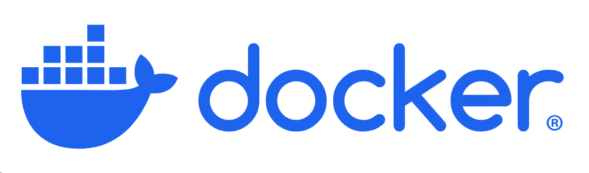
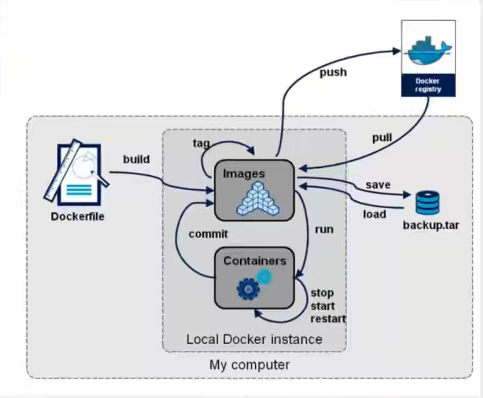

# 介绍

docker是一种方便部署的，通过 镜像-容器 快速实现对应功能的平台


# 基础操作


# 安装

详见：[Ubuntu Docker 安装 | 菜鸟教程](https://www.runoob.com/docker/ubuntu-docker-install.html)


# 常用命令



## 下载镜像

下载镜像到本地

```
docker pull ...
docker pull mysql
```

## 查询本机镜像

```
docker images
```

## 删除镜像

```
docker rmi 镜像名
docker rmi mysql
```


## 根据镜像启动容器

```
docker run [params] image

params:
--name="name" 指定容器名称
-d  后台方式运行
-it 交互方式运行，可以进入容器查看内容
-p  指定容器的端口

eg：
docker run -it centos /bin/bash
```


## 列出所有容器

```
docker ps
```


## 删除容器

```
docker rm 容器id
```


## 清理已经停止的容器

```
docker rm -v $(docker ps -aq -f status=exited)
```


## 启动和停止容器

```
docker start 容器id
docker restart 容器id
docker stop 容器id  会等10s在停止
docker kill 容器id  立刻停止
```


## 容器启动后运行容器命令

```
docker exec -it 容器id【或者是名字】 /bin/bash
```

进入容器的命令行


## 查看容器的日志

```
docker logs 容器id
```

可以通过这个命令查看容器内部的log信息，比如说挂载U盘后，需要在U盘里存放东西，但是U盘是没有权限的，之前在3588的板子上也遇到过，就是无法执行命令。这种问题就可以通过log信息查看


## 在compose中设置entrypoint

```
services:
  vllm:
    image: 192.168.31.92:5000/arm64/vllm_arm:latest
    environment:
      - HTTP_PROXY=http://192.168.31.161.7899
      - HTTPS_PROXY=http://192.168.31.161:7899
    container_name: vllm_container
    ports:
      - "8000:8000"
    volumes:
      - /home/sophda/llmprojects:/home
    networks:
      - vllm_network
    entrypoint: ["/bin/bash", "-c", "tail -f /dev/null"]

networks:
  vllm_network:
```

如果在dockerfile中没有设置entrypoint或者是太简单了跑完直接容器exit了，那么可以在compose中覆盖掉原来的entrypoint，要加tail -f /dev/null这是挂住前台不让bash退出的


## 容器内文件拷贝到宿主机

```
# 语法：docker cp <容器名或ID>:<容器内路径> <宿主机目标路径>
docker cp my_container:/app/data.txt /home/user/backup/
docker cp my_container:/var/log/nginx/ /tmp/nginx_logs/
```


# Dockerfile

从dockerfile构建镜像

可能遇到的问题：

**pip报错： error: externally-managed-environment**

```
RUN mv /usr/lib/python3.12/EXTERNALLY-MANAGED /usr/lib/python3.12/EXTERNALLY-MANAGED.bk
```


# compose

这是一种运行多个容器的东东


## 使用docker-compose.yml

展示nextcloud的compose.yml

```
services:
  # 数据库服务
  db:
    image: mysql:latest                       # 使用最新版本的 MySQL 镜像
    container_name: nextcloud_mysql           # 自定义容器名称
    restart: always                           # 容器异常退出时自动重启
    environment:
      MYSQL_ROOT_PASSWORD: 666 # 定义 MySQL 的 root 用户密码
      MYSQL_PASSWORD: 666           # 定义 Nextcloud 用户的密码
      MYSQL_DATABASE: nextcloud               # 创建数据库，名为 nextcloud
      MYSQL_USER: nextcloud                   # 定义 MySQL 用户名
      TZ: Asia/Shanghai                       # 设置时区为上海
    volumes:
      - /media/sophda/d/nextcloud/db_data:/var/lib/mysql  # 将 MySQL 数据存储在主机的指定目录，实现持久化存储
    networks:
      - nextcloud_network                     # 连接到指定的网络

  # Nextcloud 应用服务
  app:
    image: nextcloud:latest                   # 使用最新版本的 Nextcloud 镜像
    container_name: nextcloud                 # 自定义容器名称
    restart: always                           # 容器异常退出时自动重启
    depends_on:
      - db                                     # 确保 db 服务先启动
    environment:
      MYSQL_DATABASE: nextcloud               # 使用与数据库服务相同的数据库名称
      MYSQL_USER: nextcloud                   # 使用与数据库服务相同的用户名
      MYSQL_PASSWORD: 666           # 使用与数据库服务相同的密码
      MYSQL_HOST: db                          # 数据库主机名为 db（即 db 服务）
      TZ: Asia/Shanghai                       # 设置时区为上海
    volumes:
      - /media/sophda/d/nextcloud/nextcloud_data:/var/www/html  # 将 Nextcloud 数据存储在主机的指定目录，实现持久化存储
    ports:
      - "20001:80"                             # 将容器的 80 端口映射到主机的 8080 端口
    networks:
      - nextcloud_network                     # 连接到指定的网络

  # OnlyOffice 文档服务
  onlyoffice:
    image: onlyoffice/documentserver:7.1.0     # 使用指定版本的 OnlyOffice 镜像
    container_name: nextcloud_onlyoffice       # 自定义容器名称
    restart: always                           # 容器异常退出时自动重启
    environment:
      JWT_ENABLED: 'false'                    # 关闭 JWT（无需密钥）
      JWT_SECRET:                             # 不设置 JWT 密钥
      TZ: Asia/Shanghai                       # 设置时区为上海
    ports:
      - "20002:80"                             # 将容器的 80 端口映射到主机的 8081 端口
    networks:
      - nextcloud_network                     # 连接到指定的网络

# 网络定义
networks:
  nextcloud_network:                          # 定义一个名为 nextcloud_network 的网络
# 卷定义，用于持久化存储数据
volumes:
  mysql_data:                                 # 定义 MySQL 数据的卷
  nextcloud_data:                             # 定义 Nextcloud 数据的卷

```


## docker compose启动逻辑

Docker Compose 如果涉及到路径映射，如果映射的路径有app所需的文件，则直接读取，如果没有则创建。这样可以实现持久化存储

---

### **1. Docker Compose 的启动流程**
当你运行 `docker compose up` 时，Docker Compose 会按以下逻辑处理：

#### **(1) 检查镜像是否存在**
- 如果 `docker-compose.yml` 中指定的镜像（如 `image: nextcloud:latest`）**本地不存在**，会从 Docker Hub 拉取镜像。
- 如果镜像已存在本地，直接使用。

#### **(2) 检查容器是否存在**
- 如果 **没有同名容器**（通过 `container_name` 或服务名定义），会**基于镜像创建新容器**。
- 如果 **已有同名容器**，会检查容器状态：
  - 容器已停止 → **直接启动该容器**（保留原有数据和配置）。
  - 容器正在运行 → 提示容器已存在，不做操作（除非使用 `--force-recreate` 强制重建）。

#### **(3) 配置变更检测**
- 如果 `docker-compose.yml` 的配置（如环境变量、端口映射、卷挂载等）**发生了变更**：
  - Docker Compose 会**删除旧容器**，**基于新配置创建新容器**（数据持久化需依赖卷挂载）。
- 如果配置**未变更**，直接重用旧容器。

---

### **2. 关键场景示例**
#### **场景 1：首次启动（无容器存在）**
```bash
docker compose up -d
```
- 逻辑：拉取镜像（若需） → 创建新容器 → 启动容器。

#### **场景 2：容器已存在且配置未变更**
```bash
docker compose up -d
```
- 逻辑：直接启动已存在的容器（数据保留）。

#### **场景 3：镜像更新（如 `nextcloud:latest` 有新版）**
```bash
docker compose up -d
```
- 逻辑：拉取新镜像 → 删除旧容器 → 创建新容器（需配合 `pull_policy: always` 或手动删除旧容器）。

#### **场景 4：修改了 `docker-compose.yml`（如端口映射从 `8080:80` 改为 `8081:80`）**
```bash
docker compose up -d
```
- 逻辑：删除旧容器 → 创建新容器（新端口生效）。

---

### **3. 端口映射的行为**
- **端口冲突处理**：
  - 如果宿主机端口（如 `8080`）已被占用（无论是否由 Docker 容器占用），启动时会报错 `Bind for 0.0.0.0:8080 failed: port is already allocated`。
- **解决方案**：
  - 停止占用端口的进程。
  - 修改 `docker-compose.yml` 中的宿主机端口（如 `8081:80`）。

---

### **4. 数据持久化的关键**
- **卷挂载（`volumes`）**：  
  如果容器内数据目录（如 `/var/www/html/data`）通过卷挂载到宿主机（如 `./data:/var/www/html/data`），则：
  - 容器删除或重建时，**宿主机目录的数据不会丢失**。
  - 新容器启动后，自动加载宿主机目录中的持久化数据。

- **匿名卷或命名卷**：  
  若未显式挂载卷，Docker 会使用临时存储，容器删除后数据丢失。

---

### **5. 强制重建容器**
如果需要**强制基于镜像重新创建容器**（即使配置未变更）：
```bash
docker compose up -d --force-recreate
```

---

### **6. 总结**
| 场景                   | 行为                                                   |
| ---------------------- | ------------------------------------------------------ |
| 首次启动               | 拉取镜像 → 创建新容器 → 启动容器                       |
| 容器已存在且配置未变更 | 直接启动旧容器                                         |
| 镜像更新或配置变更     | 删除旧容器 → 拉取新镜像（若需）→ 创建新容器 → 启动容器 |
| 宿主机端口冲突         | 启动失败，需修改端口或释放占用                         |

---

### **7. 验证命令**
- **查看容器状态**：
  ```bash
  docker ps -a
  ```
- **查看容器日志**：
  ```bash
  docker logs <容器名>
  ```
- **检查容器详情（包括挂载和端口）**：
  ```bash
  docker inspect <容器名>
  ```

通过理解这些逻辑，你可以更灵活地控制 Docker Compose 的行为，确保数据安全和服务的可用性。


## 在compose中使用代理

这样在启动容器时，容器可以通过这个代理去访问网络

```
services:
  vllm:
    image: 192.168.31.92:5000/arm64/vllm_arm:qwen
    environment:
      - HTTP_PROXY=http://192.168.31.161.7899
      - HTTPS_PROXY=http://192.168.31.161:7899
    container_name: vllm_container
    ports:
      - "8000:8000"
    volumes:
      - /home/sophda/llmprojects:/home
    networks:
      - vllm_network

networks:
  vllm_network:

```


# harbor

## 配置网络

需要配置harbor的网址，否则会找不到的，报unreachable的问题

主要是配置insecure-registries这个地址

```
{
  "registry-mirrors": ["https://k1ktap5m.mirror.aliyuncs.com"],
  "insecure-registries": ["http://192.168.211.5:5000"]
}
```


## 标记容器

```
docker tag SOURCE_IMAGE[:TAG] 192.168.211.5:80/library/REPOSITORY[:TAG]
```


## 登录

```
docker login -u admin -p lupengda 192.168.31.92:5000
```


# vllm


## 跨平台构建


## 配置

```
 vllm serve Qwen/Qwen3-0.6B --max-model-len 500
```


