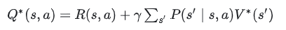
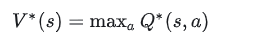
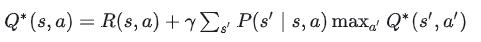
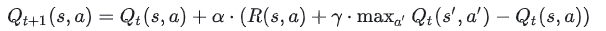

# 强化学习

## 组成

强化学习的框架主要由以下几个核心组成：

状态（State）：反映环境或系统当前的情况。

动作（Action）：智能体在特定状态下可以采取的操作。

奖励（Reward）：一个数值反馈，用于量化智能体采取某一动作后环境的反应。

策略（Policy）：一个映射函数，指导智能体在特定状态下应采取哪一动作。是一个概率密度函数，在某个状态s做出动作action的概率密度。

这四个元素共同构成了马尔可夫决策过程（Markov Decision Process, MDP），这是强化学习最核心的数学模型。

- **智能体Agent在环境Environment中，根据环境state，进行动作action，并根据reward奖励反馈，不断优化动作**
- 两部分：agent智能体；environment环境


## 马尔可夫随机过程


## SARSA算法

# Q-learning

## bellman最优方程

Q-Learning 的核心思想是利用 Bellman 最优方程来更新动作价值函数 Q(s, a)。Bellman 最优方程描述了**最优策略下的动作价值函数与下一状态的动作价值函数**之间的关系。**Q-Learning 通过迭代更新 Q 值来逼近最优动作价值函数**。

首先，我们需要了解 **Bellman 最优方程**。Bellman 最优方程描述了最优策略下的动作价值函数与下一状态的动作价值函数之间的关系。对于最优策略 $\pi^*$，我们有：



- $Q^*(s, a)$：最优动作价值函数
- $R(s, a)$：在状态 $s$ 下采取动作 $a$ 获得的奖励
- $\gamma$：折扣因子，取值范围为 [0, 1]
- $P(s' \mid s, a)$：在状态 $s$ 下采取动作 $a$ 后，转移到状态 $s'$ 的概率
- $V^*(s')$：最优状态价值函数

我们还需要知道 **最优动作价值函数** 和 **最优状态价值函数** 之间的关系：



现在，我们将最优动作价值函数代入 Bellman 最优方程：



在 Q-Learning 中，我们试图通过迭代更新 Q 值来逼近最优动作价值函数。我们可以将 Q-Learning 的更新公式表示为：



- $Q_t(s, a)$：在第 $t$ 次迭代时的动作价值函数
- $\alpha$：学习率，取值范围为 [0, 1]

这就是 Q-Learning 算法中动作价值函数的更新公式。需要注意的是，这个公式并不是从 Bellman 最优方程直接推导出来的，而是基于 Bellman 最优方程的形式构建的。Q-Learning 算法通过迭代更新 Q 值，逐步逼近最优动作价值函数。在实际应用中，我们通常会使用一些策略（如 ε-greedy）来平衡探索与利用，以便在学习过程中发现最优策略。


## Qlearning流程

1. 初始化 Q 值表，通常将所有 Q 值设为 0 或较小的随机数。
2. 对于每个训练回合：
   1. 初始化状态 $s_t$。
   2. 在状态 $s_t$ 下，根据 Q 值表和探索策略（如 ε-greedy）选择动作 $a_t$。
   3. 执行动作 $a_t$，观察奖励 $R_t$ 和下一状态 $s_{t+1}$。
   4. 使用 Q-Learning 更新公式更新 Q 值表：
       $$
       Q_{t+1}(s, a) = Q_t(s, a) + \alpha \cdot (R(s, a) + \gamma \cdot \max_{a'} Q_t(s', a') - Q_t(s, a))
       $$
   5. 如果未达到回合结束条件，将 $s_{t+1}$ 设置为新的当前状态 $s_t$，并返回步骤 2。
3. 根据 Q 值表执行最优策略。


# DQN

而DQN是DRL的其中一种算法，它要做的就是将卷积神经网络（CNN）和Q-Learning结合起来，CNN的输入是原始图像数据（作为状态State），输出则是每个动作Action对应的价值评估Value Function（Q值）。

> 参考：pytorch官方。[Reinforcement Learning (DQN) Tutorial — PyTorch Tutorials 2.2.1+cu121 documentation](https://pytorch.org/tutorials/intermediate/reinforcement_q_learning.html)

**DL与RL结合的问题**

- DL需要大量带标签的样本进行监督学习；RL只有reward返回值，而且伴随着噪声，延迟（过了几十毫秒才返回），稀疏（很多State的reward是0）等问题；
- DL的样本独立；RL前后state状态相关；
- DL目标分布固定；RL的分布一直变化，比如你玩一个游戏，一个关卡和下一个关卡的状态分布是不同的，所以训练好了前一个关卡，下一个关卡又要重新训练；
- 过往的研究表明，使用非线性网络表示值函数时出现不稳定等问题。

**DQN解决问题方法**

- 通过Q-Learning使用reward来构造标签（对应问题1）
- 通过experience replay（经验池）的方法来解决相关性及非静态分布问题（对应问题2、3）
- 使用一个CNN（MainNet）产生当前Q值，使用另外一个CNN（Target）产生Target Q值（对应问题4）
  

## Q值

DQN（Deep Q-Network）算法是一种基于深度学习的强化学习算法，用于解决离散动作空间下的Q-learning问题。在DQN中，Q值指的是状态-动作对（state-action pair）的价值估计，即在给定状态下执行某个动作的预期累积奖励。

具体来说，对于状态 \( s \) 和动作 \( a \)，Q值 \( Q(s, a) \) 表示了在状态 \( s \) 下选择动作 \( a \) 后，接下来的累积奖励的期望。在训练过程中，DQN网络通过学习从状态到动作的映射来逼近这些Q值，从而使得网络能够在环境中找到最优的策略。

### package

```
import gymnasium as gym
import math
import random
import matplotlib
import matplotlib.pyplot as plt
from collections import namedtuple, deque
from itertools import count

import torch
import torch.nn as nn
import torch.optim as optim
import torch.nn.functional as F

env = gym.make("CartPole-v1")

# set up matplotlib
is_ipython = 'inline' in matplotlib.get_backend()

plt.ion()

# if GPU is to be used
device = torch.device("cuda" if torch.cuda.is_available() else "cpu")
```


## replay memory  经验回放

> 样本是从连续帧中获得的，所以样本之间的关联性会大得多。如果没有experience replay，那么算法在连续的一段时间内朝着同一个方向做**梯度衰减**，那么同样步长下的直接计算梯度就有可能不会收敛。所以experience replay是从一个memory pool中随机选取了一些experience，然后求梯度，进而避免这个问题。

使用experience replay memory来训练DQN，存储了agent所观察到的转换，允许我们重新使用这些数据后从中随机抽样，建立非相关的batch。这可以改进DQN的稳定性。

需要的类：

- `Transition`：一个数组，表明我们的环境。本质上是映射(state,action)->(next_state,reward)
- `ReplayMemory`：有界大小的循环缓冲区，保存了最近观察到的转变。实现一种**选择随机批次过度**的方法.sample()

```
Transition = namedtuple('Transition',
                        ('state', 'action', 'next_state', 'reward'))


class ReplayMemory(object):

    def __init__(self, capacity):
        self.memory = deque([], maxlen=capacity)

    def push(self, *args):
        """Save a transition"""
        self.memory.append(Transition(*args))

    def sample(self, batch_size):
        return random.sample(self.memory, batch_size)

    def __len__(self):
        return len(self.memory)
```


# GYM

## 安装

```
pip install gym
```

## 示例

```
import gym
env = gym.make('CartPole-v0')
env.reset()
for _ in range(10):
    env.render()
    observation, reward, done, info,_ = env.step(env.action_space.sample()) # take a random action
    print('observation:{}, reward:{}, done:{}, info:{}'.format(observation, reward, done, info))
env.close()
```

- 初始化一个环境，环境进行渲染。采取action，然后循环10次

**space：**

上面的代码中，每一次的action都是随机取值的。每一个环境都有action_space和observation_space。

