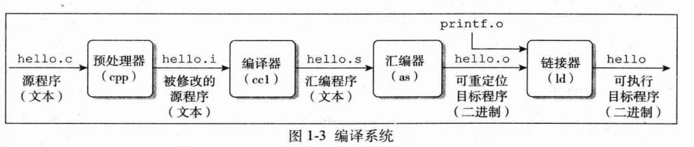

# 操作系统

 《深入理解计算机操作系统》

## 一、计算机系统漫游

### 计算机程序运行

- 预处理器（cpp）：根据以#开头的命令，读取.h中的内容，并插入到程序文本中，得到.i文件

- 编译器（ccl）：转成汇编程序，.s文件

- 汇编器（as）：将.s文件转成机器语言指令，并把指令打包成“可重定位目标程序”格式，打包进入.o格式，这是二进制文件

- 链接器（ld）：如：printf函数存在于printf.o的预编译好的目标文件中，这个文件必须以某种方式合并到.o程序中。链接器（ld）就负责这种合并，进而得到程序。是一个可执行目标文件
  
  

### 系统硬件组成

- 总线：贯穿整个系统的是一组电子管道，称作总线，携带信息字节在各个部件中传递。*总线被设计成传送定长的字节块，也就是字*，32位机器字长为4个字节，64为是8个

- I/O设备

- RAM

- ROM

- CPU:核心是PC，称为程序计数器。
  
  

猜猜当时在看什么电影：）  当然是《天空之城》

### 进程

进程是操作系统对正在运行的程序的一个抽象，在一个系统上可以运行多个进程。

- 并发运行：一个进程的指令和另一个进程 的指令是交错执行的。无论是单核/多核处理器，一个cpu看起来并发地执行多个进程。操作系统这种交错执行的机制称为**上下文切换**

- 上下文：操作系统保持跟踪进程运行所需的状态信息。包括：PC和寄存器文件的当前值，以及内存的内容。**单cpu系统只能执行一个进程的代码，当操作系统决定要把控制权切换到另一个进程时，会进行上下文切换，即保存当前进程 的上下文、恢复新进程的上下文，然后将控制权传递到新进程。** 下图表示了shell程序和用户程序上下文切换的过程。
  
  

### 线程

一个进程实际上由多个称为**线程**的执行单元组成，每个线程都运行在进程的上下文中，并共享同样的代码和全局数据。**多线程之间比多进程之间更容易共享数据，所以线程比进程高效**

好困啊，大白天的困~

### 虚拟存储器

为每个进程提供一个假象，每个进程都独占地使用主存，每个进程看到的是一致的存储器，称为虚拟地址空间。


每个进程看到的虚拟地址空间由大量准确定义的区构成：

- 程序代码和数据：对于所有进程来说，代码是从固定地址开始，紧接着是全局变量和对应的数据位置

- 堆：代码和数据区之后是堆。当调用malloc和free这样的c标准库函数时，堆可以在运行时动态地扩展和收缩

- 共享库：用来存放像c标准和数学库这样的共享库

- 栈：位于用户虚拟地址空间的顶部，称为用户栈。编译器用它来实现函数调用。和堆一样，用户栈在程序执行时可以动态扩展和收缩。**特别是调用函数时，栈就会增长；从函数返回时，栈就会收缩**

- 内核虚拟存储器：内核总是驻留在内存中，是操作系统的一部分。地址空间的顶部区域是为内核保留的

## 二、信息的表示和处理

## 三、程序的机器级表示

计算机执行机器代码，用字节序列编码低级的操作：处理数据、管理储存器、读写存储设备上的数据、网络通信。

**用高级语言编写的程序可以在很多电脑上编译和执行，而汇编代码只能于特定机器密切相关**

### 机器级代码

计算机提供了多种抽象，其中两种比较重要：1.指令集体系结构（instruction set architecture ，ISA），定义了处理器的状态，指令的格式，每条指令对状态的应性。ISA将程序的行为描述成每条指令按顺序执行。*进行某种操作时，cpu内各个寄存器、的状态，++--时要怎么配置寄存器*

2.机器级程序使用 的存储器时虚拟地址

### 数据格式

“字”（word）表示16位数据类型。32位数为双字，64位为四字

大多数GCC生成的汇编代码指令都有一个字符后缀，表示操作数的大小。例如：

- movb：传送字节

- movw：传送字

- movl：传送双子

**其实就是微机原理啦~~~**


---

# new start


# 硬件结构

计算机的硬件结构：

- 内存
- 中央处理器


# Linux内存管理

## 最佳适应算法

最佳适应算法是内存管理中一种常用的**动态分区分配算法**，主要用于解决内存分配问题。

**核心思想：该算法总是尝试找到大小最接近请求内存大小的空闲分区，从而最小化内存浪费。**

---

**工作流程：**

1. **扫描空闲分区列表**，寻找所有大于或等于请求大小的空闲块
2. 从这些空闲块中选择**大小最接近**请求大小的块
3. 将该空闲块分配给请求进程
4. 如果分配后有空余空间（外部碎片），将剩余部分作为新的空闲块

---

优点：

- **减少内存浪费**：选择最合适大小的块，最小化外部碎片
- **提高内存利用率**：相比首次适应算法，通常能更有效地利用内存

---

缺点：

- **性能开销**：需要遍历所有空闲块寻找最佳匹配
- **产生小碎片**：可能产生大量难以利用的小空闲块
- **实现复杂**：需要维护有序的空闲分区列表

---

与其他算法相比：

|     算法     |             工作原理             |     优点     |         缺点         |
| :----------: | :------------------------------: | :----------: | :------------------: |
| **最佳适应** |      选择最接近请求大小的块      | 内存利用率高 |  产生小碎片，性能差  |
| **首次适应** |       选择第一个足够大的块       |   简单快速   |     内存利用率低     |
| **最坏适应** |         选择最大的空闲块         |  减少小碎片  | 大块被拆分，利用率低 |
| **下次适应** | 从上次位置开始找第一个足够大的块 |   分配均匀   |      性能不稳定      |


## 进程虚拟内存空间

为了防止多进程运行时造成的内存地址冲突，内核引入了虚拟内存的概念，为每个进程提供一个独立的虚拟内存空间，使得进程以为自己独占全部的内存资源，**这个空间包括内核空间和用户态空间**。


用户态空间：

- 代码段：用于存放进程程序二进制文件中的机器指令
- BSS：用于存放全局未初始化的**全局变量和静态变量**
- 数据段：存放代码中指定了初始值的全局变量和静态变量
- 堆：程序运行时需要动态申请内存，在虚拟空间需要一块区域存放
- 文件映射与匿名映射区：
  - 程序运行中依赖动态库，这些动态库以.so文件的形式存放在磁盘中。就比如C程序中的`glibc`，里面对系统调用进行了封装（比如malloc函数就是对系统调用sbrk和mmap的封装）。
  - 用于文件映射的系统调用mmap，会将文件与内存进行映射
- 栈：函数调用过程中使用的局部变量和函数参数保存的地方


## 32位机器上的进程虚拟内存空间分布


在 32  位机器上，指针的寻址范围为 2^32 ，所能表达的虚拟内存空间为 4 GB 。所以在 32  位机器 上进程的虚拟内存地址范围为： 0x0000 0000 - 0xFFFF FFFF 。

其中⽤⼾态虚拟内存空间为 3 GB ，虚拟内存地址范围为： 0x0000 0000 - 0xC000 000  。 内核态虚拟内存空间为 1 GB ，虚拟内存地址范围为： 0xC000 000 - 0xFFFF FFFF 。


在内核中，start_stack标识栈的起始位置，RSP寄存器中保存着栈顶指针stack pointer，RBP寄存器中保存的是栈基地址


内核空间：进程可以看见这段内核空间地址，但是不能访问。


## 64位机器上进程虚拟内存空间分布


在目前64位系统下，只使用了48位来描述虚拟内存空间，寻址范围为$2^{48}$,所能表达的内存空间为`256TB`：

- 低128T：用户态虚拟内存空间
- 高128T：内核态虚拟内存空间


## 进程的控制结构

操作系统中，是通过进程控制块来描述进程的。


## 进程虚拟空间的管理

内核如何为进程管理这些虚拟内存区域呢？

关于虚拟内存空间管理，离不开进程在内核中的描述符`task_struct`结构：

```c
struct task_struct {
    // 进程id
    pid_t pid;
    // 用于标识线程所属的进程 pid
    pid_t tgid;
    // 进程打开的文件信息
    struct files_struct *files;
    // 内存描述符表示进程虚拟地址空间
    struct mm_struct *mm;
}
```

- `mm_struct`：每个进程都有唯一的`mm_struct`结构体，当调用fork函数创建进程的时候，表示进程地址空间的`mm_struct`结构会随着进程描述符`task_struct`的创建而创建。
- 


# 进程和线程

1. **进程 vs 线程**：
   - **进程**：操作系统资源分配的基本单位，**拥有独立的虚拟地址空间**（代码、数据、堆、栈等）。
   - **线程**：CPU调度的基本单位，**共享所属进程的地址空间**（同一进程内的所有线程共享内存和资源）。
2. **线程的独立性**：
   - 共享资源：同一进程的所有线程共享：
     - 全局变量和堆内存
     - 文件描述符（如打开的文件、网络连接）
     - 静态变量
     - 代码段
   - 私有资源：每个线程独有：
     - **栈空间**（用于局部变量、函数调用）
     - 线程状态（如寄存器值、程序计数器）
     - 线程局部存储（Thread-Local Storage, TLS）

## 多线程

### 临界区

**临界区**是多线程编程中的一个核心概念，指的是**一段访问共享资源（如全局变量、数据结构、文件等）的代码**，在这段代码的执行过程中，**不允许多个线程同时执行**，否则可能导致数据不一致或程序错误。

🛡️ 保护临界区的机制

1. 互斥锁（Mutex） - 最常用

```cpp
#include <iostream>
#include <thread>
#include <mutex>

int balance = 1000;
std::mutex mtx; // 互斥锁

void withdraw_safe(int amount) {
    mtx.lock(); // 进入临界区前加锁
    
    // 临界区开始
    if (balance >= amount) {
        std::this_thread::sleep_for(std::chrono::milliseconds(100));
        balance -= amount;
        std::cout << "取款 " << amount << ", 余额: " << balance << std::endl;
    }
    // 临界区结束
    
    mtx.unlock(); // 离开临界区后解锁
}
```

2. 更安全的 RAII 方式（推荐）

```cpp
void withdraw_safer(int amount) {
    std::lock_guard<std::mutex> lock(mtx); // 构造时自动加锁，析构时自动解锁
    
    if (balance >= amount) {
        std::this_thread::sleep_for(std::chrono::milliseconds(100));
        balance -= amount;
        std::cout << "取款 " << amount << ", 余额: " << balance << std::endl;
    }
}
```

📊 临界区保护机制对比

|               机制                |       描述       |           优点           |      缺点      |
| :-------------------------------: | :--------------: | :----------------------: | :------------: |
|        **互斥锁 (Mutex)**         |  最基本的锁机制  |         简单易用         |  需手动管理锁  |
|      **锁守卫 (Lock Guard)**      | RAII风格的锁管理 |    自动释放，异常安全    |    功能基本    |
|     **唯一锁 (Unique Lock)**      |  更灵活的RAII锁  | 支持延迟加锁、所有权转移 |     稍复杂     |
|      **信号量 (Semaphore)**       | 计数器-based同步 |   控制多个线程同时访问   |  更通用但复杂  |
| **条件变量 (Condition Variable)** |    线程间通信    |     支持等待特定条件     | 需与互斥锁配合 |


