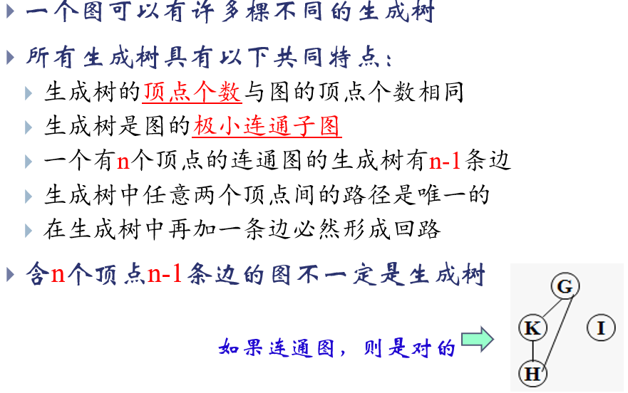
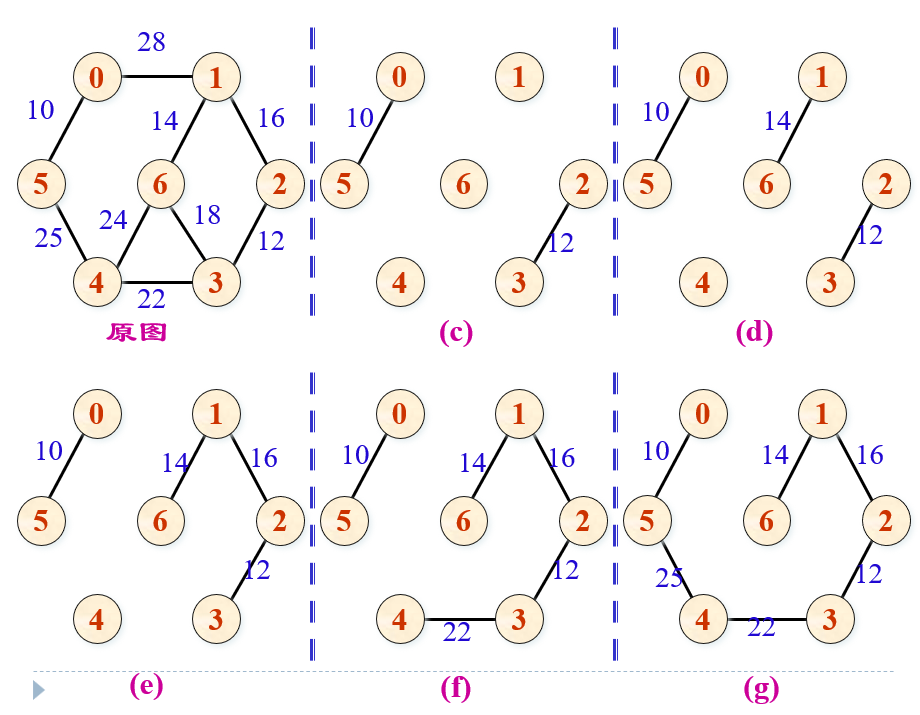

# 数据结构

# 时间复杂度


## for循环

这个算法的时间复杂度为`O(nlog(n))`

```
for(int i = 0; i < n; i++ ){

for(int j = 0; j < n; j*=2) {}

}
```


# 二叉树

## 二叉树遍历

leetcode模式--二叉树前序遍历，使用递归的方式：

```c++
/**
 * Definition for a binary tree node.
 * struct TreeNode {
 *     int val;
 *     TreeNode *left;
 *     TreeNode *right;
 *     TreeNode() : val(0), left(nullptr), right(nullptr) {}
 *     TreeNode(int x) : val(x), left(nullptr), right(nullptr) {}
 *     TreeNode(int x, TreeNode *left, TreeNode *right) : val(x), left(left), right(right) {}
 * };
 */
class Solution {
public:
    void preorder(TreeNode* node, vector<int >& vec) {
        if(node == nullptr) return;
        vec.push_back(node->val);
        preorder(node->left, vec);
        preorder(node->right, vec);

    }

    vector<int> preorderTraversal(TreeNode* root) {
        vector<int > temp;
        temp.reserve(200);

        preorder(root, temp);

        return temp;
        
    
    }
};
```


## 最大堆

最大堆是一种特殊的**完全二叉树**数据结构，它满足以下关键性质：

1. **堆序性质**：每个节点的值都**大于或等于**其子节点的值，即：对于任意节点 i，`value(i) ≥ value(left_child(i))` 且 `value(i) ≥ value(right_child(i))`

2. **结构性质**：是一棵**完全二叉树**（所有层级都被填满，最后一层从左到右填充）

实例：

```
        100
       /    \
      90     80
     /  \    / \
    70  60  50  40
   /
  30
```


# 图

## 生成树

**生成树**是一个连通图G的一个极小的连通子图，包含图G的所有顶点，但是只有`n-1`条边，并且是联通的。

生成树可以由遍历过程中的经过的边组成：

- 深度优先遍历得到的数称为**深度优先生成树**
- 广度优先遍历得到的树称为**广度优先生成树**

---

- 极大连通子图：最多顶点，最多边的连通图
- 极小连通子图：最多顶点，最少边的连通图

**连通图的极大连通子图是他自己**

---



## 最小生成树

1.定义：在一个连通网的所有生成树中，各边的代价之和最小的那棵生成树称为该连通网的最小代价生成树简称为最小生成树（MST）

例如：要在n个城市间建立交通网，要考虑的问题如何在保证n点连通的前题下最节省经费?

求解:连通6个城市且代价最小的交通线路? 

2.重要性质

> 连通网N=（V,E）
>
> - V表示图中的所有顶点的集合
> - E表示图中所有边的集合

设N=(V, E) 是一连通网，U 是顶点集V的一个非空子集。若(u , v) 是一条具有最小权值的边，其中u∈U，v∈V-U，则存在一棵包含边 (u , v) 的最小生成树。 

---

生成树算法：

- prim算法：初始化一个顶点，然后选择这个顶点中权值最小的边，然后将新的顶点加入，然后不断添加这个新的顶点集合的权值最小的边

- 克鲁斯卡尔算法：

  

