# hot100

# 哈希

## 1.两数之和

[1. 两数之和 - 力扣（LeetCode）](https://leetcode.cn/problems/two-sum/description/?envType=study-plan-v2&envId=top-100-liked)

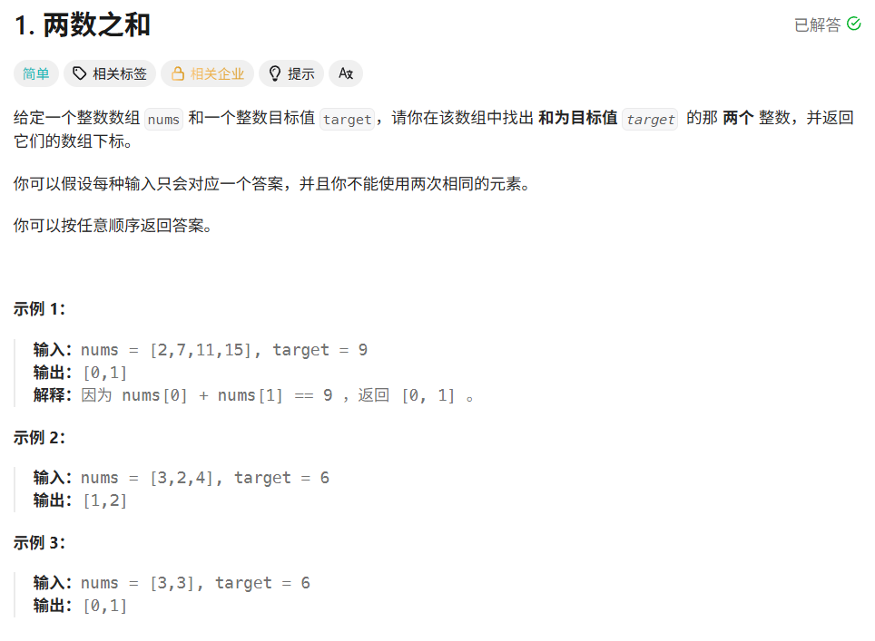

---


```c++
class Solution {
public:
    vector<int> twoSum(vector<int>& nums, int target) {
        unordered_map<int, int> map_;
        for(int i = 0; i < nums.size(); i++)
        {
            if(map_.find(nums[i]) != map_.end())
            {
                return {map_.find(nums[i]), i };
            }

            map_[target-nums[i]] = i;

        }
    }
};
```


## 49.字母异位词分组

[49. 字母异位词分组 - 力扣（LeetCode）](https://leetcode.cn/problems/group-anagrams/?envType=study-plan-v2&envId=top-100-liked)

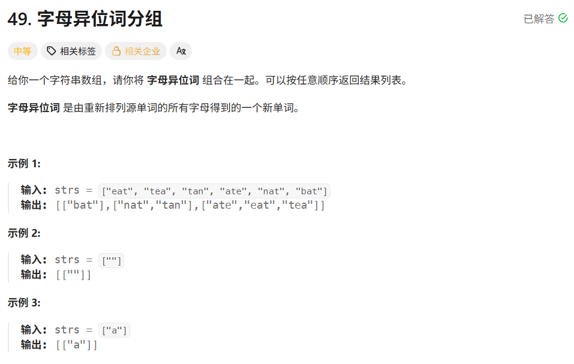

---

```cpp
class Solution {
public:
    vector<vector<string>> groupAnagrams(vector<string>& strs) {
        unordered_map<string, vector<string>> map_;
        for(auto& str : strs)
        {
            string key = str;
            sort(key.begin(),key.end());
            map_[key].push_back(str);
        }  
        vector<vector<string>> result;
        for(auto iter = map_.begin(); iter != map_.end(); iter ++)
        {
            result.push_back(iter->second);
        }
        return result;
    }
};
```


## 128.最长连续序列

[128. 最长连续序列 - 力扣（LeetCode）](https://leetcode.cn/problems/longest-consecutive-sequence/description/?envType=study-plan-v2&envId=top-100-liked)

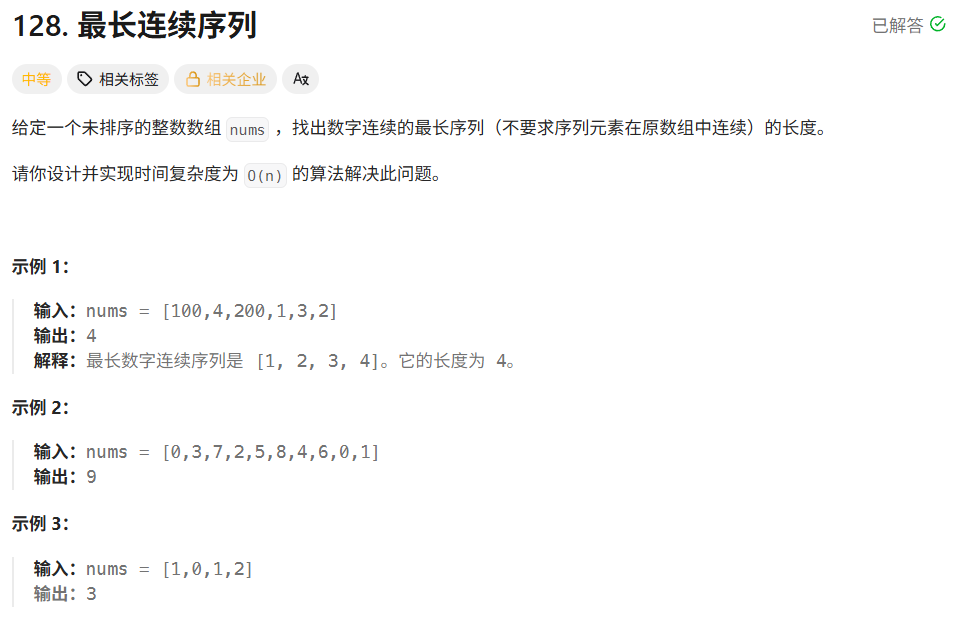

---

```cpp
class Solution {
public:
    int longestConsecutive(vector<int>& nums) {
        if(nums.empty()) return 0;
        unordered_set<int> set_;
        for(auto i : nums){
            set_.insert(i);
        }
        int max_len = 1;
        int cur_num = 0;
        int cur_len = 0;
        for(int a : set_){
            if(!set_.count(a-1)) {
                cur_num = a;
                cur_len = 0;
                while(set_.count(cur_num++)){
                    cur_len++;
                }
                max_len = max(max_len,cur_len);
            }
        }
        return max_len;
        
    }
};
```


# 双指针


## 283.移动零

[283. 移动零 - 力扣（LeetCode）](https://leetcode.cn/problems/move-zeroes/description/?envType=study-plan-v2&envId=top-100-liked)

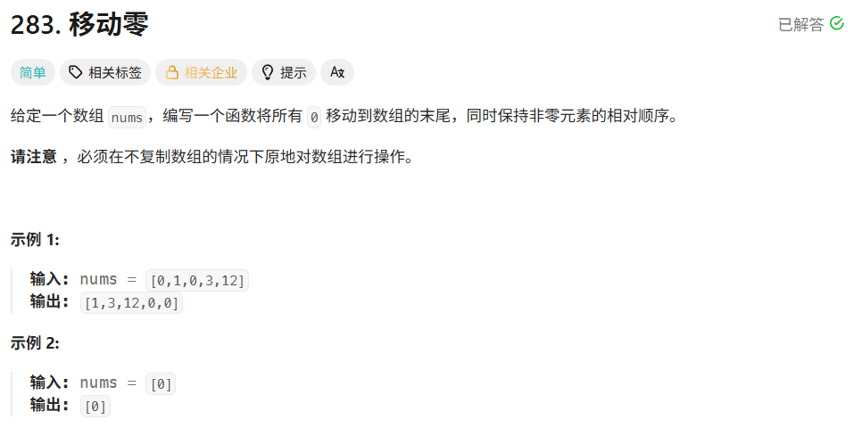

---

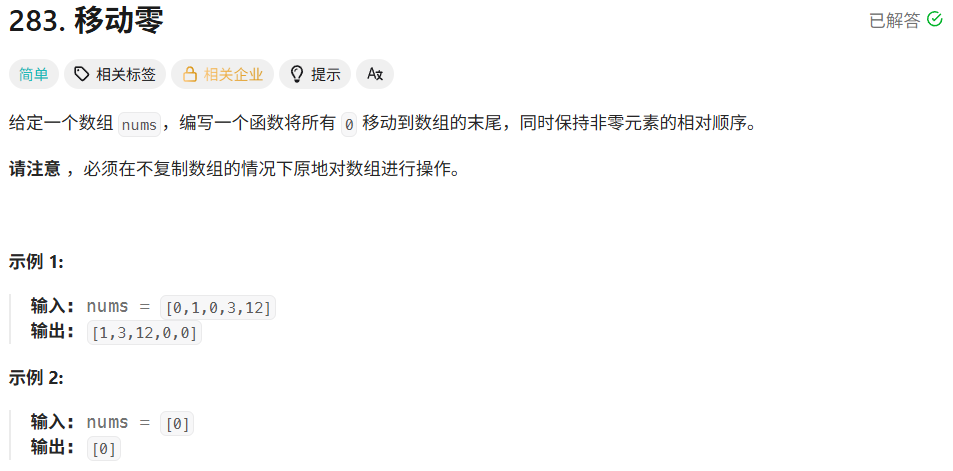


## 11.盛最多水的容器

[11. 盛最多水的容器 - 力扣（LeetCode）](https://leetcode.cn/problems/container-with-most-water/?envType=study-plan-v2&envId=top-100-liked)

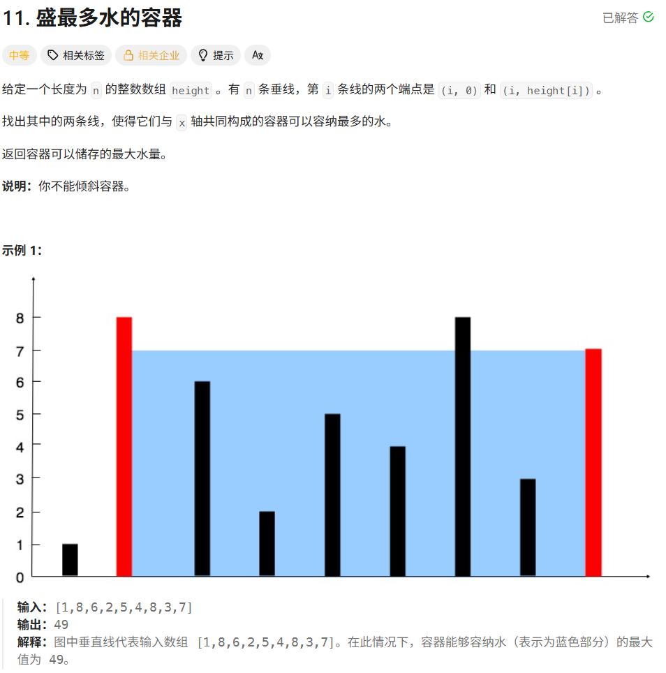

---

```c++
class Solution {
public:
    int maxArea(vector<int>& height) {
        int left = 0;
        int right = height.size() - 1;
        int max_area = 0;
        int temp = 0;
        while (left != right) {
            temp = min(height[left], height[right])*(right-left);
            max_area = temp > max_area ? temp : max_area;
            if(height[left] > height[right]) {
                right --;
            }
            else {
                left ++;
            }
        }
        return max_area;
    }
};
```


## 15.三数之和

[15. 三数之和 - 力扣（LeetCode）](https://leetcode.cn/problems/3sum/?envType=study-plan-v2&envId=top-100-liked)

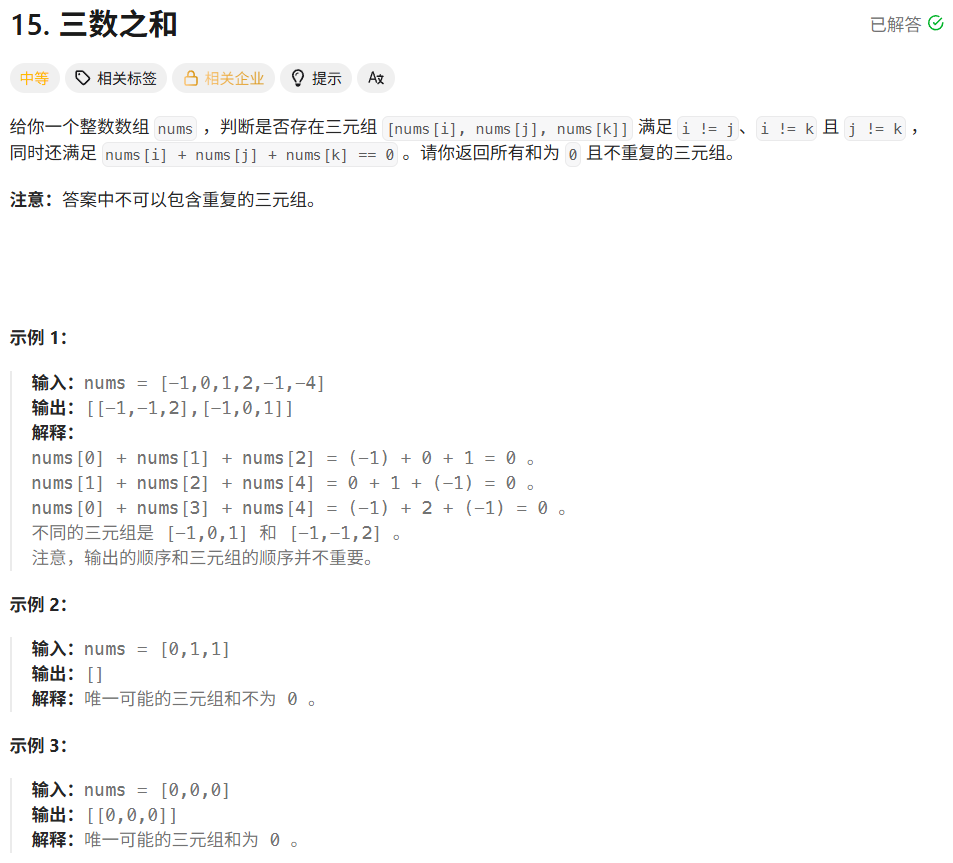

---

```c++
class Solution {
public:
    vector<vector<int>> threeSum(vector<int>& nums) {
        vector<vector<int>> result;

        sort(nums.begin(),nums.end());

        for(int first = 0; first<nums.size();first++) {
            if(first > 0 && nums[first]==nums[first-1]){
                continue;
            }
            int third = nums.size()-1;

            for (int second = first+1; second<nums.size();second++) {
                if(second>first+1 && nums[second] == nums[second-1]) {
                    continue;
                }
                while(third>second && nums[first]+nums[second]+nums[third]>0) {
                    third--;
                }
                if(second==third) {
                    break;
                }

                if (nums[first]+nums[second]+nums[third]==0) {
                    result.push_back({nums[first],nums[second],nums[third]});
                }
            }
        }
        return result;
    }
};
```

这个主要考虑的是需要使用三个循环来解决三数之和为0的情况，但是三重循环时间复杂度为$n^{3}$,所以在2、3重循环的时候，把2重循环保留，三重循环为指向尾部的指针。

---

需要注意的是初始化third值的地方：这句话放到了二维循环的外面，为什么要这样做呢？

```
int third = nums.size()-1;
```

因为nums数组是经过排序之后的，在第二重循环中，second是递增的，所以third是肯定递减的，而且并不需要从尾部开始重新查找。比如在second=3、third=6的时候满足情况，下一轮循环second=4，那么third必然小于6。

**这条如果放在二维循环里面，数据量小时并不会有什么后果，如果数据量比较大会超时**

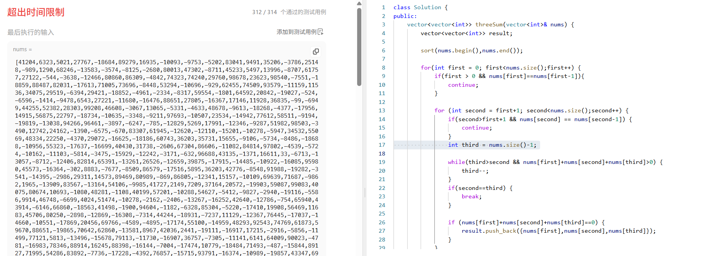


---

然后就是15行的：

```
if(second>first+1 && nums[second] == nums[second-1])
```

这部分我刚开始写的是：

```
if(second>0 && nums[second] == nums[second-1])
```

这会导致什么后果呢？

这一行的判断主要是二重循环中没有相邻的元素，所以second-1是二重循环的第一个元素，而起始点是first+1，如果是second>0，会导致`nums[first+1]==nums[first]`也会被判断，导致第一重循环的情况被剔除了。所以条件是second指向第一个元素first+1时不考虑，大于first+1时在提出重复元素。


# 滑动窗口

## 3.无重复字符的最长字串

[3. 无重复字符的最长子串 - 力扣（LeetCode）](https://leetcode.cn/problems/longest-substring-without-repeating-characters/description/?envType=study-plan-v2&envId=top-100-liked)

这道题主要是使用滑动窗口解决，那么窗口在滑动的过程中，需要不断检查新加进来的元素在窗口中有没有存在过，因此这个时候就不能用vector了，而是使用带有查找功能的哈希表即`unordered_set`.

unordered_set不支持放重复的元素，刚好这个题目要求的就是无重复的最长字串，用来做窗口岂不美哉~ 或许你想说，窗口移动会insert新的元素，这不会跟之前的冲突了吗？因为是不重复的最长子串，所以insert之前肯定会count一下看看有没有这个字符的。。

```c++
class Solution {
public:
    int lengthOfLongestSubstring(string s) {
        unordered_set<char> window;
        int rp = 0;
        int ans = 0;
        for(int i = 0; i<s.size();i++) {
            if(i!=0) {
                window.erase(s[i-1]);
            }
            while(rp<s.size() && !window.count(s[rp])) {
                window.insert(s[rp]);
                rp++;
            }
            ans = max(ans,rp-i);
        }
        return ans;
    }
};
```

关键点在于**滑动窗口**，这就要求，要有两个指针分别管理着窗口的左右边界，有一个unordered_set管理窗口内容。

- 右指针移动一位，set.insert()
- 左指针移动一位，set.erase()


s

## 438.找到字符串中所有字母异位词

https://leetcode.cn/problems/find-all-anagrams-in-a-string/description/?envTy

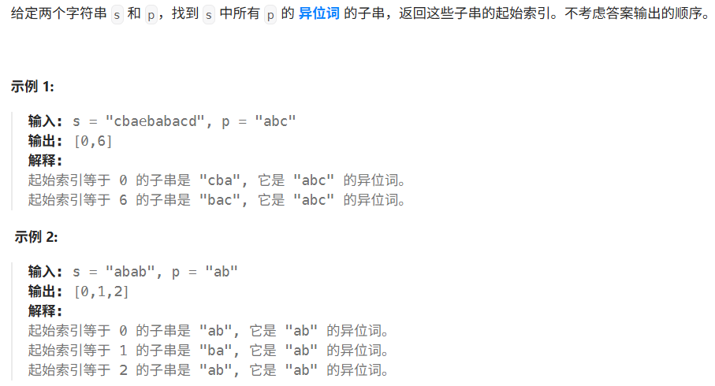

这道题，应该用词频来做，也就是说，当词出现的频率一致的时候，表示肯定是异位词。（我第一次竟然用unordered_set来做，他妈的都不能装重复的字符，怎么去匹配啊T_T）

```c++
class Solution {
public:
    vector<int> findAnagrams(string s, string p) {
        unordered_set<char> window;
        vector<int> ans;
        for(int i = 0;i<p.size()-1;i++) {
            window.insert(p[i]);
        }
        for(int j = 0; j < s.size() - p.size()+1; j++) {
            if(j!=0) {
                window.erase(s[j-1]);
            }
            window.insert(s[j+p.size()-1]);
            int len = 0;
            for(int k = 0; k < p.size();k++) {
                if(window.count(p[k])) {
                    len++;
                }
            }
            if(len == p.size()) {
                ans.push_back(j);
            }
        }
        return ans;
    }
};
```

---

我第一次做的，他妈的api都没有搞明白啊。unordered_set不允许有重复的元素，因此如果查找的字符串中有重复元素，那就寄了。。

```c++
class Solution {
public:
    vector<int> findAnagrams(string s, string p) {
        unordered_set<char> window;
        vector<int> ans;
        for(int i = 0;i<p.size()-1;i++) {
            window.insert(p[i]);
        }
        for(int j = 0; j < s.size() - p.size()+1; j++) {
            if(j!=0) {
                window.erase(s[j-1]);
            }
            window.insert(s[j+p.size()-1]);
            int len = 0;
            for(int k = 0; k < p.size();k++) {
                if(window.count(p[k])) {
                    len++;
                }
            }
            if(len == p.size()) {
                ans.push_back(j);
            }
        }
        return ans;
    }
};
```


# 子串

## 560.和为k的子数组

[560. 和为 K 的子数组 - 力扣（LeetCode）](https://leetcode.cn/problems/subarray-sum-equals-k/description/?envType=study-plan-v2&envId=top-100-liked)

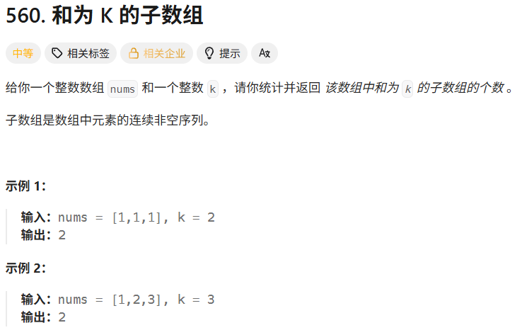

---

首先看一个暴力求解的方法：

```c++
class Solution {
public:
    int subarraySum(vector<int>& nums, int k) {
        int n = nums.size();
        int ans = 0;
        for(int i = 0; i < n; i++) {
            int sum = 0;
            for(int j = i; j < n; j++) {
                sum += nums[j];
                if(sum == k) {
                    ans++;
                    // break;
                }
            }
        }
        return ans;
    }
};
```

第12行中添加注释的部分是第一次写的，这回导致`[-1,1,0]`这种情况出错，因为你索引到-1、1的时候，就不要停下来，接着索引0，也算是一种情况


# 普通数组


## 53.最大子数组和

[53. 最大子数组和 - 力扣（LeetCode）](https://leetcode.cn/problems/maximum-subarray/description/?envType=study-plan-v2&envId=top-100-liked)

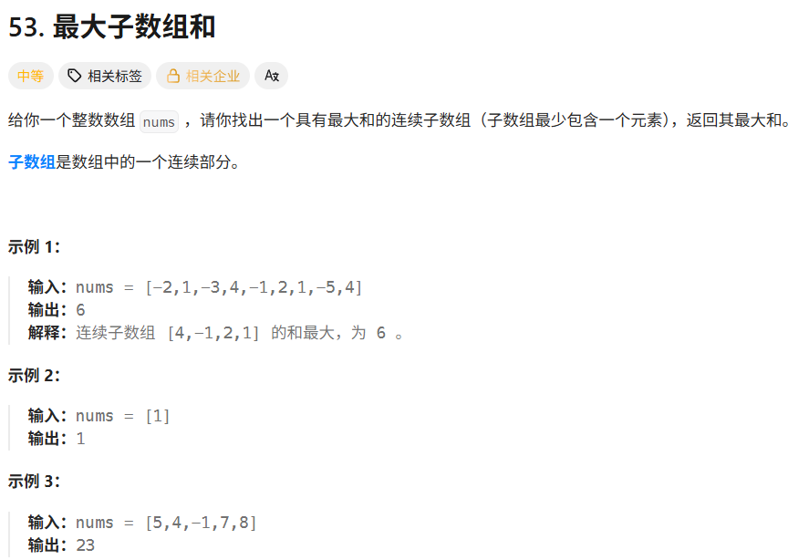

这道题目是动态规划相关的，也可以用分治算法来解决。鉴于动态规划代码量比较少，先来用这个方法。

动态规划比较重要的点在于，转移方程，类似于数学归纳法。

**最大子数组和肯定是上一个最大子数组和加上新元素之后，看看哪个大**，因此，转移方程为：

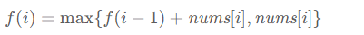

i表示元素的下标，为什么是f(i-1)+nums[i]和nums[i]进行比较的呢？为什么不是f(i-1)+nums[i]和f(i-1)进行比较的呢?

考虑这种情况：1，当f(i-1)是正的，这样子比没问题，因为f(i-1)+nums[i]肯定比f(i-1)要大；2.如果f(i-1)是负数，这时候就会“拖后腿”，还不如舍弃，取新的值作为最大值

```c++
class Solution {
public:
    int maxSubArray(vector<int>& nums) {
        int ans_max = -65536;
        int pre = 0;
        int n = nums.size();
        for(int i = 0; i < n; i++) {
            pre = max(pre+nums[i], nums[i]);
            ans_max = max(pre, ans_max);
        }
        return ans_max;
    }
};
```

ans_max要取个非常小的值。


## 56.合并区间

[56. 合并区间 - 力扣（LeetCode）](https://leetcode.cn/problems/merge-intervals/description/?envType=study-plan-v2&envId=top-100-liked)

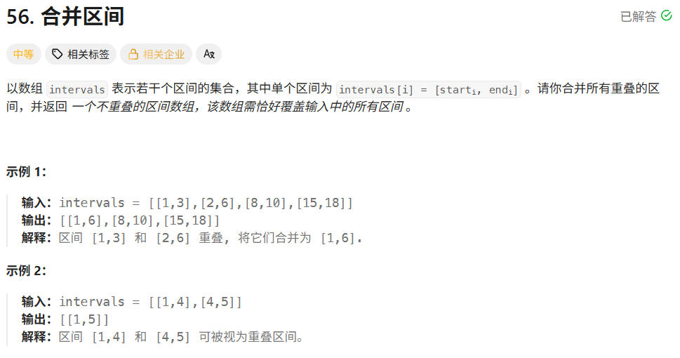

---

这道题目，记住一下怎么用，相关api以及二维数组怎么调整的某一个值。

- vector.back()，表示vector的最后一个元素。
- sort()排序二维数组是看第一个元素。

```c++
class Solution {
public:
    vector<vector<int>> merge(vector<vector<int>>& intervals) {
        vector<vector<int>> ans;
        int n = intervals.size();
        if (n==0) return ans;
        sort(intervals.begin(),intervals.end());
        for(int i = 0;i<n;i++) {
            if(i==0 || intervals[i][0]>ans.back()[1]) {
                ans.push_back({intervals[i][0],intervals[i][1]});
            }
            else {
                ans.back()[1] = max(ans.back()[1], intervals[i][1]);
            }
        }
        return ans;
    }
};
```


## 189.轮转数组

[189. 轮转数组 - 力扣（LeetCode）](https://leetcode.cn/problems/rotate-array/description/?envType=study-plan-v2&envId=top-100-liked)

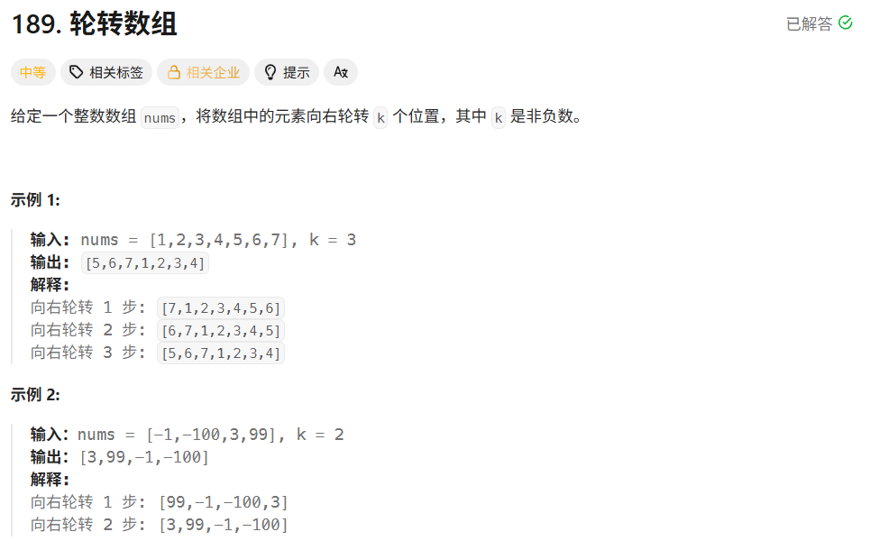

---

这道题目的最简单的做法应该是用一个新的数组存放轮转之后的数组了。

```cpp
class Solution {
public:
    void rotate(vector<int>& nums, int k) {
        int n = nums.size();
        vector<int> ans(n);
        k = k%n;
        for(int i = 0;i<n;i++) {
            if(i<n-k) {
                ans[i+k] = nums[i];
            }
            else {
                ans[i-(n-k)] = nums[i];
            }
        }
        nums = ans;
    }
};
```


## 238.除自身以外数组的乘积

[238. 除自身以外数组的乘积 - 力扣（LeetCode）](https://leetcode.cn/problems/product-of-array-except-self/?envType=study-plan-v2&envId=top-100-liked)

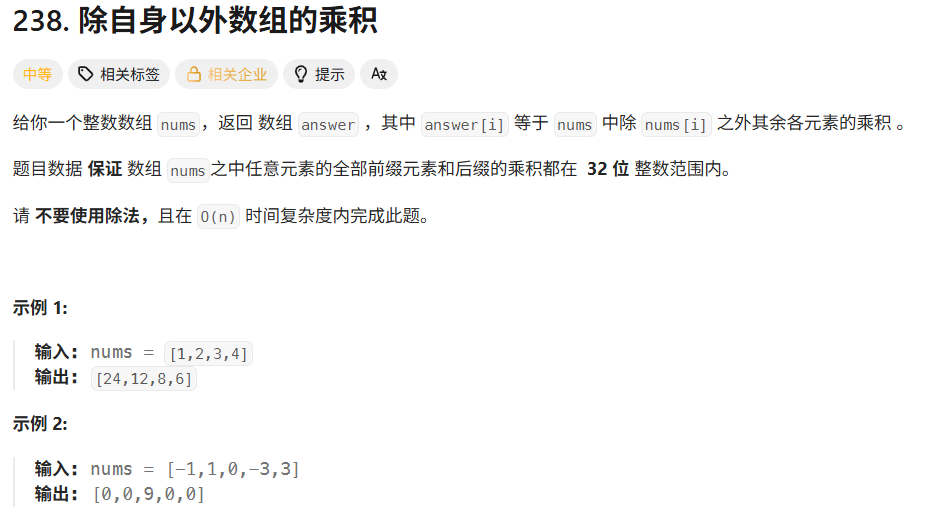

---

我操他妈的！！！

medium！！！

虽然是数组，但是！！！我他妈的，跟力扣官方的思路是一样的！！！！  我操他吗的！！！操操操

不过时间还是用的有点多啊，差不多一个小时了，用左右数组，思路15分钟左右想出来了，但是呢调试花了不少时间。

总结经验：

- vector在指定长度后，会初始化数组，此时数组全是0，如果用vector.back()时，是第n个元素而不是第1个。
- 如果不指定长度，不会初始化数组，需要push_back，不能用索引。

```cpp
class Solution {
public:
    vector<int> productExceptSelf(vector<int>& nums) {
        int n = nums.size();
        int tail = n-1; int head = 0;
        vector<int> head_v;
        vector<int> tail_v;
        for(int i = 0; i<n-1; i++) {
            if(i==0) {
                head_v.push_back(nums[i]);
            }
            else{
                head_v.push_back(head_v.back()*nums[i]);

            }
        }
        for(int j = n-1; j>0;j--) {
            if(j==n-1) {
                tail_v.push_back(nums[j]);
            }
            else{
                tail_v.push_back(tail_v.back()*nums[j]);

            }
        }
        vector<int> ans(n);
        for(int k = 0 ; k < n; k++) {
            if(k==0) {
                ans[k] = (tail_v[n-1-1]);
            }
            else if(k==n-1) {
                ans[k] = (head_v[n-1-1]);
            }
            else {
                ans[k] = (head_v[k-1]*tail_v[n-k-2]);

            }
        }
        return ans;
    }
};
```


# 矩阵

呜呜呜，矩阵好抽象，代码量好大、受不了了呜呜呜/(ㄒoㄒ)/~~

## 73.矩阵置零

[73. 矩阵置零 - 力扣（LeetCode）](https://leetcode.cn/problems/set-matrix-zeroes/description/?envType=study-plan-v2&envId=top-100-liked)

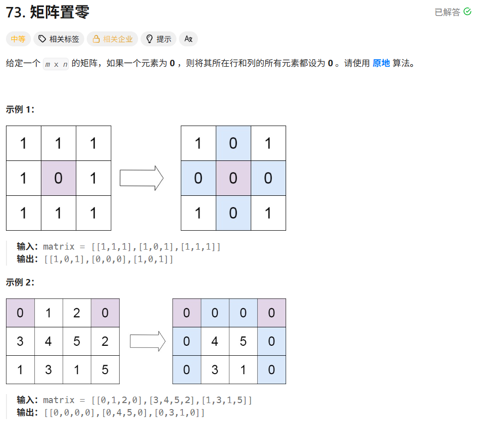

---

这道题，官方是使用的两个vector来记录某一行是不是0.

既然咱学了哈希表，那肯定得引用上啊：（其实并没有什么本质上的区别）

用两个vector（或set）来记录行列信息，而不是抽象的vector<int，int>,这后面还得索引。

```cpp
class Solution {
public:
    void setZeroes(vector<vector<int>>& matrix) {
        int m = matrix.size();
        int n = matrix[0].size();
        unordered_set<int> col;
        unordered_set<int> row;
        for(int i=0;i<m;i++) {
            for(int j=0;j<n;j++){
                if(matrix[i][j]==0) {
                    row.insert(i);
                    col.insert(j);
                }
            }
        }
        for(int i=0;i<m;i++) {
            for(int j=0;j<n;j++) {
                if(row.count(i) || col.count(j)) {
                    matrix[i][j] = 0;
                }
            }
        }
        
    }
};
```


# 链表


## 160.相交链表

[160. 相交链表 - 力扣（LeetCode）](https://leetcode.cn/problems/intersection-of-two-linked-lists/description/?envType=study-plan-v2&envId=top-100-liked)

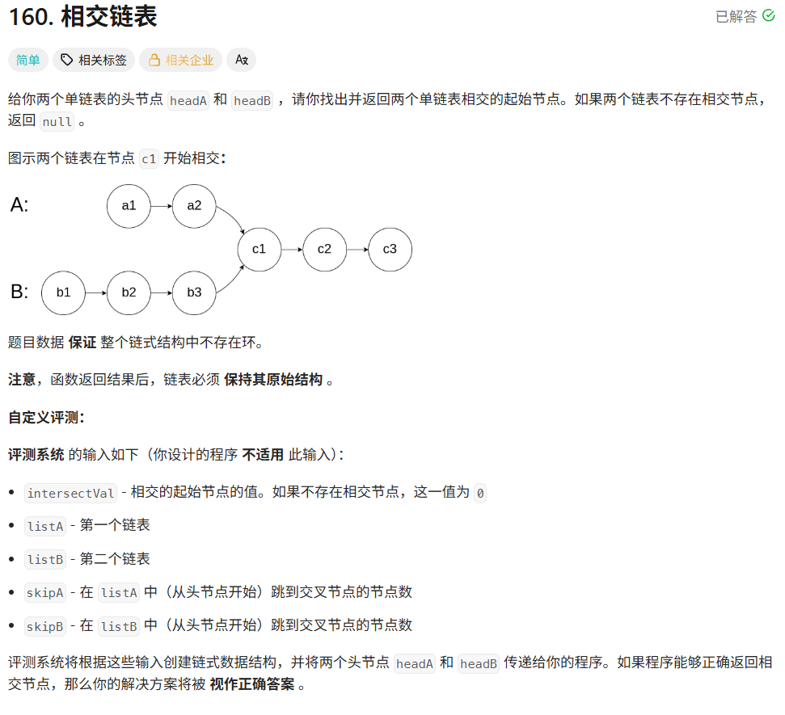

---

```cpp
/**
 * Definition for singly-linked list.
 * struct ListNode {
 *     int val;
 *     ListNode *next;
 *     ListNode(int x) : val(x), next(NULL) {}
 * };
 */
class Solution {
public:
    ListNode *getIntersectionNode(ListNode *headA, ListNode *headB) {
        ListNode *pa, *pb, *ans;
        pa = headA;
        pb = headB;
        unordered_set<ListNode*> node;
        while(pa) {
            node.insert(pa);
            pa = pa->next;
        }
        while(pb) {
            if(node.count(pb)){
                return pb;
            }
            pb = pb->next;
        }
        return nullptr;
        
    }
};			
```


## 206.反转链表

[206. 反转链表 - 力扣（LeetCode）](https://leetcode.cn/problems/reverse-linked-list/description/?envType=study-plan-v2&envId=top-100-liked)

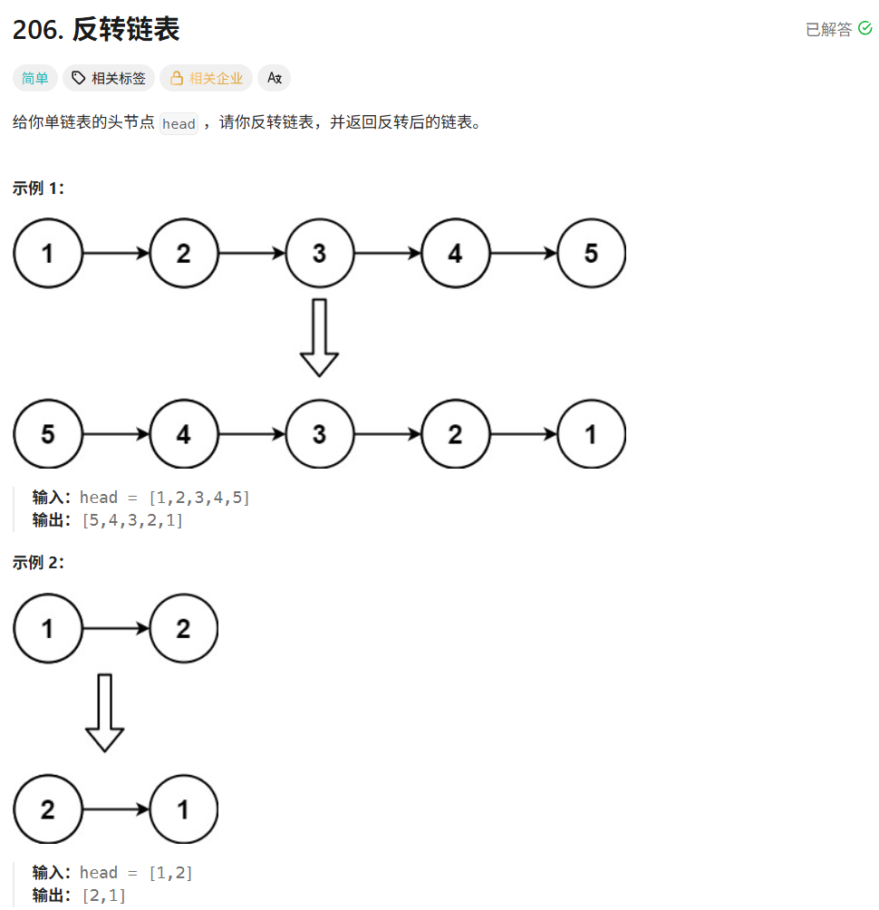

---

```cpp
/**
 * Definition for singly-linked list.
 * struct ListNode {
 *     int val;
 *     ListNode *next;
 *     ListNode() : val(0), next(nullptr) {}
 *     ListNode(int x) : val(x), next(nullptr) {}
 *     ListNode(int x, ListNode *next) : val(x), next(next) {}
 * };
 */
class Solution {
public:
    ListNode* reverseList(ListNode* head) {
        ListNode* cur = head;
        ListNode* pre = nullptr;
        while(cur) {
            ListNode* next_ = cur->next;
            cur->next = pre;
            pre = cur;
            cur = next_;
        }
        // return cur;
        return pre;
    }
};
```


## 234.回文链表

[234. 回文链表 - 力扣（LeetCode）](https://leetcode.cn/problems/palindrome-linked-list/?envType=study-plan-v2&envId=top-100-liked)

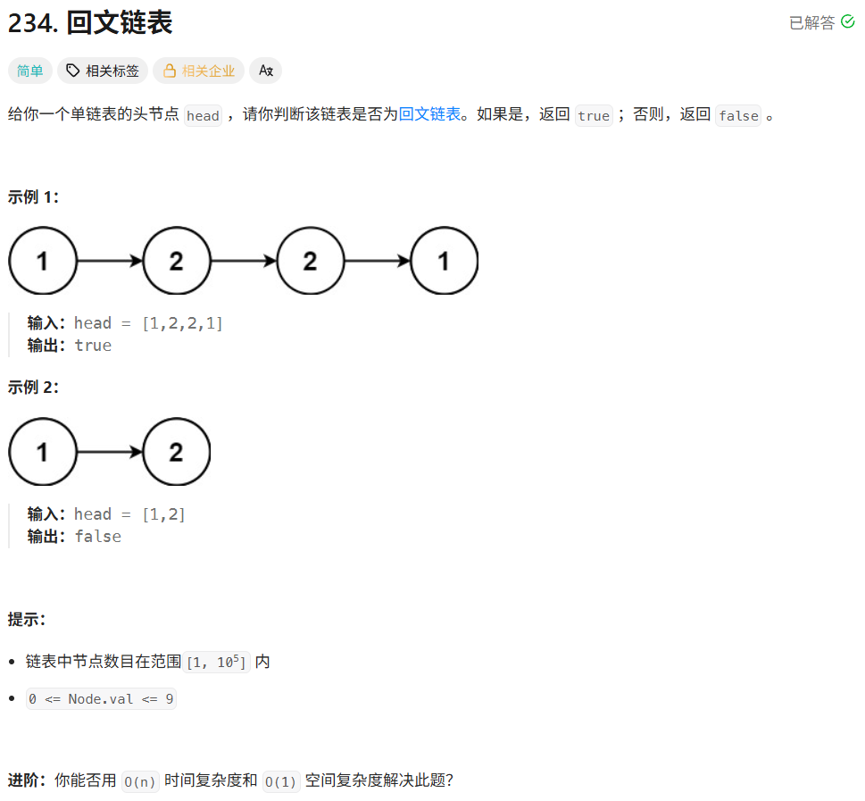

---

这道题在判断等式的时候，需要

```cpp
/**
 * Definition for singly-linked list.
 * struct ListNode {
 *     int val;
 *     ListNode *next;
 *     ListNode() : val(0), next(nullptr) {}
 *     ListNode(int x) : val(x), next(nullptr) {}
 *     ListNode(int x, ListNode *next) : val(x), next(next) {}
 * };
 */
class Solution {
public:
    bool isPalindrome(ListNode* head) {
        vector<ListNode*> node;
        ListNode* head1 = head;
        while(head) {
            node.push_back(head);
            head = head->next;
        }
        for(auto i = node.size()-1; i >=0 ; i--) {
            if(!head1) break;

            if(node[i]->val==head1->val) {
                head1 = head1->next;
            }
            else {
                return false;
            }
        }
        return true;

    }
};
```


## 141.环形链表

[141. 环形链表 - 力扣（LeetCode）](https://leetcode.cn/problems/linked-list-cycle/description/?envType=study-plan-v2&envId=top-100-liked)

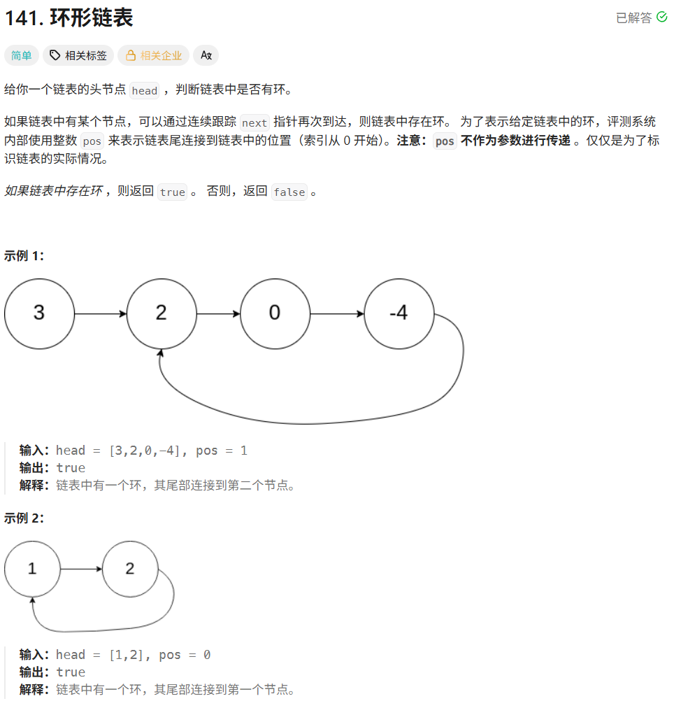

---

使用哈希表可以解决

```cpp
/**
 * Definition for singly-linked list.
 * struct ListNode {
 *     int val;
 *     ListNode *next;
 *     ListNode(int x) : val(x), next(NULL) {}
 * };
 */
class Solution {
public:
    bool hasCycle(ListNode *head) {
        ListNode* pre = head;
        unordered_set<ListNode*> node;
        while(pre) {
            if(node.count(pre)) {
                return true;
            }
            node.insert(pre);
            pre = pre->next;
        }
        return false;

        
    }
};
```


## 142.环形链表ii

[142. 环形链表 II - 力扣（LeetCode）](https://leetcode.cn/problems/linked-list-cycle-ii/description/?envType=study-plan-v2&envId=top-100-liked)


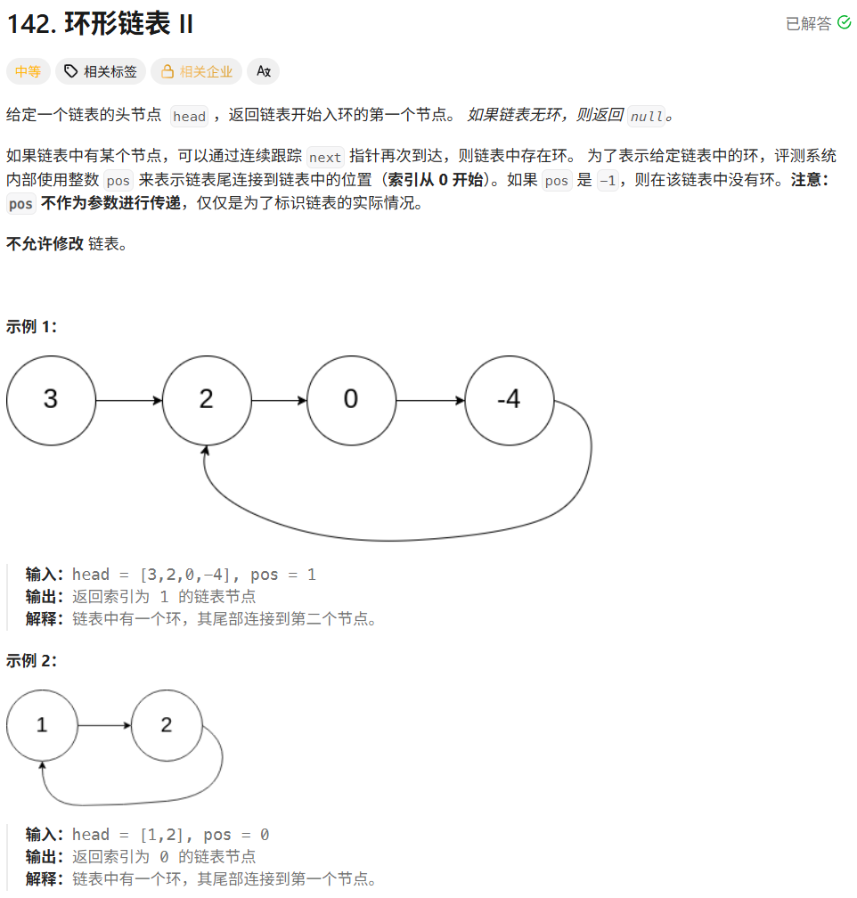

---

o（1）空间复杂度是用的快慢指针

```cpp
/**
 * Definition for singly-linked list.
 * struct ListNode {
 *     int val;
 *     ListNode *next;
 *     ListNode(int x) : val(x), next(NULL) {}
 * };
 */
class Solution {
public:
    ListNode *detectCycle(ListNode *head) {
        ListNode* pre = head;
        unordered_set<ListNode*> node;
        while(pre) {
            if(node.count(pre)) {
                return pre;
            }
            node.insert(pre);
            pre = pre->next;
        }
        return nullptr;
    }
};
```


## 21.合并两个有序链表

[21. 合并两个有序链表 - 力扣（LeetCode）](https://leetcode.cn/problems/merge-two-sorted-lists/description/?envType=study-plan-v2&envId=top-100-liked)

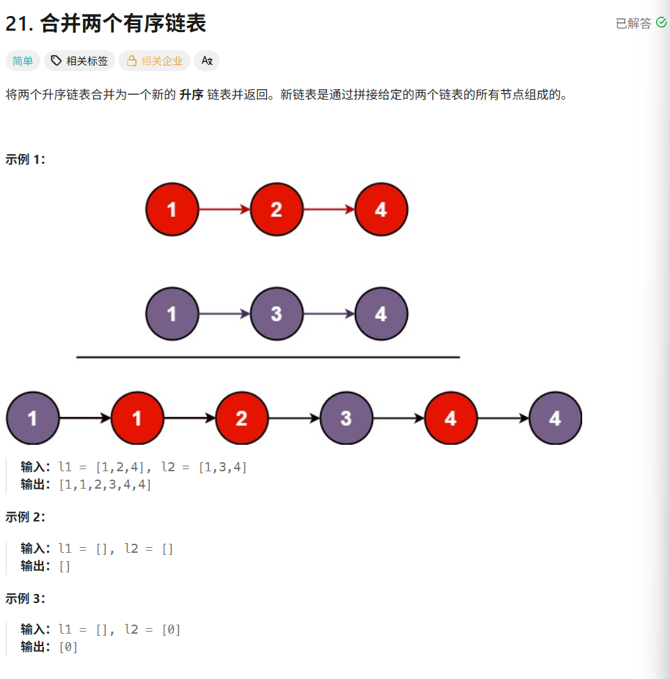

---

题目是使用了递归和迭代两种方法做的，既然是合并，肯定是先选个最小的，然后在两个链表上各有一个指针搁那移动，然后移着移着，就出结果了。

```c++
/**
 * Definition for singly-linked list.
 * struct ListNode {
 *     int val;
 *     ListNode *next;
 *     ListNode() : val(0), next(nullptr) {}
 *     ListNode(int x) : val(x), next(nullptr) {}
 *     ListNode(int x, ListNode *next) : val(x), next(next) {}
 * };
 */
class Solution {
public:
    ListNode* mergeTwoLists(ListNode* list1, ListNode* list2) {
        ListNode* iter ;
        ListNode* head ;
        ListNode* right ; ListNode* pre;
        if(list1 == nullptr) {
            return list2;
        }
        if(list2 == nullptr) {
            return list1;
        }
        if(list1->val > list2->val) {
            iter = list2;
            right = iter->next;
            pre = list1;
        }
        else {
            iter = list1;
            right = iter->next;
            pre = list2;
        }
        head = iter;
        if(right==nullptr) {
            iter->next = pre;
        }
        while(pre!=nullptr && right!=nullptr) {
            if(right->val > pre->val) {
                iter->next = pre;
                iter = iter->next;
                pre = pre->next;
            }
            else {
                iter->next = right;
                right = right->next;
                iter = iter->next;
            }
        }
        iter->next = right == nullptr ? pre : right;

        return head;
    }
}; 
```


## 2.两数相加

[2. 两数相加 - 力扣（LeetCode）](https://leetcode.cn/problems/add-two-numbers/description/?envType=study-plan-v2&envId=top-100-liked)

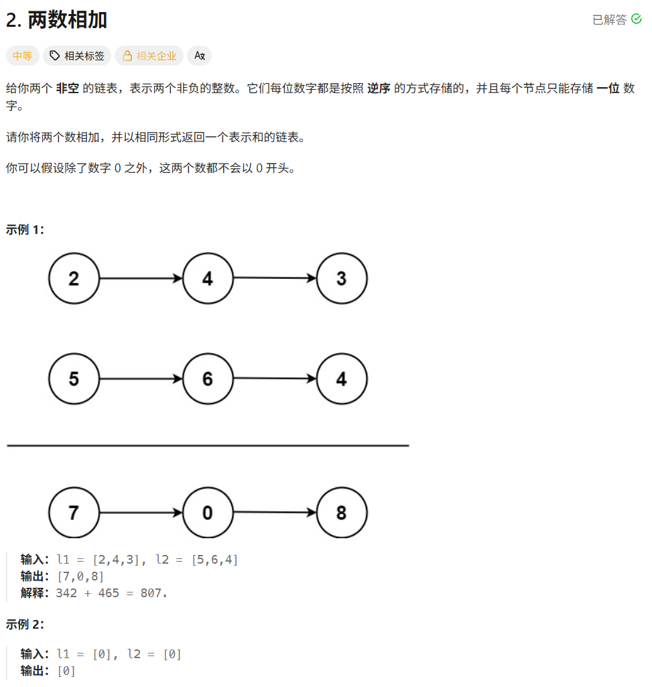

---

两数相加，写依托答辩

```cpp
/**
 * Definition for singly-linked list.
 * struct ListNode {
 *     int val;
 *     ListNode *next;
 *     ListNode() : val(0), next(nullptr) {}
 *     ListNode(int x) : val(x), next(nullptr) {}
 *     ListNode(int x, ListNode *next) : val(x), next(next) {}
 * };
 */
class Solution {
public:
    ListNode* addTwoNumbers(ListNode* l1, ListNode* l2) {
        // ListNode* ans = new ListNode(0);
        ListNode* ans,*head;
        int jinwei = 0, l1_len=0, l2_len = 0;
        ListNode* l1_h, *l2_h, *left, *temp;
        l1_h = l1; l2_h = l2;

        while(l1_h) {
            l1_len++;
            l1_h = l1_h->next;
        }
        while(l2_h) {
            l2_len++;
            l2_h = l2_h->next;
        }
        if(l1_len>l2_len) {
            head = l1;
            left = l2;
        }
        else {
            head = l2;
            left = l1;
        }
        ans = head;
        while (head) {
            int sum = left == nullptr ? head->val+jinwei : head->val+left->val+jinwei;
            head->val = sum % 10;
            jinwei = sum/10;
            if(head->next==nullptr) {
                temp = head;
            }
            head = head->next;

            if(left) {
                left = left->next;
            }

        }
        if(jinwei) {
            temp->next = new ListNode(1);
        }
        return ans;

    }
};
```


## 19.删除链表的倒数第N个结点

[19. 删除链表的倒数第 N 个结点 - 力扣（LeetCode）](https://leetcode.cn/problems/remove-nth-node-from-end-of-list/?envType=study-plan-v2&envId=top-100-liked)

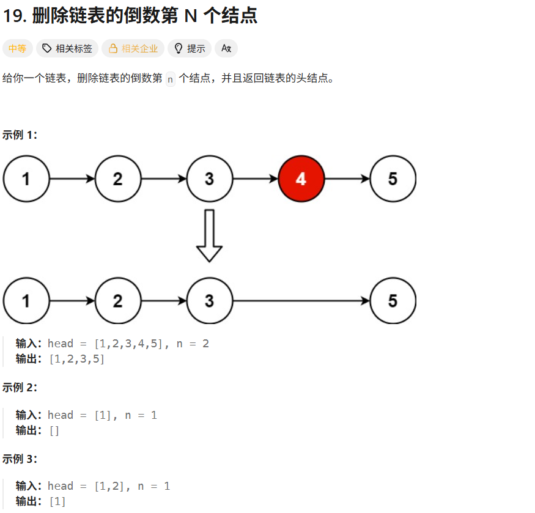

---

这道题就是弄一个窗口，然后让这个窗口滑动，一直到这个窗口碰到了链表的最后一个节点，但是要注意边界，就是如果是删除头节点的时候应该怎么做。

```cpp
/**
 * Definition for singly-linked list.
 * struct ListNode {
 *     int val;
 *     ListNode *next;
 *     ListNode() : val(0), next(nullptr) {}
 *     ListNode(int x) : val(x), next(nullptr) {}
 *     ListNode(int x, ListNode *next) : val(x), next(next) {}
 * };
 */
class Solution {
public:
    ListNode* removeNthFromEnd(ListNode* head, int n) {
        ListNode* head_, *right,*pre;
        head_ = head;right = head;
        pre = head_;
        for(int i=0; i<n-1; i++) {
            right = right->next;
        }
        while(right->next) {
            pre = head_;
            head_ = head_->next;
            right = right->next;
        }
        pre->next = head_->next;
        if(right==pre) {
            return nullptr;
        }
        if(pre == head_) {
            return head->next;
        }
        return head;
    } 
};
```


## 24.两两交换链表中的节点

[24. 两两交换链表中的节点 - 力扣（LeetCode）](https://leetcode.cn/problems/swap-nodes-in-pairs/description/?envType=study-plan-v2&envId=top-100-liked)

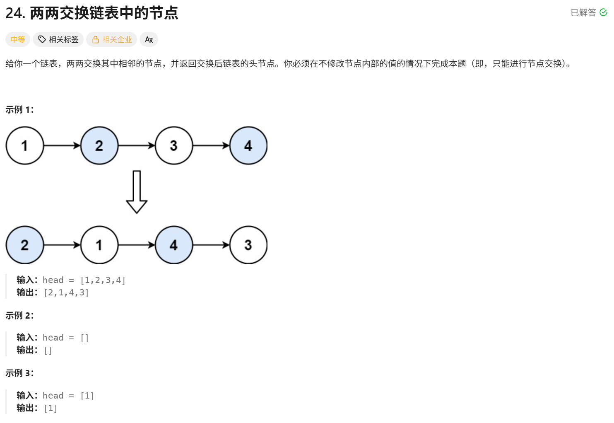

---

用了相当蠢的方法。

```cpp
/**
 * Definition for singly-linked list.
 * struct ListNode {
 *     int val;
 *     ListNode *next;
 *     ListNode() : val(0), next(nullptr) {}
 *     ListNode(int x) : val(x), next(nullptr) {}
 *     ListNode(int x, ListNode *next) : val(x), next(next) {}
 * };
 */
class Solution {
public:
    ListNode* swapPairs(ListNode* head) {
        ListNode* head_ = head;
        if(head == nullptr || head->next==nullptr) return head;

        vector<ListNode*> node;
        while(head_) {
            node.push_back(head_);
            head_ = head_->next;
        }

        for(int i=0;i<node.size()/2;i++) {
            auto n = node[2*i];
            node[2*i] = node[2*i+1];
            node[2*i+1] = n;
        }
    
        head = node[0];
        for(int i = 1; i< node.size();i++) {
            node[i-1]->next = node[i];
        }
        node[node.size()-1]->next = nullptr;
        
//        head = node[0];
//        for(int i = 0; i< node.size();i++) {
//            head_ = node[i];
//            head_ = head_->next;
//        }
        
        return head;
        
    }
};
```

其中，第35行到39行注释掉的部分是我第一次写的，可以发现问题：是根据原来节点的next进行赋值的，但是原来节点的next不一定是按照vector的顺序来的，而且会导致覆盖，所以要按照vector的顺序来赋值，也就是对vector的相邻两项来指定next。


## 138.随机链表的复制

[138. 随机链表的复制 - 力扣（LeetCode）](https://leetcode.cn/problems/copy-list-with-random-pointer/description/?envType=study-plan-v2&envId=top-100-liked)

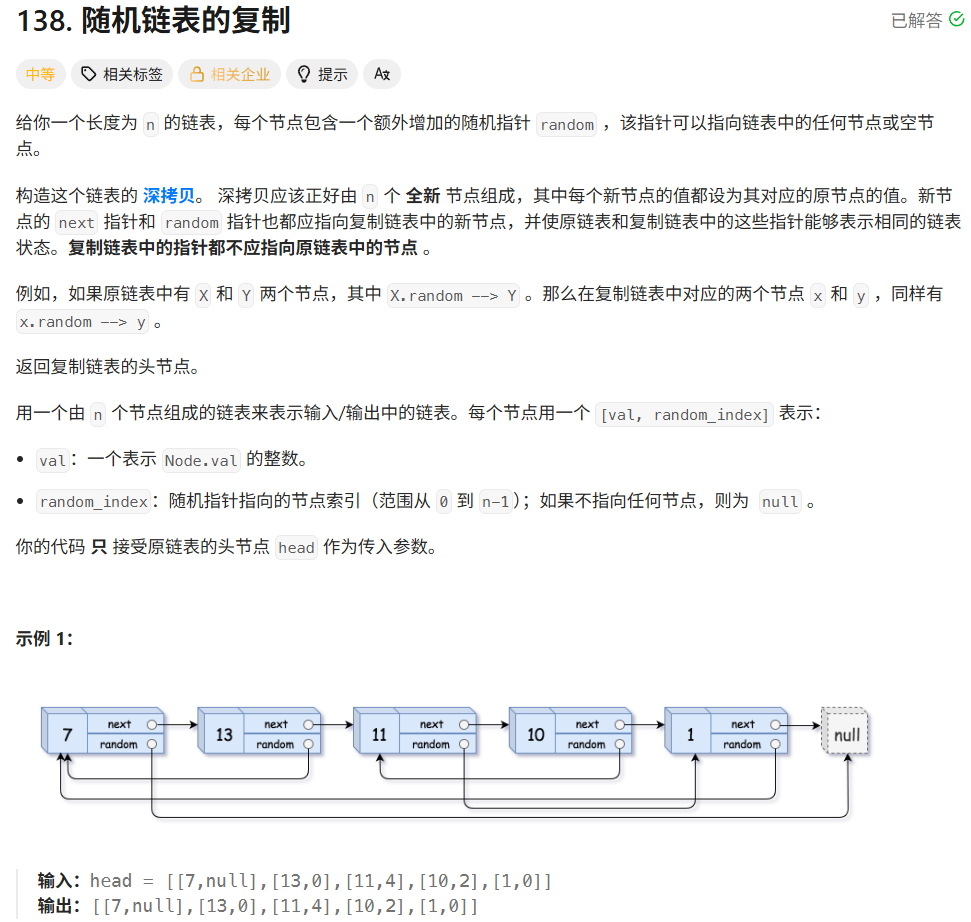

---

使用一个哈希表，然后遍历这个链表

```c++
/*
// Definition for a Node.
class Node {
public:
    int val;
    Node* next;
    Node* random;
    
    Node(int _val) {
        val = _val;
        next = NULL;
        random = NULL;
    }
};
*/

class Solution {
public:
    Node* copyRandomList(Node* head) {
        unordered_map<Node*, Node*> map_;
        Node* head_ori = head;
        while(head_ori) {
            map_[head_ori] = new Node(head_ori->val);
            head_ori = head_ori->next;

        }
        head_ori = head;
        while(head_ori) {
            // map_[head_ori]->val = head_ori->val;
            map_[head_ori]->next = map_[head_ori->next];
            map_[head_ori]->random = head_ori->random==nullptr ? nullptr:map_[head_ori->random];
            head_ori = head_ori->next;
        } 
        return map_[head];
    }
};
```


## 148.排序链表

[148. 排序链表 - 力扣（LeetCode）](https://leetcode.cn/problems/sort-list/description/?envType=study-plan-v2&envId=top-100-liked)

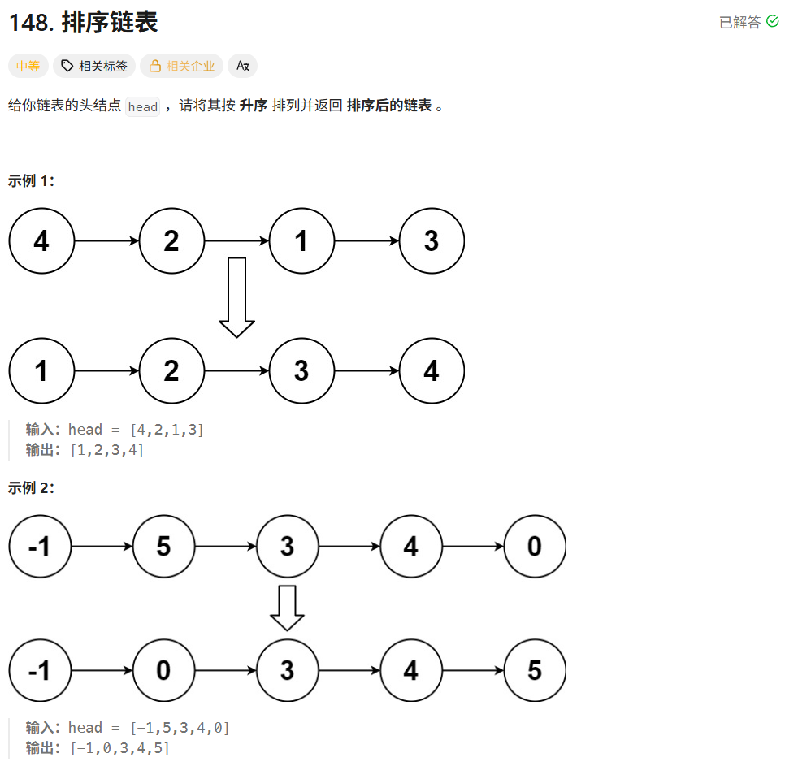

---

这道题目得重新刷啊！！！

```c++
/**
 * Definition for singly-linked list.
 * struct ListNode {
 *     int val;
 *     ListNode *next;
 *     ListNode() : val(0), next(nullptr) {}
 *     ListNode(int x) : val(x), next(nullptr) {}
 *     ListNode(int x, ListNode *next) : val(x), next(next) {}
 * };
 */
class Solution {
public:
    ListNode* sortList(ListNode* head) {
        ListNode* head_ = head,*r;
        vector<ListNode*> node;
        if(head_==nullptr) {
            return nullptr;
        }
        while(head_) {
            node.push_back(head_);
            head_ = head_->next;
        }
        sort(node.begin(),node.end(),[=](ListNode* left, ListNode* right){return left->val < right->val;});
        head_ = node[0];
        for(int i=0;i<node.size()-1;i++) {
            node[i]->next = node[i+1];
        }
        node[node.size()-1]->next = nullptr;
        return head_;
    }
};
```


# 二叉树

## 94.二叉树的中序遍历

[94. 二叉树的中序遍历 - 力扣（LeetCode）](https://leetcode.cn/problems/binary-tree-inorder-traversal/?envType=study-plan-v2&envId=top-100-liked)

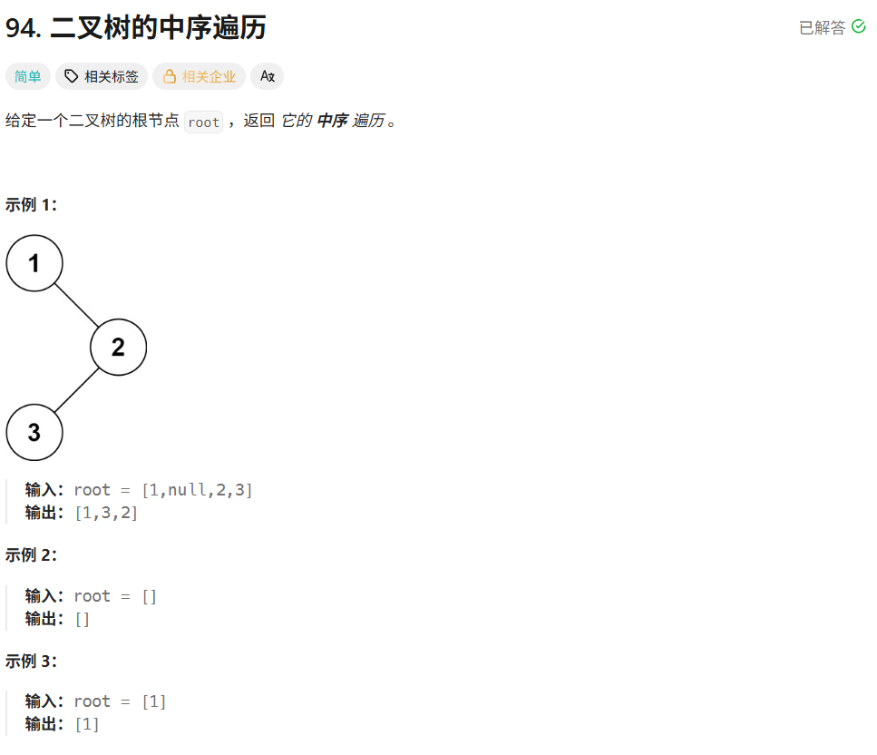


---

主要是遍历到头的时候，怎么判断返回值。

```c++
/**
 * Definition for a binary tree node.
 * struct TreeNode {
 *     int val;
 *     TreeNode *left;
 *     TreeNode *right;
 *     TreeNode() : val(0), left(nullptr), right(nullptr) {}
 *     TreeNode(int x) : val(x), left(nullptr), right(nullptr) {}
 *     TreeNode(int x, TreeNode *left, TreeNode *right) : val(x), left(left), right(right) {}
 * };
 */
class Solution {
public:
    vector<int> ans;
    vector<int> inorderTraversal(TreeNode* root) {
        if(root == nullptr) return ans;
        inorderTraversal(root->left);
        if(root) ans.push_back(root->val);
        inorderTraversal(root->right);
        return ans;
    }
};
```


## 104.二叉树的最大深度

[104. 二叉树的最大深度 - 力扣（LeetCode）](https://leetcode.cn/problems/maximum-depth-of-binary-tree/?envType=study-plan-v2&envId=top-100-liked)

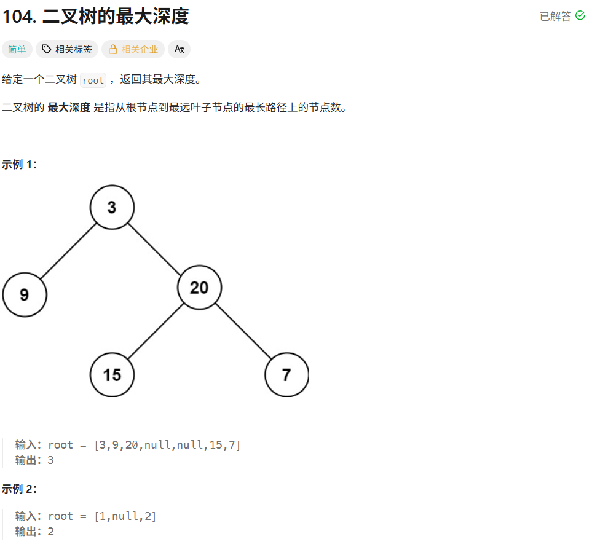

---

这道题，本科的时候学过了，忘了怎么做了，记住！

```cpp
/**
 * Definition for a binary tree node.
 * struct TreeNode {
 *     int val;
 *     TreeNode *left;
 *     TreeNode *right;
 *     TreeNode() : val(0), left(nullptr), right(nullptr) {}
 *     TreeNode(int x) : val(x), left(nullptr), right(nullptr) {}
 *     TreeNode(int x, TreeNode *left, TreeNode *right) : val(x), left(left), right(right) {}
 * };
 */
class Solution {
public:
    int maxDepth(TreeNode* root) {
        int max_,l,r;
        if(root) {
            l = maxDepth(root->left);
            r = maxDepth(root->right);
            max_ = l>r ? l:r;
            return (max_+1);
        }
        else {
            return 0;
        }
    }
};
```


## 226.翻转二叉树

[226. 翻转二叉树 - 力扣（LeetCode）](https://leetcode.cn/problems/invert-binary-tree/description/?envType=study-plan-v2&envId=top-100-liked)

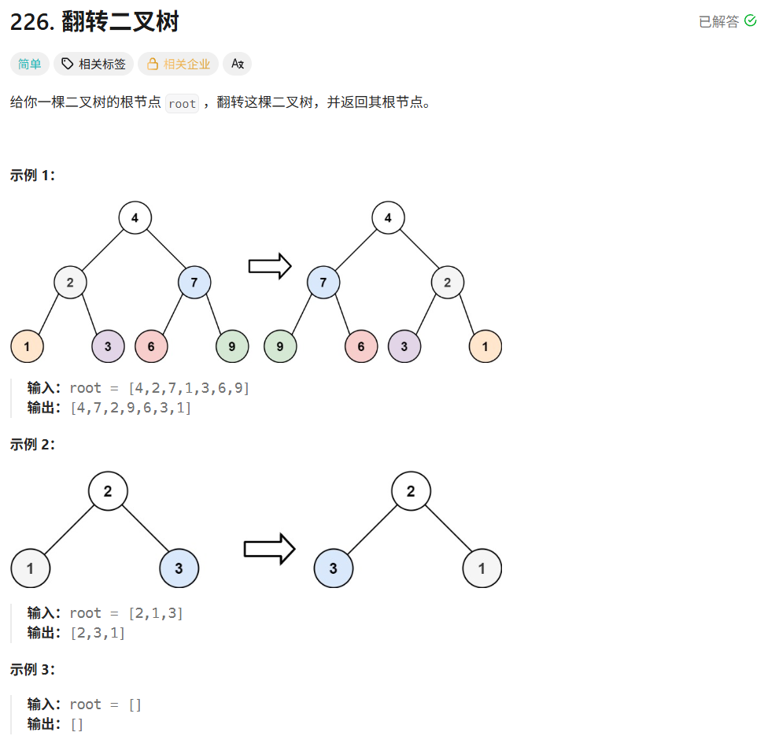

---

这道题我竟然又做出来了，但是是个easy啊，不要涨包！

```cpp
/**
 * Definition for a binary tree node.
 * struct TreeNode {
 *     int val;
 *     TreeNode *left;
 *     TreeNode *right;
 *     TreeNode() : val(0), left(nullptr), right(nullptr) {}
 *     TreeNode(int x) : val(x), left(nullptr), right(nullptr) {}
 *     TreeNode(int x, TreeNode *left, TreeNode *right) : val(x), left(left), right(right) {}
 * };
 */
class Solution {
public:
    TreeNode* invertTree(TreeNode* root) {
        if(root==nullptr) return nullptr;
        auto temp = root->right;
        root->right = root->left;
        root->left = temp;

        invertTree(root->left);
        invertTree(root->right);

        return root;
    }
};
```


## 101.对称二叉树

[101. 对称二叉树 - 力扣（LeetCode）](https://leetcode.cn/problems/symmetric-tree/description/?envType=study-plan-v2&envId=top-100-liked)

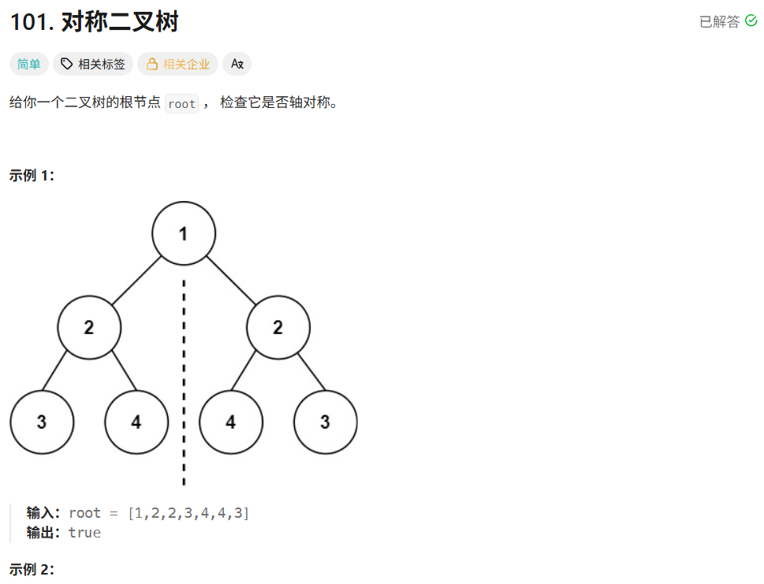

---

这道题没想出来，先看的官方的题解，然后默写了一遍。。。

```cpp
/**
 * Definition for a binary tree node.
 * struct TreeNode {
 *     int val;
 *     TreeNode *left;
 *     TreeNode *right;
 *     TreeNode() : val(0), left(nullptr), right(nullptr) {}
 *     TreeNode(int x) : val(x), left(nullptr), right(nullptr) {}
 *     TreeNode(int x, TreeNode *left, TreeNode *right) : val(x), left(left), right(right) {}
 * };
 */
class Solution {
public:
    bool check(TreeNode* p, TreeNode* q) {
        if(p==nullptr && q == nullptr) return true;
        if(!p || !q) return false;
        return p->val == q->val && check(p->left,q->right) && check(p->right,q->left);
    }

    bool isSymmetric(TreeNode* root) {
        return check(root->left,root->right);
    }
};
```


## 543.二叉树的直径

[543. 二叉树的直径 - 力扣（LeetCode）](https://leetcode.cn/problems/diameter-of-binary-tree/description/?envType=study-plan-v2&envId=top-100-liked)

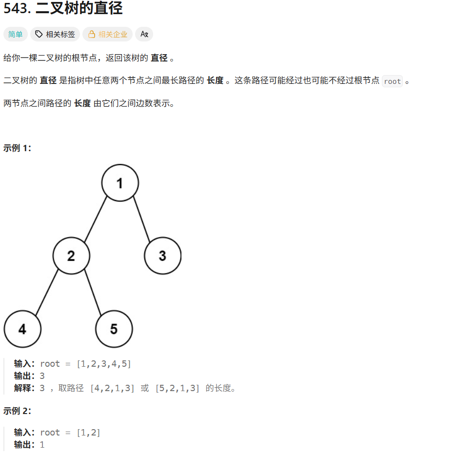

---

呃，再一次在递归上败下阵来。。

这道题解决的时候先复习下怎么求二叉树的深度：

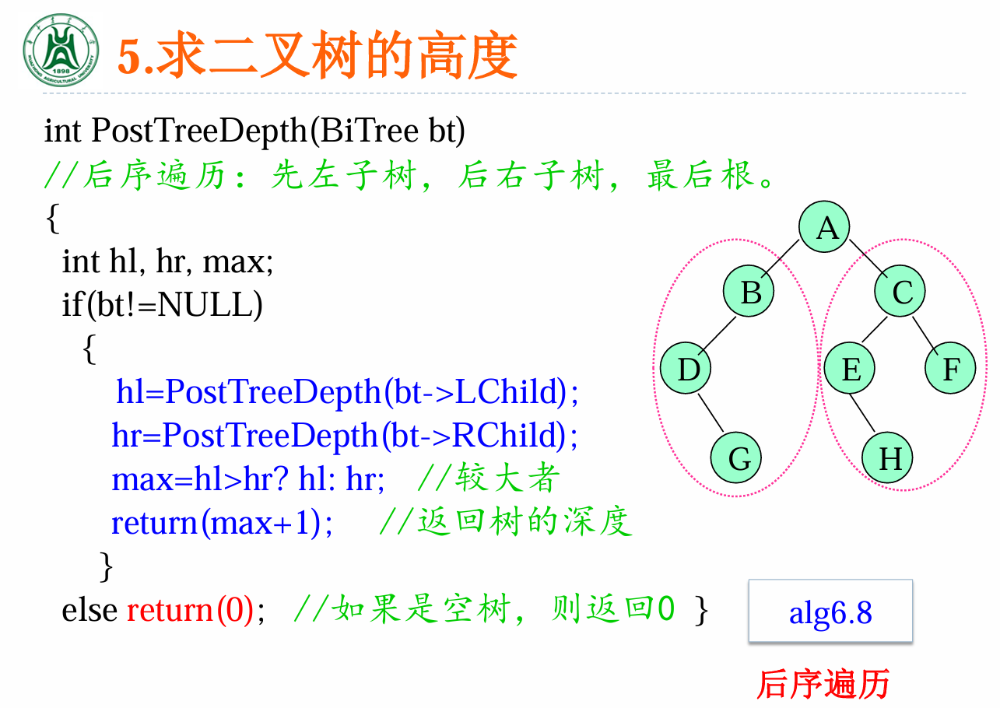

可以看到递归函数中包含了 left、right、root节点，也就是一个后序遍历，既然是遍历那么肯定会扫描到每个节点，这样就可以在left、right之后定义每个节点处执行函数的行为：

- 先求出左右节点的深度，那么该节点的深度就是两者最大值。

- 因为是遍历了每一个节点，题目说明最长路径可能不会经过root节点，那么每个遍历的节点都有可能是最大路径的根节点，也就是每个节点遍历的时候都要更新一下最大节点数。

```cpp
/**
 * Definition for a binary tree node.
 * struct TreeNode {
 *     int val;
 *     TreeNode *left;
 *     TreeNode *right;
 *     TreeNode() : val(0), left(nullptr), right(nullptr) {}
 *     TreeNode(int x) : val(x), left(nullptr), right(nullptr) {}
 *     TreeNode(int x, TreeNode *left, TreeNode *right) : val(x), left(left), right(right) {}
 * };
 */
class Solution {
public:
    int ans;
    int depth(TreeNode* rt) {
        if (rt == nullptr) return 0;
        int l = depth(rt->left);
        int r = depth(rt->right);
        int max_dep = max(l,r)+1;
        // ans = max(ans,max_dep);
        ans = max(ans,l+r+1);
        return max_dep;
    }
    int diameterOfBinaryTree(TreeNode* root) {
        ans = 1;
        depth(root);
        return ans-1;
        
    }
};
```


## 102.二叉树的层序遍历

[102. 二叉树的层序遍历 - 力扣（LeetCode）](https://leetcode.cn/problems/binary-tree-level-order-traversal/description/?envType=study-plan-v2&envId=top-100-liked)

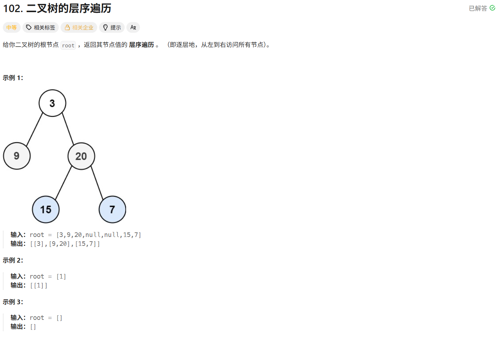

---

思路是有的，就是根据每一层的深度来往vector中pushback，但是当时没考虑清楚怎么给空的vector扩容：

```cpp
/**
 * Definition for a binary tree node.
 * struct TreeNode {
 *     int val;
 *     TreeNode *left;
 *     TreeNode *right;
 *     TreeNode() : val(0), left(nullptr), right(nullptr) {}
 *     TreeNode(int x) : val(x), left(nullptr), right(nullptr) {}
 *     TreeNode(int x, TreeNode *left, TreeNode *right) : val(x), left(left), right(right) {}
 * };
 */
class Solution {
public:
    void pre(TreeNode* rt, vector<vector<int>>& vec, int depth) {
        if(rt == nullptr) return ;
        if(depth > vec.size()) {
            vec.push_back({});
        }
        vec[depth-1].push_back(rt->val);

        pre(rt->left, vec, depth+1);
        pre(rt->right, vec, depth+1);
    }
    vector<vector<int>> levelOrder(TreeNode* root) {
        vector<vector<int>> ans;
        pre(root,ans,1);
        return ans;
    }
};
```


## 108.将有序数组转换为二叉搜索树

[108. 将有序数组转换为二叉搜索树 - 力扣（LeetCode）](https://leetcode.cn/problems/convert-sorted-array-to-binary-search-tree/?envType=study-plan-v2&envId=top-100-liked)

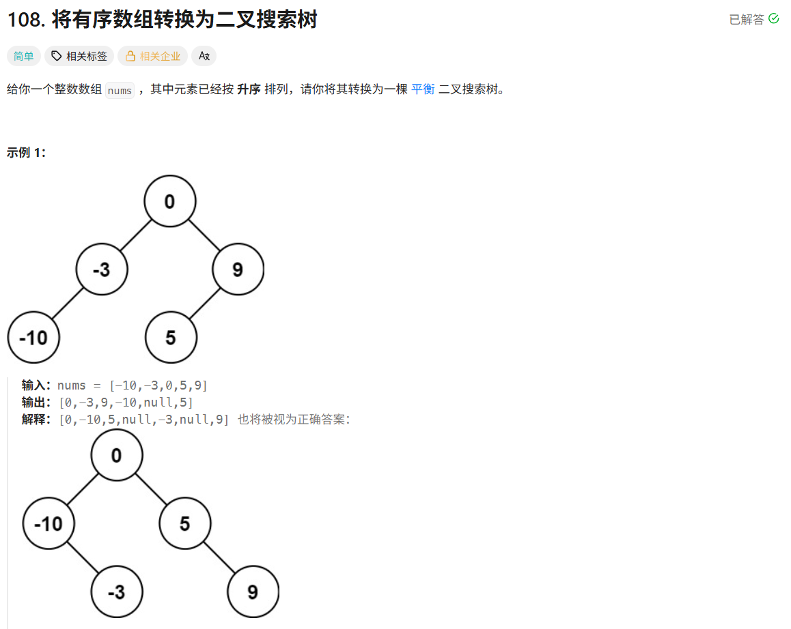

---

背吧背吧，背的leetcode没了新题，你就牛逼了！

```cpp
/**
 * Definition for a binary tree node.
 * struct TreeNode {
 *     int val;
 *     TreeNode *left;
 *     TreeNode *right;
 *     TreeNode() : val(0), left(nullptr), right(nullptr) {}
 *     TreeNode(int x) : val(x), left(nullptr), right(nullptr) {}
 *     TreeNode(int x, TreeNode *left, TreeNode *right) : val(x), left(left), right(right) {}
 * };
 */
class Solution {
public:
    TreeNode* pre(vector<int>& nums, int left, int right){
        if(left>right) return nullptr;
        if((right>nums.size()-1) || (left<0)) return nullptr; 
        
        int mid = (left+right)/2;
        TreeNode* root = new TreeNode(nums[mid]);
        
        root->left = pre(nums,left,mid-1);
        root->right = pre(nums,mid+1,right);

        return root;

    }
    TreeNode* sortedArrayToBST(vector<int>& nums) {
        TreeNode* root = pre(nums,0,nums.size()-1);
        return root;
    }
};
```


## 98.验证二叉搜索树

[98. 验证二叉搜索树 - 力扣（LeetCode）](https://leetcode.cn/problems/validate-binary-search-tree/description/?envType=study-plan-v2&envId=top-100-liked)

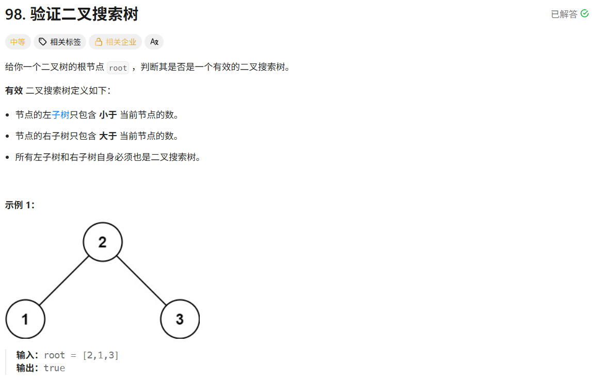

---

做了差不多50分钟，这个速度看起来还行？

但是写出来的是依托shit，时间复杂度还好是o(n)但是空间复杂度就有点shit了

```c++
/**
 * Definition for a binary tree node.
 * struct TreeNode {
 *     int val;
 *     TreeNode *left;
 *     TreeNode *right;
 *     TreeNode() : val(0), left(nullptr), right(nullptr) {}
 *     TreeNode(int x) : val(x), left(nullptr), right(nullptr) {}
 *     TreeNode(int x, TreeNode *left, TreeNode *right) : val(x), left(left), right(right) {}
 * };
 */
class Solution {
public:
    bool is_valid = true;
    vector<int> check(TreeNode* rt) {
        if(rt==nullptr) return {};
        vector<int> re = {rt->val,rt->val};
        auto range_left = check(rt->left);
        auto range_right = check(rt->right);

        if((range_left.size()==0)&&(range_right.size()==0)) return re;
        if(range_left.size()!=0) {
            if(range_left[1]>=rt->val) is_valid = false;
            if(rt->left) re[0] = min(re[0],range_left[0]);
        }
        if(range_right.size()!=0) {
            if(range_right[0]<=rt->val) is_valid = false;
            if(rt->right) re[1] = max(re[1],range_right[1]);
        }
        return re;
    }

    bool isValidBST(TreeNode* root) {
        check(root);
        return is_valid;
        
    }
};
```


## 230.二叉搜索树中第K小的元素

[230. 二叉搜索树中第 K 小的元素 - 力扣（LeetCode）](https://leetcode.cn/problems/kth-smallest-element-in-a-bst/description/?envType=study-plan-v2&envId=top-100-liked)

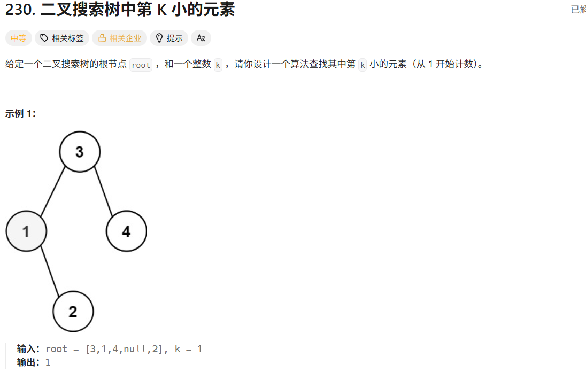

---

这道题应用了c++的类成员变量。

因为递归是单线程的，所以对同一个对象没有竞争关系。

所以放心的 用全局变量来表示每个节点的id。

```c++
/**
 * Definition for a binary tree node.
 * struct TreeNode {
 *     int val;
 *     TreeNode *left;
 *     TreeNode *right;
 *     TreeNode() : val(0), left(nullptr), right(nullptr) {}
 *     TreeNode(int x) : val(x), left(nullptr), right(nullptr) {}
 *     TreeNode(int x, TreeNode *left, TreeNode *right) : val(x), left(left), right(right) {}
 * };
 */
class Solution {
public:
    int small;
    int id = 0;
    void check(TreeNode* rt, int k) {
        if(rt==nullptr) return ;
        check(rt->left, k);
        id++;
        if(id == k) {
            small = rt->val;
        }
        check(rt->right, k);
        return ;
    }
    int kthSmallest(TreeNode* root, int k) {
        check(root,k);
        return small;
    }
};
```


## 199.二叉树的右视图

[199. 二叉树的右视图 - 力扣（LeetCode）](https://leetcode.cn/problems/binary-tree-right-side-view/description/?envType=study-plan-v2&envId=top-100-liked)

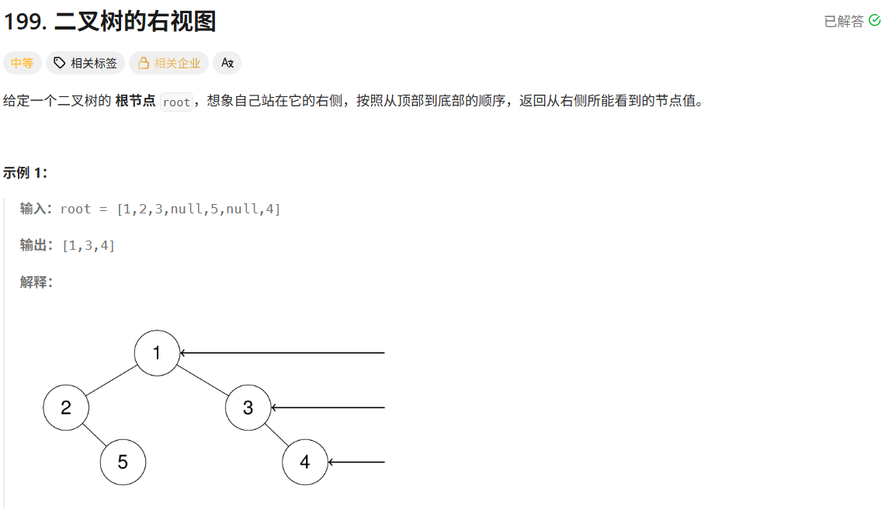

---

差不多用了half an hour。。。

这道题我的做法是在层序遍历的基础上，取每一层遍历的最后一个值，但是这样带来的结果就是：比较耗时。

**还有一点需要注意：vector.size()返回的是size_t类型，这是一个无符号整型，最小值是0，如果-1会boom，得到一个很大的值。**

```cpp
/**
 * Definition for a binary tree node.
 * struct TreeNode {
 *     int val;
 *     TreeNode *left;
 *     TreeNode *right;
 *     TreeNode() : val(0), left(nullptr), right(nullptr) {}
 *     TreeNode(int x) : val(x), left(nullptr), right(nullptr) {}
 *     TreeNode(int x, TreeNode *left, TreeNode *right) : val(x), left(left), right(right) {}
 * };
 */
class Solution {
public:
    void pre(TreeNode* root, vector<vector<int>>& vec, int depth) {
        if(root == nullptr) return;
        if(vec.size()<depth+1) vec.push_back({});
        vec[depth].push_back(root->val);

        pre(root->left, vec, depth+1);
        pre(root->right, vec, depth+1);
    }
    vector<int> rightSideView(TreeNode* root) {
        vector<vector<int>> vec;
        vector<int> ans;
        pre(root, vec, 0);
        for(int i=0;i<vec.size();i++) {
            auto iter = vec[i];
            if(iter.size()>0) {
                ans.push_back(iter[iter.size()-1]);
            }
        }
        return ans;
    }
};
```


## 114.二叉树展开为链表

[114. 二叉树展开为链表 - 力扣（LeetCode）](https://leetcode.cn/problems/flatten-binary-tree-to-linked-list/description/?envType=study-plan-v2&envId=top-100-liked)

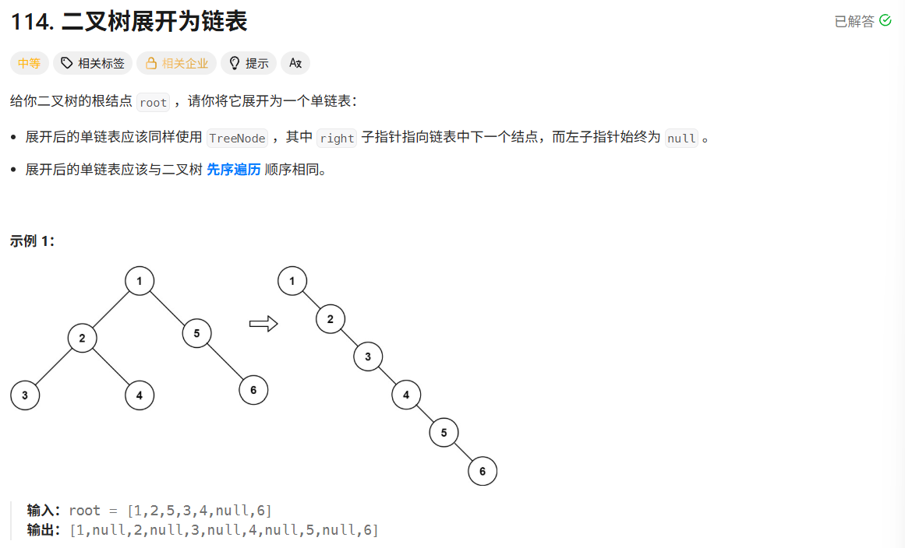

---

这道题有两个点忽略了：

- 首先是最后链表的左节点要置空，我刚看到题目的时候其实有这个想法，但是既然是直接在root上更改，还是二叉树，没必要了不是？但是在力扣上是会报错的。。。
- 然后是老生常谈的问题：vector返回的是size_t，他妈的如果是0是不能减1的！！！
- 时间：on，空间on。题解是原地求解的

```cpp
/**
 * Definition for a binary tree node.
 * struct TreeNode {
 *     int val;
 *     TreeNode *left;
 *     TreeNode *right;
 *     TreeNode() : val(0), left(nullptr), right(nullptr) {}
 *     TreeNode(int x) : val(x), left(nullptr), right(nullptr) {}
 *     TreeNode(int x, TreeNode *left, TreeNode *right) : val(x), left(left), right(right) {}
 * };
 */
class Solution {
public:
    vector<TreeNode*> vec;
    void pre(TreeNode* rt) {
        if(rt == nullptr) return;
        vec.push_back(rt);

        pre(rt->left);
        pre(rt->right);
    }
    void flatten(TreeNode* root) {
        pre(root);
        for(int i = 0; i+1<vec.size(); i++) {
            vec[i]->right = vec[i+1];
            vec[i]->left = nullptr;
        }
    }
};
```


## 105.从前序与中序遍历序列构造二叉树

[105. 从前序与中序遍历序列构造二叉树 - 力扣（LeetCode）](https://leetcode.cn/problems/construct-binary-tree-from-preorder-and-inorder-traversal/description/?envType=study-plan-v2&envId=top-100-liked)

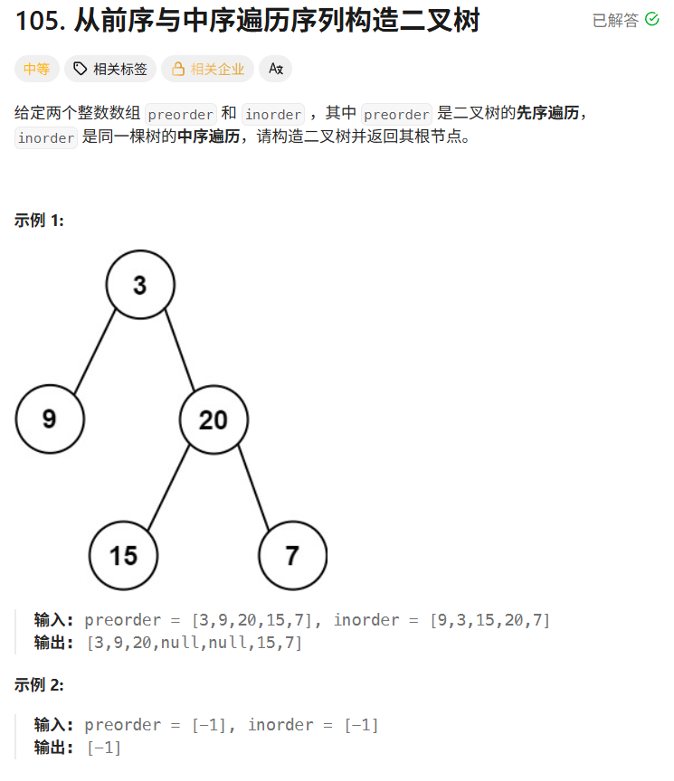

---

卧槽我觉得这道题是真的有点难，可能是第一次做没有经验吧，光是看题解就花了很长的时间。

```cpp
/**
 * Definition for a binary tree node.
 * struct TreeNode {
 *     int val;
 *     TreeNode *left;
 *     TreeNode *right;
 *     TreeNode() : val(0), left(nullptr), right(nullptr) {}
 *     TreeNode(int x) : val(x), left(nullptr), right(nullptr) {}
 *     TreeNode(int x, TreeNode *left, TreeNode *right) : val(x), left(left), right(right) {}
 * };
 */
class Solution {
public:
    unordered_map<int, int> map_;
    TreeNode* buildt(vector<int>& preorder, vector<int>& inorder, int pre_left, int pre_right, int in_left, int in_right) {
        if(pre_left>pre_right) return nullptr;
        if(in_left>in_right) return nullptr;
        int in_root = map_[preorder[pre_left]];
        TreeNode* rt = new TreeNode(preorder[pre_left]);
        int left_size = in_root - in_left;
        rt->left = buildt(preorder, inorder, pre_left+1, pre_left+left_size, in_left, in_root-1);
        rt->right = buildt(preorder, inorder, pre_left+left_size+1, pre_right, in_root+1, in_right);
        return rt;
    }
    TreeNode* buildTree(vector<int>& preorder, vector<int>& inorder) {
       for(int i=0; i<inorder.size();i++) {
            map_[inorder[i]] = i;
       } 
       int n = inorder.size();
       return buildt(preorder, inorder, 0, n-1, 0, n-1);

    }
};
```

- 用自己的话说，这道题就是在两个vector中，分别用两个双指针来框选左右节点在先序、中序中的范围；然后通过一个根节点的映射map来连接先序和中序。

- 首先，构造一个哈希表map来寻找中序root。在pre中，最先取出来的肯定是根节点，然后找in中的根节点位置，并构造。这样就可以确定此时根节点左子树的数目

- 根节点的左：递归调用，同时框选范围，

  1. 在pre中为[pre左指针+1，pre的root（pre的左指针）+左边叶子数]，pre左指针现在是root节点，这里的右边界为什么是pre的root+叶子树呢？为什么没加1？因为从root开始+叶子树是不包含根节点的；

  2. 同时确定在in中的左节点范围[in的左指针，in中root-1]

- 根节点的右：递归调用，框选范围。

  1. 在pre中为[pre的root+左边叶子数+1，pre的右指针（既然是先序，右指针指向边界）]

  2. 在in中为[in中root+1，in的右指针（右节点总是最后遍历，所以指向边界）]


## 437.路径总和 III

[437. 路径总和 III - 力扣（LeetCode）](https://leetcode.cn/problems/path-sum-iii/description/?envType=study-plan-v2&envId=top-100-liked)

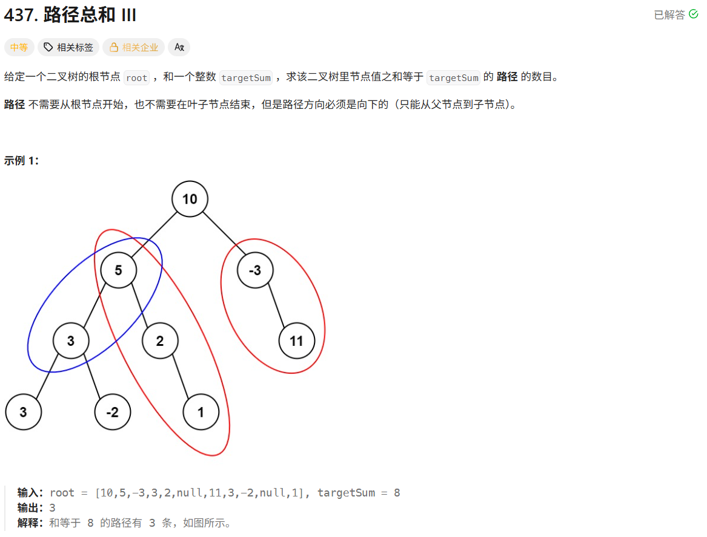

---

这道题是利用了两个递归函数：

- 一个是遍历以该节点为root时，出现的所有满足情况的路径和
- 一个是遍历所有的节点，前序遍历；每个节点执行第一个递归函数，找到所有的和

```cpp
/**
 * Definition for a binary tree node.
 * struct TreeNode {
 *     int val;
 *     TreeNode *left;
 *     TreeNode *right;
 *     TreeNode() : val(0), left(nullptr), right(nullptr) {}
 *     TreeNode(int x) : val(x), left(nullptr), right(nullptr) {}
 *     TreeNode(int x, TreeNode *left, TreeNode *right) : val(x), left(left), right(right) {}
 * };
 */
class Solution {
public:
    int rootSum(TreeNode* rt, long targetSum) {
        if(rt == nullptr) return 0;

        int sum = 0;
        // if(rt->val == targetSum) return sum++;
        // if(rt->val == targetSum) return ++sum;
        if(rt->val == targetSum) sum++;

        sum += rootSum(rt->left, targetSum-rt->val);
        sum += rootSum(rt->right, targetSum-rt->val);
        return sum;
    }
    int pathSum(TreeNode* root, long targetSum) {
        if(root == nullptr) return 0;

        int sum = rootSum(root, targetSum);
        sum += pathSum(root->left, targetSum);
        sum += pathSum(root->right, targetSum); 
        return sum;
    }
};
```

主要有两点没有注意：

- 在18、19行中，sum++返回的是sum，因为先执行return然后再执行++
- 在19、20行中，++sum跟返回1没有区别，但是执行了return之后，后面的就不会执行了，如果后面子节点有0或者是相加等于0的情况就会被忽略。


## 236.二叉树的最近公共祖先

[236. 二叉树的最近公共祖先 - 力扣（LeetCode）](https://leetcode.cn/problems/lowest-common-ancestor-of-a-binary-tree/description/?envType=study-plan-v2&envId=top-100-liked)

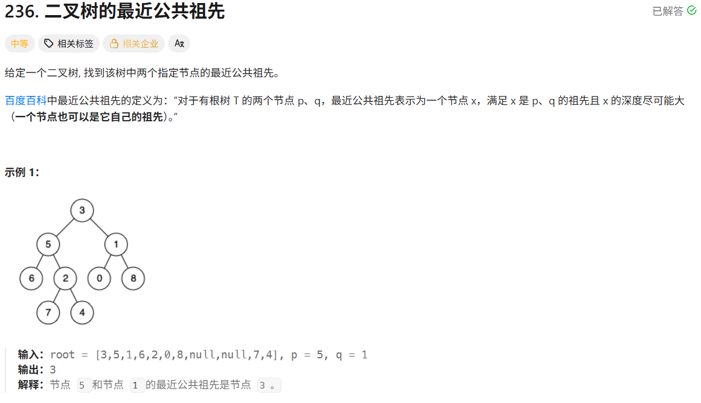

---

这道题主要是需要注意三点：

- 满足条件情况1：两个节点一个为父节点、一个为子节点
- 满足条件情况2：两个节点在一个根节点的左右节点
- 满足这两个条件中的一个，就可以保证是最深的

```
/**
 * Definition for a binary tree node.
 * struct TreeNode {
 *     int val;
 *     TreeNode *left;
 *     TreeNode *right;
 *     TreeNode(int x) : val(x), left(NULL), right(NULL) {}
 * };
 */
class Solution {
    TreeNode* parent = nullptr;
public:
    bool after(TreeNode* rt, TreeNode* p, TreeNode* q) {
        if(rt == nullptr) return false;
        
        bool flag1 = after(rt->left, p, q);
        bool flag2 = after(rt->right, p, q);

        if(((rt == p || rt ==q)&&(flag1 || flag2)) || (flag1 && flag2))
            parent = rt;
        if(rt==p || rt == q || flag1||flag2) {
            return true;
        }
        else {
            return false;
        }
    }

    TreeNode* lowestCommonAncestor(TreeNode* root, TreeNode* p, TreeNode* q) {
        after(root, p, q);
        return parent;
    }
};
```


# 回溯


## 77.组合

[77. 组合 - 力扣（LeetCode）](https://leetcode.cn/problems/combinations/description/)

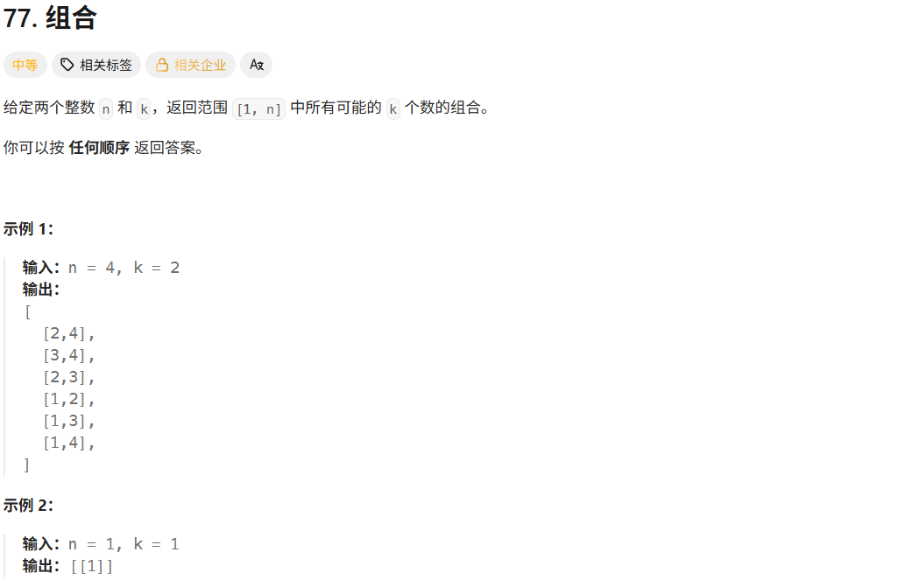

---

先来一道回溯的入门题目，了解下回溯的大体流程：

```cpp
class Solution {
public:
    vector<int> path;
    vector<vector<int>> ans;
    void backtracking(int n, int k, int startid) {
        // if (startid > n+1){return;} 
        
        if (path.size() == k) {
            ans.push_back(path);
            return;
        }

        
        for (int i = startid; i < n + 1; i++) {
            path.push_back(i);
            backtracking(n, k, i + 1);
            path.pop_back();
        }
        
    }
    vector<vector<int>> combine(int n, int k) {
        backtracking(n, k, 1);
        return ans;
    }
};
```

* 回溯是一种暴力搜索的算法，通过递归来代替多重循环。
* 8-11行是递归的终止条件，也就是递归的出口。
* 14-18行是每一个节点，比如说有一个数组[1,2,3,4]，排列成长度为2的字数组，第一层递归是先取出一个1，然后放到path中，在从第二个数2开始递归，进入start id = 2时的for循环，然后将2放到path中，这时在开始3的递归，这时满足终止条件放到ans中，跳出该层，然后到第二层的递归完成执行pop将2取出，然后第二层执行i=3时，执行递归等于4的，满足终止条件，然后存1、3，然后跳出，，，依次循环


## 46.全排列

[46. 全排列 - 力扣（LeetCode）](https://leetcode.cn/problems/permutations/?envType=study-plan-v2&envId=top-100-liked)

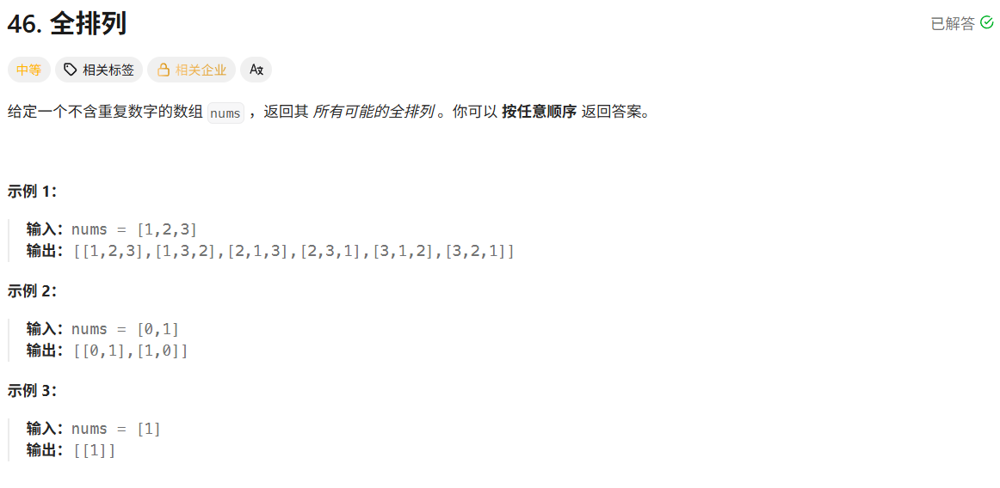

---

全排列是在回溯的基础上增加了一个访问标志：回溯的**回**，可以理解成恢复之前的状态。

```cpp
class Solution {
public:
    vector<int> used;
    vector<vector<int>> ans;
    vector<int> path;
    void backtracking(vector<int>& nums, vector<int>& used) {
        if(nums.size() == path.size()) {
            ans.push_back(path);
            return;
        }

        for(int i = 0; i < nums.size(); i++) {
            if(used[i]) continue;

            path.push_back(nums[i]);
            used[i] = true;
            backtracking(nums, used);
            path.pop_back();
            used[i] = false;
        }

    }

    vector<vector<int>> permute(vector<int>& nums) {
        vector<int> used(nums.size(), false);
        backtracking(nums, used);
        return ans;
    }
};
```

- 回溯是一种暴力求解，每一个回溯问题都可以抽象成一个**二叉树**，既然是二叉树，就可以用层来分析每一次递归在干什么。
- 比如说[1,2,3]这三个数，第一层（第一次调用递归函数）是path中放了1；
- 然后第二层（第二次调用递归）按照used将2放到pah中；
- 执行第三层（第三次调用递归）按照used将3放到path
- 第四层，第四次调用递归， 将4放到path
- 第五层，达到终止条件，ans存path，跳到第四层，取消标记，然后一路回溯到第一层的for循环第二个数，即path中放第一个数为2，依次循环。


## 78.子集

[78. 子集 - 力扣（LeetCode）](https://leetcode.cn/problems/subsets/?envType=study-plan-v2&envId=top-100-liked)

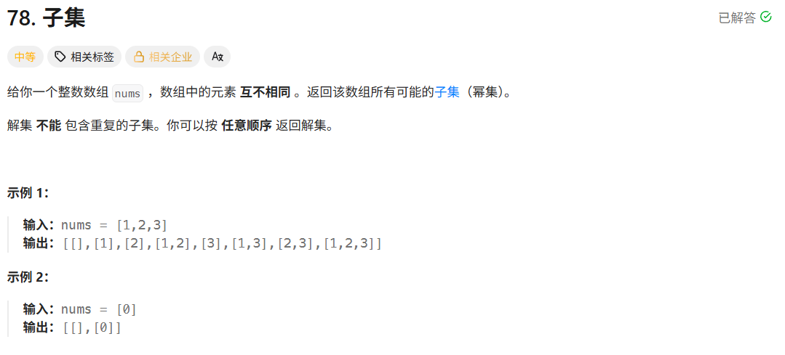

---
这道题可以看成是组合问题的进一步，就是在组合问题的基础上，通过在外层一个for循环确定每次组合的长度~

bingo

```cpp
class Solution {
public:
    vector<int> path;
    vector<vector<int>> ans;
    void backtracking(vector<int>& nums, int k, int startid) {
        if(path.size() == k) {
            ans.push_back(path);
            return;
        }

        for(int i = startid; i < nums.size(); i++) {
            path.push_back(nums[i]);
            backtracking(nums, k, i+1);
            path.pop_back();
        }
    }
    vector<vector<int>> subsets(vector<int>& nums) {
        for(int i = 0; i < nums.size()+1; i++) {
            backtracking(nums, i, 0);
        }
        return ans;
    }
};
```


## 17.电话号码的字母组合

[17. 电话号码的字母组合 - 力扣（LeetCode）](https://leetcode.cn/problems/letter-combinations-of-a-phone-number/solutions/388738/dian-hua-hao-ma-de-zi-mu-zu-he-by-leetcode-solutio/?envType=study-plan-v2&envId=top-100-liked)

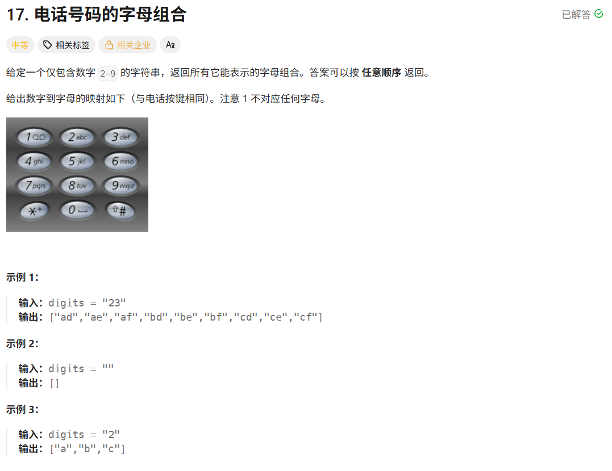

---

这道题算是回溯中比较基础的使用。

同样是用分层的理论来解释：

- 第一层对应着digits[0]里面的字符
- 第二层对应digits[1]里面的字符，然后按照套路回溯即可。

```
class Solution {
public:
    map<char, string> map_ = {
        // {"1", "abc"},
        {'2', "abc"},
        {'3', "def"},
        {'4', "ghi"},
        {'5', "jkl"},
        {'6', "mno"},
        {'7', "pqrs"},
        {'8', "tuv"},
        {'9', "wxyz"}
    };

    string path;
    vector<string> ans;

    void backtracking(string digits, int c_id) {
        if(path.size() == digits.size()) {
            ans.push_back(path);
            return;
        }
        for(int i = 0 ; i < map_[digits[c_id]].size(); i++) {
            path+=map_[digits[c_id]][i];
            backtracking(digits, c_id+1);
            path.pop_back();
        }

    }
    vector<string> letterCombinations(string digits) {
        if(digits.size()==0) return{};
        backtracking(digits, 0);
        return ans;
    }
};
```


## 39.组合总和(字节)

[39. 组合总和 - 力扣（LeetCode）](https://leetcode.cn/problems/combination-sum/description/?envType=study-plan-v2&envId=top-100-liked)

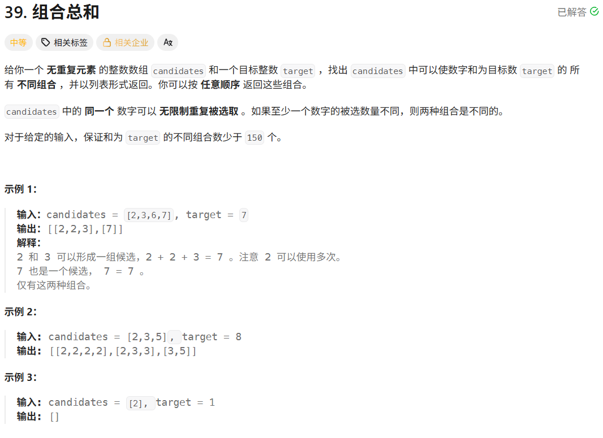

---

这道题需要注意的是：

- 不要添加重复的：所以说刚开始的时候给数组排序下，然后在递归的时候，下一层递归的位置从当前位置开始，就可以避免递归了
- 不要超时：进行了排序之后，如果累计和大于当前值，那么直接return就可以了！

```cpp
class Solution {
public:

    vector<vector<int>> ans;
    vector<int> path;

    void backtracking(vector<int>& candidates, int len, int target, int start_id) {
        int sum = std::accumulate(path.begin(), path.end(), 0);
        if(sum > target) return;
        if(path.size() == len) {
            if(sum == target) {
                ans.push_back(path);
            }
            return;
        }

        for(int i = start_id; i < candidates.size(); i++) {
            path.push_back(candidates[i]);
            backtracking(candidates, len, target, i);
            path.pop_back();
        }
    }
    
    vector<vector<int>> combinationSum(vector<int>& candidates, int target) {
        sort(candidates.begin(), candidates.end());
        for(int i = 1; i <= target / *min_element(candidates.begin(), candidates.end()); i++) {
            backtracking(candidates, i, target, 0);
        }
        return ans;
        
    }
};
```


## 22.括号生成(pdd、momenta)

[22. 括号生成 - 力扣（LeetCode）](https://leetcode.cn/problems/generate-parentheses/description/?envType=study-plan-v2&envId=top-100-liked)

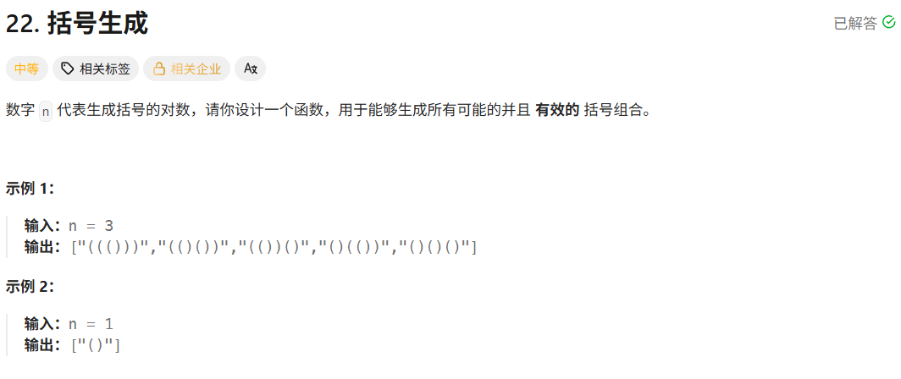

---

这道题属实是没想到啊，在一个递归函数中判断左右括号的个数，然后决定是执行那边的递归。

```cpp
class Solution {
public:
    string path;
    vector<string> ans;
    
    void backtrack(int n, int open, int close) {
        if(path.size()==2*n) {
            ans.push_back(path);
            return;
        }

        if(open < n) {
            path.push_back('(');
            backtrack(n, open+1, close);
            path.pop_back();
        }

        if(close < open) {
            path.push_back(')');
            backtrack(n, open, close+1);
            path.pop_back();
        }
    }

    vector<string> generateParenthesis(int n) {
        backtrack(n,0,0);
        return ans;
    }
};
```


## 79.单词搜索

[79. 单词搜索 - 力扣（LeetCode）](https://leetcode.cn/problems/word-search/description/?envType=study-plan-v2&envId=top-100-liked)

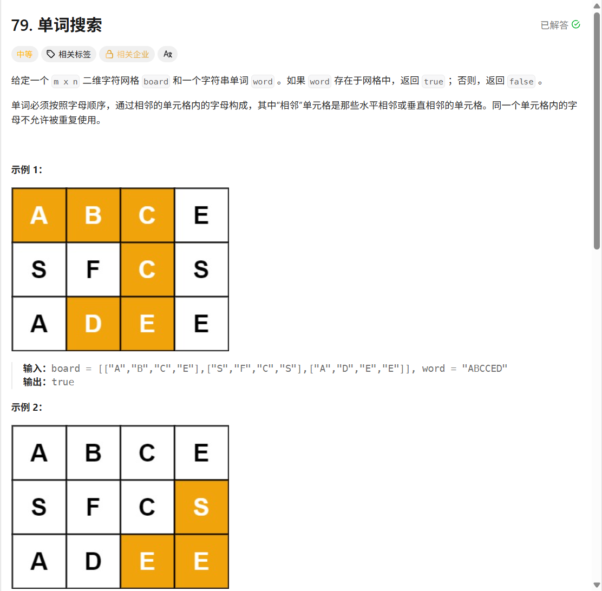

---

- 因为有要求不能使用重复的字母，所以使用visited来标记访问过的字母
- string拷贝比较耗费资源，使用引用


```cpp
class Solution {
public:
    string path;
    bool ans = false;
    vector<vector<int>> direction = {{-1,0}, {1,0}, {0,1}, {0,-1}};
    void backtracking(vector<vector<char>>& board, int x, int y, string& word, vector<vector<bool>>& visited) {
        if(ans) return;
        if(path == word) {
            ans = true;
            return;
        }
        if(path.size() > word.size()) return;
        if(path.size()>0) {
        if(path.back() != word[path.size()-1]) {
            return;
        }}
        if(x < board[0].size() && y < board.size() && x>=0 && y>=0) {
            if(visited[y][x]) return; 
        }
        else {
            return;
        }
        for(int i = 0; i < 4; i++) {
            path.push_back(board[y][x]);
            visited[y][x] = true;
            backtracking(board, x+direction[i][0], y+direction[i][1], word, visited);
            path.pop_back();
            visited[y][x] = false;
        }
    }

    bool exist(vector<vector<char>>& board, string word) {
        for(int i = 0; i < board[0].size(); i++) {
            for(int j = 0; j < board.size(); j++) {
                vector<vector<bool>> visited(board.size(), vector<bool>(board[0].size(), false));
                backtracking(board, i, j, word, visited);
                if(ans) return ans;
        }
        }
        return ans;
    }
};
```


# 二分查找


## 35.搜索插入位置

[35. 搜索插入位置 - 力扣（LeetCode）](https://leetcode.cn/problems/search-insert-position/description/?envType=study-plan-v2&envId=top-100-liked)

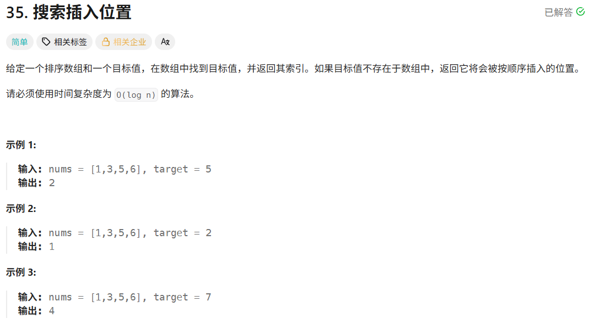

---
这道题主要是注意左右边界的更新条件：

- 默认将答案放到最后一个位置，然后如果找到的话（也就是target小于中心点的位置时），就更新ans的位置
- 最后终止条件是left=right，也就是说如果有肯定这俩是相等的，所以

```cpp
class Solution {
public:
    int searchInsert(vector<int>& nums, int target) {
        int n = nums.size();
        int left = 0, right = n-1, ans = n;
        while(left<=right) {
            int mid = (left+right)/2;
            if(target <= nums[mid]) {
                ans = mid;
                right = mid-1;
            }
            else {
                left = mid+1;
            }
        }
        return ans;
    }
};
```


## 74.搜索二维矩阵

[74. 搜索二维矩阵 - 力扣（LeetCode）](https://leetcode.cn/problems/search-a-2d-matrix/description/?envType=study-plan-v2&envId=top-100-liked)

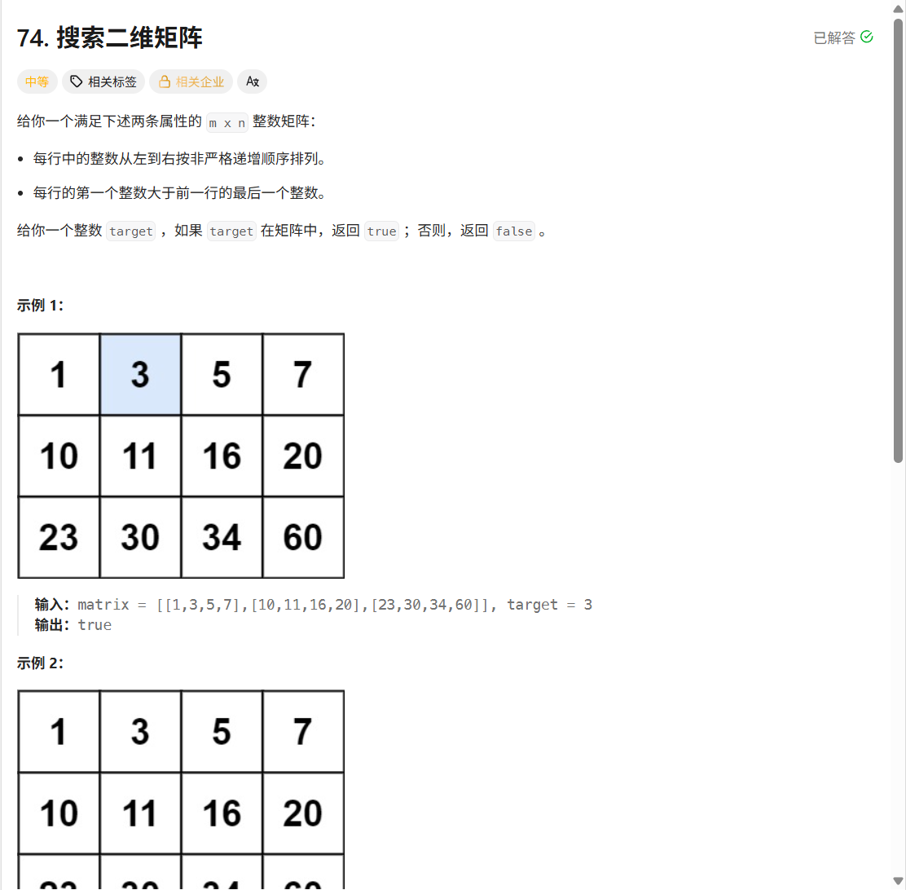

---

- 把二维矩阵看成一维的，然后转化行列

```cpp
class Solution {
public:
    bool searchMatrix(vector<vector<int>>& matrix, int target) {
        int col = matrix[0].size();
        int row = matrix.size();
        int left = 0, right = row*col-1;
        while(left<=right) {
            int mid = (left+right) / 2;
            int x = matrix[mid/col][mid%col];
            if(target > x) {
                left = mid+1;
            }
            else if(target < x) {
                right = mid-1;
            }
            else{
                return true;
            }
        }
        return false;
    }
};
```


## 34.在排序数组中查找元素的第一个和最后一个位置

[34. 在排序数组中查找元素的第一个和最后一个位置 - 力扣（LeetCode）](https://leetcode.cn/problems/find-first-and-last-position-of-element-in-sorted-array/description/?envType=study-plan-v2&envId=top-100-liked)

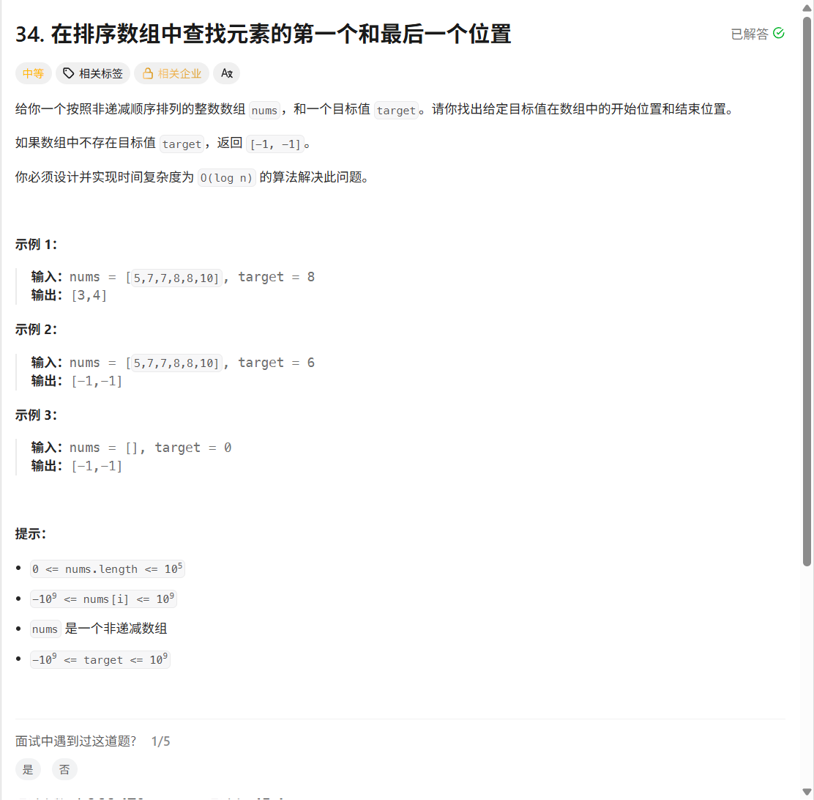

---

- 通过一个bool判断是找左边界还是有右边界
- 二分在选择下一次边界的时候，要判断大于、小于、等于三种情况，因为是查找，所以当明确target等于nums元素的时候再给ans赋值。然后根据bool（找左、右边界）来确定left、right的选择

```cpp
class Solution {
public:
    int binarySearch(vector<int>& nums, int target, bool lower) {
        int left = 0, right = int(nums.size())-1, ans = -1;
        while(left<=right) {
            int mid = (left+right)/2;
            // if(left == right && nums[mid] == target) return mid;
            if(target < nums[mid]) {
                right = mid-1;
            } else if(target > nums[mid]) {
                left = mid+1;
            } else {
                ans = mid;
                if(lower) {
                    right = mid-1;
                }else {
                    left = mid+1;
                }
            }
        }
        return ans;

    }
    vector<int> searchRange(vector<int>& nums, int target) {
        return{binarySearch(nums, target, true), binarySearch(nums, target, false)};
    }
};
```


## 153.寻找旋转排序数组中的最小值

[153. 寻找旋转排序数组中的最小值 - 力扣（LeetCode）](https://leetcode.cn/problems/find-minimum-in-rotated-sorted-array/description/?envType=study-plan-v2&envId=top-100-liked)

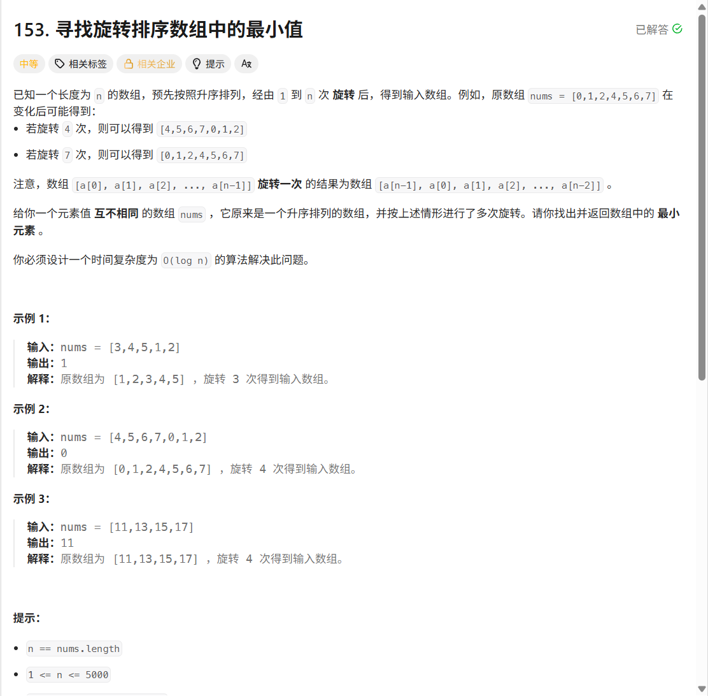

---

这个我感觉思路是对的，但是最后只能过几个用例...

- 只需要通过二分查找，然后比较中间点与右边点的大小

```cpp
class Solution {
public:
    int binarySearch(vector<int>& nums, int target, bool lower) {
        int left = 0, right = int(nums.size())-1, ans = -1;
        while(left<=right) {
            int mid = (left+right)/2;
            // if(left == right && nums[mid] == target) return mid;
            if(target < nums[mid]) {
                right = mid-1;
            } else if(target > nums[mid]) {
                left = mid+1;
            } else {
                ans = mid;
                if(lower) {
                    right = mid-1;
                }else {
                    left = mid+1;
                }
            }
        }
        return ans;

    }
    vector<int> searchRange(vector<int>& nums, int target) {
        return{binarySearch(nums, target, true), binarySearch(nums, target, false)};
    }
};
```


## 33.搜索旋转排序数组

[33. 搜索旋转排序数组 - 力扣（LeetCode）](https://leetcode.cn/problems/search-in-rotated-sorted-array/description/?envType=study-plan-v2&envId=top-100-liked)

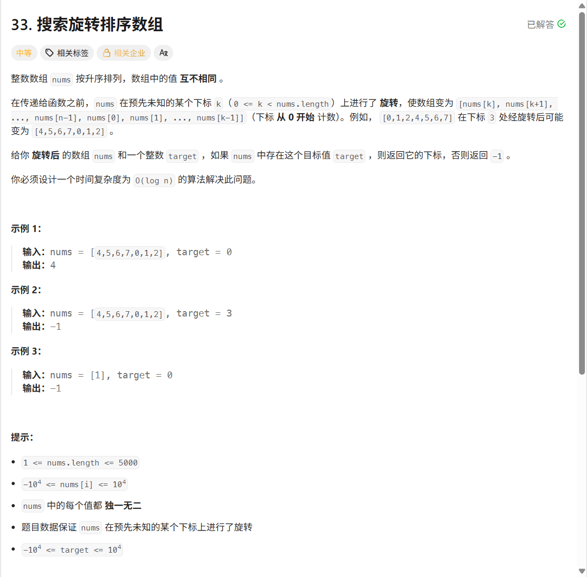

---

```
class Solution {
public:
    int findMin(vector<int>& nums) {
        int left=0, right=int(nums.size())-1, mid = 0;
        while(left <= right) {
            mid = left + (right-left)/2;
            if(nums[mid] < nums[right]) {
                right = mid;
            } else {
                left = mid+1;
            }
        }
        return mid;
    }

    int binarySearch(vector<int>& nums, int left, int right, int target) {
        int ans = -1;
        while(left<=right) {
            int mid = (left+right)/2;
            if(target<nums[mid]) {
                right = mid-1;
            } else if (target > nums[mid]) {
                left = mid+1;
            } else {
                ans = mid;
                return ans;
            }
        }
        return ans;
    }

    int search(vector<int>& nums, int target) {
        int id = findMin(nums);
        int ans = -1, n = int(nums.size())-1;
        if(nums[n]>=nums[0]) {
            return binarySearch(nums,0,n,target);
        }
        if(target>=nums[0]) {
            ans = binarySearch(nums, 0, id-1, target);
        } else {
            ans = binarySearch(nums, id, int(nums.size())-1, target);
        }
        return ans;
    }
};
```

