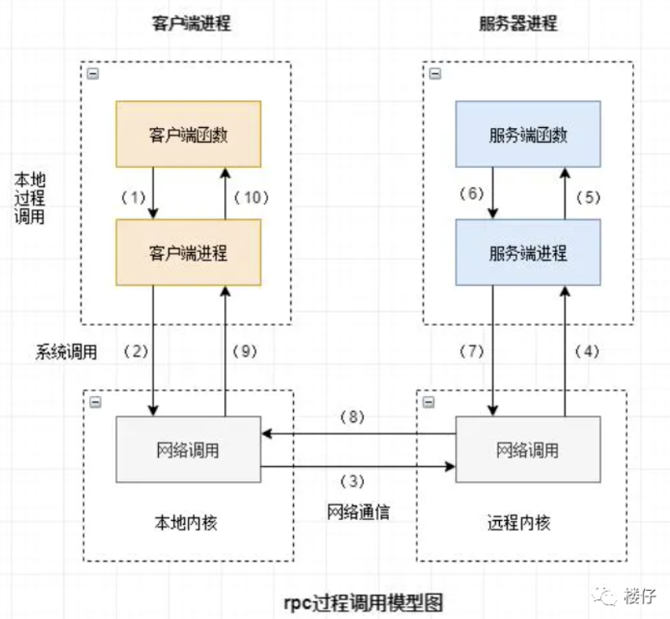

# 科普

遇到的一些技术、工具等。

## RPC框架

RPC（Remote Procedure Call Protocol）远程过程调用协议。一个通俗的描述是：客户端在不知道调用细节的情况下，调用存在于远程计算机上的某个对象，就像调用本地应用程序中的对象一样。

- 目前典型的RPC实现包括：Dubbo、Thrift、GRPC、Hetty等

- 网络协议和网络IO模型对其透明

- 有跨语言能力




## JSON

[JSON 教程 | 菜鸟教程 (runoob.com)](https://www.runoob.com/json/json-tutorial.html)

形如：

```
{
    "sites": [
    { "name":"菜鸟教程" , "url":"www.runoob.com" }, 
    { "name":"google" , "url":"www.google.com" }, 
    { "name":"微博" , "url":"www.weibo.com" }
    ]
}
```


## 组合优化

定义：有限个解的优化问题

常见的问题有：交通运输、固定重量的背包如何放置使得总金额最大。
