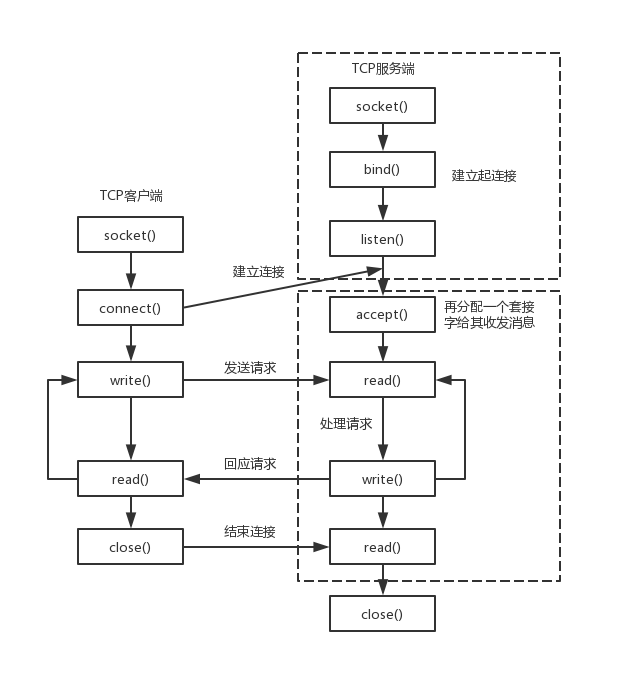
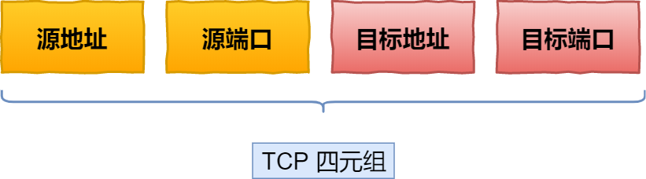
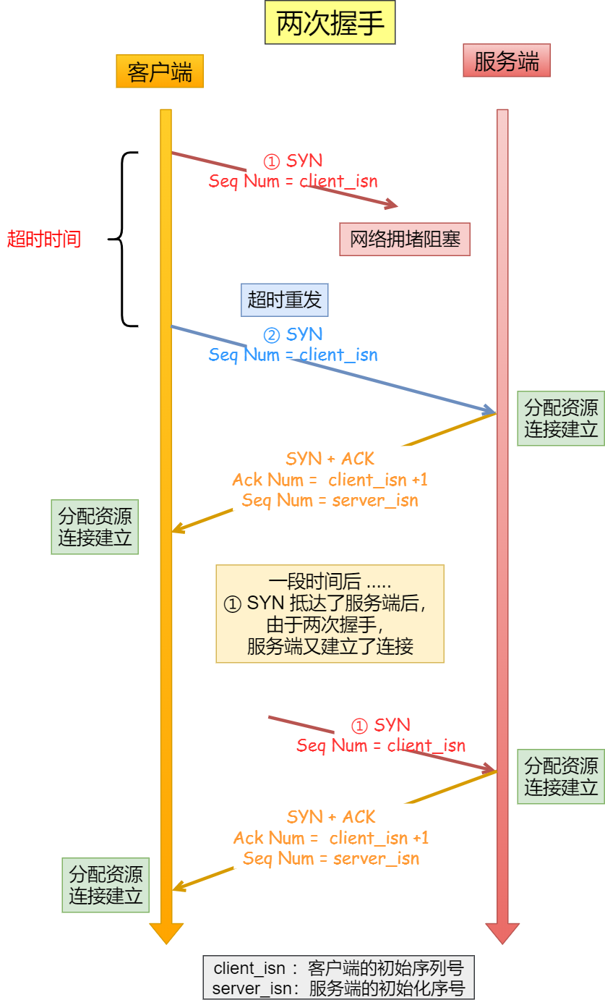
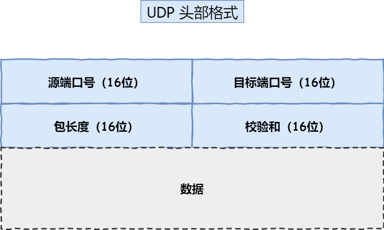

# 计算机网络

## 概念

1.**往返时间****RTT****（****Round-Trip Time****）表示从发送方发送数据开始，到发送方收到来自接收方的确认（接收方接收数据后马上发送接收确认），总共经历的时间。**


## 抓包

配置 Fiddler 抓取 HTTPS 数据包需要进行一些关键设置，主要是为了让它能够解密和查看加密的流量。我来为你梳理一下核心步骤和注意事项。

### 🔧 核心配置步骤

| 步骤                                | 操作内容                                                     | 注意事项                                                     |
| :---------------------------------- | :----------------------------------------------------------- | :----------------------------------------------------------- |
| **1. 启用HTTPS解密**                | 在 Fiddler 中打开 `Tools > Options > HTTPS`，勾选 **`Decrypt HTTPS traffic`**。 | 通常会提示安装证书，需点击确认。                             |
| **2. 安装根证书**                   | 在 HTTPS 选项卡点击 **`Actions > Trust Root Certificate`** 安装证书。 | 这是解密HTTPS流量的关键，确保系统信任Fiddler。               |
| **3. 忽略证书错误**                 | 建议同时勾选 **`Ignore server certificate errors`** 选项。   | 可避免因Fiddler介入导致的一些证书验证错误，方便抓包。        |
| **4. 允许远程连接（手机抓包需设）** | 如需抓手机App包，需在 `Connections` 中勾选 **`Allow remote computers to connect`**。 | 设置后**务必重启Fiddler**生效。端口默认为8888。              |
| **5. 配置浏览器代理**               | 确保浏览器代理设置为Fiddler（通常为`127.0.0.1:8888`）。      | 多数浏览器会自动配置。Firefox需手动设置。                    |
| **6. 处理Firefox浏览器**            | Firefox使用独立证书库，需**手动导入**Fiddler证书。           | 从 `Actions` 导出证书，然后在Firefox的证书管理中导入。       |
| **7. 手机抓包额外设置**             | 手机与电脑同WiFi，手动设置代理为**电脑IP:8888**；用手机浏览器访问 **`http://<电脑IP>:8888`** 下载并安装证书。 | iOS需在“证书信任设置”中启用。Android各品牌安装步骤略有差异。 |

成功使用 Fiddler 抓取 HTTPS 包的关键在于：**正确安装并信任 Fiddler 根证书**、**配置好代理**（无论是本机还是手机）。一旦遇到问题，多检查证书状态和网络连接设置。


# ASIO库

Asio 是一个用于网络和低级 I/O 编程的跨平台 C++ 库，它使用现代 C++ 方法为开发人员提供一致的异步模型.

## API

## io_context

这个类提供了异步I/O对象的核心I/O功能，包括：

```cpp
asio::ip::tcp::socket
asio::ip::tcp::acceptor
asio::ip::udp::socket
asio::deadline_timer
```

`asio`空间中，我们首先不可避免的就是类`io_service`或`io_context`。

> 注意，`io_context`这个类是用来替代`io_service`的，所以建议以后都直接使用`io_context`即可

**这个类非常重要，它相当于我们程序与系统之间`I/O`操作的中介，我们所有的接受或发送数据操作，都是通过将需求提交给这个类，然后这个类再交给计算机来执行的。**

> 基于这个理念，基本所有`asio`网络库中有读写`I/O`需求的类，其构造函数的第一个参数就是它，比如后面要讲的收发数据的`socket`类，以及`tcp`服务器用于接受用户连接的`acceptor`类等

而这个`io_context`就在`asio`里面，所以在`using namespace boost::asio;`之后，就可以直接用它实例化对象：

```text
io_context io;
```

除了`io_context`外，`asio`里面还有一个函数非常重要,那就是`buffer`函数，它的作用其实就是构造一个结构体,大致如下：

```text
struct{
void* buf;
s_size len;
}
```

该网络模块中所有的收发数据操作，都不接受单独的字符串，而是这样一个结构体，分别为缓存区的首地址以及缓存区的大小。

总结一下就是，asio里面，直接用到的就是一个类：io_context 与一个函数：buffer。

然后继续深入，紧接着就是asio里面进一步的命名空间ip，我们的TCP和UDP相关类，就在这个ip里面。

比如我们想使用tcp，其socket类，就是：ip::tcp::socket,而udp的socket类就是：ip::[udp::socket](https://zhida.zhihu.com/search?content_id=229215571&content_type=Article&match_order=1&q=udp%3A%3Asocket&zhida_source=entity)。

由于我们通常程序用中可能只使用其中某一个协议，比如只使用TCP，那就可以这样写：

```text
using asio::ip::tcp;
```

作为TCP服务器，用于接受客户端连接的类acceptor也在其中。

这样就不用每次都加前面那一大长串了（如果tcp与udp都会使用，那就别这样写了，会混淆）。

除了socket类，我们在网络通信中还需要对方的ip与端口才行，这就用到了类endpoint，它同样在tcp与udp中都有。

还有就是地址处理类：address，直接就在ip里面，其最常用的就是它的静态函数from_string，将十进制的ip地址转化为网络字节序。

---

**向io_context提交任务：**

```cpp
void my_task()
{
    //...
}

int main()
{
    asio::io_context io_context;
    //提交一个函数
    asio::post(io_context, my_task);
    
    //提交一个lambda 表达式
    asio::post(io_context, [](){
        //...
    });

    //运行 io_context 直到它用完为止。
    io_context.run();
    return 0;
}
```


## 网络编程的基本流程

**服务端**
1）socket——创建socket对象。

2）bind——绑定本机ip+port。

3）listen——监听来电，若在监听到来电，则建立起连接。

4）accept——再创建一个socket对象给其收发消息。原因是现实中服务端都是面对多个客户端，那么为了区分各个客户端，则每个客户端都需再分配一个socket对象进行收发消息。

5）read、write——就是收发消息了。

**客户端**
1）socket——创建socket对象。

2）connect——根据服务端ip+port，发起连接请求。

3）write、read——建立连接后，就可发收消息了。

图示如下


## 建立连接并发送buffer

**服务端：**

```cpp
void run_server() {
    const int BACKLOG_SIZE = 30;
    unsigned short port_num = 3333;
    asio::io_context ios;

    try {
        asio::ip::tcp::endpoint ep(asio::ip::address_v4::any(), port_num);
        asio::ip::tcp::acceptor acceptor(ios, ep.protocol());
        acceptor.bind(ep);
        acceptor.listen(BACKLOG_SIZE);

        std::cout << "✅ Server is listening on port " << port_num << "..." << std::endl;

        asio::ip::tcp::socket sock(ios);
        
        // 等待一个客户端连接进来
        acceptor.accept(sock);
        // 服务器需要一直运行来接受连接
        while (true) {
            char buf[1024];
            // cin>> buf;
            // sock.send(asio::buffer(buf, sizeof(buf)));
            sock.receive(asio::buffer(buf));
            std::cout << "Received data: " << buf << std::endl;


            
            // std::cout << "🎉 Client connected from: " 
            //           << sock.remote_endpoint().address().to_string() 
            //           << std::endl;
            
            // 在这里可以与客户端进行通信 (读/写数据)
            // 为简化示例，这里接受连接后就立即关闭，并等待下一个
        }
    }
    catch (std::exception& e) {
        std::cerr << "Error occurred! Message: " << e.what() << std::endl;
    }
}

```


**客户端：**

```
int connect_socket() {
    asio::io_context io;
    asio::ip::tcp::socket sock(io);
    sock.connect(asio::ip::tcp::endpoint(asio::ip::address::from_string("192.168.31.81"),3333));
    char buf[1024] = "hello";
    sock.send(asio::buffer(buf));
}
```


- 与客户端相比，服务端需要定义一个`acceptor`


## 异步读写

客户端：

```
class Send_queue {
public:
    Send_queue(std::shared_ptr<tcp::socket> socket) : socket_(socket) {};
    void connect(tcp::endpoint ep) {
        socket_->connect(ep);
    }

    void send(const string& buf) {
        asio::post(socket_->get_executor(), [this, buf](){
            bool write_in_progress = !msg_queue_.empty();
            msg_queue_.push(buf);
            if (!write_in_progress) {
                do_write();
            }

        });
    }

    void do_write() {
        asio::async_write(*socket_, asio::buffer(msg_queue_.front()), [this](const asio::error_code& ec, size_t len){
            if (!ec) {
                msg_queue_.pop();
                if (!msg_queue_.empty()) {
                    do_write();
                }
            }
        });
    }

    std::shared_ptr<tcp::socket> socket_;
    std::queue<string> msg_queue_;
};
```


服务端：

```
void run_server() {
    const int BACKLOG_SIZE = 30;
    unsigned short port_num = 3333;
    asio::io_context ios;
    asio::ip::tcp::endpoint ep(asio::ip::address_v4::any(), port_num);
    asio::ip::tcp::acceptor acceptor(ios, ep.protocol());
    acceptor.bind(ep);
    acceptor.listen(BACKLOG_SIZE);
    while(1){
    try {


        std::cout << "✅ Server is listening on port " << port_num << "..." << std::endl;

        asio::ip::tcp::socket sock(ios);
        
        // 等待一个客户端连接进来
        acceptor.accept(sock);
        // 服务器需要一直运行来接受连接
        while (true) {
            char buf[1024];
            // cin>> buf;
            // sock.send(asio::buffer(buf, sizeof(buf)));
            // size_t len = sock.receive(asio::buffer(buf),0);
            sock.async_receive(asio::buffer(buf), 
                [](const asio::error_code& ec, std::size_t len) {
                    if (!ec) {
                        std::cout << "Received " << len << " bytes." << std::endl;
                    } else {
                        std::cerr << "Error receiving data: " << ec.message() << std::endl;
                    }
                });
            std::cout << "🎉 Received data: " << buf << std::endl;
            memset(buf, 0, 1024); // 模拟接收到数据
            // delete buf; // 释放内存
            break; // 这里为了示例，接收一次就退出循环 
        }
        sock.close();

    }
    catch (std::exception& e) {
        std::cerr << "Error occurred! Message: " << e.what() << std::endl;
    }
    std::cout << "Server socket closed. Waiting for new connections..." << std::endl;
    }
}
```

- 使用do_write更符合TCP连接的需求

- 在回调中去执行发送队列的pop操作，可以根据发送队列是否为空来判断之前的发送是否完成，如果非空说明还有消息在发送

- 如果执行下面的代码：

  ```
      asio::io_context io;
      Send_queue s(std::make_shared<asio::ip::tcp::socket>(io));
      s.connect(asio::ip::tcp::endpoint(asio::ip::address::from_string("192.168.31.81"),3333));
      s.send("456\n");
      s.send("hello,world");
      io.run();
  ```

  在多次执行send函数的时候，

  - send函数中的post会将字符串push到队列中，然后根据当前是否有任务决定是否执行do_write函数。

    在提交“456”的时候，队列为空，执行do_write，（异步的，时间不确定）

    提交“hello, world”时，队列不为空，不执行do_write。“hello，world”的发送是在执行完“456”的回调中发送的。


## 使用shared from this延长生命周期

由于这是异步程序，创建发送类的时候是在main函数里的，所以这个发送类的周期跟主线程是一致的并不需要担心。

【warning】但是，不是所有的时候发送类都是在main函数里的，有的可能是在某个堆栈中执行的，这个时候很有可能出现：**异步程序还在执行，但是发送类已经析构的情况**，这时候就要手动延长发送类的声明周期，使得发送类的生命周期和回调函数一致。（触发回调时说明已经发送完成，这个时候就可以析构了）

**方法：获取发送类自身的智能指针，然后在回调函数的lambda表达式中捕获这个智能指针**

```cpp
class Send_queue : public enable_shared_from_this<Send_queue> {
public:
    Send_queue(std::shared_ptr<tcp::socket> socket) : socket_(socket) {};
    void connect(tcp::endpoint ep) {
        socket_->connect(ep);
    }

    void send(const string& buf) {
        asio::post(socket_->get_executor(), [this, buf](){
            bool write_in_progress = !msg_queue_.empty();
            msg_queue_.push(buf);
            if (!write_in_progress) {
                do_write();
            }

        });
    }

    void do_write() {
        auto self = shared_from_this();
        weak_ptr<Send_queue> weak = self;
        asio::async_write(*socket_, asio::buffer(msg_queue_.front()), [this, weak](const asio::error_code& ec, size_t len){
            if (!ec) {
                weak.lock();
                msg_queue_.pop();
                if (!msg_queue_.empty()) {
                    printf("call back");
                    do_write();
                }
            }
        });
    }

    std::shared_ptr<tcp::socket> socket_;
    std::queue<string> msg_queue_;
};


int main() {
    asio::io_context io;
//    Send_queue s();
    std::shared_ptr<Send_queue> s = make_shared<Send_queue>(std::make_shared<asio::ip::tcp::socket>(io));
    s->connect(asio::ip::tcp::endpoint(asio::ip::address::from_string("192.168.31.81"),3333));
    s->send("456\n");
    s->send("hello,world");

    io.run();
}
```

- 第1行，需要public继承`enable_shared_from_this<Send_queue>`
- 第20行中，`auto self = shared_from_this();`获得自身的智能指针，然后让回调捕获这个智能指针，`async_write`启动一个异步程序，`do_write`函数会立马退出，send_queue生命周期：
  - main函数中，创建`Send_queue`l类型智能指针，引用计数：1
  - 20行，self为指向自身的智能指针，引用计数：2
  - 22行，lambda表达式捕获weak，引用计数：2
  - 24行，weak提升为强指针，引用计数：3
  - 32行，异步函数会立马返回，self析构，引用计数：2
  - 异步函数执行完后，执行回调，引用计数：1
  - Send_queue离开作用域，引用计数：0，析构


# TCP


## 如何确定一个tcp连接




- 源地址和目的地址的字段（32位）是在IP头部中，作用是通过IP协议发送报文给对方主机
- 源端口和目的端口的字段（16位）是在TCP头部中，作用是告诉TCP协议应该把


最大tcp连接数：客户端的IP数*客户端的端口数


## TCP连接建立

1.三次握手过程


**为什么不能是两次握手？**

如果是两次握手，那么客户端在发送第一次syn的时候，服务端就会建立连接，进而想客户端发送数据，如果是历史连接，服务端就会建立旧的连接导致资源浪费。




**如果第二次握手丢失了会怎么样？**

第二次握手丢失了，

- 客户端会触发syn重传机制

- 服务端无法收到第三次握手，触发syn-ack的重传

**如果第三次握手丢失了会怎么样子？**

- 客户端认为连接已经建立了
- 服务端没有收到ack确认报文，触发服务端syn-ack的重传（第三次的ack报文不会重传，当丢失时，就必须由服务端重新发送对应报文）


# UDP




- 目标和源端口：主要是告诉UDP协议应该把报文发送给哪个进程
- 包长度：该字段保存了UDP首部的长度和数据的长度之和
- 检验和：检验和是为了提供可靠的UDP首部和数据而设计，防止收到在网络传输中受损的UDP包


## UDP和TCP的区别

1.连接：

- tcp是面向连接的传输层协议，传输数据前要建立连接
- udp不需要连接，即可传输数据

2.服务对象

- TCP是一对一的两点服务，即一条连接只有两个断电
- UDP支持一对一、一对多、多对多的交互通信

3.可靠性

- TCP是可靠交付数据，数据可以无差错、不丢失、不重复、按序到达
- UDP是尽最大努力交付，不保证可靠交付数据。可以通过QUIC协议实现可靠传输

4.拥塞控制、流量控制

- TCP有拥塞控制和流量控制机制，保证数据传输的安全性。
- UDP没有，即使网络拥堵，也不会影响UDP发送速率

5.首部开销

- TCP首部长度较长，会有一定的开销，首部在没有使用【选项】字段时是20个字节，如果使用了【选项】字段则是会变长的
- UDP首部只有8个字节，并且是固定不变的，开销较小

6.传输方式

- TCP是流式传输，没有边界，但保证顺序和可靠。
- UDP是一个一个包的发送，是有边界的，但可能发生丢包和乱序。

7.分片不同

- TCP的数据大小如果大于MSS大小，则会在**传输层**进行分片；目标主机收到后，也同样在传输层组装TCP数据包，如果中途丢失了一个分片，则需要传输丢失的这个分片。
- UDP的数据大小如果大于MTU大小，则会在**IP层**进行分片，目标主机收到后，在IP层组装完数据，接着在传给**传输层**

## TCP和UDP应用场景

- tcp：FTP，HTTP/HTTPS
- udp：dns、snmp、视频音频等多媒体通信、广播通信


## TCP和UDP可以使用一个端口嘛

> 两个进程不能同时监听同一个端口，因为端口具有独占性，操作系统要求一个端口同一时刻只能被一个进程绑定（bind）。如果第二个进程尝试监听已被占用的端口，会收到address already in use

**可以的**？？？？？

在数据链路层，通过mac地址来寻找局域网中的主机。在网际层，通过IP地址来寻找网络中互联的主机或路由器。在传输层中，需要通过端口进行寻址，来识别同一计算机中同时通信的不同程序。


所以，传输层的**端口号**的作用，是为了区分同一台主机上不同应用程序的数据包

传输层有两个传输协议tcp和udp在内核中是完全独立的软件模块。

当主机收到数据包后，可以在IP包头的**协议号**字段知道该数据包是tcp/udp，所以可以根据这个信息确定发送给哪个模块tcp/udp处理，送给tcp/udp模块的报文根据**端口号**确定送给哪个应用程序处理。


因此，tcp/upd各自的端口号相互独立，如tcp有一个80端口，udp也有一个80号端口，二者并不冲突。

