# Blender

## 界面布局

1. 注意编辑模式和物体模式之间的切换

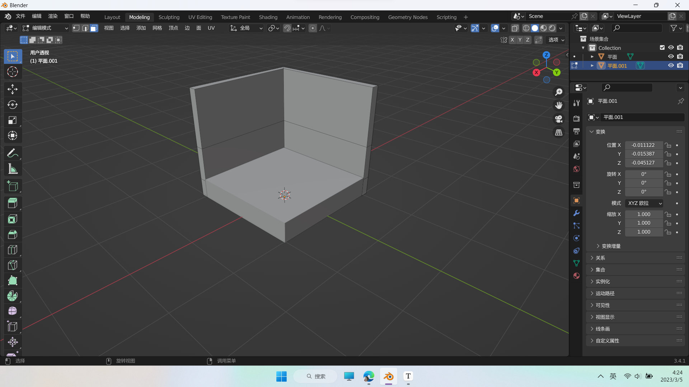

2. 

   有这个标志：说明该物体处于编辑模式


## 快捷键

```
/  聚焦模式
Tab 切换物体模式or编辑模式
E 基础，在当前面的基础上，不改变当前面
G 修改高度，修改当前面
S 缩放，当前面
1 2 3 切换点线面
小键盘上的123则是三视图切换
ALT+E 沿着法向挤出
ALT+Z 切换透视模式
shift+a 添加物体

F 封口


全选物体——A
框选物体——B
反选物体——Ctrl+I
删除物体——X（可以直接单手操作好嘛，左手键盘，右手鼠标，不至于一直放开右手去Delete）
```


## 调整面的高度

1. 选择一个/多个面

   ```
   tab
   3
   alt+点击面的交线
   ```

2. 调整高度

   ```
   g	--调整高度
   z	--只在z方向改变
   ```

   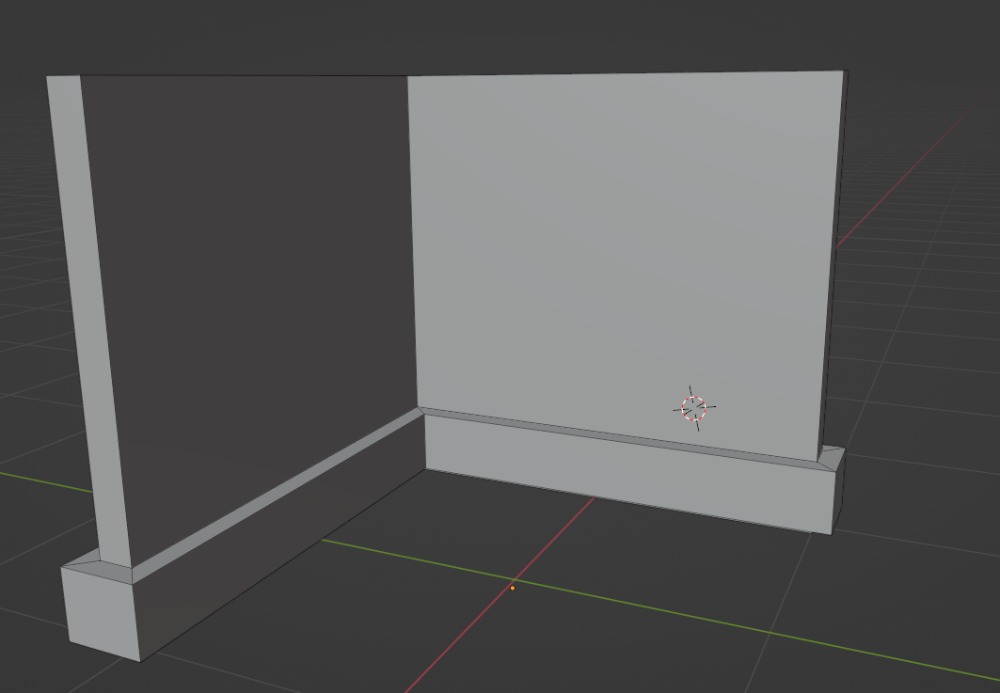

## 制作圆角

1. 选择一条边，也就是要做为圆角消失的边

   ```
   tab
   点击一条边
   ```

   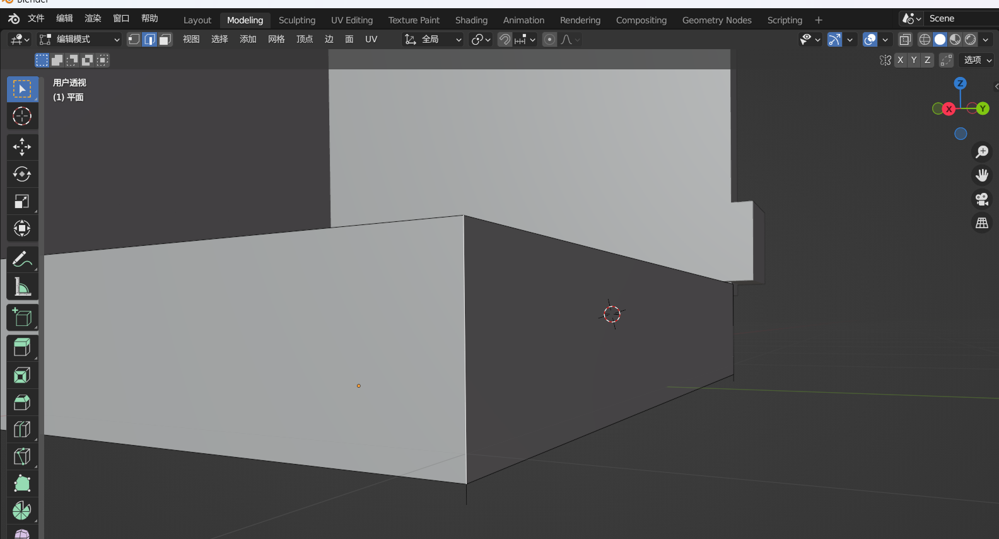

2. 制作角（立体）

   ```
   ctrl+b
   滚轮
   ```

   

## 小飞机

**一、制作筒子**

1. 创建圆环

```
shift+a
选择圆环
```

2. 绕某轴旋转

```
R
Z //绕z轴旋转
90 //旋转90°
```

3. 圆环拉伸

```
SHIFT+滚轮  //移动视图
1/2 //选择点/线
框选圆环
E //拉伸
```


4. 缩小一端

```
ALT+Z
选中尾端
S
缩小
```

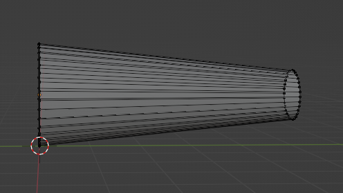

5. 向内挤出（以缩放的形式）

```
E
S
```

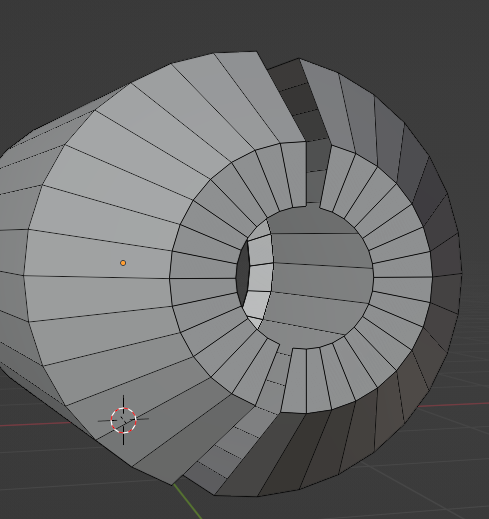

6. 挤出+修改高度

   ```
   FUN1:
   点模式
   E
   S
   G
   Y
   FUN2:
   点模式
   G
   Y
   E
   S
   ```

   

7. 添加表面细分

    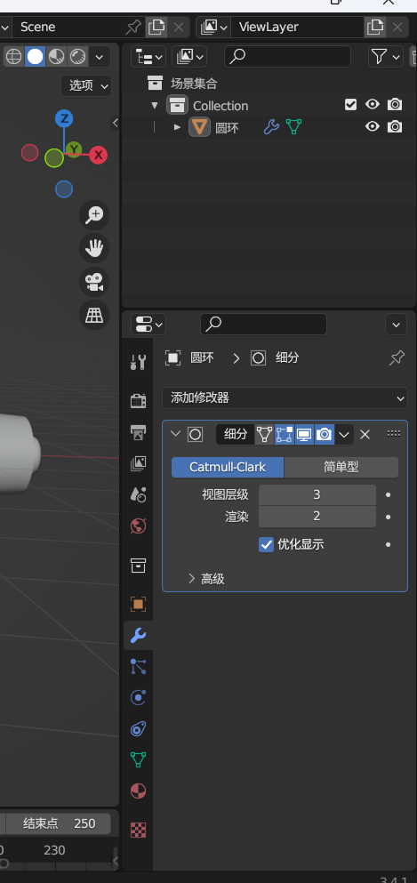

8. 加入循环边

   可以使之更硬、软

   ```
   TAB
   CTRL+R
   ```

   

**二、制作机翼**

```
SHIFT+A
新建平面
E拉伸
CTRL+B制作倒角
```

```
SHIFT+A
新建平面
TAB
1 进入点模式
选择两个顶点
CTRL+SHIFT+B 平面做倒角
```


2. 创建支持架

   ```
   CTRL+J //创建连接体
   ```

3. 镜像

   选择要镜像的物体，添加镜像属性。然后选择镜像物体（对称物体）

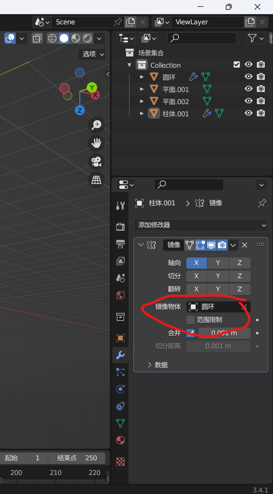

4. 内插面

```
I
```

```
E
G
S
```

**三、涡轮扇叶制作**

1. 实现思路：将一个圆环拉伸，选中侧面，然后再把侧面线条拉伸、放大

2. 实现步骤

   ```
   新建圆环
   E  //拉伸
   ALT+Z
   选中侧面
   E
   S放大
   ```

   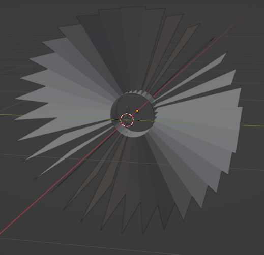

3. 添加厚度（实体化）

   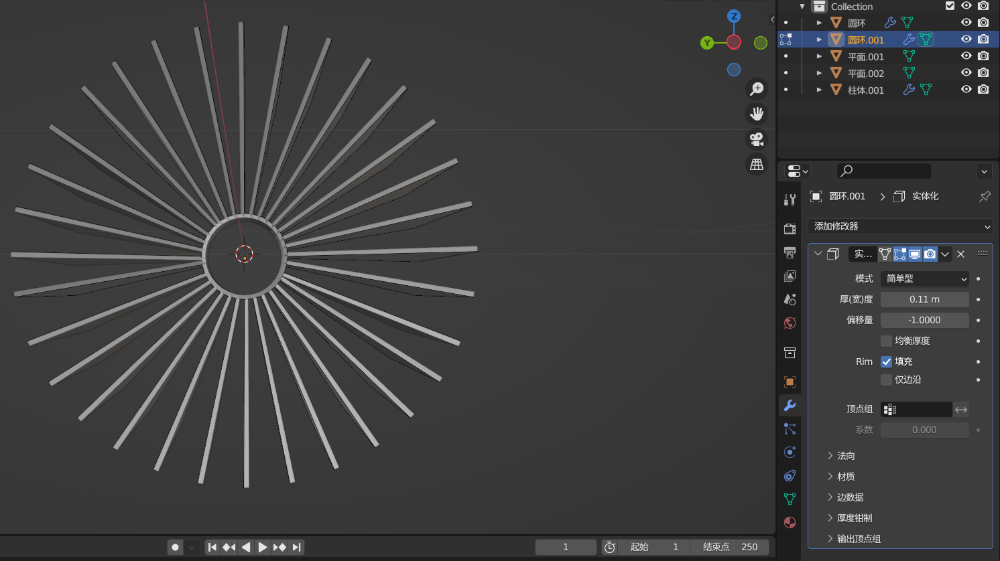

## 渲染与导出

1. 新建摄像机

   ```
   shift + a
   ```

2. 选择合适视角，依次选择：视图-对其视图-活动相机对齐当前视角

3. 锁定视图，依次：n-锁定摄像机到视图方位

第3步可以将视图锁定，不会随着操作而移动，取景框（视图）内呈现的即为相机渲染的。

4. 渲染，导出

   ```
   F12
   ```


# 动画

## 绑定骨骼

一、首先创建骨骼：

1. 在物体模式下，新建单段骨骼。然后将轴向调整到1。**进入编辑模式（把所有的骨骼看成一个物体），按F2修改名字**。

   在单段骨骼中，**大头叫“头”，小头叫“尾”，从尾巴挤出的骨骼作为子集**，子集会根据父级运动。而从头部挤出的骨骼不会有父级。

   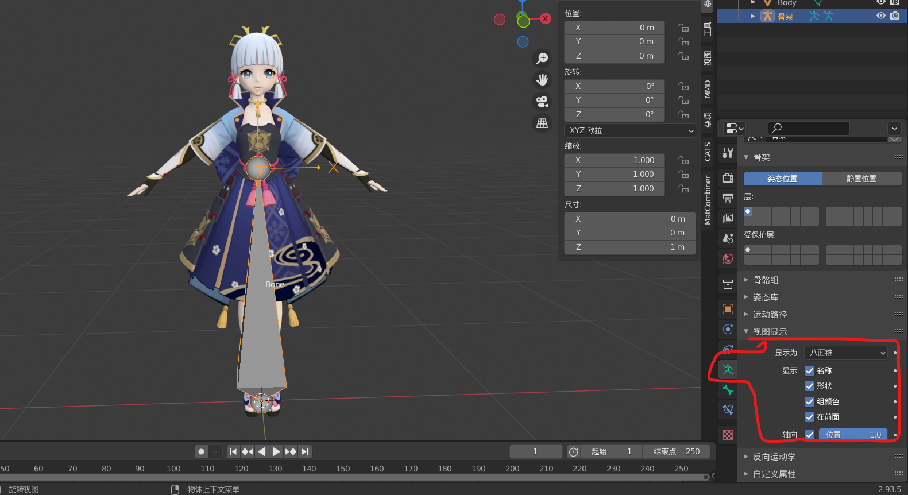

   调整至合适位置，这个根骨的修改器里面，**不要选择形变，因为这是控制其他骨骼的根骨，不需要绑定权重**

   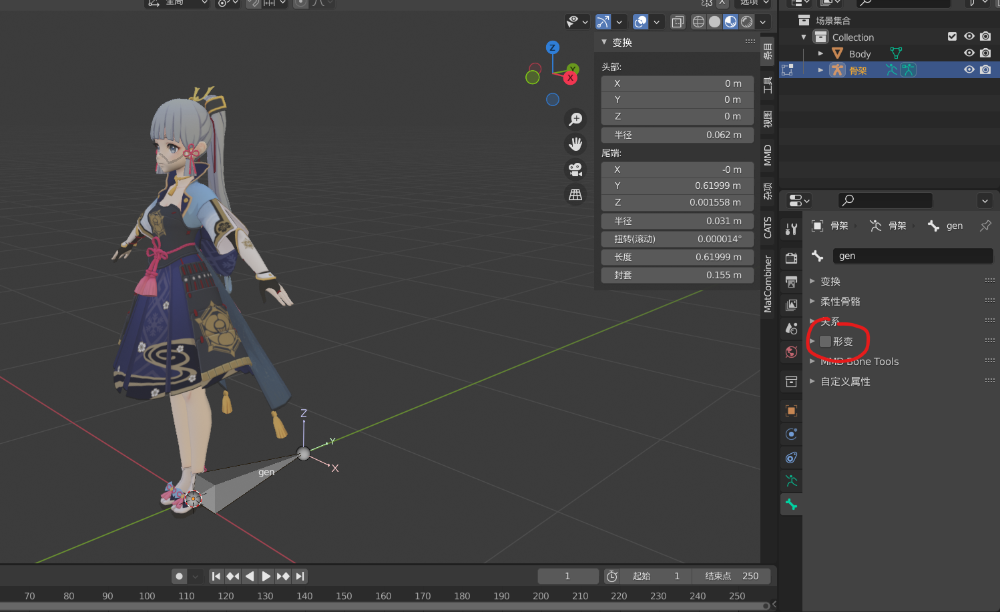

2. 创建上半身。**在编辑模式下**，shift+d复制根骨骼，按e挤出，到合适位置。这些骨骼在**修改器里**要选择形变，进而后续可以附加权重

   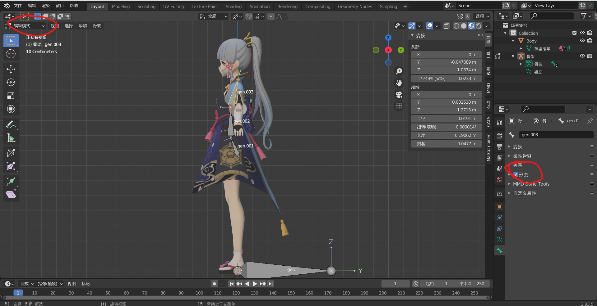

3. 创建腿部骨骼。选中臀部骨骼，复制，不要选择挤出。alt+f上下翻转骨骼。为了保证后面做动画时骨骼不会异常，最好是**在修改器中选择扭转，保证骨骼的z轴朝前。或者是ctrl+r扭转**。然后依次挤出腿部骨骼

   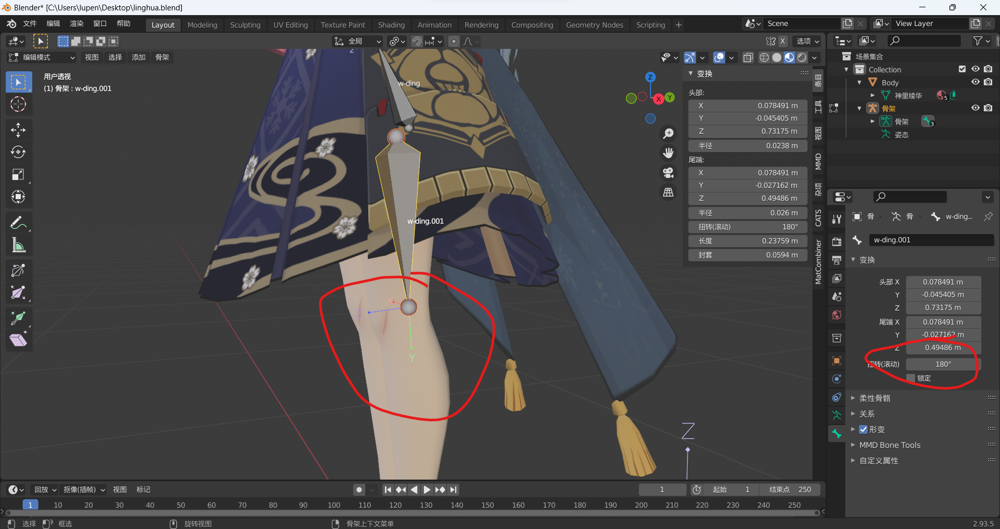

4. 为大腿骨创建父级关系。新创建的大腿骨是没有父级的，所以，**先选中大腿骨，然后选择根骨，CTRL+p，选择偏移量，将根骨作为大腿骨的父级**。ctrl+p的逆效果是：选中骨骼，alt+p然后“断开骨骼链接”，这种一般是连续挤出是，使用alt+p切换到"保持偏移量"，这样可以保持父级不变

   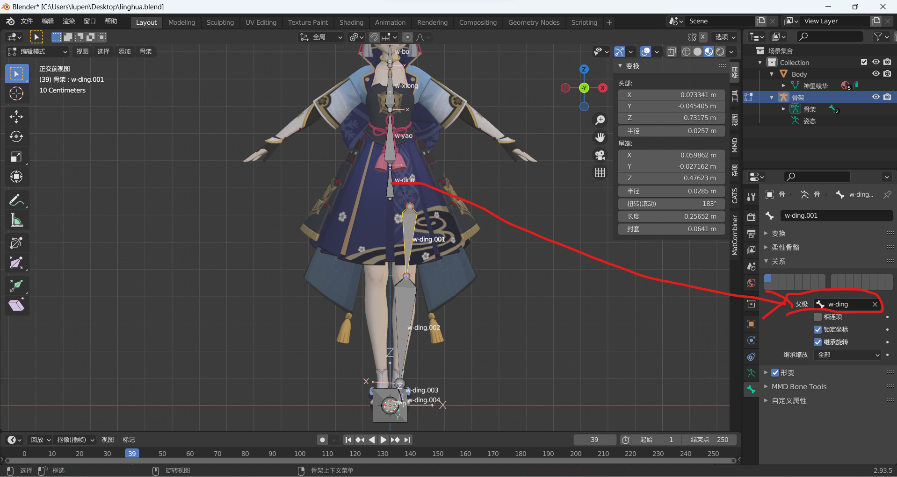

   这种“保持偏移量”的父子关系既可以移动子集，也可以父级控制子集

   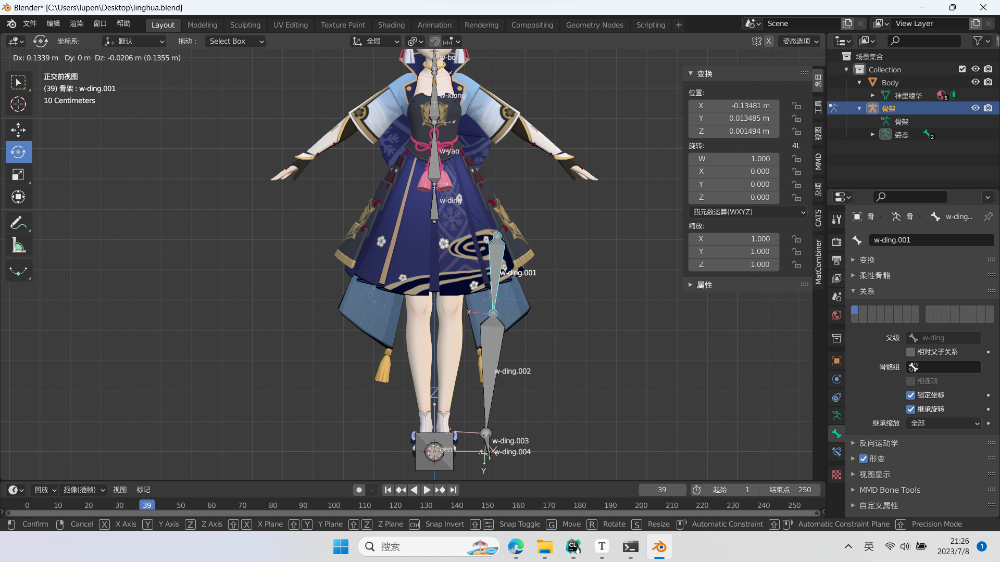

5. 骨骼对称。在编辑模式下，a全选骨骼，然后右键”对称“。前提是需要对称的骨骼需要加”.L“

   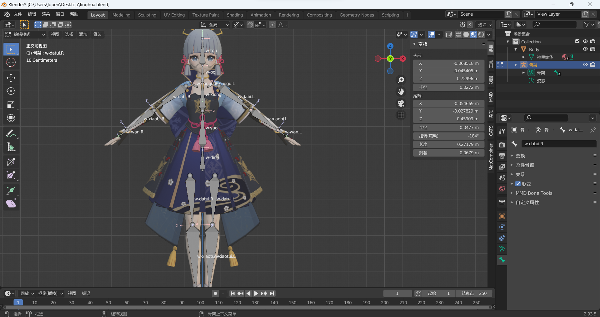

二、绑定骨骼

1. 绑定骨骼，附带自带权重。**在物体模式下，先选中网格，然后选中骨骼，CTRL+p，附带自动权重**，做完这一步后，**选择模型网格**，就会发现创建了顶点组，也就是每个骨骼影响的点。

   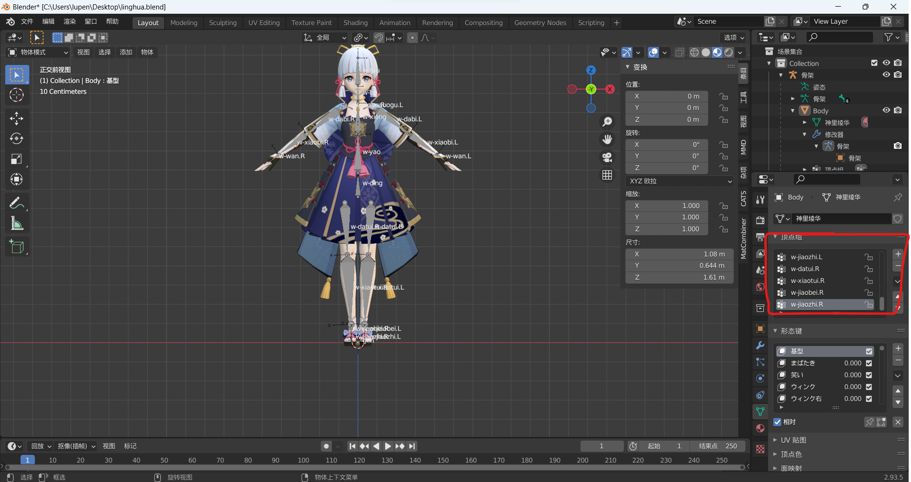