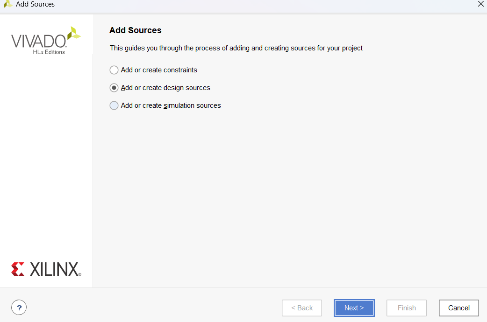
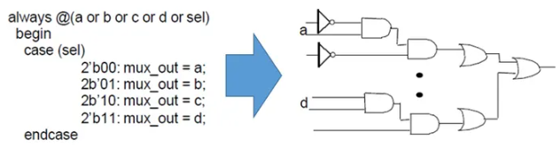
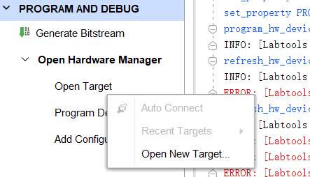
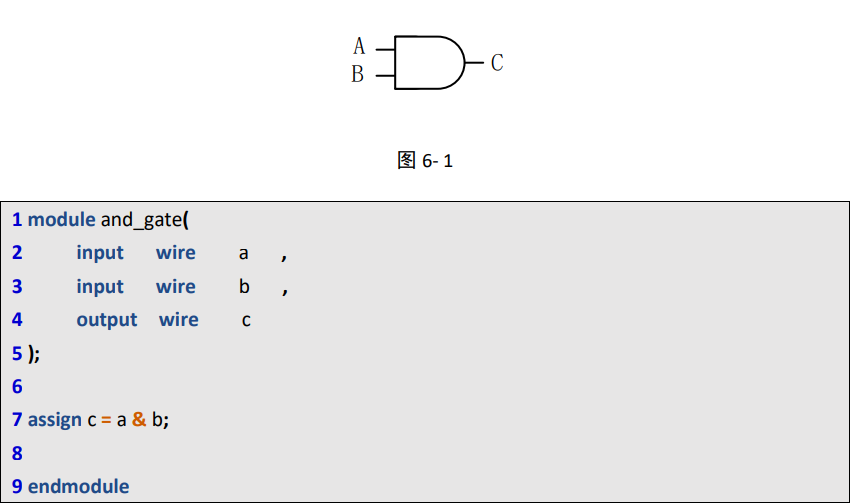
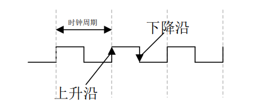
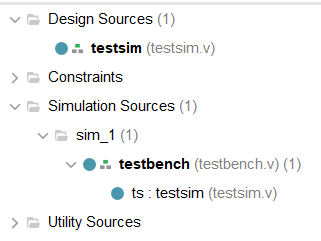
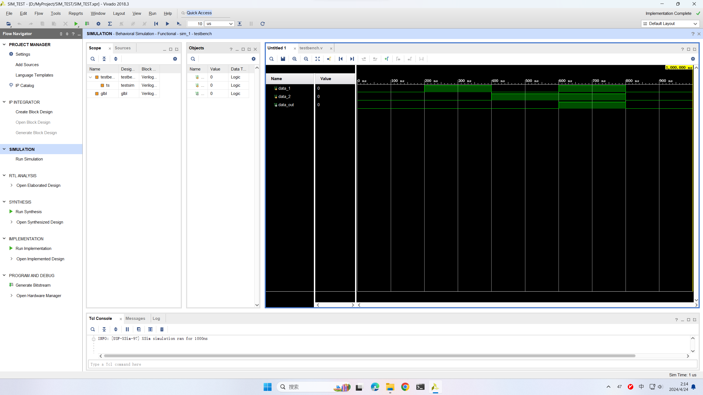

# Software Basic

## 界面

-  source：工程数据文件窗口，可以看到工程的层次结构
- project summary：主工作窗口，根据不同的layout有不同的显示内容

## hello world

###  创建项目

1. create new project

2. 写project name ,标记**create project subdirectory**，防止子文件夹把其他的给覆盖了

3. RTLproject

4. 不用添加约束及源文件

5. 选择板子型号

   Z7-Lite7010选择：

   - family：zynq-7000
   - package：clg400
   - 速度等级：1

6. 最左侧的`FLOW NAVIGATOR`中包含了项目所需要的设置、综合、运行、打开硬件管理器等功能.

   - project manager中包含了添加**源文件**，比如添加管脚约束、verilog源文件等

     

   - Synthesis表示综合，**将高级抽象层次的电路描述转换为较低层次的描述。**也就是将语言描述的电路逻辑转换为**与门、或门、非门、触发器**等基本逻辑单元的互联关系。如下图的四选一电路：

     

   - implement表示**实现**，implementation是一个place和route的过程，也就是布局布线。综合后的门级网表只是表示了门与门之间的虚拟连接关系，并没有规定每个门的位置以及连接线的长度等。布局布线就是一个将门级网表中的门的位置以及连线信息确定下来的过程

     

     FPGA中包含众多的**可配置逻辑块（CLB）、丰富的布线资源以及其他资源**

     - 布局：将门级网表中的每一个门“放置”到CLB中，这是个映射的过程。
     - 布线：利用FPGA中的丰富的布线资源将CLB根据逻辑关系连接在一起的过程

   - project  and debug：包括generate bitstream，即生成字节流

7. 下载到板子

   点击`open hardware manager`，`open target`，`Auto Connect`

   

### v代码

```verilog
`timescale 1ns / 1ps
//////////////////////////////////////////////////////////////////////////////////
// Company: 
// Engineer: 
// 
// Create Date: 2024/03/22 22:30:18
// Design Name: 
// Module Name: led_flash
// Project Name: 
// Target Devices: 
// Tool Versions: 
// Description: 
// 
// Dependencies: 
// 
// Revision:
// Revision 0.01 - File Created
// Additional Comments:
// 
//////////////////////////////////////////////////////////////////////////////////


module led_flash(
input wire clk,
input wire rst_n,
output reg [1:0] led
    );


reg [27:0] cnt;

wire add_cnt ;
wire end_cnt ;

always @(posedge clk or negedge rst_n)begin
    if (rst_n==1'b0)begin
        cnt<='d0;
    end
    else if (add_cnt)begin
        if (end_cnt)
            cnt<='d0;
        else
            cnt<=cnt+1'b1;
        
    end
end

assign add_cnt = 1;
assign end_out = add_cnt && cnt ==10_000_000 -1;


always @(posedge clk or negedge rst_n)begin
    if(rst_n==1'b0)begin
        led<=2'b10;
    end
    else if(end_cnt)begin
        led<={led[0],led[1]};
    end
    else begin
        led<=led;
    end
end

endmodule


```


### 管脚约束

```
create_clock -period 20.000 [get_ports clk]
set_property PACKAGE_PIN N18 [get_ports clk]

set_property IOSTANDARD LVCMOS33 [get_ports clk]
############## key define##################
set_property PACKAGE_PIN P16 [get_ports rst_n]
set_property IOSTANDARD LVCMOS33 [get_ports rst_n]
##############LED define##################
set_property PACKAGE_PIN P15 [get_ports {led[0]}]
set_property PACKAGE_PIN U12 [get_ports {led[1]}]
set_property IOSTANDARD LVCMOS33 [get_ports rst_n]
set_property IOSTANDARD LVCMOS33 [get_ports {led[*]}]
set_property IOSTANDARD LVCMOS33 [get_ports clk]
```


# Verilog语法

## 模块

FPGA中是以模块为基础的，每一个**可综合**的.v文件都是一个模块，由module-endmodule来声明，在这两个关键字内部，完成模块的功能。如下：与门。




## 变量类型

### 常量

常量分为整形、实数型、字符串型、参数四类

整形：二进制（b，B）、十进制（d，D）、十六进制（h，H）、八进制（o，O）

表示方法：

- <位宽>'<进制><数字>

  如：`2'b10`表示二位二进制数。

- ~


### wire

wire型变量在物理结构上只是一根线，使用assign对线进行赋值。


### reg

reg型变量左边有一个输入端口D，右端有一个输出端口Q，并且reg型存储数据需要在clk时钟控制下完成。**clk也就是方波**，由晶振产生，是我们描述数字电路最基本的时间单元，周期固定，占空比为50%。



## Simulation

仿真的文件夹如下：



在源文件中添加verilog文件，作为模块。

然后在simulation sources中添加测试文件。

**源文件：**

```
`timescale 1ns / 1ps

module testsim(a,b,s,y);
  input   a,b,s;
  output reg  y;   // y在always块中被赋值，一定要声明为reg型的变量

  always @ (*)
    if(s==0)
      y = a;
    else
      y = b;
endmodule

```

测试文件：

```
`timescale 1ns / 1ps

module testbench;
reg data_1,data_2;

wire data_out;
testsim ts(
.a(data_1),
.b(data_2),
.s(data_1),
.y(data_out)
);
initial begin //描述数据流的变化
data_1 = 0;data_2 = 0;
#200
data_1 = 1;data_2 = 0;
#200
data_1 = 0;data_2 = 1;
#200
data_1 = 1;data_2 = 1;
#200
data_1 = 0;data_2 = 0;
#200
$stop;
end

endmodule

```

这段代码是一个 Verilog 仿真测试台代码，用于测试一个 **模块**。下面是代码的简要解释：

1. `timescale 1ns / 1ps`：设置时间单位为纳秒和时间精度为皮秒。**其中步长（一个时间单位为1ns）**

2. `module nand_gate_testbench;`：定义了一个名为 `nand_gate_testbench` 的模块。

3. `reg data_1, data_2;`：定义了两个输入寄存器 `data_1` 和 `data_2`，用于输入给 NAND 门。

4. `wire data_out;`：定义了一个输出线型 `data_out`，用于从 NAND 门获取输出。

5. `nand_gate nand_gate_dut(...);`：实例化了一个名为 `nand_gate_dut` 的 NAND 门模块，并连接了输入和输出。

6. `initial begin ... end`：在仿真开始时执行其中的代码块。

7. `data_1 = 0; data_2 = 0;`：将输入初始化为 0。

8. `#200`：等待 200 个时间单位。

9. `data_1 = 1; data_2 = 0;`：将输入变为 1 和 0。

10. 后续几行代码类似地改变输入，并在每次改变后等待 200 个时间单位。

11. `$stop;`：系统任务，表示仿真停止。

这段代码的作用是在仿真环境中对 模块进行测试，通过改变输入值来观察输出值的变化，从而验证模块的功能是否正确。

**关键点在于：在测试文件中实例化这个模块，然后对应好接口。**

