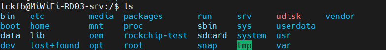
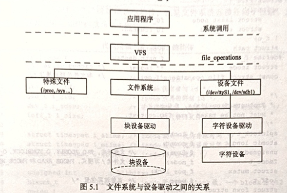
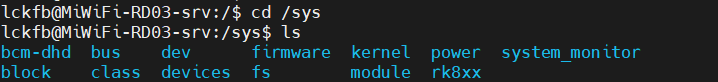
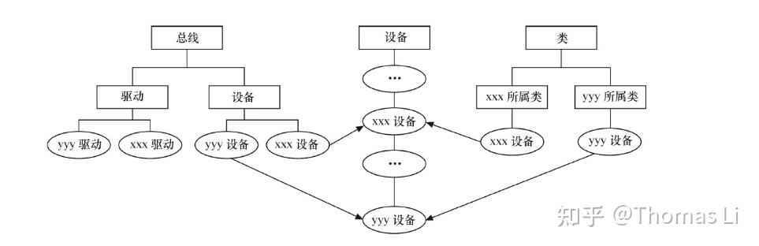
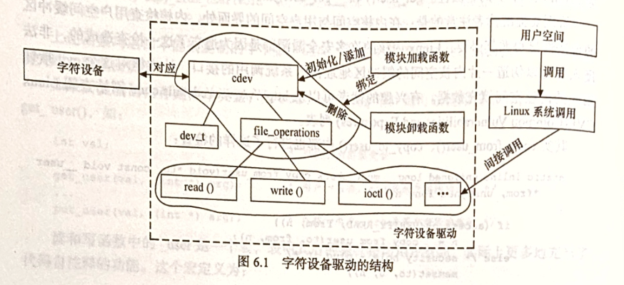
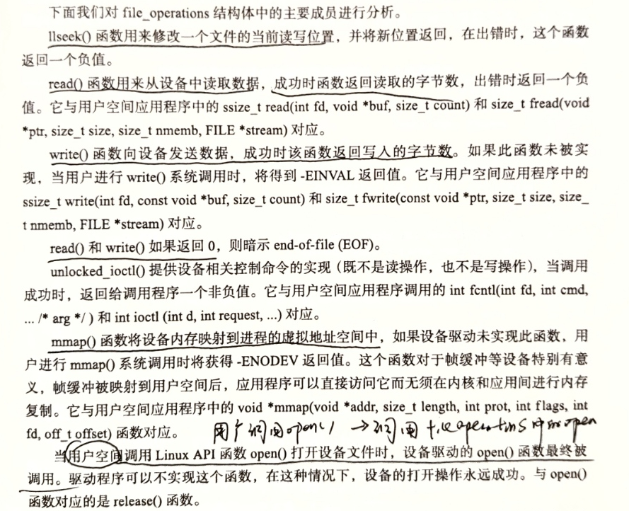
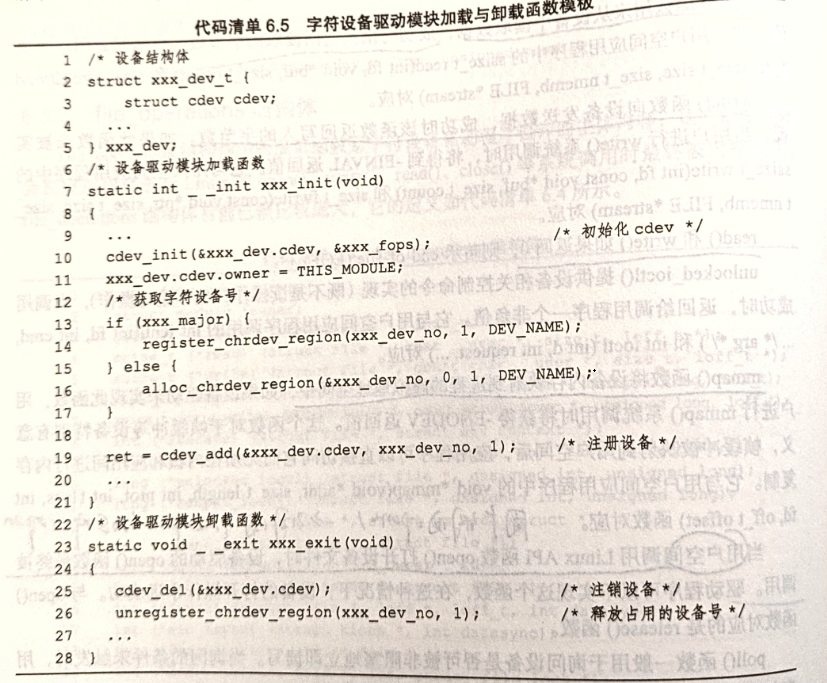
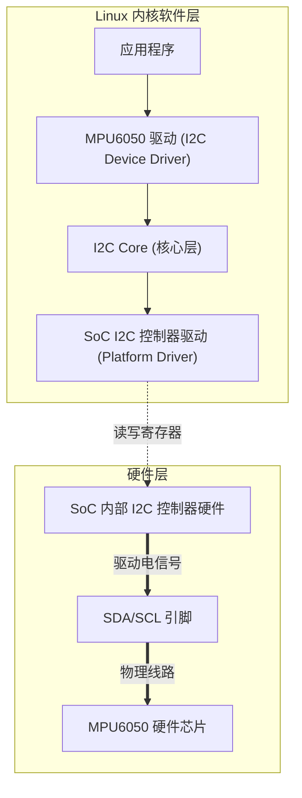
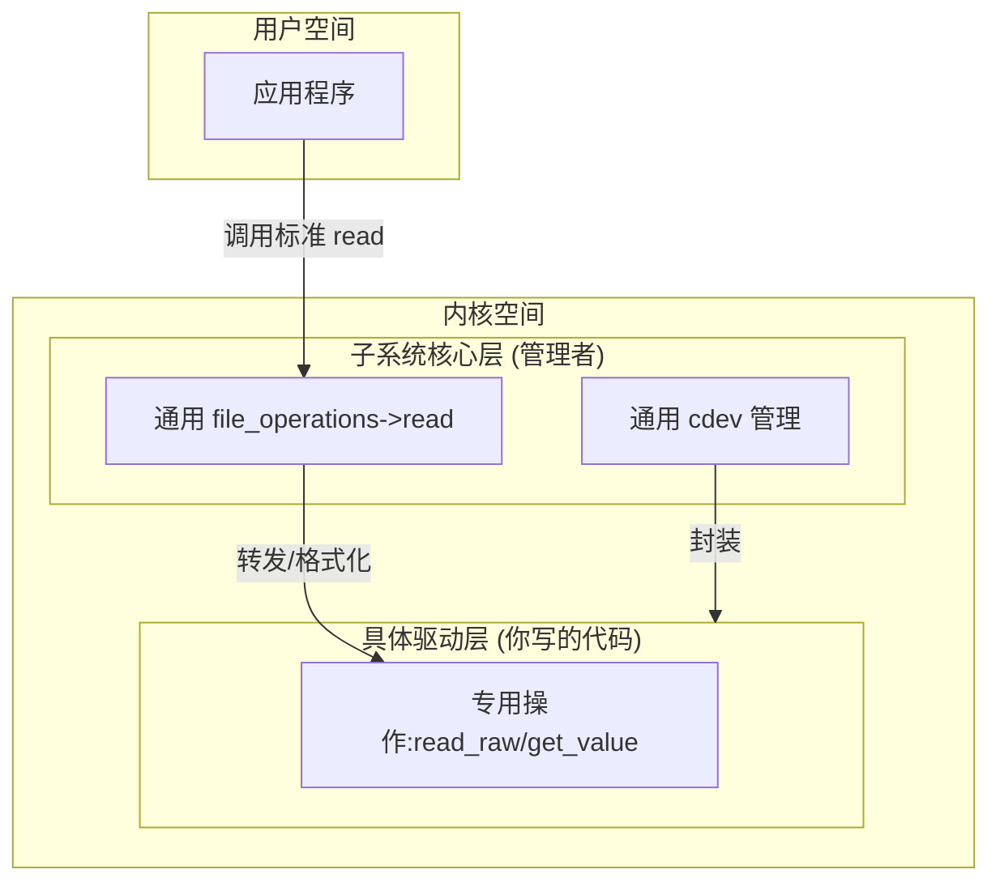
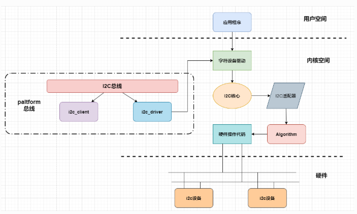

# Linux文件系统与设备文件


## 文件系统

### 文件操作与系统调用


## Linux文件系统

文件系统目录结构：



- /bin：包括基本的命令，如ls、cp、mkdir，所有文件都是可执行的
- /sbin：系统命令，如modprobe、hwclock、ifconfig等
- /dev：设备文件存储目录
- /etc：系统配置文件所在，如/etc/profile为系统级的环境变量
- /lib：系统库文件存放的目录
- /mnt：挂载存储设别的挂载目录
- /proc：**操作系统运行时**，进程以及内核信息放在这里
- /tmp：存放临时文件
- /usr：unix system resources，系统存放程序的目录，比如用户命令，用户库等
- /sys：Linux2.6之后支持的sysfs文件系统被映射到这个目录上，总线、驱动和设备都可以在sysfs中找到对应的节点。


## VFS虚拟文件系统

让用户和应用程序以一致的方式操作文件系统。

应用程序和VFS之间的接口是系统调用，而VFS与【文件系统和设备文件】之间的接口是`file_operations`结构体成员函数，这个结构体包含对文件的打开、关闭、读写、控制的一系列成员函数。



### file结构体

表示一个打开的文件，系统中每个打开的文件都会在内核空间中有一个关联的struct file。由内核在打开文件时创建，并传递给文件上进行操作的任何函数。

### inode结构体

VFS inode包含文件访问权限、属主、组、大小、生成时间等信息。

**是Linux管理文件的最基本的单位。**


## devfs（aborted）

devfs设备文件系统，由Linux2.4内核引入，可以使得设备驱动程序可以自主的管理自己的设备文件。


## udev

> 和devfs（内核态）相比，udev在用户态工作

工作方式：利用设备加入或删除时内核所发送的热插拔事件（hotplug event），在热插拔时，设备的详细信息会由内核通过netlink套接字发送出来，发送的事件叫做uevent。

udev的设备命名策略、权限控制、事件处理都是在用户态下完成的。

> /sys：Linux2.6之后支持的sysfs文件系统被映射到这个目录上，总线、驱动和设备都可以在sysfs中找到对应的节点。

sysfs的一个目的就是展示设备驱动模型中各组件的层次关系，顶级目录包括：block、bus、dev、firmware等。

- block：包括所有的块设备
- devices：包括系统所有的设备，并根据设备挂接的总线类型组织成层次结构
- bus：包括系统中所有的总线类型
- class：系统中的设备类型，如网卡、声卡、输入设备等



---

> PCI：即 Peripheral Component Interconnect，是一种用于计算机的局部总线标准 ，旨在让计算机内部不同硬件组件实现高效数据传输与通信。
>
> PCI广泛用于连接各种扩展卡，如网卡、声卡、显卡、SCSI 卡、USB 控制器等。这些扩展卡插入 PCI 插槽，实现计算机功能扩展。例如，通过插入独立网卡，可提升计算机网络连接性能；插入专业声卡，满足音频处理的高要求。

在sys/bus下的各种pci总线子目录中，又会分出drivers和devices目录，devices目录中的文件是对/sys/devices目录中文件的符号链接。sys/class目录下也包含许多对/sys/devices下文件的链接。如下图。



虽然拓扑很复杂，但是在大多数情况下，Linux2.6内核中的设备驱动核心代码可以处理这些关系。驱动工程师在**编写底层驱动的时候几乎不需要关注设备模型，只需要按照每个框架的要求，填充xxx_driver中的各种回调函数即可，其中xxx是总线的名字。**

在Linux内核中，分别使用bus_type、device_driver和device来描述总线、驱动和设备。这三个结构体的定义在`include/linux/device.h`中。

**device_driver和device分别表示驱动和设备，这两者必须依附于一种总线**，因此都包含struct bus_type指针。在Linux内核中，设备和驱动是分开注册的，注册一个设备的时候，并不需要驱动已经存在；注册一个驱动的时候，也不需要对应的设备已经被注册。**设备和内核各自涌向内核，由bus_type的match()函数将两者捆绑在一起。**一旦配对成功，xxx_driver的probe()函数就会执行。

---

udev的工作过程如下：

1. 当内核检测到系统中出现了新设备时，内核通过netlink套接字发送uevent。
2. udev获取内核发送的信息，并进行规则的匹配，然后启动相应的驱动。匹配的事物包括：SUBSYSTEM、ACTION、attribute、内核提供的名称（KERNEL=）以及其他的环境变量。

---


# 字符设备驱动



## 字符设备驱动结构

**主要工作：初始化、添加和删除cdev结构体，申请和释放设备号，以及填充file_operations结构体中的操作函数，实现file_operations结构体中的read、write、ioctl等函数。**

### cdev结构体

在Linux内核中，**使用cdev结构体描述一个字符设备**：

```
struct cdev {
    struct kobject kobj;
    struct module *owner;
    const struct file_operations *ops;
    struct list_head list;
    dev_t dev;
    unsigned int count;
};
```

- dev_t是一个整数类型，为32位，12位为主设备号，20位为次设备号。可以通过MAJOR(dev)和MINOR(dev)来获取主设备号和次设备号
- file_operations：定义了字符设备驱动提供给虚拟文件系统的接口函数

---

Linux内核提供了一组用于操作cdev结构体的函数：

1. `void cdev_init(struct cdev *cdev, const struct file_operations *fops)`

   初始化cdev结构体实例，将传入的file_operation结构体赋值给cdev的ops成员，并对kobject进行初始化。

2. `int cdev_add(struct cdev *p, dev_t dev, unsigned int count)`

   向内核系统添加一个字符设备，该函数将cdev结构体注册到内核的字符设备管理子系统中，使得内核能识别并管理这个字符设备。

3. `struct cdev *cdev_alloc(void)`

   分配一个新的cdev结构体实例，并对其进行初始化。

---

### 分配和释放设备号

**在使用cdev_add函数向系统注册字符设备之前，应该首先调用register_chrdev_region()或者alloc_chrdev_region()函数向系统申请设备号。**


### file_operations结构体

该结构体中的函数实际上会在应用程序调用Linux中的open、write、read、close等系统调用的时候，被内核调用。也就是说，应用程序调用open这些系统调用的时候，会间接地调用file_operations的函数。

定义如下：

```
struct file_operations {
    struct module *owner;
    loff_t (*llseek) (struct file *, loff_t, int);
    ssize_t (*read) (struct file *, char __user *, size_t, loff_t *);
    ssize_t (*write) (struct file *, const char __user *, size_t, loff_t *);
    ssize_t (*read_iter) (struct kiocb *, struct iov_iter *);
    ssize_t (*write_iter) (struct kiocb *, struct iov_iter *);
    int (*iterate) (struct file *, struct dir_context *);
    unsigned int (*poll) (struct file *, struct poll_table_struct *);
    long (*unlocked_ioctl) (struct file *, unsigned int, unsigned long);
    long (*compat_ioctl) (struct file *, unsigned int, unsigned long);
    int (*mmap) (struct file *, struct vm_area_struct *);
    int (*open) (struct inode *, struct file *);
    int (*flush) (struct file *, fl_owner_t id);
    int (*release) (struct inode *, struct file *);
    int (*fsync) (struct file *, loff_t, loff_t, int datasync);
    int (*aio_fsync) (struct kiocb *, int datasync);
    int (*fasync) (int, struct file *, int);
    int (*lock) (struct file *, int, struct file_lock *);
    ssize_t (*sendpage) (struct file *, struct page *, int, size_t, loff_t *, int);
    unsigned long (*get_unmapped_area)(struct file *, unsigned long, unsigned long, unsigned long, unsigned long);
    int (*check_flags)(int);
    int (*flock) (struct file *, int, struct file_lock *);
    ssize_t (*splice_write)(struct pipe_inode_info *, struct file *, loff_t *, size_t, unsigned int);
    ssize_t (*splice_read)(struct file *, loff_t *, struct pipe_inode_info *, size_t, unsigned int);
    int (*setlease)(struct file *, long, struct file_lock **, void **);
    long (*fallocate)(struct file *file, int mode, loff_t offset,
                      loff_t len);
    void (*show_fdinfo)(struct seq_file *m, struct file *f);
    #ifdef CONFIG_SECURITY
    int (*security)(struct inode *, struct file *, int, void *);
    #endif
    int (*fadvise)(struct file *, loff_t, loff_t, int);
};
```




### Linux字符设备驱动的组成

1. 字符设备模块加载与卸载函数

   - 在加载函数中，应该实现设备号的申请和cdev的注册
   - 在卸载函数中，应该实现设备号的释放和cdev的注销

   

2. 字符设备驱动的file_operations结构体中的成员函数

   设备驱动的读函数中，filp 是文件结构体指针，buf 是用户空间内存的地址，该地址在内核空间不宜直接读写，count 是要读的字节数，f_pos 是读的位置相对于文件开头的偏移。

   设备驱动的写函数中，filp 是文件结构体指针，buf 是用户空间内存的地址，该地址在内核空间不宜直接读写，count 是要写的字节数，f_pos 是写的位置相对于文件开头的偏移。

   由于用户空间不能直接访问内核空间的内存，因此借助了函数 copy_from_user () 完成用户空间缓冲区到内核空间的复制，以及 copy_to_user () 完成内核空间到用户空间缓冲区的复制，见代码第 6 行和第 14 行。


## global虚拟设备

这个是为了方便讲解，虚构出来的设备

### 头文件、宏、设备结构体


### 加载与卸载设备驱动

首先完成设备号的申请，然后进行cdev的初始化和添加。

globalmem设备驱动的文件操作结构体：

```
static const struct file_operations globalmem_fops = {
    .owner = THIS_MODULE,
    .llseek = globalmem_llseek,
    .read = globalmem_read,
    .write = globalmem_write,
    .unlocked_ioctl = globalmem_ioctl,
    .open = globalmem_open,
    .release = globalmem_release,
};
```


### seek函数

### ioctl函数

> 1.是 Unix/Linux 系统中用于**对设备文件或文件描述符执行底层 I/O 控制操作**的核心系统调用，本质是一种 “万能接口”—— 用于实现标准 I/O 函数（`read`/`write`/`open`等）无法覆盖的、设备特定的控制逻辑。
>
> 2.标准 I/O 函数（`read`/`write`）的语义是 “读写数据流”，而 `ioctl` 用于处理**非数据流类的控制操作**，比如：
>
> - 配置设备参数（如串口波特率、网卡 IP、磁盘分区表）；
> - 获取设备状态（如摄像头分辨率、打印机耗材余量）；
> - 触发设备特定动作（如 U 盘弹出、声卡静音、终端清屏）；
> - 底层硬件控制（如 GPIO 引脚电平、I2C 设备通信）。
> 简单说：`read`/`write` 负责 “数据传输”，**`ioctl` 负责 “设备控制”。**

1.globalmem设备驱动的ioctl函数

I/O控制函数：

```c
static long globalmem_ioctl(struct file *filp, unsigned int cmd,
        unsigned long arg)
{
    struct globalmem_dev *dev = filp->private_data;

    switch (cmd) {
    case MEM_CLEAR:
        memset(dev->mem, 0, GLOBALMEM_SIZE);
        printk(KERN_INFO "globalmem is set to zero\n");
        break;
    default:
        return -EINVAL;
    }
    return 0;
}
```

---

2.ioctl命令


### 使用文件私有数据

大多数Linux驱动遵循着潜规则，即**将文件的私有数据private_data指向设备结构体，再用read、write、ioctl、llseek等函数通过private_data访问设备结构体。**

即使用`struct globalmem_dev *dev = filp->private_data`获取globalmem_dev的实例指针。

私有数据的设置是在global_open中设置的，即：

```c
static int globalmem_open(struct inode *inode, struct file *filp)
{
    filp->private_data = globalmem_devp;
    return 0;
}
```

优点：在驱动多个相同的设备的时候，不需要更改驱动函数的具体实现，只需要在globalmem_init中增加多个设备驱动的支持即可，体现了面向对象的思想。


### container_of函数

该函数的作用是通过结构体成员的指针找到对应结构体的指针。如 `container_of(inode->i_cdev, struct globalmem_dev, cdev)`，传给函数的第一个参数是结构体成员的指针，第2个是整个结构体的类型，第三个是第一个参数的类型。返回为整个结构体的指针。


# 设备树

设备树由一系列被命名的节点和属性组成，节点的本身可以包含子节点。

属性：

- cpu的数量和类别
- 内存基地址和大小
- 总线和总桥
- 外设连接
- 中断控制器和中断使用情况
- gpio控制器和gpio的使用情况
- 时钟控制器和时钟的使用情况

---

“设备树”就是画一颗电路板上的cpu、总线、设备组成的树，bootloader会将这棵树传递给内核，然后内核可以识别这棵树，并根据设备树展开出Linux内核中的platform_device、i2c_client、spi_device等设备，而这些设备用到的内存、IRQ等资源，也被传递给了内核，内核会将这些资源绑定给展开的相应设备。


## 设备树的组成和结构

### DTS、DTC、DTB等

1.dts是设备树的源文件

**设备树必须要包含根节点，否则会报语法错误**

```c
/dts-v1/;  // 版本声明（必须在第一行，分号不能少）
#include "r.dtsi"
```

其中dtsi为设备树的头文件：

```c
/dts-v1/;
/{
    model = "hello world";
};
```

但是要注意的时，虽然dts支持c的include语法，但是dtc是无法直接编译的，需要使用预处理命令将include展开：

```shell
cpp -nostdinc -I. -x assembler-with-cpp rk.dts > rk.dtb.dts.tmp
```

---

**根节点**

设备树的根节点是设备树结构中的顶层节点，也是整个设备树的入口点

```
/dts-v1/; // 指定这是一个设备树文件的版本（v1）

/ {// 根节点定义开始
    /* 这里是根节点，它代表整个设备树的基础。
       在这里可以定义一些全局属性或者包含更多的子节点。 */
}; // 根节点定义结束
```

---

**子节点**

```
标签: 节点名@单元地址 { // 标签: 和 @单元地址不是必须
    子节点名1 {
        子节点1的子节点 {
        };
    };

    子节点名2 {
    };
};
```

- 子节点不能有/符号，/只有根节点才可以有

- **同一层级的节点名不能相同**：

  ```c
  ///错误演示
  /dts-v1/;
  
  /{
          node1{ //节点命相同
                  child_node{
                  };
          };
          node1{//节点命相同
          };
  };
  ```

  ```c
  // 正确演示 在同一层级外，是可以同名的
  /dts-v1/;
  
  /{
          node1{
                  child_node{//节点命相同
                  };
          };
          node2{
                  child_node{//节点命相同
                  };
          };
  };
  ```

---

**节点名不可以重复**

节点名称中可以包含系欸但所代表的地址信息和类型，例如，i2c@1c2c0000指的是位于1c2c0000位置的I2C控制器。**注意注意：这个并不是实际寄存器只是拿来看的增加可读性和避免命名冲突的，并不表明节点名可以重复。**以下用法合理，节点名不同。

```
/dts-v1/;

/ {
    // 串口设备示例，地址不同
    serial@80000000 {
    };
    // 串口设备示例，地址不同
    serial@90000000 {
    };
    // I2C 控制器及设备示例
    i2c@91000000 {
    };
    // USB 控制器示例
    usb@92000000 {
    };
};
```

---

**标签**

标签在节点名字中不是必须的，但是可以通过标签来更方便的操作节点，在设备树文件中有大量使用。

下面例子中定义了标签，并通过引用uart1标签方式往serial@80000000中追加一个node_add2节点：

```
/dts-v1/;

/ {
    // 串口设备示例，地址不同，uart1是标签
    uart1: serial@80000000 {
        node_add1{
        };
    };
    // 串口设备示例，地址不同，uart2是标签
    uart2: serial@90000000 {
    };
    // I2C 控制器及设备示例，i2c1是标签
    i2c1: i2c@91000000 {
    };
    // USB 控制器示例，USB是标签
    usb1: usb@92000000 {
    };
};

&uart1{ // 通过引用标签的方式往 serial@80000000 中追加一个节点非覆盖。
    node_add2{
    };
};
```


---

2.DTC 设备树编译器

可以将.dts编译为.dtb的工具，源代码位于内核的scripts/dtc中，在Linux使能了设备树的时候，编译内核会将DTC编译出来。

```
dtc -I dts -O dtb -o re.dtb rk.dtb.dts.tmp
```

- -I 表示输入的类型
- -O 表示输出类型
- -o 表示输出文件名字
- 后面跟要处理的文件

---

3.dtb

.dtb是被编译后的二进制格式的设备树描述，可以由Linux内核解析，uboot这种bootloader也是可以识别.dtb的。

**通常在为电路板制作nand、SD启动镜像时，会为.dtb单独留下一个很小的区域存放，之后bootloader在引导内核的过程中，会先读取该.dtb到内存。**

---


### bootloader


# Linux设备驱动的软件架构思想

驱动只管驱动，设备只管设备，总线负责匹配设备和驱动，驱动则以标准途径拿到板级信息。

## platform总线

总线将设备和驱动绑定，在系统每注册一个设备的时候，会寻找与之匹配的驱动，相反的，在系统每注册一个驱动的时候，会寻找与之匹配的设备，而匹配则由总线完成。

1. platform 总线的作用
- **抽象硬件细节**：将硬件设备的具体实现细节进行抽象，使得驱动开发者无需过多关注底层硬件的物理特性，如硬件寄存器地址、中断线连接等。驱动通过 platform 总线提供的接口来访问硬件资源，从而提高驱动的可移植性。**例如，不同型号的开发板可能使用不同的硬件电路来实现 SPI 控制器，但通过 platform 总线，驱动开发者可以以统一的方式访问 SPI 设备，而无需关心具体硬件差异。**
- **简化设备驱动管理**：提供了一种统一的设备驱动模型，简化了内核中设备和驱动的管理。系统启动时，内核会扫描并注册所有的 platform 设备，然后尝试将它们与已注册的 platform 驱动进行匹配。一旦匹配成功，内核就会调用驱动的相应函数来初始化和操作设备。这种机制使得设备的添加、删除和管理变得更加容易。例如，当插入一个新的 USB 设备时，platform 总线能够自动检测并将其与对应的 USB 驱动进行匹配，完成设备的初始化。
- **支持资源共享**：允许设备间共享诸如中断线、内存区域等硬件资源。通过合理的资源分配和管理，提高系统资源的利用率。例如，多个 I2C 设备可能共享同一个 I2C 控制器，platform 总线可以协调这些设备对 I2C 控制器的访问。

---

2. platform 总线的组成部分

- **platform 设备（platform_device）**：代表系统中的物理设备，是 platform 总线模型中的设备端。它**包含设备的基本信息，如设备名称、设备 ID、资源（如内存区域、中断号等）以及一些用于描述设备特性的属性**。设备通常在内核启动时或设备插入时被注册到 platform 总线上。例如，**一个基于 SPI 接口的传感器设备，可以被定义为一个 platform 设备，并注册其 SPI 接口相关的资源信息。**
- **platform 驱动（platform_driver）**：负责驱动 platform 设备的软件代码，是 platform 总线模型中的驱动端。它包含驱动的名称、设备匹配表以及一系列操作函数，如设备的探测（probe）、移除（remove）等函数。**当 platform 设备与 platform 驱动匹配成功后，驱动的 probe 函数会被调用，用于初始化设备。例如，一个 SPI 传感器的驱动，会在 probe 函数中初始化 SPI 通信、配置传感器寄存器等。**
- **匹配机制**：**内核通过设备和驱动的名称或者 ID 来进行匹配。当一个 platform 设备被注册到总线上时，内核会遍历所有已注册的 platform 驱动，尝试找到与之匹配的驱动。匹配成功的条件通常是设备的名称或者 ID 与驱动的设备匹配表中的某个条目一致。一旦匹配成功，内核就会调用驱动的 probe 函数来初始化设备。**

---

3. 与其他总线的关系

- **与物理总线的关系**：platform 总线不同于像 PCI、USB 等物理总线。物理总线是实际的硬件连接，负责在设备之间传输数据和控制信号。而 platform 总线是一种虚拟的概念，用于管理那些不适合通过标准物理总线模型进行管理的设备，这些设备通常与特定硬件平台紧密相关。例如，**片上系统（SoC）内部的一些外设，它们可能没有遵循 PCI 或 USB 等标准总线协议，但可以通过 platform 总线进行管理。**
- **与其他虚拟总线的关系**：Linux 内核还有其他虚拟总线，如 sysfs 总线用于提供内核对象的用户空间视图，platform 总线与 sysfs 总线紧密配合。当一个 platform 设备和驱动匹配成功后，会在 sysfs 文件系统中创建相应的目录和属性文件，方便用户空间获取设备信息和进行控制。同时，platform 总线也可以与其他虚拟总线协同工作，共同管理系统中的设备。

---

4. 应用场景

- **片上系统（SoC）外设驱动**：SoC 内部通常集成了多种外设，如 UART、SPI、I2C 等。这些外设与特定的 SoC 平台紧密相关，使用 platform 总线可以方便地为这些外设编写驱动。驱动开发者可以利用 platform 总线提供的资源管理和设备驱动模型，快速实现外设的驱动功能。
- **板级定制设备驱动**：对于一些板级定制的设备，如特定开发板上的自定义传感器、指示灯等设备，它们可能没有标准的总线接口。通过 platform 总线，可以将这些设备纳入到 Linux 设备驱动管理体系中，实现设备的驱动开发和管理。




## 输入子系统

输入设备（如按键、键盘、触摸屏、鼠标等）是典型的字符设备，一般的工作原理是底层在按键、触摸动动作发生后产生一个中断（或驱动通过Timer定时查询），然后cpu通过spi、iic或外部存储器总线读取键值、坐标等数据，并把他们放到一个缓冲区，字符设备驱动管理该缓冲区，驱动中的read()接口让用户可以读取键值、坐标等数据。

在这些工作中，只有中断、读键值、坐标值等是跟设备相关的；输入事件的缓冲区管理及字符设备驱动的file_operations接口则对输入设别是通用的。





# I2c驱动

##  完整的驱动流程

以mpu6050为例

**启动时：**

1. pcb上焊接了传感器，连接到cpu的iic-1接口

2. 在设备树中使能i2c接口，内核通过i2c节点的compatibe字符串和驱动程序中的字符串对暗号，调用probe的驱动函数来创建adapter对象。

   > **adapter和platform_device：**
   >
   > - 设备树中配置了使能的I2C接口，内核启动时会创建一个 `struct platform_device` 对象。
   >
   > - i2c_adapter通常依赖于 `platform_device`创建出来的，`platform_device`包括地址、时钟电源、中断等

   > **Platform Driver probe函数要做的包括分配adapter的内存：**
   >
   > platform_device是在/kernel/drivers/i2c/busses中定义的，可以理解为iic总线驱动。
   >
   > ```
   > /* 这是一个 Platform Driver 的 Probe 函数 */
   > static int rk3x_i2c_probe(struct platform_device *pdev) 
   > {
   >     struct i2c_adapter *adap; // 准备创建一个 adapter
   > 
   >     // 1. 利用 platform_device 获取硬件资源
   >     // 比如获取内存地址、中断号。如果没 platform_device，连寄存器在哪都不知道。
   >     struct resource *mem = platform_get_resource(pdev, IORESOURCE_MEM, 0);
   >     int irq = platform_get_irq(pdev, 0);
   > 
   >     // 2. 分配 adapter 内存
   >     adap = devm_kzalloc(&pdev->dev, sizeof(*adap), GFP_KERNEL);
   > 
   >     // 3. 【关键点】建立亲子关系！
   >     // 告诉 adapter：你的父亲（Parent）是这个 platform_device
   >     adap->dev.parent = &pdev->dev; 
   >     
   >     // 4. 设置 adapter 的算法和名字
   >     adap->algo = &rk3x_i2c_algorithm;
   >     strlcpy(adap->name, "Rockchip I2C", sizeof(adap->name));
   > 
   >     // 5. 将 adapter 注册到 I2C 子系统
   >     i2c_add_adapter(adap);
   >     
   >     // 6. 将 adapter 保存到 platform_device 的私有数据里，方便以后取用
   >     platform_set_drvdata(pdev, adap); 
   > 
   >     return 0;
   > }
   > ```
   >
   > - 其中probe函数中包含了对 `struct i2c_adapter *adap;`的初始化，每次probe函数执行一次，系统就多了一个 `struct i2c_adapter`实例。也就是说，soc中有多少个iic接口，并且在设备树中使能之后，就会执行多少次probe来创建多少个adapter。
   >
   > - 执行 `adap->dev.parent = &pdev->dev;` 建立`adapter *adap`和`platform_device pdev`之间的层级关系。
   > - 设置adapter的算法和名字，`adap->algo = &rk3x_i2c_algorithm;`
   > - 将adapter注册到i2c子系统，`i2c_add_adapter(adap);`
   > - 将adapter保存到 `platform_device`的私有数据里，方便以后使用，` platform_set_drvdata(pdev, adap);`

3. 在i2c节点下新建mpu6050子节点，内核读取设备树，生成一个 `i2c_client`，挂载在i2c总线上。 **由于i2c_adapter已经创建，所以此时i2c_client中的adapter会指向对应的adapter。**但此时只是生成了一个 `i2c_client`对象，并没有加载对应的 `i2c_driver`驱动。

   > 对应过程如下：
   >
   > 设备树中包括了iic节点与mpu6050节点，根据使能的iic节点i2c1，在系统启动时创建adapter，此时会执行：
   >
   > 1. 通过platform driver中的probe函数，调用rk3x_i2c_probe来创建一个adapter
   >
   > 2. 在rk3x_i2c_probe中执行到了`i2c_add_adapter(adap);`（23行）执行顺序为 `i2c_add_adapter(adap); -> i2c_add_adapter -> i2c_register_adapter`，其中`i2c_register_adapter`的定义如下：
   >
   >    ```
   >    /* drivers/i2c/i2c-core-base.c */
   >    static int i2c_register_adapter(struct i2c_adapter *adap) {
   >        // 1. 做一些基本的健全性检查
   >        // 2. 将 adapter 注册到 Linux 设备模型 (device_register)
   >        // 3. 打印日志 "adapter [...] registered"
   >        // 4. 【关键分支】 如果是用设备树 (OF = Open Firmware) 启动的
   >        if (adap->dev.of_node) {
   >            // 这里的 of_node 指向设备树里的 i2c1 节点
   >            of_i2c_register_devices(adap); // <--- 这里调用了你要找的函数！
   >        }
   >        // ... 如果是 ACPI 系统，会调 acpi_i2c_register_devices ...
   >    }
   >    ```
   >
   > 3. 在i2c_register_adapter中，通过 `adap->dev.of_node` 来找到对应设备树节点下的mpu6050设备，然后调用 `of_i2c_register_devices`，通过遍历adapter下面的节点来找到对应的mpu6050节点，**也就是在设备树中必须要使能mpu6050设备。**
   >
   >    ```
   >    /* drivers/i2c/i2c-core-of.c */
   >    void of_i2c_register_devices(struct i2c_adapter *adap) {
   >        struct device_node *node;
   >    
   >        // 遍历 adapter 节点下的每一个“孩子” (子节点)
   >        for_each_available_child_of_node(adap->dev.of_node, node) {
   >            
   >            // 如果这个孩子已经有对应的 client 了，就跳过
   >            if (of_node_test_and_set_flag(node, OF_POPULATED))
   >                continue;
   >    
   >            // 【大功告成】 为这个子节点创建 i2c_client
   >            // 并把当前的 adap 赋值给 client->adapter
   >            i2c_new_client_device(adap, info);
   >        }
   >    }
   >    ```
   >
   > ---
   >
   > 设备树定义如下：
   >
   > ```
   > /* soc.dtsi 文件 */
   > i2c1: i2c@ff110000 {         /* <--- 这是 Adapter (父亲) */
   >     compatible = "rockchip,rk3399-i2c";
   >     /* 你的 MPU6050 写在这里面！ */
   >     mpu6050@68 {             /* <--- 这是 Client (孩子) */
   >         compatible = "invensense,mpu6050";
   >         reg = <0x68>;
   >     };
   > };
   > ```

4. 内核加载驱动模块，执行 `insmod mpu6050.ko` 后，注册一个 `i2c_driver`，挂载在i2c总线上

5. i2c core发现名字匹配时，调用driver的probe函数，完成初始化。

   > 驱动中的probe函数主要做的是 **验证芯片的id、初始化芯片、申请内核数据、向用户空间暴露接口。**
   >
   > 1. 验证id：通过 `i2c_smbus_read_byte_data` 读取芯片内部的一个固定寄存器（通常叫 `WHO_AM_I`）。
   > 2. 初始化芯片：如解除休眠模式、设置采样率、设置量程、开启中断等
   > 3. 申请内核资源：通过私有数据，如 `struct mpu6050_data` 来保持传感器特有的状态
   > 4. 向用户暴露接口，如通过：input子系统、iio子系统、字符设备等方法
   >
   > ---
   >
   > 驱动中的函数会传进来一个 `i2c_client`指针，而client指针中包含着adapter，adapter中又包含着algorithm等按iic协议输出的控制。

   

**运行时：**

5. app调用 `read()`函数
6. 字符设备驱动接受请求，调用 `i2c_transfer`
7. i2c core找到对应的adapter
8. algorithm模块操作cpu寄存器，控制电压高低
9. 物理线路上产生波形，传感器返回数据


## 驱动总体框架



### **struct i2c_adapter**

```
/*
 * i2c_adapter is the structure used to identify a physical i2c bus along
 * with the access algorithms necessary to access it.
 */
struct i2c_adapter {
    struct module *owner;
    unsigned int class;               /* classes to allow probing for */
    const struct i2c_algorithm *algo; /* the algorithm to access the bus */
    void *algo_data;

    /* data fields that are valid for all devices   */
    struct rt_mutex bus_lock;

    int timeout;                    /* in jiffies */
    int retries;
    struct device dev;              /* the adapter device */

    int nr;
    char name[48];
    struct completion dev_released;

    struct mutex userspace_clients_lock;
    struct list_head userspace_clients;

    struct i2c_bus_recovery_info *bus_recovery_info;
    const struct i2c_adapter_quirks *quirks;
};
```

在 Linux 内核中，`struct i2c_adapter` 代表了**物理上的 I2C 控制器（Host Controller）**。

**核心定义：它是做什么的？**

一个 SoC（比如手机里的骁龙芯片或树莓派的 CPU）内部通常会有多个 I2C 接口（I2C-0, I2C-1, I2C-2...）。

- 每一个物理接口，在内核代码中就对应一个 `struct i2c_adapter` 实例。
- **它的作用**：它提供了“如何向这条总线发送数据”的能力。**它不关心连的是什么设备，它只关心怎么产生 I2C 的时序波形。**

---

我们把你提供的代码拆解开来看，挑最关键的几个讲：

A. 灵魂所在：通信算法

```
const struct i2c_algorithm *algo; /* the algorithm to access the bus */
void *algo_data;
```

- **`algo`**：这是最重要的字段。它是一个指针，指向一组函数（Function Pointers）。
  - `adapter` 只是个载体（比如“1号车”这个物体），而 `algo` 才是“开车的方法”。
  - 当你想发数据时，内核最终会调用 `adapter->algo->master_xfer()` 函数。
- **`algo_data`**：这是留给厂商用的私有数据。比如瑞芯微或高通的工程师写驱动时，需要记录一些寄存器基地址，就挂在这里。

B. 身份标识

```
int nr;
char name[48];
```

- **`nr`**：Bus Number。你在 Linux 终端输入 `i2cdetect -l` 时看到的 `i2c-0`, `i2c-1` 中的那个数字（0, 1）就是它。
- **`name`**：控制器的名字，比如 "Tegra I2C Adapter" 或者 "S3C2410-I2C"。

C. 可靠性与控制

```
struct rt_mutex bus_lock;
int timeout;
int retries;
```

- **`bus_lock`**：I2C 是低速串行总线。如果 CPU 有两个核心同时想用 I2C-0 发数据，必须排队。这个锁就是干这个的，保证同一时刻只有一个线程在操作总线。
- **`timeout`**：超时时间。如果 CPU 发了信号，对方（Slave）死活不回 ACK，或者搞“时钟拉伸”（Clock Stretching）太久，超过这个时间（单位是 jiffies），驱动就会报错返回。
- **`retries`**：重试次数。如果发送失败（比如干扰导致 NAK），自动重试几次。

D. 内核胶水层

```
struct device dev;
struct module *owner;
```

- **`dev`**：Linux 设备模型的核心。有了它，这个 Adapter 才能在 `/sys/class/i2c-adapter/` 下显示出来，才能被电源管理（休眠/唤醒）系统纳管。
- **`owner`**：通常赋值为 `THIS_MODULE`。这是为了防止你正在用这个驱动时，有人强制 `rmmod` 卸载了这个模块，导致系统崩溃。

### **struct i2c_algorithm**

```
struct i2c_algorithm {
    /* If an adapter algorithm can't do I2C-level access, set master_xfer
       to NULL. If an adapter algorithm can do SMBus access, set
       smbus_xfer. If set to NULL, the SMBus protocol is simulated
       using common I2C messages */
    /* master_xfer should return the number of messages successfully
       processed, or a negative value on error */
    int (*master_xfer)(struct i2c_adapter *adap, struct i2c_msg *msgs,
                       int num);
    int (*smbus_xfer) (struct i2c_adapter *adap, u16 addr,
                       unsigned short flags, char read_write,
                       u8 command, int size, union i2c_smbus_data *data);

    /* To determine what the adapter supports */
    u32 (*functionality) (struct i2c_adapter *);

#if IS_ENABLED(CONFIG_I2C_SLAVE)
    int (*reg_slave)(struct i2c_client *client);
    int (*unreg_slave)(struct i2c_client *client);
#endif
};
```

- **master_xfer：** 作为主设备时的发送函数，应该返回成功处理的消息数，或者在出错时返回负值。
- **smbus_xfer：** smbus是一种i2c协议的协议，如硬件上支持，可以实现这个接口。


### **struct i2c_client**

表示i2c从设备

```
struct i2c_client {
    unsigned short flags;           /* div., see below              */
    unsigned short addr;            /* chip address - NOTE: 7bit    */

    char name[I2C_NAME_SIZE];
    struct i2c_adapter *adapter;    /* the adapter we sit on        */
    struct device dev;              /* the device structure         */
    int init_irq;                   /* irq set at initialization    */
    int irq;                        /* irq issued by device         */
    struct list_head detected;
    #if IS_ENABLED(CONFIG_I2C_SLAVE)
            i2c_slave_cb_t slave_cb;        /* callback for slave mode      */
    #endif
};
```


### **struct i2c_driver**

i2c设备驱动程序

```
    struct i2c_driver {
            unsigned int class;

            int (*probe)(struct i2c_client *, const struct i2c_device_id *);
            int (*remove)(struct i2c_client *);

            struct device_driver driver;
            const struct i2c_device_id *id_table;

            int (*detect)(struct i2c_client *, struct i2c_board_info *);

            const unsigned short *address_list;
            struct list_head clients;

            ...
    };
```


## i2c总线驱动

i2c总线驱动由芯片厂商提供，如果我们使用rk官方提供的Linux内核，i2c总线驱动已经保存在内核中，并且默认情况下已经编译进内核。

下面结合源码简单介绍i2c总线的运行机制。

- 1、注册I2C总线
- 2、将I2C驱动添加到I2C总线的驱动链表中
- 3、遍历I2C总线上的设备链表，根据i2c_device_match函数进行匹配，如果匹配调用i2c_device_probe函数
- 4、i2c_device_probe函数会调用I2C驱动的probe函数


### i2c总线定义

i2c总线维护着两个链表(I2C驱动、I2C设备)，管理I2C设备和I2C驱动的匹配和删除等

```
    struct bus_type i2c_bus_type = {
            .name           = "i2c",
            .match          = i2c_device_match,
            .probe          = i2c_device_probe,
            .remove         = i2c_device_remove,
            .shutdown       = i2c_device_shutdown,
    };
```


### i2c总线注册

linux启动之后，默认执行i2c_init。

```
static int __init i2c_init(void)
{
        int retval;
        ...
        retval = bus_register(&i2c_bus_type);
        if (retval)
                return retval;

        is_registered = true;
        ...
        retval = i2c_add_driver(&dummy_driver);
        if (retval)
                goto class_err;

        if (IS_ENABLED(CONFIG_OF_DYNAMIC))
                WARN_ON(of_reconfig_notifier_register(&i2c_of_notifier));
        if (IS_ENABLED(CONFIG_ACPI))
                WARN_ON(acpi_reconfig_notifier_register(&i2c_acpi_notifier));

        return 0;
        ...
}
```

- 第5行：bus_register注册总线i2c_bus_type，总线定义如上所示。
- 第11行：i2c_add_driver注册设备dummy_driver。


### i2c设备和i2c驱动匹配规则

```
static int i2c_device_match(struct device *dev, struct device_driver *drv)
{
    struct i2c_client       *client = i2c_verify_client(dev);
    struct i2c_driver       *driver;

    /* Attempt an OF style match */
    if (i2c_of_match_device(drv->of_match_table, client))
        return 1;

    /* Then ACPI style match */
    if (acpi_driver_match_device(dev, drv))
        return 1;

    driver = to_i2c_driver(drv);

    /* Finally an I2C match */
    if (i2c_match_id(driver->id_table, client))
        return 1;

    return 0;
}
```

- **of_driver_match_device：** 设备树匹配方式，比较 I2C 设备节点的 compatible 属性和 of_device_id 中的 compatible 属性
- **acpi_driver_match_device：** ACPI 匹配方式
- **i2c_match_id：** i2c总线传统匹配方式，比较 I2C设备名字和 i2c驱动的id_table->name 字段是否相等

在i2c总线驱动代码源文件中，我们只简单介绍重要的几个点，如果感兴趣可自行阅读完整的i2c驱动源码。 通常情况下，看驱动程序首先要找到驱动的入口和出口函数，驱动入口和出口位于驱动的末尾，如下所示(rk3568)：

```
static struct platform_driver rk3x_i2c_driver = {
    .probe   = rk3x_i2c_probe,
    .remove  = rk3x_i2c_remove,
    .driver  = {
        .name  = "rk3x-i2c",
        .of_match_table = rk3x_i2c_match,
        .pm = &rk3x_i2c_pm_ops,
    },
};
module_platform_driver(rk3x_i2c_driver);
```

---

驱动注册函数module_platform_driver(定义在内核源码/include/linux/platform_device.h)，该宏详细请参考前面动态设备树章节， 我们可以从中得到i2c驱动是一个平台驱动，并且我们知道平台驱动结构体是“rk3x_i2c_driver”，平台驱动结构体如下所示。

```
static const struct of_device_id rk3x_i2c_match[] = {
    {
        .compatible = "rockchip,rv1108-i2c",
        .data = &rv1108_soc_data
    },
    {
        .compatible = "rockchip,rv1126-i2c",
        .data = &rv1126_soc_data
    },
    {
        .compatible = "rockchip,rk3066-i2c",
        .data = &rk3066_soc_data
    },
    {
        .compatible = "rockchip,rk3188-i2c",
        .data = &rk3188_soc_data
    },
    {
        .compatible = "rockchip,rk3228-i2c",
        .data = &rk3228_soc_data
    },
    {
        .compatible = "rockchip,rk3288-i2c",
        .data = &rk3288_soc_data
    },
    {
        .compatible = "rockchip,rk3399-i2c",
        .data = &rk3399_soc_data
    },
    {},
};
MODULE_DEVICE_TABLE(of, rk3x_i2c_match);

static struct platform_driver rk3x_i2c_driver = {
    .probe   = rk3x_i2c_probe,
    .remove  = rk3x_i2c_remove,
    .driver  = {
        .name  = "rk3x-i2c",
        .of_match_table = rk3x_i2c_match,
        .pm = &rk3x_i2c_pm_ops,
    },
};
```

- 第1-5行：是i2c驱动的匹配表，用于和设备树节点匹配，
- 第8-16行：是初始化的平台设备结构体，从这个结构体我们可以找到.prob函数，.prob函数的作用我们都很清楚，通常情况下该函数实现设备的基本初始化。

---

以下是.probe函数的内容：

```
static int rk3x_i2c_probe(struct platform_device *pdev)
{
    struct device_node *np = pdev->dev.of_node;
    const struct of_device_id *match;
    struct rk3x_i2c *i2c;
    struct resource *mem;
    int ret = 0;
    u32 value;
    int irq;
    unsigned long clk_rate;

    i2c = devm_kzalloc(&pdev->dev, sizeof(struct rk3x_i2c), GFP_KERNEL); //分配内存空间rk3x_i2c结构体
    if (!i2c)
        return -ENOMEM;

    match = of_match_node(rk3x_i2c_match, np); //找到匹配的设备节点的of_device_id
    i2c->soc_data = match->data;  //通过of_device_id，获取.data 成员，即.data = &rk3399_soc_data

    /* use common interface to get I2C timing properties */
    i2c_parse_fw_timings(&pdev->dev, &i2c->t, true);

    strlcpy(i2c->adap.name, "rk3x-i2c", sizeof(i2c->adap.name));
    i2c->adap.owner = THIS_MODULE;
    i2c->adap.algo = &rk3x_i2c_algorithm;
    i2c->adap.retries = 3;
    i2c->adap.dev.of_node = np;
    i2c->adap.algo_data = i2c;
    i2c->adap.dev.parent = &pdev->dev;

    i2c->dev = &pdev->dev;

    spin_lock_init(&i2c->lock);
    init_waitqueue_head(&i2c->wait);

    i2c->i2c_restart_nb.notifier_call = rk3x_i2c_restart_notify;
    i2c->i2c_restart_nb.priority = 128;
    ret = register_pre_restart_handler(&i2c->i2c_restart_nb);
    if (ret) {
        dev_err(&pdev->dev, "failed to setup i2c restart handler.\n");
        return ret;
    }

    mem = platform_get_resource(pdev, IORESOURCE_MEM, 0);
    i2c->regs = devm_ioremap_resource(&pdev->dev, mem);
    if (IS_ERR(i2c->regs))
        return PTR_ERR(i2c->regs);

    /*
    * Switch to new interface if the SoC also offers the old one.
    * The control bit is located in the GRF register space.
    */
    if (i2c->soc_data->grf_offset >= 0) {
        struct regmap *grf;

        grf = syscon_regmap_lookup_by_phandle(np, "rockchip,grf");
        if (!IS_ERR(grf)) {
            int bus_nr;

            /* Try to set the I2C adapter number from dt */
            bus_nr = of_alias_get_id(np, "i2c");
            if (bus_nr < 0) {
                dev_err(&pdev->dev, "rk3x-i2c needs i2cX alias");
                return -EINVAL;
            }

            if (i2c->soc_data == &rv1108_soc_data && bus_nr == 2)
                /* rv1108 i2c2 set grf offset-0x408, bit-10 */
                value = BIT(26) | BIT(10);
            else if (i2c->soc_data == &rv1126_soc_data &&
                bus_nr == 2)
                /* rv1126 i2c2 set pmugrf offset-0x118, bit-4 */
                value = BIT(20) | BIT(4);
            else
                /* rk3xxx 27+i: write mask, 11+i: value */
                value = BIT(27 + bus_nr) | BIT(11 + bus_nr);

            ret = regmap_write(grf, i2c->soc_data->grf_offset,
                    value);
            if (ret != 0) {
                dev_err(i2c->dev, "Could not write to GRF: %d\n",
                    ret);
                return ret;
            }
        }
    }

    /* IRQ setup */
    irq = platform_get_irq(pdev, 0);
    if (irq < 0) {
        dev_err(&pdev->dev, "cannot find rk3x IRQ\n");
        return irq;
    }

    ret = devm_request_irq(&pdev->dev, irq, rk3x_i2c_irq,
                0, dev_name(&pdev->dev), i2c);
    if (ret < 0) {
        dev_err(&pdev->dev, "cannot request IRQ\n");
        return ret;
    }

    platform_set_drvdata(pdev, i2c);

    if (i2c->soc_data->calc_timings == rk3x_i2c_v0_calc_timings) {
        /* Only one clock to use for bus clock and peripheral clock */
        i2c->clk = devm_clk_get(&pdev->dev, NULL);
        i2c->pclk = i2c->clk;
    } else {
        i2c->clk = devm_clk_get(&pdev->dev, "i2c");
        i2c->pclk = devm_clk_get(&pdev->dev, "pclk");
    }

    if (IS_ERR(i2c->clk)) {
        ret = PTR_ERR(i2c->clk);
        if (ret != -EPROBE_DEFER)
            dev_err(&pdev->dev, "Can't get bus clk: %d\n", ret);
        return ret;
    }
    if (IS_ERR(i2c->pclk)) {
        ret = PTR_ERR(i2c->pclk);
        if (ret != -EPROBE_DEFER)
            dev_err(&pdev->dev, "Can't get periph clk: %d\n", ret);
        return ret;
    }

    ret = clk_prepare(i2c->clk);
    if (ret < 0) {
        dev_err(&pdev->dev, "Can't prepare bus clk: %d\n", ret);
        return ret;
    }
    ret = clk_prepare(i2c->pclk);
    if (ret < 0) {
        dev_err(&pdev->dev, "Can't prepare periph clock: %d\n", ret);
        goto err_clk;
    }

    i2c->clk_rate_nb.notifier_call = rk3x_i2c_clk_notifier_cb;
    ret = clk_notifier_register(i2c->clk, &i2c->clk_rate_nb);
    if (ret != 0) {
        dev_err(&pdev->dev, "Unable to register clock notifier\n");
        goto err_pclk;
    }

    clk_rate = clk_get_rate(i2c->clk);
    rk3x_i2c_adapt_div(i2c, clk_rate);

    ret = i2c_add_adapter(&i2c->adap);
    if (ret < 0)
        goto err_clk_notifier;

    return 0;

err_clk_notifier:
    clk_notifier_unregister(i2c->clk, &i2c->clk_rate_nb);
err_pclk:
    clk_unprepare(i2c->pclk);
err_clk:
    clk_unprepare(i2c->clk);
    return ret;
}
```

- 第12-14行：为rk3x_i2c结构体申请空间，后面会详述这个结构体。
- 第43-44行：获取reg属性，这里使用的是内核提供的“platform_get_resource”它实现的功能和我们使用of函数获取reg属性相同。这里的代码获取得到了i2c的基地址，并且使用“devm_ioremap_resource”将其转化为虚拟地址。
- 第87-99行：获取中断号，在i2c的设备树节点中定义了中断，这里获取得到的中断号申请中断时会用到，获取函数使用的是内核提供的函数irq_of_parse_and_map。
- 第122-144行：获取时钟配置并配置。

---

下面我们来看看rk3x_i2c结构体，它是切实用于产商芯片和linux平台关联的桥梁。

```
struct rk3x_i2c {
    struct i2c_adapter adap;
    struct device *dev;
    const struct rk3x_i2c_soc_data *soc_data;

    /* Hardware resources */
    void __iomem *regs;
    struct clk *clk;
    struct clk *pclk;
    struct notifier_block clk_rate_nb;

    /* Settings */
    struct i2c_timings t;

    /* Synchronization & notification */
    spinlock_t lock;
    wait_queue_head_t wait;
    bool busy;

    /* Current message */
    struct i2c_msg *msg;
    u8 addr;
    unsigned int mode;
    bool is_last_msg;

    /* I2C state machine */
    enum rk3x_i2c_state state;
    unsigned int processed;
    int error;
    unsigned int suspended:1;

    struct notifier_block i2c_restart_nb;
    bool system_restarting;
};
```

rk3x_i2c结构体成员较多，描述了厂商的i2c控制器信息以及即将注册到总线中的adapter适配器， 通过这个结构体，可以关联linux下的i2c总线模型和产商芯片驱动功能。

- **adap：** 即将注册到总线中的adapter适配器
- **irq：** 保存i2c的中断号
- **clk：** clk结构体保存时钟相关信息
- **busy：** 事件等待的条件


## i2c设备驱动核心函数

