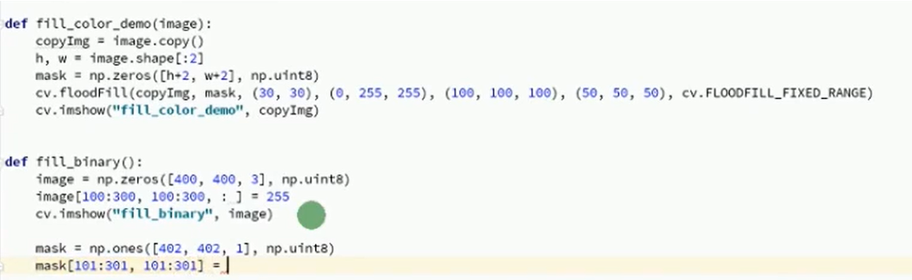
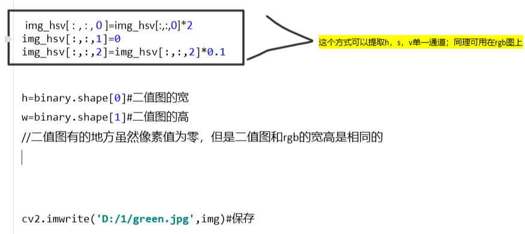
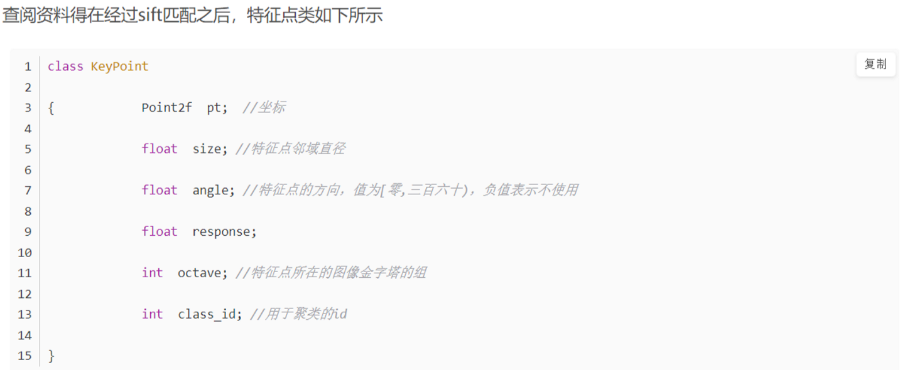
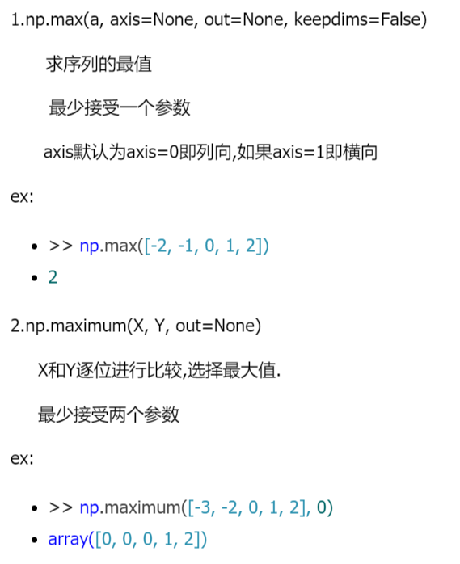
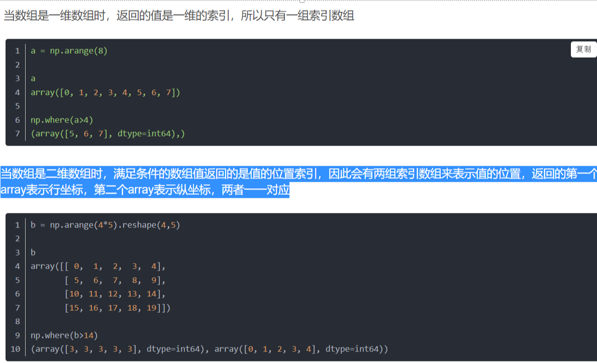
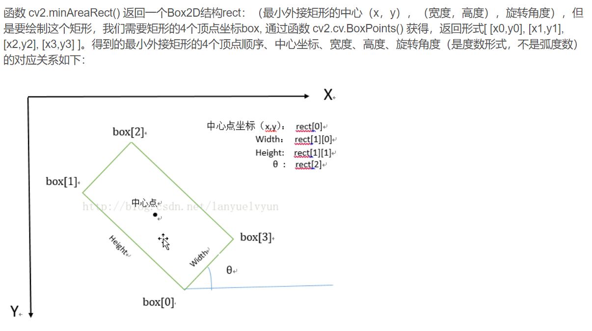
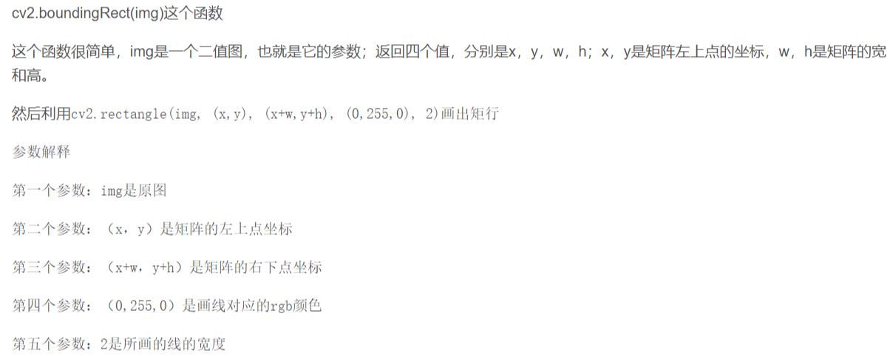
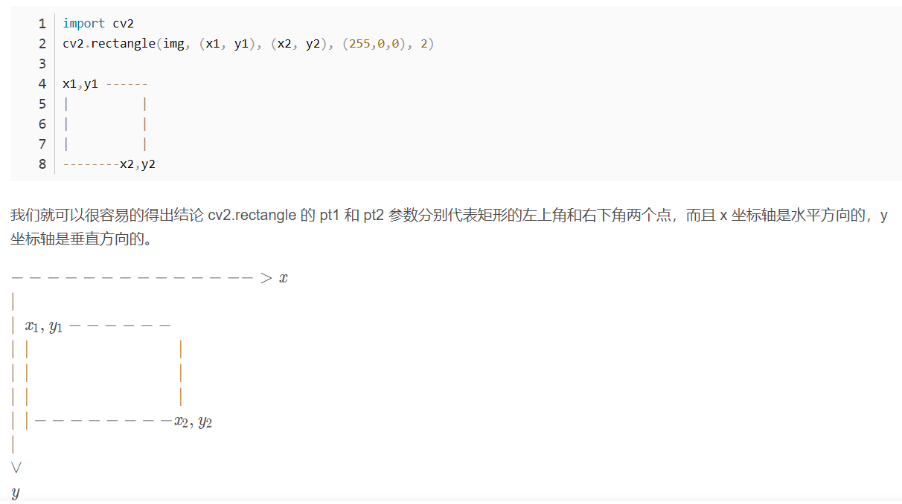
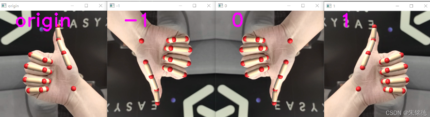

# opencv---clion&wsl

1.安装依赖

```
sudo apt update
sudo apt install libopencv-dev python3-opencv
```

```
sudo apt install build-essential cmake git pkg-config libgtk-3-dev \
    libavcodec-dev libavformat-dev libswscale-dev libv4l-dev \
    libxvidcore-dev libx264-dev libjpeg-dev libpng-dev libtiff-dev \
    gfortran openexr libatlas-base-dev python3-dev python3-numpy \
    libtbb2 libtbb-dev libdc1394-22-dev libopenexr-dev \
    libgstreamer-plugins-base1.0-dev libgstreamer1.0-dev
```

2.编译选项(用cmkegui)

```
cmake -D CMAKE_BUILD_TYPE=RELEASE \
    -D CMAKE_INSTALL_PREFIX=/usr/local \
    -D INSTALL_C_EXAMPLES=ON \
    -D INSTALL_PYTHON_EXAMPLES=ON \
    -D OPENCV_GENERATE_PKGCONFIG=ON \
    -D OPENCV_EXTRA_MODULES_PATH=~/opencv_build/opencv_contrib/modules \
    -D BUILD_EXAMPLES=ON ..
```

3.运行

查看opencv用到的库

```
pkg-config --cflags --libs opencv
```

clion中cmake：

```
cmake_minimum_required(VERSION 3.21)
project(OpenCV_Test)

set(CMAKE_CXX_STANDARD 11)

add_executable(OpenCV_Test main.cpp)

find_package(OpenCV REQUIRED)
target_link_libraries(OpenCV_Test 复制上面的库文件)
```

4.添加环境变量

在~/.bashrc中添加：

```
export LD_LIBRARY_PATH=$LD_LIBRARY_PATH:/usr/local/lib
```

使得环境变量生效：

```
source ~/.bashrc
```

关闭当前终端，在下一个终端中试一试

# PCL--Clion&WSL

## 1.安装

## 2.删除

```
sudo rm -r build
sudo rm -r /usr/include/pcl-1.7 /usr/share/pcl /usr/bin/pcl* /usr/lib/libpcl*
```

执行上述命令， 上述四个目录中，可能会找不到某些目录。可以自己去 `usr` 目录下搜索 关键字 `pcl` 或者 `libpcl`。本人在目录 `/usr/libx86_64-linux-gnu` 下找到 相关libpcl*文件，删除即可，删除命令同上。


# OpenCV

## 泛洪填充

```python
def fill_color(img):
    Copy_img = img.copy()
    H,w = img.shape[:2]
    Mask = np.zeros([h+2,w+2],np.uint8)
    cv2.floodFill(copy_img,mask,(30,30),(0,255,255),(100,100,100),(50,50,50),cv2.FLOODFILL_FIXED_RANGE)Cv2.imshow('',copyimg)
```



## 通道提取

**读取**

```python
image=cv2.imread('D:\\1\\2.jpg')
gray=cv2.cvtColor(image,cv2.COLOR_BGR2GRAY) //转为灰度图
```

**最大类间方差**

```python
import cv2
import numpy as np
from matplotlib import pyplot as plt

image=cv2.imread('D:\\1\\2.jpg')
gray=cv2.cvtColor(image,cv2.COLOR_BGR2GRAY)

plt.subplot(131)
plt.imshow(image,"gray")
plt.title("sourceimage")
plt.xticks([]),plt.yticks([])
plt.subplot(132),plt.hist(image.ravel(),256)
plt.title('historgram')
plt.xticks([])
plt.yticks([])
ret1,th1=cv2.threshold(gray,0,255,cv2.THRESH_OTSU)#方法选择为THRESH_OTSU即为最大类间方差法
plt.subplot(133)
plt.imshow(th1,"gray")
plt.title("OTSU,thresholdis"+str(ret1)),plt.xticks([]),plt.yticks([])
plt.show()
通过这个方法找出二值化的阈值

ret,binary=cv2.threshold(gray,15,255,cv2.THRESH_BINARY)#二值化，15即为上述求出的阈值
```

## bgr转hsv

opencv默认是bgr格式

```python
img_hsv=cv2.cvtColor(img,cv2.COLOR_BGR2HSV)
```



## SIFT

matcher.knnMatch(featuresA,
featuresB, 2)

featuresA和featuresB是两幅图片的特征向量，该函数的返回值是一个DMatch，DMatch是一个匹配之后的集合。

DMatch中的每个元素含有三个参数：

queryIdx：测试图像的特征点描述符的下标（第几个特征点描述符），同时也是描述符对应特征点的下标。

trainIdx：样本图像的特征点描述符下标,同时也是描述符对应特征点的下标。

distance：代表这怡翠匹配的特征点描述符的欧式距离，数值越小也就说明俩个特征点越相近。



cv2.xfeatures2d.SIFT_create().detectAndCompute()的参数：

一般是image和None，
即：

cv2.xfeatures2d.SIFT_create().detectAndCompute(image，None)

cv2.xfeatures2d.SIFT_create().detectAndCompute()的返回值：

kps, features =
cv2.xfeatures2d.SIFT_create().detectAndCompute()

kps是关键点。它所包含的信息有：

angle：角度，表示关键点的方向，为了保证方向不变形，SIFT算法通过对关键点周围邻域进行梯度运算，求得该点方向。-1为初值。

class_id：当要对图片进行分类时，我们可以用class_id对每个特征点进行区分，未设定时为-1，需要靠自己设定

octave：代表是从金字塔哪一层提取的得到的数据。

pt：关键点点的坐标

response：响应程度，代表该点强壮大小，更确切的说，是该点角点的程度。

size：该点直径的大小

## PIL库

```python
Img = cv2.imread()
Img = Img.astype(np.float32)
List = []
List.append(img)
Listnew = np.array(list)
##图片打开后是一个三维数组
将图片append进列表后，相当于在列表中嵌入了一个数组
所以要用np.array（）将  [数组]  这种格式转换为 数组，得到的是一个四维数组    
可以将多个图片的三维数组合并成为四为数组
```

## Numpy

**np.max和np.maximum**





# 函数api

## cv2.minAreaRect()







## cv::flip

小于0（例如-1）代表左右上下颠倒；0代表上下颠倒；大于0（例如1）代表左右颠倒。

```
using namespace cv;
flip(src,dst,1);
```



## cv::Mat::t()就是求转置

