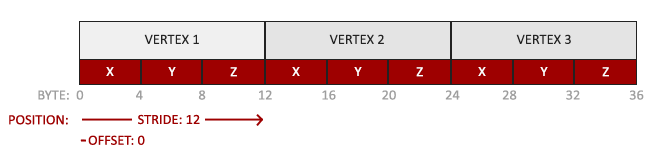
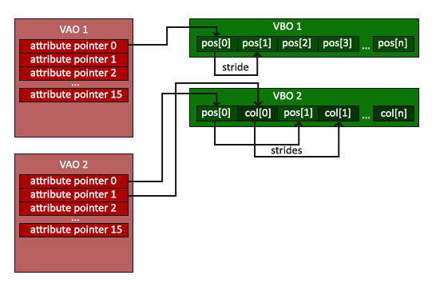
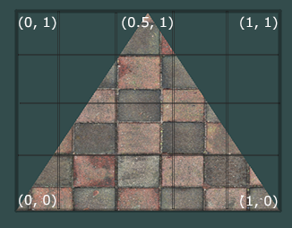
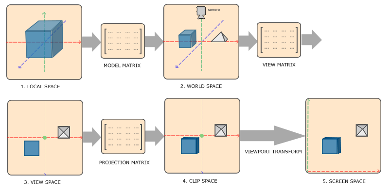
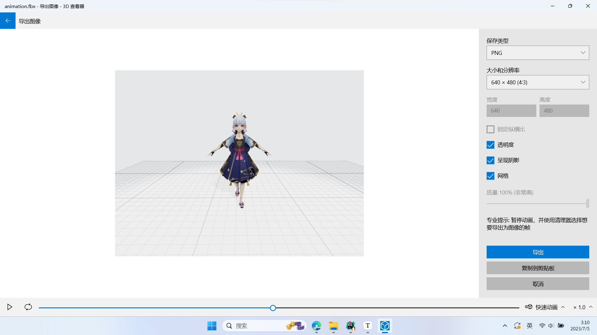
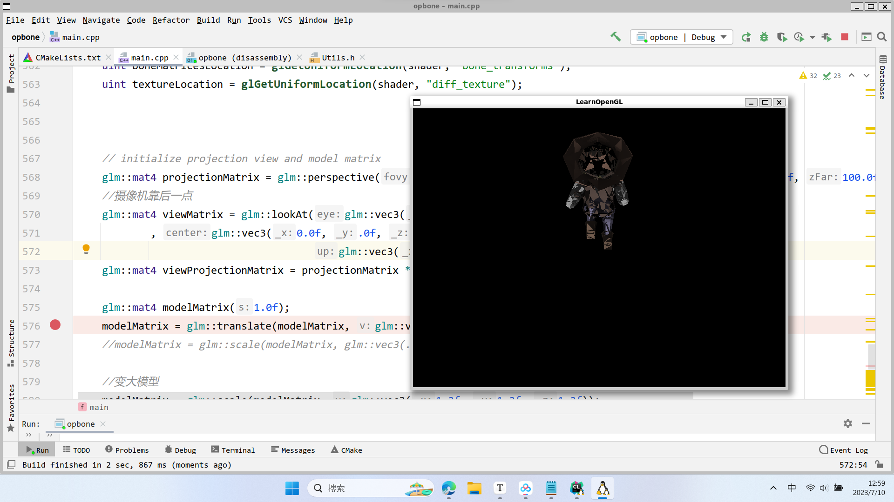
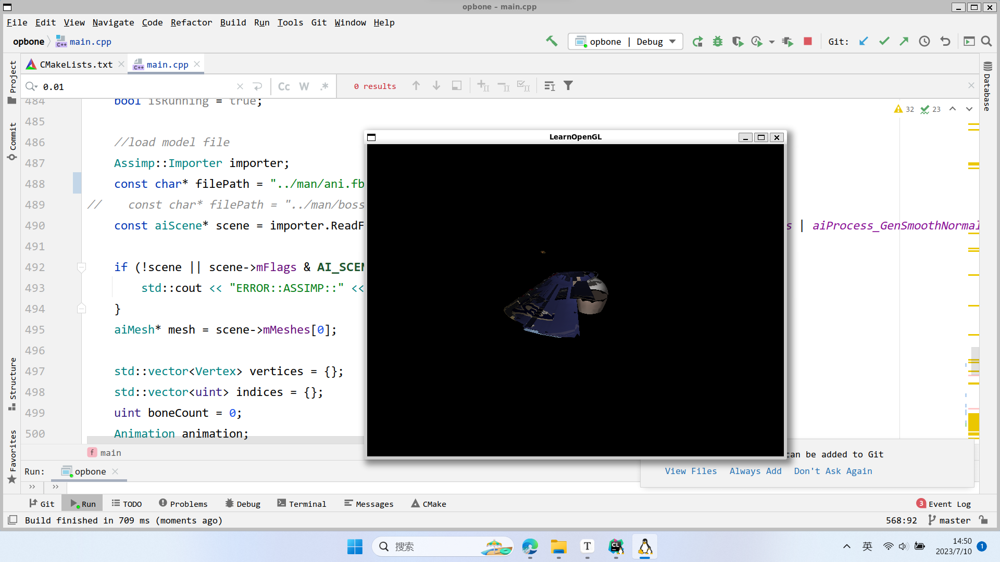
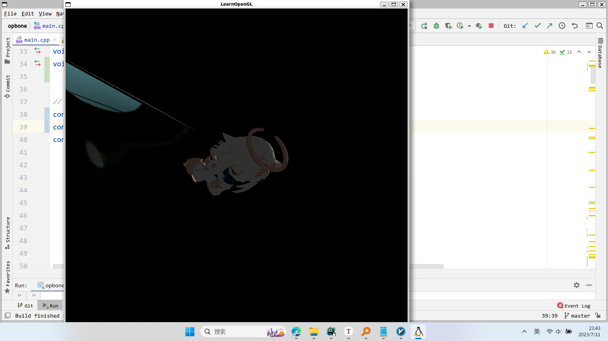

# OpenGL基础

## opengl简介

OpenGL是一套控制显卡的规范，没有具体的函数库。所以具体的函数实现主要是由gl、glu、glut这些库来实现


## 安装与测试

0. 可以使用apt-get

   ```
   sudo apt-get install libglew-dev
   sudo apt-get install libglm-dev
   sudo apt install libglfw3 libglfw3-dev
   ```

   

1. 在glfw官网下载zip格式的压缩包，然后解压编译

   ```
   cmake-gui
   (勾选构建动态库，即build_shared_lib)
   make
   sudo make install
   ```

2. 完成安装之后，会将动态库放到`usr/local/lib`中，因为在`etc/ld.so.conf`中已经添加了该路径，所以需要使用：

   ```
   sudo ldconfig
   ```

   使用这个命令更新以下，才能够找到这个动态库

3. 测试

   ```cpp
   #include <GLFW/glfw3.h>
   #include <stdio.h>
   
   int main(void)
   {
       GLFWwindow* window;
   
       /* Initialize the library */
       if (!glfwInit())
           return -1;
   
       /* Create a windowed mode window and its OpenGL context */
       window = glfwCreateWindow(640, 480, "Hello World", NULL, NULL);
       if (!window)
       {
           glfwTerminate();
           return -1;
       }
   
       /* Make the window's context current */
       glfwMakeContextCurrent(window);
   
       /* Loop until the user closes the window */
       while (!glfwWindowShouldClose(window))
       {
           /* Render here */
           glClear(GL_COLOR_BUFFER_BIT);
   
           /* Swap front and back buffers */
           glfwSwapBuffers(window);
   
           /* Poll for and process events */
           glfwPollEvents();
       }
   
       glfwTerminate();
       return 0;
   }
   ```

   然后编译下：

   ```
   g++ -o main ./main.cpp -lglfw -lGL -lX11 -lm
   ```

   运行生成的main文件即可。

   

## 在arm板子上使用opengl

1. 安装

   ```
   sudo apt-get install libglew-dev
   sudo apt-get install libglm-dev
   sudo apt install libglfw3 libglfw3-dev
   ```

2. 使用cmakelist

   ```
   cmake_minimum_required(VERSION 3.10)
   project(opengl)
   set(CMAKE_CXX_STANDARD 14)
   find_package(glfw3 REQUIRED)
   #find_package(glm REQUIRED)
   add_executable(opengl main.cpp)
   target_link_libraries(${PROJECT_NAME}
           -lGLEW -lglfw -lGL -lX11 -lpthread -lXrandr -lXi -ldl)
   ```

   > 或者使用g++编译命令
   >
   > ```
   > g++ -o main ./main.cpp -lglfw -lGL -lX11 -lm
   > ```
   >
   > 可以看到库使用的是lglfw，并不是glfw3

# Learn OpenGL

## 三角形

[你好，三角形 - LearnOpenGL CN (learnopengl-cn.github.io)](https://learnopengl-cn.github.io/01 Getting started/04 Hello Triangle/)

> 在学习此节之前，建议将这三个单词先记下来：
>
> - 顶点数组对象：Vertex Array Object，VAO
> - 顶点缓冲对象：Vertex Buffer Object，VBO
> - 元素缓冲对象：Element Buffer Object，EBO 或 索引缓冲对象 Index Buffer Object，IBO

在OpenGL中，任何事物都在3D空间中，而屏幕和窗口却是2D像素数组，这导致OpenGL的大部分工作都是关于把3D坐标转变为适应你屏幕的2D像素。3D坐标转为2D坐标的处理过程是由OpenGL的图形渲染管线（Graphics Pipeline，大多译为管线，实际上指的是一堆原始图形数据途经一个输送管道，期间经过各种变化处理最终出现在屏幕的过程）管理的。图形渲染管线可以被划分为两个主要部分：第一部分把你的3D坐标转换为2D坐标，第二部分是把2D坐标转变为实际的有颜色的像素。


1. 开始绘制图形之前，我们需要先给OpenGL输入一些顶点数据。OpenGL是一个3D图形库，所以在OpenGL中我们指定的所有坐标都是3D坐标（x、y和z）。定义这样的顶点数据以后，我们会把它作为输入发送给图形渲染管线的第一个处理阶段：顶点着色器。它会在GPU上创建内存用于储存我们的顶点数据，还要配置OpenGL如何解释这些内存，并且指定其如何发送给显卡。顶点着色器接着会处理我们在内存中指定数量的顶点。

**出现的bug：**

在编译后出现段错误，原因：是初始化失败了，如果你使用一个扩展加载器程序库（extension loader library）来访问现代[OpenGL](https://so.csdn.net/so/search?q=OpenGL&spm=1001.2101.3001.7020)，然后当需要初始化它时，加载器需要一个当前的上下文来加载。在调用glCreateShader先调用glewInit函数，代码如下：

```
GLenum glew_err = glewInit();
	if (glew_err != GLEW_OK)
	{
		throw std::runtime_error(std::string("Error initializing GLEW, error: ") + (const char*)glewGetErrorString(glew_err));
		return;
}
// Create and compile vertex shader
unsigned int vertex_shader = glCreateShader(GL_VERTEX_SHADER);

```

**VBO和VAO:**首先创建一个VBO（缓冲对象，**顶点缓冲对象的缓冲类型是GL_ARRAY_BUFFER**）。然后通过**2**函数将VBO绑定到GL_ARRAY_BUFFER目标。

**用到的函数：**

1. glGenBuffers(1,&VBO)

   VBO是**顶点缓冲对象**，用于管理“顶点”的内存信息

   ```c++
   unsigned int VBO;
   glGenBuffers(1, &VBO); // 1是ID
   ```

2. glBindBuffer(GL_ARRAY_BUFFER, VBO); 其中GL_ARRAY_BUFFER是顶点缓冲对象缓冲类型，该函数可以把新创建的缓冲VBO绑定到GL_ARRAY_BUFFER目标上.

   **那么使用GL_ARRAY_BUFFER上的缓冲调用都会来配置当前绑定的缓冲“VBO”**

   ```
   glBindBuffer(GL_ARRAY_BUFFER, VBO);  
   ```

3. glBufferData

   该函数可以把定义的顶点数据复制到缓冲内存中

   ```
   glBufferData(GL_ARRAY_BUFFER, sizeof(vertices), vertices, GL_STATIC_DRAW);
   ```

   glBufferData是一个专门用来把用户定义的数据复制到当前绑定缓冲的函数。它的第一个参数是目标缓冲的类型：顶点缓冲对象当前绑定到GL_ARRAY_BUFFER目标上。第二个参数指定传输数据的大小(以字节为单位)；用一个简单的`sizeof`计算出顶点数据大小就行。第三个参数是我们希望发送的实际数据。

   第四个参数指定了我们希望显卡如何管理给定的数据。它有三种形式：

   - GL_STATIC_DRAW ：数据不会或几乎不会改变。
   - GL_DYNAMIC_DRAW：数据会被改变很多。
   - GL_STREAM_DRAW ：数据每次绘制时都会改变。

### 连接顶点属性

顶点数据会被解析为：



- 位置数据被储存为32位（4字节）浮点值。
- 每个位置包含3个这样的值。
- 在这3个值之间没有空隙（或其他值）。这几个值在数组中紧密排列(Tightly Packed)。
- 数据中第一个值在缓冲开始的位置。

glVertexAttribPointer函数的参数非常多，所以我会逐一介绍它们：

- 第一个参数指定我们要配置的顶点属性。还记得我们在顶点着色器中使用`layout(location = 0)`定义了position顶点属性的位置值(Location)吗？它可以把顶点属性的位置值设置为`0`。因为我们希望把数据传递到这一个顶点属性中，所以这里我们传入`0`。
- 第二个参数指定顶点属性的大小。顶点属性是一个`vec3`，它由3个值组成，所以大小是3。
- 第三个参数指定数据的类型，这里是GL_FLOAT(GLSL中`vec*`都是由浮点数值组成的)。
- 下个参数定义我们是否希望数据被标准化(Normalize)。如果我们设置为GL_TRUE，所有数据都会被映射到0（对于有符号型signed数据是-1）到1之间。我们把它设置为GL_FALSE。
- 第五个参数叫做步长(Stride)，它告诉我们在连续的顶点属性组之间的间隔。由于下个组位置数据在3个`float`之后，我们把步长设置为`3 * sizeof(float)`。要注意的是由于我们知道这个数组是紧密排列的（在两个顶点属性之间没有空隙）我们也可以设置为0来让OpenGL决定具体步长是多少（只有当数值是紧密排列时才可用）。一旦我们有更多的顶点属性，我们就必须更小心地定义每个顶点属性之间的间隔，我们在后面会看到更多的例子（译注: 这个参数的意思简单说就是从这个属性第二次出现的地方到整个数组0位置之间有多少字节）。
- 最后一个参数的类型是`void*`，所以需要我们进行这个奇怪的强制类型转换。它表示位置数据在缓冲中起始位置的偏移量(Offset)。由于位置数据在数组的开头，所以这里是0。我们会在后面详细解释这个参数。

> 每个顶点属性从一个VBO管理的内存中获得它的数据，而具体是从哪个VBO（程序中可以有多个VBO）获取则是通过在调用glVertexAttribPointer时绑定到GL_ARRAY_BUFFER的VBO决定的。
>
> **也就是VBO是一个int类型，存储着内存地址，然后内存地址指向的地方是顶点属性的数据。**

### 顶点数组对象

顶点数组对象（VAO）可以像VBO一样被绑定，随后的顶点数据会被存储在VAO中。

一个顶点数组对象会存储以下内容：

- glEnableVertexAttribArray和glDisableVertexAttribArray的调用。
- 通过glVertexAttribPointer设置的顶点属性配置。
- 通过glVertexAttribPointer调用与顶点属性关联的顶点缓冲对象。



**用法**

1. 创建VAO

   ```c++
   unsigned int VAO;
   glGenVertexArrays(1, &VAO);
   ```

2. 使用VAO

   使用`glBindVertexArray` 绑定VAO， 也就是有几个流程：0.绑定VAO；1.确定顶点数据；2.创建VBO，绑定GL_ARRAY_BUFFER；3.把顶点数据绑定到GL_ARRAY_BUFFER中

   ```c++
   // ..:: 初始化代码（只运行一次 (除非你的物体频繁改变)） :: ..
   // 1. 绑定VAO
   glBindVertexArray(VAO);
   // 2. 把顶点数组复制到缓冲中供OpenGL使用
   glBindBuffer(GL_ARRAY_BUFFER, VBO);
   glBufferData(GL_ARRAY_BUFFER, sizeof(vertices), vertices, GL_STATIC_DRAW);
   // 3. 设置顶点属性指针
   glVertexAttribPointer(0, 3, GL_FLOAT, GL_FALSE, 3 * sizeof(float), (void*)0);
   glEnableVertexAttribArray(0);
   
   [...]
   
   // ..:: 绘制代码（渲染循环中） :: ..
   // 4. 绘制物体
   glUseProgram(shaderProgram);
   glBindVertexArray(VAO);
   someOpenGLFunctionThatDrawsOurTriangle();
   ```


### 三角形画

   `glDrawArrays`函数：使用当前激活的着色器、定义的顶点属性、VBO的顶点数据（通过VAO间接绑定，通过VAO访问VBO）

   ```
   glUseProgram(shaderProgram);
   glBindVertexArray(VAO);
   glDrawArrays(GL_TRIANGLES, 0, 3);
   ```

   

### 元素缓冲对象（EBO,element Buffer Object）

> 又名"索引缓冲对象"

可以确定顶点的绘制顺序，opengl主要处理三角形，如果绘制矩形需要使用EBO来处理绘制顺序进而达到**节省开支**的目的：

```c++
float vertices[] = {
    0.5f, 0.5f, 0.0f,   // 右上角
    0.5f, -0.5f, 0.0f,  // 右下角
    -0.5f, -0.5f, 0.0f, // 左下角
    -0.5f, 0.5f, 0.0f   // 左上角
};

unsigned int indices[] = {
    // 注意索引从0开始! 
    // 此例的索引(0,1,2,3)就是顶点数组vertices的下标，
    // 这样可以由下标代表顶点组合成矩形

    0, 1, 3, // 第一个三角形
    1, 2, 3  // 第二个三角形
};
```

和VBO类似，需要将EBO绑定到`GL_ELEMENT_ARRAY_BUFFER`，然后将顶点数据复制到缓冲区`GL_ELEMENT_ARRAY_BUFFER`：

```c++
unsigned int EBO;
glGenBuffers(1, &EBO);
glBindBuffer(GL_ELEMENT_ARRAY_BUFFER, EBO);
glBufferData(GL_ELEMENT_ARRAY_BUFFER, sizeof(indices), indices, GL_STATIC_DRAW);

```

如下图所示，VAO在绑定VBO时会自动绑定EBO对象。**VAO存储了EBO对象**


```c++
// ..:: 初始化代码 :: ..
// 1. 绑定顶点数组对象
glBindVertexArray(VAO);
// 2. 把我们的顶点数组复制到一个顶点缓冲中，供OpenGL使用
glBindBuffer(GL_ARRAY_BUFFER, VBO);
glBufferData(GL_ARRAY_BUFFER, sizeof(vertices), vertices, GL_STATIC_DRAW);
// 3. 复制我们的索引数组到一个索引缓冲中，供OpenGL使用
glBindBuffer(GL_ELEMENT_ARRAY_BUFFER, EBO);
glBufferData(GL_ELEMENT_ARRAY_BUFFER, sizeof(indices), indices, GL_STATIC_DRAW);
// 4. 设定顶点属性指针
glVertexAttribPointer(0, 3, GL_FLOAT, GL_FALSE, 3 * sizeof(float), (void*)0);
glEnableVertexAttribArray(0);

[...]

// ..:: 绘制代码（渲染循环中） :: ..
glUseProgram(shaderProgram);
glBindVertexArray(VAO);
glDrawElements(GL_TRIANGLES, 6, GL_UNSIGNED_INT, 0);
glBindVertexArray(0);
```


## 着色器

着色器使用GLSL的类c语言写的。包含一些针对向量和矩阵操作的有用特性。

渲染管线：首先是in（顶点着色）、最后是out（片段着色）

**着色器格式**：着色器的开头总是要声明版本，接着是输入和输出变量、uniform和main函数。每个着色器的入口点都是main函数，在这个函数中我们处理所有的输入变量，并将结果输出到输出变量中。如果你不知道什么是uniform也不用担心，我们后面会进行讲解。

### 着色器程序

着色器程序对象(Shader Program Object)是多个着色器合并之后并最终链接完成的版本。如果要使用刚才编译的着色器我们必须把它们链接(Link)为一个着色器程序对象，然后在渲染对象的时候激活这个着色器程序。

```
unsigned int shaderProgram;
shaderProgram = glCreateProgram();
```

glCreateProgram函数创建一个程序，并返回新创建程序对象的ID引用。现在我们需要把之前编译的着色器附加到程序对象上，然后用glLinkProgram链接它们：

```
glAttachShader(shaderProgram, vertexShader);
glAttachShader(shaderProgram, fragmentShader);
glLinkProgram(shaderProgram);
```

得到的结果就是一个程序对象，我们可以调用glUseProgram函数，用刚创建的程序对象作为它的参数，以激活这个程序对象：

```
glUseProgram(shaderProgram);
```

在glUseProgram函数调用之后，每个着色器调用和渲染调用都会使用这个程序对象（也就是之前写的着色器)了。

对了，在把着色器对象链接到程序对象以后，记得删除着色器对象，我们不再需要它们了：

```
glDeleteShader(vertexShader);
glDeleteShader(fragmentShader);
```

---

#### 顶点着色器

**作用：** 处理每个顶点的变换和属性计算

- **执行频率：** 每个顶点执行一次
- 主要任务：
  - 坐标变换：模型空间 → 世界空间 → 观察空间 → 裁剪空间
  - 计算并输出顶点属性（法线、颜色、纹理坐标等）
- **关键输出：** `gl_Position`（裁剪空间坐标）
- 典型应用：
  - 模型变换、视图变换、投影变换
  - 骨骼动画（蒙皮）
  - 顶点位移（基于高度图、噪声等）
  - 简单的顶点光照

```glsl
#version 330 core
layout(location = 0) in vec3 aPos;
layout(location = 1) in vec2 aTexCoord;

out vec2 TexCoord;
uniform mat4 model;
uniform mat4 view;
uniform mat4 projection;

void main() {
    gl_Position = projection * view * model * vec4(aPos, 1.0);
    TexCoord = aTexCoord;
}
```


#### 曲面细分着色器

曲面细分阶段实际上包含两个可编程着色器和一个固定功能阶段：

2.1 曲面细分控制着色器 (Tessellation Control Shader)

- **作用：** 决定如何细分图元
- **输入：** 原始图元的控制点（patch）
- **输出：** 细分级别和变换后的控制点
- **控制细分密度**（基于距离、屏幕尺寸等）

2.2 曲面细分器 (Tessellator) - 固定功能

- 根据控制着色器的指令实际生成新的顶点

2.3 曲面细分评估着色器 (Tessellation Evaluation Shader)

- **作用：** 处理细分后生成的新顶点
- **类似顶点着色器**，但处理细分产生的顶点
- 常用于：LOD（细节层次）、动态曲面细分

**应用场景：** 地形渲染、自适应细节、曲面建模


#### 几何着色器

**作用：** 处理整个图元，可以创建/销毁图元

- **执行频率：** 每个图元执行一次（点、线、三角形）
- **输入：** 完整的图元（如三角形的三个顶点）
- **输出：** 零个或多个新图元
- **独特能力：** 可以改变图元类型（如点→三角形）

```glsl
#version 330 core
layout(triangles) in;          // 输入三角形
layout(triangle_strip, max_vertices = 3) out; // 输出三角形带

void main() {
    for(int i = 0; i < 3; i++) {
        // 可以修改每个顶点的位置和属性
        gl_Position = gl_in[i].gl_Position;
        EmitVertex();
    }
    EndPrimitive();
}
```

**应用场景：**

- 法线可视化（从顶点生成线段）
- 点精灵（point sprites）扩展
- 动态几何生成
- 阴影体积挤出


#### 片段着色器

**作用：**在光栅化之后，会有很多片段。 计算每个片段的最终颜色。

- **执行频率：** **每个片段（潜在像素）执行一次**
- 主要任务：
  - 纹理采样
  - 光照计算（Phong、PBR等）
  - 材质计算
  - 后期处理效果
- **关键输出：** 颜色值、深度值（可选）

```glsl
#version 330 core
in vec2 TexCoord;
in vec3 Normal;
in vec3 FragPos;

out vec4 FragColor;

uniform sampler2D diffuseTexture;
uniform vec3 lightPos;
uniform vec3 viewPos;

void main() {
    // 纹理采样
    vec3 objectColor = texture(diffuseTexture, TexCoord).rgb;
    
    // 简单光照计算
    vec3 norm = normalize(Normal);
    vec3 lightDir = normalize(lightPos - FragPos);
    float diff = max(dot(norm, lightDir), 0.0);
    vec3 diffuse = diff * vec3(1.0);
    
    // 环境光
    vec3 ambient = 0.1 * vec3(1.0);
    
    // 镜面光
    vec3 viewDir = normalize(viewPos - FragPos);
    vec3 reflectDir = reflect(-lightDir, norm);
    float spec = pow(max(dot(viewDir, reflectDir), 0.0), 32.0);
    vec3 specular = spec * vec3(1.0);
    
    vec3 result = (ambient + diffuse + specular) * objectColor;
    FragColor = vec4(result, 1.0);
}
```

**应用场景：** 所有材质渲染、光照、特效


### 向量

GLSL中的向量是一个可以包含有2、3或者4个分量的容器，分量的类型可以是前面默认基础类型的任意一个。它们可以是下面的形式（`n`代表分量的数量）：

| 类型    | 含义                            |
| :------ | :------------------------------ |
| `vecn`  | 包含`n`个float分量的默认向量    |
| `bvecn` | 包含`n`个bool分量的向量         |
| `ivecn` | 包含`n`个int分量的向量          |
| `uvecn` | 包含`n`个unsigned int分量的向量 |
| `dvecn` | 包含`n`个double分量的向量       |

---

**向量值的获取：**

一个向量的分量可以通过`vec.x`这种方式获取，这里`x`是指这个向量的第一个分量。你可以分别使用`.x`、`.y`、`.z`和`.w`来获取它们的第1、2、3、4个分量。GLSL也允许你对颜色使用`rgba`，或是对纹理坐标使用`stpq`访问相同的分量。

---

**向量的重组：**

实现的效果是在上一个的基础上追加，或者是用yxzy这种用法去变更顺序。

```
vec2 someVec;
vec4 differentVec = someVec.xyxx;
vec3 anotherVec = differentVec.zyw;
vec4 otherVec = someVec.xxxx + anotherVec.yxzy;
```


### 输入与输出

每个着色器是独立的，也是整体的一部分，因此为了方便数据交互，希望每个着色器都有输入和输出。**GLSL定义了`in`和`out`来实现这个目的。** **只要一个输出变量和下一个着色器阶段的输入匹配，就会传递下去**

**1.顶点着色器：**可以从顶点数据中直接接受输入，为了方便定义，使用`location`指定输入变量，这样就可以在cpu上配置顶点属性。使用`in`关键词，表示顶点着色器的输入属性，比如输入顶点的位置信息。

```
#version 330 core
layout (location = 0) in vec3 aPos;

out vec4 vertexColor; // 为片段着色器指定一个颜色输出

void main()
{
    gl_Position = vec4(aPos, 1.0); // 注意我们如何把一个vec3作为vec4的构造器的参数
    vertexColor = vec4(0.5, 0.0, 0.0, 1.0); // 把输出变量设置为暗红色
}
```

- `#version 330 core`
- `layout (location = 0) in vec3 aPos;`声明输入变量，定义了顶点着色器接受顶点属性，即pos为位置坐标
- `out vec4 vertexColor;` 指定输出变量为vec4

**2.片段着色器：**片段着色器是计算最后的颜色输出，需要输出一个`vec4`颜色输出变量，会生成一个最终输出的颜色。

```
#version 330 core
out vec4 FragColor;

in vec4 vertexColor; // 从顶点着色器传来的输入变量（名称相同、类型相同）

void main()
{
    FragColor = vertexColor;
}
```

### 绘制流程

我们使用一个顶点缓冲对象将顶点数据初始化至缓冲中，建立了一个顶点和一个片段着色器，并告诉了OpenGL如何把顶点数据链接到顶点着色器的顶点属性上。在OpenGL中绘制一个物体，代码会像是这样：（VBO->VAO->绑定缓冲->顶点数据解析与链接到着色器）

```c++
// 0. 复制顶点数组到缓冲中供OpenGL使用
glBindBuffer(GL_ARRAY_BUFFER, VBO); // vbo与缓冲绑定
// 将顶点数据传送至GPU内存 
glBufferData(GL_ARRAY_BUFFER, sizeof(vertices), vertices, GL_STATIC_DRAW); 


// 1. 设置顶点属性指针，告诉OpenGL解析顶点数据，并连接到顶点着色器。
glVertexAttribPointer(0, 3, GL_FLOAT, GL_FALSE, 3 * sizeof(float), (void*)0);
glEnableVertexAttribArray(0);
// 2. 当我们渲染一个物体时要使用着色器程序
glUseProgram(shaderProgram);
// 3. 绘制物体
someOpenGLFunctionThatDrawsOurTriangle();
```

**当使用VAO时：**

```c
// ..:: 初始化代码（只运行一次 (除非你的物体频繁改变)） :: ..
// 1. 绑定VAO
glBindVertexArray(VAO);
// 2. 把顶点数组复制到缓冲中供OpenGL使用
glBindBuffer(GL_ARRAY_BUFFER, VBO);
glBufferData(GL_ARRAY_BUFFER, sizeof(vertices), vertices, GL_STATIC_DRAW);
// 3. 设置顶点属性指针
glVertexAttribPointer(0, 3, GL_FLOAT, GL_FALSE, 3 * sizeof(float), (void*)0);
glEnableVertexAttribArray(0);

[...]

// ..:: 绘制代码（渲染循环中） :: ..
// 4. 绘制物体
glUseProgram(shaderProgram);
glBindVertexArray(VAO);
someOpenGLFunctionThatDrawsOurTriangle();
```


### Uniform

这是一种从CPU中的应用向GPU中的着色器发送数据的方式，但是uniform和顶点属性些许不同。

```
version 330 core

out vec4 FragColor;

uniform vec4 ourColor; // 在OpenGL程序代码中设定这个变量

void main()
{
    FragColor = ourColor;
}
```

uniform是全局变量，我们可以在任何着色器中定义它们，而无需通过顶点着色器作为中介。顶点着色器中不需要这个uniform，所以我们不用在那里定义它。

```c
float timeValue = glfwGetTime();
float greenValue = (sin(timeValue) / 2.0f) + 0.5f;
int vertexColorLocation = glGetUniformLocation(shaderProgram, "ourColor");
glUseProgram(shaderProgram);
glUniform4f(vertexColorLocation, 0.0f, greenValue, 0.0f, 1.0f);
```

**相关函数**

1. glfwGetTime()

   获取运行的秒数、

2. glGetUniformLocation

   查询uniform ourcolor的位置，输入参数为着色器程序和uniform的名字。

3. glUniform4f

   设置/更新uniform的值。查询uniform地址不要求你之前使用过着色器程序，但是更新一个uniform之前你**必须**先使用程序（调用glUseProgram)，因为它是在当前激活的着色器程序中设置uniform的。


## 纹理

纹理是一个2D图片（甚至也有1D和3D的纹理），它可以用来添加物体的细节；你可以想象纹理是一张绘有砖块的纸，无缝折叠贴合到你的3D的房子上，这样你的房子看起来就像有砖墙外表了。因为我们可以在一张图片上插入非常多的细节，这样就可以让物体非常精细而不用指定额外的顶点。


**为了能够把纹理映射(Map)到三角形上，我们需要指定三角形的每个顶点各自对应纹理的哪个部分。这样每个顶点就会关联着一个纹理坐标(Texture Coordinate)，用来标明该从纹理图像的哪个部分采样**（译注：采集片段颜色）。之后在图形的其它片段上进行片段插值(Fragment Interpolation)。


纹理坐标在x和y轴上，范围为0到1之间（注意我们使用的是2D纹理图像）。使用纹理坐标获取纹理颜色叫做采样(Sampling)。纹理坐标起始于(0, 0)，也就是纹理图片的左下角，终止于(1, 1)，即纹理图片的右上角。下面的图片展示了我们是如何把纹理坐标映射到三角形上的。



我们为三角形指定了3个纹理坐标点。如上图所示，我们希望三角形的左下角对应纹理的左下角，因此我们把三角形左下角顶点的纹理坐标设置为(0, 0)；同理右下方的顶点设置为(1, 0)；三角形的上顶点对应于图片的上中位置所以我们把它的纹理坐标设置为(0.5, 1.0)。我们只要给顶点着色器传递这三个纹理坐标就行了，接下来它们会被传到片段着色器中，它会为每个片段进行纹理坐标的插值。

纹理坐标看起来就像这样：

```c++
float texCoords[] = {
    0.0f, 0.0f, // 左下角
    1.0f, 0.0f, // 右下角
    0.5f, 1.0f  // 上中
};
```


## 坐标系统

 OpenGL希望在每次顶点着色器运行后，我们可见的所有顶点都为标准化设备坐标(Normalized Device Coordinate, NDC)。也就是说，每个顶点的**x**，**y**，**z**坐标都应该在**-1.0**到**1.0**之间，超出这个坐标范围的顶点都将不可见。我们通常会自己设定一个坐标的范围，之后再在顶点着色器中将这些坐标变换为标准化设备坐标。然后将这些标准化设备坐标传入光栅器(Rasterizer)，将它们变换为屏幕上的二维坐标或像素。

将坐标变换为标准化设备坐标，接着再转化为屏幕坐标的过程通常是分步进行的，也就是类似于流水线那样子。在流水线中，物体的顶点在最终转化为屏幕坐标之前还会被变换到多个坐标系统(Coordinate System)。将物体的坐标变换到几个**过渡**坐标系(Intermediate Coordinate System)的优点在于，在这些特定的坐标系统中，一些操作或运算更加方便和容易，这一点很快就会变得很明显。

- 局部空间(Local Space，或者称为物体空间(Object Space))
- 世界空间(World Space)
- 观察空间(View Space，或者称为视觉空间(Eye Space))
- 裁剪空间(Clip Space)
- 屏幕空间(Screen Space)

   

变换矩阵：模型矩阵、观察矩阵和投影矩阵。$V_{clip}=M_{projection}*M_{view}*M_{model}*V_{local}$ 

$V_{local}$是模型再局部坐标的位置。

> 顶点着色器的输出要求所有的顶点都在裁剪空间内，这正是我们刚才使用变换矩阵所做的。OpenGL然后对**裁剪坐标**执行**透视除法**从而将它们变换到**标准化设备坐标**。OpenGL会使用glViewPort内部的参数来将标准化设备坐标映射到**屏幕坐标**，每个坐标都关联了一个屏幕上的点（在我们的例子中是一个800x600的屏幕）。这个过程称为视口变换。

# 模型加载

## Assimp编译

1. 直接下载最新版的assimp包，在GitHub上

2. 按照传统cmake构建方式，然后编译

3. 在build文件里会生成.so文件，需要在实际项目中链接该库文件

   把文件放到AssimpLib中，然后：

   ```
   link_directories(AssimpLib)
   
   target_link_libraries(${PROJECT_NAME}
           -lGLEW -lglfw3 -lGL -lX11 -lpthread -lXrandr -lXi -ldl libassimp.so)
   ```

   

## assimp介绍

1. Assimp能够导入很多种不同的模型文件格式（并也能够导出部分的格式），它会将所有的模型数据加载至Assimp的通用数据结构中。
2. 当Assimp加载完模型之后，我们就能够从Assimp的数据结构中提取我们所需的所有数据了。由于Assimp的数据结构保持不变，不论导入的是什么种类的文件格式，它都能够将我们从这些不同的文件格式中抽象出来，用同一种方式访问我们需要的数据。

**导入方式：**

当使用Assimp导入一个模型的时候，它通常会将整个模型加载进一个**场景**(Scene)对象，它会包含导入的模型/场景中的所有数据。Assimp会将场景载入为一系列的节点(Node)，每个节点包含了场景对象中所储存数据的索引，每个节点都可以有任意数量的子节点。Assimp数据结构的（简化）模型如下：


## 导入3D模型到OpenGL

1. 首先需要调用的函数是loadModel，它会从构造器中直接调用。在loadModel中，我们使用Assimp来加载模型至Assimp的一个叫做scene的数据结构中。Assimp很棒的一点在于，它抽象掉了加载不同文件格式的所有技术细节，只需要一行代码就能完成所有的工作：

   ```c++
   Assimp::Importer importer;
   const aiScene *scene = importer.ReadFile(path, aiProcess_Triangulate | aiProcess_FlipUVs);
   ```

   - aiProcess_Triangulate，我们告诉Assimp，如果模型不是（全部）由三角形组成，它需要将模型所有的图元形状变换为三角形。

   - aiProcess_FlipUVs将在处理的时候**翻转y轴的纹理坐标**（你可能还记得我们在[纹理](https://learnopengl-cn.github.io/01 Getting started/06 Textures/)教程中说过，在OpenGL中大部分的图像的y轴都是反的，所以这个后期处理选项将会修复这个）。我靠？我导入凌华小姐的pmx model，竟然不用反转？

   - aiProcess_GenNormals：如果模型不包含法向量的话，就为每个顶点创建法线。
   - aiProcess_SplitLargeMeshes：将比较大的网格分割成更小的子网格，如果你的渲染有最大顶点数限制，只能渲染较小的网格，那么它会非常有用。
   - aiProcess_OptimizeMeshes：和上个选项相反，它会将多个小网格拼接为一个大的网格，减少绘制调用从而进行优化。

   完整的加载模型函数为：

   ```c++
   void loadModel(string path)
   {
       Assimp::Importer import;
       const aiScene *scene = import.ReadFile(path, aiProcess_Triangulate | aiProcess_FlipUVs);    
   
       if(!scene || scene->mFlags & AI_SCENE_FLAGS_INCOMPLETE || !scene->mRootNode) 
       {
           cout << "ERROR::ASSIMP::" << import.GetErrorString() << endl;
           return;
       }
       directory = path.substr(0, path.find_last_of('/'));
   
       processNode(scene->mRootNode, scene);
   }
   ```

   

2. 获取每个节点的网格索引。Assimp的结构中，每个节点包含了一系列的网格索引，每个索引指向场景对象中的那个特定网格。我们接下来就想去获取这些网格索引，获取每个网格，处理每个网格，接着对每个节点的子节点重复这一过程。processNode函数的内容如下：

   ```
   void processNode(aiNode *node, const aiScene *scene)
   {
       // 处理当前节点所有的网格（如果有的话）
       for(unsigned int i = 0; i < node->mNumMeshes; i++)
       {
           aiMesh *mesh = scene->mMeshes[node->mMeshes[i]]; 
           meshes.push_back(processMesh(mesh, scene));         
       }
       // 接下来对它的子节点重复这一过程
       for(unsigned int i = 0; i < node->mNumChildren; i++)
       {
       	// 递归调用哦
           processNode(node->mChildren[i], scene);
       }
   }
   ```

   我们首先检查每个节点的网格索引，并索引场景的mMeshes数组来获取对应的网格。返回的网格将会**传递到processMesh函数**中，它会返回一个Mesh对象，我们可以将它存储在meshes列表/vector。

3. **将aiMesh转化为我们自己的网格对象**。我们要做的只是访问网格的相关属性并将它们储存到我们自己的对象中。processMesh函数的大体结构如下：

   ```c++
   Mesh processMesh(aiMesh *mesh, const aiScene *scene)
   {
       vector<Vertex> vertices;
       vector<unsigned int> indices;   
       vector<Texture> textures;
   
       for(unsigned int i = 0; i < mesh->mNumVertices; i++)
       {
           Vertex vertex;
           // 处理顶点位置、法线和纹理坐标
           ...
           vertices.push_back(vertex);
       }
       // 处理索引
       ...
       // 处理材质
       if(mesh->mMaterialIndex >= 0)
       {
           ...
       }
   
       return Mesh(vertices, indices, textures);
   }
   ```

   处理网格的过程主要有三部分：获取所有的顶点数据，获取它们的网格索引，并获取相关的材质数据。

   获取顶点数据非常简单，我们定义了一个Vertex结构体，我们将在每个迭代之后将它加到vertices数组中。我们会遍历网格中的所有顶点（使用`mesh->mNumVertices`来获取，这个就是顶点位置数组）。在每个迭代中，我们希望使用所有的相关数据填充这个结构体。顶点的位置是这样处理的：

   ```c++
   glm::vec3 vector; 
   vector.x = mesh->mVertices[i].x;
   vector.y = mesh->mVertices[i].y;
   vector.z = mesh->mVertices[i].z; 
   vertex.Position = vector;
   ```

4. 索引，面。Assimp的接口定义了每个网格都有一个面(Face)数组，每个面代表了一个图元，在我们的例子中（由于使用了aiProcess_Triangulate选项）它总是三角形。一个面包含了多个索引，它们定义了在每个图元中，我们应该绘制哪个顶点，并以什么顺序绘制，所以如果我们遍历了所有的面，并储存了面的索引到indices这个vector中就可以了。

   ```
   for(unsigned int i = 0; i < mesh->mNumFaces; i++)
   {
       aiFace face = mesh->mFaces[i];
       for(unsigned int j = 0; j < face.mNumIndices; j++)
           indices.push_back(face.mIndices[j]);
   }
   ```

   所有的外部循环都结束了，我们现在有了一系列的顶点和索引数据，它们可以用来**通过glDrawElements函数来绘制网格**。

5. 材质。和节点一样，一个网格只包含了一个指向材质对象的索引（scene包括三个部分，见上图）。如果**想要获取网格真正的材质，我们还需要索引场景的mMaterials数组**。网格材质索引位于它的mMaterialIndex属性中，我们同样可以用它来检测一个网格是否包含有材质：

   ```c++
   if(mesh->mMaterialIndex >= 0)
   {
       aiMaterial *material = scene->mMaterials[mesh->mMaterialIndex];
       vector<Texture> diffuseMaps = loadMaterialTextures(material, 
                                           aiTextureType_DIFFUSE, "texture_diffuse");
       textures.insert(textures.end(), diffuseMaps.begin(), diffuseMaps.end());
       vector<Texture> specularMaps = loadMaterialTextures(material, 
                                           aiTextureType_SPECULAR, "texture_specular");
       textures.insert(textures.end(), specularMaps.begin(), specularMaps.end());
   }
   ```

   我们首先从场景的mMaterials数组中获取`aiMaterial`对象。接下来我们希望加载网格的漫反射和/或镜面光贴图。一个材质对象的内部对每种纹理类型都存储了一个纹理位置数组。不同的纹理类型都以`aiTextureType_`为前缀。我们**使用一个叫做loadMaterialTextures的工具函数来从材质中获取纹理**。这个函数将会返回一个Texture结构体的vector，我们将在模型的textures vector的尾部之后存储它。

   loadMaterialTextures函数遍历了给定纹理类型的所有纹理位置，获取了纹理的文件位置，并加载并和生成了纹理，将信息储存在了一个Vertex结构体中。它看起来会像这样：

   ```
   vector<Texture> loadMaterialTextures(aiMaterial *mat, aiTextureType type, string typeName)
   {
       vector<Texture> textures;
       for(unsigned int i = 0; i < mat->GetTextureCount(type); i++)
       {
           aiString str;
           mat->GetTexture(type, i, &str);
           Texture texture;
           texture.id = TextureFromFile(str.C_Str(), directory);
           texture.type = typeName;
           texture.path = str;
           textures.push_back(texture);
       }
       return textures;
   }
   ```

   我们首先**通过GetTextureCount函数检查储存在材质中纹理的数量，这个函数需要一个纹理类型。我们会使用GetTexture获取每个纹理的文件位置，它会将结果储存在一个`aiString`中。我们接下来使用另外一个叫做TextureFromFile的工具函数，它将会（用`stb_image.h`）加载一个纹理并返回该纹理的ID。**如果你不确定这样的代码是如何写出来的话，可以查看最后的完整代码。


## Animation

> 将顶点分配给骨骼时，将定义权重，以确定骨骼的影响量 在顶点上移动时。常见的做法是将所有权重的总和设为 1（每个顶点）。例如，如果顶点 正好位于两块骨骼之间，我们可能希望为每个骨骼分配 0.5 的权重，因为我们期望 骨骼对顶点的影响相等。但是，如果顶点完全在单个骨骼的影响范围内 那么权重将为 1（这意味着骨骼自主控制顶点的运动）。

### 与blender联动

主要是模型和动画两个部分。

1. 模型，使用blender的2.9版本，然后安装cats插件，导出为fbx格式模型，与原pmx文件放在一起
2. 动画，在blender中进行k帧，然后用插件cats导出“烘焙动画”为fbx格式文件
2. 加载动画，这部分可以用mixamo，前提是用插件导出的，用blender到处的不知道为啥，上传后解析不出来？~



### 使用Assimp加载骨骼动画

assimp库我日你妈，他妈的我下的最新版本的5.xx的，结果你加载的骨骼权重全他妈是0？！草泥马的我以为是我的模型没有导出成功我日你妈的，让我白费了这么多功夫！最后下载了3.1.1版本的，重新编译，他妈的就能够读取到骨骼权重数据了，日你妈怎么回事？！

庶民的伟大胜利，总算是可以动起来了。



### 加载blender转化的pmx文件格式

效果：



1. 首先安装插件
2. 首先用cat插件导入pmx格式文件，然后使用material工具合并成一个贴图的模型；然后使用mmd插件导入动画，注意要调整缩放，cats可能默认调整成0.1了
3. 删除一些骨骼啊什么的，否则导入到unity里时会出现很多不相关的东西
4. 导出fbx的时候使用cats的插件导出，可能是玄学，默认的导出动画不带着了
3. 加载dae和png

### 加载模型与动画



学习心得，以及踩得几个坑：

- 如果加载出来的模型是残缺不全的，可能部分是z深度值错位，需要在while循环之外打开**深度检测**
- 导出的模型最好是先导入unity中验证下，如果是可以的，那么在OpenGL中理应加载成功。
- 配置正确版本的assimp库
