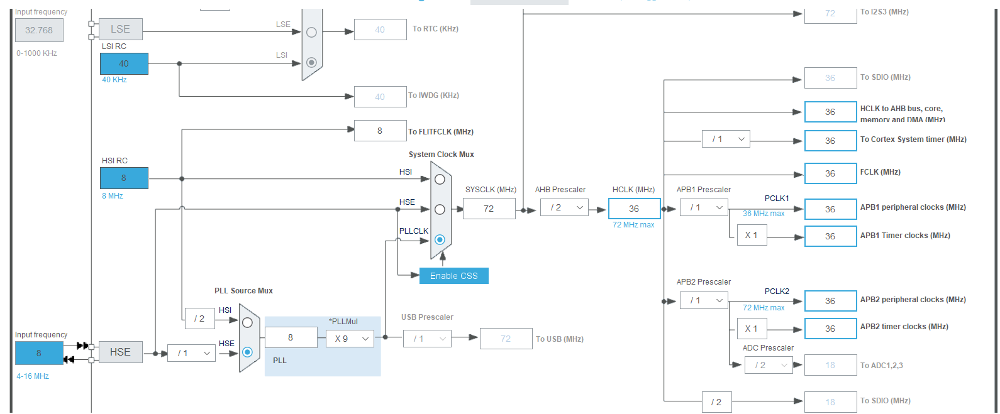
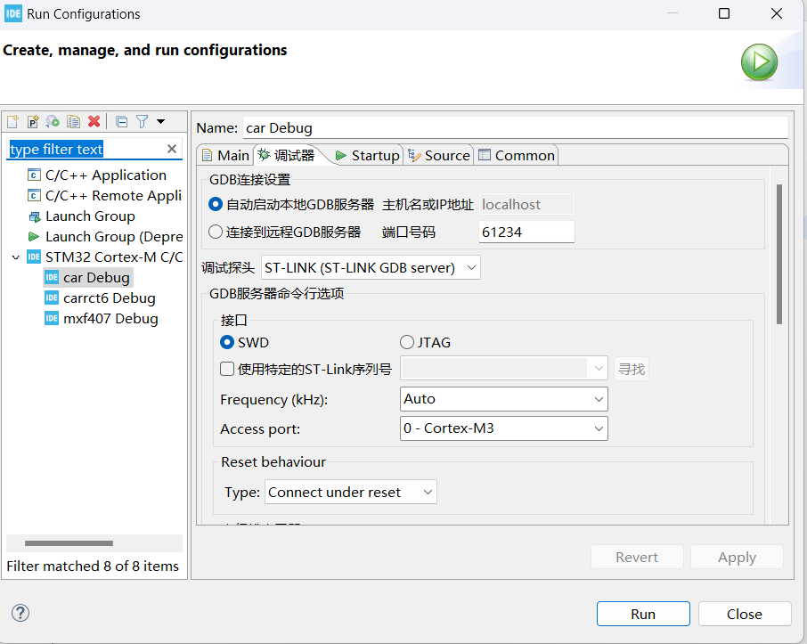
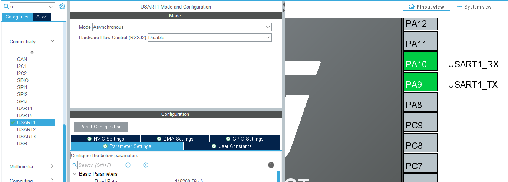
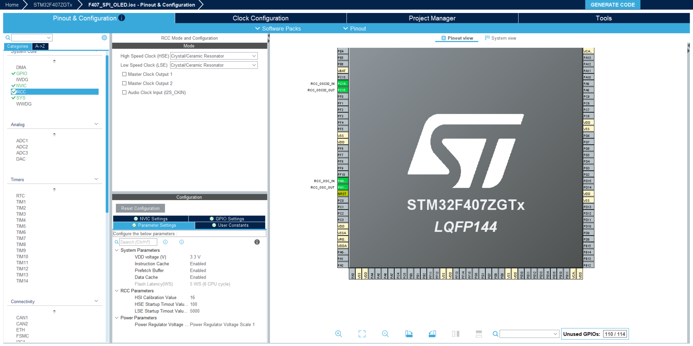
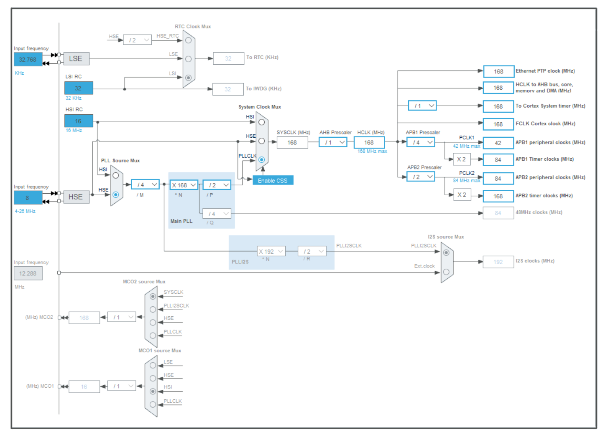

# STM32 F103

## 0.stlink连接stm32

面对缺口那一边，第4、5个分别为swdio和swclk

使用3.3V供电

## 1.CUBE  MX

1.1 使用f103rct6



## 2.IDE

**2.1KEIL**

刚下载下来的keil无法直接使用，所以需要下载f1和f4系列的包裹pack

**2.2 CUBE IDE**




## 3.重定向

> 1. 使用异步通信，则使用rx和tx两条数据线
> 2. 使用同步通信，还需要多一条sck时钟线

首先在cubemx中配置：



然后将ch340连接到PA9和PA10上面。

使用重定向，在`usart.c`中，这样才能保证在while中使用`printf`:

```

#include "stdio.h"

#ifdef __GNUC__

#define PUTCHAR_PROTOTYPE int __io_putchar(int ch)

PUTCHAR_PROTOTYPE
{

  HAL_UART_Transmit(&huart1, (uint8_t*)&ch, 1, HAL_MAX_DELAY);
  return ch;
}
#endif

```


# F407 ZGT6

## 外部时钟配置




## 时钟树配置


