# 界面与操作

> 哎，最近又迷上了这个，开个新坑

先看一下基本的界面：
> 这个是ue的入门教程

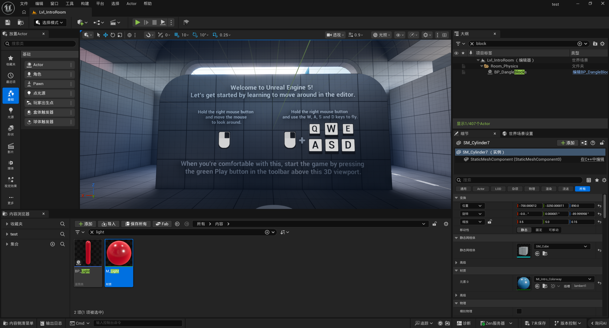

---

基本的操作：

1. 控制界面：
   - 按住鼠标右键，可以环视四周
   - 按住鼠标左键，可以通过WASD来前进后退等

2. 启动游戏和编辑器：
   - 启动游戏：快捷键`alt+p`或者按界面上的绿色播放键。
   - 切换到编辑器：按 `esc`即可退出游戏模式

3. 移动物体：

   > 要切换到编辑器模式

   然后选中一个物体，通过一下命令去编辑物体：

   - W ： 移动物体
   - E ： 旋转物体
   - R ：缩放物体

---

看一下主要的功能区：

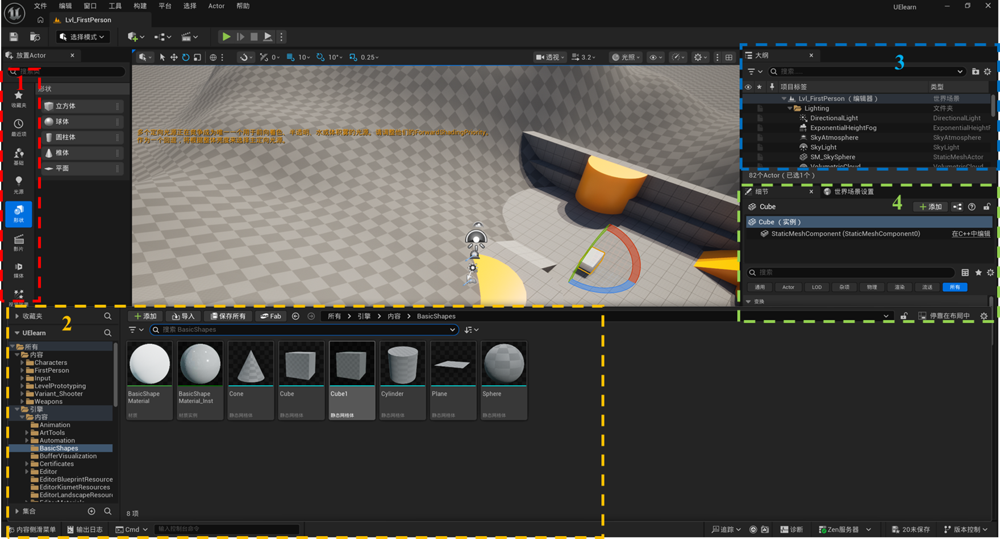

1. 这部分是“放置actor”，作用是放置一些基本的模型，如立方体；或者光照等
2. 这部分是整个项目的assets，代码、蓝图、各种资产模型都会在这里。
3. 这里是大纲，所有在场景中出现的，都会出现在这里。选中某个组件，可以通过点击f来快速定位到场景中的模型
4. 分为两个tab，分别是“细节”和“世界场景设置”，其中细节需要选中具体的模型后再进行修改。世界场景则是修改当前关卡的一些全局性设置

# 蓝图

## 创建蓝图并导入场景

在侧滑菜单中，新建一个蓝图类，选择actor即可。

不同类的作用（来自Gemini老师）：

- actor：这是虚幻引擎中最基础的世界对象类。任何可以被放置（Place）或动态生成（Spawn）到游戏关卡（Level）中的东西都是 Actor。它拥有空间位置、旋转和缩放属性（Transform）。**使用场景：** 几乎所有不需要被玩家直接控制的物体。例如：关卡中的机关门、地上的掉落物（如武器、血包）、篝火堆、或者一个不可见的事件触发区域（Trigger Box）。
- pawn（人质，兵卒）：Pawn 是 Actor 的子类。它的核心特性是可以被“附身”（Possess）。这意味着它可以接收来自玩家控制器（Player Controller）或 AI 控制器的输入指令。**使用场景：** 需要被控制，但不需要复杂的双足行走逻辑的物体。例如：一辆赛车、一架无人机、星际争霸里的飞船、或者一个玩家可以操控的固定机枪塔。
- 角色：角色是 Pawn 的高级且极其常用的子类。它专门为人形（或类似人形）生物设计，天生自带了极其强大的“角色移动组件（Character Movement Component）”和一个胶囊体碰撞。它内置了网络同步的行走、跳跃、下落、游泳等物理逻辑。**使用场景：** 任何需要在场景中走动、跳跃的生物。例如：玩家控制的主角（RPG英雄、射击游戏角色）、在城里巡逻的 NPC、以及追逐玩家的怪物。
- 玩家控制器：它是玩家在游戏世界中的“灵魂”或“大脑”。它负责接收来自键盘、鼠标或手柄的物理输入，并将其转化为游戏内的指令。即使玩家的“肉体”（Pawn/Character）死亡被销毁，控制器依然存在。**使用场景：** 处理不属于特定肉体的宏观逻辑。例如：打开和关闭 UI 菜单（背包、暂停界面）、在角色死亡时切换观战视角、显示鼠标光标、或者在 GTA 这种游戏中控制玩家从“人”切换到“车”（在不同 Pawn 之间转移控制权）。
- 游戏模式基础：这是当前关卡（Level）的“规则书”。它定义了游戏的基础规则，比如默认使用哪个玩家控制器、生成哪个角色、以及如何判定胜利/失败。**注意：在多人游戏中，GameMode 只存在于服务器上。****使用场景：** 编写全局游戏逻辑。例如：在“团队死斗”模式中计算双方杀敌数、控制一局比赛的倒计时、或者在游戏开始时将玩家分配到不同的队伍并生成到指定的出生点。
- actor组件： 这是一段可复用的“纯逻辑/数据”模块，它**没有**物理形态和空间位置（Transform）。你可以把它“挂载”到任何 Actor 上，赋予其特定的能力，是实现代码解耦和复用的神器。**使用场景：** 一个“生命值组件”（管理扣血、回血和死亡逻辑）、一个“背包组件”（存储和管理物品数据）、或者一个“耐力值组件”。把它们写成组件后，你可以轻松地把它同时挂载给玩家、敌人甚至是一个可破坏的木箱。
- 场景组件：它是 Actor 组件的一种，但它**拥有**空间位置、旋转和缩放（Transform）。它主要用于搭建 Actor 内部的物理层级结构。**使用场景：** 作为空间锚点或占位符。例如：在角色蓝图中添加一个场景组件作为“枪口位置”，用来精确控制开火时子弹生成的地方；或者作为一个不可见的悬臂，用来把摄像机挂在角色背后（弹簧臂组件就是它的一种）。

**总结：GameMode制定了规则。游戏开始时，引擎分配一个 Player Controller（大脑）给玩家。这个大脑会附身（Possess）到一个 Character（肉体）进行移动和操作。这个肉体身上挂载了各种 Component（器官/技能部件）来实现具体的游戏机制。**

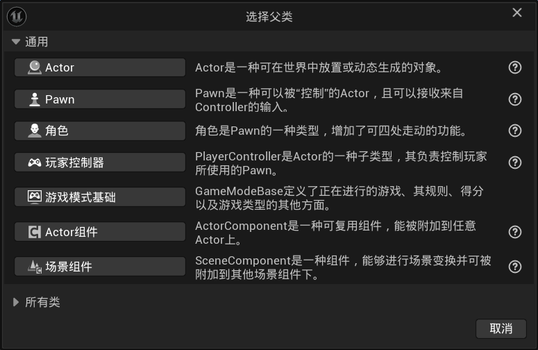

打开之后的界面如下图所示：

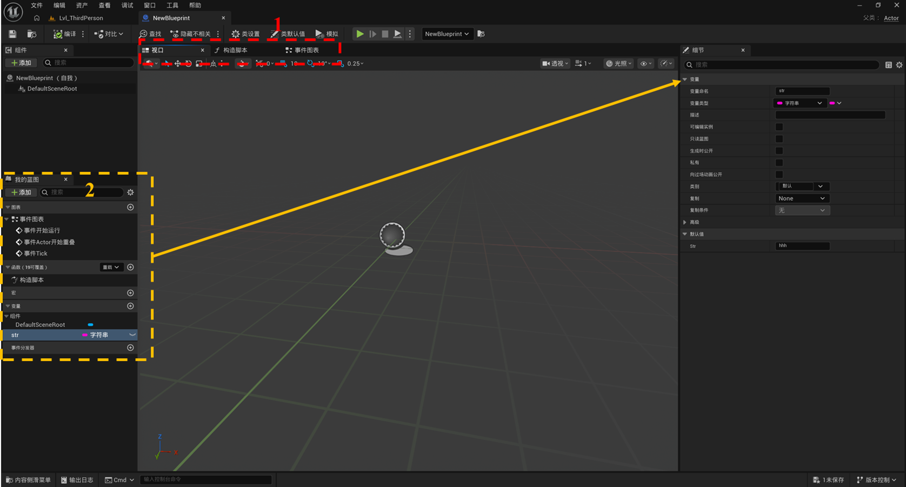

主要部分介绍：

1区：蓝图类中，包含的三个部分：

- 视口：这个就是蓝图类后面放到场景中的效果
- 构造脚本：在游戏正式运行之前就已经完成了工作
- 事件图表：蓝图类的执行逻辑

2区：

- 图表：里面包含了事件图表，也就是1区中的事件图表中三个类，即
  - 事件开始运行：启动时即运行
  - 事件actor开始重叠：当actor与当前的蓝图类重叠时触发
  - 事件tick：游戏没渲染一帧，就会触发一次
- 函数：一个具体的功能，可以进行封装，比如开关门
- 变量：定义变量类型和变量名，在右侧的小窗口中进行定义

---

## hello world

> 通过蓝图实现：当运行这个game的时候，就在屏幕上打印hello world

如下配置，然后将该蓝图类拖动到场景中：

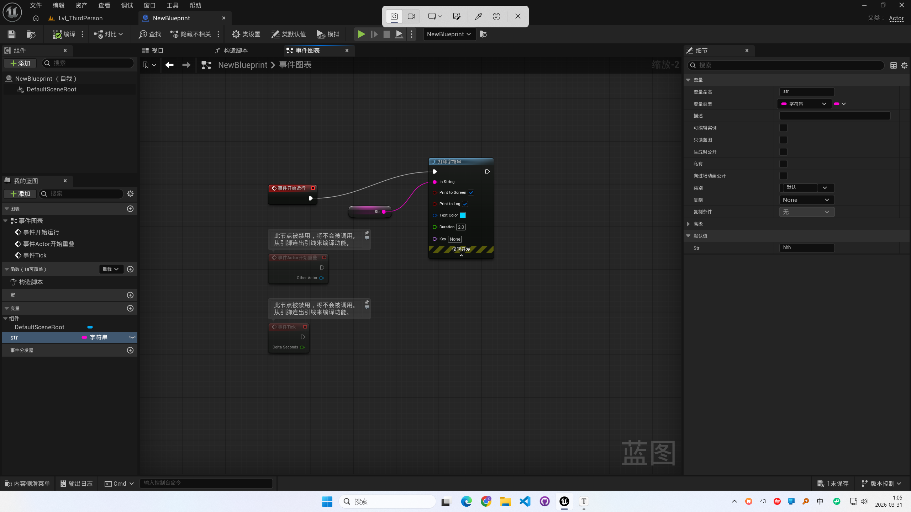

然后在运行的时候，就会有打印输出：

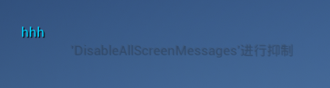

## 玩家移动

### 新建一个gamemode和角色蓝图

因为目前打开的是ue自带的第三人称的game mode，所以首先是取消默认的gamemode，选择刚才新建的蓝图类gamemode：

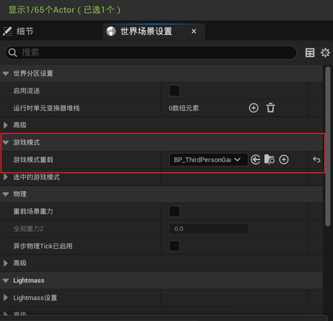

然后在 **编辑->项目设置->地图和模式**中，将game mode同步修改：

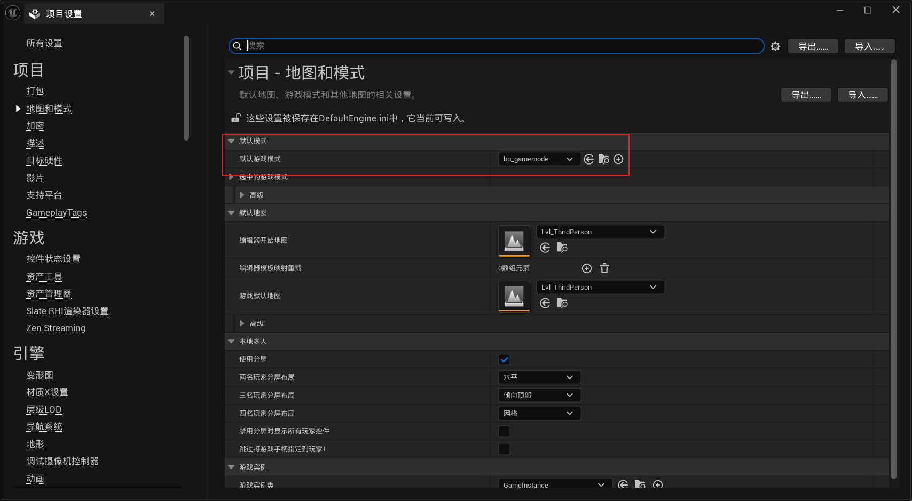

---

game mode类中，需要用到默认的pawn类，也就是角色。需要新建一个character的角色蓝图类。然后在game mode类中指定：

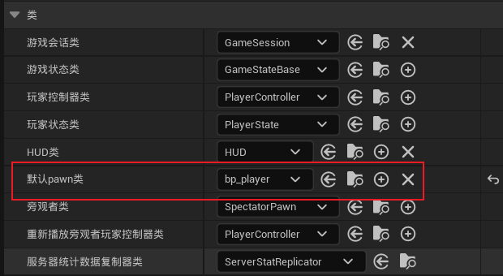

**此时运行游戏，是没有效果的，表明设置是有效果的。**

---

### 使用增强输入来定义输入映射

使用**增强输入**来实现玩家输入：

新建一个增强输入：

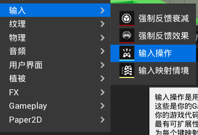

点进去之后，选择值类型为 **Axis2D**，这里简化了角色移动，只在二维内移动：

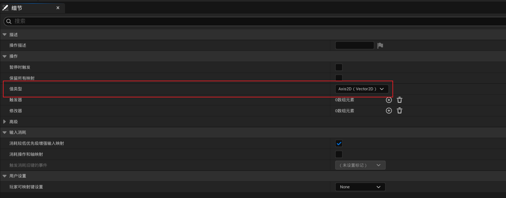

在这之后，新建一个 **输入映射情景**，用于定义按键：

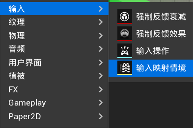

要明确，我们要做到的是：wasd控制前后左右移动，那么在二维中，w和s对应的y轴增减，a和d对应的x轴增减。

- 对于w和s：默认的移动方向是y（yxz）轴，不用管方向，s需要设为否定（negative的翻译），即相反的方向
- 对于a和d：需要移动的是x轴，需要选择 **拌合输入轴值**，也就是颠倒输入的顺序，先影响x轴。a往负方向移动，选择否定。

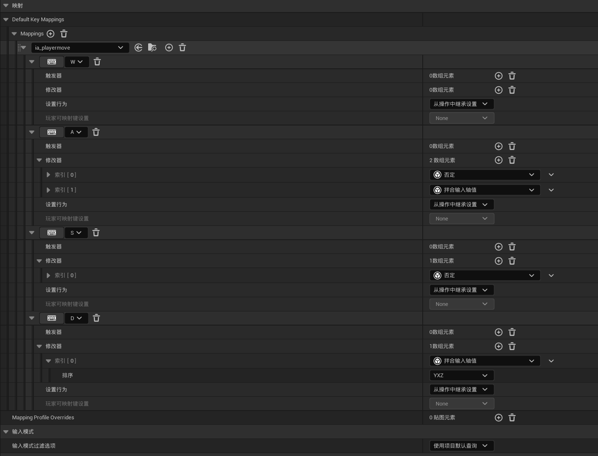

### 定义玩家行为

**定义玩家的行为，实现wasd移动，在玩家的character蓝图中进行操作**

首先，在玩家蓝图中，激活增强输入：

> 用到的蓝图节点有：
>
> - 获取玩家控制器（get player controller）
> - 增强输入本地玩家子系统（enhance sub ）
> - 添加映射上下文（add mapping）

这样就会在一开始运行，就会关联对应的imc_input输入控制

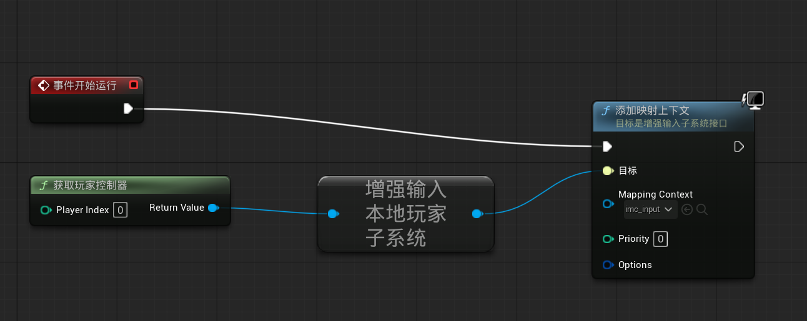

---

然后，需要定义wasd的行为：

> 用到的节点有：
>
> - enhancedinputaction [输入增强蓝图]  (直接搜 输入增强蓝图即可)
> - 获取actor向前向量 （get forward）
> - 拆分向量2d （break vector 2d）
> - 添加移动输入 （add move input）
> - 获取actor向右向量 （get actor right）

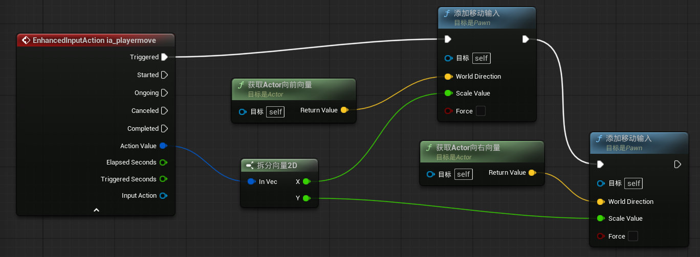

1. 行为流：按下wasd后，就会一直移动，而不是移动一下，所以是trigger。下一个行为是控制玩家的移动，拆分xy后，分别修改不同方向
2. 增强输入的向量是2d axis的，之前有配置. 然后将这个二维向量拆分为x和y,分别控制角色两个方向上的移动

---

**实现鼠标的视角移动**

> 用到的节点有:
>
> - enhancedinputaction [输入增强蓝图]  (直接搜 输入对应的增强蓝图即可)
> - 

新建一个增强输入,定义为axis 2d:

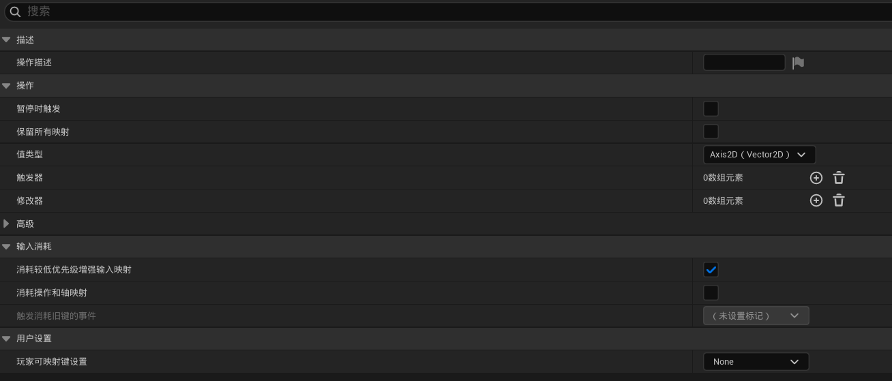

然后在imc映射中,设置鼠标映射:

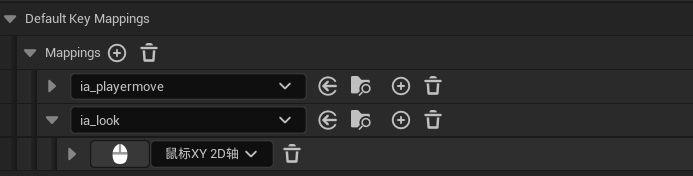

在玩家的蓝图中,设置鼠标控制的行为:

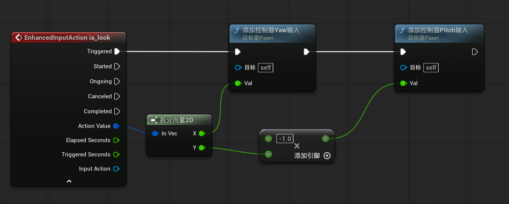

