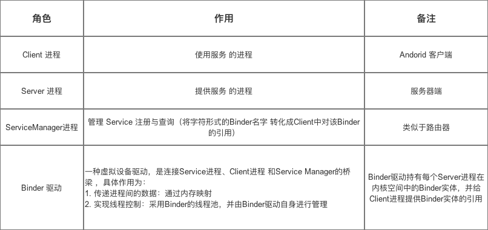
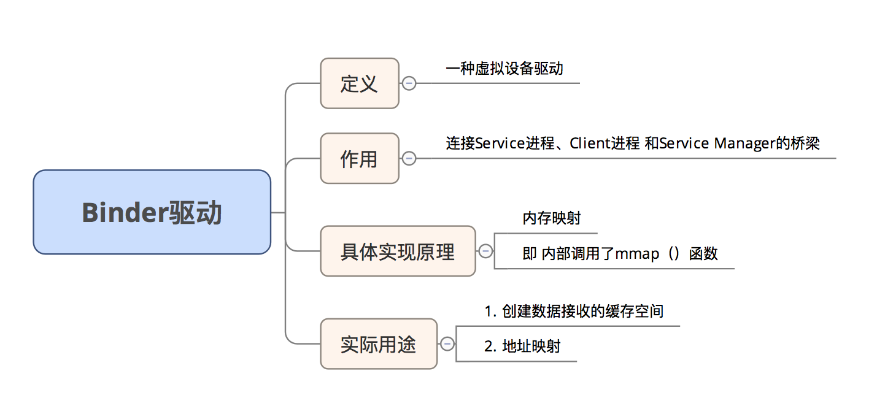
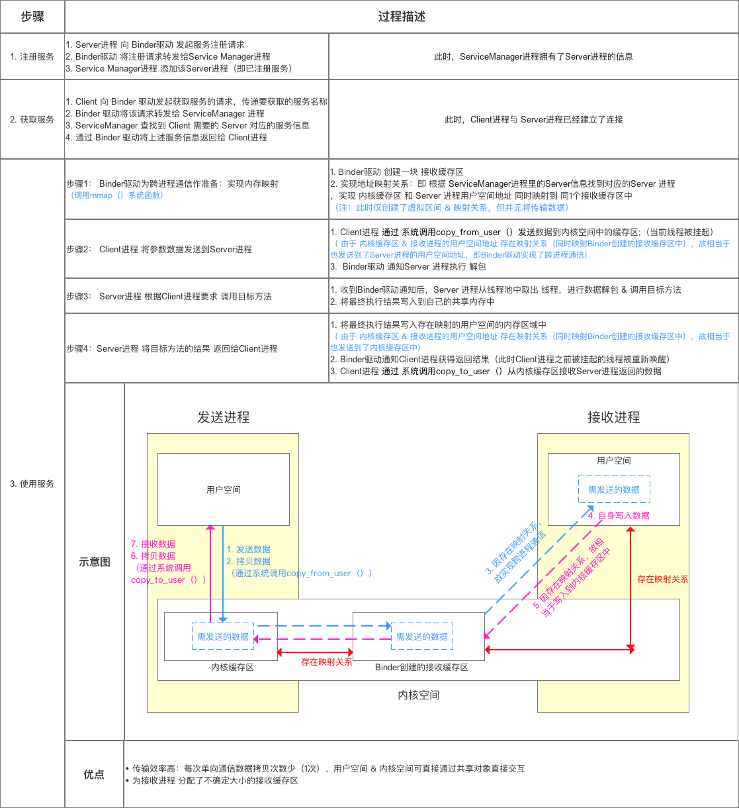
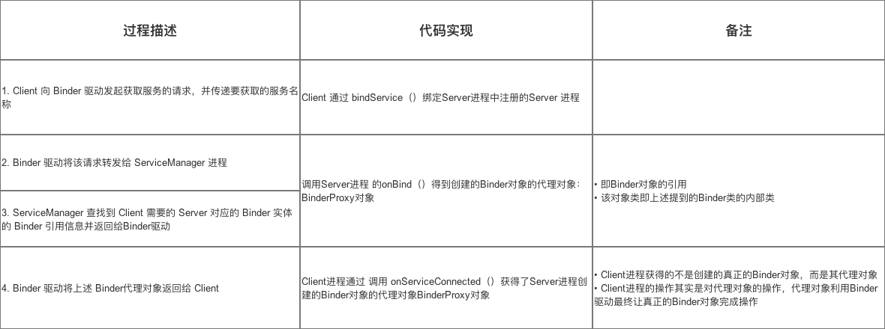
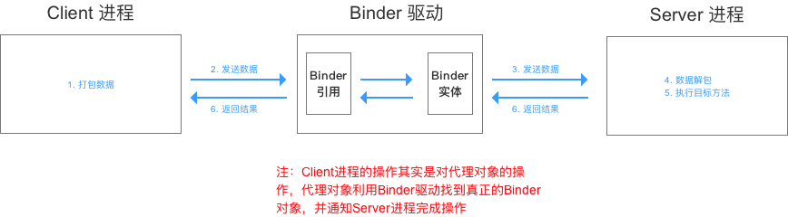
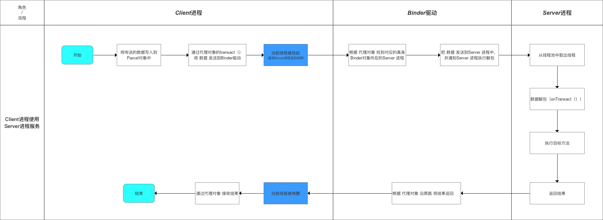
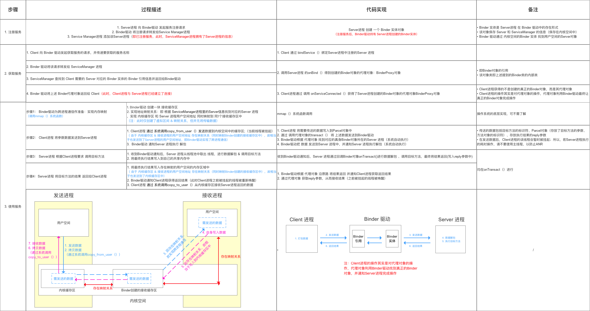

# Android


# 1.安卓组件


## 跨进程通信binder

> C/S架构即客户端/服务器（Client/Server）架构，是一种经典的分布式计算模型。在此架构中，客户端和服务器是两个主要角色，各自承担不同功能并协同工作。 客户端是用户直接交互的应用程序，运行在用户设备（如个人电脑、手机等）上。它负责向用户呈现界面，接收用户输入，并将用户请求发送到服务器。例如常见的浏览器作为客户端，用户通过浏览器访问网页，输入网址后，浏览器将请求发送给服务器；又如桌面端的即时通讯软件客户端，用户输入消息，客户端将其封装为请求并传输给服务器。 服务器则是提供各种服务和资源的计算机系统，通常具备强大的计算能力、存储能力和网络性能。它接收来自客户端的请求，根据请求类型进行相应处理，如查询数据库获取数据、执行复杂运算等，然后将处理结果返回给客户端。像网站服务器，接收浏览器发送的网页请求后，从存储网页数据的数据库中检索相关内容，处理后将网页内容返回给浏览器；文件服务器接收客户端的文件下载请求，从存储设备中读取文件数据并传输给客户端。 C/S架构通过网络协议（如TCP/IP）实现客户端与服务器之间的通信。这种架构具有诸多优点，如能充分利用客户端设备资源，提供丰富交互体验；服务器集中管理数据和业务逻辑，便于维护和更新。然而，它也存在一些局限性，例如客户端需针对不同操作系统和设备开发，部署和维护成本较高；对网络依赖性强，网络故障可能影响服务质量。 

Binder 通信采用C/S架构，从组件视角来说，包含Client、Server、 ServiceManager 以及 binder 驱动，其中ServiceManager 用于管理系统中的各 种服务。

中文即 粘合剂，意思为粘合了两个不同的进程

网上有很多对Binder的定义，但都说不清楚：Binder是跨进程通信方式、它实现了IBinder接口，是连接 ServiceManager的桥梁blabla，估计大家都看晕了，没法很好的理解

我认为：对于Binder的定义，在不同场景下其定义不同


### Linux进程

- 一个进程空间分为 用户空间 & 内核空间（`Kernel`），即把进程内 用户 & 内核 隔离开来
- 二者区别：
  1. 进程间，用户空间的数据不可共享，所以用户空间 = 不可共享空间
  2. 进程间，内核空间的数据可共享，所以内核空间 = 可共享空间

- 进程内 用户空间 & 内核空间 进行交互 需通过 **系统调用**，主要通过函数：

> 1. copy_from_user（）：将用户空间的数据拷贝到内核空间
> 2. copy_to_user（）：将内核空间的数据拷贝到用户空间


### 进程隔离 跨进程通信（IPC）

- 进程隔离
  为了保证 安全性 & 独立性，一个进程 不能直接操作或者访问另一个进程，即`Android`的进程是**相互独立、隔离的**
- 跨进程通信（ `IPC` ）
  即进程间需进行数据交互、通信
- 跨进程通信的基本原理


### Binder 跨进程通信机制 模型

`Binder` 跨进程通信机制 模型 基于 `Client - Server` 模式






- `Binder`跨进程通信的核心原理

> 关于其核心原理：内存映射，具体请看文章：[操作系统：图文详解 内存映射](https://www.jianshu.com/p/719fc4758813)


- 模型原理步骤




### Binder机制 在Android中的具体实现原理

- `Binder`机制在 `Android`中的实现主要依靠 `Binder`类，其实现了`IBinder` 接口

- 实例说明：`Client`进程 需要调用 `Server`进程的加法函数（将整数a和b相加）

  即：

  1. `Client`进程 需要传两个整数给 `Server`进程
  2. `Server`进程 需要把相加后的结果 返回给`Client`进程

---

**步骤1：注册服务**
过程描述
Server进程 通过Binder驱动 向 Service Manager进程 注册服务
代码实现

```
    
    Binder binder = new Stub();
    // 步骤1：创建Binder对象 ->>分析1

    // 步骤2：创建 IInterface 接口类 的匿名类
    // 创建前，需要预先定义 继承了IInterface 接口的接口 -->分析3
    IInterface plus = new IPlus(){

          // 确定Client进程需要调用的方法
          public int add(int a,int b) {
               return a+b;
         }

          // 实现IInterface接口中唯一的方法
          public IBinder asBinder（）{ 
                return null ;
           }
};
          // 步骤3
          binder.attachInterface(plus，"add two int");
         // 1. 将（add two int，plus）作为（key,value）对存入到Binder对象中的一个Map<String,IInterface>对象中
         // 2. 之后，Binder对象 可根据add two int通过queryLocalIInterface（）获得对应IInterface对象（即plus）的引用，可依靠该引用完成对请求方法的调用
        // 分析完毕，跳出


<-- 分析1：Stub类 -->
    public class Stub extends Binder {
    // 继承自Binder类 ->>分析2

          // 复写onTransact（）
          @Override
          boolean onTransact(int code, Parcel data, Parcel reply, int flags){
          // 具体逻辑等到步骤3再具体讲解，此处先跳过
          switch (code) { 
                case Stub.add： { 

                       data.enforceInterface("add two int"); 

                       int  arg0  = data.readInt();
                       int  arg1  = data.readInt();

                       int  result = this.queryLocalIInterface("add two int") .add( arg0,  arg1); 

                        reply.writeInt(result); 

                        return true; 
                  }
           } 
      return super.onTransact(code, data, reply, flags); 

}
// 回到上面的步骤1，继续看步骤2

<-- 分析2：Binder 类 -->
 public class Binder implement IBinder{
    // Binder机制在Android中的实现主要依靠的是Binder类，其实现了IBinder接口
    // IBinder接口：定义了远程操作对象的基本接口，代表了一种跨进程传输的能力
    // 系统会为每个实现了IBinder接口的对象提供跨进程传输能力
    // 即Binder类对象具备了跨进程传输的能力

        void attachInterface(IInterface plus, String descriptor)；
        // 作用：
          // 1. 将（descriptor，plus）作为（key,value）对存入到Binder对象中的一个Map<String,IInterface>对象中
          // 2. 之后，Binder对象 可根据descriptor通过queryLocalIInterface（）获得对应IInterface对象（即plus）的引用，可依靠该引用完成对请求方法的调用

        IInterface queryLocalInterface(Stringdescriptor) ；
        // 作用：根据 参数 descriptor 查找相应的IInterface对象（即plus引用）

        boolean onTransact(int code, Parcel data, Parcel reply, int flags)；
        // 定义：继承自IBinder接口的
        // 作用：执行Client进程所请求的目标方法（子类需要复写）
        // 参数说明：
        // code：Client进程请求方法标识符。即Server进程根据该标识确定所请求的目标方法
        // data：目标方法的参数。（Client进程传进来的，此处就是整数a和b）
        // reply：目标方法执行后的结果（返回给Client进程）
         // 注：运行在Server进程的Binder线程池中；当Client进程发起远程请求时，远程请求会要求系统底层执行回调该方法

        final class BinderProxy implements IBinder {
         // 即Server进程创建的Binder对象的代理对象类
         // 该类属于Binder的内部类
        }
        // 回到分析1原处
}

<-- 分析3：IInterface接口实现类 -->

 public interface IPlus extends IInterface {
          // 继承自IInterface接口->>分析4
          // 定义需要实现的接口方法，即Client进程需要调用的方法
         public int add(int a,int b);
// 返回步骤2
}

<-- 分析4：IInterface接口类 -->
// 进程间通信定义的通用接口
// 通过定义接口，然后再服务端实现接口、客户端调用接口，就可实现跨进程通信。
public interface IInterface
{
    // 只有一个方法：返回当前接口关联的 Binder 对象。
    public IBinder asBinder();
}
  // 回到分析3原处

```


---

**步骤2：获取服务**

- `Client`进程 使用 某个 `service`前（此处是 **相加函数**），须 通过`Binder`驱动 向 `ServiceManager`进程 获取相应的`Service`信息
- 具体代码实现过程如下：



**此时，`Client`进程与 `Server`进程已经建立了连接**

---

**步骤3：使用服务**

Client进程 根据获取到的 Service信息（Binder代理对象），通过Binder驱动 建立与 该Service所在Server进程通信的链路，并开始使用服务

过程描述

Client进程 将参数（整数a和b）发送到Server进程
Server进程 根据Client进程要求调用 目标方法（即加法函数）
Server进程 将目标方法的结果（即加法后的结果）返回给Client进程

- 过程描述
  1. `Client`进程 将参数（整数a和b）发送到`Server`进程
  2. `Server`进程 根据`Client`进程要求调用 目标方法（即加法函数）
  3. `Server`进程 将目标方法的结果（即加法后的结果）返回给`Client`进程
- 代码实现过程

1. client进程将参数（整数a和b）发送给server进程

   ```
   // 1. Client进程 将需要传送的数据写入到Parcel对象中
   // data = 数据 = 目标方法的参数（Client进程传进来的，此处就是整数a和b） + IInterface接口对象的标识符descriptor
     android.os.Parcel data = android.os.Parcel.obtain();
     data.writeInt(a); 
     data.writeInt(b); 
   
     data.writeInterfaceToken("add two int");；
     // 方法对象标识符让Server进程在Binder对象中根据"add two int"通过queryLocalIInterface（）查找相应的IInterface对象（即Server创建的plus），Client进程需要调用的相加方法就在该对象中
   
     android.os.Parcel reply = android.os.Parcel.obtain();
     // reply：目标方法执行后的结果（此处是相加后的结果）
   
   // 2. 通过 调用代理对象的transact（） 将 上述数据发送到Binder驱动
     binderproxy.transact(Stub.add, data, reply, 0)
     // 参数说明：
       // 1. Stub.add：目标方法的标识符（Client进程 和 Server进程 自身约定，可为任意）
       // 2. data ：上述的Parcel对象
       // 3. reply：返回结果
       // 0：可不管
   
   // 注：在发送数据后，Client进程的该线程会暂时被挂起
   // 所以，若Server进程执行的耗时操作，请不要使用主线程，以防止ANR
   
   
   // 3. Binder驱动根据 代理对象 找到对应的真身Binder对象所在的Server 进程（系统自动执行）
   // 4. Binder驱动把 数据 发送到Server 进程中，并通知Server 进程执行解包（系统自动执行）
   
   
   ```

2. server进程根据client要求调用目标方法

   ```
   // 1. 收到Binder驱动通知后，Server 进程通过回调Binder对象onTransact（）进行数据解包 & 调用目标方法
     public class Stub extends Binder {
   
             // 复写onTransact（）
             @Override
             boolean onTransact(int code, Parcel data, Parcel reply, int flags){
             // code即在transact（）中约定的目标方法的标识符
   
             switch (code) { 
                   case Stub.add： { 
                     // a. 解包Parcel中的数据
                          data.enforceInterface("add two int"); 
                           // a1. 解析目标方法对象的标识符
   
                          int  arg0  = data.readInt();
                          int  arg1  = data.readInt();
                          // a2. 获得目标方法的参数
                         
                          // b. 根据"add two int"通过queryLocalIInterface（）获取相应的IInterface对象（即Server创建的plus）的引用，通过该对象引用调用方法
                          int  result = this.queryLocalIInterface("add two int") .add( arg0,  arg1); 
                         
                           // c. 将计算结果写入到reply
                           reply.writeInt(result); 
                           
                           return true; 
                     }
              } 
         return super.onTransact(code, data, reply, flags); 
         // 2. 将结算结果返回 到Binder驱动
   
   
   
   ```

3. server进程将目标方法的结果（加法后的结果）返回给client进程






### 优点





## 四大组件在项目结构中的体现

在安卓项目结构中，四大组件各自有不同体现。 

1. **Activity（活动）**：    - **代码层面**：每个Activity是一个继承自 `Activity` 或其派生类（如 `AppCompatActivity`）的Java或Kotlin类。例如在 `src` 目录下的 `main/java`（以Java为例），会有多个Activity类文件，如 `MainActivity.java`，在其中定义界面逻辑、用户交互等功能，包括处理按钮点击、文本输入等事件。    - **布局层面**：每个Activity通常有对应的布局文件，位于 `res/layout` 目录下。例如 `activity_main.xml`，通过XML文件定义Activity的用户界面元素，如按钮、文本框、图像等的位置和样式。    - **配置文件**：在 `AndroidManifest.xml` 中进行声明，包括Activity的名称、标签、启动模式等属性。例如，`<activity android:name=".MainActivity" android:label="@string/app_name"></activity>`，还可声明其是否为启动Activity等重要信息。 
2. **Service（服务）**：    - **代码层面**：是继承自 `Service` 类的Java或Kotlin类，在 `src` 目录下定义，如 `MyService.java`。用于在后台执行长时间运行的操作，不提供用户界面，如音乐播放服务、文件下载服务等，其内部实现业务逻辑，如在 `onStartCommand` 方法中处理启动逻辑。    - **配置文件**：同样在 `AndroidManifest.xml` 中声明，`<service android:name=".MyService"></service>`，可设置服务的权限、是否允许绑定等属性。 
3.  **Broadcast Receiver（广播接收器）**：    - **代码层面**：继承自 `BroadcastReceiver` 类，在 `src` 目录下创建，如 `MyBroadcastReceiver.java`，重写 `onReceive` 方法来处理接收到的广播消息，可处理系统广播（如电池电量变化、网络连接变化）或自定义广播。    - **配置文件**：在 `AndroidManifest.xml` 中声明，可静态注册，如 `<receiver android:name=".MyBroadcastReceiver"><intent - filter><action android:name="android.intent.action.BOOT_COMPLETED"></action></intent - filter></receiver>`，也可在代码中动态注册，通过 `registerReceiver` 方法注册广播接收器并指定要接收的广播类型。 
4. **Content Provider（内容提供者）**：    - **代码层面**：继承自 `ContentProvider` 类，在 `src` 目录下实现，如 `MyContentProvider.java`，重写 `query`、`insert`、`update`、`delete` 等方法，以提供对数据的增删改查操作，可用于跨应用共享数据。    - **配置文件**：在 `AndroidManifest.xml` 中声明，`<provider android:name=".MyContentProvider" android:authorities="com.example.myprovider"></provider>`，`authorities` 属性用于唯一标识内容提供者，其他应用通过该标识访问共享数据。 


## Activity

Activity 生命周期描述了一个 Activity 从创建到销毁的整个过程，包含多个状态和对应的回调方法，以下是详细阐述：

### 生命周期

#### 完整生命周期

从 Activity 被创建到最终被销毁的整个过程，涉及的回调方法有 `onCreate()`、`onStart()`、`onResume()`、`onPause()`、`onStop()`、`onDestroy()`。

- **onCreate()**：Activity 首次创建时调用。在这个方法里，通常会进行一些初始化操作，比如调用 `setContentView()` 来加载布局，初始化成员变量等。此方法只会在 Activity 的整个生命周期中调用一次。
- **onStart()**：当 Activity 对用户即将可见时调用。此时 Activity 还未出现在前台，用户还无法与之交互。
- **onResume()**：Activity 进入前台并开始与用户进行交互时调用。此时 Activity 处于运行状态，用户可以看到并操作该 Activity。
- **onPause()**：当系统准备启动或恢复另一个 Activity 时调用。一般在此方法中进行一些轻量级的、必须立即执行的资源释放操作，如暂停动画、停止一些不必要的传感器数据采集等，以保证新 Activity 能顺利启动。此方法执行完成后，Activity 部分可见但不可交互。
- **onStop()**：当 Activity 对用户不再可见时调用。可能是因为另一个 Activity 完全覆盖了当前 Activity，或者当前 Activity 正在被销毁。在这个方法中可以进行一些较为重量级的资源释放操作，如停止网络请求、关闭数据库连接等。
- **onDestroy()**：Activity 被销毁前调用。这是 Activity 生命周期中的最后一个回调方法，通常在此方法中进行最终的资源清理工作，确保没有资源泄漏。

#### 可见生命周期

从 Activity 对用户可见到不可见的过程，涉及的回调方法有 `onStart()`、`onResume()`、`onPause()`、`onStop()`。

- 当 Activity 启动时，依次调用 `onStart()` 和 `onResume()` 方法，Activity 变得可见且可交互。
- 当有新的 Activity 启动或者当前 Activity 进入后台时，依次调用 `onPause()` 和 `onStop()` 方法，Activity 变得不可见。
- 当 Activity 重新回到前台时，会依次调用 `onRestart()`、`onStart()` 和 `onResume()` 方法。

#### 前台生命周期

从 Activity 进入前台与用户交互到离开前台的过程，涉及的回调方法有 `onResume()`、`onPause()`。

- 当 Activity 进入前台时调用 `onResume()` 方法，Activity 处于运行状态。
- 当 Activity 需要暂停时调用 `onPause()` 方法，Activity 部分可见但不可交互。


### 启动模式

在安卓开发中，Activity有四种启动模式，它们分别是standard、singleTop、singleTask和singleInstance，下面详细阐述：

#### standard

- **特点**：这是Activity的默认启动模式。每次启动一个Activity，系统都会创建一个新的Activity实例并将其压入调用者所在的任务栈栈顶，无论该实例在任务栈中是否已经存在。
- **应用场景**：适用于大多数普通的Activity，比如新闻列表页中的每一条新闻详情页，每次点击都可以打开一个新的详情页。
- **示例代码**：在AndroidManifest.xml中不指定启动模式时，默认就是standard模式。

```xml
<activity android:name=".StandardActivity">
</activity>
```

#### singleTop

- **特点**：如果新Activity已经位于任务栈的栈顶，那么系统不会创建新的Activity实例，而是复用栈顶的实例，并调用其`onNewIntent()`方法。若该Activity不在栈顶，系统则会创建新的实例并压入栈顶。
- **应用场景**：适用于接收通知启动的内容显示页，例如新闻类应用的通知栏消息，点击后打开新闻详情页，如果该详情页已经在栈顶，就直接复用，避免重复创建。
- **示例代码**：在AndroidManifest.xml中指定启动模式为singleTop。

```xml
<activity android:name=".SingleTopActivity"
    android:launchMode="singleTop">
</activity>
```

#### singleTask

- **特点**：系统会先在当前任务栈中查找是否存在该Activity的实例，如果存在，系统会将该Activity实例之上的所有Activity出栈，使该Activity实例位于栈顶，并调用其`onNewIntent()`方法；如果不存在，系统会创建该Activity的新实例并压入栈中。
- **应用场景**：适用于应用的主界面，例如一个应用的主页，无论从哪个界面返回主页，都希望直接显示主页，而不是创建多个主页实例。
- **示例代码**：在AndroidManifest.xml中指定启动模式为singleTask。

```xml
<activity android:name=".SingleTaskActivity"
    android:launchMode="singleTask">
</activity>
```

#### singleInstance

- **特点**：该模式下的Activity会独占一个任务栈，在整个系统中，该Activity只有一个实例，并且该实例会单独存在于一个新的任务栈中。当再次启动该Activity时，系统会直接复用该实例。
- **应用场景**：适用于需要全局唯一且独立运行的Activity，例如系统的来电界面，无论在哪个应用中接收到来电，都只会打开一个来电界面，并且该界面独立于其他应用的任务栈。
- **示例代码**：在AndroidManifest.xml中指定启动模式为singleInstance。

```xml
<activity android:name=".SingleInstanceActivity"
    android:launchMode="singleInstance">
</activity>
```


## View

### 绘制流程

View 的绘制流程主要包含测量（measure）、布局（layout）和绘制（draw）三个核心阶段，下面详细介绍：

#### 测量阶段

测量阶段的主要目的是确定 View 及其子 View 的大小。该阶段会调用 `measure(int widthMeasureSpec, int heightMeasureSpec)` 方法。

- **MeasureSpec**：这是一个 32 位的 int 值，高 2 位代表测量模式（SpecMode），低 30 位代表测量大小（SpecSize）。测量模式有以下三种：
  - **EXACTLY**：精确模式，View 的大小是由父容器指定的，View 需要按照这个大小来显示。例如，在 XML 中设置 `android:layout_width="100dp"` 或者 `android:layout_width="match_parent"` 时，在父容器能确定大小的情况下，就会是 EXACTLY 模式。
  - **AT_MOST**：最大模式，View 的大小不能超过父容器指定的大小。例如，在 XML 中设置 `android:layout_width="wrap_content"` 时，就会是 AT_MOST 模式。
  - **UNSPECIFIED**：未指定模式，父容器没有对 View 的大小进行限制，View 可以按照自己的意愿设置大小。这种模式比较少见，通常在 ScrollView 等控件中会使用。
- **测量流程**：
  1. 当调用 `View.measure()` 方法时，会调用 `onMeasure(int widthMeasureSpec, int heightMeasureSpec)` 方法。
  2. 在 `onMeasure()` 方法中，需要根据 MeasureSpec 来计算 View 的大小，并调用 `setMeasuredDimension(int measuredWidth, int measuredHeight)` 方法来设置测量好的宽度和高度。
  3. 如果是 ViewGroup，还需要遍历所有子 View，调用子 View 的 `measure()` 方法来测量子 View 的大小。

以下是一个简单的 `onMeasure()` 方法示例：

```java
@Override
protected void onMeasure(int widthMeasureSpec, int heightMeasureSpec) {
    int widthSize = MeasureSpec.getSize(widthMeasureSpec);
    int widthMode = MeasureSpec.getMode(widthMeasureSpec);
    int heightSize = MeasureSpec.getSize(heightMeasureSpec);
    int heightMode = MeasureSpec.getMode(heightMeasureSpec);

    int measuredWidth;
    int measuredHeight;

    if (widthMode == MeasureSpec.EXACTLY) {
        measuredWidth = widthSize;
    } else {
        // 这里可以根据自己的逻辑计算宽度
        measuredWidth = 200; 
    }

    if (heightMode == MeasureSpec.EXACTLY) {
        measuredHeight = heightSize;
    } else {
        // 这里可以根据自己的逻辑计算高度
        measuredHeight = 200; 
    }

    setMeasuredDimension(measuredWidth, measuredHeight);
}
```


#### 布局阶段

布局阶段的主要目的是确定 View 及其子 View 的位置。该阶段会调用 `layout(int l, int t, int r, int b)` 方法。

- 布局流程
  1. 当调用 `View.layout()` 方法时，会调用 `onLayout(boolean changed, int left, int top, int right, int bottom)` 方法。
  2. 在 `onLayout()` 方法中，需要根据父容器的布局规则和子 View 的测量大小，确定子 View 的位置，并调用子 View 的 `layout()` 方法来设置子 View 的位置。

以下是一个简单的 `onLayout()` 方法示例：

```java
@Override
protected void onLayout(boolean changed, int left, int top, int right, int bottom) {
    int childCount = getChildCount();
    int currentTop = top;
    for (int i = 0; i < childCount; i++) {
        View child = getChildAt(i);
        int childWidth = child.getMeasuredWidth();
        int childHeight = child.getMeasuredHeight();
        child.layout(left, currentTop, left + childWidth, currentTop + childHeight);
        currentTop += childHeight;
    }
}
```


#### 绘制阶段


# kotlin


