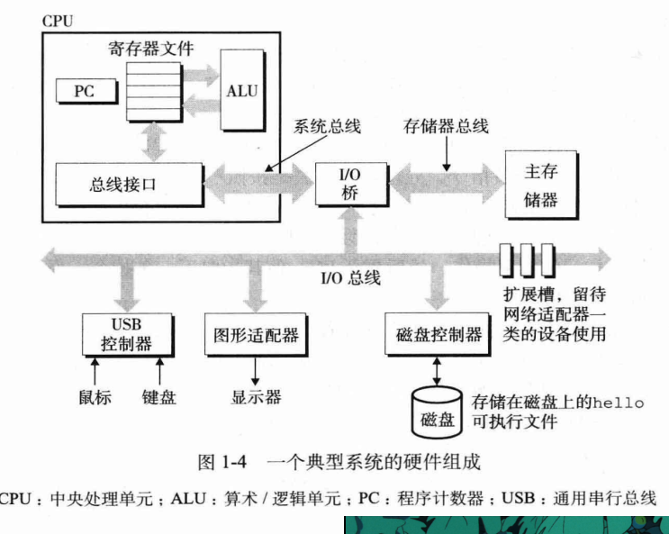
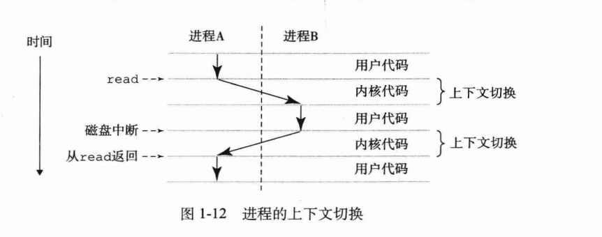
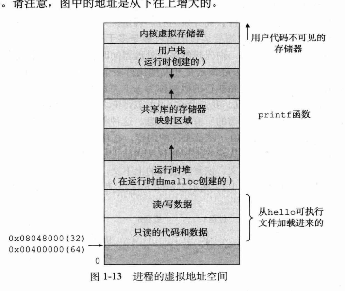
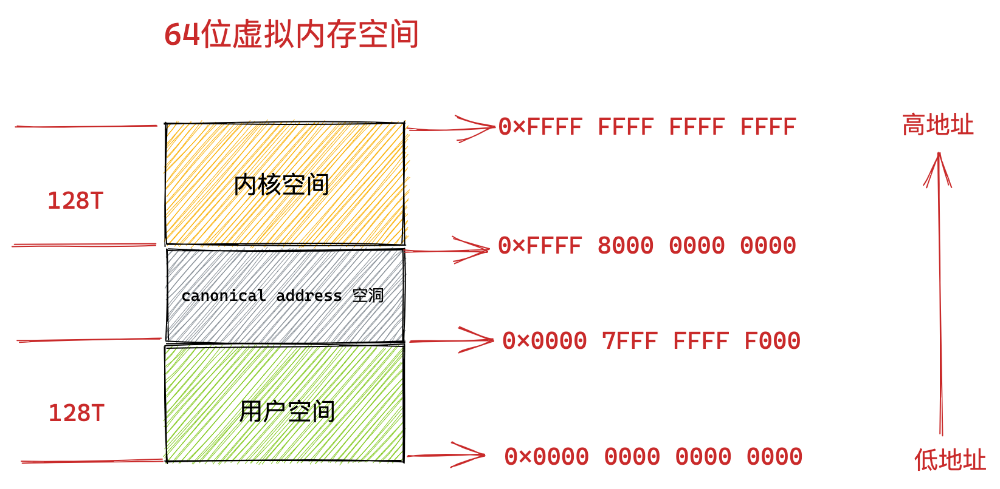
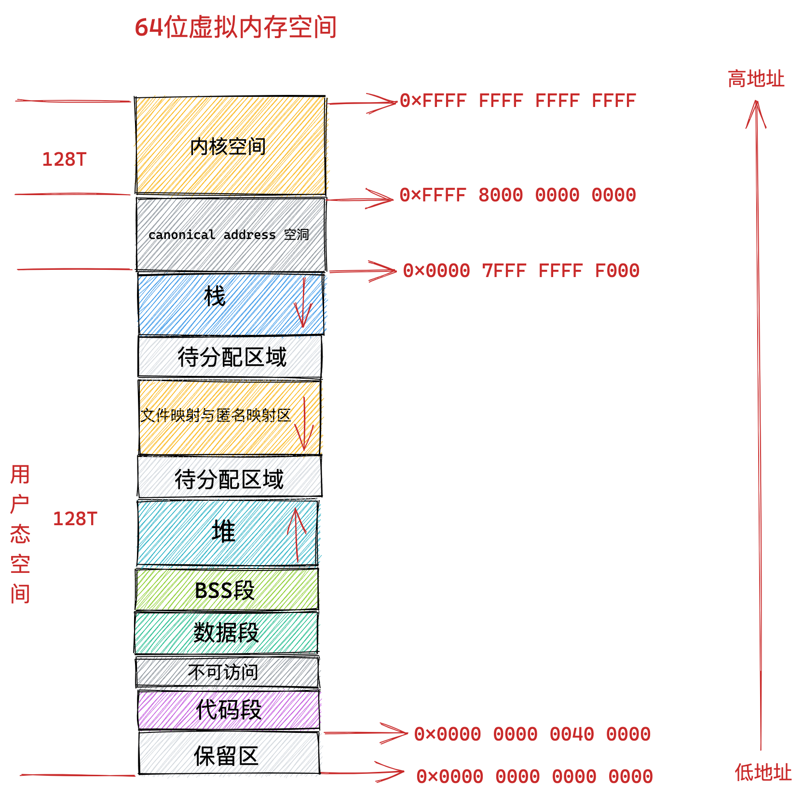

# 操作系统

 《深入理解计算机操作系统》

## 一、计算机系统漫游

### 计算机程序运行

- 预处理器（cpp）：根据以#开头的命令，读取.h中的内容，并插入到程序文本中，得到.i文件

- 编译器（ccl）：转成汇编程序，.s文件

- 汇编器（as）：将.s文件转成机器语言指令，并把指令打包成“可重定位目标程序”格式，打包进入.o格式，这是二进制文件

- 链接器（ld）：如：printf函数存在于printf.o的预编译好的目标文件中，这个文件必须以某种方式合并到.o程序中。链接器（ld）就负责这种合并，进而得到程序。是一个可执行目标文件
  
  

### 系统硬件组成

- 总线：贯穿整个系统的是一组电子管道，称作总线，携带信息字节在各个部件中传递。*总线被设计成传送定长的字节块，也就是字*，32位机器字长为4个字节，64为是8个

- I/O设备

- RAM

- ROM

- CPU:核心是PC，称为程序计数器。
  
  

猜猜当时在看什么电影：）  当然是《天空之城》

### 进程

进程是操作系统对正在运行的程序的一个抽象，在一个系统上可以运行多个进程。

- 并发运行：一个进程的指令和另一个进程 的指令是交错执行的。无论是单核/多核处理器，一个cpu看起来并发地执行多个进程。操作系统这种交错执行的机制称为**上下文切换**

- 上下文：操作系统保持跟踪进程运行所需的状态信息。包括：PC和寄存器文件的当前值，以及内存的内容。**单cpu系统只能执行一个进程的代码，当操作系统决定要把控制权切换到另一个进程时，会进行上下文切换，即保存当前进程 的上下文、恢复新进程的上下文，然后将控制权传递到新进程。** 下图表示了shell程序和用户程序上下文切换的过程。
  
  

### 线程

一个进程实际上由多个称为**线程**的执行单元组成，每个线程都运行在进程的上下文中，并共享同样的代码和全局数据。**多线程之间比多进程之间更容易共享数据，所以线程比进程高效**

好困啊，大白天的困~

### 虚拟存储器

为每个进程提供一个假象，每个进程都独占地使用主存，每个进程看到的是一致的存储器，称为虚拟地址空间。



每个进程看到的虚拟地址空间由大量准确定义的区构成：

- 程序代码和数据：对于所有进程来说，代码是从固定地址开始，紧接着是全局变量和对应的数据位置

- 堆：代码和数据区之后是堆。当调用malloc和free这样的c标准库函数时，堆可以在运行时动态地扩展和收缩

- 共享库：用来存放像c标准和数学库这样的共享库

- 栈：位于用户虚拟地址空间的顶部，称为用户栈。编译器用它来实现函数调用。和堆一样，用户栈在程序执行时可以动态扩展和收缩。**特别是调用函数时，栈就会增长；从函数返回时，栈就会收缩**

- 内核虚拟存储器：内核总是驻留在内存中，是操作系统的一部分。地址空间的顶部区域是为内核保留的

## 二、信息的表示和处理

## 三、程序的机器级表示

计算机执行机器代码，用字节序列编码低级的操作：处理数据、管理储存器、读写存储设备上的数据、网络通信。

**用高级语言编写的程序可以在很多电脑上编译和执行，而汇编代码只能于特定机器密切相关**

### 机器级代码

计算机提供了多种抽象，其中两种比较重要：1.指令集体系结构（instruction set architecture ，ISA），定义了处理器的状态，指令的格式，每条指令对状态的应性。ISA将程序的行为描述成每条指令按顺序执行。*进行某种操作时，cpu内各个寄存器、的状态，++--时要怎么配置寄存器*

2.机器级程序使用 的存储器时虚拟地址

### 数据格式

“字”（word）表示16位数据类型。32位数为双字，64位为四字

大多数GCC生成的汇编代码指令都有一个字符后缀，表示操作数的大小。例如：

- movb：传送字节

- movw：传送字

- movl：传送双子

**其实就是微机原理啦~~~**


---

# new start


# 硬件结构

计算机的硬件结构：

- 内存
- 中央处理器


# I/O

好的，我们来详细介绍 Linux I/O 多路复用技术中的三个核心机制：`select`、`poll` 和 `epoll`。它们是高性能网络编程的基石，尤其在需要同时处理大量客户端连接的场景下（如 Nginx、Redis 等）。


## select、poll 和 epoll 的区别

#### 1. 文件描述符数量限制

- **select**：有最大文件描述符数量的限制，通常为 1024（由 `FD_SETSIZE` 宏定义）。这是因为 `select` 使用位图来表示文件描述符集合，位图的大小是固定的。
- **poll**：没有最大文件描述符数量的限制。`poll` 使用链表来存储文件描述符，因此可以处理任意数量的文件描述符。
- **epoll**：没有最大文件描述符数量的限制。`epoll` 内部使用红黑树来管理文件描述符，理论上可以处理的文件描述符数量只受系统资源的限制。

#### 2. 数据结构和效率

- **select**：使用 `fd_set` 数据结构来存储文件描述符集合，每次调用 `select` 时都需要将文件描述符集合从用户空间复制到内核空间，事件发生后还需要将结果从内核空间复制回用户空间。此外，`select` 需要遍历所有的文件描述符来检查哪些文件描述符发生了事件，时间复杂度为 O(n)。
- **poll**：使用 `pollfd` 数组来存储文件描述符及其关注的事件，同样需要在用户空间和内核空间之间进行数据复制。但 `poll` 避免了 `select` 中使用位图的限制，并且在遍历文件描述符时只需要遍历 `pollfd` 数组，时间复杂度也为 O(n)。
- **epoll**：使用红黑树来管理文件描述符，使用事件链表来存储发生事件的文件描述符。`epoll` 通过 `epoll_ctl` 函数将文件描述符的注册和删除操作在内核空间完成，避免了频繁的数据复制。当有事件发生时，`epoll` 直接从事件链表中获取发生事件的文件描述符，时间复杂度为 O(1)。

#### 3. 触发模式

- **select** 和 **poll**：只支持水平触发（Level Triggered，LT）模式。在水平触发模式下，只要文件描述符上的事件条件满足（如可读或可写），就会一直通知程序。
- **epoll**：支持水平触发（LT）和边缘触发（Edge Triggered，ET）两种模式。边缘触发模式只在文件描述符上的事件状态发生变化时通知程序，相比水平触发模式，边缘触发模式可以减少不必要的通知，提高效率，但需要程序更加小心地处理事件。

#### 4. 应用场景

- **select**：适用于连接数量较少且固定的场景，因为其实现简单，在小规模场景下可以满足需求。
- **poll**：适用于连接数量较多但不是特别大的场景，它解决了 `select` 中文件描述符数量的限制问题。
- **epoll**：适用于连接数量非常大且有大量并发连接的场景，如高并发的网络服务器，其高效的事件处理机制可以显著提高系统的性能。


## epoll白话版

### 1. epoll 解决什么问题？

在电脑 A（服务器）上，`epoll` 解决的核心问题是**“如何高效地管理大量的客户端连接”**。

想象一个非常繁忙的服务器 A，可能有成千上万个客户端（像电脑 B、C、D...）同时连接上来。服务器 A 需要知道：

- 哪个客户端发来了新数据需要读取？
- 对于哪个客户端，我现在可以发送数据给它了（因为它的接收缓冲区空出来了）？

**如果没有 `epoll`（或类似机制），服务器 A 会变得非常低效：** 它可能需要创建一个线程去专门“盯”着和电脑 B 的连接，再创建一个线程去“盯”着和电脑 C 的连接...... 如果有一万个连接，就要创建一万个线程，系统资源会瞬间被耗尽，服务器直接崩溃。

或者，它可以在一个线程里搞一个大列表，把所有连接都放进去，然后不断地循环挨个问：“B，你来数据了吗？”、“C，你来数据了吗？”、“D，你来数据了吗？”...... 这种方式在一万个连接里可能只有几个是活跃的情况下，做了大量的无用功，CPU 浪费严重。

**`epoll` 提供的解决方案是一种高效的“事件通知”机制：** 服务器 A 不再需要自己去挨个询问。它把所有和客户端的连接（成千上万个）都“托管”给内核的 `epoll` 实例。然后，服务器的主线程只需要调用一次 `epoll_wait()` 并“睡觉”（阻塞）。

当电脑 B 发来数据时，内核会自动感知到，并把这个“有数据来了”的事件记录下来。然后内核会唤醒正在“睡觉”的服务器主线程，并明确告诉它：“**醒醒，连接 B 有事找你，快去处理！**”

**总结：** `epoll` 解决了服务器在高并发场景下，**如何用极低的资源开销，实时、精准地找出那些“有事件发生”（如数据可读/可写）的连接**的问题，从而避免了CPU的空转和大量线程的开销。

------


### 2. FD 是定义的什么行为？

**FD (File Descriptor，文件描述符)** 是一个非负整数，在 Linux 中，它是一个非常核心的抽象概念。内核用它来代表一个打开的“文件”。这个“文件”是广义的，可以是磁盘上的真实文件、一个管道、终端，当然也包括一个**网络连接（Socket）**。

在两台电脑通信的场景中： 当客户端 B 与服务器 A 成功建立连接后，服务器 A 的内核会创建一个 `socket` 对象来代表这个连接，并返回一个 FD 给服务器应用程序（比如，整数 `5`）。

这个 FD `5` 就成了服务器 A 与客户端 B 之间通信的**唯一句柄或代理**。

**它定义的“行为”主要是 I/O（输入/输出）操作：**

1. **读行为 `read()` / `recv()`**: 当服务器 A 调用 `read(5, buffer, ...)` 时，意思就是“**从与客户端 B 的这个连接通道中，读取数据到我的 buffer 里**”。
2. **写行为 `write()` / `send()`**: 当服务器 A 调用 `write(5, data, ...)` 时，意思就是“**将我这里的 data 数据，通过这个连接通道，发送给客户端 B**”。
3. **关闭行为 `close()`**: 当服务器 A 调用 `close(5)` 时，意思就是“**断开我与客户端 B 的这个连接**”。

所以，FD 本身只是一个整数 ID，但内核将这个 ID 与底层的网络连接资源关联了起来。应用程序通过操作这个 ID，来执行具体的网络数据收发和连接管理行为。

------


### 3. 回调函数执行后发生了什么？

这是 `epoll` 高效的精髓所在。

1. **事件触发**: 电脑 B 的数据通过网线/WiFi 到达了服务器 A 的网卡。网卡通过硬件中断通知 CPU。
2. **内核处理**: 内核的网络协议栈开始处理数据包，它解析后发现这个数据是属于与客户端 B 的连接（也就是 FD `5` 这个连接）的。
3. **执行回调函数**: 因为服务器 A 事先已经通过 `epoll_ctl` 将 FD `5` 注册到了 `epoll` 实例中，所以内核知道“这个 FD 有人关心”。此时，内核会执行与 FD `5` 关联的**回调函数**。
4. **回调函数的核心动作**: 这个回调函数非常关键，但它做的事情很简单：**将 FD `5` 添加到一个专门存放“就绪”事件的链表（Ready List）中**。

**回调函数执行后，紧接着发生的就是：**

服务器 A 的主线程之前调用了 `epoll_wait()`，因为当时“就绪链表”是空的，所以它一直在“睡觉”（阻塞）。

现在，回调函数把 FD `5` 加入了“就绪链表”，这个链表**不再为空**了。这个状态变化会立刻**唤醒**正在 `epoll_wait()` 上“睡觉”的服务器主线程。

`epoll_wait()` 函数随即返回，并将“就绪链表”中的内容（包含了 FD `5` 和它发生的事件类型，如“可读”）拷贝给应用程序。

所以，整个流程是：**数据到达 -> 内核执行回调 -> FD 进入就绪列表 -> `epoll_wait` 被唤醒并返回 -> 应用程序得知哪个 FD 就绪了。**

------


### 4. 执行了 epoll 之后，是两台电脑进行了具体的数据通信吗？

这是一个非常关键的区分点：**不是。**

`epoll` 本身**不负责**任何数据的传输和通信。`epoll` 扮演的是一个**“交通警察”或“调度员”**的角色，而不是“货车司机”。

- **`epoll` 的职责**：是**监视**大量的连接，并在某个连接“准备好”进行数据收发时，**通知**你的应用程序。
- **应用程序的职责**：在收到 `epoll` 的通知后，**调用 `read()` 或 `write()`** 这些系统调用，去执行**具体的数据收发**。

**完整的通信流程是这样的：**

1. **监控阶段**: 服务器 A 调用 `epoll_wait()`，请求内核帮忙盯着所有连接。
2. **通知阶段**: `epoll` 发现 FD `5`（与电脑 B 的连接）有数据可读，于是 `epoll_wait()` 返回，告诉应用程序：“FD `5` 准备好了！”
3. **通信阶段**: 应用程序的代码得到通知后，立刻调用 `read(5, buffer, ...)`。**此时，才是真正地从内核的接收缓冲区读取电脑 B 发来的数据**，完成了“数据通信”这个动作。

**总结一下：** `epoll` 是高效的 I/O 事件**通知**机制，它让你的程序知道**什么时候**、对**哪个连接**可以进行数据通信。而真正的通信行为，是由你的程序在收到通知后，调用 `read()`/`write()` 等函数来完成的。


# Linux内存管理

## 栈和堆

在操作系统和编程中，栈空间和堆内存是用来管理内存的两种不同区域，它们有各自的特性、优缺点以及使用场景。以下是它们的主要区别：

### 栈空间（Stack）

**特点：**

- **结构**：栈是一种后进先出（LIFO，Last In, First Out）的数据结构。
- **分配方式**：内存分配在栈上是自动的，通常由编译器在函数调用时进行分配，并在函数结束时释放。
- **大小限制**：栈的大小通常较小，由操作系统设定，可能在几百 KB 到几 MB 之间。
- **存储内容**：主要用于存储局部变量、函数参数和返回地址等。

**优点：**

- **速度快**：栈的分配和释放速度非常快，因为只需要移动栈指针。
- **管理简单**：不需要程序员手动管理，自动处理内存分配和释放。

**缺点：**

- **空间有限**：栈的大小有限，容易引发栈溢出（stack overflow），尤其是在递归调用较深时。
- **灵活性差**：栈的大小是固定的，无法动态调整。

### 堆内存（Heap）

**特点：**

- **结构**：堆是一种更灵活的内存结构，用于动态内存分配。
- **分配方式**：内存在堆上分配需要由程序员手动管理（使用 `malloc`、`new` 等），使用后还需手动释放（使用 `free`、`delete` 等）。
- **大小限制**：堆的大小一般只有系统可用内存的限制，理论上可以更大。
- **存储内容**：用于存储动态分配的变量和对象，通常在运行时需要的内存。

**优点：**

- **灵活性高**：可以动态分配和释放内存，适合存储大块数据或大对象。
- **大小可变**：可以在运行时根据需要调整内存的使用量。

**缺点：**

- **速度慢**：堆的分配和释放相对较慢，因为需要查找空闲内存块并维护堆的状态。
- **管理复杂**：程序员需要手动管理内存，容易导致内存泄漏或错误（如双重释放）。


## 虚拟内存

### 虚拟内存的基本概念

1. **抽象内存空间**：虚拟内存提供了一种抽象的地址空间，程序不需要知道物理内存的实际布局，只需使用虚拟地址，操作系统会将这些虚拟地址映射到物理地址上。
2. **页面（Page）机制**：虚拟内存通常采用分页机制，将程序的地址空间分为固定大小的页面（通常为4KB或更大）。物理内存被分为相应大小的帧（Frame），操作系统通过页表来管理虚拟页与物理帧之间的映射关系。
3. **换页（Paging）**：当运行的程序需要的内存超出物理内存的限制时，操作系统可以将不活跃的页面换出到硬盘（称为交换分区或页面文件），并在需要时再将其换入。这一过程称为换页。
4. **保护和隔离**：虚拟内存还提供了进程之间的隔离与保护，每个进程都有自己的虚拟地址空间，防止不同进程之间相互干扰。

### 虚拟内存的优点

- **高效利用内存**：通过将不常用的数据交换到硬盘，可以使更多的程序在内存中并行运行。
- **简化程序设计**：程序可以使用一个连续的虚拟地址空间，简化了编程的复杂性。
- **内存保护**：防止不同程序之间的数据干扰，提高了系统的稳定性和安全性。

总的来说，虚拟内存是现代操作系统的一个重要特性，它提高了内存的使用效率，使计算机能够更灵活地处理多任务。


### 虚拟内存

- **定义**：虚拟内存是操作系统为每个进程提供的一个连续的、私有的地址空间，它是一种内存管理技术，让程序认为自己拥有连续的可用的内存（一个连续完整的地址空间），而实际上，它通常被映射到物理内存和磁盘空间的组合上。
- 工作原理
  - 当程序运行时，操作系统会为其分配虚拟地址空间，程序使用的都是虚拟地址。
  - 虚拟地址通过内存管理单元（MMU）映射到物理内存中的实际地址。如果所需的数据或代码不在物理内存中（即发生缺页中断），操作系统会将相应的页面从磁盘交换到物理内存中。
- 作用
  - **隔离性**：每个进程都有自己独立的虚拟地址空间，彼此之间相互隔离，一个进程的错误不会影响其他进程。
  - **内存扩展**：允许程序使用比物理内存更大的地址空间，使得大程序也能在有限的物理内存中运行。
  - **简化内存管理**：程序可以使用连续的虚拟地址，而无需关心物理内存的实际布局和分配情况。

### 物理内存

- **定义**：物理内存指的是计算机中实际安装的随机存取存储器（RAM）芯片，是计算机用于暂时存储数据和程序的硬件设备。它是计算机系统中可以直接被CPU访问的内存。
- **工作原理**：物理内存以字节为单位进行编址，CPU通过内存地址总线来访问物理内存中的数据。当CPU需要读取或写入数据时，它会将物理地址发送到内存控制器，内存控制器根据地址从物理内存中读取或写入相应的数据。
- **作用**：物理内存是计算机运行程序和处理数据的关键组件，它直接影响计算机的运行速度和性能。程序和数据只有加载到物理内存中才能被CPU快速处理。

### 虚拟内存和物理内存的区别

- 地址空间
  - **虚拟内存**：为每个进程提供独立的、连续的地址空间，地址空间大小通常由操作系统和硬件架构决定，一般可以达到很大的值（如32位系统的虚拟地址空间为4GB，64位系统的虚拟地址空间更大）。
  - **物理内存**：是实际的硬件内存，其大小取决于计算机中安装的RAM芯片的容量，通常相对较小。
- 访问方式
  - **虚拟内存**：程序使用虚拟地址进行访问，需要通过MMU将虚拟地址转换为物理地址才能真正访问物理内存。
  - **物理内存**：CPU直接使用物理地址访问物理内存。
- 数据存储位置
  - **虚拟内存**：数据可以存储在物理内存中，也可以存储在磁盘的交换空间（如Windows的页面文件、Linux的交换分区）中。
  - **物理内存**：数据直接存储在RAM芯片中。
- 管理方式
  - **虚拟内存**：由操作系统负责管理，操作系统会根据需要将虚拟页面映射到物理页面，并处理页面的换入和换出操作。
  - **物理内存**：操作系统需要对物理内存进行分配和回收，以满足多个进程的内存需求，同时要保证内存的高效使用。


### 为什么需要虚拟内存

1. 解决物理内存不足问题

- **多程序并发运行需求** 在现代计算机系统中，通常需要同时运行多个程序。每个程序在运行时都需要一定的内存空间来存储代码、数据和运行时的栈信息等。如果没有虚拟内存，每个程序都直接使用物理内存，那么当同时运行的程序所需的内存总量超过物理内存的大小时，就会出现内存不足的情况，导致部分程序无法运行。 例如，一台计算机只有 2GB 的物理内存，而同时有三个程序，每个程序需要 1GB 的内存，总共需要 3GB 的内存。如果没有虚拟内存，就无法同时运行这三个程序。而虚拟内存技术可以让每个程序都认为自己拥有足够的内存空间（如 4GB 甚至更大），操作系统会将程序暂时不用的数据和代码交换到磁盘上，从而在有限的物理内存上支持更多程序的并发运行。
- **支持大型程序运行** 随着软件功能的不断增强，程序的规模也越来越大。一些大型的游戏、图形处理软件或数据库管理系统等可能需要数 GB 甚至更多的内存空间。然而，物理内存的容量受到硬件成本和技术的限制，不可能无限制地增大。虚拟内存允许程序使用比实际物理内存大得多的地址空间，使得大型程序也能够正常运行。

2. 提高内存利用率

- **局部性原理的应用** 程序在运行过程中具有局部性原理，包括时间局部性和空间局部性。时间局部性是指如果一个数据被访问了一次，那么在不久的将来它很可能会被再次访问；空间局部性是指如果一个数据被访问了，那么与它相邻的数据也很可能会被访问。 虚拟内存利用了这种局部性原理，只将程序当前正在使用的部分数据和代码加载到物理内存中，而将暂时不用的部分存放在磁盘上。当程序需要访问这些暂时不在物理内存中的数据时，操作系统会将其从磁盘调入物理内存。这样可以避免将整个程序都加载到物理内存中，从而提高了物理内存的利用率。
- **内存共享与交换** 虚拟内存允许不同的程序共享相同的物理内存区域。例如，多个程序可能会使用相同的系统库，操作系统可以将这些库的代码加载到物理内存中一次，然后让多个程序通过虚拟内存映射来共享这部分物理内存。此外，当物理内存紧张时，操作系统可以将一些不常用的页面交换到磁盘上，为更需要的程序腾出物理内存空间。

3. 提供内存隔离和保护

- **进程间内存隔离** 虚拟内存为每个进程提供了独立的虚拟地址空间。每个进程只能访问自己的虚拟地址空间，无法直接访问其他进程的内存。这样可以防止一个进程意外地修改或破坏其他进程的数据，提高了系统的安全性和稳定性。 例如，在一个多用户的操作系统中，不同用户的进程运行在各自独立的虚拟地址空间中，一个用户的进程无法访问其他用户进程的敏感数据，从而保护了用户数据的隐私和安全。
- **内存访问权限控制** 操作系统可以对虚拟内存的访问权限进行精细的控制。例如，可以设置某些内存区域为只读、可读写或可执行等不同的权限。当一个进程试图以不合法的方式访问内存时，操作系统会捕获这种非法访问并产生异常，从而防止程序因错误的内存访问而导致系统崩溃。

4. 简化程序开发和管理

- **统一的地址空间** 虚拟内存为程序提供了一个统一的、连续的地址空间。程序开发人员在编写程序时，不需要考虑物理内存的实际布局和限制，只需要使用虚拟地址来访问内存。这样可以大大简化程序的开发过程，提高开发效率。 例如，一个程序可以假设自己拥有一个从地址 0 开始的连续的大内存空间，而不需要关心物理内存是否真的是连续的或者是否有足够的空间。操作系统会负责将虚拟地址映射到物理地址，确保程序能够正确地访问内存。


## 最佳适应算法

最佳适应算法是内存管理中一种常用的**动态分区分配算法**，主要用于解决内存分配问题。

**核心思想：该算法总是尝试找到大小最接近请求内存大小的空闲分区，从而最小化内存浪费。**

---

**工作流程：**

1. **扫描空闲分区列表**，寻找所有大于或等于请求大小的空闲块
2. 从这些空闲块中选择**大小最接近**请求大小的块
3. 将该空闲块分配给请求进程
4. 如果分配后有空余空间（外部碎片），将剩余部分作为新的空闲块

---

优点：

- **减少内存浪费**：选择最合适大小的块，最小化外部碎片
- **提高内存利用率**：相比首次适应算法，通常能更有效地利用内存

---

缺点：

- **性能开销**：需要遍历所有空闲块寻找最佳匹配
- **产生小碎片**：可能产生大量难以利用的小空闲块
- **实现复杂**：需要维护有序的空闲分区列表

---

与其他算法相比：

|     算法     |             工作原理             |     优点     |         缺点         |
| :----------: | :------------------------------: | :----------: | :------------------: |
| **最佳适应** |      选择最接近请求大小的块      | 内存利用率高 |  产生小碎片，性能差  |
| **首次适应** |       选择第一个足够大的块       |   简单快速   |     内存利用率低     |
| **最坏适应** |         选择最大的空闲块         |  减少小碎片  | 大块被拆分，利用率低 |
| **下次适应** | 从上次位置开始找第一个足够大的块 |   分配均匀   |      性能不稳定      |


## 进程虚拟内存空间

为了防止多进程运行时造成的内存地址冲突，内核引入了虚拟内存的概念，为每个进程提供一个独立的虚拟内存空间，使得进程以为自己独占全部的内存资源，**这个空间包括内核空间和用户态空间**。


用户态空间：

- 代码段：用于存放进程程序二进制文件中的机器指令
- BSS：用于存放全局未初始化的**全局变量和静态变量**
- 数据段：存放代码中指定了初始值的全局变量和静态变量
- 堆：程序运行时需要动态申请内存，在虚拟空间需要一块区域存放
- 文件映射与匿名映射区：
  - 程序运行中依赖动态库，这些动态库以.so文件的形式存放在磁盘中。就比如C程序中的`glibc`，里面对系统调用进行了封装（比如malloc函数就是对系统调用sbrk和mmap的封装）。
  - 用于文件映射的系统调用mmap，会将文件与内存进行映射
- 栈：函数调用过程中使用的局部变量和函数参数保存的地方


## 32位机器上的进程虚拟内存空间分布


在 32  位机器上，指针的寻址范围为 2^32 ，所能表达的虚拟内存空间为 4 GB 。所以在 32  位机器 上进程的虚拟内存地址范围为： 0x0000 0000 - 0xFFFF FFFF 。

其中⽤⼾态虚拟内存空间为 3 GB ，虚拟内存地址范围为： 0x0000 0000 - 0xC000 000  。 内核态虚拟内存空间为 1 GB ，虚拟内存地址范围为： 0xC000 000 - 0xFFFF FFFF 。


在内核中，start_stack标识栈的起始位置，RSP寄存器中保存着栈顶指针stack pointer，RBP寄存器中保存的是栈基地址


内核空间：进程可以看见这段内核空间地址，但是不能访问。


## 64位机器上进程虚拟内存空间分布






在目前64位系统下，只使用了48位来描述虚拟内存空间，寻址范围为$2^{48}$,所能表达的内存空间为`256TB`：

- 低128T：用户态虚拟内存空间
- 高128T：内核态虚拟内存空间


## 进程的控制结构

操作系统中，是通过进程控制块来描述进程的。


## 进程虚拟空间的管理

内核如何为进程管理这些虚拟内存区域呢？

关于虚拟内存空间管理，离不开进程在内核中的描述符`task_struct`结构：

```c
struct task_struct {
    // 进程id
    pid_t pid;
    // 用于标识线程所属的进程 pid
    pid_t tgid;
    // 进程打开的文件信息
    struct files_struct *files;
    // 内存描述符表示进程虚拟地址空间
    struct mm_struct *mm;
}
```

- `mm_struct`：每个进程都有唯一的`mm_struct`结构体，当调用fork函数创建进程的时候，表示进程地址空间的`mm_struct`结构会随着进程描述符`task_struct`的创建而创建。
- 


# 进程和线程

1. **进程 vs 线程**：
   - **进程**：操作系统资源分配的基本单位，**拥有独立的虚拟地址空间**（代码、数据、堆、栈等）。
   - **线程**：CPU调度的基本单位，**共享所属进程的地址空间**（同一进程内的所有线程共享内存和资源）。
2. **线程的独立性**：
   - 共享资源：同一进程的所有线程共享：
     - 全局变量和堆内存
     - 文件描述符（如打开的文件、网络连接）
     - 静态变量
     - 代码段
   - 私有资源：每个线程独有：
     - **栈空间**（用于局部变量、函数调用）
     - 线程状态（如寄存器值、程序计数器）
     - 线程局部存储（Thread-Local Storage, TLS）


## 多线程和多进程的区别

在操作系统中，多线程和多进程是实现并发执行的两种重要方式，它们有以下多方面的区别：

### 基本概念

- **多进程**：进程是程序在操作系统中的一次执行过程，是系统进行资源分配和调度的基本单位。多进程意味着在操作系统中同时运行多个独立的进程，每个进程都有自己独立的内存空间和系统资源。
- **多线程**：线程是进程中的一个执行单元，是CPU调度和分派的基本单位。一个进程可以包含多个线程，这些线程共享该进程的内存空间和系统资源。

### 资源占用

- 内存占用
  - **多进程**：每个进程都有自己独立的内存空间，包括代码段、数据段、堆栈等。因此，多进程会占用较多的内存资源。例如，同时运行多个浏览器窗口，每个窗口可能就是一个独立的进程，它们各自占用一定的内存。
  - **多线程**：线程共享所属进程的内存空间，只拥有自己独立的栈空间。因此，多线程占用的内存资源相对较少。例如，一个浏览器进程中的多个标签页可能是多个线程，它们共享浏览器进程的内存。
- 系统资源
  - **多进程**：进程的创建和销毁需要操作系统进行大量的资源分配和回收操作，如分配内存、打开文件等，因此系统开销较大。
  - **多线程**：线程的创建和销毁相对简单，只需要在进程的地址空间内进行一些栈的分配和释放操作，系统开销较小。

### 通信机制

- **多进程**：由于每个进程都有自己独立的内存空间，进程之间的通信（IPC，Inter - Process Communication）相对复杂，常见的通信方式有管道、消息队列、共享内存、信号量等。例如，在Linux系统中，父子进程可以通过管道进行通信。
- **多线程**：线程之间共享进程的内存空间，因此可以直接访问共享的全局变量和数据结构，通信方式相对简单。但需要注意线程同步和互斥问题，以避免数据竞争和不一致性。例如，多个线程可以同时访问一个共享的数组，但需要使用锁机制来保证数据的一致性。

### 并发性能

- **多进程**：由于每个进程都有自己独立的内存空间和资源，进程之间不会相互影响，因此可以充分利用多核CPU的并行计算能力。但进程间的上下文切换开销较大，会影响并发性能。
- **多线程**：线程的上下文切换开销相对较小，可以更快地进行切换，因此在处理I/O密集型任务时，多线程可以提高并发性能。但在多核CPU上，由于线程共享同一进程的资源，可能会受到资源竞争的影响，导致并行计算能力无法充分发挥。

### 健壮性

- **多进程**：一个进程的崩溃不会影响其他进程的正常运行，因为每个进程都是独立的。例如，在一个多进程的服务器程序中，如果某个进程出现故障，其他进程仍然可以继续工作。
- **多线程**：一个线程的崩溃可能会导致整个进程的崩溃，因为线程共享进程的资源。例如，在一个多线程的程序中，如果一个线程访问了非法内存地址，可能会导致整个进程崩溃。

### 编程难度

- **多进程**：由于进程间通信和同步机制相对复杂，多进程编程的难度较大。需要考虑进程的创建、销毁、通信和同步等问题。
- **多线程**：线程间的通信和同步相对简单，但需要注意线程安全问题，如死锁、数据竞争等。因此，多线程编程也有一定的难度，但相对多进程编程来说，难度稍低。


## 多线程

### 临界区

**临界区**是多线程编程中的一个核心概念，指的是**一段访问共享资源（如全局变量、数据结构、文件等）的代码**，在这段代码的执行过程中，**不允许多个线程同时执行**，否则可能导致数据不一致或程序错误。

🛡️ 保护临界区的机制

1. 互斥锁（Mutex） - 最常用

```cpp
#include <iostream>
#include <thread>
#include <mutex>

int balance = 1000;
std::mutex mtx; // 互斥锁

void withdraw_safe(int amount) {
    mtx.lock(); // 进入临界区前加锁
    
    // 临界区开始
    if (balance >= amount) {
        std::this_thread::sleep_for(std::chrono::milliseconds(100));
        balance -= amount;
        std::cout << "取款 " << amount << ", 余额: " << balance << std::endl;
    }
    // 临界区结束
    
    mtx.unlock(); // 离开临界区后解锁
}
```

2. 更安全的 RAII 方式（推荐）

```cpp
void withdraw_safer(int amount) {
    std::lock_guard<std::mutex> lock(mtx); // 构造时自动加锁，析构时自动解锁
    
    if (balance >= amount) {
        std::this_thread::sleep_for(std::chrono::milliseconds(100));
        balance -= amount;
        std::cout << "取款 " << amount << ", 余额: " << balance << std::endl;
    }
}
```

📊 临界区保护机制对比

|               机制                |       描述       |           优点           |      缺点      |
| :-------------------------------: | :--------------: | :----------------------: | :------------: |
|        **互斥锁 (Mutex)**         |  最基本的锁机制  |         简单易用         |  需手动管理锁  |
|      **锁守卫 (Lock Guard)**      | RAII风格的锁管理 |    自动释放，异常安全    |    功能基本    |
|     **唯一锁 (Unique Lock)**      |  更灵活的RAII锁  | 支持延迟加锁、所有权转移 |     稍复杂     |
|      **信号量 (Semaphore)**       | 计数器-based同步 |   控制多个线程同时访问   |  更通用但复杂  |
| **条件变量 (Condition Variable)** |    线程间通信    |     支持等待特定条件     | 需与互斥锁配合 |


## 线程同步

在操作系统中，线程同步是指多个线程在访问共享资源时，通过协调它们的执行顺序来避免数据竞争和不一致问题。常见的线程同步方式有以下几种：

### 互斥锁（Mutex）

- **原理**：互斥锁是一种最基本的线程同步机制，它提供了一种排他性的访问控制。同一时间只有一个线程可以获得互斥锁，其他线程如果尝试获取已经被占用的互斥锁，就会被阻塞，直到持有锁的线程释放锁。
- **使用场景**：适用于对共享资源进行独占访问的场景，例如多个线程同时访问一个全局变量或一个数据结构时，使用互斥锁可以保证同一时间只有一个线程能够修改该资源。
- **示例代码（Python）**：

```python
import threading

# 创建一个互斥锁
mutex = threading.Lock()
shared_variable = 0

def increment():
    global shared_variable
    for _ in range(100000):
        # 获取锁
        mutex.acquire()
        try:
            shared_variable += 1
        finally:
            # 释放锁
            mutex.release()

threads = []
for _ in range(2):
    t = threading.Thread(target=increment)
    threads.append(t)
    t.start()

for t in threads:
    t.join()

print("Final value of shared_variable:", shared_variable)
```

### 信号量（Semaphore）

- **原理**：信号量是一个计数器，用于控制对一组资源的访问。线程在访问资源之前需要先获取信号量，信号量的值减1；当线程释放资源时，信号量的值加1。如果信号量的值为0，线程会被阻塞，直到有其他线程释放资源。
- **使用场景**：适用于限制对有限资源的并发访问，例如数据库连接池、线程池等。
- **示例代码（Python）**：

```python
import threading

# 创建一个信号量，初始值为2，表示最多允许2个线程同时访问
semaphore = threading.Semaphore(2)

def worker():
    print(f"{threading.current_thread().name} is trying to acquire the semaphore.")
    semaphore.acquire()
    try:
        print(f"{threading.current_thread().name} has acquired the semaphore.")
        # 模拟一些工作
        import time
        time.sleep(1)
    finally:
        semaphore.release()
        print(f"{threading.current_thread().name} has released the semaphore.")

threads = []
for i in range(5):
    t = threading.Thread(target=worker, name=f"Thread-{i}")
    threads.append(t)
    t.start()

for t in threads:
    t.join()
```

### 条件变量（Condition Variable）

- **原理**：条件变量用于线程间的等待 - 通知机制。线程可以在某个条件不满足时等待，当其他线程改变了条件并通知等待的线程时，等待的线程会被唤醒继续执行。
- **使用场景**：适用于线程需要等待某个条件满足才能继续执行的场景，例如生产者 - 消费者模型。
- **示例代码（Python）**：

```python
import threading

# 创建一个条件变量
condition = threading.Condition()
queue = []
MAX_ITEMS = 5

def producer():
    global queue
    for i in range(10):
        with condition:
            while len(queue) == MAX_ITEMS:
                print("Queue is full, producer is waiting.")
                condition.wait()
            queue.append(i)
            print(f"Producer produced {i}.")
            condition.notify()

def consumer():
    global queue
    for _ in range(10):
        with condition:
            while len(queue) == 0:
                print("Queue is empty, consumer is waiting.")
                condition.wait()
            item = queue.pop(0)
            print(f"Consumer consumed {item}.")
            condition.notify()

producer_thread = threading.Thread(target=producer)
consumer_thread = threading.Thread(target=consumer)

producer_thread.start()
consumer_thread.start()

producer_thread.join()
consumer_thread.join()
```

### 读写锁（Read - Write Lock）

- **原理**：读写锁允许多个线程同时进行读操作，但在进行写操作时，需要独占锁。这样可以提高并发性能，因为多个读操作不会相互影响。
- **使用场景**：适用于读操作频繁，写操作较少的场景，例如缓存系统。
- **示例代码（Python）**：

```python
import threading

# 创建一个读写锁
rwlock = threading.RLock()
shared_data = []

def reader():
    with rwlock:
        print(f"Reader is reading: {shared_data}")

def writer():
    with rwlock:
        shared_data.append(len(shared_data) + 1)
        print(f"Writer is writing: {shared_data}")

reader_threads = []
writer_threads = []

for _ in range(3):
    t = threading.Thread(target=reader)
    reader_threads.append(t)
    t.start()

for _ in range(2):
    t = threading.Thread(target=writer)
    writer_threads.append(t)
    t.start()

for t in reader_threads:
    t.join()

for t in writer_threads:
    t.join()
```

### 屏障（Barrier）

- **原理**：屏障用于同步多个线程，使得这些线程在到达屏障点之前会阻塞，直到所有线程都到达屏障点后，所有线程才会继续执行。
- **使用场景**：适用于多个线程需要在某个点上进行同步的场景，例如并行计算中，多个线程需要完成各自的部分计算后，再进行下一步的汇总操作。
- **示例代码（Python）**：

```python
import threading

# 创建一个屏障，需要3个线程到达才能继续
barrier = threading.Barrier(3)

def worker():
    print(f"{threading.current_thread().name} is working.")
    # 模拟一些工作
    import time
    time.sleep(1)
    print(f"{threading.current_thread().name} has reached the barrier.")
    barrier.wait()
    print(f"{threading.current_thread().name} has passed the barrier.")

threads = []
for i in range(3):
    t = threading.Thread(target=worker, name=f"Thread-{i}")
    threads.append(t)
    t.start()

for t in threads:
    t.join()
```


## 死锁

### 产生原因

死锁是指两个或多个进程在执行过程中，由于争夺资源而造成的一种相互等待的现象，从而使得这些进程都无法继续执行。死锁产生的原因主要包括以下四个条件：

1. **互斥条件**：至少有一个资源必须以排他模式占用，即某时刻只能有一个进程使用该资源。
2. **保持与等待条件**：一个进程在保持某些资源的同时，正在等待其他资源。
3. **不剥夺条件**：已经分配给进程的资源在进程使用完之前不能被剥夺。
4. **循环等待条件**：存在一种进程资源的循环链，其中每个进程都在等待下一个进程所持有的资源。


### 避免方式

避免死锁可以通过多种策略和方法，常见的有以下几种：

1. **资源分配图算法**：使用资源分配图来检测和防止死锁。如果系统的资源分配在任何时刻都能保持有向图无环，则可以避免死锁。
2. **银行家算法（Banker's Algorithm）**：在分配资源之前，算法会检查每一次分配是否会导致系统进入不安全状态。如果会，它会拒绝分配。
3. **请求与分配**：
   - 此方法采取一种资源请求机制，在满足条件的情况下才允许进程请求资源。系统在给进程分配资源之前，需要确保不会导致死锁。
4. **资源排序**：将所有资源进行排序，所有进程只能按照固定顺序请求资源。这种方式可以确保进程始终按照相同的顺序请求，从而避免循环等待。
5. **预防死锁的方法**：通过对资源分配策略进行控制来避免死锁，例如：
   - **不占有且等待**：进程在请求资源时，不占用已有资源。
   - **抢占资源**：在必要时强行夺回资源，从而使得任何一个可能导致死锁的进程都能够释放资源。
6. **时间限制**：对资源的请求设置时间限制，如果请求在一定时间内没有得到满足，则强制撤回请求，避免长时间占用资源导致死锁。
7. **死锁检测与恢复**：虽然这不是避免死锁，但可以通过定期检测系统中是否存在死锁，如果发现，则采取措施（如终止某些进程）来恢复系统。

通过综合应用以上策略，操作系统可以有效避免死锁的发生。


## 进程调度

进程调度是操作系统的核心功能之一，它负责决定哪个进程可以获得 CPU 资源以及使用多长时间。以下是常见的进程调度方法：

### 先来先服务（FCFS，First-Come-First-Served）

- **原理**：按照进程到达就绪队列的先后顺序进行调度，先到达的进程先获得 CPU 资源，直到该进程执行完毕或因某种原因阻塞，才会调度下一个进程。
- **优点**：算法简单，易于实现，公平性较好，每个进程都能按照到达顺序依次执行。
- **缺点**：平均等待时间可能较长，尤其是当长作业先到达时，会导致后续短作业长时间等待，从而降低了系统的整体吞吐量。
- **示例**：假设有三个进程 P1、P2、P3 依次到达，到达时间分别为 0、1、2，执行时间分别为 5、3、2。则调度顺序为 P1 -> P2 -> P3。

### 短作业优先（SJF，Shortest Job First）

- **原理**：从就绪队列中选择执行时间最短的进程投入执行，直到该进程完成或阻塞后，再选择下一个执行时间最短的进程。
- **优点**：可以有效降低平均等待时间和平均周转时间，提高系统的吞吐量，因为短作业能够尽快完成。
- **缺点**：需要预先知道进程的执行时间，而在实际系统中这往往是难以准确预测的；同时，该算法对长作业不利，可能导致长作业长时间得不到执行，出现“饥饿”现象。
- **示例**：有三个进程 P1、P2、P3，执行时间分别为 5、3、2。若它们同时到达，调度顺序为 P3 -> P2 -> P1。

### 最短剩余时间优先（SRTF，Shortest Remaining Time First）

- **原理**：它是短作业优先调度算法的抢占式版本。在进程执行过程中，若有新进程进入就绪队列，且其剩余执行时间比当前正在执行的进程的剩余执行时间短，则暂停当前进程，调度新进程执行。
- **优点**：能更及时地响应短作业，进一步降低平均等待时间和周转时间。
- **缺点**：同样需要预先知道进程的执行时间，并且频繁的进程切换会增加系统的开销。
- **示例**：进程 P1 执行时间为 5，在 t = 0 时刻到达并开始执行；t = 1 时刻，进程 P2 到达，执行时间为 2。由于 P2 的剩余执行时间（2）小于 P1 的剩余执行时间（4），则暂停 P1，调度 P2 执行。

### 时间片轮转（RR，Round Robin）

- **原理**：将 CPU 时间划分成固定大小的时间片，每个进程被分配一个时间片来执行。当时间片用完后，该进程暂停执行，被放入就绪队列的尾部，等待下一次调度。
- **优点**：公平性好，每个进程都能在一定时间内获得 CPU 资源，响应时间快，适用于交互式系统。
- **缺点**：时间片的大小选择比较困难，若时间片过大，算法会退化为先来先服务算法；若时间片过小，会导致频繁的进程切换，增加系统开销。
- **示例**：假设有三个进程 P1、P2、P3，时间片大小为 2。调度顺序可能为 P1（2 个时间片） -> P2（2 个时间片） -> P3（2 个时间片） -> P1（剩余时间） -> P2（剩余时间） -> P3（剩余时间）。

### 优先级调度算法

- **原理**：为每个进程分配一个优先级，调度程序从就绪队列中选择优先级最高的进程执行。优先级可以分为静态优先级和动态优先级，静态优先级在进程创建时确定，动态优先级则会根据进程的执行情况动态调整。
- **优点**：可以根据进程的重要性和紧急程度进行调度，满足不同进程的需求。
- **缺点**：可能会出现低优先级进程长时间得不到执行的“饥饿”现象。为了避免这种情况，可以采用动态优先级的方式，随着进程等待时间的增加，逐渐提高其优先级。
- **示例**：有三个进程 P1、P2、P3，优先级分别为 3、2、1。则调度顺序为 P1 -> P2 -> P3。

### 多级反馈队列调度算法

- **原理**：设置多个不同优先级的就绪队列，每个队列采用不同的调度算法。新进程进入系统后，首先进入最高优先级队列，按时间片轮转算法调度。若在该时间片内未完成，则降低其优先级，进入下一级队列。各级队列的时间片大小逐渐增大。
- **优点**：结合了时间片轮转算法和优先级调度算法的优点，既能保证短作业的快速执行，又能兼顾长作业，同时还能提高系统的响应时间。
- **缺点**：算法实现较为复杂，需要合理设置队列的数量和时间片大小。
- **示例**：假设有三个队列 Q1、Q2、Q3，优先级依次降低，时间片大小依次增大。新进程先进入 Q1，若在 Q1 的时间片内未完成，进入 Q2，以此类推。


## 进程间通信

进程间通信（IPC）是指在不同进程之间传播或交换信息的过程，常见的进程间通信方式如下：

### 管道（Pipe）

- 匿名管道（Anonymous Pipe）
  - **特点**：半双工，即数据只能在一个方向上流动，只能用于具有亲缘关系的进程之间通信，如父子进程。它是一种临时的通信方式，随进程的创建而产生，随进程的结束而销毁。
  - **工作原理**：内核会为匿名管道分配一块缓冲区，写进程将数据写入缓冲区，读进程从缓冲区读取数据。
  - **示例场景**：在shell脚本中，经常使用管道符号“|”来连接多个命令，实现进程间的数据传递，例如 `ls | grep test`，`ls` 命令的输出作为 `grep` 命令的输入。
- 命名管道（Named Pipe，FIFO）
  - **特点**：可以在不相关的进程之间进行通信，并且是全双工的，即数据可以在两个方向上同时流动。它以文件的形式存在于文件系统中，通过文件路径名来标识。
  - **工作原理**：进程通过打开命名管道文件进行读写操作，就像操作普通文件一样，但实际上数据是在内存缓冲区中进行传输。
  - **示例场景**：一个日志收集进程和多个日志产生进程之间可以使用命名管道进行通信，日志产生进程将日志信息写入命名管道，日志收集进程从命名管道中读取日志。

### 消息队列（Message Queue）

- **特点**：消息队列是消息的链表，存放在内核中并由消息队列标识符标识。它克服了管道只能承载无格式字节流以及缓冲区大小受限等缺点。消息队列可以实现消息的随机查询，消息可以按类型发送和接收。
- **工作原理**：进程可以向消息队列中发送消息，也可以从消息队列中接收消息。消息队列会维护一个消息的链表，每个消息都有一个类型和数据。
- **示例场景**：在一个分布式系统中，不同的服务进程之间可以使用消息队列来传递任务信息。例如，一个订单处理服务将订单信息发送到消息队列，库存管理服务从消息队列中接收订单信息并处理库存。

### 共享内存（Shared Memory）

- **特点**：多个进程可以访问同一块物理内存区域，是最快的一种进程间通信方式。因为数据不需要在不同的进程之间复制，而是直接在共享的内存区域中进行读写操作。
- **工作原理**：内核会在物理内存中分配一块内存区域，多个进程通过将该内存区域映射到自己的虚拟地址空间中，就可以直接访问该内存区域。
- **示例场景**：在一个图形处理系统中，多个进程可能需要同时访问和处理同一张图像数据，使用共享内存可以避免数据的重复复制，提高处理效率。

### 信号量（Semaphore）

- **特点**：信号量主要用于实现进程间的同步和互斥。它是一个计数器，用于控制对共享资源的访问。
- **工作原理**：当一个进程想要访问共享资源时，它需要先对信号量进行 P 操作（减 1），如果信号量的值大于等于 0，则可以访问共享资源；如果信号量的值小于 0，则进程需要等待。当进程使用完共享资源后，需要对信号量进行 V 操作（加 1）。
- **示例场景**：在多个进程同时访问一个共享文件时，可以使用信号量来保证同一时间只有一个进程可以对文件进行写操作，避免数据冲突。

### Socket

- **特点**：可用于不同主机之间的进程通信，也可用于同一主机上的进程通信。它提供了一种网络编程接口，支持多种协议，如 TCP 和 UDP。
- **工作原理**：通过创建套接字（Socket），进程可以建立网络连接，发送和接收数据。TCP 套接字提供可靠的、面向连接的通信，UDP 套接字提供不可靠的、无连接的通信。
- **示例场景**：在一个客户端 - 服务器架构的应用程序中，客户端进程和服务器进程通过 Socket 进行通信。例如，浏览器作为客户端，通过 Socket 与 Web 服务器进行通信，获取网页内容。


## 线程间通信

在操作系统中，线程是轻量级的执行单元，同一进程内的多个线程可以共享进程的资源。线程之间的通信方式主要有以下几种：

### 共享内存

- **原理**：同一进程内的多个线程可以访问该进程的共享内存区域，线程可以在这个区域中读写数据，从而实现数据的交换和信息的传递。
- **示例代码（Python）**：

```python
import threading

# 共享内存，使用列表作为共享数据结构
shared_list = []
lock = threading.Lock()

def writer():
    global shared_list
    with lock:
        shared_list.append(1)
        print("Writer added 1 to shared list")

def reader():
    global shared_list
    with lock:
        if shared_list:
            value = shared_list.pop()
            print(f"Reader read {value} from shared list")

# 创建线程
writer_thread = threading.Thread(target=writer)
reader_thread = threading.Thread(target=reader)

# 启动线程
writer_thread.start()
reader_thread.start()

# 等待线程结束
writer_thread.join()
reader_thread.join()
```

- 优缺点
  - **优点**：简单高效，不需要额外的系统调用，数据传递速度快。
  - **缺点**：需要考虑线程同步问题，如竞态条件和死锁，编程复杂度较高。

### 消息队列

- **原理**：消息队列是一种先进先出（FIFO）的数据结构，线程可以将消息放入队列，其他线程可以从队列中取出消息。消息队列可以实现线程之间的异步通信。
- **示例代码（Python）**：

```python
import threading
import queue

# 创建消息队列
message_queue = queue.Queue()

def sender():
    message = "Hello, receiver!"
    message_queue.put(message)
    print("Sender sent a message")

def receiver():
    msg = message_queue.get()
    print(f"Receiver received: {msg}")

# 创建线程
sender_thread = threading.Thread(target=sender)
receiver_thread = threading.Thread(target=receiver)

# 启动线程
sender_thread.start()
receiver_thread.start()

# 等待线程结束
sender_thread.join()
receiver_thread.join()
```

- 优缺点
  - **优点**：实现了线程之间的解耦，发送者和接收者不需要直接交互；支持异步通信，提高了系统的并发性能。
  - **缺点**：消息队列的管理和维护需要一定的系统开销，可能会影响性能。

### 信号量

- **原理**：信号量是一个计数器，用于控制对共享资源的访问。线程可以通过 `P` 操作（等待）和 `V` 操作（释放）来改变信号量的值，从而实现线程之间的同步和通信。
- **示例代码（Python）**：

```python
import threading

# 创建信号量，初始值为 0
semaphore = threading.Semaphore(0)

def producer():
    print("Producer is producing...")
    semaphore.release()  # V 操作，释放信号量
    print("Producer has produced an item")

def consumer():
    semaphore.acquire()  # P 操作，等待信号量
    print("Consumer has consumed an item")

# 创建线程
producer_thread = threading.Thread(target=producer)
consumer_thread = threading.Thread(target=consumer)

# 启动线程
consumer_thread.start()
producer_thread.start()

# 等待线程结束
producer_thread.join()
consumer_thread.join()
```

- 优缺点
  - **优点**：可以有效地控制对共享资源的访问，避免竞态条件；可以实现线程之间的同步和互斥。
  - **缺点**：使用不当可能会导致死锁和饥饿问题，编程难度较大。

### 事件（Event）

- **原理**：事件是一种简单的线程同步机制，它可以让一个线程等待另一个线程发出的信号。事件有两种状态：设置（set）和清除（clear）。线程可以等待事件被设置，当事件被设置时，等待的线程会被唤醒。
- **示例代码（Python）**：

```python
import threading

# 创建事件对象
event = threading.Event()

def waiter():
    print("Waiter is waiting for the event...")
    event.wait()  # 等待事件被设置
    print("Waiter has received the event")

def setter():
    print("Setter is setting the event...")
    event.set()  # 设置事件
    print("Setter has set the event")

# 创建线程
waiter_thread = threading.Thread(target=waiter)
setter_thread = threading.Thread(target=setter)

# 启动线程
waiter_thread.start()
setter_thread.start()

# 等待线程结束
waiter_thread.join()
setter_thread.join()
```

- 优缺点
  - **优点**：简单易用，适用于一个线程需要等待另一个线程完成某个操作的场景。
  - **缺点**：功能相对单一，只能实现简单的同步和通信。


# 内核态和用户态

## 区别

#### 1. 特权级别

- **内核态**：具有最高特权级别，也被称为 0 级特权。内核态可以执行特权指令，直接访问系统的所有硬件资源，如直接操作 CPU、内存、I/O 设备等。例如，内核可以直接控制硬盘的读写操作，修改内存的访问权限等。
- **用户态**：特权级别较低，通常为 3 级特权。用户态下的程序不能执行特权指令，只能访问被允许的资源。如果用户态程序尝试执行特权指令，会触发一个异常，操作系统会介入处理。

#### 2. 可访问资源

- **内核态**：可以访问系统的所有资源，包括系统的全局数据结构、内核代码和内核栈等。内核态程序可以对整个系统进行管理和调度，例如进行进程调度、内存管理等操作。
- **用户态**：只能访问用户空间的资源，如用户程序的代码、数据和用户栈等。用户态程序不能直接访问内核空间的资源，如果需要使用系统资源，必须通过系统调用向内核请求服务。

#### 3. 执行代码范围

- **内核态**：执行的是操作系统内核的代码，这些代码负责管理系统的硬件资源和提供各种系统服务。内核代码通常是高度优化和安全的，以确保系统的稳定性和可靠性。
- **用户态**：执行的是用户编写的应用程序代码，这些代码实现了各种具体的业务逻辑，如文件处理、网络通信等。

#### 4. 上下文切换

- **内核态**：当发生系统调用、中断或异常时，CPU 会从用户态切换到内核态。这种切换需要保存用户态的上下文信息（如寄存器值、程序计数器等），并加载内核态的上下文信息。
- **用户态**：用户态程序之间的切换通常是由操作系统的进程调度器完成的，切换过程相对简单，只需要保存和恢复用户态的上下文信息。


## 为什么要有两个态？

#### 1. 安全性

- 操作系统需要保护系统的核心资源和数据不被用户程序随意访问和破坏。通过将系统分为用户态和内核态，可以限制用户程序的权限，防止用户程序对系统造成损害。例如，如果用户程序可以随意修改内存管理表，可能会导致系统崩溃或数据丢失。
- 内核态可以对用户程序的操作进行严格的检查和控制，确保用户程序的行为符合系统的安全策略。例如，在进行文件访问时，内核会检查用户程序是否具有相应的权限。

#### 2. 稳定性

- 内核态负责管理系统的硬件资源和提供各种系统服务，这些操作需要高度的稳定性和可靠性。将内核态和用户态分离，可以避免用户程序的错误影响到内核的正常运行。例如，如果用户程序出现了死循环或内存泄漏等问题，不会导致整个系统崩溃。
- 内核态可以对系统资源进行统一的管理和调度，避免用户程序之间的资源竞争和冲突，提高系统的稳定性和性能。

#### 3. 资源管理

- 操作系统需要对系统的资源进行有效的管理和分配，以提高资源的利用率。通过用户态和内核态的分离，内核可以根据系统的资源使用情况，合理地分配资源给不同的用户程序。例如，内核可以根据进程的优先级和资源需求，动态地调整 CPU 的分配。
- 内核态可以对系统资源进行监控和统计，为系统的性能优化和资源管理提供依据。例如，内核可以统计各个进程的 CPU 使用率和内存使用情况，以便进行合理的调度和优化。

#### 4. 抽象和封装

- 用户态和内核态的分离可以将系统的底层细节和复杂性封装在内核中，为用户程序提供一个简单、统一的接口。用户程序只需要通过系统调用就可以使用系统的各种服务，而不需要了解系统的底层实现细节。例如，用户程序可以通过调用文件系统的系统调用进行文件的读写操作，而不需要了解硬盘的物理结构和读写原理。


