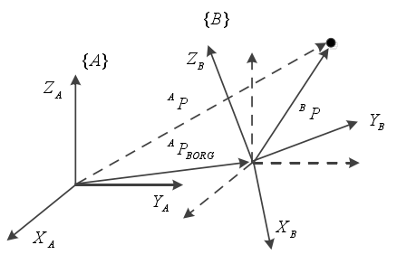
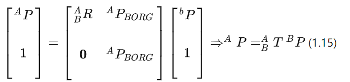
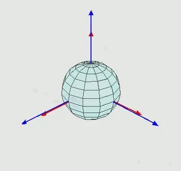
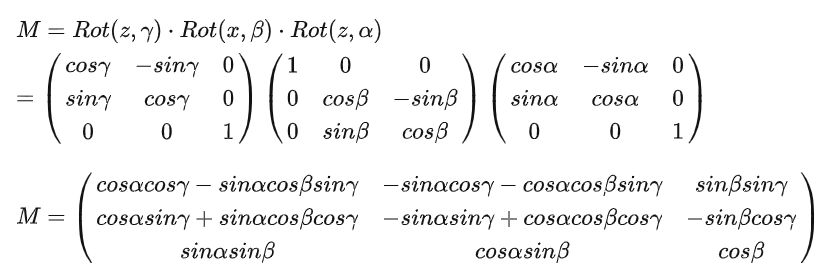
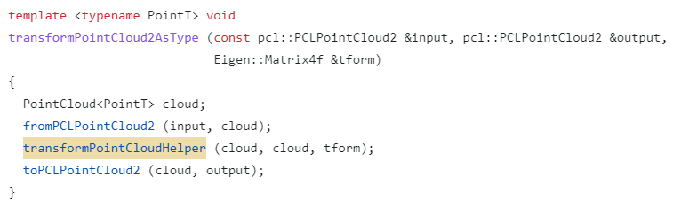
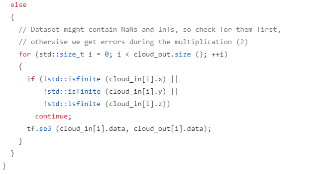
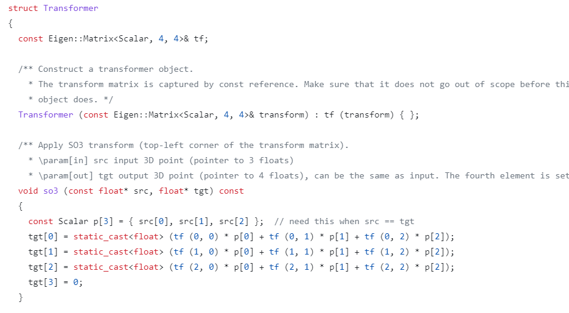
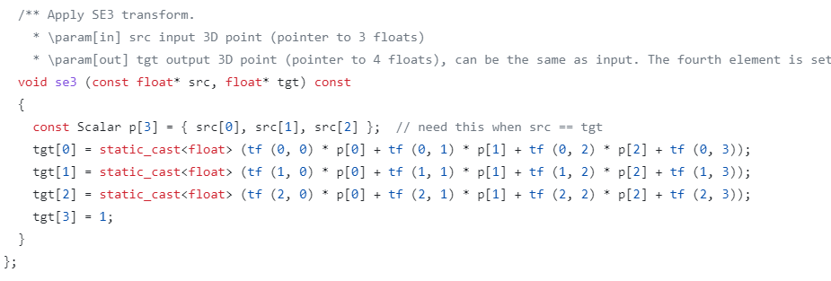

# 点云

## 显示点云

```cpp
#include <iostream>
#include <pcl/io/pcd_io.h>
#include <pcl/io/ply_io.h>
#include <pcl/point_types.h>
#include <pcl/filters/filter_indices.h>
#include <pcl/point_cloud.h>
#include <pcl/visualization/pcl_visualizer.h>
#include <boost/thread/thread.hpp>
#include <pcl/features/moment_of_inertia_estimation.h>


    boost::shared_ptr< pcl::visualization::PCLVisualizer > viewer(new pcl::visualization::PCLVisualizer("Ransac"));
    viewer->addCoordinateSystem(5.0);
    viewer->initCameraParameters();
    viewer->setBackgroundColor(0, 0, 0);
    viewer->addPointCloud(cloud, "cloud");
    viewer->spin();
```

## 变换

对于空间中的一个点可以用位置矢量描述，但是对于空间中的一个物体，仅仅使用位置描述显然是不够的，所以还需要引入姿态描述。如图3.2所示，为了描述物体的姿态，我们通过在物体上固定一个坐标系 B，那么可以用坐标系 B 相对于坐标系 A 的关系可以描述物体的姿态。

一般用下面的来描述：(A表示参考坐标系，而B表示物体坐标系)
$$
^{A}_{B}R=
\left[
\begin{matrix}
^{A}X_B,^{A}Y_B,^{A}Z_B
\end{matrix}
\right]
$$


该式满足：


**复合变换：**
$$
^AP=^{A}_{B}P^{B}P+^AP_{BOPG}
$$




**欧拉角：**（欧拉角是基于物体本身的坐标系进行变换的，基于物体本身的坐标系进行变换需要右乘） ，如下图所示：



该图表示了（z,x,z'）的变换过程，那么变换矩阵就是：



```cpp
 Eigen::Matrix4f transform_1 = Eigen::Matrix4f::Identity();
        float theta = M_PI/4;   //旋转的度数，这里是45度
        transform_1 (0,0) = cos (theta);  //这里是绕的Z轴旋转
        transform_1 (0,1) = -sin(theta);
        transform_1 (1,0) = sin (theta);
        transform_1 (1,1) = cos (theta);
        //   transform_1 (0,2) = 0.3;   //这样会产生缩放效果
        //   transform_1 (1,2) = 0.6;
        //    transform_1 (2,2) = 1;
        transform_1 (0,3) = 25; //这里沿X轴平移
        transform_1 (1,3) = 30;
        transform_1 (2,3) = 380;
        pcl::PointCloud<pcl::PointXYZ>::Ptr transform_cloud1 (new pcl::PointCloud<pcl::PointXYZ>);
        pcl::transformPointCloud(*cloud,*transform_cloud1,transform_1);  //不言而喻
        
        //局部
        pcl::transformPointCloud(*cloud,pcl::PointIndices indices,*transform_cloud1,matrix); //第一个参数为输入，第二个参数为输入点云中部分点集索引，第三个为存储对象，第四个是变换矩阵。
```


## 极值

```
pcl::getMinMax3D()
```

## 

## 点云增加点

增加点有两种方法。

1.直接把对应序号的点的xyz点复制到对应点云,但是这种方法会增加点云的索引，事实上用不到这么多索引，如果后续需要索引点云的，这种方法会导致点不是连续的

```cpp
newpointcloud->points[i].x = oldpointcloud[i].x
```

2.直接增加

```
#include <pcl/io/pcd_io.h>
#include <pcl/common/impl/io.hpp>
#include <pcl/point_types.h>
#include <pcl/point_cloud.h>
 
pcl::PointCloud<pcl::PointXYZ>::Ptr cloud(new pcl::PointCloud<pcl::PointXYZ>);
pcl::io::loadPCDFile<pcl::PointXYZ>("C:\office3-after21111.pcd", *cloud);
pcl::PointCloud<pcl::PointXYZ>::iterator index = cloud->begin();
cloud->erase(index);//删除第一个
index = cloud->begin() + 5;
cloud->erase(cloud->begin());//删除第5个
pcl::PointXYZ point = { 1, 1, 1 };
//在索引号为5的位置1上插入一点，原来的点后移一位
cloud->insert(cloud->begin() + 5, point);
cloud->push_back(point);//从点云最后面插入一点
std::cout << cloud->points[5].x;//输出1
```


## io

保存ply文件：

```
pcl::io::savePLYFile("../tmp.ply", triangles);
```

保存obj文件：

```
pcl::io::saveOBJFile("../tmp.obj", triangles);
```

保存pcd文件：

```
pcl::io::savePCDFileASCII("../file/t.pcd", *cloud_);
```


## 欧拉角万向锁

欧拉角表示的是两个状态量，并不是表示一个过程。在给定一组欧拉角时，旋转的参考位置始终是刚开始的位置，而欧拉角又对xyz旋转顺序有要求，因此导致了万向锁。

例如，有初始时刻，做变换x(10)y(90)z(10)，这样会导致在y旋转90度之后z轴和x轴重合，进而丢失一个自由度，变成了x(20)y(90)


## 点云变换函数

1. 主要针对`    pcl::transformPointCloud(*input,*output,transform_2)`而言：

   这个函数描述的始终是围绕者点云的世界坐标系，而不是欧拉角的那一套围绕着自身坐标系。

2. 坐标系的左乘右乘是针对两个坐标系的情况，有两个坐标系（世界和局部的）。

**函数源码剖析：**

`pcl::transformPointCloud(*input,*output,transform_2)`的定义实在下面的文件里面：

[pcl/transform_point_cloud.cpp at master · PointCloudLibrary/pcl · GitHub](https://github.com/PointCloudLibrary/pcl/blob/master/tools/transform_point_cloud.cpp)



在究极嵌套之后，指向了transformPointCloudHelper()这个函数，主要是传入输入输出点云，以及变换矩阵（这个矩阵会是三维或二维的）。而这个函数又调用了`transformPointCloud`这个函数？？好家伙，又回去了是吧？那么直接看这个函数的定义在什么地方：




那就是你了，可以看到，这个函数对点云中的每个点都进行了`tf.se3`的变换，而这个类恰好是传入了`transform`这个变换矩阵，然后具体看下这个`Transformer`类：

[pcl/transforms.hpp at master · PointCloudLibrary/pcl · GitHub](https://github.com/PointCloudLibrary/pcl/blob/master/common/include/pcl/common/impl/transforms.hpp#L74)





在se3这个函数中，主要接受一个数组的头指针，然后p[0]p[1]p[2]就是三维点的xyz坐标，那么这个运算明显是对每个点**左乘**了一个变换矩阵`tf`

## 多坐标系变换

具体参考：[旋转的左乘与右乘 - 知乎 (zhihu.com)](https://zhuanlan.zhihu.com/p/128155013)

**左乘与右乘前提是有多个坐标系，比如在机械臂上，会左乘右乘。**直观理解：有个世界坐标系和局部坐标系，局部坐标系是个4*4矩阵，包括原点位置以及三个轴在世界坐标里的旋转单位向量。如果该局部坐标右乘旋转矩阵，用其次坐标补齐，实际上原点位置不变；而左乘的话原点位置改变。

那么在多个坐标系的视角下：

1. 坐标系旋转中的右乘——相对于自身坐标系旋转
2. 坐标系旋转中的左乘——相对于固定坐标系旋转

假设有一个物体，在世界坐标系下用A矩阵描述，这表示物体在世界坐标系下的位置是 (1,2,3)，姿态是与世界坐标系一致的
$$
A=\begin {bmatrix} 1 & 0 & 0 & 1\\ 0 & 1 & 0 & 2\\ 0 & 0 & 1 & 3\\ 0 & 0 & 0 & 1 \end {bmatrix}
$$
在局部坐标系下用B矩阵描述：姿态是绕z轴旋转45度的。
$$
B=\begin {bmatrix} \sqrt {2}/2 & -\sqrt {2}/2 & 0 & -\sqrt {2}\\ \sqrt {2}/2 & \sqrt {2}/2 & 0 & \sqrt {2}\\ 0 & 0 & 1 & -1\\ 0 & 0 & 0 & 1 \end {bmatrix}
$$
如果物体在世界坐标系下绕x轴旋转30度，那么旋转矩阵R如下：
$$
R=\begin {bmatrix} 1 & 0 & 0\\ 0 & \cos30^o& -\sin30^o\\ 0 & \sin30^o& \cos30^o \end {bmatrix}
$$
那么物体在世界坐标系下的描述矩阵就是AR，即：
$$
AR=\begin {bmatrix} 1 & 0 & 0 & 1\\ 0 & \cos30^o& -\sin30^o& \frac{\sqrt{3}}{2}+1\\ 0 & \sin30^o& \cos30^o& \frac{3}{2}+3\\ 0 & 0 & 0 & 1 \end {bmatrix}
$$
如果物体绕局部坐标系旋转30度，那么变换矩阵T如下：
$$
T=BR=\begin {bmatrix} \sqrt {2}/2\cos30^o& -\sqrt {2}/2\cos30^o& -\sin30^o& -\sqrt {2}\cos30o+\sin30o\\ \sqrt {2}/2\cos30^o& \sqrt {2}/2\cos30^o& \sin30^o& \sqrt {2}\cos30o+\sin30o\\ -\sin30^o& -\sin30^o& \cos30^o& -\sin30^o-1\\ 0 & 0 & 0 & 1 \end {bmatrix}
$$
那么物体在世界坐标系下的描述矩阵就是AT，即：
$$
AT=ABR=\begin {bmatrix} (1-\frac{\sqrt{6}}{4})\cos30^o& -(1+\frac{\sqrt{6}}{4})\cos30^o& -(1+\frac{\sqrt{6}}{4})\sin30^o& -(1+\frac{3}{4}\sqrt{6})-(-1+\frac{3}{4}\sqrt{6})\sin30^o\\ (1+\frac{3}{4}\sqrt{6})\cos30^o& (1-\frac{3}{4}\sqrt{6})\cos30^o& (1-\frac{3}{4}\sqrt{6})\sin30^o& (1+\frac{3}{4}\sqrt{6})+(1-\frac{3}{4}\sqrt{6})\sin30^o\\ -(1+\frac{\sqrt{6}}{4})\sin30^o& -(1+\frac{\sqrt{6}}{4})\sin30^o& (1-\frac{\sqrt{6}}{4})\cos30^o& -(1+\frac{\sqrt{6}}{4})-(1-\frac{\sqrt{6}}{4})\cos30^o\\ 0 & 0 & 0 & 1 \end {bmatrix}
$$
