[TOC]

# 滤波

## 卡尔曼滤波

> 卡尔曼滤波实质就是将预测状态量的高斯分布和观测量的高斯分布做融合，生成一个新的高斯分布，其中新的高斯分布的均值和方差是两个独立的高斯分布的相关参量的加权，这个加权就是卡尔曼增益，但是预测状态量和观测量可能维度不同，需要将他们同时转换到一个向量空间中，所以观测量前面有线性变换矩阵

> 估计过去的状态叫平滑，估计当前的状态叫滤波，估计未来的状态叫预测

1.**协方差矩阵**:矩阵的每个值是第 i个变量和第 j 个变量之间的相关程度 

2.矩阵描述：最佳估计xk，**协方差矩阵Pk**，其中ij表示i变量和j变量之间的相关程度
$$
x_k=\left[
\begin{matrix}
positon\\ velocity
\end{matrix}
\right]
\\
p_k=\left[
\begin{matrix}
\sum_{pp} & \sum_{pv} \\
\sum_{vp} & \sum_{vv}
\end{matrix}
\right]
$$
3.通过k-1个状态观察第k个状态，其中Fk表示了这个预测步骤

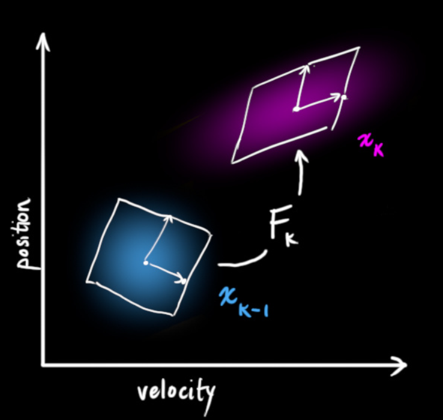

如何预测的呢？pk表示第k个状态的position，也就是状态
$$
p_k=p_{k-1}+\Delta_tv_{k-1} \\
v_k=v_{k-1}
$$
换成矩阵形式：**xk即为最佳估计**
$$
x_k=\left[
\begin{matrix}
1 & \Delta_t \\
0 & 1 
\end{matrix}
\right]
x_{k-1}\\
=F_kx_{k-1}
$$
Fk是一个预测矩阵，可以给出下一个状态。

协方差矩阵的的更新方法，首先给出问题：将分布中的每个点乘以矩阵A，协方差矩阵会发生什么变化？Cov(x)表示协方差，x表示具体的x元素
$$
Cov(x)=\sum \\
Cov(Ax)=A\sum A^T
$$
将该式子和xk最佳估计结合，可得：
$$
x_k=F_kx_{k-1} \\
P_k=F_kP_{k-1}F_k^T
$$
但是除了速度v和位置p，外因也会影响系统，所以我们要在每个预测步骤之后再加上一些新的不确定性，来模拟和“世界”相关的不确定性：

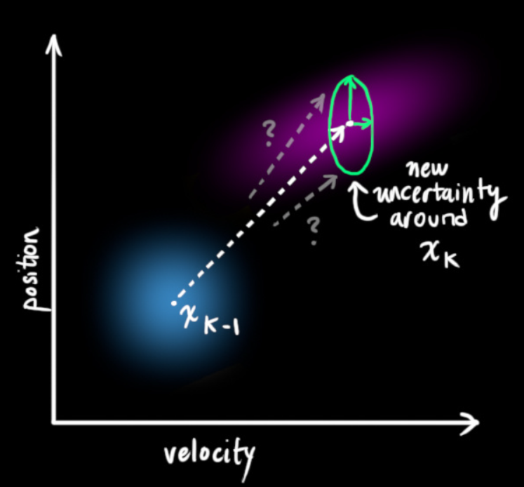

如上图所示，加上外部不确定性之后，xk-1 的每个预测状态可能会移动到另外的点，即蓝色的高斯分布会移动到紫色的高斯分布，并且具有协方差Qk，**即把不确定的影响视为协方差Qk的噪声**

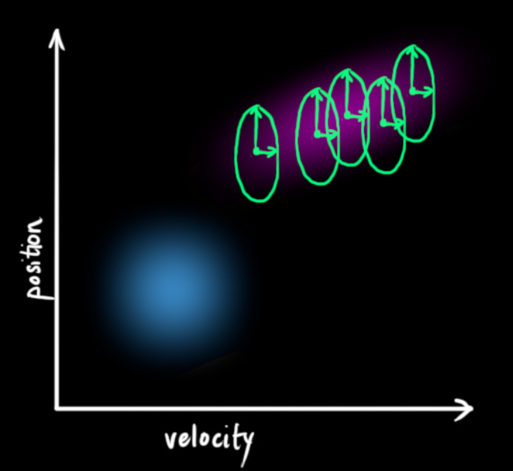

如上图所示，这些紫色的和蓝色的具有相同的均值，但是协方差却不同。

那么在原式子基础上加入Qk：
$$
x_k=F_kx_{k-1}+B_k\overrightarrow{u_k} \\
P_k=F_kP_{k-1}F_k^T+Q_k
$$

> 新的最佳估计 是基于 原最佳估计原最佳估计 和 已知外部影响已知外部影响 校正后得到的预测。
>
> 新的不确定性 是基于 原不确定性原不确定性 和 外部环境的不确定性外部环境的不确定性 得到的预测。

4.通过测量来细化估计值：有好几个传感器，但是读数的规模和状态不同，所以把传感器读书矩阵定义为Hk

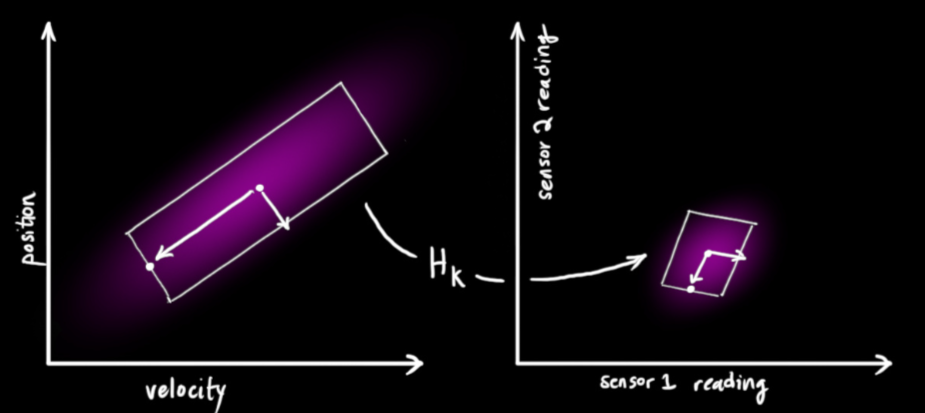

把这些分布转换为一般形式：
$$
\overrightarrow \mu_{expected}=H_k\hat{x}_k \\
\Sigma_{expected}=H_kP_kH_k^T
$$
卡尔曼滤波可以处理传感器的噪声，但是传感器记录的信息不准确，可以产生多种读数：

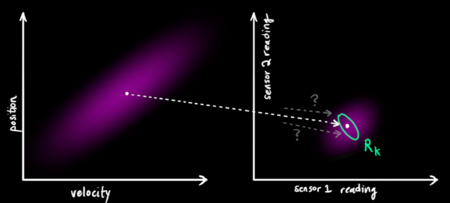

我们将这种不确定性（即传感器噪声）的协方差设为Rk，读数分布的均值为zk。

我们得到了两块高斯分布，一块围绕预测的均值，另一块围绕传感器读数：

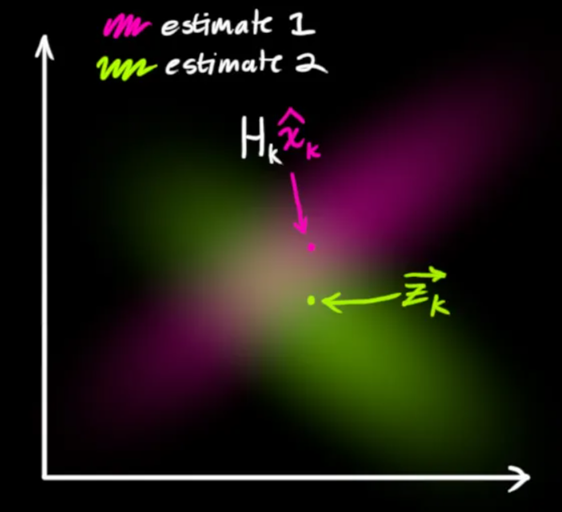

**模型必须要调用这两个传感器的信息才能生成靠谱的预测！**也就是说，对于任何可能的读数（z1,z2），这两种方法预测的状态都是可能准确的，也可能不准确。**所以用相乘的方式来找到靠谱的预测：**（两个高斯分布相乘，可以得到重叠部分，也就是最佳估计的区域）

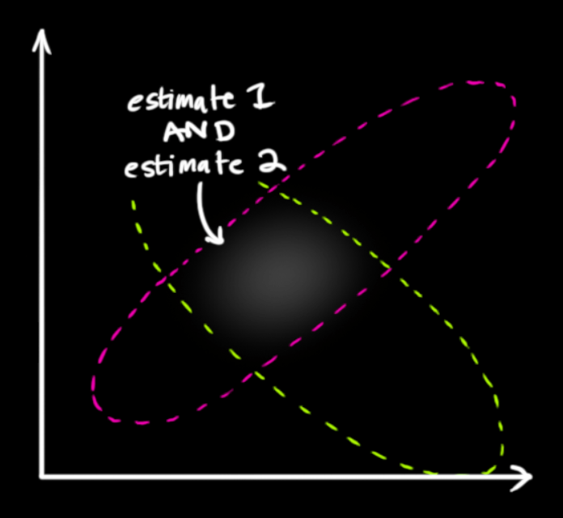

> 事实证明，当你把两个高斯分布和它们各自的均值和协方差矩阵相乘时，你会得到一个拥有独立均值和协方差矩阵的新高斯分布。最后剩下的问题就不难解决了：我们必须有一个公式来从旧的参数中获取这些新参数！

5.用高斯的角度

**一维高斯：**

一个标准的一维高斯分布为：
$$
N(x,\mu,\sigma)=\frac{1}{\sigma\sqrt{2\pi}}e^{-\frac{(x-\mu)^2}{2\sigma^2}}
$$
如果将两个高斯曲线相乘：可以得到最佳预测

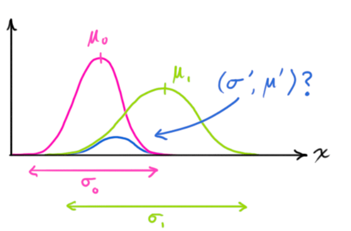

按照这个式子进行一维方程扩展：
$$
\mu^{'}=\mu_0+\frac{\sigma_0^2(\mu_1-\mu_0)}{\sigma_0^2+\sigma_1^2} \\
\sigma^{'2}=\sigma_0^2-\frac{\sigma_0^4}{\sigma_0^2+\sigma_1^2}
$$
简化一下，令：
$$
k=\frac{\sigma_0^2}{\sigma_0^2+\sigma_1^2} \\
\mu^{'}=\mu_0+k(\mu_1-\mu_0) \\
\sigma^{'2}=\sigma_0^2-k\sigma^{2}_0
$$
以上是一维的内容，如果是多维空间，把这个式子转成矩阵格式：
$$
K=\Sigma_0(\Sigma_0+\Sigma_1)^{-1} \\
\overrightarrow {\mu^{'}}=\overrightarrow{\mu_0}-k(\overrightarrow{\mu_1}+\overrightarrow{\mu_0})\\
\Sigma^{'}=\Sigma_0-K\Sigma_0
$$
**这个K即为卡尔曼增益**

6.结合在一起

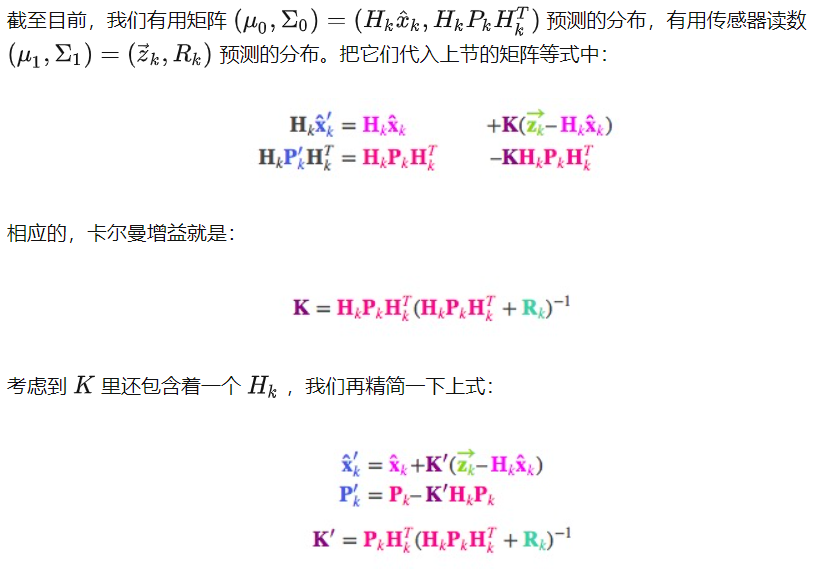

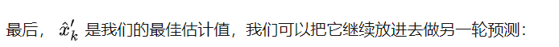

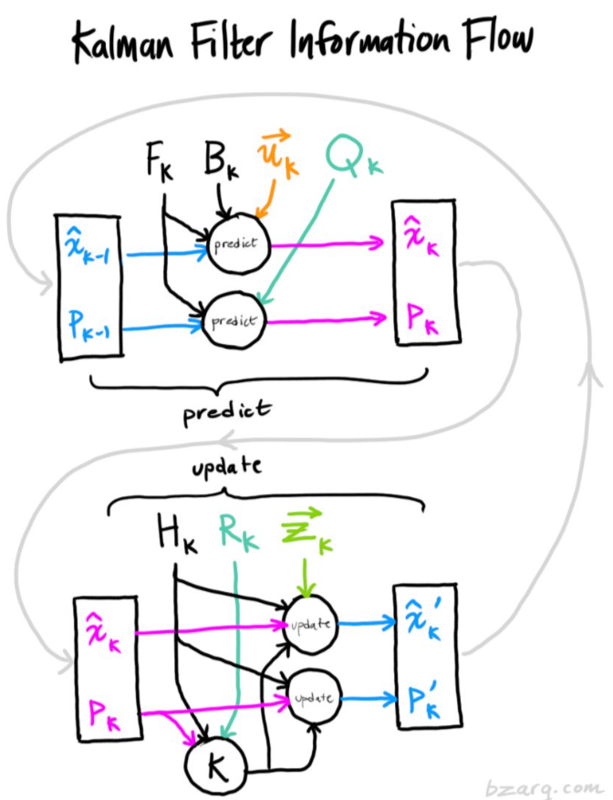

## 统计滤波

离群点也称为 **测量噪声点**，统计滤波器的作用就在于**去除稀疏离群点**

激光扫描会产生密度不均匀的点云，并且测量的误差也会产生稀疏的离群点。

这些离群点会让估计局部点云特征时出现差错，产生错误的数值结果，对后期的配准等应用产生影响甚至导致失败。

基本思想：对每个点的邻域进行一个统计分析，去除掉不符合标准的点

原理：本方法基于在输入数据中对点到邻点的距离分布的计算。对每个点，计算其到自身所有邻近点的平均距离，若得到的结果符合高斯分布，其形状由均值和标准差决定，平均距离在标准范围内之外的点，则认为是离群点，其中标准范围由全局距离平均值和方差定义。

# 拟合

## RANSAC

> 随机采样一致，从一组含有“外点”（outliers）的数据中正确估计数学模型参数的迭代算法，外点一般指噪声数据。
>
> 内点是组成模型参数的数据，外点是不是和模型的数据

**基本流程**

1. 选择出可以估计出模型的最小数据集；(对于直线拟合来说就是两个点，对于计算Homography矩阵就是4个点，拟合平面就应该是3个点)
2. 使用这个数据集来计算出数据模型；
3. 将所有数据带入这个模型，计算出“内点”的数目；(累加在一定误差范围内的适合当前迭代推出模型的数据)
4. 比较当前模型和之前推出的最好的模型的“内点“的数量，记录最大“内点”数的模型参数和“内点”数；
5. 重复1-4步，直到迭代结束或者当前模型已经足够好了(“内点数目大于一定数量”)

## PCA