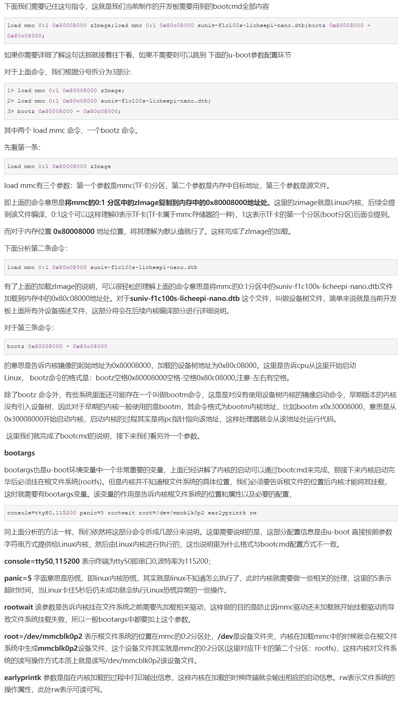
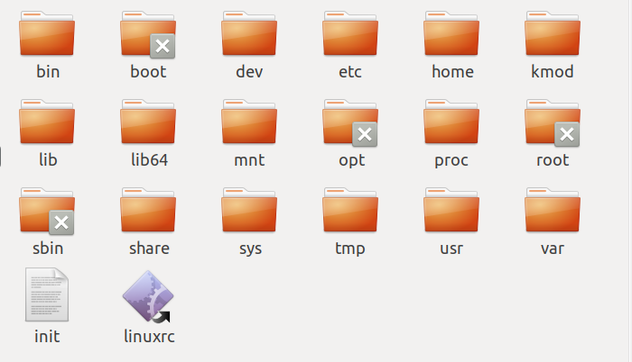
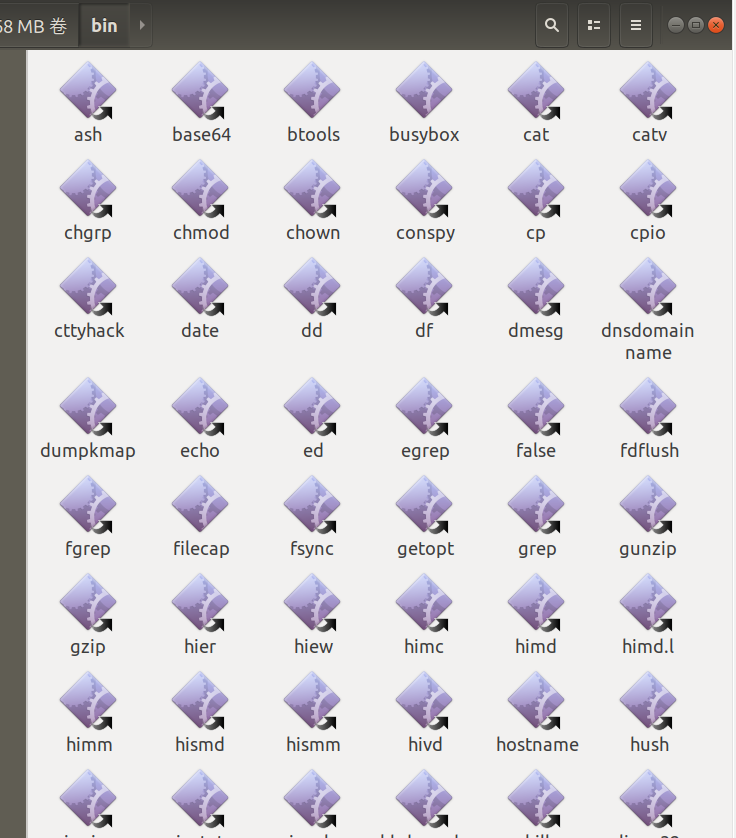
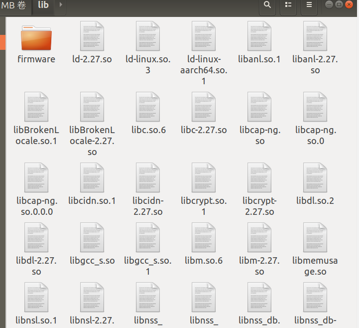

# 系统移植概念

## 1 uboot

  在u-boot中也需要这样的配置，当然u-boot比PC配置稍微复杂一丢丢。我们前面提到Linux嵌入式系统结构分布中有个Boot Parameters 部分，这部分就是做引导配置的，那怎么配置呢，总体来说可以分为两部分：

1. bootcmd，主要用于描述控制Linux内核文件以及其他描述文件加载到内存中位置以及启动Linux内核系统等
2. bootargs，用于配制文件系统、串口信息等。

### **参数解释**



***

## 2 Linux内核裁剪编译

## 3 根文件系统

1. 即/    是其他文件系统（proc、dev、sys等）挂载 的基础

2.bin目录下包括sh命令，如ls等

### **3.1 busybox简介**

busybox则包括了一些基本的shell命令、动态库以及目录等，是一个小型的文件系统

打包后的根文件系统为rootfs.ext4格式，通过

```
# 安装官方源中的make_ext4fs,mkuserimg.sh,simg2img
apt-get install android-tools-fsutils

simg2img rootfs.ext4 rootfs.img
mkdir rootfs  //创建挂载目录
mount -o loop rootfs.img rootfs  //把img挂载到rootfs
//上，从而可以查看文件
```



***

其中bin目录下包含了一些基本shell命令



***

lib下包含了一些库文件



***

linuxrc则是Linux内核启动后，根文件系统启动的第一个用户程序

### **3.2 Ubuntu根文件系统**

**3.2.1** 准备工作 

*1.qemu模拟器*

> 模拟不同架构的cpu，如果模拟arm，则需要Linux内核（image文件）和根文件系统

> qumu模拟了cpu，所以可以在模拟器中安装一些软件，gcc、python、nginx等。修改一些配置文件（镜像源）

安装：

```
sudo apt-get install qemu-user-static
```

***

*2.Ubuntu-base包*

是一个最简单的Ubuntu文件系统

**3.2.2开始构建**

**3.2.3打包**
