# 八股

作者：码农出击
链接：https://www.zhihu.com/question/279812027/answer/2677498644
来源：知乎
著作权归作者所有。商业转载请联系作者获得授权，非商业转载请注明出处。

## 数据链路层

1、OSI7层网络模型：应用层、[表示层](https://www.zhihu.com/search?q=表示层&search_source=Entity&hybrid_search_source=Entity&hybrid_search_extra={"sourceType"%3A"answer"%2C"sourceId"%3A2583885251})、会话层、运输层、网络层、[链路层](https://www.zhihu.com/search?q=链路层&search_source=Entity&hybrid_search_source=Entity&hybrid_search_extra={"sourceType"%3A"answer"%2C"sourceId"%3A1949920314})、物理层

2、TCP/IP四层网络模型：应用层、运输层、网际层、接口层

### MTU

MTU（Maximum Transmission Unit，最大传输单元）定义了网络层数据包在数据链路层中能够承载的最大数据量。它的主要作用是确保网络中不同设备之间能够有效地传输数据。

在网络通信中，数据从源主机出发，经过多个网络设备和链路，最终到达目标主机。不同的数据链路层协议对帧的大小有不同的限制，MTU 规定了网络层数据包在通过特定数据链路时可以携带的最大数据长度。当网络层数据包的大小超过了链路的 MTU 时，数据包就需要进行分片处理，以适应链路的传输能力。这样可以避免数据在传输过程中因长度超过链路限制而被丢弃，保证了数据的可靠传输。


### MAC地址

MAC（Media Access Control）地址也称为物理地址，它是网络设备的硬件标识符，由网络设备制造商分配，全球唯一。

- **数据链路层通信**：在数据链路层，网络设备通过MAC地址来识别和区分不同的设备。当一台设备要向同一局域网内的另一台设备发送数据时，它会在数据帧的头部添加目标设备的MAC地址，这样数据就能准确地传输到目标设备。
- **局域网内通信**：在局域网（LAN）中，MAC地址是设备间通信的基础。例如，在以太网中，交换机根据MAC地址转发数据帧。当一个数据帧进入交换机时，交换机会查看帧中的目标MAC地址，并将数据帧转发到相应的端口，从而实现设备之间的通信。


## 网络层

### 地址解析协议

DNS（域名系统）的查询过程是将一个域名解析为相应的IP地址，涉及多个步骤。以下是完整的查询过程：

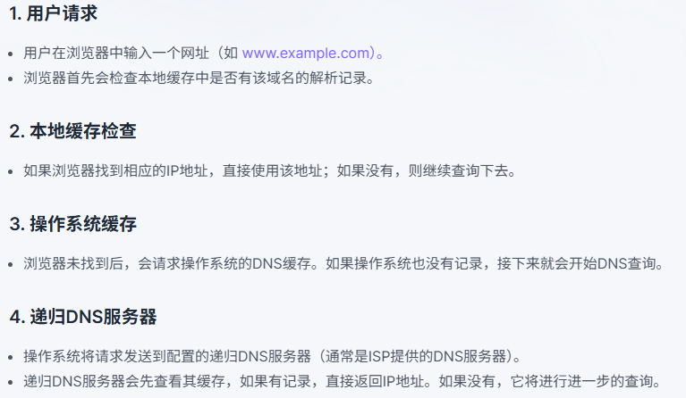

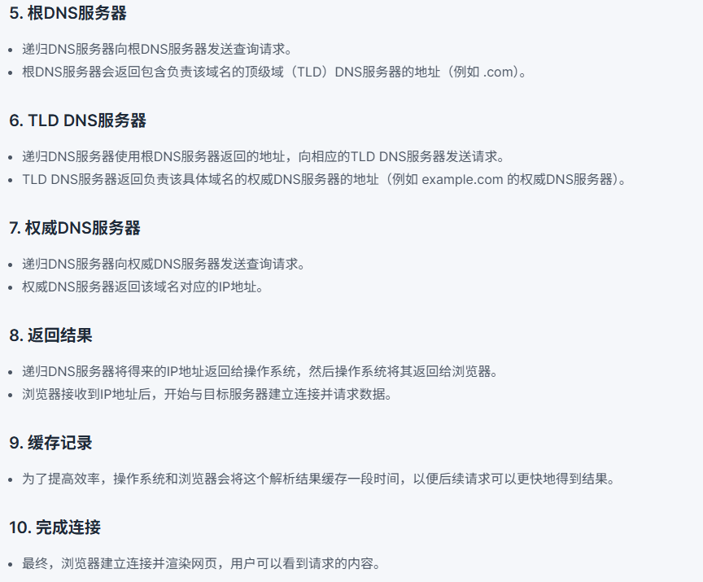


### 为啥有IP地址还需要MAC地址？同理，为啥有了MAC地址还需要IP地址？

- **为什么有了IP还需要MAC？** 因为IP地址只能帮助路由器把数据包送到目标所在的局域网，但无法解决在局域网内部如何将数据帧精确送达指定网卡的问题。这个“最后一公里”的交付需要MAC地址来完成。
- **为什么有了MAC还需要IP？** 因为MAC地址没有路由功能，它的设计不包含网络和主机的层级结构。仅靠MAC地址无法在由无数个局域网组成的庞大互联网中进行寻址和路径选择。IP地址的逻辑结构和路由协议的存在，才使得跨网络通信成为可能。

简单来说，**IP负责宏观的、跨网络的寻址，而MAC负责微观的、局域网内部的寻址。** 两者在协议栈中完美配合，构成了现代网络通信的基石。


### 网络层转发数据报的流程

这个过程的核心设备是**路由器（Router）**。

路由器的根本任务是**根据IP数据包头部的目标地址，查询自己的路由表，然后为数据包选择一个最佳的下一跳（Next Hop）路径，并将其转发出去**。这个过程可以分解为以下几个关键步骤：

```
接收帧` -> `解封装` -> `检查IP头(TTL, 校验和)` -> `查找路由表(最长前缀匹配)` -> `确定下一跳和出接口` -> `更新IP头(TTL, 校验和)` -> `ARP解析下一跳MAC地址` -> `重新封装成新帧` -> `发送帧
```

1.接收数据帧 (Ingress Processing)
- **数据到达**：路由器的一个物理接口（例如 `GigabitEthernet0/0`）接收到一个以太网数据帧（Frame）。
- **数据链路层处理**：路由器首先作为数据链路层设备进行工作。它会检查帧头中的**目标MAC地址**。
  - 如果该MAC地址与接口自身的MAC地址匹配（或是该接口监听的广播/组播地址），路由器就认为这个帧是发给自己的，并接收它。
  - 如果MAC地址不匹配，路由器将直接丢弃该帧。
- **解封装**：确认接收后，路由器会剥离数据链路层的帧头和帧尾（例如以太网的Header和FCS），将载荷（Payload）部分，也就是**IP数据包（Packet）**，提取出来，并向上传递给网络层进行处理。


2.检查IP数据包头部 (Packet Inspection)
网络层在对数据包进行处理时，会检查几个关键字段：
- **版本号 (Version)**：确认是IPv4还是IPv6数据包。
- **头部校验和 (Header Checksum)**：计算IP头部的校验和，并与头部中的校验和字段进行比对。如果不一致，说明数据包在传输中出现了错误，路由器会直接**丢弃**该数据包。
- **生存时间 (Time to Live, TTL)**：
  - 将TTL字段的值减1。
  - 检查TTL是否等于0。如果减1后TTL变为0，路由器会**丢弃**该数据包，并通常会向源IP地址发送一个**ICMP“超时”**（Time Exceeded）报文。这个机制是为了防止数据包在网络中因路由循环而无限转发。


3.查找路由表 (Routing Table Lookup) - 核心决策步骤
这是路由器转发流程中最核心的一步。路由器会从IP数据包头部中提取**目标IP地址**。
- **查询路由表**：路由器使用这个目标IP地址，在其内部维护的**路由表（Routing Table）**中进行查找。路由表记录了去往不同目标网络路径的信息，主要包含：
  - 目标网络地址 (Destination Network)
  - 子网掩码 (Subnet Mask)
  - 下一跳地址 (Next Hop)
  - 出接口 (Outgoing Interface)
  - 度量值 (Metric)
- **匹配原则**：查找遵循**“最长前缀匹配”（Longest Prefix Match）**原则。
  - **举例**：如果路由表中有两条路由：`192.168.1.0/24` 和 `192.168.0.0/16`。当一个目标地址为 `192.168.1.100` 的数据包到达时，它同时匹配这两条路由。但 `/24` 的前缀长度（24位）比 `/16` 更长，因此路由器会选择 `192.168.1.0/24` 这条更精确的路由。
- **查找结果**：
  - **找到匹配路由**：路由器确定了数据包应该从哪个**出接口**发送，以及发送给哪个**下一跳IP地址**。
  - **未找到匹配路由**：如果所有条目都无法匹配，路由器会查找是否存在**默认路由（Default Route）**，通常是 `0.0.0.0/0`。如果存在，则按默认路由转发。
  - **最终无法匹配**：如果既没有匹配的路由，也没有默认路由，路由器将**丢弃**该数据包，并通常向源IP地址发送一个**ICMP“目标不可达”**（Destination Unreachable）报文。


4.重新封装数据包 (Egress Processing)
在确定了下一跳地址和出接口后，路由器需要将IP数据包重新封装成一个全新的数据链路层帧，以便在下一个链路上传输。

- **更新IP头部**：由于TTL值已经被修改，路由器需要重新计算IP头部的**校验和**。
- **确定下一跳的MAC地址**：
  - 路由器知道下一跳的IP地址，但要创建数据帧，还必须知道下一跳设备的MAC地址。
  - 路由器会查询自己的**ARP缓存表**（ARP Cache），尝试找到下一跳IP地址对应的MAC地址。
  - 如果ARP缓存中没有记录，路由器会通过出接口发送一个**ARP请求**，来获取下一跳的MAC地址。在得到ARP响应之前，数据包会被临时存放在一个队列中。
- **封装成帧**：获取到目标MAC地址后，路由器开始构建新的数据链路层帧（例如以太网帧）：
  - **目标MAC地址**：填写下一跳设备（可能是另一个路由器，也可能是最终的目标主机）的MAC地址。
  - **源MAC地址**：填写路由器**出接口**自身的MAC地址。
  - **载荷 (Payload)**：放入经过TTL修改和校验和重新计算的IP数据包。
- **注意**：在这个过程中，IP数据包头部的**源IP地址**和**目标IP地址**是**始终不变**的。改变的只是数据链路层的MAC地址。


5.发送数据帧

- 最后，路由器通过指定的出接口，将新封装好的数据帧发送到下一个链路中。这个帧会被下一个设备（路由器或主机）接收，然后重复上述过程，直到数据包最终抵达目标主机。


### 子网划分、子网掩码

为了解决上述问题，子网划分应运而生。

**核心思想**：从原有IP地址的**主机部分（Host ID）借用几位出来，把它们变成子网部分（Subnet ID）**。

这样，IP地址的结构就从两级变成了三级： `[ 网络部分 | 主机部分 ]`

变为

```
[ 网络部分 | 子网部分 | 新的主机部分 ]
```

**子网划分带来的好处：**

1. **减少IP地址浪费**：可以将一个大的网络划分成多个小网络，按需分配，提高IP地址利用率。
2. **提高网络性能**：每个子网是一个独立的广播域。广播消息（如ARP请求）只会在当前子网内传播，不会影响到其他子网，减少了网络拥堵。
3. **增强网络安全**：可以在不同子网之间设置防火墙或访问控制策略，隔离不同部门（如财务部、研发部），提高安全性。
4. **简化管理**：网络结构更清晰，便于管理和故障排查。

---

那么，计算机或路由器如何知道一个IP地址中，哪几位是网络位、哪几位是子网位、哪几位是主机位呢？**这就是子网掩码的作用。**

**定义**：子网掩码是一个与IP地址相对应的32位二进制数。它的作用就是**“遮盖”**住IP地址的网络部分和子网部分，从而区分出主机部分。

**规则**：

- 在子网掩码中，所有对应IP地址**网络位**和**子网位**的二进制位都为 **1**。
- 所有对应IP地址**主机位**的二进制位都为 **0**。

**表示方法**：

1. **点分十进制**：例如 `255.255.255.0`。
2. **CIDR (无类域间路由) 表示法**：在IP地址后加上 `/` 和网络位的总长度。例如 `192.168.1.100/24`，这里的 `/24` 就表示子网掩码的前24位是1，即 `255.255.255.0`。这是目前最常用的表示法。

**如何工作？** 设备通过将自己的IP地址和子网掩码进行**按位与（AND）运算**，就可以得到自己所在的**网络地址（或子网地址）**。

```
  IP 地址:  192.168.1.100  ->  11000000.10101000.00000001.01100100
子网掩码:  255.255.255.0   ->  11111111.11111111.11111111.00000000
-------------------------------------------------------------------- AND运算
网络地址:  192.168.1.0    ->  11000000.10101000.00000001.00000000
```

通过这个运算结果，设备就知道自己属于 `192.168.1.0` 这个网络。当它要和其他IP通信时，会用同样的方法计算对方的网络地址，如果两个网络地址相同，说明在同一个子网，可以直接通过交换机通信；如果不同，则必须将数据包发给网关（路由器）进行转发。

------


四、 实践示例：如何进行子网划分

假设一个公司申请到了网络地址块 `192.168.10.0/24`。现在需要将其划分为4个子网，分别给4个部门使用。

**1. 确定需要借几位？**

- 我们需要4个子网。根据公式 2n≥4 （n是需要借的位数），解得 n=2。
- 所以，我们需要从原来的主机部分（8位）中借用 **2** 位作为子网ID。

**2. 计算新的子网掩码**

- 原来的子网掩码是 `/24`，即 `255.255.255.0`。
- 二进制为 `11111111.11111111.11111111.00000000`。
- 借用2位后，新的子网掩码变为 `11111111.11111111.11111111.11000000`。
- 将这个二进制转换为十进制，得到 `255.255.255.192`。
- 新的CIDR表示法为 `/26` (因为 24 + 2 = 26)。

**3. 计算每个子网的属性**

- **子网数量**：2n=22=4 个子网。
- **每个子网的主机数**：新的主机位还剩下 8−2=6 位。根据公式 2h−2（h是主机位数），每个子网可用的主机地址数为 26−2=64−2=62 个。
  - **为什么要减2？** 因为每个子网中，主机位全为0的地址是**网络地址**，主机位全为1的地址是**广播地址**，这两个地址不能分配给具体设备。

**4. 列出所有子网**

| 子网 # | 子网ID (二进制) | 网络地址            | 可用IP地址范围                      | 广播地址         |
| ------ | --------------- | ------------------- | ----------------------------------- | ---------------- |
| 1      | 00              | `192.168.10.0/26`   | `192.168.10.1` - `192.168.10.62`    | `192.168.10.63`  |
| 2      | 01              | `192.168.10.64/26`  | `192.168.10.65` - `192.168.10.126`  | `192.168.10.127` |
| 3      | 10              | `192.168.10.128/26` | `192.168.10.129` - `192.168.10.190` | `192.168.10.191` |
| 4      | 11              | `192.168.10.192/26` | `192.168.10.193` - `192.168.10.254` | `192.168.10.255` |

通过这个过程，我们成功地将一个 `/24` 的大网络，划分成了4个独立的 `/26` 的小网络，每个网络都可以独立管理和分配IP地址。


### 网络控制报文协议ICMP

 ICMP的两大核心功能

ICMP的功能主要分为两大类：**差错报告报文** 和 **查询报文**。

1. 差错报告报文 (Error-Reporting Messages)
当网络设备（主要是路由器）在转发IP数据包时遇到问题，无法成功投递时，就会发送一个差错报告报文给数据包的**源地址**。
最常见的几种差错报告类型包括：
- **目标不可达 (Destination Unreachable - Type 3)** 这是最常见的错误类型之一。当路由器或目标主机无法交付数据包时发送。它还包含具体的**代码（Code）**来说明原因：
  - `Code 0`: 网络不可达 (路由器找不到通往目标网络的路由)
  - `Code 1`: 主机不可达 (路由器能到达目标网络，但在局域网内找不到目标主机的MAC地址)
  - `Code 2`: 协议不可达 (目标主机不支持IP包中的传输层协议，如SCTP)
  - `Code 3`: 端口不可达 (数据包已送达目标主机，但主机上没有应用程序监听该目标端口。这是`traceroute`命令能工作的重要原因之一)
- **超时 (Time Exceeded - Type 11)** 当数据包的**TTL（生存时间）**字段减为0时，路由器会丢弃该包并发送此报文。这是为了防止数据包在网络中无限循环。这个特性被`traceroute`命令巧妙地利用来探测网络路径。
- **重定向 (Redirect - Type 5)** 当路由器发现一个主机使用了次优的路径发送数据时，它会发送一个重定向报文给该主机，告诉它一个更好的下一跳地址。例如，同一局域网内，主机A把本应直接发给主机B的数据包错误地发给了路由器，路由器就会告诉主机A：“下次直接发给主机B，别再经过我了。”


2.查询报文 (Query Messages)
这类报文用于网络诊断和信息查询，通常由网络管理员或应用程序主动发起。
最常见的查询类型包括：
- **回显请求和应答 (Echo Request and Reply - Type 8 and 0)** 这是大名鼎鼎的 **`ping`** 命令的工作基础。
  - 一台主机向另一台主机发送**ICMP Echo Request (Type 8)**报文。
  - 如果目标主机收到该报文，并且网络通畅，它会回复一个**ICMP Echo Reply (Type 0)**报文。
  - 通过这个一来一回的过程，可以测试：
    1. 目标主机是否可达。
    2. 来回通信的延迟（RTT, Round-Trip Time）。
    3. 是否存在丢包。

------

三、 ICMP报文的结构

一个ICMP报文主要由以下部分组成：

1. **类型 (Type)**: 8位，用于定义报文的类型（例如，8代表Echo请求，0代表Echo应答，3代表目标不可达）。
2. **代码 (Code)**: 8位，进一步解释该类型的具体情况（例如，在Type 3中，Code 1代表主机不可达）。
3. **校验和 (Checksum)**: 16位，用于检查ICMP报文本身在传输中是否出错。
4. **报文数据**:
   - 对于查询报文，这里通常包含标识符和序列号，以便匹配请求和响应。
   - 对于差错报告报文，这里通常包含导致错误的那个**原始IP数据包的头部**和**数据的前8个字节**。这非常有用，因为它能让源主机知道是哪个数据包、哪个协议（通过端口号）出了问题。

------


四、ICMP的两大经典应用

1. `ping` 命令 (网络“声纳”)

`ping` (Packet Internet Groper) 是最基础也最重要的网络诊断工具。

- **工作原理**: 发送ICMP Echo Request (Type 8)，等待ICMP Echo Reply (Type 0)。
- **作用**: 诊断网络连通性、测量延迟和丢包率。

2.`traceroute` / `tracert` 命令 (网络路径“侦察兵”)

`traceroute` 用于探测从源主机到目标主机所经过的路由器路径。

- **工作原理**: 它巧妙地利用了ICMP超时报文。
  1. 首先，它发送一个TTL=1的IP包。第一个路由器收到后，将TTL减为0，于是丢弃该包，并返回一个**ICMP Time Exceeded (Type 11)**报文。源主机从这个报文的源IP地址就知道了第一个路由器的地址。
  2. 接着，它发送一个TTL=2的IP包。这个包能通过第一个路由器，但在第二个路由器处TTL变为0，于是第二个路由器返回一个ICMP超时报文。源主机就知道了第二个路由器的地址。
  3. 如此反复，每次将TTL加1，直到数据包最终到达目标主机。
  4. 当数据包到达目标主机时，由于`traceroute`通常使用一个无效的UDP端口，目标主机会返回一个**ICMP Port Unreachable (Type 3, Code 3)**报文，表示追踪结束。

ICMP应用举例：PING、traceroute


## 运输层

### TCP与UDP的区别及应用场景

- **TCP**：适用于需要高可靠性和数据完整性的应用，如网页浏览（HTTP/HTTPS）、文件传输（FTP）、电子邮件（SMTP/IMAP）。
- **UDP**：适用于对时间敏感但可以容忍一定数据丢失的应用，如视频流（如YouTube、Netflix）、语音通话（VoIP）、在线游戏。

### TCP首部报文格式（SYN、ACK、FIN、RST必须知道）

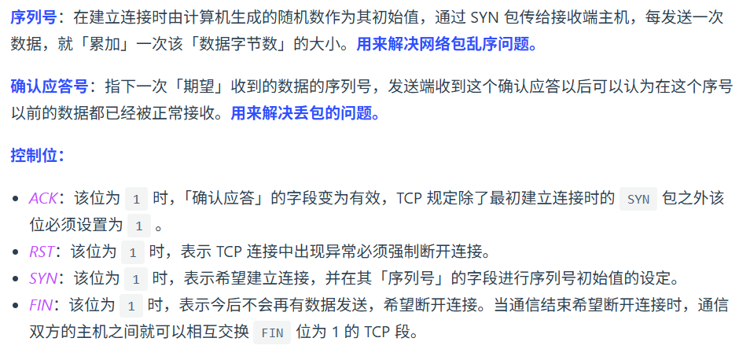


### TCP滑动窗口原理

- **窗口**：是指在发送方和接收方之间的一个缓冲区，用于控制数据的发送和接收。发送方有发送窗口，接收方有接收窗口。
- **窗口大小**：表示在任何时刻，发送方可以连续发送的未确认数据的最大字节数，或者接收方能够接收的最大字节数。


### TCP超时重传时间选择

超时重传机制是TCP最基本的可靠性保证机制之一。当发送方发送一个TCP报文段后，会启动一个定时器。如果在定时器超时之前没有收到该报文段的确认（ACK），发送方就会认为该报文段可能在传输过程中丢失或者损坏，于是会重新发送该报文段。


15、TCP流量控制
16、TCP[拥塞控制](https://www.zhihu.com/search?q=拥塞控制&search_source=Entity&hybrid_search_source=Entity&hybrid_search_extra={"sourceType"%3A"answer"%2C"sourceId"%3A1949920314})（一定要弄清楚与流量控制的区别）
17、TCP三次握手及状态变化。为啥不是两次握手？
18、TCP四次挥手及状态变化。为啥不是三次挥手？
19、TCP连接释放中TIME_WAIT状态的作用
20、SYN泛洪攻击。如何解决？
21、TCP粘包
22、TCP[心跳包](https://www.zhihu.com/search?q=心跳包&search_source=Entity&hybrid_search_source=Entity&hybrid_search_extra={"sourceType"%3A"answer"%2C"sourceId"%3A2471611333})
23、路由器与交换机的区别
24、UDP如何实现可靠传输


## 应用层

25、DNS域名系统。采用TCP还是UDP协议？为什么？
26、FTP协议（了解）
27、HTTP请求报文与响应报文首部结构
28、HTTP1.0、HTTP1.1、HTTP2.0对比
29、HTTP与HTTPS对比
30、HTTPS加密流程
31、方法：GET、HEAD、POST、PUT、DELETE
32、状态码：1**、2**、3**、4**、5**
33、cookie与session区别
34、输入一个URL到显示页面的流程（越详细越好，搞明白这个，网络这块就差不多了）


# 计算机网络

## 概念

1.**往返时间****RTT****（****Round-Trip Time****）表示从发送方发送数据开始，到发送方收到来自接收方的确认（接收方接收数据后马上发送接收确认），总共经历的时间。**

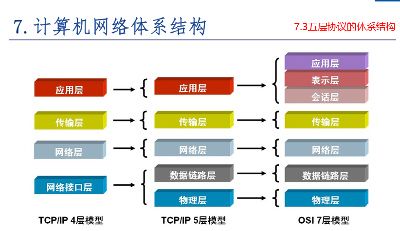


## 抓包

配置 Fiddler 抓取 HTTPS 数据包需要进行一些关键设置，主要是为了让它能够解密和查看加密的流量。我来为你梳理一下核心步骤和注意事项。

### 🔧 核心配置步骤

| 步骤                                | 操作内容                                                     | 注意事项                                                     |
| :---------------------------------- | :----------------------------------------------------------- | :----------------------------------------------------------- |
| **1. 启用HTTPS解密**                | 在 Fiddler 中打开 `Tools > Options > HTTPS`，勾选 **`Decrypt HTTPS traffic`**。 | 通常会提示安装证书，需点击确认。                             |
| **2. 安装根证书**                   | 在 HTTPS 选项卡点击 **`Actions > Trust Root Certificate`** 安装证书。 | 这是解密HTTPS流量的关键，确保系统信任Fiddler。               |
| **3. 忽略证书错误**                 | 建议同时勾选 **`Ignore server certificate errors`** 选项。   | 可避免因Fiddler介入导致的一些证书验证错误，方便抓包。        |
| **4. 允许远程连接（手机抓包需设）** | 如需抓手机App包，需在 `Connections` 中勾选 **`Allow remote computers to connect`**。 | 设置后**务必重启Fiddler**生效。端口默认为8888。              |
| **5. 配置浏览器代理**               | 确保浏览器代理设置为Fiddler（通常为`127.0.0.1:8888`）。      | 多数浏览器会自动配置。Firefox需手动设置。                    |
| **6. 处理Firefox浏览器**            | Firefox使用独立证书库，需**手动导入**Fiddler证书。           | 从 `Actions` 导出证书，然后在Firefox的证书管理中导入。       |
| **7. 手机抓包额外设置**             | 手机与电脑同WiFi，手动设置代理为**电脑IP:8888**；用手机浏览器访问 **`http://<电脑IP>:8888`** 下载并安装证书。 | iOS需在“证书信任设置”中启用。Android各品牌安装步骤略有差异。 |

成功使用 Fiddler 抓取 HTTPS 包的关键在于：**正确安装并信任 Fiddler 根证书**、**配置好代理**（无论是本机还是手机）。一旦遇到问题，多检查证书状态和网络连接设置。


# ASIO库

Asio 是一个用于网络和低级 I/O 编程的跨平台 C++ 库，它使用现代 C++ 方法为开发人员提供一致的异步模型.

## API

## io_context

这个类提供了异步I/O对象的核心I/O功能，包括：

```cpp
asio::ip::tcp::socket
asio::ip::tcp::acceptor
asio::ip::udp::socket
asio::deadline_timer
```

`asio`空间中，我们首先不可避免的就是类`io_service`或`io_context`。

> 注意，`io_context`这个类是用来替代`io_service`的，所以建议以后都直接使用`io_context`即可

**这个类非常重要，它相当于我们程序与系统之间`I/O`操作的中介，我们所有的接受或发送数据操作，都是通过将需求提交给这个类，然后这个类再交给计算机来执行的。**

> 基于这个理念，基本所有`asio`网络库中有读写`I/O`需求的类，其构造函数的第一个参数就是它，比如后面要讲的收发数据的`socket`类，以及`tcp`服务器用于接受用户连接的`acceptor`类等

而这个`io_context`就在`asio`里面，所以在`using namespace boost::asio;`之后，就可以直接用它实例化对象：

```text
io_context io;
```

除了`io_context`外，`asio`里面还有一个函数非常重要,那就是`buffer`函数，它的作用其实就是构造一个结构体,大致如下：

```text
struct{
void* buf;
s_size len;
}
```

该网络模块中所有的收发数据操作，都不接受单独的字符串，而是这样一个结构体，分别为缓存区的首地址以及缓存区的大小。

总结一下就是，asio里面，直接用到的就是一个类：io_context 与一个函数：buffer。

然后继续深入，紧接着就是asio里面进一步的命名空间ip，我们的TCP和UDP相关类，就在这个ip里面。

比如我们想使用tcp，其socket类，就是：ip::tcp::socket,而udp的socket类就是：ip::[udp::socket](https://zhida.zhihu.com/search?content_id=229215571&content_type=Article&match_order=1&q=udp%3A%3Asocket&zhida_source=entity)。

由于我们通常程序用中可能只使用其中某一个协议，比如只使用TCP，那就可以这样写：

```text
using asio::ip::tcp;
```

作为TCP服务器，用于接受客户端连接的类acceptor也在其中。

这样就不用每次都加前面那一大长串了（如果tcp与udp都会使用，那就别这样写了，会混淆）。

除了socket类，我们在网络通信中还需要对方的ip与端口才行，这就用到了类endpoint，它同样在tcp与udp中都有。

还有就是地址处理类：address，直接就在ip里面，其最常用的就是它的静态函数from_string，将十进制的ip地址转化为网络字节序。

---

**向io_context提交任务：**

```cpp
void my_task()
{
    //...
}

int main()
{
    asio::io_context io_context;
    //提交一个函数
    asio::post(io_context, my_task);
    
    //提交一个lambda 表达式
    asio::post(io_context, [](){
        //...
    });

    //运行 io_context 直到它用完为止。
    io_context.run();
    return 0;
}
```


## 网络编程的基本流程

**服务端**
1）socket——创建socket对象。

2）bind——绑定本机ip+port。

3）listen——监听来电，若在监听到来电，则建立起连接。

4）accept——再创建一个socket对象给其收发消息。原因是现实中服务端都是面对多个客户端，那么为了区分各个客户端，则每个客户端都需再分配一个socket对象进行收发消息。

5）read、write——就是收发消息了。

**客户端**
1）socket——创建socket对象。

2）connect——根据服务端ip+port，发起连接请求。

3）write、read——建立连接后，就可发收消息了。

图示如下


## 建立连接并发送buffer

**服务端：**

```cpp
void run_server() {
    const int BACKLOG_SIZE = 30;
    unsigned short port_num = 3333;
    asio::io_context ios;

    try {
        asio::ip::tcp::endpoint ep(asio::ip::address_v4::any(), port_num);
        asio::ip::tcp::acceptor acceptor(ios, ep.protocol());
        acceptor.bind(ep);
        acceptor.listen(BACKLOG_SIZE);

        std::cout << "✅ Server is listening on port " << port_num << "..." << std::endl;

        asio::ip::tcp::socket sock(ios);
        
        // 等待一个客户端连接进来
        acceptor.accept(sock);
        // 服务器需要一直运行来接受连接
        while (true) {
            char buf[1024];
            // cin>> buf;
            // sock.send(asio::buffer(buf, sizeof(buf)));
            sock.receive(asio::buffer(buf));
            std::cout << "Received data: " << buf << std::endl;


            
            // std::cout << "🎉 Client connected from: " 
            //           << sock.remote_endpoint().address().to_string() 
            //           << std::endl;
            
            // 在这里可以与客户端进行通信 (读/写数据)
            // 为简化示例，这里接受连接后就立即关闭，并等待下一个
        }
    }
    catch (std::exception& e) {
        std::cerr << "Error occurred! Message: " << e.what() << std::endl;
    }
}

```


**客户端：**

```
int connect_socket() {
    asio::io_context io;
    asio::ip::tcp::socket sock(io);
    sock.connect(asio::ip::tcp::endpoint(asio::ip::address::from_string("192.168.31.81"),3333));
    char buf[1024] = "hello";
    sock.send(asio::buffer(buf));
}
```


- 与客户端相比，服务端需要定义一个`acceptor`


## 异步读写

客户端：

```
class Send_queue {
public:
    Send_queue(std::shared_ptr<tcp::socket> socket) : socket_(socket) {};
    void connect(tcp::endpoint ep) {
        socket_->connect(ep);
    }

    void send(const string& buf) {
        asio::post(socket_->get_executor(), [this, buf](){
            bool write_in_progress = !msg_queue_.empty();
            msg_queue_.push(buf);
            if (!write_in_progress) {
                do_write();
            }

        });
    }

    void do_write() {
        asio::async_write(*socket_, asio::buffer(msg_queue_.front()), [this](const asio::error_code& ec, size_t len){
            if (!ec) {
                msg_queue_.pop();
                if (!msg_queue_.empty()) {
                    do_write();
                }
            }
        });
    }

    std::shared_ptr<tcp::socket> socket_;
    std::queue<string> msg_queue_;
};
```


服务端：

```
void run_server() {
    const int BACKLOG_SIZE = 30;
    unsigned short port_num = 3333;
    asio::io_context ios;
    asio::ip::tcp::endpoint ep(asio::ip::address_v4::any(), port_num);
    asio::ip::tcp::acceptor acceptor(ios, ep.protocol());
    acceptor.bind(ep);
    acceptor.listen(BACKLOG_SIZE);
    while(1){
    try {


        std::cout << "✅ Server is listening on port " << port_num << "..." << std::endl;

        asio::ip::tcp::socket sock(ios);
        
        // 等待一个客户端连接进来
        acceptor.accept(sock);
        // 服务器需要一直运行来接受连接
        while (true) {
            char buf[1024];
            // cin>> buf;
            // sock.send(asio::buffer(buf, sizeof(buf)));
            // size_t len = sock.receive(asio::buffer(buf),0);
            sock.async_receive(asio::buffer(buf), 
                [](const asio::error_code& ec, std::size_t len) {
                    if (!ec) {
                        std::cout << "Received " << len << " bytes." << std::endl;
                    } else {
                        std::cerr << "Error receiving data: " << ec.message() << std::endl;
                    }
                });
            std::cout << "🎉 Received data: " << buf << std::endl;
            memset(buf, 0, 1024); // 模拟接收到数据
            // delete buf; // 释放内存
            break; // 这里为了示例，接收一次就退出循环 
        }
        sock.close();

    }
    catch (std::exception& e) {
        std::cerr << "Error occurred! Message: " << e.what() << std::endl;
    }
    std::cout << "Server socket closed. Waiting for new connections..." << std::endl;
    }
}
```

- 使用do_write更符合TCP连接的需求

- 在回调中去执行发送队列的pop操作，可以根据发送队列是否为空来判断之前的发送是否完成，如果非空说明还有消息在发送

- 如果执行下面的代码：

  ```
      asio::io_context io;
      Send_queue s(std::make_shared<asio::ip::tcp::socket>(io));
      s.connect(asio::ip::tcp::endpoint(asio::ip::address::from_string("192.168.31.81"),3333));
      s.send("456\n");
      s.send("hello,world");
      io.run();
  ```

  在多次执行send函数的时候，

  - send函数中的post会将字符串push到队列中，然后根据当前是否有任务决定是否执行do_write函数。

    在提交“456”的时候，队列为空，执行do_write，（异步的，时间不确定）

    提交“hello, world”时，队列不为空，不执行do_write。“hello，world”的发送是在执行完“456”的回调中发送的。


## 使用shared from this延长生命周期

由于这是异步程序，创建发送类的时候是在main函数里的，所以这个发送类的周期跟主线程是一致的并不需要担心。

【warning】但是，不是所有的时候发送类都是在main函数里的，有的可能是在某个堆栈中执行的，这个时候很有可能出现：**异步程序还在执行，但是发送类已经析构的情况**，这时候就要手动延长发送类的声明周期，使得发送类的生命周期和回调函数一致。（触发回调时说明已经发送完成，这个时候就可以析构了）

**方法：获取发送类自身的智能指针，然后在回调函数的lambda表达式中捕获这个智能指针**

```cpp
class Send_queue : public enable_shared_from_this<Send_queue> {
public:
    Send_queue(std::shared_ptr<tcp::socket> socket) : socket_(socket) {};
    void connect(tcp::endpoint ep) {
        socket_->connect(ep);
    }

    void send(const string& buf) {
        asio::post(socket_->get_executor(), [this, buf](){
            bool write_in_progress = !msg_queue_.empty();
            msg_queue_.push(buf);
            if (!write_in_progress) {
                do_write();
            }

        });
    }

    void do_write() {
        auto self = shared_from_this();
        weak_ptr<Send_queue> weak = self;
        asio::async_write(*socket_, asio::buffer(msg_queue_.front()), [this, weak](const asio::error_code& ec, size_t len){
            if (!ec) {
                weak.lock();
                msg_queue_.pop();
                if (!msg_queue_.empty()) {
                    printf("call back");
                    do_write();
                }
            }
        });
    }

    std::shared_ptr<tcp::socket> socket_;
    std::queue<string> msg_queue_;
};


int main() {
    asio::io_context io;
//    Send_queue s();
    std::shared_ptr<Send_queue> s = make_shared<Send_queue>(std::make_shared<asio::ip::tcp::socket>(io));
    s->connect(asio::ip::tcp::endpoint(asio::ip::address::from_string("192.168.31.81"),3333));
    s->send("456\n");
    s->send("hello,world");

    io.run();
}
```

- 第1行，需要public继承`enable_shared_from_this<Send_queue>`
- 第20行中，`auto self = shared_from_this();`获得自身的智能指针，然后让回调捕获这个智能指针，`async_write`启动一个异步程序，`do_write`函数会立马退出，send_queue生命周期：
  - main函数中，创建`Send_queue`l类型智能指针，引用计数：1
  - 20行，self为指向自身的智能指针，引用计数：2
  - 22行，lambda表达式捕获weak，引用计数：2
  - 24行，weak提升为强指针，引用计数：3
  - 32行，异步函数会立马返回，self析构，引用计数：2
  - 异步函数执行完后，执行回调，引用计数：1
  - Send_queue离开作用域，引用计数：0，析构


# TCP

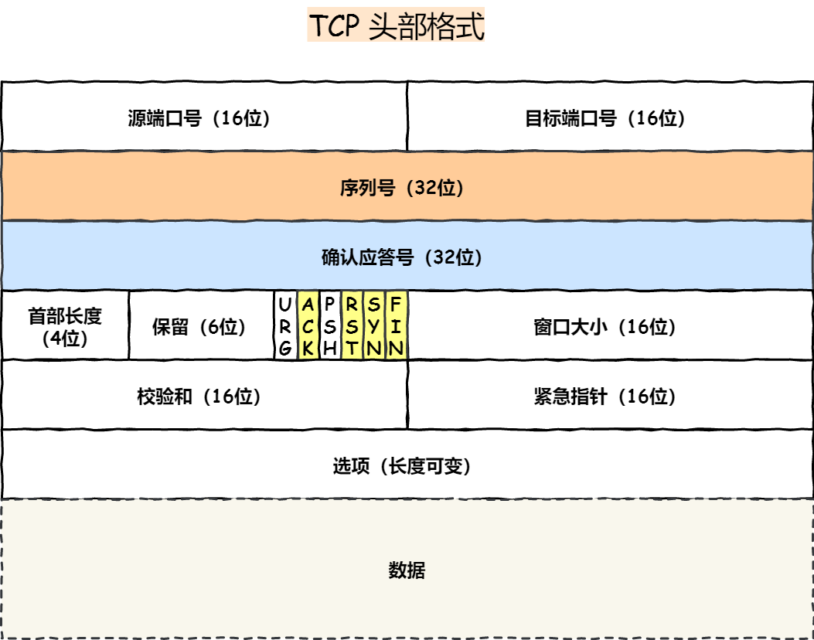


## 如何确定一个tcp连接


- 源地址和目的地址的字段（32位）是在IP头部中，作用是通过IP协议发送报文给对方主机
- 源端口和目的端口的字段（16位）是在TCP头部中，作用是告诉TCP协议应该把


最大tcp连接数：客户端的IP数*客户端的端口数


## TCP连接建立

1.三次握手过程

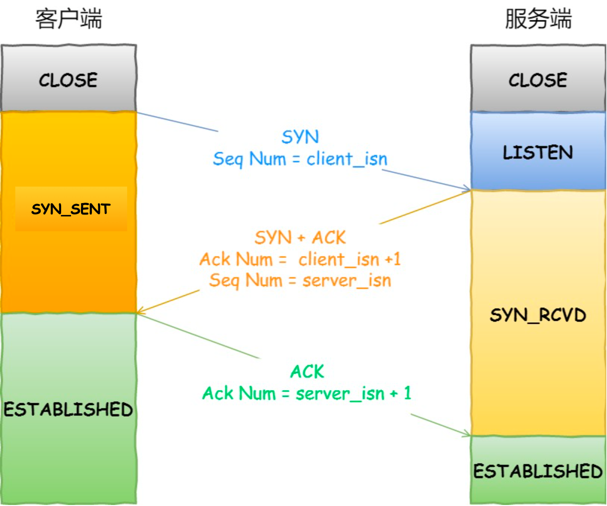

**为什么不能是两次握手？**

如果是两次握手，那么客户端在发送第一次syn的时候，服务端就会建立连接，进而想客户端发送数据，如果是历史连接，服务端就会建立旧的连接导致资源浪费。


**如果第二次握手丢失了会怎么样？**

第二次握手丢失了，

- 客户端会触发syn重传机制

- 服务端无法收到第三次握手，触发syn-ack的重传

**如果第三次握手丢失了会怎么样子？**

- 客户端认为连接已经建立了
- 服务端没有收到ack确认报文，触发服务端syn-ack的重传（第三次的ack报文不会重传，当丢失时，就必须由服务端重新发送对应报文）


## TCP断开连接

### 四次挥手过程

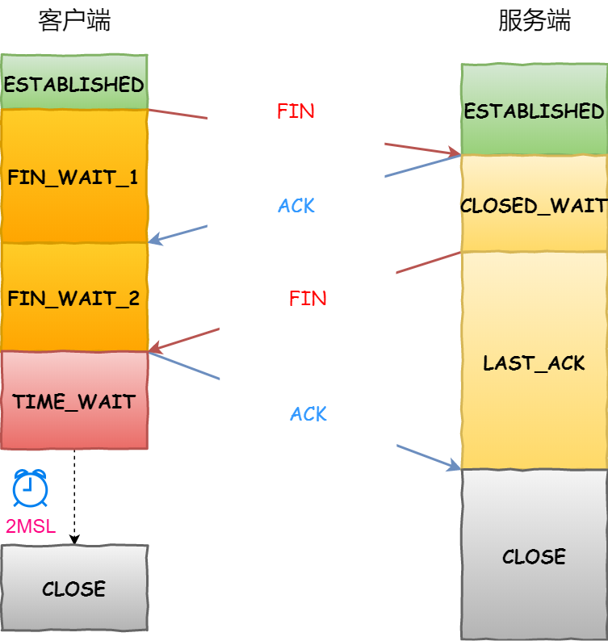


### 为什么需要四次挥手

- 关闭连接时，客户端向服务端发送`FIN`时，仅仅表示客户端不再发送数据了，但是还能接受数据。
- 服务端接收到客户端的`FIN`时，先发送一个`ACK`应答报文，而服务端可能还有数据需要处理和发送，等服务端不在发送数据时，才发送`FIN`报文给客户端来表示同意现在关闭连接。


### 第一次挥手丢失了？

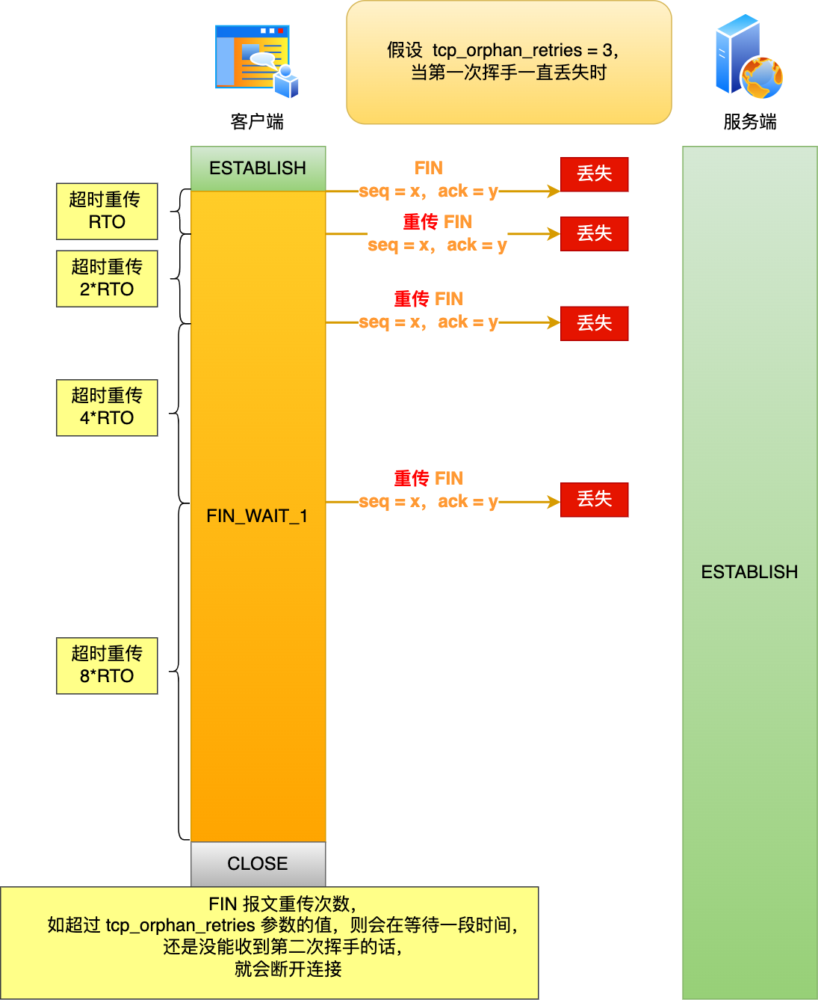

- 如果第一次挥手丢失了，那么客户端迟迟收不到被动方的ACK，就会触发超时重传机制，重传FIN报文，重发次数由`tcp_orphan_retries`参数控制。
- 当客户端重传FIN报文次数超过tcp_orphan_retries之后，就不在发送FIN报文，而是在等待一段时间后，如果还是没有收到第二次握手，那么直接进入close状态。


### 第二次挥手丢失了？

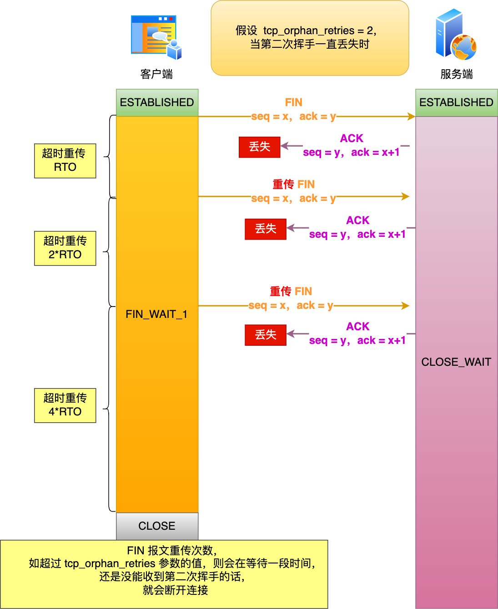

---

对于调用close关闭的连接，如果在60秒后还没有收到，客户端（主动关闭方）的连接就会关闭，如图所示：

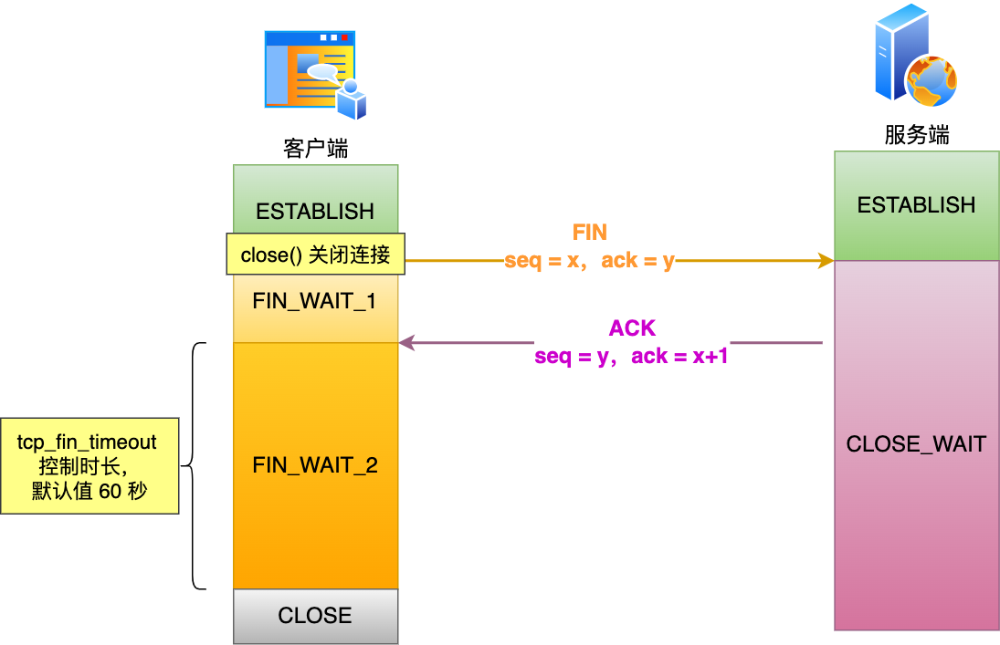


### 第三次挥手丢失了？

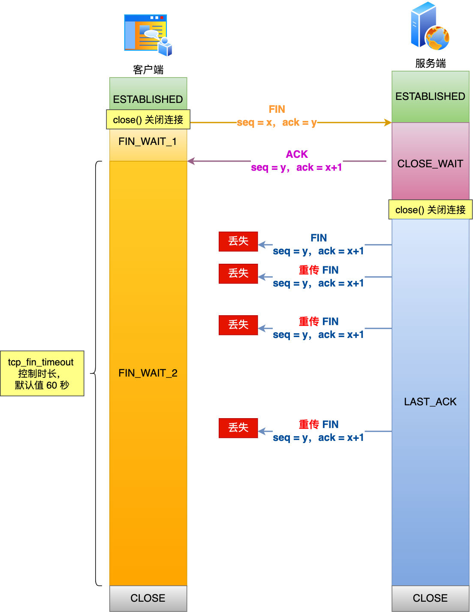


当服务端（被动关闭方）收到客户端（主动关闭方）的FIN报文后，内核会自动恢复ACK，同时连接处于CLOSE_WAIT状态，表示等待应用调用close函数关闭连接。

但是此时，内核没有权利替代进程关闭连接，必须由进程主动调用close函数来触发服务端发送FIN报文。

服务端处于CLOSE_WAIT状态时，调用了close函数，内核就会发出FIN报文，同时连接进入LAST_ACK状态，等待客户端返回ACK来确认连接关闭。

如果迟迟收不到客户端传回的ACK，服务端就会重发FIN报文，重发次数仍由tcp_orphan_retries参数控制。

具体控制：

- 当服务端重传第三次挥手报文的次数达到三次之后，由于tcp_orphan_retries为3，达到了重传的最大次数，于是等待一段时间（时间为上一次超时时间的2倍），如果还是没有收到第四次挥手的（ACK报文），那么服务端就会断开连接
- 客户端因为通过close函数关闭连接的，处于FIN_WAIT_2状态是有时长限制的，如果tcp_fin_timeout时间内还是没能收到服务端的第三次挥手，客户端就会断开连接


### 第四次挥手丢失了？

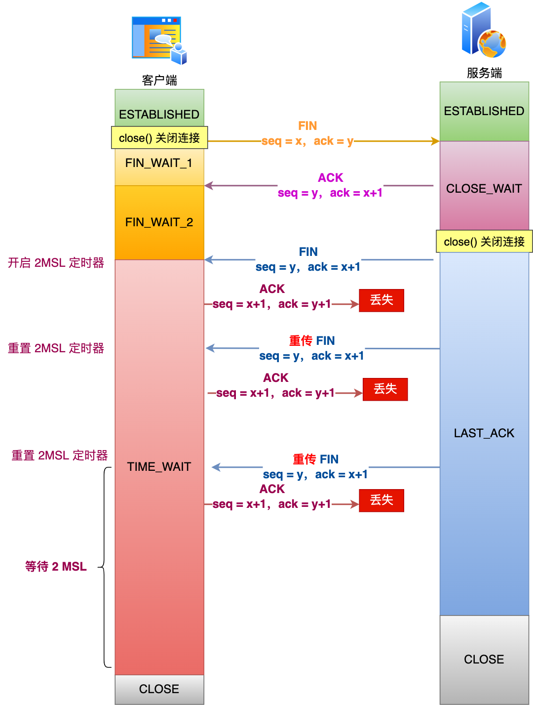

当客户端接收到服务端第三次挥手的FIN报文后，就会返回ACK报文，也就是第四次挥手，此时客户端连接进入TIME_WAIT阶段。

在Linux系统中，TIME_WAIT状态会持续2MSL后才会进入关闭状态。

在服务端，没有收到ACK报文前，还是处于LAST_ACK状态。

如果第四次挥手的ACK报文没有达到服务端，服务端会重发FIN报文，由tcp_orphan_retries参数控制。

具体过程：

- 当服务端重传第三次挥手报文达到2时，由于tcp_orphan_retries为2，达到了最大重传次数，于是再等待一段时间（时间为上一次超时时间的2倍），如果还是没有收到客户端的第四次挥手（ACK报文），那么服务端就会断开连接
- 客户端在收到第三次挥手后，进入TIME_WAIT状态，开启时长为2MSL的定时器，如果途中再次收到第三次挥手（FIN报文），就会重置定时器，当等待2MSL时间后，客户端就会断开连接。


# UDP


- 目标和源端口：主要是告诉UDP协议应该把报文发送给哪个进程
- 包长度：该字段保存了UDP首部的长度和数据的长度之和
- 检验和：检验和是为了提供可靠的UDP首部和数据而设计，防止收到在网络传输中受损的UDP包


## UDP和TCP的区别

1.连接：

- tcp是面向连接的传输层协议，传输数据前要建立连接
- udp不需要连接，即可传输数据

2.服务对象

- TCP是一对一的两点服务，即一条连接只有两个断电
- UDP支持一对一、一对多、多对多的交互通信

3.可靠性

- TCP是可靠交付数据，数据可以无差错、不丢失、不重复、按序到达
- UDP是尽最大努力交付，不保证可靠交付数据。可以通过QUIC协议实现可靠传输

4.拥塞控制、流量控制

- TCP有拥塞控制和流量控制机制，保证数据传输的安全性。
- UDP没有，即使网络拥堵，也不会影响UDP发送速率

5.首部开销

- TCP首部长度较长，会有一定的开销，首部在没有使用【选项】字段时是20个字节，如果使用了【选项】字段则是会变长的
- UDP首部只有8个字节，并且是固定不变的，开销较小

6.传输方式

- TCP是流式传输，没有边界，但保证顺序和可靠。
- UDP是一个一个包的发送，是有边界的，但可能发生丢包和乱序。

7.分片不同

- TCP的数据大小如果大于MSS大小，则会在**传输层**进行分片；目标主机收到后，也同样在传输层组装TCP数据包，如果中途丢失了一个分片，则需要传输丢失的这个分片。
- UDP的数据大小如果大于MTU大小，则会在**IP层**进行分片，目标主机收到后，在IP层组装完数据，接着在传给**传输层**

## TCP和UDP应用场景

- tcp：FTP，HTTP/HTTPS
- udp：dns、snmp、视频音频等多媒体通信、广播通信


## TCP和UDP可以使用一个端口嘛

> 两个进程不能同时监听同一个端口，因为端口具有独占性，操作系统要求一个端口同一时刻只能被一个进程绑定（bind）。如果第二个进程尝试监听已被占用的端口，会收到address already in use

**可以的**？？？？？

在数据链路层，通过mac地址来寻找局域网中的主机。在网际层，通过IP地址来寻找网络中互联的主机或路由器。在传输层中，需要通过端口进行寻址，来识别同一计算机中同时通信的不同程序。


所以，传输层的**端口号**的作用，是为了区分同一台主机上不同应用程序的数据包

传输层有两个传输协议tcp和udp在内核中是完全独立的软件模块。

当主机收到数据包后，可以在IP包头的**协议号**字段知道该数据包是tcp/udp，所以可以根据这个信息确定发送给哪个模块tcp/udp处理，送给tcp/udp模块的报文根据**端口号**确定送给哪个应用程序处理。

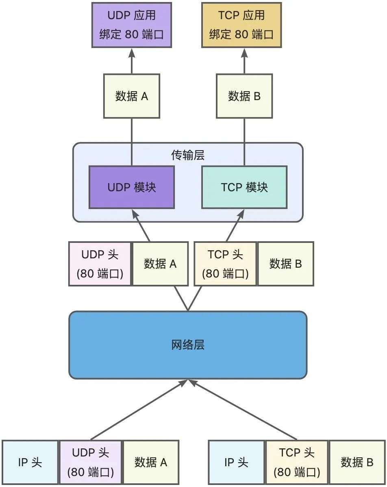


因此，tcp/upd各自的端口号相互独立，如tcp有一个80端口，udp也有一个80号端口，二者并不冲突。

