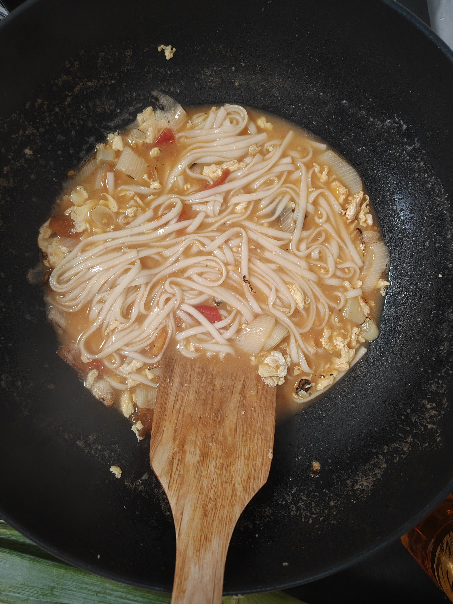
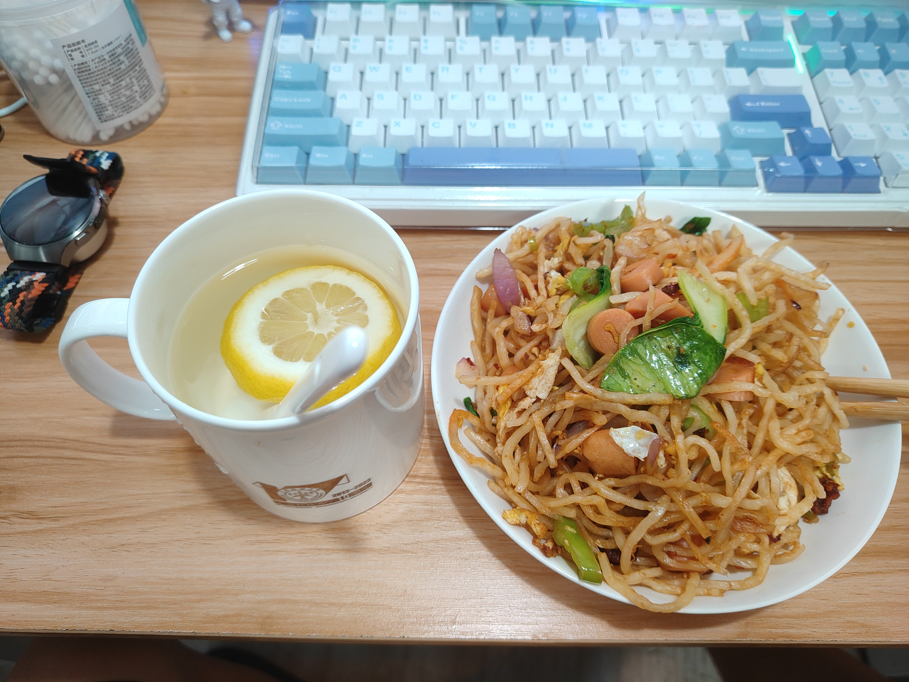
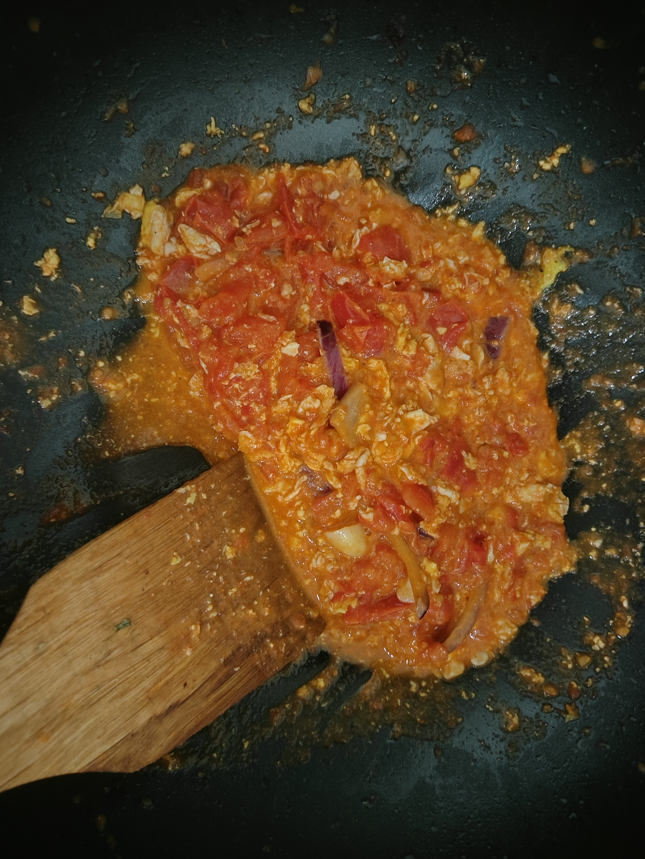
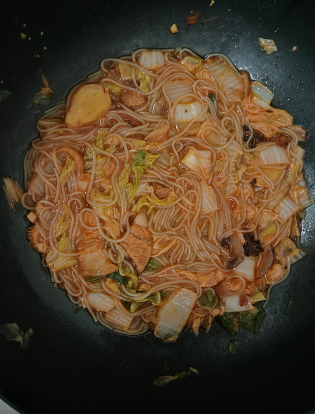
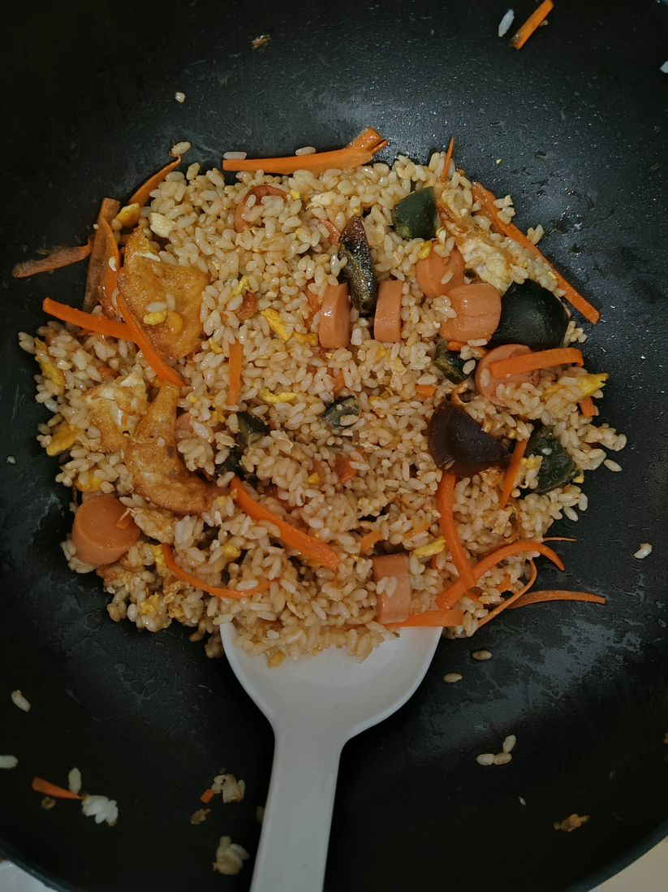

# cook

> 记录学做饭
> Everyday discover something new.
## 西红柿鸡蛋炝锅面
> 这个是跟着隋坡做的
1. 把鸡蛋炒熟，备用，油温较高时（大概是轻微冒烟）放入鸡蛋
2. 葱花+八角，煸熟，至葱花焦黄，然后放入西红柿丁，加水，加盐，加酱油
3. 倒入鸡蛋
4. 待水沸后，放入面条，差不多煮8~10分钟，不生即可

## 炒饼丝

> 点评：
> - 比小区门口的老头炒的好吃，糟老头子做的是真难吃，还TM卖我11块钱，你怎么敢的
> - 但是比学校门口的那对夫妻炒的差一点，他们炒的很软嫩，放的酸豆角也恰到好处
> - 总结：我是天才厨神！优势在我！

自创的炒饼丝：
1. 油温热后，炒鸡蛋
2. 放青菜、洋葱、火腿肠、辣椒、盐，加油，酱油，少许白糖（黑暗料理）、老干妈
3. 放入饼丝，爆炒

## 西红柿炒鸡蛋

> 总结：得加水、加盐，水熬干，汤就会比较浓郁

## 猪肉炖粉条

> 点评：简单的食材，做出了不错的味道~
> 难道我真的是厨神？

## 蛋炒饭

 > 以前 我也不相信有天才厨神的存在
 > 直到...直到我亲自下厨，炒了一盘蛋炒饭。
 > 遂惊叹曰：此乃天才也！
 
 放点宁宁黑蛋，味道更佳！！

在做饭的时候，眼前突然出现了一个横幅，写道：“宿主，系统检测到您的修为升级，现在已经更新为路边摊水平，修为的最终形态为5星级大厨”。
 

