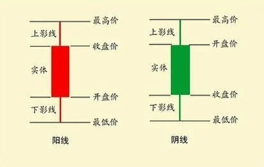
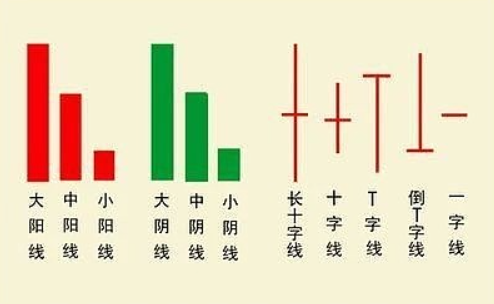
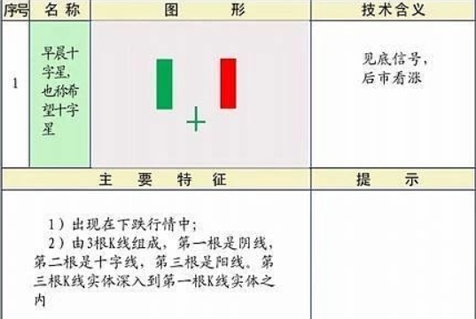
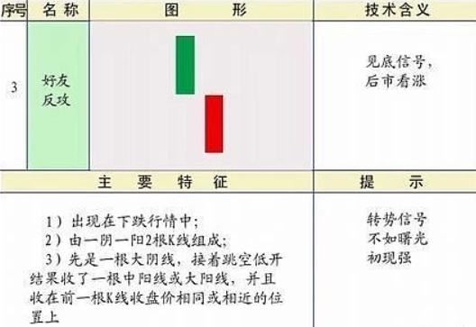

#  股市

## 基本概念

一些基本概念可以参考：[(99+ 封私信 / 80 条消息) 最新最全面的股票专业术语解释大全，值得收藏 - 知乎](https://zhuanlan.zhihu.com/p/358994226)

1. 买一&卖一：

   卖一是指卖方的最优价，越低越容易成交

   买一指的是买方的最优价，越高越容易成交

2. 封单&一字板

   在买一的位置，堆积了大量的数字，即使有人以涨停价卖出，后面有大量资金排队等着买，也就是**一字板**，开盘即涨停，全天都可能掉不下来
   
3. 市场中的角色：
	- 散户：即个人投资者
	- 机构：专业的投资方
	- 游资：以短期投机为目的的大额民间/小机构资金；
## 开盘价

- 开盘价并非第一笔成交的价格。而是通过 **集合竞价** 产生的

- 决定过程：

  1.挂单（开盘前的特定时间段，所有想买和想卖的将自己的价位和数量输入系统）。

  2.最大成交量原则（交易所的交易系统将所有的买单和卖单撮合在一起，系统自动寻找一个特定的价格，在这个价格上，成交的数量最大）。

  也就是这个最大成交原则，**如果在这个价格，卖多买少，价格下调；如果大家恐慌性抛售（挂跌停价卖），而买盘很少，那么系统撮合出来的最大成交价就会很低。**

  3.确定开盘价：能实现最大成交量的价格，就成了当天的开盘价。

## 涨停和跌停

在A股中，为了保护投资者，交易所设立了涨跌幅限制机制。也就是给股价每天的波动画一个圈，不能跑出这个圈。

1. 涨停：股价到了天花板，想买的人多，但是价格不能再高了，此时的k线是红色的，但是并没有停止交易。但是没有人愿意卖，导致很难买进去，也就是 **封板**

2. 跌停：股价跌倒了地板，所有人都想卖，没有人愿意买，恐慌情绪严重，童颜没有停止交易，只是很难卖出去，也就是 **被闷杀**

---

关于涨停价和跌停价：

这两个价格是根据**昨天的收盘价**算出来的“天花板”和“地板”的具体数值。

在A股主板市场，普通股票的涨跌幅限制通常是 **10%**。

计算公式：

- 涨停价 = 昨天收盘价 × (1 + 10%)
- 跌停价 = 昨天收盘价 × (1 - 10%) *(注：计算结果会进行四舍五入处理)*

## ETF和场外基金

基金是将钱给专业的理财专家（基金经理），让他们去投资各种各样的东西，比如股票、债券。就是找专业的人帮自己投资。

---

**ETF**为交易型开放指数基金，是一种特殊的基金，可以想股票一样在证券交易所里买卖。

ETF可以看成是一种非常专的基金，专门跟踪某种指数，比如沪指300，他会按照这个指数里包含的股票种类和比例去买那些股票。通常采用完全复制或者抽样复制的方法，可以看成一个指数小跟班。

**其净值会随着标的指数的波动而波动。**

---

**场外基金**就是不在证券交易所买卖的基金，可以通过银行、基金公司去买。

其一天只有一个价格，在每天收盘之后，根据当天的投资的资产情况算出一个净值，并按照这个净值去买卖。

## 定投

基金定投是定期定额投资基金的简称，是指在固定的时间（如每月 10 日）以固定的金额（如 1000 元）投资到指定的开放式基金中。这种投资方式可以避免投资者因市场波动而在高点集中买入，通过长期分批买入，摊薄成本，平滑市场波动风险，获取市场的平均收益。

## k线图

### 基本结构

k线从时间上分，可以分为日、周、月、年k线

日K线它反映的是股价短期的走势。周K线、月K线、年K线反映的是股价中长期的走势。而5分钟、15分钟、30分钟、60分钟K线反映的是股价超短期的走势。它们的绘制方法大同小异。例如周K线，只要找到周一的开盘价、周五的收盘价，一周中的最高价和最低价，就可以把它绘制出来了。电脑上的周K线所标注的时间都是收盘价的时间

---

k线从形态上可以分为阳线、阴线和同价线三种类型。同价线表示实体部分为0，也就是开盘价=收盘价。大阳线、中阳线和小阳线是根据阳线实体（收盘价与开盘价的差值）大小以及涨幅范围来大致划分的。

### 见底形态和上升形态

---

- 从这个图中可以看到第一天的收盘价是高于第二天的开盘价的，也就是两个价格之间是不连续的。在k线图中，前一根k线的收盘价和下一根的开盘价之间出现了明显的缺口，这种现象称为**跳空**
- 造成这种跳空低开的原因是：
  - 非交易时间的时间累计，也就是在收盘后到开盘前，出现了利空消息
  - 在下跌的趋势中，投资者恐慌情绪导致第二天开盘时不计成本的低价卖出，导致价格在更低的位置成交。

## 交易挂单

在A股中，正式交易从9:30开始，但是挂单早于正式交易的时间。分一下几个时间段：

1. 最早的挂单时间，前一天晚上

   大部分券商在**前一天晚上**的8点至10点后，就会接受第二天的挂单。也就是说，把用户的单子存在服务器中，**如果要抢涨停板开盘的股票，一般是需要隔夜委托的，要拼时间优先**

2. 集合竞价阶段，9:15-9:25

   这个时间段是进行**集体撮合**的时间。一般的动作包括：

   - 9:15-9:20，可以挂单、可以撤单，这个时候的匹配价格是**大多是虚假的**，大庄家经常先挂大单，把价格顶高，诱导散户跟进
   - 9:20-9:25，可以挂单，**不能撤单**，撤不了单，导致价格比较真实
   - 9:25，产生开盘价，交易系统根据成交量最大的原则，计算出开盘价

3. 冷静期，9:25-9:30

   这5分钟内，可以挂单或者撤单，但是交易所不处理，而是放到交易队列中排队。

4. 正式交易，9:30-11:30，通过买卖价格，实时成交，产生现价

---

在没开盘的时候，发生**涨停或者跌停**，的原因：

在集合竞价阶段（9:15-9:25），如果一家公司发生了重大利好，此时：

- 买家会全力以赴，报涨停价购买，哪怕是最高价格也要抢到
- 卖家觉得以后还是会涨，导致没人愿意买

结果就是，交易所系统发现，在涨停价的位置，能撮合的成交量是最大的，于是9:25计算出的开盘价即为涨停价格。

## 交易界面

