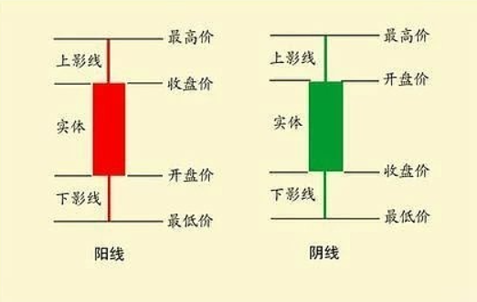
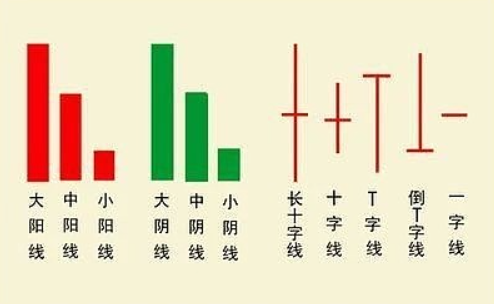
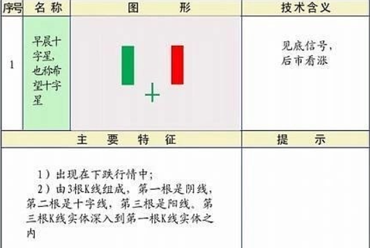
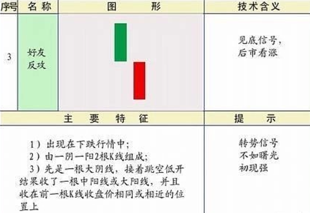
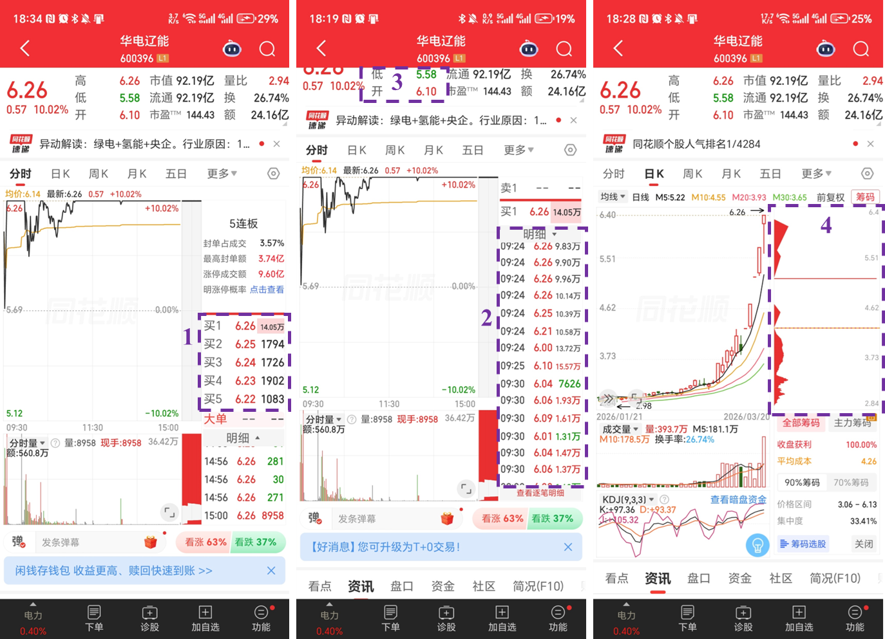
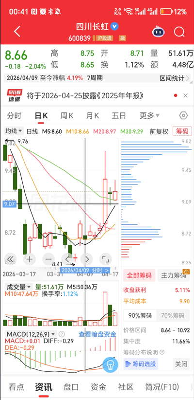

# 股市

## 基本概念

一些基本概念可以参考：[最新最全面的股票专业术语解释大全，值得收藏 - 知乎](https://zhuanlan.zhihu.com/p/358994226)

1. 买一&卖一：
   卖一是指卖方的最优价，越低越容易成交
   买一指的是买方的最优价，越高越容易成交
2. 封单&一字板
   在买一的位置，堆积了大量的数字，即使有人以涨停价卖出，后面有大量资金排队等着买，也就是**一字板**，开盘即涨停，全天都可能掉不下来
3. 市场中的角色：
  - 散户：即个人投资者
  - 机构：专业的投资方
  - 游资：以短期投机为目的的大额民间/小机构资金；

4. 连板：即连续涨停板，第一天涨停叫1板，第二天叫2连板
5. 换手率：当前成交的股票数量÷这只股票可以交易的股票总数；数值越高，表明流动性越好，分歧大，风险大。
6. 市盈率（PE）：定义为**每股股价÷每股年度净利润**，也可以理解成 **市盈率=总市值÷公司年度净利润=靠公司回本的年数**。
  - 市盈率低（5~15倍）：回本快，稳健成熟的行业，如银行、**电力**、钢铁、煤炭等传统价值股
  - 市盈率中等（20~40倍）：正常股区间，业务稳定增长
  - 市盈率高（50倍以上）：回本慢，一般是炒预期。比如科技股、题材股、连板妖股（连板妖股指的是连续n个涨停、不看业绩、市盈率、基本面，亏损也能涨的，靠情绪和游资炒作的，特征是：盘子小，容易拉）
  - 市盈率为负：公司亏损
7. MACD：平滑异同移动平均线（Moving average convergence divergence， MACD），用于判断股票、指数的中长期趋势和动能的技术指标。
8. 大放水行情：个股普涨，爽歪歪
9. 趋势斜率：在K线图中，连接趋势中的高点或低点，画一条趋势线，该线的角度即为趋势斜率。
## 开盘价

- 开盘价并非第一笔成交的价格。而是通过 **集合竞价** 产生的

- 决定过程：

  1.挂单（开盘前的特定时间段，所有想买和想卖的将自己的价位和数量输入系统）。

  2.最大成交量原则（交易所的交易系统将所有的买单和卖单撮合在一起，系统自动寻找一个特定的价格，在这个价格上，成交的数量最大）。

  也就是这个最大成交原则，**如果在这个价格，卖多买少，价格下调；如果大家恐慌性抛售（挂跌停价卖），而买盘很少，那么系统撮合出来的最大成交价就会很低。**

  3.确定开盘价：能实现最大成交量的价格，就成了当天的开盘价。

## 涨停和跌停

在A股中，为了保护投资者，交易所设立了涨跌幅限制机制。也就是给股价每天的波动画一个圈，不能跑出这个圈。

1. 涨停：股价到了天花板，想买的人多，但是价格不能再高了，此时的k线是红色的，但是并没有停止交易。但是没有人愿意卖，导致很难买进去，也就是 **封板**

2. 跌停：股价跌倒了地板，所有人都想卖，没有人愿意买，恐慌情绪严重，童颜没有停止交易，只是很难卖出去，也就是 **被闷杀**

---

关于涨停价和跌停价：

这两个价格是根据**昨天的收盘价**算出来的“天花板”和“地板”的具体数值。

在A股主板市场，普通股票的涨跌幅限制通常是 **10%**。

计算公式：

- 涨停价 = 昨天收盘价 × (1 + 10%)
- 跌停价 = 昨天收盘价 × (1 - 10%) *(注：计算结果会进行四舍五入处理)*

## 量价背离

量价背离：股价在涨，但是成交量不配合，即量价背离，是行情快要反转的信号

正常的量价关系为：

- 价涨量增：越涨越有人买，健康上涨
- 价跌量缩：越跌没人卖，正常回调。这里的价格跌是缩量回调（健康价格），是在回踩均线，大多数人看好，不会卖

量价背离情况：

- 股价越涨越高，但是成交量越来越小。上涨没动力，随时会跌。比如彩礼越来越高，但是结婚率越来越低，看跌。
- 股价越来越低，但是成交量越来越小。这里的价格跌是一路下跌，过程中价跌量增，但是在触底后，成交量比之前下跌的时候的成交量还小（连续跌，导致抛售，但是价格新低，成交量却变小），表明该割肉的都割了，套牢盘已经躺平，没人愿意卖了。大概率会止跌反弹。

## ETF和场外基金

基金是将钱给专业的理财专家（基金经理），让他们去投资各种各样的东西，比如股票、债券。就是找专业的人帮自己投资。

---

**ETF**为交易型开放指数基金，是一种特殊的基金，可以想股票一样在证券交易所里买卖。

ETF可以看成是一种非常专的基金，专门跟踪某种指数，比如沪指300，他会按照这个指数里包含的股票种类和比例去买那些股票。通常采用完全复制或者抽样复制的方法，可以看成一个指数小跟班。

**其净值会随着标的指数的波动而波动。**

---

**场外基金**就是不在证券交易所买卖的基金，可以通过银行、基金公司去买。

其一天只有一个价格，在每天收盘之后，根据当天的投资的资产情况算出一个净值，并按照这个净值去买卖。

## 定投

基金定投是定期定额投资基金的简称，是指在固定的时间（如每月 10 日）以固定的金额（如 1000 元）投资到指定的开放式基金中。这种投资方式可以避免投资者因市场波动而在高点集中买入，通过长期分批买入，摊薄成本，平滑市场波动风险，获取市场的平均收益。

## k线图

### 基本结构

k线从时间上分，可以分为日、周、月、年k线

日K线它反映的是股价短期的走势。周K线、月K线、年K线反映的是股价中长期的走势。而5分钟、15分钟、30分钟、60分钟K线反映的是股价超短期的走势。它们的绘制方法大同小异。例如周K线，只要找到周一的开盘价、周五的收盘价，一周中的最高价和最低价，就可以把它绘制出来了。电脑上的周K线所标注的时间都是收盘价的时间

---

k线从形态上可以分为阳线、阴线和同价线三种类型。同价线表示实体部分为0，也就是开盘价=收盘价。大阳线、中阳线和小阳线是根据阳线实体（收盘价与开盘价的差值）大小以及涨幅范围来大致划分的。

### 见底形态和上升形态

---

- 从这个图中可以看到第一天的收盘价是高于第二天的开盘价的，也就是两个价格之间是不连续的。在k线图中，前一根k线的收盘价和下一根的开盘价之间出现了明显的缺口，这种现象称为**跳空**
- 造成这种跳空低开的原因是：
  - 非交易时间的时间累计，也就是在收盘后到开盘前，出现了利空消息
  - 在下跌的趋势中，投资者恐慌情绪导致第二天开盘时不计成本的低价卖出，导致价格在更低的位置成交。

## 交易挂单

在A股中，正式交易从9:30开始，但是挂单早于正式交易的时间。分一下几个时间段：

1. 最早的挂单时间，前一天晚上

   大部分券商在**前一天晚上**的8点至10点后，就会接受第二天的挂单。也就是说，把用户的单子存在服务器中，**如果要抢涨停板开盘的股票，一般是需要隔夜委托的，要拼时间优先**

2. 集合竞价阶段，9:15-9:25

   这个时间段是进行**集体撮合**的时间。一般的动作包括：

   - 9:15-9:20，可以挂单、可以撤单，这个时候的匹配价格是**大多是虚假的**，大庄家经常先挂大单，把价格顶高，诱导散户跟进
   - 9:20-9:25，可以挂单，**不能撤单**，撤不了单，导致价格比较真实
   - 9:25，产生开盘价，交易系统根据成交量最大的原则，计算出开盘价

3. 冷静期，9:25-9:30

   这5分钟内，可以挂单或者撤单，但是交易所不处理，而是放到交易队列中排队。

4. 正式交易，9:30-11:30，通过买卖价格，实时成交，产生现价

---

在没开盘的时候，发生**涨停或者跌停**，的原因：

在集合竞价阶段（9:15-9:25），如果一家公司发生了重大利好，此时：

- 买家会全力以赴，报涨停价购买，哪怕是最高价格也要抢到
- 卖家觉得以后还是会涨，导致没人愿意买

结果就是，交易所系统发现，在涨停价的位置，能撮合的成交量是最大的，于是9:25计算出的开盘价即为涨停价格。

## 交易界面

- 图一：1.买一卖一：卖一是指卖方的最优价，越低越容易成交；买一指的是买方的最优价，越高越容易成交

- 图二：

  2.交易明细：在9:24~9:25的交易明细，并不是真正的连续交易，而是A股的开盘集合竞价的阶段。 **在9:30之后的交易，才是连续竞价阶段的真实成交记录。**

  对于这三列数字的意义，以 `9:24 6.26 9.83万`为例，第一列表示时间，委托/成交发生的时间点；第二列表示价格，委托/成交的价格（元），9:25是最终撮合的开盘价；9:30之后，是实际的成交价格；第三列表示数量，即委托/成交的手数（一手=100股），9:25是开盘撮合的成交量，9:30之后是实际成交的数量。红色手数：主动买入的（外盘），绿色手数：主动卖出的（内盘）

- 图三：

  4.筹码：即投资者在不同价位买入的股票持仓。筹码图就是把所有投资者的持仓，按照价格区间画成山峰的形状。

  红色线：为获利筹码的边界线，代表当前股价下的获利筹码区域边界，红色实线以下的筹码均为获利盘（即持仓成本均低于当前股价），这些投资者处于盈利状态。

  黄色虚线：市场平均成本线，即所有持仓筹码的加权平均成本价。

  **日K线的M5、M10分别表示过去5个和10个交易日的收盘价平均值**
  
  成交量中的M5 M10是成交量均线
  
  换手率是成交量占流通股本的比例，用来看股票交易的活跃程度。

## MACD

平滑异同移动平均线（Moving average convergence divergence， **MACD**），用于判断股票、指数的中长期趋势和动能的技术指标。

- DIF线（快线）：短期与长期指数移动平均线的差值，对价格反应敏感
- DEA线（慢线）：DIF的移动平均线，对价格反应平缓
- MACD红绿柱：DIF线与DEA线的差值。

---

看涨：DIF线从底下穿过DEA线。

如下图：

## 净资产收益率（ROE, Return on equity）

> 表示公司每投入一元股东资金，一年能赚多少净利润

基本计算公式是：
$$
\text{净资产收益率（ROE）}
=
\frac{\text{净利润}}{\text{平均净资产}}
\times 100\%
$$
其中：
$$
\text{平均净资产}
=
\frac{\text{期初净资产}+\text{期末净资产}}{2}
$$
这里的“净资产”也叫**股东权益**或**所有者权益**，可以简单理解为：
$$
\text{净资产}=\text{总资产}-\text{总负债}
$$

---

一般来说，公司的的ROE越高，说明公司利用股东赚钱的能力越强

| ROE水平  | 大致含义                                 |
| -------- | ---------------------------------------- |
| 小于5%   | 盈利能力较弱，或资产利用效率较低         |
| 5%～10%  | 一般                                     |
| 10%～15% | 比较不错                                 |
| 15%～20% | 较强                                     |
| 20%以上  | 很强，但要检查是否依赖高负债或一次性收益 |

## 市值和流通规模

**市值：**

表示按当前股价计算，全部股份的市场价值。
$$
总市值=当前股价\times总股本
$$

---

**总股本：**

公司已经发行的全部股份数量，包括：

- 可自由交易的股份
- 限售股份
- 其他暂时不能交易的股份

---

**流通股：**

可以在二级市场交易的股票数量。

---

**自由流通股：**

自由流通股通常会从流通股中扣除：

- 控股股东长期持有的股份
- 实际控制人持股
- 战略投资者长期持股
- 交叉持股
- 其他一般不会频繁交易的股份

所以：
$$
自由流通股\leq流通股
$$

---

**自由流通值：**

按自由流通股计算的市值：
$$
自由流通市值=股价\times自由流通股
$$

---

**流通：**

这里通常指**流通市值**，即可以在市场正常交易的股份对应的市值：
$$
流通市值=股价\times流通股本
$$

## 成交量和成交活跃度

**量比：**

量比表示当前成交速度相对于近期正常水平的大小。

常见理解是：
$$
量比=
\frac{当天平均每分钟成交量}
{过去若干交易日同期平均每分钟成交量}
$$
图中量比0.79，说明当天成交速度约为近期同期平均水平的79%，成交相对偏清淡。

大致可以这样理解：

- 小于0.5：明显缩量
- 0.5～1：相对偏弱
- 1左右：正常
- 1.5～2.5：明显放量
- 很高：交易突然活跃，需要结合消息和价格走势判断

---

**换手：**

表示当天成交股数占流通股本的比例。
$$
换手率=
\frac{当天成交股数}{流通股本}\times100\%
$$
它反映股票的交易活跃程度。

一般来说：

- 大盘股换手率通常较低
- 小盘股和题材股换手率通常较高
- 换手突然放大，说明筹码交换明显增加

但高换手不一定是好事，也可能是高位出货或剧烈分歧。

---

**换手（实）：**

这里的“实”通常指按**自由流通股本**计算的实际换手率。
$$
实际换手率=
\frac{成交股数}{自由流通股本}\times100\%
$$
它比普通换手率更能反映市场上真正活跃筹码的交换程度。

## 内盘、外盘和委比

**内盘：**

通常指按照**卖一价或更低价格主动成交**的数量。

一般理解为主动卖出：

> 卖方愿意降低价格，主动去成交买方挂单。

所以软件通常用绿色显示内盘。

但需要注意，内盘并不能严格等同于“资金流出”，因为每一笔成交同时都有买方和卖方。

---

**外盘：**

通常指按照**买一价或更高价格主动成交**的数量。

一般理解为主动买入：

> 买方愿意提高价格，主动去成交卖方挂单。

软件通常用红色显示外盘。

---

**委比：**

委比比较买盘挂单和卖盘挂单的相对强弱。

常见公式：
$$
委比=
\frac{委买手数-委卖手数}
{委买手数+委卖手数}
\times100\%
$$
范围为：
$$
-100\%\sim+100\%
$$

- 委比为正：买单挂单量较多
- 委比为负：卖单挂单量较多
- 越接近100%：盘口买单明显更多
- 越接近-100%：盘口卖单明显更多

## 反向DCF模型

# 量化交易

> 量化交易就是用数学模型+计算机程序，实现自动的股票买卖。
>
> 不用靠人盯盘，靠感觉下单，而是电脑替代人执行交易。

## 策略与回测

策略即人事先定好的交易规则，比如：

- 股价站上5日均线买，跌破就卖
- 换手率超过多少，量比达到多少就进场

---

**回测**

即用过去的数据跑一遍，看某个策略能不能赚钱。

## 量化类型

1. 高频量化：一天内反复的低买高卖，赚小钱，靠量堆利润。
2. 趋势量化：跟着均线、量能、涨跌停强度做趋势
3. 套利量化：转不合理差价的
4. 多因子选股量化：用几百个指标（市值、盈利、增速、波动率等）自动选股票，相当于基金
