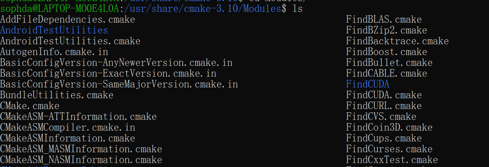
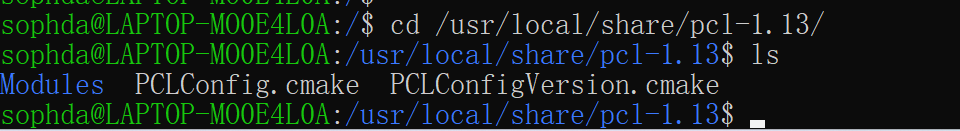
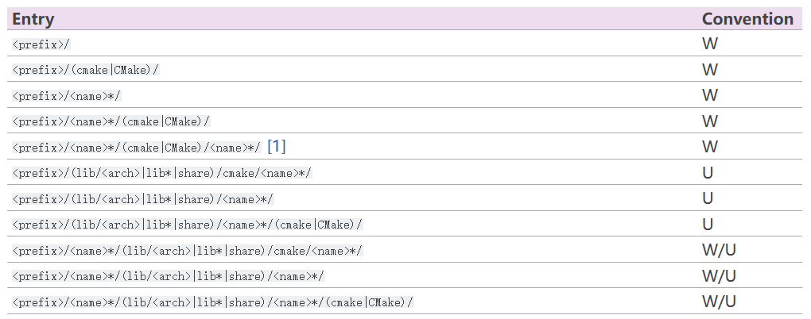
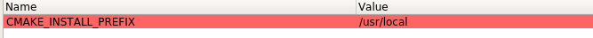
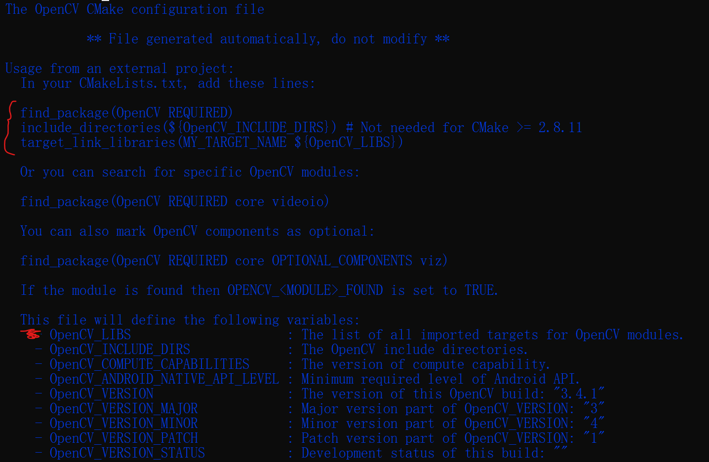

# cmake一些参数

主要是在Linux系统下使用到的一些cmake参数

## 1.set

## 2.find_package

该命令主要是引入项目所需要的包，主要工作方式有两种：module和config

**Module**

在Module模式中，cmake需要找到一个叫做`Find<LibraryName>.cmake`的文件。这个文件负责找到库所在的路径，为我们的项目引入头文件路径和库文件路径。cmake搜索这个文件的路径有两个，一个是上文提到的cmake安装目录下的`share/cmake-<version>/Modules`目录，另一个使我们指定的`CMAKE_MODULE_PATH`的所在目录。[Cmake之深入理解find_package()的用法 - 知乎 (zhihu.com)](https://zhuanlan.zhihu.com/p/97369704)

*这些find××.cmake一般由包项目提供，如opencv等，然后会复制到cmake的安装目录下面，在以后的项目构建中可能会用到*

***

**Config模式**

如果Module模式搜索失败，没有找到对应的`Find<LibraryName>.cmake`文件，则转入Config模式进行搜索。它主要通过`<LibraryName>Config.cmake` or `<lower-case-package-name>-config.cmake`这两个文件来引入我们需要的库。以我们刚刚安装的pcl库为例，在我们安装之后，它在`/usr/local/share/pcl-version`目录下生成了`PCLConfig.cmake`文件，而`/usr/local/lib/cmake/<LibraryName>/`正是find_package函数的搜索路径之一。（find_package的搜索路径是一系列的集合，而且在linux，windows，mac上都会有所区别，需要的可以参考官方文档[find_package](https://cmake.org/cmake/help/latest/command/find_package.html)）

搜索路径：

以pcl为例，prefix为`/usr/local`

***

**综上所述，使用find_package找到包的路径，然后在自己的项目中使用。一般找到了Config.cmake文件，通过查看里面的宏定义，即可查看包名：**

即`PCL_LIBRARIES`为包名字，然后再项目中使用时，即可引用这个宏：

opencv的Config.cmake则提供了更加详细的使用方式：（也就是在本项目中的cmakelist中包括了 `find_package` 之后，在cmakelist中的`OpenCv_LIBS` 才有了定义）

这样，cmakelist就很简洁，不用指定动态库了~~

