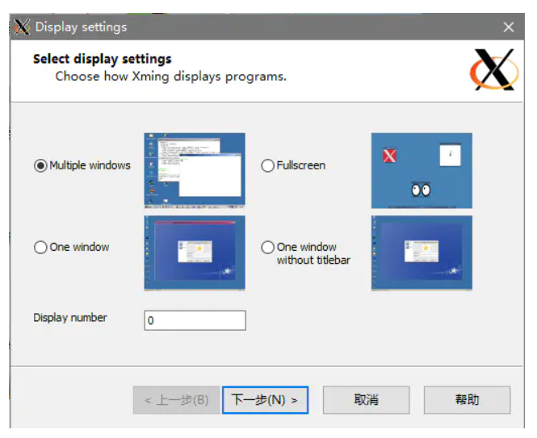
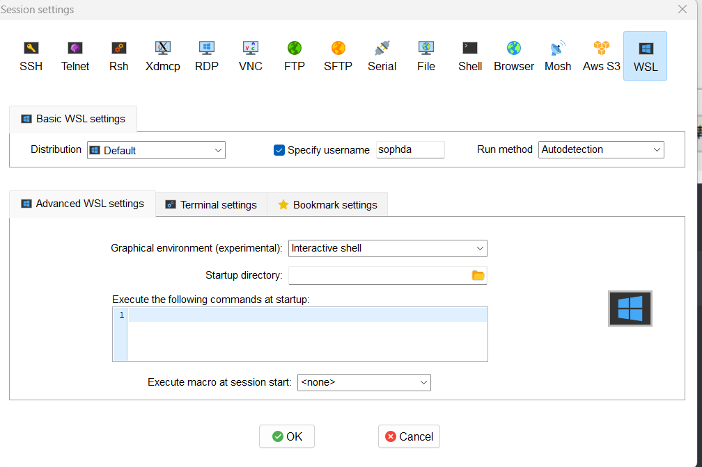
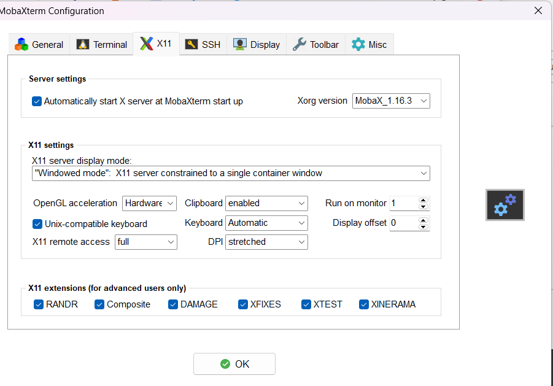

# wsl使用

！！！须知：wsl基于hyper-v，但是会把Windows下的驱动器挂载到/mnt目录下，因此跑一些程序是没问题的。

但是构建rootfs、ROS等，还是要用VMware的Ubuntu，rootfs构建时会用qemu，执行挂载，一不小心删了进程文件搞不好把Windows弄崩了

1.wsl安装xfce4

```
sudo apt install xfce4
sudo apt install xfce4-session
```

然后进行配置：(临时)

```
export DISPLAY=localhost:0
```

或者（永久版）：

```
echo "export DISPLAY=:0.0">> ~/.bashrc
或者
echo "export DISPLAY=localhost:0">> ~/.bashrc
```

```
source ~/.bashrc
```

2.启动桌面

打开x服务器，然后启动



然后会进入黑色桌面，然后进入wsl中，运行：

```
xfce4-session
```

# 使用moba

1.配置





2.运行

```
xfce4-session
```

3.退出  在cmd中

```
wsl --shutdown
```

# 如果安装了wslg(wsl gui)，则上面就不用折腾了~~~~笑

```
wsl --update
```
