# 文件说明

**压缩包均为exe格式，为自解压压缩包，无需压缩软件，直接双击即可解压**

## AtlasORBslam3.exe

电脑端slam程序，通过读取手机端拍摄的视频进行slam跟踪，并且得到地图文件

## orbslam3-ar-master.exe

交叉编译orb-slam3的工程，生成系列的动态库文件

## FakeGenshin.exe

unity工程

# 配置清单

## 虚拟机端

- Android-NDK-R25C

- boost 1.82.0

- opencv 3.4.16

- cmake 3.25.3

## windows端

- Android studio 2022.2

- unity 2022.3.3f1c1

- Android sdk (api 31,32)

- Android ndk (r25c)

Android sdk和ndk不需要单独安装，在安装unity的时候可以顺便安装上。

### matlab标定工具箱

1. 将手机app拍摄的视频截取成帧

   ```matlab
   videoname = "map"
   obj = VideoReader(videoname+".avi");%输入视频位置
   numFrames = obj.NumberOfFrames;% 帧的总数
   i=0
    for k = 1 :5:numFrames
        i=i+1
        frame = read(obj,k);%读取第几帧
       % imshow(frame);%显示帧
         imwrite(frame,strcat(videoname+"_"+num2str(i),'.jpg'),'jpg');% 保存帧
    end
   %%
   cameraParams.IntrinsicMatrix.'
   ```

2. 然后使用matlab 标定工具箱对图片进行标定

   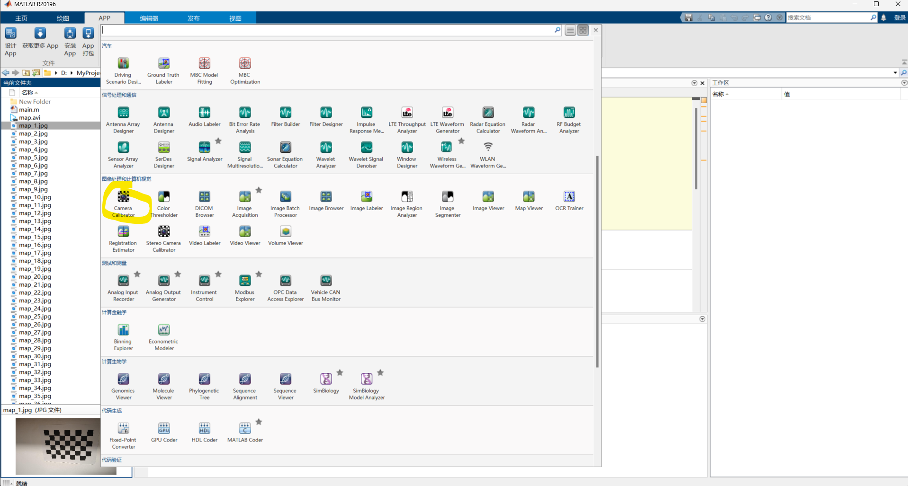

   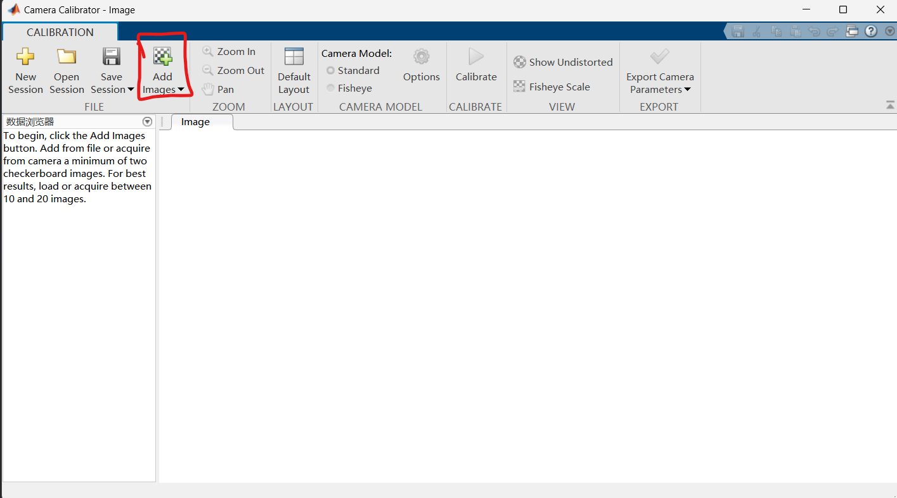

   

   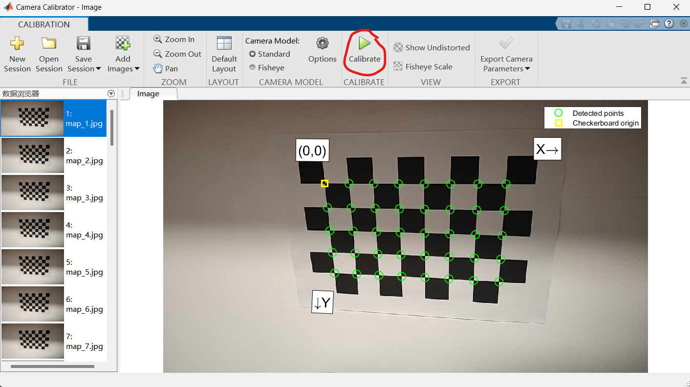

   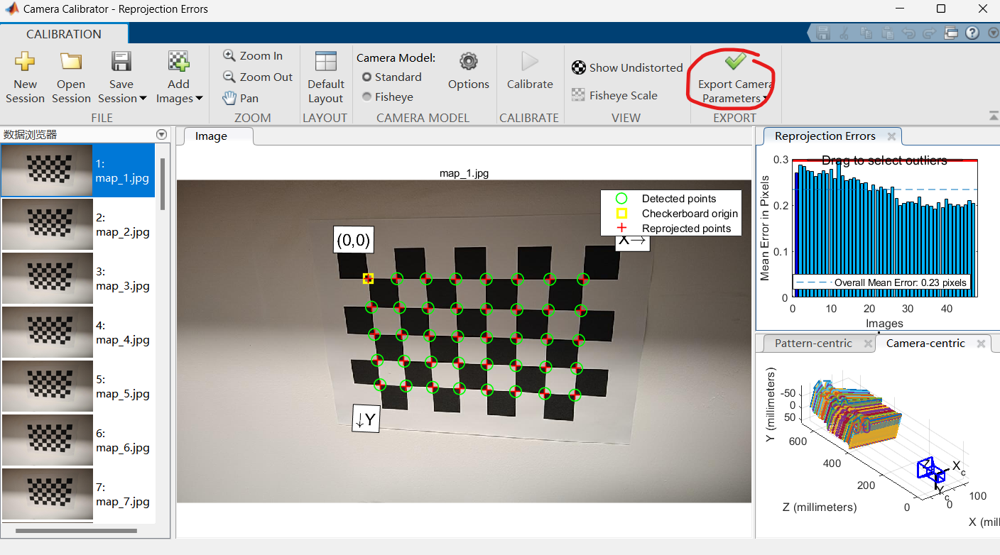

3. 导出到工作区之后，可查看内参信息。

   ```matlab
   cameraParams.IntrinsicMatrix.'
   ```

   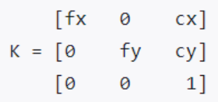

# 源码及编译

## ORB__SLAM3修改

orbslam的主体工程，`AtlasORBSLAM3`以及`orbslam3-ar-master`需要同步修改

### 移除Pangolin模块

1. 修改map.h和map.cc

   ```cc
   // Map.h 
   //#include <pangolin/pangolin.h> 27行
   ...
   
   //    GLubyte* mThumbnail; 191行   
   unsigned char* mThumbnail;
   ```

   ```cc
   // Map.cc 
   //    mThumbnail = static_cast<GLubyte*>(NULL); 33行    
   mThumbnail = static_cast<unsigned char*>(NULL);
   ...
   //    mThumbnail = static_cast<GLubyte*>(NULL); 42行    
   mThumbnail = static_cast<unsigned char*>(NULL);
   ...
   //    mThumbnail = static_cast<GLubyte*>(NULL); 56行    
   mThumbnail = static_cast<unsigned char*>(NULL);
   ```

2. 修改system.cc

   ```cc
   // MapDrawer.h 
   //#include <pangolin/pangolin.h> 24行
   ...
   
   //    void DrawCurrentCamera(pangolin::OpenGlMatrix &Twc);  48行
   ...
   //    void GetCurrentOpenGLCameraMatrix(pangolin::OpenGlMatrix &M, pangolin::OpenGlMatrix &MOw); 51行
   ```

### 移除绘图相关代码

```cc
删除 Viewer.h 和 Viewer.cc
删除 FrameDrawer.h 和 FrameDrawer.cc
删除 MapDrawer.h 和 MapDrawer.cc
其他源码中相关引用代码删除（主要修改 System 和 Tracking）
```

主要包括以下几个文件：

```cc
// System.cc
43  /*mpViewer(static_cast<Viewer*>(NULL)),*/
185 //mpFrameDrawer = new FrameDrawer(mpAtlas);
186 //mpMapDrawer = new MapDrawer(mpAtlas, strSettingsFile, settings_);
191 /*mpFrameDrawer, mpMapDrawer,*/
229 /*if(bUseViewer)
    //if(false) // TODO
    {    
        mpViewer = new Viewer(this, mpFrameDrawer,mpMapDrawer,mpTracker,strSettingsFile,settings_); 
        mptViewer = new thread(&Viewer::Run, mpViewer);    
        mpTracker->SetViewer(mpViewer);    
        mpLoopCloser->mpViewer = mpViewer;    
        mpViewer->both = mpFrameDrawer->both;
    }*/
```

```cc
// System.h 
32  //#include "FrameDrawer.h" 
33  //#include "MapDrawer.h"
39  //#include "Viewer.h"
74  //class Viewer;
75  //class FrameDrawer;
76  //class MapDrawer;
228 //Viewer* mpViewer;
230 //FrameDrawer* mpFrameDrawer;
231 //MapDrawer* mpMapDrawer;
```

```cc
// Tracking.h 
26  //#include "Viewer.h"
27  //#include "FrameDrawer.h"
35  //#include "MapDrawer.h"
48  //class Viewer;
49  //class FrameDrawer;
80  //void SetViewer(Viewer* pViewer);
281 //Viewer* mpViewer;
282 //FrameDrawer* mpFrameDrawer;
283 //MapDrawer* mpMapDrawer;
```

```cc
// Tracking.cc 
23  //#include "FrameDrawer.h"
44  /*FrameDrawer *pFrameDrawer, MapDrawer *pMapDrawer,*/
47  /*mpViewer(NULL),*/ 
48  /*mpFrameDrawer(pFrameDrawer), mpMapDrawer(pMapDrawer),*/
568 //mpFrameDrawer->both = true;
1090    //mpFrameDrawer->both = true;
1437    /*void Tracking::SetViewer(Viewer *pViewer
{
    mpViewer=pViewer;
}*/
2201    /*mpFrameDrawer->Update(this);if(mCurrentFrame.isSet())    mpMapDrawer->SetCurrentCameraPose(mCurrentFrame.GetPose());*/
2219 /*if(mSensor == System::IMU_MONOCULAR || mSensor == System::IMU_STEREO || mSensor 
== System::IMU_RGBD)    mpMapDrawer->SetCurrentCameraPose(mCurrentFrame.GetPose());*/
2441 //mpMapDrawer->SetCurrentCameraPose(mCurrentFrame.GetPose());
2652 //mpMapDrawer->SetCurrentCameraPose(pKFcur->GetPose());
3783 /*if(mpViewer){    mpViewer->RequestStop();    while(!mpViewer->isStopped())        usleep(3000);}*/
3834 /*if(mpViewer)    mpViewer->Release();*/
3843 /*if(mpViewer){    mpViewer->RequestStop();    while(!mpViewer->isStopped())        usleep(3000);}*/
3925 /*if(mpViewer)    mpViewer->Release();*/
```


### 头文件问题

1. 修改ORBmatcher.cc，将stdint-gcc.h 改为 stdint.h

   ```cc
   // orb-slam3/src/ORBmatcher.cc
   // orb-slam3/Thirdparty/DBoW2/DBoW2/FORB.cpp
   //#include<stdint-gcc.h>
   #include<stdint.h>
   ```

2. 修改se3mat.h。注释上面两行

   ```cc
   //#include<eigen3/Eigen/Geometry>
   //#include<eigen3/Eigen/Core>
   #include<Eigen/Geometry>
   #include<Eigen/Core>
   ```


## 重定位部分

### system.cc

- 在atlas开启的时候，需要新建一个新的地图，然后后续新建地图，会进行merge。也就是说，在**建图时**，需要在atlas中新建地图。但是如果在**定位环节**，需要加载之前保存的地图。.

  **如果是电脑端建图，即AtlasORBSLAM3工程，按照代码段1修改。**

  ```c++
  // 代码段1
  // 180行
  loadedAtlas = true;
  if(createnewmap)
  {
      // do create new map
      mpAtlas->CreateNewMap();
  }
  else
  {
      // cout<<mpAtlas->
      // current map is none,so tracking will cause fault
      vector<Map*> multiMap = mpAtlas->GetAllMaps();
      cout<< multiMap.size();
      // auto iter = multiMap.begin();
      // mpAtlas->ChangeMap(*(iter));
  }
  ```

  如果是交叉编译，即orbslam3-ar-master工程，只需要将`mpAtlas->CreateNewMap();`部分注释掉即可

- 打开系统的重定位功能（即关闭建图线程），添加`useLocalization`变量

  ```
  System::System(const string &strVocFile, const string &strSettingsFile, const eSensor sensor,bool useLocalization,bool createnewmap,
                 const bool bUseViewer, const int initFr, const string &strSequence):
      mSensor(sensor), mbReset(false), mbResetActiveMap(false),
      mbActivateLocalizationMode(useLocalization), mbDeactivateLocalizationMode(false), mbShutDown(false)
  ```

  在实例化的时候，修改 `mbActivateLocalizationMode`

### 建图

在atlas.cc文件中，修改保存的内存变量：

需要多保存一个 `ar & mpCurrentMap`，那么在反序列化的时候，就会直接加载这个map

```c++
friend class boost::serialization::access;

template<class Archive>
void serialize(Archive &ar, const unsigned int version)
{
ar.template register_type<Pinhole>();
ar.template register_type<KannalaBrandt8>();

// Save/load a set structure, the set structure is broken in libboost 1.58 for ubuntu 16.04, a vector is serializated
ar & mspMaps;
ar & mvpBackupMaps;
ar & mvpCameras;
// Need to save/load the static Id from Frame, KeyFrame, MapPoint and Map
ar & Map::nNextId;
ar & Frame::nNextId;
ar & KeyFrame::nNextId;
ar & MapPoint::nNextId;
ar & GeometricCamera::nNextId;
ar & mnLastInitKFidMap;
ar & mpCurrentMap;
}
```

### 定位

1. 也就是在track线程中：在2037行的部分，需要修改：也就是把跟踪状态修改为`mState == RECENTLY_LOST && !bOK`时进行重定位

   ```cc
   {
   
   // Localization Mode: Local Mapping is deactivated (TODO Not available in inertial mode)
   // if(mState==LOST){
   if (mState == RECENTLY_LOST && !bOK){
   // 
   //     if(mSensor == System::IMU_MONOCULAR || mSensor == System::IMU_STEREO || mSensor == System::IMU_RGBD)
   //         Verbose::PrintMess("IMU. State LOST", Verbose::VERBOSITY_NORMAL);
   //     bOK = Relocalization();
   // }
   // if (mState == RECENTLY_LOST || !bOK ) {
   if (mSensor == System::IMU_MONOCULAR || mSensor == System::IMU_STEREO || mSensor == System::IMU_RGBD)
   Verbose::PrintMess("IMU. State LOST", Verbose::VERBOSITY_NORMAL);
   bOK = Relocalization();
   }
   ```

   

2. 修改map.cc中的PreSave函数如下：

   ```cc
   void Map::PreSave(std::set<GeometricCamera*> &spCams)
   {
       int nMPWithoutObs = 0;
   
       std::set<MapPoint*> tmp_mspMapPoints1;
       tmp_mspMapPoints1.insert(mspMapPoints.begin(), mspMapPoints.end());
   
       for(MapPoint* pMPi : tmp_mspMapPoints1)
       {
           if(!pMPi || pMPi->isBad())
               continue;
   
           if(pMPi->GetObservations().size() == 0)
           {
               nMPWithoutObs++;
           }
           map<KeyFrame*, std::tuple<int,int>> mpObs = pMPi->GetObservations();
           for(map<KeyFrame*, std::tuple<int,int>>::iterator it= mpObs.begin(), end=mpObs.end(); it!=end; ++it)
           {
               if(it->first->GetMap() != this || it->first->isBad())
               {
                   pMPi->EraseObservation(it->first);
               }
   
           }
       }
   
       // Saves the id of KF origins
       mvBackupKeyFrameOriginsId.clear();
       mvBackupKeyFrameOriginsId.reserve(mvpKeyFrameOrigins.size());
       for(int i = 0, numEl = mvpKeyFrameOrigins.size(); i < numEl; ++i)
       {
           mvBackupKeyFrameOriginsId.push_back(mvpKeyFrameOrigins[i]->mnId);
       }
   
   
       // Backup of MapPoints
       mvpBackupMapPoints.clear();
   
       std::set<MapPoint*> tmp_mspMapPoints2;
       tmp_mspMapPoints2.insert(mspMapPoints.begin(), mspMapPoints.end());
   
       for(MapPoint* pMPi : tmp_mspMapPoints2)
       {
           if(!pMPi || pMPi->isBad())
               continue;
   
           mvpBackupMapPoints.push_back(pMPi);
           pMPi->PreSave(mspKeyFrames,mspMapPoints);
       }
   
       // Backup of KeyFrames
       mvpBackupKeyFrames.clear();
       for(KeyFrame* pKFi : mspKeyFrames)
       {
           if(!pKFi || pKFi->isBad())
               continue;
   
           mvpBackupKeyFrames.push_back(pKFi);
           pKFi->PreSave(mspKeyFrames,mspMapPoints, spCams);
       }
   
       mnBackupKFinitialID = -1;
       if(mpKFinitial)
       {
           mnBackupKFinitialID = mpKFinitial->mnId;
       }
   
       mnBackupKFlowerID = -1;
       if(mpKFlowerID)
       {
           mnBackupKFlowerID = mpKFlowerID->mnId;
       }
   
   }
   ```

3. 修改MapPoint.cc中的PreSave函数如下：

   ```cc
   void MapPoint::PreSave(set<KeyFrame*>& spKF,set<MapPoint*>& spMP)
   {
       mBackupReplacedId = -1;
       if(mpReplaced && spMP.find(mpReplaced) != spMP.end())
           mBackupReplacedId = mpReplaced->mnId;
   
       mBackupObservationsId1.clear();
       mBackupObservationsId2.clear();
       // Save the id and position in each KF who view it
       std::map<KeyFrame*,std::tuple<int,int> > tmp_mObservations;
       tmp_mObservations.insert(mObservations.begin(), mObservations.end());
   
       for(std::map<KeyFrame*,std::tuple<int,int> >::const_iterator it = tmp_mObservations.begin(), end = tmp_mObservations.end(); it != end; ++it)
       {
           KeyFrame* pKFi = it->first;
           if(spKF.find(pKFi) != spKF.end())
           {
               mBackupObservationsId1[it->first->mnId] = get<0>(it->second);
               mBackupObservationsId2[it->first->mnId] = get<1>(it->second);
           }
           else
           {
               EraseObservation(pKFi);
           }
       }
   
       // Save the id of the reference KF
       if(spKF.find(mpRefKF) != spKF.end())
       {
           mBackupRefKFId = mpRefKF->mnId;
       }
   }
   ```

   

### 修改setting.yaml文件

```
System.LoadAtlasFromFile: "/home/sophda/project/AtlasORBslam3/output/mapl"

System.SaveAtlasToFile: "/home/sophda/project/AtlasORBslam3/output/mapl"
```

- 建图时，只保留saveatlas
- 重定位时，只保留loadatlas


## 编译

### AtlasORBSLAM3

1. 需要依次编译DBOW2、G2O、opencv动态库（x86）

- 在DBOW2的CMakeList.txt中，需要修改项目地址。主要包括`include_directoriees`,`link__directories`。修改为项目当前的绝对路径或相对路径。
- G2O工程同上

2. 在完成上述动态库编译后，会生成`.so`动态库文件。需要在`ORB_SLAM3`的CMakeList.txt中通过`link_directories`以及`target_link_libraries`来指定动态库

3. 在项目根目录的CMakeList.txt文件中，指定生成的DBOW2、g2o，opencv，orbslam3的动态库，编译即可


### Boost库移植（static）

**主要针对交叉编译，电脑端可以直接安装boost库**

使用的是来自boost-for-Android的项目[moritz-wundke/Boost-for-Android: Android port of Boost C++ Libraries (github.com)](https://github.com/moritz-wundke/Boost-for-Android)，需要在虚拟机环境中，在wsl中会报错（File/NVidia的错误。**虚拟机并不需要显卡** ）

相关配置：NDK:R25C    boost：1.82  Ubuntu18.04

需要修改的就是：

```
build-android.sh中：
修改：（默认情况就是这个）
link=static
```

然后：

```
./build-android.sh $(NDK_ROOT)
```

会产生一系列的a静态库，我们需要这几个，主要是序列化相关的：

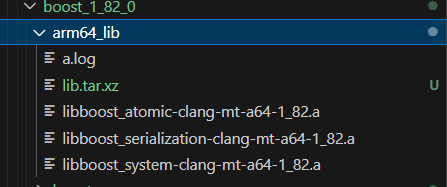

同时，需要同步修改cmakelist文件，只需要把cmakelist中的：

```
link_directories()
target_link_libraries()
```

这两个修改一下就可以

### orbslam3-ar-master

需要安装android-ndk-r25c以进行交叉编译。

**使用cmake-gui展示交叉编译的步骤：**（以 交叉编译g2o库为例）

1. 在命令行中输入`cmake-gui`

   然后在source code以及build中分别指定源码路径以及生成路径

   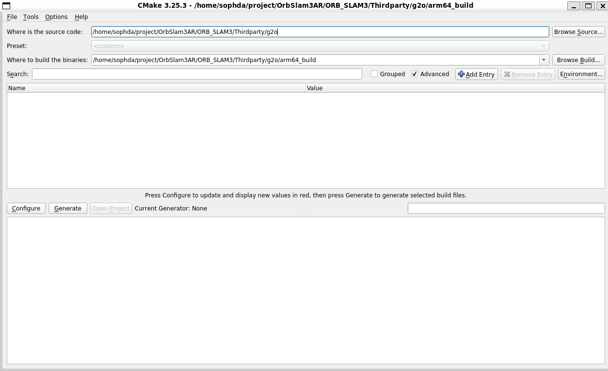

2. 点击configure ，选择第三项

   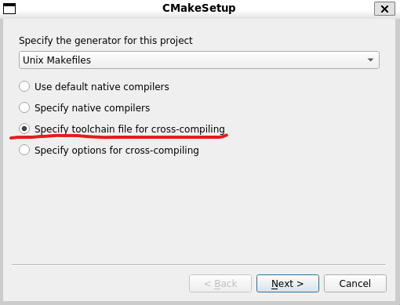

3. 选择ndk中的工具链文件，以.cmake结尾。（路径在NDK/build/cmake/android.toolchain.cmake）

   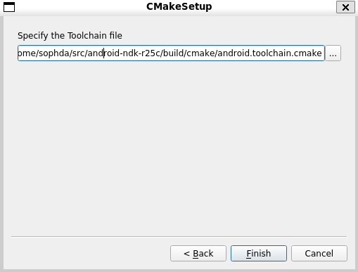

4. 点击finish，然后分别点击config以及generate

   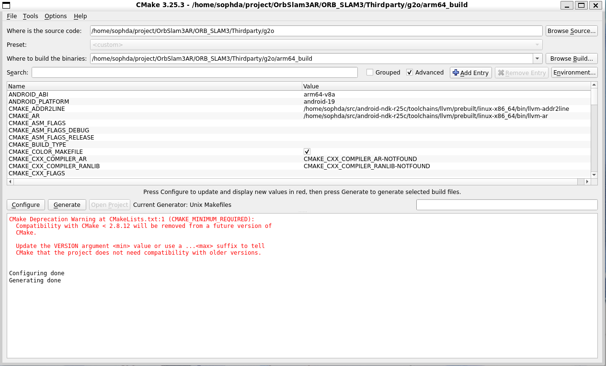

5. 切换到build路径，输入

   ```
   make -j16
   ```

   进行编译，其他的动态库同理。
   
   

编译结束后会生成一系列的动态库，需要将这些**动态库复制到**unity工程中，具体路径为：`Assets\Plugins\Android`

## Unity工程导出到Android studio

> 配置文件放在手机根目录，由于最新的安卓系统强制存储分区机制导致c++端无法访问，因此要修改权限

1. 首先在Androidmanifest.xml中：

   ```xml
   <manifest xmlns:android="http://schemas.android.com/apk/res/android"
       xmlns:tools="http://schemas.android.com/tools"
       package="com.example.demo">
   
       <uses-permission android:name="android.permission.MANAGE_EXTERNAL_STORAGE"
           tools:ignore="ScopedStorage" />
   
   </manifest>
   ```

   指定“权限”为管理外部存储并忽略存储分区“ScopeStorage”。

   **在application中，加入**

   ```
   <application>
   	android:requestLegacyExternalStorage="true"
   	......
   	......
   </application>
   
   ```

   参考：

   ```xml
   <?xml version="1.0" encoding="utf-8"?>
   <manifest xmlns:android="http://schemas.android.com/apk/res/android" package="com.unity3d.player" xmlns:tools="http://schemas.android.com/tools">
     <uses-permission android:name="android.permission.WRITE_EXTERNAL_STORAGE" />
     <uses-permission android:name="android.permission.INTERNET" />
     <uses-permission android:name="android.permission.CAMERA" />
     <uses-permission android:name="android.permission.WRITE_EXTERNAL_STORAGE" />
     <uses-permission android:name="android.permission.READ_EXTERNAL_STORAGE" />
     <uses-permission android:name="android.permission.MANAGE_EXTERNAL_STORAGE" tools:ignore="ScopedStorage" />
     <uses-feature android:glEsVersion="0x00030001" />
     <uses-feature android:name="android.hardware.vulkan.version" android:required="false" />
     <uses-feature android:name="android.hardware.camera" android:required="false" />
     <uses-feature android:name="android.hardware.camera.autofocus" android:required="false" />
     <uses-feature android:name="android.hardware.camera.front" android:required="false" />
     <uses-feature android:name="android.hardware.touchscreen" android:required="false" />
     <uses-feature android:name="android.hardware.touchscreen.multitouch" android:required="false" />
     <uses-feature android:name="android.hardware.touchscreen.multitouch.distinct" android:required="false" />
     <application android:extractNativeLibs="true"
                  android:requestLegacyExternalStorage="true">
       <meta-data android:name="unity.splash-mode" android:value="0" />
       <meta-data android:name="unity.splash-enable" android:value="True" />
       <meta-data android:name="unity.launch-fullscreen" android:value="True" />
       <meta-data android:name="unity.allow-resizable-window" android:value="False" />
       <meta-data android:name="notch.config" android:value="portrait|landscape" />
       <meta-data android:name="unity.auto-report-fully-drawn" android:value="true" />
       <activity android:name="com.unity3d.player.UnityPlayerActivity" android:theme="@style/UnityThemeSelector" android:requestLegacyExternalStorage="true" android:screenOrientation="reverseLandscape" android:launchMode="singleTask" android:configChanges="mcc|mnc|locale|touchscreen|keyboard|keyboardHidden|navigation|orientation|screenLayout|uiMode|screenSize|smallestScreenSize|fontScale|layoutDirection|density" android:resizeableActivity="false" android:hardwareAccelerated="false" android:exported="true">
         <intent-filter>
           <category android:name="android.intent.category.LAUNCHER" />
           <action android:name="android.intent.action.MAIN" />
         </intent-filter>
         <meta-data android:name="unityplayer.UnityActivity" android:value="true" />
         <meta-data android:name="notch_support" android:value="true" />
       </activity>
     </application>
   </manifest>
   ```

   

2. 在unity中导出Android项目，在java文件中的onStart()中修改

   ```java
   if (Build.VERSION.SDK_INT < Build.VERSION_CODES.R ||
                   Environment.isExternalStorageManager()) {
               Toast.makeText(this, "已获得访问所有文件的权限", Toast.LENGTH_SHORT).show();
           } else {
               Intent intent = new Intent(Settings.ACTION_MANAGE_ALL_FILES_ACCESS_PERMISSION);
               startActivity(intent);
           }
   ```

   


# 拍图、建图、重定位步骤

## 拍图（手机端）

1. 在根目录新建4DAR文件夹，并将Settings.yaml，ORBvoc.bin，osa文件放入
2. 打开手机端app
3. 点击`open cam`按钮，此时界面会现实摄像头的画面
4. **点击第一次**`save pic`按钮，此时会开始拍摄。**点击第二次**`save pic`按钮，会中止拍摄，并将视频文件保存到**根目录/4DAR**下面

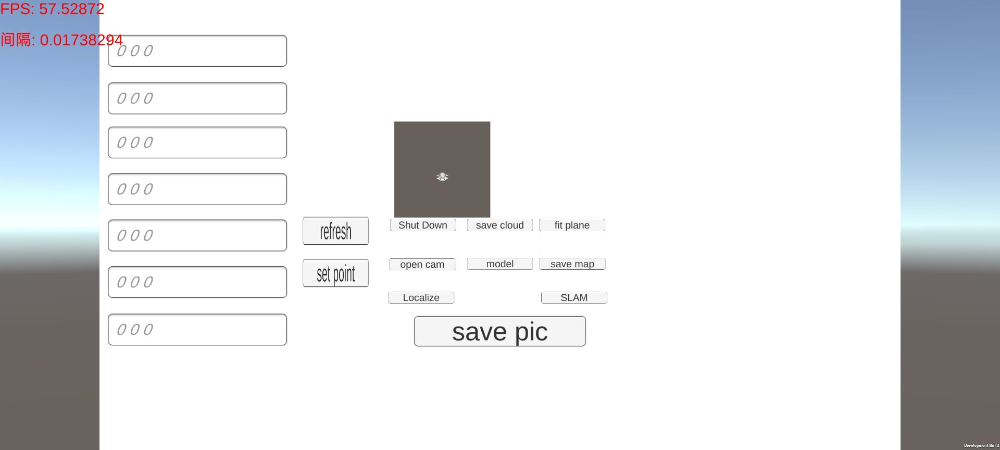


## 建图（电脑端）

需要修改`Setting.yaml`中的参数，主要包括相机内参、osa输出路径。

下图所示，修改内参：

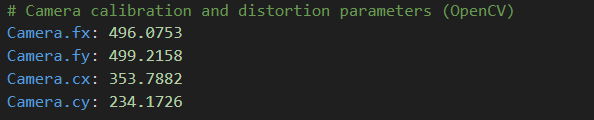

下图所示，修改osa输出路径：（在手机端，需要保留第一行；在电脑端重建时，保留第二行）

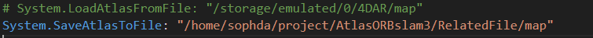

将手机段拍摄的视频文件复制到电脑端`AtlasORBslam3/videoFile`中，如下图所示：

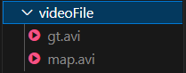

运行主程序，选择对应的yaml文件，并指定视频文件，此时会进行slam跟踪，结束后会在`RelatedFile`中生成osa文件

## 重定位（手机端）

将生成的osa文件复制到手机的**根目录/4DAR**下，然后打开app

1. 点击`open cam`打开相机
2. 点击`SLAM`进行重定位
3. 在右侧的3*3矩阵开始变化时，表明开始重定位，点击`model`开始同步相机位姿，此时相机的姿态会实时变化
4. 点击`set point`，会将此时的相机位姿（x，y，z坐标）同步到左侧的列表中。点击`refresh`会将模型按照左侧列表中的坐标进行展示

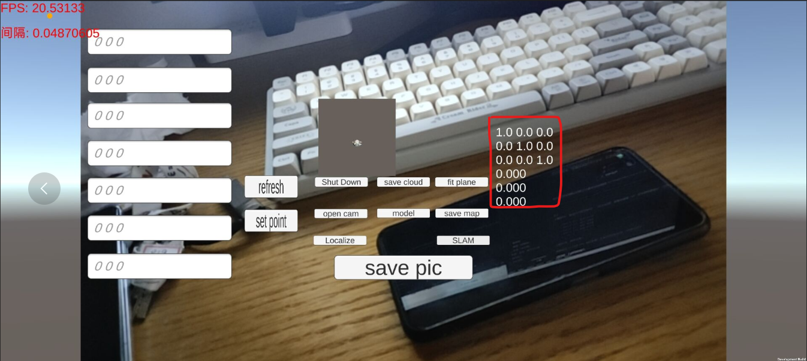


