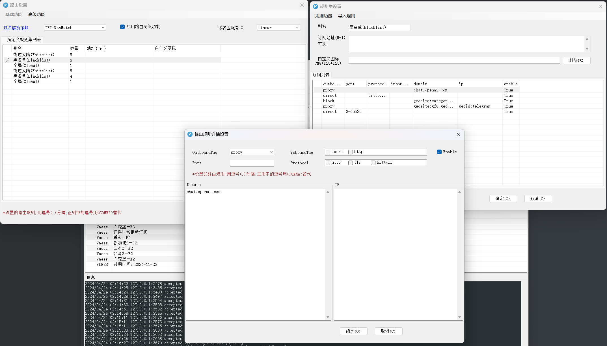

# v2ray

- 绕过大陆模式：只要服务器在外国的，都会进行代理，比如说new bing,google,chatgpt
- 黑名单模式：服务器在国外，并且对国内墙了的，进行代理。比如google。但是bing并没有墙国内，所以不会进行代理。chatgpt也是同理，默认界面没有墙，不会代理。

这就有个很操蛋的问题，我要用大陆模式代理chatgpt，但是newbing的搜索贼鸡巴难用。但是黑名单模式无法代理chatgpt，导致这两个网站冲突了。

所以要在黑名单模式下，给chatgpt进行代理：

也就是把chatgpt添加到黑名单中，让v2ray认为这个chatgpt把国内屏蔽了，然后进行代理。结果就是：黑名单模式下，bing不走代理，chatgpt走代理。

