# COMSOL

## 入门

comsol的不同物理场是针对不同的物理函数，也就是迭代器的函数不同

一般步骤（仿真声场）：

1. 绘制几何，这里包括仿真的声场，完美匹配层，换能器等。
2. 定义全局变量
3. 增加**研究**，也就是求解什么问题

## （一维阵列）声场仿真

总体工程树：

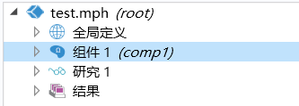

### 全局定义

包括：

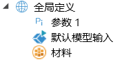

这里定义的**参数1**为：

> 这里定义了一些主要参数，比如仿真域，频率，仿真时间等

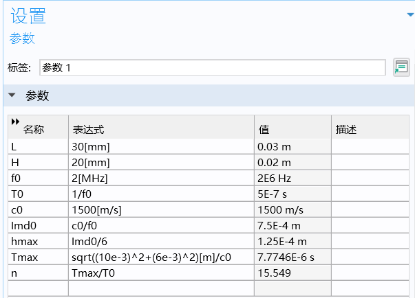

### 组件部分

> 这里可以看成仿真的总体流程，包括：**定义**换能器延迟、定义几何形状、定义材料、压力声学，瞬态（actd）、划分网格等

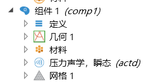

**定义**：

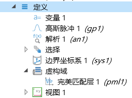

这里定义了延迟相关的变量、完美匹配层等。

**几何：**

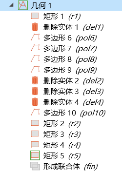

包括了整个区域的形状、换能器、完美匹配层、仿真域等。

因为这些部分（包括仿真域、完美匹配层等）是一个区域，所以要通过添加**矩形**完成。

**材料：**

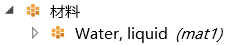

使用水，这个在comsol的材料库中是内置的。

**压力声学，瞬态（actd）**

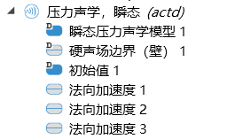

包括为每个阵元添加延迟控制，让每个阵元进行震动。通过手动点击阵元进行添加。两边的阵元具有相同的时间延迟，也就是进行同时激发。

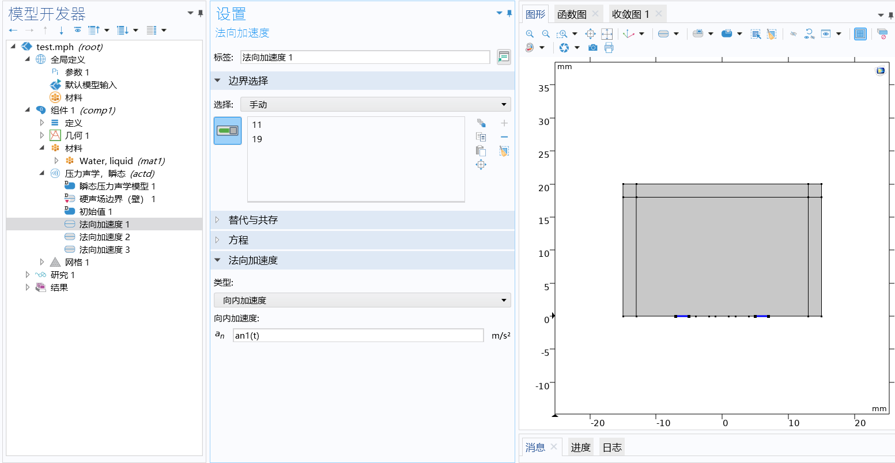

**网格：**

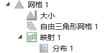

右键网格，选择自由三角网格。选择网格的最大、最小网格。

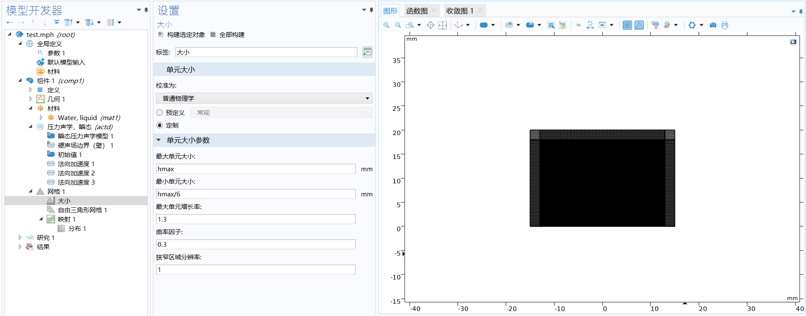

还要为完美匹配层添加网格**映射**，首先为**网格1**添加**映射1**，然后右键添加**分布1**，分别选择**映射的区域&分布1的区域**。

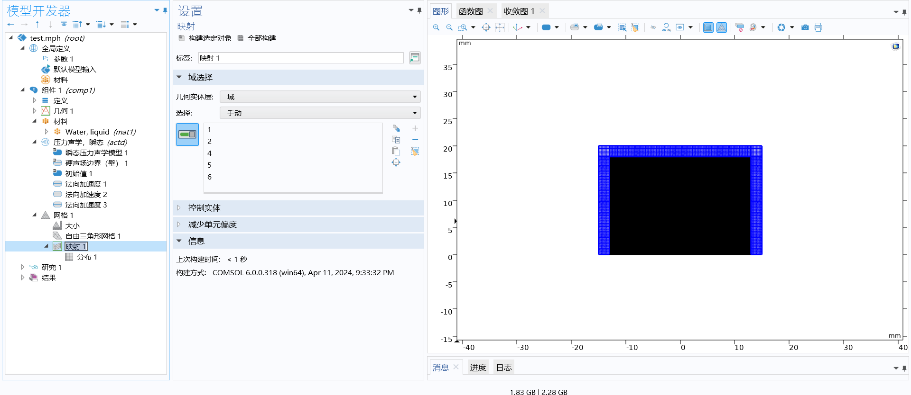

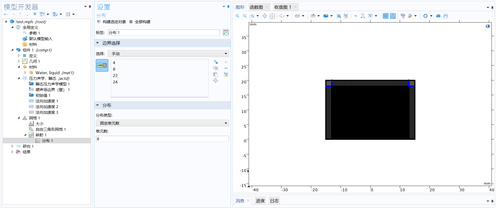

### 研究1

> 需要为需要解决的物理问题添加**研究**

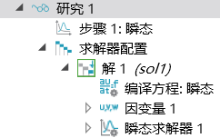

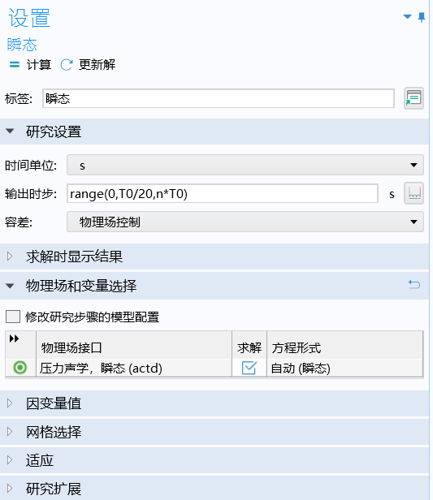

配置完成之后，点击**计算**即可。

### 结果

在结果中，

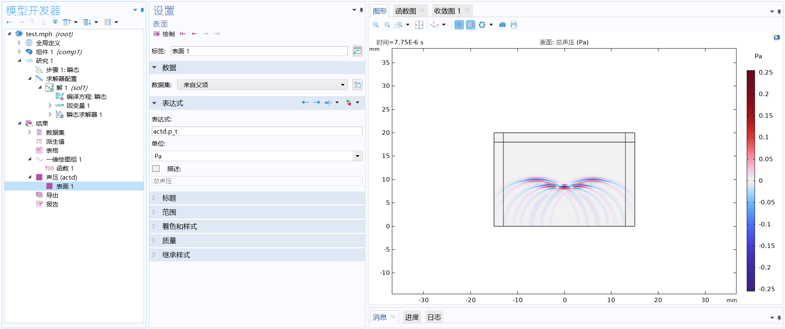

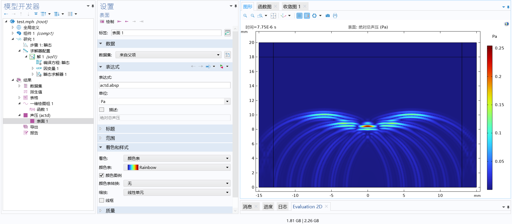