# 超声波在生物医学中的应用来源：foundation of biomedical ultrasound

index:

| 大写        | 小写                           | 中文名                   | 英文    | 英语音标注音                      | 大写Markdown | 小写Markdown          | 意义                                                         |
| ----------- | ------------------------------ | ------------------------ | ------- | --------------------------------- | ------------ | --------------------- | ------------------------------------------------------------ |
| A A*A*      | α \alpha*α*                    | 阿尔法                   | Alpha   | /'ælfə/                           | A            | \alpha                | 角度、系数、角加速度、第一个、电离度、转化率                 |
| B B*B*      | β \beta*β*                     | 贝塔/毕塔                | Beta    | /'bi:tə/ 或 /'beɪtə/              | B            | \beta                 | 磁通系数、角度、系数                                         |
| Γ \GammaΓ   | γ \gamma*γ*                    | 伽玛/甘玛                | Gamma   | /'gæmə/                           | \Gamma       | \gamma                | 电导系数（小写）、角度、比热容比                             |
| Δ \DeltaΔ   | δ \delta*δ*                    | 德尔塔/岱欧塔            | Delta   | /'deltə/                          | \Delta       | \delta                | 变化量、焓变、熵变、屈光度、变动、方程判别式（大写）、允许误差（小写，统计学） |
| E E*E*      | ϵ \epsilon*ϵ*/ε \varepsilon*ε* | 伊普西隆/埃普斯棱        | Epsilon | /'epsɪlɒn/                        | E            | \epsilon　\varepsilon | 对数之基数、介电常数                                         |
| Z Z*Z*      | ζ \zeta*ζ*                     | 泽塔/Z塔                 | Zeta    | /'zi:tə/                          | Z            | \zeta                 | 系数、方位角、阻抗、相对粘度、原子序数                       |
| H H*H*      | η \eta*η*                      | 伊塔/诶塔                | Eta     | /'i:tə/                           | H            | \eta                  | 迟滞系数；机械效率（小写）                                   |
| Θ \ThetaΘ   | θ \theta*θ*                    | 西塔/非塔                | Theta   | /'θi:tə/                          | \Theta       | \theta                | 温度、相位角                                                 |
| I I*I*      | ι \iota*ι*                     | 约塔/埃欧塔              | Iota    | /aɪ’əʊtə/                         | I            | \iota                 | 微小、一点儿                                                 |
| K K*K*      | κ \kappa*κ*                    | 卡帕/堪帕                | Kappa   | /'kæpə/                           | K            | \kappa                | 介质常数、绝热指数                                           |
| Λ \LambdaΛ  | λ \lambda*λ*                   | 兰姆达/拉姆达            | Lambda  | /'læmdə/                          | \Lambda      | \lambda               | 波长（小写）、体积、导热系数                                 |
| M M*M*      | μ \mu*μ*                       | 米欧/谬/穆               | Mu      | /mju:/                            | M            | \mu                   | 磁导系数、微（百万分之一）、动摩擦系（因）数、流体动力黏度、货币单位、放大因数（小写）、正态分布中的位置参数（小写） |
| N N*N*      | ν \nu*ν*                       | 拗/奴/纽                 | Nu      | /nju:/                            | N            | \nu                   | 磁阻系数、流体运动粘度、光波频率、化学计量数                 |
| Ξ \XiΞ      | ξ \xi*ξ*                       | 克西/可西/赛             | Xi      | 希腊 /ksi/　英美 /ˈzaɪ/ 或 /ˈsaɪ/ | \Xi          | \xi                   | 随机变量、（小）区间内的一个未知特定值                       |
| O O*O*      | ο \omicron*ο*                  | 欧米克隆/欧 (阿~) 米可荣 | Omicron | /əuˈmaikrən/ 或 /ˈɑmɪˌkrɑn/       | O            | \omicron              | 高阶无穷小函数                                               |
| Π \PiΠ      | π \pi*π*                       | 派                       | Pi      | /paɪ/                             | \Pi          | \pi                   | 圆周率=圆周÷直径=3.1416、π(n)表示不大于n的质数个数           |
| P P*P*      | ρ \rho*ρ*                      | 柔/若                    | Rho     | /rəʊ/                             | P            | \rho                  | 密度;电阻系数（小写）、柱坐标和极坐标中的极径                |
| Σ \SigmaΣ   | σ \sigma*σ*                    | 西格玛                   | Sigma   | /'sɪɡmə/                          | \Sigma       | \sigma                | 总和（大写），表面密度、跨导（小写）、正应力                 |
| T T*T*      | τ \tau*τ*                      | 陶/套/驼                 | Tau     | /tɔ:/ 或 /taʊ/                    | T            | \tau                  | 时间常数、切应力、2π（两倍圆周率）                           |
| Υ \UpsilonΥ | υ \upsilon*υ*                  | 玉普西隆/宇 (阿~) 普西龙 | Upsilon | /ˈipsɪlon/ 或 /ˈʌpsɪlɒn/          | \Upsilon     | \upsilon              | 位移                                                         |
| Φ \PhiΦ     | ϕ \phi*ϕ*　φ \varphi*φ*        | 斐/弗爱/弗忆             | Phi     | /faɪ/                             | \Phi         | \phi　\varphi         | 磁通量、角、透镜焦度、热流量、电势、空集（大写）             |
| X X*X*      | χ \chi*χ*                      | 凯/柯义                  | Chi     | /kaɪ/                             | X            | \chi                  | 统计学中有卡方(χ 2 χ^2*χ*2)分布                              |
| Ψ \PsiΨ     | ψ \psi*ψ*                      | 赛/普赛/普西             | Psi     | /psaɪ/                            | \Psi         | \psi                  | 角速；介质电通量（静电力线）；角 ；波（ψ）函数               |
| Ω \OmegaΩ   | ω \omega*ω*                    | 奥米伽/欧米伽/欧枚嘎     | Omega   | /'əʊmɪɡə/ 或 /oʊ’meɡə/            | \Omega       | \omega                | 欧姆、电阻（大写）、角速度（小写）、交流电的电角度、化学中的质量分数、角 |

偏导：`\partial`  $\partial$ 

分数：`\frac`  $\frac{1}{2}$

 


## 1.introduction

1. **剪切波**是传播方向与介质质点的振动方向垂直的波，也被称为横向波

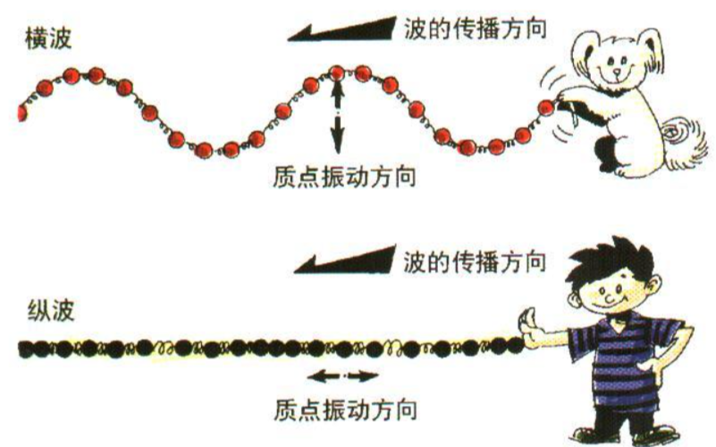

2. 瑞丽波和兰姆波

**体波：（p波和s波）**，频率更快，频率更高

p波：

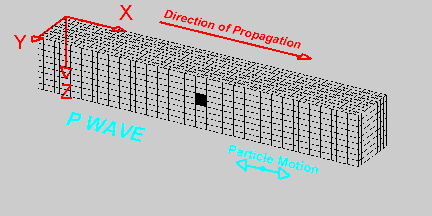

s波：

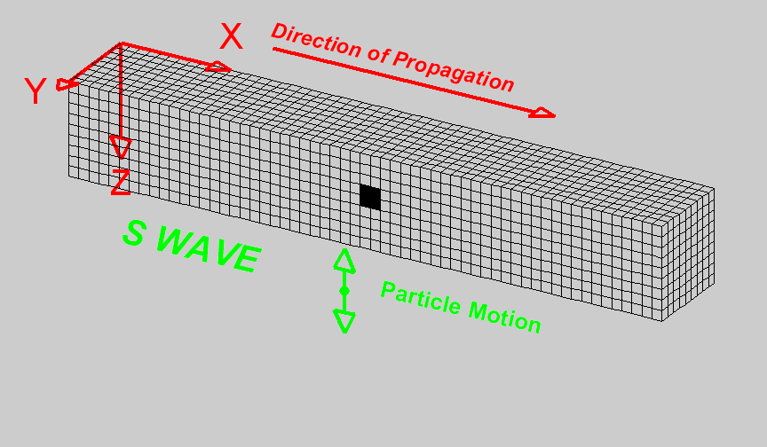

**面波（较慢，频率低）：**

love波：

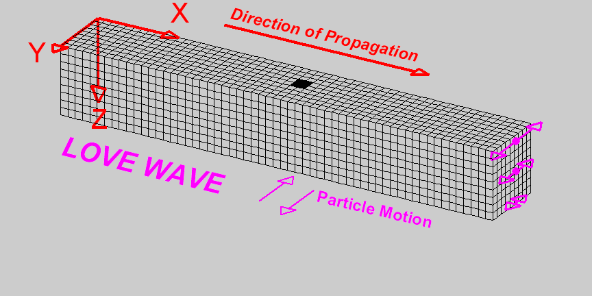

瑞丽波：

> 瑞利波沿着地面滚动，其运动比love波更复杂。虽然瑞利波看起来像海洋上的波浪一样滚动，但粒子运动与海浪相反。因为它滚动，所以它向上和向下移动地面，并向波移动的方向前进和向后移动。地震引起的大部分震动是由于瑞利波引起的，瑞利波可能比其他波大得多。像love波一样，波的振幅随着深度而急剧减小。在所有地震波中，瑞利波在时间上扩散得最多，在地震仪上产生较长的波持续时间。

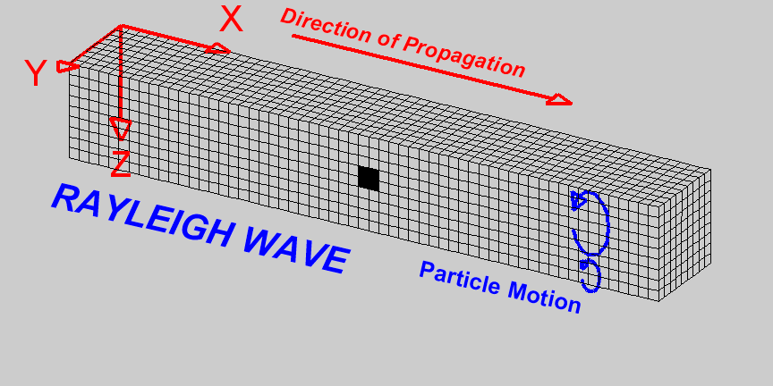

## 1.3.5  小信号近似

考虑一种相同性质的介质，平衡密度分别为ρ和p。随着声场的传播，介质的密度、压力和粒子速度会发生局部变化


## 1.6 反射&折射

**阴影效应：**在无线电波的传播路径上，遇到地形不平、高低不等的建筑物、高大的树木等障碍物的阻挡时，在阻挡物的背面，会形成电波信号场强较弱的阴影区，这一现象叫阴影效应，和可见光的阴影效应类似，只不过我们肉眼看不到。终端从无线电波直射的区域移动到某地物的阴影区时，接收到的无线信号场强中值就会有较大幅度的降低。


## 相控阵 超声控制

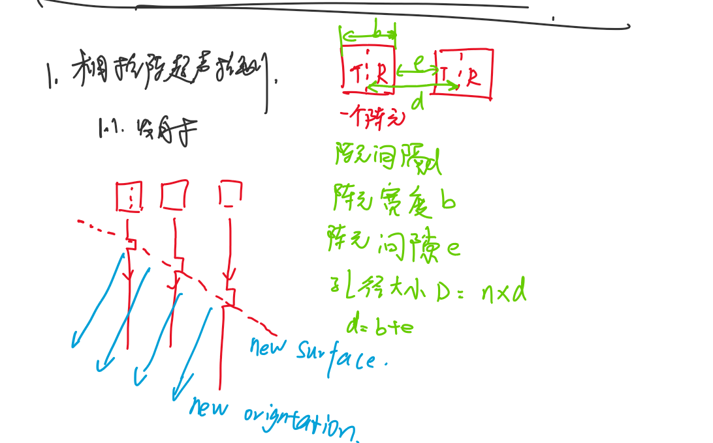

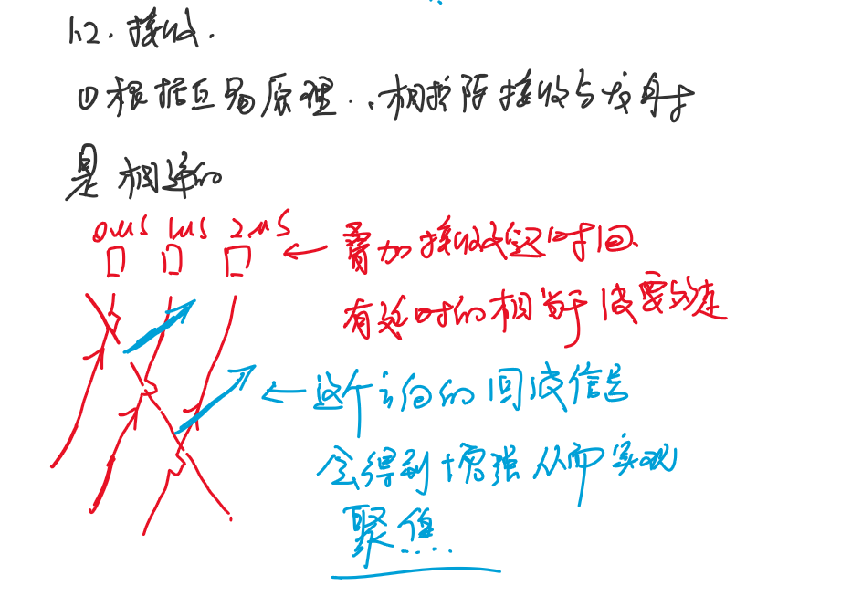

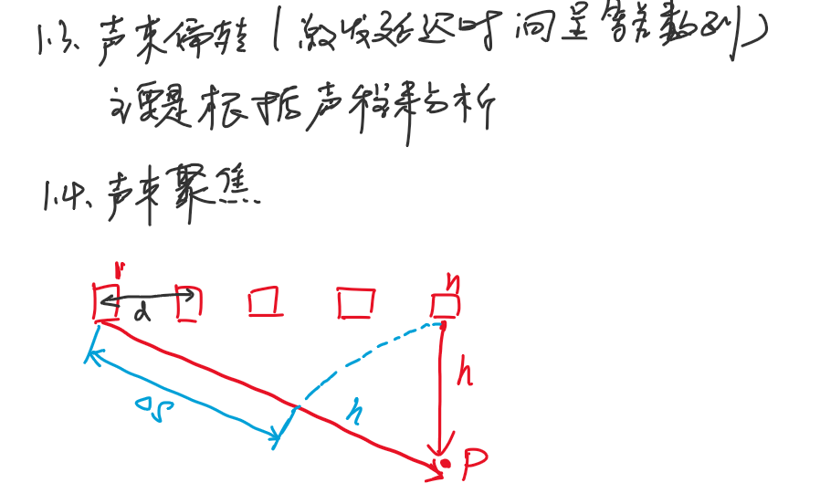

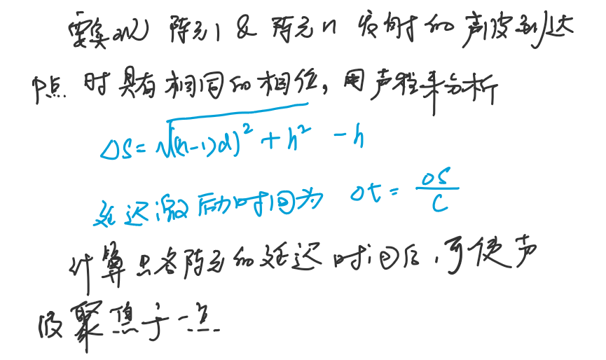

## b型超声

扫描线在一个平面上进行扩展，并将幅度调制映射为辉度调制。**显示的是实时切面图像**，真实性好，直观性好。

> a型超声：即幅度调制型，以波幅的高低表示反射信号的强弱，显示的是一种回声图
>
> 辉度调制：以亮度不同的光点表示接受信号的强弱。

# 超声波的基本概念

## 机械振动

**震动参数：** 

1. 周期：T
2. 频率：f=1/T
3. 相位：

**机械波**

**波长、频率、波速:**

1. 波长：同一波线上的震动相位相同的相邻两质点间的距离成为波长，用λ表示

2. 频率：波动过程中任一给定点在1s内所通过的完整波的个数，用f表示

3. 波速：单位时间内波动形式所传播的距离称为波速，用c表示
   $$
   c = \lambda*f
   $$
   

## 超声波分类

**根据质点振动方向：**

1. 纵波：**振动方向与波的传播方向相同**，凡是能承受拉伸或者压缩应力的戒指都可以传播纵波。固体可以承受拉伸应力、液体或气体不能承受拉伸应力，可以承受压缩应力，所以可以传播纵波。
2. 横波：振动方向和波的传播方向垂直，**只有固体才能承受剪切应力**，液体与气体不能承受剪切应力，所以**只有固体才能传播横波，气体或液体均不能**
3. 表面波：介质表面的质点做椭圆运动，椭圆的长轴垂直于波的传播方向，短轴平行于波的传播方向；
4. 板波

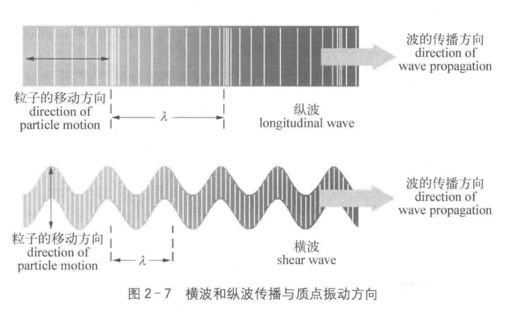

**根据波面分类，波阵面的形状：**

1. 平面波：波源是一个平面，振幅与距离无关
2. 柱面波：波源为一个直线，振幅与距离的平方根成反比
3. 球面波：波源为一个点，

**根据振动时间：**

1. 连续波：振源连续不断振动
2. 脉冲波：振源振动时间很短，间隙辐射的波称为脉冲波

## 超声波传播速度

**固体声速：**

**液体声速：**

**组织声速：**

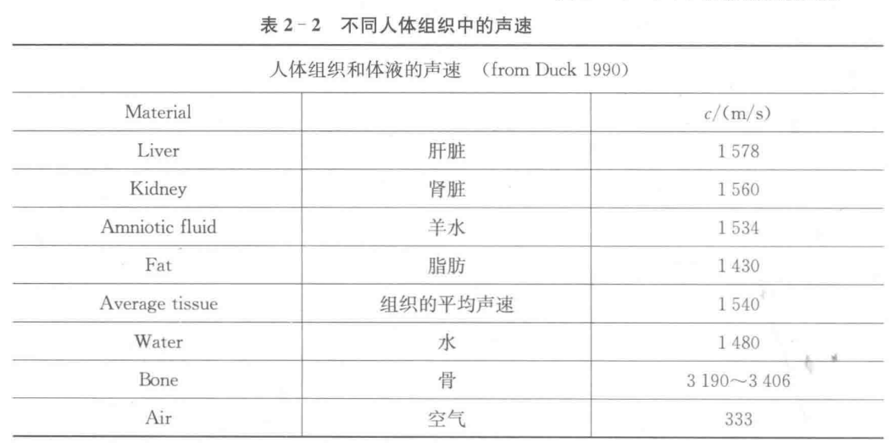


## 超声场的表征值

> 主要有：声压、声强、声阻抗

**声压：**超声场中某一点在某一瞬时所具有的压强$p_{1}$没有超声波传输时同一点的静态压强$p_{0}$之差，成为该点的声压

有效声压：声音在空气中传播时，压缩与稀疏交替变化，因此压强增幅时正负交替的，因此通常意义上的声压是有效声压，
$$
p_e=\sqrt{\frac{1}{T}\int_0^Tp^2dt}
$$
**声压级**：表示声压大小的指标

$$
L_p=20lg{\frac{p}{p_0}
}
$$
其中，Lp为声压级，p为声压，p0为基准声压，p0=2*10-5 pa

## 声阻抗、声阻抗率、声衰减系数

**声阻抗**：界面声压与通过盖面的声通量之比。
$$
Z_a=\frac{P}{U}=\frac{p}{vS}=R_a+jX_a
$$
其中，p是声压、U是体速度、v是质点的振动速度，S为面积

**声阻抗率**：介质中某点的声压与质点的振动速度称为声阻抗率，z或Z表示
$$
Z_a=\frac{p}{v}
$$
声阻抗率是复数，但是**对于无衰减的平面波，声阻抗率是一个与频率无关的实数**

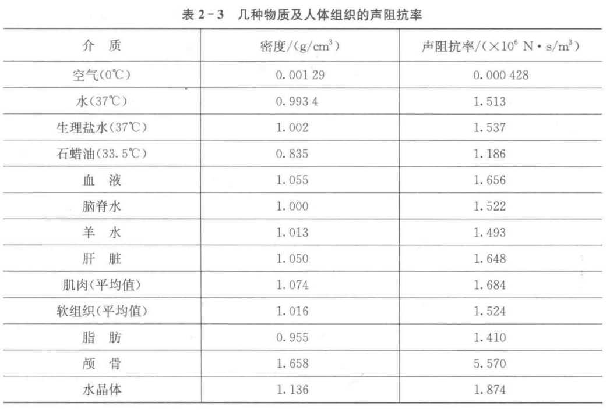

**声阻抗率的测量**

1. 密度测量法

   声阻抗率Z=密度*声速，质量由天平测量，体积由排水阀测量。声速查表

2. 垂直入射反射系数测量法

   通过测量平面超声波垂直入射条件下的反射系数，作图默认进行了全反射测量出p0=pr0。然后右图测量出prx。最后得出被测物的声阻抗率Zx

   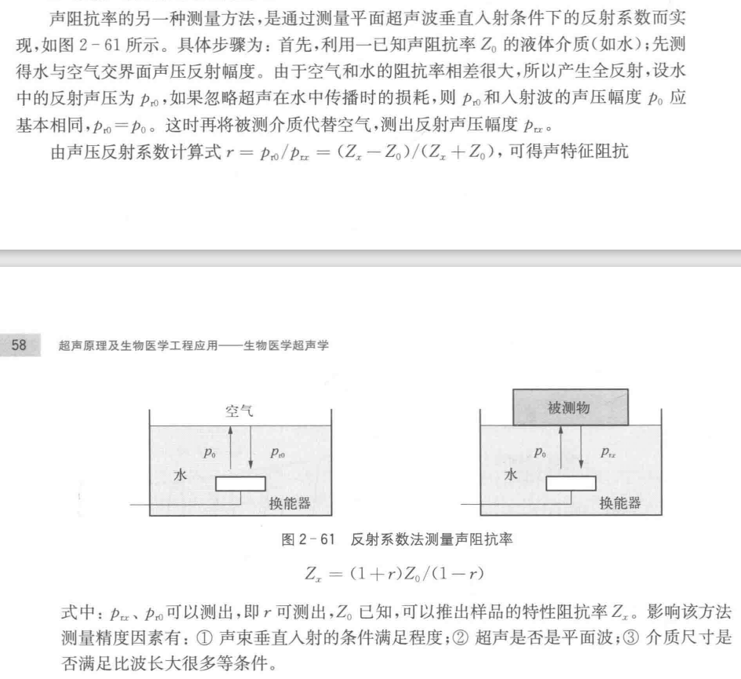

**声衰减系数**

定义中包含了传播距离，所以应当是衡量一段**声程**的指标

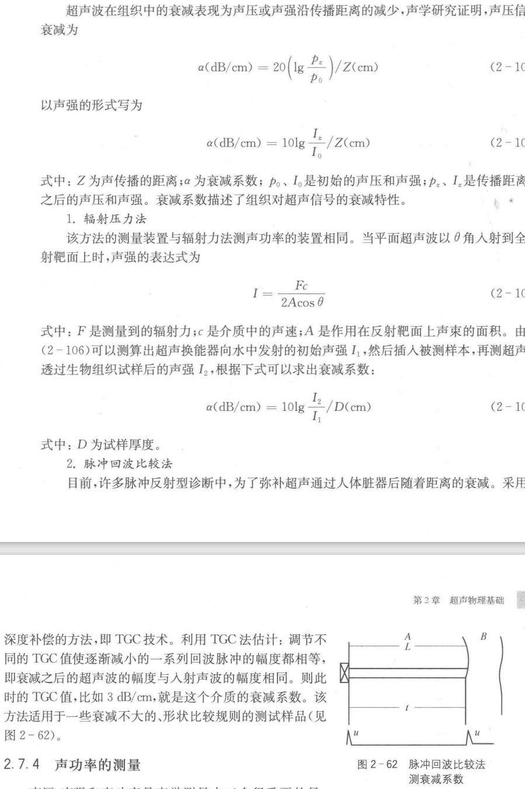

## 声强

单位时间内垂直通过单位面积的声能量
$$
I=\frac{1}{2}\rho cA^2\omega^2
$$
其中，$\rho$表示密度、A表示振源振幅、$\omega$表示振动角频率

## 脉冲波声强及计算

> 多数超声设备比如B超使用脉冲波，脉冲波声强在临床上地人体的健康意义重大

**脉冲声强的定义：**

空间峰值时间峰值声强·····等6种不同概念

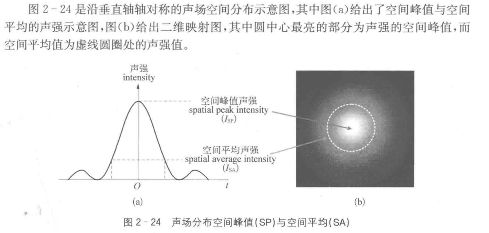

## 波动方程

> 1877年瑞利这个家伙就提出了声学理论？？？妈的理论都研究透了吗

一维平面波声压波动方程：
$$
\frac{\partial^2p}{\partial x^2}=\frac{1}{c^2}\frac{\partial^2 p}{\partial t^2}
$$
其中，p是声压，t是时间，x是一维空间坐标，c是声速

## 声波的反射、折射和投射

**超声波垂直入射到平界面上的反射与投射**


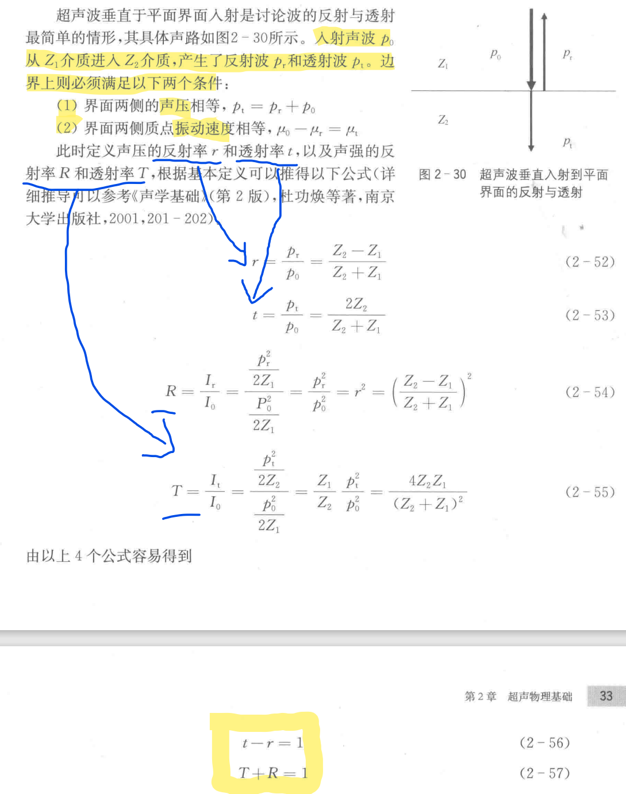


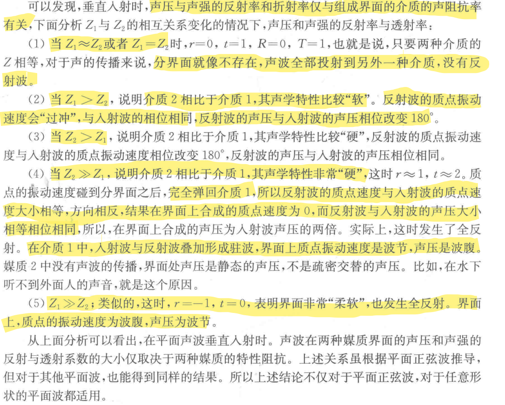


## 声波散射与多普勒效应

**声波散射**

介质表面粗糙、障碍物尺寸小（接近或小于超声波的波长），超声波作用在该类介质上反射、折射和投射理论不能适用。

超声在生物组织中的衰减主要由吸收和散射组成。


**散射参数**

1. 目标强度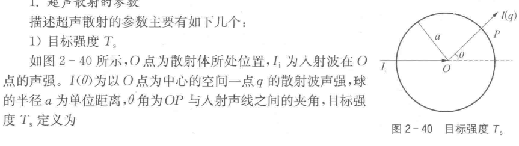
   $$
   T_s=I(\theta)/I_i
   $$
   
2. 散射截面

   定义为障碍物所产生的总的散射功率与入射声强之比。
   $$
   S=\frac{W_s}{I_i}
   $$
   其中Ws为总散射声功率，Ii为入射声强

3. 散射系数

   为散射波的声压与入射波声压之比

**散射分类**


# 超声换能器

## 概述

**概念**

换能器由点的储能元件和一个机械振动系统组成。

1. 用作发射器：电震荡信号引起换能器电储能元件电磁场变化，电磁场变化通过逆压电效应使得换能器机械振动产生振动
2. 用作接收器：压电效应

**分类**

1. 介质：液体介质、固体介质、等

2. 工作状态：接受型、发射型和收发两用型

3. 振动模式：剪切振动换能器、扭转振动换能器etc

4. 按照输入功率和工作信号：检测超声换能器、脉冲信号换能器、功率超声换能器、etc

5. 振子单元数：单元换能器、多元换能器（线阵、相控阵、方阵、凸阵）

   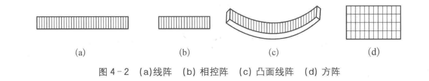

6. 声束特性：聚焦换能器（一维/二维聚焦）和非聚焦换能器。他们可以是电子聚焦或者声学聚焦

**单振元换能器**

匹配层（进行阻抗匹配，减少反射）使得更多的超声能量进入被测介质。

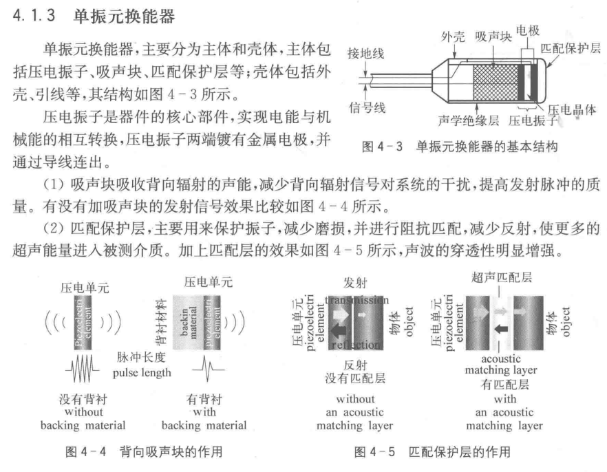

## 换能器性能指标

### 工作频率

**发射换能器工作频率等于他本身的谐振频率**，这样可以获得最佳工作状态，获得最大发射功率和效率。主动式超声换能器在接受状态时的工作频率与发射状态下的工作频率近似相等；而对被动式换能器而言，他的工作频率是一个较宽的接受频带，同时要求换能器自身的谐振基频要比接受频带的最高频率还要高，以保证换能器有平坦的接受响应

### 阻抗特性

换能器是一个机电四端网络，具有一定的特性阻抗和传输常数。

**换能器在电路上要求与发射机的末级回路和接收机的输入电路相匹配**。

计算出**换能器的等效输入电阻抗**非常重要

### 方向特性

### 频率特性及频带宽度

频率特性是指换能器的功率、声压、阻抗以及灵敏度等主要参数随频率变化的特性。

频带宽度Δf的含义是：对于换能器而言，换能器发送响应或接受灵敏度响应的曲线上声压低于最大响应3dB时两个频率之差，称为换能器的频带宽度Δf（-3dB）

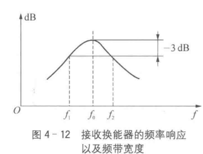

f0为最大响应时的频率，而频带宽度为Δf=f2-f1


## 换能器声场分析

## 平面原片换能器声场

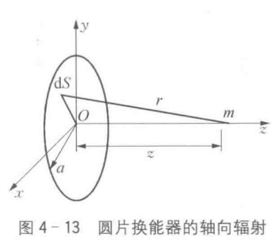

轴线上任一点的声压为：
$$
dp=-\frac{p_0dS}{r}sin(wt-kr)
$$
其中，r为任一点m至点源的距离；dS为点源面积；w为角频率；$k=\frac{2\pi}{\lambda}$ ，**λ为波长**；t为声波传输至m点所需时间。整个圆片产生的声场额可以看作各微小面元声场的叠加，故对整个圆片换能器在轴线上的任一点m的声压：
$$
p_z=\int_sdp=2p_0sin\{\frac{\pi}{\lambda}[(a^2+z^2)^\frac{1}{2}-z]  \}sin(wt-ka)
$$
其中，**a是圆片半径，**声压随时间做周期性变化。声压振幅为：
$$
p_m=2p_0sin\frac{\pi}{\lambda}[(a^2+z^2)^{\frac{1}{2}}-z]
$$
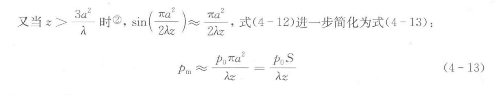

在z足够大时（z>3a^2/λ）时，圆片声场轴线上的声压随距离的增加而衰减。如4-14（b）曲线所示。

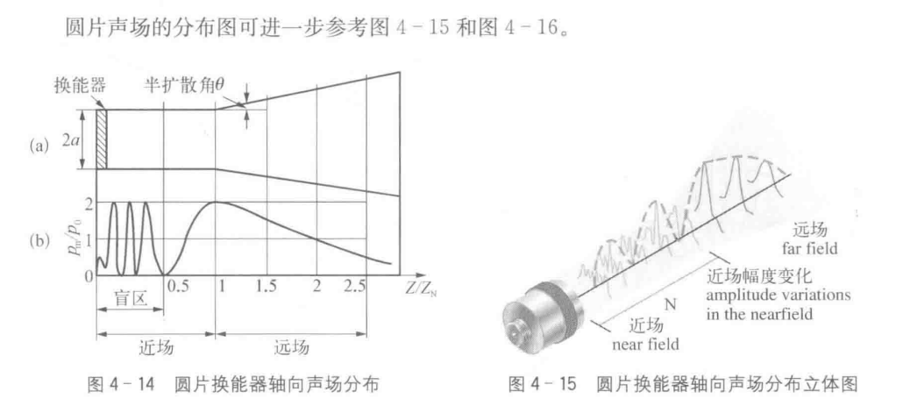

如图4-14所示：

- 当Z<ZN时，即曲线中所示的横轴小于1的部分，声压存在若干极大、极小值。**这些极值点是因为在靠近声源处，声源表面上各点状辐射源发射的声波传播到轴线上一点的声波程不同，波程（相位差）不同引起的波的干涉而成。**

- 最后一个极大值点的位置为
  $$
  Z_N=\frac{4a^2-\lambda ^2}{4\lambda}
  $$
  如果$a^2$>>λ，则表达式可以简化为：
  $$
  Z_N=\frac{a^2}{\lambda}
  $$

轴上最后一个极大值的位置Zn常被作为近场（Fresnel区）向远场（Fraunhofer区）过渡的起始点，**自$Z_N$开始，声束开始扩散，扩散角为：**
$$
\theta = arcsin(0.61\frac{\lambda}{a})
$$
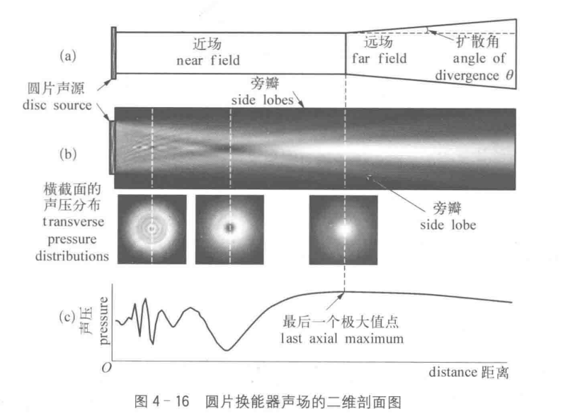

#### 声束指向性表达

1.指向性函数Ds

在换能器远场中，任意方向上的声压复制$P_{\theta r}$ 与最大方向上的声压幅值$P_{\theta_0}$之比，即：
$$
D_s=\frac{P_{\theta_r}}{P_{\theta_0}}
$$
2.波瓣图

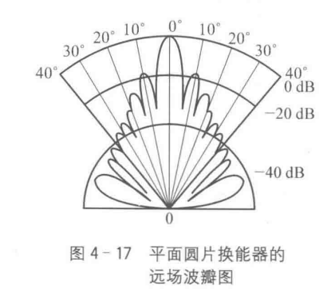


## 多元线阵换能器的声场

> 单阵元换能器主要探测声束轴向上各点组织的情况，也就是说获得的信息都是一维轴向的组织特征。

多阵元换能器的声场，仍可将各个阵元看成是由单个声源组成，然后将各声源的声场叠加。

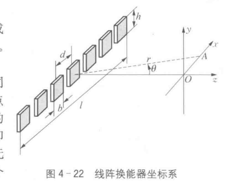

当线阵换能器各个阵元同时收到同一信号激励时，线阵阵元在空间任一点产生的声压是各个单元声源在A点产生的声压的叠加。

1. 声束指向性

   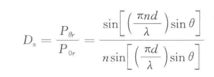

2. 主瓣、栅瓣的位置及消除栅瓣的条件

   换能器阵的指向性函数等于l的极角θl，所在的波束分别称为主瓣（l=0）和栅瓣（l=1，2，3，）。对于线阵，Ds出现极值的条件为：
   
   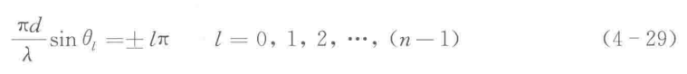
   
   其中l=0为主瓣，l=1，2，3为栅瓣。此时，Ds=1


## 相控阵换能器超声场

当相控阵换能器所有阵元同时受同一信号激励时，产生的主瓣声束与阵元面垂直，声束偏转角为0.


## 相控阵超声换能器原理

超声相控阵指的是将多个较小尺寸的探头有序排列成阵列，或是将一个大尺寸探头按照规则分割成许多独立的小单元探头，形成阵列探头。每个小探头具有独立的电子引线，称为阵元。相控系统可以独立控制各个阵元发射和接受超声波的精确延时，**使之干涉叠加形成所期望的波阵面，达到聚焦、线性扫描、扇形扫描等效果**。

常见的相控阵探头是在一个母晶片上分割出许多小晶片，各个小晶片由各自的称作“聚焦规则”的延时电路驱动。发射模块控制每个阵元发射信号的波形，延时等。


## 扫描模式

相控技术可以实现线性扫描 、扇形扫描和深度聚焦

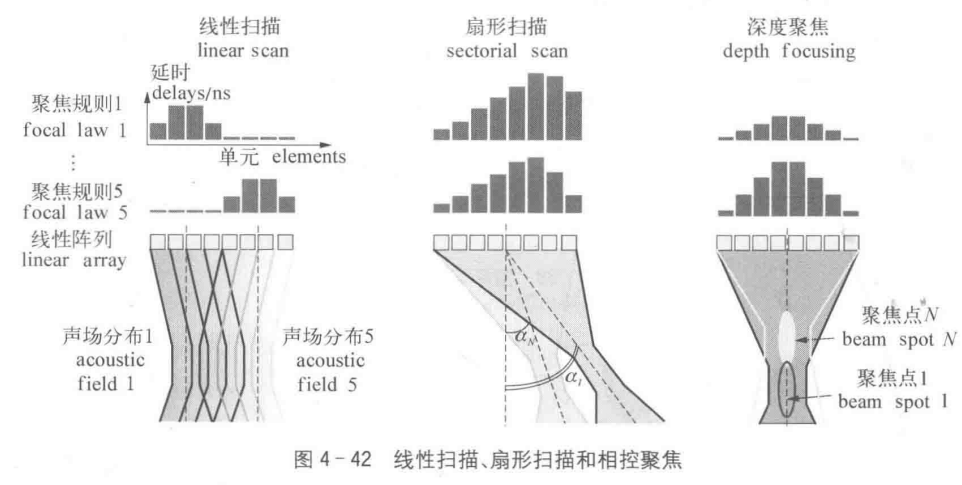

1. 线性扫描：若干阵元组成一组，从左到右，从最开始16个单元（1~16）开始工作，同时16个阵元内部采用聚焦演示策略，以增强横向分辨率；其他单元不工作，形成第一条扫描线（因为阵元很小，16个排在一起形成的波面可以看成扫描线，实现聚焦）

   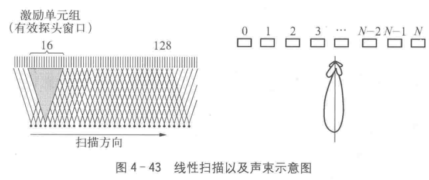

2. 扇形扫描（又称s扫描，方位扫描或角扫描）：相控电子扇扫，通过控制阵列不同阵元发射脉冲的相位（先后顺序），实现类似机械扇扫的功能。具体相位控制模式为：

   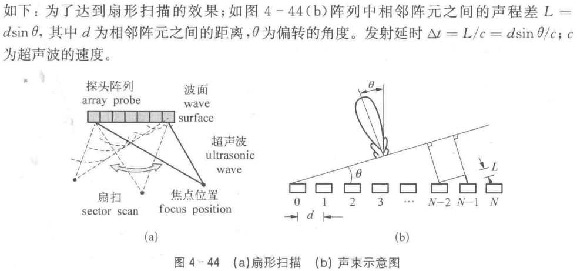


## 超声发射与接受电路

> 压电换能器驱动电路的设计，设计阻抗匹配，脉冲变压器设计、以及谐振变压器的相关内容。

国内压电华能其驱动电路：

1. 直接驱动：采用固定频率，通过触发大功率半导体开关器件，如场效应管、可控硅
2. 推挽电路驱动：采用固定频率的双极性脉冲，驱动推挽变压器工作，推挽变压器次级与压电换能器并联，采用电容、电感进行阻抗匹配。

### 直接驱动的超声发射电路

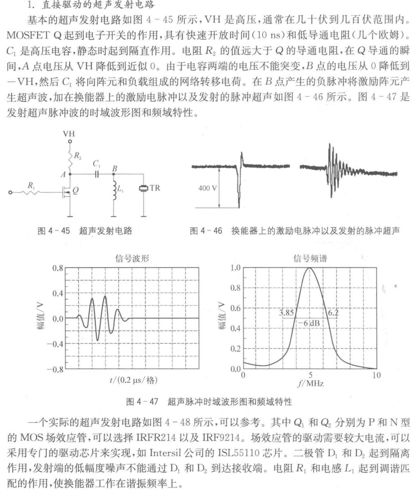

### 推挽驱动电路

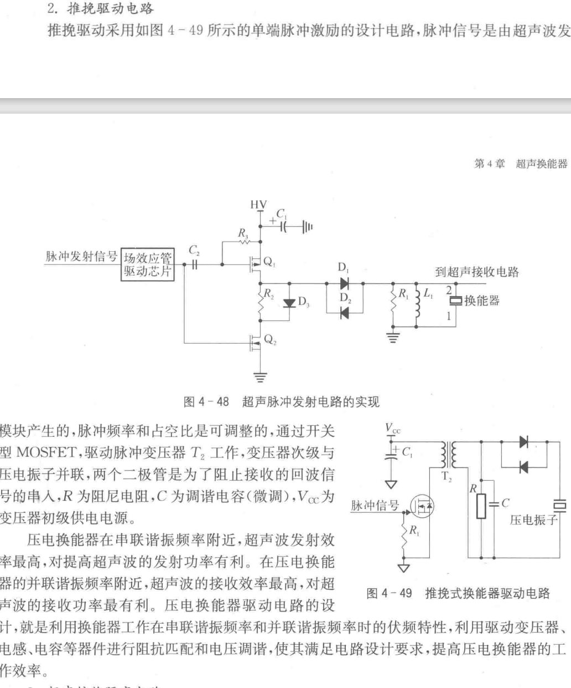

### 超声接受隔离电路

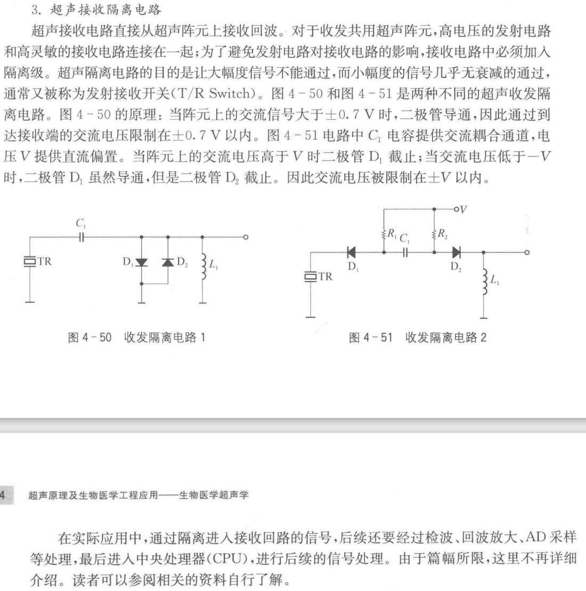


## 自聚焦超声声场模拟

> 目前广泛使用的聚焦方式：
>
> 1. 球面换能器自聚焦
> 2. 凹面镜聚焦
> 3. 相控阵聚焦
>
> 研究其焦点附近的声场可以判断聚焦方式的优劣
>
> 对焦点附近声场的仿真，可以获得焦斑的大小、旁瓣位置及强度等信息。

### 基本原理

步骤：

1. 瑞丽积分计算出换能器在某一点的声压大小，然后再算出相应的声强
2. 将声场空间中所有点的数据集中起来，得到**整个声场的声强值**，也就是声场分布。

### 瑞利积分

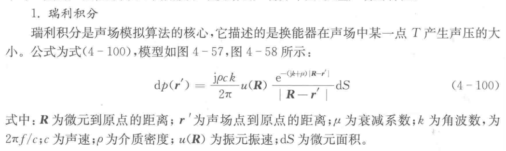


### 球面换能器

球面换能器一些参数会 影响到声场性质，比如开口半径大小，值越大，焦点处焦斑越小，声场的能量分布也集中。


## 脉冲回波超声成像系统

## 基本原理

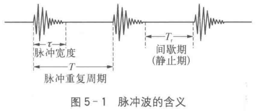

### 传播特性

超声在人体的衰减指的是超声在人体组织中传播时，声强会随着传播距离的增加而减小。衰减因素是：声束扩散，以及由于反射、散射等原因造成的声强度减弱；介质的吸收也会引起衰减（转热）。

深度补偿电路：（或时间增益控制电路），来补偿由于传输距离引起的衰减

### 声速特性

超声波在人体内大多数软组织中传播速度相差不大，超声波在人体组织中传播的声速，除了气质性脏器（肺：全是空气没有可以反射超声的介质）和骨组织外，几乎都在1540m/s。

脉冲回波超声成像系统中认为超声在人体中的传播速度是近似相同的。实际上的软组织声速差异小于等于5%

### 脉冲波特性

超声脉冲发射时间仅有几微秒。相对于脉冲持续时间，传播时间较长，有几百微秒的时间可以接受、放大和处理回波信号

### 反射及投射特性

超声在人体中传播时，**遇到不均匀界面/声阻抗不同就会反射**，从人体组织界面反射系数可知，大部分软组织声阻抗差异不是很大，只有小部分能反射，大部分声能穿过界面继续传播。


## A型超声工作原理

**A型超声**：amplitude modulation mode ，即幅度调制型超声。超声波束在人体组织中遇到不同声阻抗的两层临近介质界面，会在界面上产生反射，该反射回声会在屏幕上以幅度的形式显示。**界面两侧介质声阻抗越大，回波波幅越高**

### 触发信号发生器

> 也即 主控同步电路

同步电路产生一系列时间相等的触发脉冲，又称同步脉冲，去控制发射电路，扫描电路等，使整机协调工作。目前采用的是400-1000hz的重复频率，最低是50hz，提高重复频率可以增强荧光屏上的波形亮度，但重复频率过高，扫描时间就会变短，无法满足检测深度要求。

同步电路产生的同步触发信号分为4路：

1. 触发延时电路，进而触发超声脉冲的发射
2. 触发补偿电路，
3. 触发时标电路
4. 触发锯齿波发生器

### 延时电路

延时电路产生可变的延时，通常采用单稳态电路实现。如5-4 c所示

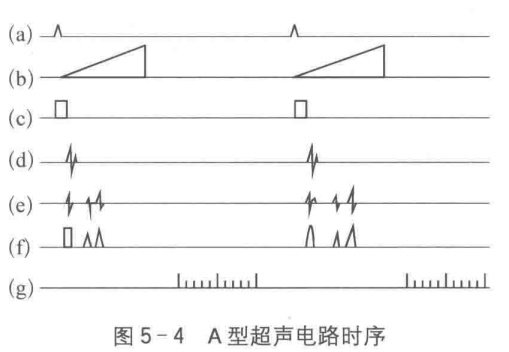

该电路的作用：

1. 调整始脉冲的位置，使之与时标对齐便于读数。单迹显示时，便于初始脉冲与时标对齐
2. 降低对增辉电路脉冲前沿的要求，且双通道时，可以调整起始波 位置

### 高频间歇振荡器（发射电路）

高频间歇振荡器在延迟了的同步触发信号的控制下，产生一个短促而且有**一定功率的高频脉冲，如图 5-4（d）**，这个高频脉冲会加到换能器上。高频振荡的频率在1~10MHz之间，产生一个持续时间0.1~1微秒的脉冲。每当同步触发脉冲到来一次，发射电路便发射一次高频振荡（脉冲），即产生幅度调制波。在此高频振荡电压激励下，探头产生一次超声振荡，进而产生超声波。我超，声！

### 接收通路（高频放大器，检波器，视频放大器）

换能器接收回波，并转换为电信号，回波信号相对微弱，需要送入高频放大接受电路进行放大，放大后信号如5-4e，经过检波器提取有用的包络信号（5-4f）。然后进行视频放大处理，变成有一定幅度的视频信号，加载至示波管的垂直偏转板，显示在荧光屏上。

### 时间增益补偿电路

超声回波信号的动态范围大，一般在100db以上，主要由两个因素造成：

1. 超声回波信号由于人体组织声抗不同产生，人体各组织界面声阻抗差异的大小，反射目标大小及不同取向等，使得回波信号的大小在很大范围内变化
2. 由超声传播的衰减引起，工作频率取2.5mhz，则超声波在人体内传播每厘米衰减2.5db。探测深度20cm的话单程衰减在50db，脉冲回波衰减双程在100db

时间增益补偿技术（TGC）：不同距离的回波目标，由于衰减引起的回波大小的差异，距离近用小增益，距离远用大增益，压缩了放大器输入信号的动态范围。

实现增益补偿的方式有：

1. 改变射频放大器上的反馈或者偏置
2. 射频放大器的增益保持一定，而在电路中串入电控衰减器
3. 将电控阻抗器作为射频放大器负载，改变射频放大器增益

### 扫描电路（锯齿波发生器）

锯齿波发生器产生锯齿波电压，送至示波管的x轴偏转板，产生扫描线5-4b

锯齿波的重复频率有主控电路决定。一般在400~1000hz范围。

锯齿波电压变化的快慢（斜坡速度）与探测深度相关。变化越慢，最大探测深度越深，变化越慢频率越低波长越长损耗越低距离越长。

## 数字B超声成像系统原理

## B型超声原理

B型超声（bright modulation）在A超的基础上发展而来。采用机械或电子在一个水平面扫描，形成多条扫描线。在扫描的过程中，换能器在不同的位置上发射超声脉冲，接受相应的回波信号，并将回波信号的幅度映射为辉度。

扫描线分为：有线形扫描和扇形扫描。

**线性扫描多用于无骨骼遮挡的腹部区域**

**扇形扫描可用于心脏等有骨骼遮挡的脏器**


## 关键技术指标与参数

探头标称工作频率在15mhz范围以内

### 性能指标和技术参数

**分辨力**：是指超声诊断仪对被检测组织相邻回声图的分辨能力，分纵向（深度方向）和横向（水平方向）分辨力

****


# 换能器特性

## NA

NA即numerical aperture，即数值孔径。分为物方数值孔径和像方数值孔径。

## F# 或 F-number

又叫做focal ratio，是relative aperture 的倒数，定义为：

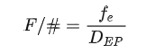

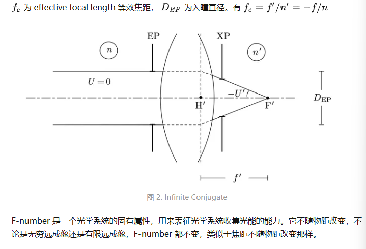

F-number 是一个光学系统的固有属性，用来表征光学系统收集光能的能力。它不随物距改变，不论是无穷远成像还是有限远成像，F-number 都不变，类似于焦距不随物距改变那样。

## 导纳图

通过换能器导纳曲线图就可以知道换能器的多项重要指标：

1. Fs[Hz]：是换能器的中心频率。
2. F1[Hz]和F2[Hz]：表示换能器的带宽范围，超声波换能器带宽范围为20001.8～20027.1Hz。
3. Qm：简称Q值，Q值越大换能器的灵敏度越高，后振时间越长；Q值越小换能器的灵敏度越低，后振时间越短。
4. Gmax[毫秒]：179.925995
5. R1[ohm]：最小阻抗，单位为欧姆。
6. Fp[Hz]：反共振频率，单位为赫兹。
7. Jeff：机电耦合系数
8. CT[nF]：单位是纳法拉，静态电容值。用于功率超声，如焊接、清洗，该指标用于匹配电感。、
9. C0[nF] 和 C1[nF]：将两者相加 = CT。
10. C0[nF]：自由电容。
11. C1[nF]：动态电容。用于[功率超声](https://www.made-in-hc.com/faq/ultrasonic_power)，如焊接、清洗，该指标用于匹配电感。
12. L1[mH]：电感值，单位为毫亨。
13. Zmax[kohm]：最大阻抗，单位为千欧。


## 机电耦合系数

机电耦合系数K是综合反映压电材料性能的参数，他表示压电材料的机械能于电能之间的耦合效应，高机电耦合系数意味着更有效的转化。

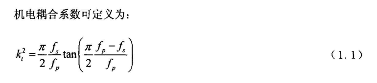

## KLM模型

等效电路模型，使用集中参数表示压电元件的电特性，用传输线方式表示机械结构的力学特性。

## 阻抗谱

给定一个交流电信号，其频率是变化的，观察被测器件的阻抗随着频率的变化特性

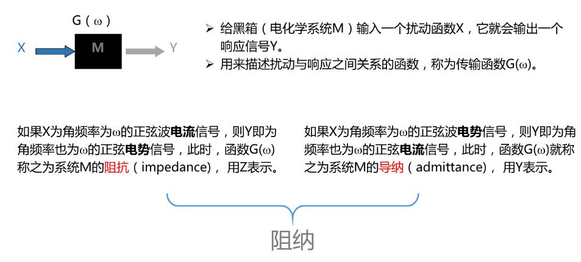

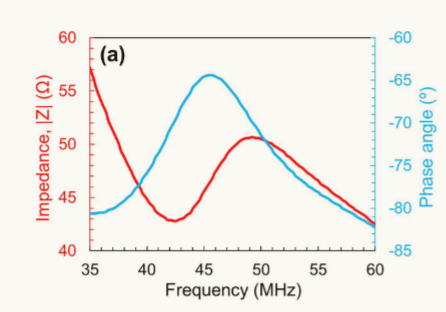

## 谐振频率与反谐振

把压电振子、讯号发生器和毫伏表串联起来，逐渐增加输入电压的频率，当外电压的某一频率使压电振子**产生谐振时，就发现此时输出的电流最大，而振子阻抗最小，常以fm表示最小阻抗（或最大导纳）的频率，被称为谐振频率**。当**频率继续增大到某一值时，输出电流最小，阻抗最大，常以fn表示最大阻抗（或最小导纳）的频率，被称为反谐振频率**，请参考图1。

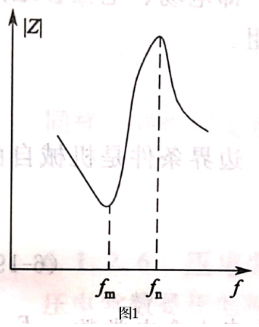

## 中心频率

换能器的中心频率的定义是超声波信号中能量最集中的频率部分。

换能器的中心频率决定了在应用中的检测能力和分辨率，一般：中心频率越高，检测能力越强，分辨率越低？

影响因素：超声波传播介质的声速，中心频率与介质的声速成正比，因此声速越高，中心频率也会响应增加，其次是几何结构和材料。

换能器的几何结构和材料决定了其**固有频率，即频率响应的峰值位置。**

## 谐振频率、反谐振频率、中心频率之间的关系

发射器的谐振频率fr设计在接近工作频率的应用的电信号,以优化发射效率

接收器的反谐振频率设计为接收的超声波频率，以优化接受效率

## 灵敏度

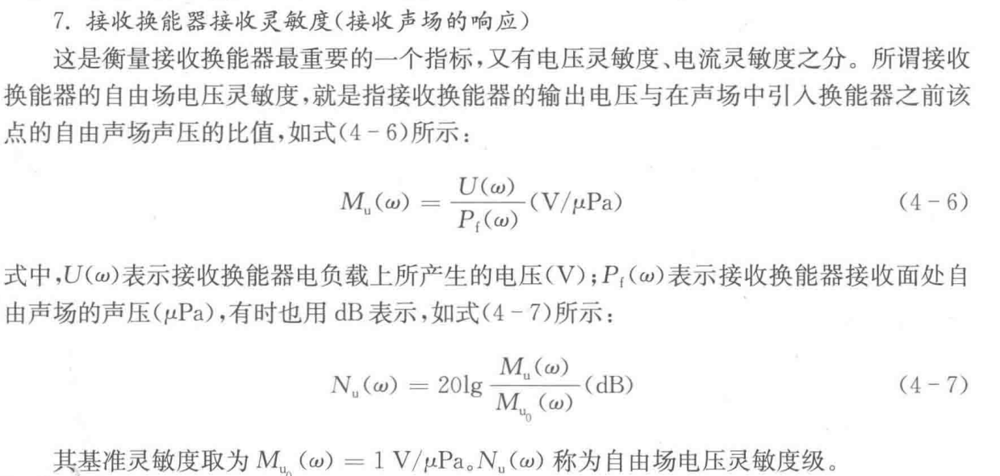


## 机械因子

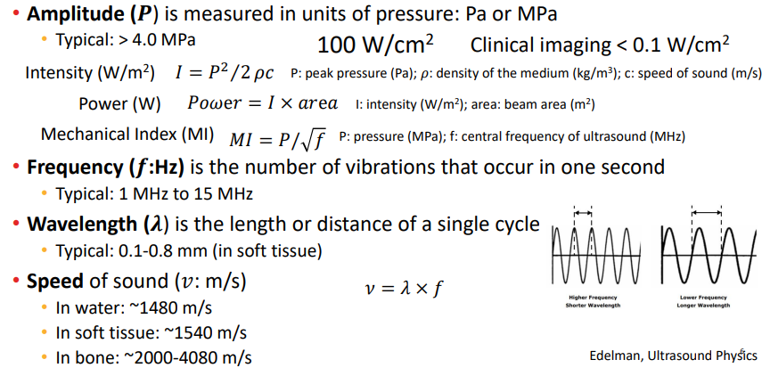


## 最大帧率

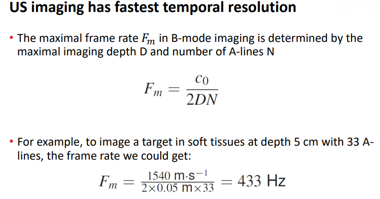

# HIFU

## 声强

单换能器使用的频率在0.5~10MHz之间，平均频率为1.5MHz。使用聚焦（铝透镜聚焦）时，每次的强度在$10^3-10^5W/cm^2$,持续时间为1~30s

hifu所基于的基本概念包括**传输频率**和**空间峰值时间平均强度（SPTA）**

**温度升高超过2℃将损害组织，该阈值在$100mW/cm^2$能量水平下实现**

> 除了热效应外，还有压力效应：
>
> - 声波在介质中传播时会产生压力变化，在这种情况下，介质就是组织。
>
> - 根据换能器的工作强度和频率，声波的幅度与增加对组织的压力直接相关。
>
> - 当声波的幅度/压力增加时，可能会发生瞬时空化，导致相当大的细胞破坏，**机械指数**应用于测量压力变得具有破坏性的阈值。cheng讲过，相当于是在频率基础上对峰值压力做归一化~毕竟1MHz的1Mpa和2MHz的1Mpa有区别.
>   $$
>   MI=\frac{P}{\sqrt{f}}
>   $$
>   


# 阻抗匹配

超声换能器的匹配技术主要包括**声学匹配和电学匹配**，对于大功率超声输出设备，电匹配更加重要

## 电学匹配原理

超声波换能器与驱动换能器工作的电信号功率源的电学匹配主要包括三个方面：

1. 阻抗匹配：通过阻抗匹配时功率源想换能器输出额定的电功率，功率源需要一个最佳负载才能输出额定功率；把换能器阻抗变换成最佳负载，就是阻抗匹配

2. 调谐匹配：通过调谐匹配使功率源输出功率最高，这是由于换能器不是纯电阻负载，换能器具有电抗的原因，造成工作频率上输出电压和电流之间有一定的相位差。从而使得输出功率得不到期望的最大输出，使发生器输出功率降低，因此在发生器输出端并/串联一个相反的电抗，使发生器负载变为纯电阻

   压电换能器有静电容$C_0$，磁致伸缩换能器有静电感$L_0$，在换能器谐振状态时，换能器上的电压$V_{RL}$与电流$I_{RL}$之间存在相位角θ，输出功率为P0=VRL×IRL×cosθ，由于theta的存在，输出功率达不到最大值，产生无功功率

3. 整形滤波：一般换能器工作在单一频率下，现代电子技术产生的信号是方波信号，富含丰富的谐波成分，实际电路中需要对这些谐波进行整形与滤波。

## 阻抗匹配网络（IMN impedance matching networks）

传统的IMN利用了与传输线一起沿着的元件，比如电容器、电感器、和变压器。

> L型电路是射频电路中常见的匹配网络，用于将信号源和负载之间的阻抗进行匹配，以实现最大的传输功率和最小的反射损耗。
>
> L型电路由一个电容和电感组成，串联或者并联，具体连接方式取决于需要匹配的阻抗差异。

大多数IMN具有固定的配置，并且每个IMN被设计为用于在目标频率附近工作的特定换能器。当IMN于为指定的换能器一起工作时或者换能器阻抗变化显著时，超声系统的效率可能受到影响。

宽带IMN的各种方案已经被用于超声成像应用，可以获得宽带宽信号以获得良好的轴向分辨率

传统的电压电流测量中，使用正弦信号来驱动传感器，然后换能器的电阻抗可以用电压/电流来确定，电压和电流可以在换能器的两端检测到。


## 史密斯图


# field ii

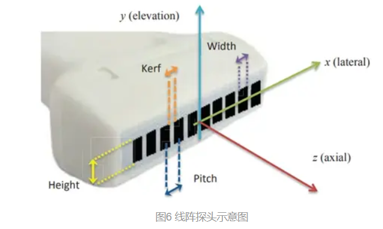

## 参数

```
c = 1540;                  % S声速
f0 = 2.5e6;                 % 换能器中心频率 [Hz]
fs = 100e6;                 % 采样频率 [Hz]
lambda = c/f0;               % 波长
element_height = 13/1000;       % 阵元高度 [m] (垂直方向)
element_width = 18.5/1000;      % 阵元宽度 [m] (方位方向)
kerf = 0;                  %阵元间隔
focus = [0 0 60]/1000;         % Fixed emitter focal point [m] (与单阵元换能器无关)
_elements = 1;               % 阵列中物理阵元的数量
N_sub_x = 1;                % x方向阵元的细分，即x方向子阵元数量
N_sub_y = 1;                % y方向阵元的细分，即y方向子阵元数量 作者：游龙戏猪0 https://www.bilibili.com/read/cv22017750/ 出处：bilibili
```

 

## 使用流程

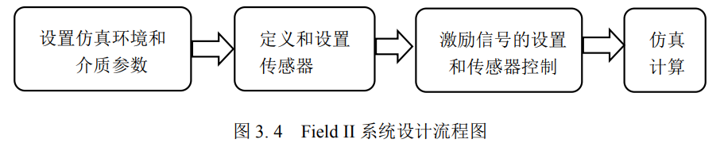

**初始化**

对采样频率、传感器阵元尺寸、声速等进行配置

介质中，与声场衰减有关的参数：频率相关衰减、频率无关衰减、扩散衰减（传播时发生扩散，造成声场幅度衰减，field只能设置剩下两个）

- xdc_linear_multirow  
- xdc_2d_array 可以设置传感器任意形状，可以用作同心圆环仿真


## field python

### 安装

**需要创建一个虚拟环境，然后再虚拟环境中创建执行这些命令**

**对于出现的module not found：**需要更新一下pip以及setuptools

```
python -m pip install --upgrade --force pip
pip install setuptools==57.5.0
```


### python env

matlab 2019 b 以及python3.7

```
conda create -n myenv python=3.7
conda activate myenv
```

### install pyfield

```
git clone https://github.com/bdshieh/pyfield.git
cd pyfield
pip install .
```

### install matlab engine api for python

```
cd $matlabroot/extern/engines/python/
python setup.py install
```

### example

```python
# import matlab.engine
from pyfield import PyField
import time
field = PyField()
field.field_init()
field.set_field('c',1500)
field.set_field('fs',100e6)
field.set_field('att',0)
field.set_field('freq_att',0)
field.set_field('att_f0',7e6)
field.set_field('use_att',1)
t = time.localtime()
print(t.tm_min,t.tm_sec)
th = field.xdc_linear_array(32,100e-6,0.01,10e-6,1,4,[0,0,30])
field.xdc_show(th)

t = time.localtime()
print(t.tm_min,t.tm_sec)
# for i in range(0,10000):
#     sir,sir_t0 = field.calc_h(th,[0,0,i/1000])
#     print(sir)
t = time.localtime()
print(t.tm_min,t.tm_sec)
```

# 信号处理

## SVD分解

svd分解可以将任何矩阵分解成**三个矩阵的乘积。**一个正交矩阵、一个对角矩阵（包含奇异值）、一个正交矩阵的转置。在超声成像中，可以分离微泡信号和管壁回声。

1. **信号与噪声的分离**：在超声成像中，微泡信号通常与背景噪声（如管壁回声）混合在一起。SVD能够识别并分离出数据中的主要成分，这些成分对应于不同的奇异值。微泡信号通常与较大的奇异值相关联，而噪声则与较小的奇异值相关。
2. **数据压缩与降维**：SVD可以减少数据的维度，通过保留较大的奇异值和对应的奇异向量，可以有效地压缩数据，同时保留大部分的信息。在超声成像中，这意味着可以去除噪声，同时保留微泡信号的关键特征。
3. **信号增强**：通过选择适当的奇异值阈值，可以过滤掉噪声，只保留信号。这种方法可以增强微泡信号，使其在成像中更加明显。
4. **模式识别**：SVD可以帮助识别数据中的模式，这对于区分微泡和管壁回声特别有用。微泡在超声图像中表现为特定的模式，这些模式可以通过SVD分析来识别和提取。

## 相干合成

 相干合成（Coherent Compounding）是一种在超声成像中常用的信号处理技术，它通过合并来自不同角度或位置的超声信号来提高成像质量。这种方法的核心思想是利用多个独立的超声波束在不同角度上对同一区域进行扫描，然后将这些波束的回声信号进行合成，以增强图像的细节和对比度。

在超声成像中，每个超声波束都会产生一个回声信号，这些信号包含了目标区域的信息。由于超声波在传播过程中会受到散射和反射，单个波束的成像可能会受到噪声和分辨率的限制。相干合成通过以下步骤来改善成像：

1. **多角度扫描**：使用超声探头从多个角度发射超声波，并对目标区域进行扫描。

2. **信号采集**：在每个角度，探头接收回声信号，并记录下来。

3. **信号处理**：对收集到的信号进行处理，如滤波、放大等，以优化信号质量。

4. **相干合成**：将来自不同角度的信号进行相位调整，使得它们在合成时能够相互增强。这通常涉及到对信号进行时间延迟调整，以确保所有信号在合成时能够相干叠加。

5. **图像重建**：将调整后的信号相加或平均，形成最终的合成图像。这样，图像中的噪声被平均化，而信号得到增强，从而提高了图像的整体质量。

在3D超分辨率超声成像中，相干合成特别有用，因为它可以结合来自多个平面波的回声信号，以生成更详细的3D体积图像。这种方法有助于克服单个平面波成像的局限性，如分辨率不足和深度方向上的模糊。通过相干合成，可以实现更清晰的微血管结构可视化，这对于诊断和研究微循环具有重要意义。


## ASAP

 ASAP（Acoustic Sub-Aperture Processing）方法是一种用于超声成像的技术，它通过分析和处理来自超声探头的子孔径（sub-aperture）数据来提高成像质量。这种方法特别适用于提高超声图像的空间分辨率，尤其是在超分辨率成像（super-resolution imaging）中，它可以帮助实现比传统超声成像更高的分辨率。

在ASAP方法中，超声探头的每个元素都被用作一个独立的子孔径，这些子孔径的数据被分别处理。然后，这些处理后的数据被结合起来，以生成最终的超声图像。这种方法的关键优势在于：

1. **提高分辨率**：通过分析每个子孔径的数据，ASAP能够揭示更细微的结构细节，从而在成像中实现更高的空间分辨率。

2. **增强信号**：ASAP方法可以增强来自微泡或其他散射体的信号，这对于观察血流和微血管结构特别有用。

3. **减少噪声**：通过优化子孔径数据的处理，ASAP有助于减少图像中的噪声，提高信噪比（SNR）。

4. **灵活性**：ASAP方法可以适应不同的成像条件和需求，例如，可以通过调整子孔径的大小和数量来优化成像性能。

在文档中提到的研究中，ASAP方法被用于离线结合两个探头的数据，以生成3D超分辨率图像。这种方法通过处理和结合来自两个不同探头的子孔径数据，实现了信号噪声比（SNR）的提升（2.9–5.1 dB），从而提高了成像质量。


## 点扩散函数

 超声的点扩散函数（Point Spread Function, PSF）是描述超声成像系统中单个点源（如微泡）在成像过程中如何被系统响应并最终呈现在图像上的数学模型。PSF是评估超声成像系统性能的重要参数，它反映了系统的空间分辨率和成像质量。

在理想情况下，如果超声系统能够完美地成像，那么点源在图像上应该表现为一个理想的点，即没有扩散。然而，在实际的超声成像过程中，由于多种因素（如衍射、散射、吸收、探头的几何形状、电子元件的噪声等），点源在图像上会呈现出一定的扩散，形成一个模糊的区域。这个扩散的区域就是PSF。

PSF的主要特征包括：

1. **全宽半高（Full Width at Half Maximum, FWHM）**：这是PSF在水平和垂直方向上宽度的一半处的值，是衡量分辨率的一个常用指标。FWHM越小，表示系统的空间分辨率越高。

2. **侧瓣（Sidelobes）**：PSF中除了主瓣（主峰）之外的其他峰值，它们代表了系统对非目标区域的响应。侧瓣越低，意味着系统对非目标区域的干扰越小。

3. **主瓣形状**：PSF的主瓣形状可以是高斯型、兰伯特型或其他形状，这取决于超声系统的成像特性。

在超声成像中，PSF对于评估成像系统的性能至关重要，因为它直接影响到图像的细节和对比度。在超分辨率成像技术中，目标是实现比传统超声成像更小的PSF，从而提供更清晰的图像。在文档中提到的研究中，通过使用2D稀疏阵列和超分辨率处理方法，研究者们成功地实现了比传统超声成像更小的PSF，从而提高了微血管结构的可视化质量。

## 延迟叠加算法（DAS）

延迟叠加波束形成（delay and sum beam forming，DAS），由于超声声场个阵元子场相干叠加会产生-13dB的旁瓣，使得主瓣宽度增加，图像的空间分辨率降低。


# k wave

## python 安装

创建一个虚拟环境，安装kwave

```
pip install k-wave-python
```

## 输入结构

### kgrid

定义了计算格点的属性，格点是为了便于模拟。将连续的介质空间离散化的产物，kgrid将连续介质均匀分成一个个格点。

```
% create computational grid for a 2D simulation
kgrid = makeGrid(Nx, dx, Ny, dy);
```

**其中Nx、Ny是对应维度上网格点的数量，dx、dy是网格点的空间尺寸**，则 kgrid 在x方向上的实际尺寸应为kgrid.x_size = kgrid.Nx * kgrid.dx。

需要注意的是，生成的kgrid中默认包含一个PML（perfectly matched layer）层，该层位于网格点的内部边界，声波传播到PML层时会被全部吸收。二维的kgrid中PML层宽度为20个网格点，三维为10个网格点，模拟时注意不要将声源或是传感器放置在PML层内，否则会发生难以解释的现象。也可以在模拟时通过将 ‘PMLInside’ 选项设置为 false 来使PML层位于网格点外部，这样就可以不用考虑边界问题了。
在 kWaveGrid 对象被创建后，唯一可以调整的参数只剩下**kgrid.t_array，它描述的是模拟的时间值数组，在不指定的情况下会自动设置。默认情况下，模拟的总时长为声波以最小声速穿过最长网格对角线所需的时间**，而时间步长基于CFL数（默认为0.3）和介质的最大声速，公式为kgrid.dt = CFL*dx_min/c0_max。

### medium

medium定义了每一个网格点处的介质属性。可以被定义的参数共有五个，分别是等熵声速（sound_speed）、环境质量密度（density）、非线性参数（BonA）、幂律吸收系数或前因数（alpha_coeff）和幂律吸收指数（alpha_power）

除了 alpha_power 参数必须是一个标量外，其余属性既可以是标量（介质为均匀同质时）也可以是矩阵（介质为非同质或不均匀时）

### source

source 结构定义了介质中的声源，k-Wave中共有三种可以使用的声源

- 第一种是初始声压分布，即在仿真开始前在网格中某个区域设置一个初始声压脉冲，使用预设函数可以很方便地画一些几何图形，比如二维网格中可以用 makeDisc 画实心圆，makeCircle 画圆圈，三维网格中则为 makeBall 和 makeSphere。以下代码在三维网格中定义了一个球形的初始声压。

  ```
  % define an initial pressure distribution using makeBall
  source.p0 = makeBall(Nx, Ny, Nz, Nx/2, Ny/2, Nz/2, radius);
  
  ```

  

- 第二种是声压随时间变化的声源。该类型声源需要两个输入参数，一是声源的网格点位置，二是声源声压随时间变化的函数。声源的网格点位置使用二值的矩阵来表示（1表示声源点，0表示非声源点），该矩阵应与kgrid具有相同的尺寸，保存在 source.p_mask 中。输入信号可以为一维数组（长度为kgrid.Nt，记录每个时间点的声压强度，并被所有的声源点使用），也可以为二维矩阵（分别设置每一个声源的声压，每一列为一个声源的声压）。

- 第三种声源按我个人的理解是在第二种声源的基础上，可以定义不同方向的声压强度。利用source.u_mask定义声源的网格点位置，然后用source.ux，source.uy 和 source.uz 定义不同方向的声压强度

  ```
  % define the source mask to be a line across the top of the grid
  source.u_mask = zeros(Nx, Ny);
  source.u_mask(1, :) = 1;
  
  ```

  

### sensor

sensor 定义了传感器相关的属性，仿真时，传感器会记录该处在每一个时间点的声压强度。传感器在网格点中的位置使用 sensor.mask 来定义（需要与 kgrid 尺寸相同），以下是一些示例。

```
% define a 2D binary sensor mask in the shape of a line
x_offset = 25; % [grid points]
width = 50; % [grid points]
sensor.mask = zeros(Nx, Ny);
sensor.mask(x_offset, Ny/2 - width/2 + 1:Ny/2 + width/2) = 1;

% define a 2D binary sensor mask in the shape of an arc using makeCircle
x_pos = Nx/2; % [grid points]
y_pos = Ny/2; % [grid points]
radius = 20; % [grid points]
arc_angle = pi/2; % [radians]
sensor.mask = makeCircle(Nx, Ny, x_pos, y_pos, radius, arc_angle);
```

也可以用坐标的方法来定义，默认与 kgrid 尺寸相同。

## python example

仿真任意位置的阵元

**参数定义：**

```
    c0 = 1500  // 声速 m/s
    rho0 = 1000  // 水的密度
    source_f0 = 1e6
    source_amp = 1e6
    source_cycles = 5
    source_focus = 15e-3
    element_num = 10   // 阵元数
    element_width = 1e-3  // 阵元宽 m
    element_length = 1e-3 // 阵元长 m
    element_pitch = 2e-3  // pitch
    translation = kwave.data.Vector([5e-3, 0, 8e-3])  // 确定阵列位置
    rotation = kwave.data.Vector([0, 20, 0])  // 确定阵列的旋转
    rotation_0 = kwave.data.Vector([0,0,0])  //
    grid_size_x = 40e-3    // 划分网格 x上尺寸
    grid_size_y = 20e-3    // 同上
    grid_size_z = 40e-3    // 同上
    ppw = 3
    t_end = 30e-6          // 仿真结束时间
    cfl = 0.5
```

**网格参数定义：**

```
    # GRID
    dx = c0 / (ppw * source_f0) // 0.0005
    Nx = round(grid_size_x / dx) // 80
    Ny = round(grid_size_y / dx) // 40
    Nz = round(grid_size_z / dx) // 80
    kgrid = kWaveGrid([Nx, Ny, Nz], [dx, dx, dx])
    kgrid.makeTime(c0, cfl, t_end)
```

- dx为网格的步长，也就是一个网格的大小

- Nx,Ny,Nz为三维网格的网格数

- kgrid为网格变量

  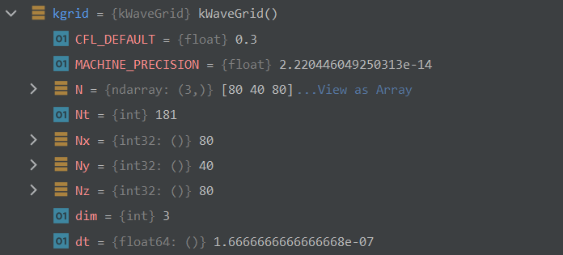

**源定义，也就是声源：**

我焯，原！

```
   # SOURCE
    if element_num % 2 != 0:
        ids = np.arange(1, element_num + 1) - np.ceil(element_num / 2)
    else:
        ids = np.arange(1, element_num + 1) - (element_num + 1) / 2

    time_delays = -(np.sqrt((ids * element_pitch) ** 2 + source_focus ** 2) - source_focus) / c0
    time_delays = time_delays - min(time_delays)

    source_sig = source_amp * tone_burst(1 / kgrid.dt, source_f0, source_cycles,
                                         signal_offset=np.round(time_delays*0 / kgrid.dt).astype(int))
    karray = kWaveArray(bli_tolerance=0.05, upsampling_rate=10)

    for ind in range(element_num):
        x_pos = 0 - (element_num * element_pitch / 2 - element_pitch / 2) + ind * element_pitch
        karray.add_rect_element([x_pos, 0, kgrid.z_vec[0][0]], element_width, element_length, rotation)

    karray.set_array_position(translation, rotation)
    source = kSource()
    source.p_mask = karray.get_array_binary_mask(kgrid)
    # voxel_plot(np.single(source.p_mask))
    source.p = karray.get_distributed_source_signal(kgrid, source_sig)
```

- time_delays表示每个阵元的时间延迟，通过聚焦点与阵元的位置计算

- source_sig表示每个阵元施加的激励脉冲，使用`signal_offset`表示每个阵元的延迟。

- karray，实例化一个KWaveArray的类

- for循环表示将**阵元添加到karray对象中**

- karray.set_array_position，设置**整个阵列**的位置和旋转

- source，实例化一个KSource对象，表示为阵元施加的激励源，需要指定`kgrid`以及信号`source_sig`

- source.p_mask，表示变压力源的二进制位置矩阵，其大小取决于`kgrid`，每一个元素为bool型。

  **0为非声源点，1为声源点**。由于是跟kgrid同步的，所以是一个三维数据。

  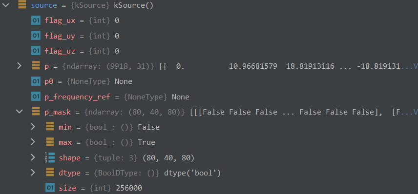

  如下图所示，在pmask[12]的地方，有很多声源点。

  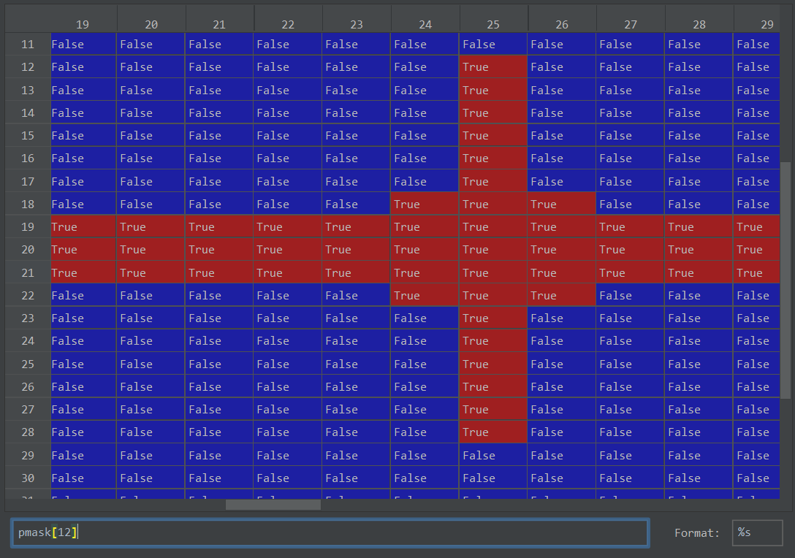

- source.p 对于`source.p_mask`给出的声源点，给出**随时间变化的压力值**。这里由`source_sig`负责指定（就是那个计算激励延迟的变量，这里就要负责声源的变化啦~）

  然后！我们先看`source.p_mask`中的非零点，也就是**声源点的数量**：

  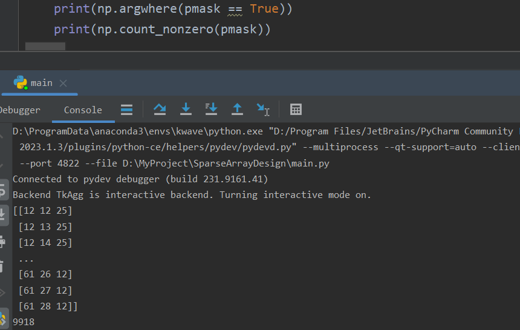

  一共有9918个点。

  然后再看`source.p`葫芦里卖的什么药：

  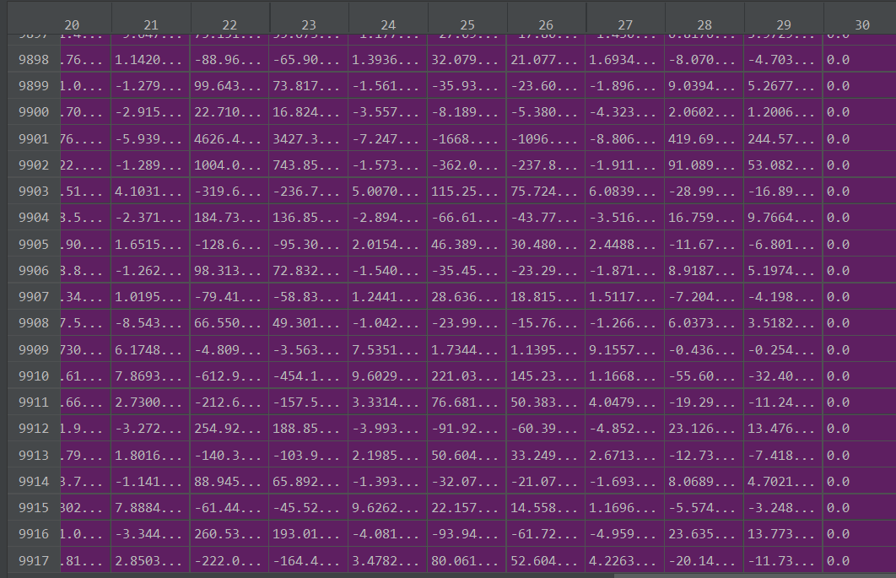

  很明显，这是一个高9918（从0开始的），长31的数组，那么**每一行表示这个声源的声压变化情况**


**介质参数定义：**

```
    medium = kWaveMedium(sound_speed=c0, density=rho0)
```


**传感器参数定义，也就是测量点：**

```
   # SENSOR
    sensor_mask = np.zeros((Nx, Ny, Nz))
    sensor_mask[:, Ny // 2, :] = 1
    sensor = kSensor(sensor_mask, record=['p_max'])
```

- 首先定义一个（NX,NY,NZ）也就是网格大小的数组
- 然后将所有的x点，所有的z点，Ny/2处的地方设置为测量点
- 使用kSensor设置一个sensor传感器，进行测量，record表示测量最大声压

**开始仿真：**

```
    simulation_options = SimulationOptions(
        pml_auto=True,
        pml_inside=False,
        save_to_disk=True,
        data_cast='single',
    )

    execution_options = SimulationExecutionOptions(is_gpu_simulation=True)

    sensor_data = kspaceFirstOrder3DC(kgrid=kgrid, medium=medium, source=source, sensor=sensor,
                                      simulation_options=simulation_options, execution_options=execution_options)

    p_max = np.reshape(sensor_data['p_max'], (Nx, Nz), order='F')

    # VISUALISATION
    plt.figure()
    plt.imshow(1e-6 * p_max, extent=[1e3 * kgrid.x_vec[0][0], 1e3 * kgrid.x_vec[-1][0], 1e3 * kgrid.z_vec[0][0],
                                     1e3 * kgrid.z_vec[-1][0]], aspect='auto', cmap=get_color_map())
    plt.xlabel('z-position [mm]')
    plt.ylabel('x-position [mm]')
    plt.title('Pressure Field')
    plt.colorbar(label='[MPa]')
    plt.show()
```


## B  mode成像
