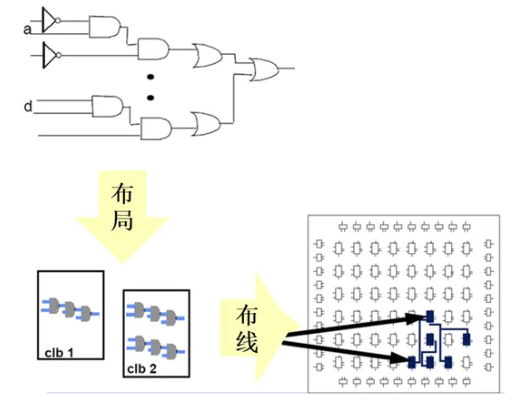

# Basic

## 界面

-  source：工程数据文件窗口，可以看到工程的层次结构
- project summary：主工作窗口，根据不同的layout有不同的显示内容

## hello world

###  创建项目

1. create new project

2. 写project name ,标记**create project subdirectory**，防止子文件夹把其他的给覆盖了

3. RTLproject

4. 不用添加约束及源文件

5. 选择板子型号

   Z7-Lite7010选择：

   - family：zynq-7000
   - package：clg400
   - 速度等级：1

6. 最左侧的`FLOW NAVIGATOR`中包含了项目所需要的设置、综合、运行、打开硬件管理器等功能.

   - project manager中包含了添加**源文件**，比如添加管脚约束、verilog源文件等

     

   - Synthesis表示综合，**将高级抽象层次的电路描述转换为较低层次的描述。**也就是将语言描述的电路逻辑转换为**与门、或门、非门、触发器**等基本逻辑单元的互联关系。如下图的四选一电路：

     

   - implement表示**实现**，implementation是一个place和route的过程，也就是布局布线。综合后的门级网表只是表示了门与门之间的虚拟连接关系，并没有规定每个门的位置以及连接线的长度等。布局布线就是一个将门级网表中的门的位置以及连线信息确定下来的过程

     

     FPGA中包含众多的**可配置逻辑块（CLB）、丰富的布线资源以及其他资源**

     - 布局：将门级网表中的每一个门“放置”到CLB中，这是个映射的过程。
     - 布线：利用FPGA中的丰富的布线资源将CLB根据逻辑关系连接在一起的过程

   - project  and debug：包括generate bitstream，即生成字节流

7. 下载到板子

   点击`open hardware manager`，`open target`，`Auto Connect`

   

### v代码

### 管脚约束