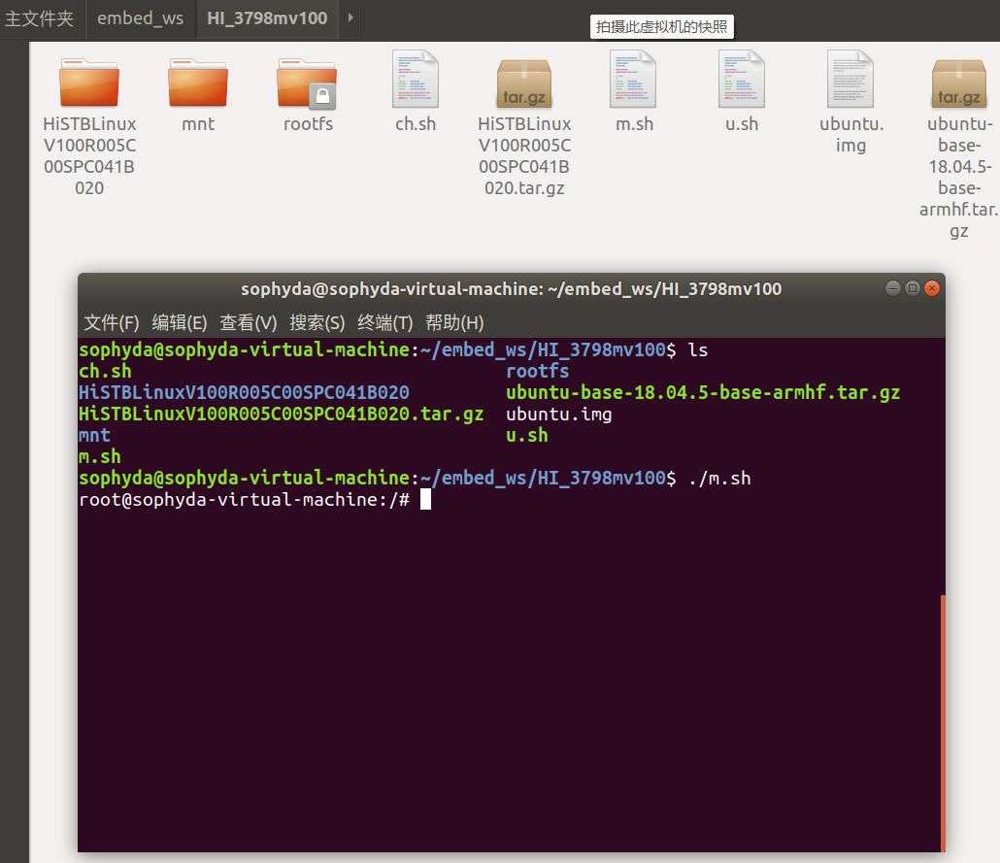
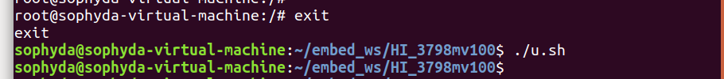
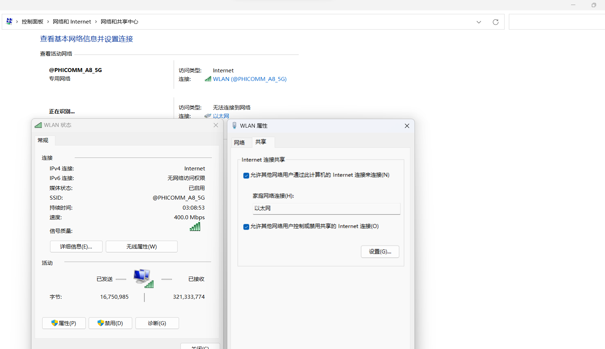
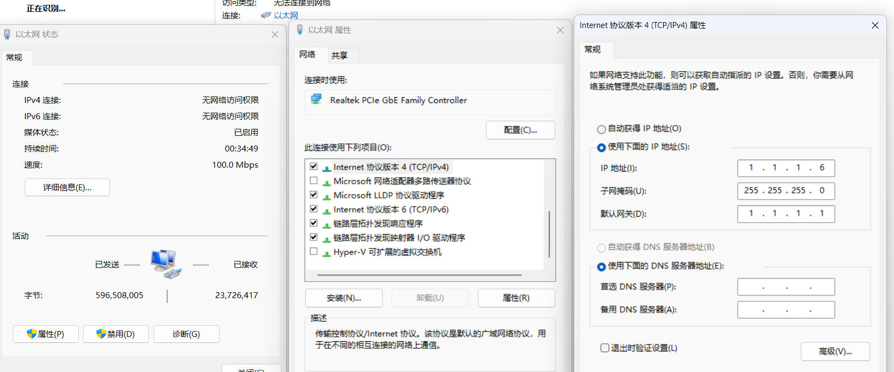
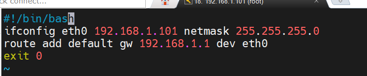
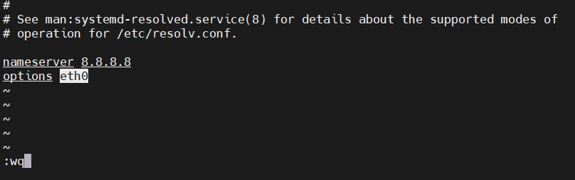

# 根文件系统构建

根文件系统是/，显示文件用的，用qemu构建，然后打包到板子上即可

## 裸文件系统(操作在Ubuntu中)

下载：[裸文件系统](http://cdimage.ubuntu.com/ubuntu-base/releases/)

其中，ubuntu-base-18.04.5-base-arm64.tar.gz是arm64位置，ubuntu-base-18.04.5-base-armhf.tar.gz是arm32位

***

> 安装模拟器,由于我们要chroot（改变程序执行时所参考的根目录位置），所以需要能够在chroot环境执行armhf版本的binary，所以我们要接触linux的binfmt机制和qemu static解释器，用armhf版bin执行程序，完成apt安装等。
> 
> ```
> sudo apt-get install qemu-user-static
> sudo cp /usr/bin/qemu-arm-static rootfs/usr/bin/
> ```

> 如果是arm64：
> 
> ```
> sudo cp /usr/bin/qemu-aarch64-static /home/sophyda/embed_ws/rootfs/usr/bin/ 
> ```

***

拷贝网络dns信息。先将本机的dns配置复制到目标rootfs，后面联网时会用到：

**但是这里拷贝的是虚拟机本身的DNS和网卡，在板子上是不能上网的！！！在制作镜像前要修改这个文件**

```
sudo cp -b /etc/resolv.conf  ./rootfs/etc/resolv.conf
```

```
#在挂载的时候，不要在Ubuntu x86_64下执行啊
vi /etc/resolv.conf

#添加
nameserver 8.8.8.8
options eth0
```

换源：

```
# 默认注释了源码镜像以提高 apt update 速度，如有需要可自行取消注释
# ubuntu-ports -> arm版   bionic -> Ubuntu-18
deb http://mirrors.tuna.tsinghua.edu.cn/ubuntu-ports/ bionic main restricted universe multiverse
# deb-src https://mirrors.tuna.tsinghua.edu.cn/ubuntu-ports/ bionic main restricted universe multiverse
deb http://mirrors.tuna.tsinghua.edu.cn/ubuntu-ports/ bionic-updates main restricted universe multiverse
# deb-src https://mirrors.tuna.tsinghua.edu.cn/ubuntu-ports/ bionic-updates main restricted universe multiverse
deb http://mirrors.tuna.tsinghua.edu.cn/ubuntu-ports/ bionic-backports main restricted universe multiverse
# deb-src https://mirrors.tuna.tsinghua.edu.cn/ubuntu-ports/ bionic-backports main restricted universe multiverse
deb http://mirrors.tuna.tsinghua.edu.cn/ubuntu-ports/ bionic-security main restricted universe multiverse
# deb-src https://mirrors.tuna.tsinghua.edu.cn/ubuntu-ports/ bionic-security main restricted universe multiverse

# 预发布软件源，不建议启用
# deb http://mirrors.tuna.tsinghua.edu.cn/ubuntu-ports/ bionic-proposed main restricted universe multiverse
# deb-src http://mirrors.tuna.tsinghua.edu.cn/ubuntu-ports/ bionic-proposed main restricted universe multiverse
```

## 开启qemu模拟（在模拟器中）

**挂载**：在rootfs和m.sh目录下运行



挂载脚本：(m.sh)

```
#!/bin/bash

sudo mount -t proc /proc /home/sophyda/embed_ws/HI_3798mv100/rootfs/proc
sudo mount -t sysfs /sys /home/sophyda/embed_ws/HI_3798mv100/rootfs/sys
sudo mount -o bind /dev /home/sophyda/embed_ws/HI_3798mv100/rootfs/dev
sudo mount -o bind /dev/pts /home/sophyda/embed_ws/HI_3798mv100/rootfs/dev/pts
sudo chroot /home/sophyda/embed_ws/HI_3798mv100/rootfs
```

**取消挂载**

1.退出模拟器（exit命令）

2.运行取消挂载脚本



取消挂载脚本：（u.sh）

```
#!/bin/bash

sudo umount /home/sophyda/embed_ws/HI_3798mv100/rootfs/dev/pts
sudo umount /home/sophyda/embed_ws/HI_3798mv100/rootfs/dev
sudo umount /home/sophyda/embed_ws/HI_3798mv100/rootfs/sys
sudo umount /home/sophyda/embed_ws/HI_3798mv100/rootfs/proc
```

赋予权限

`chmod a+x m.sh u.sh`

## 更新软件包(qemu)

```
apt-get update -y
apt-get upgrade -y
```

```
apt-get install vim git sudo net-tools
apt install -y ssh
apt install -y ethtool 
apt install -y ifupdown
apt install -y iputils-ping
apt install -y rsyslog
apt install -y htop 
apt install -y bash-completion
apt install -y systemd
```

## 设置用户(qemu)

```
passwd root 
```

```
adduser sophda
```

```
echo "ubuntu-arm" > /etc/hostname
```

```
echo "127.0.0.1 localhost" >> /etc/hosts
echo "127.0.0.1 ubuntu-arm" >> /etc/hosts 
```

## 安装工具(qemu)

安装gcc

```
sudo apt-get  install  build-essential
```

建立软连接:(这一步在安装systemd之后才起作用)

```
ln -s /lib/systemd/system/getty@.service /etc/systemd/system/getty.target.wants/getty@ttyAMA0.servic
```

## 制作镜像

> 退出qemu，并取消挂载
> 
> 查看根文件系统大小
> 
> ```
> sudo du -s -h rootfs/
> ```

> 打包：
> 
> count = 700000指的是镜像img大小为700Mb,根据查看的根文件系统大小确定
> 
> ```shell
> dd if=/dev/zero of=ubuntu.img bs=1024 count=1700000
> mkfs.ext4 ubuntu.img
> mount -o loop ubuntu.img ./mnt
> cp -rf ./rootfs/* ./mnt
> umount ./mnt
> ```

# 系统完善 在实体机上

## 给rootfs分区扩展空间

根文件系统为占满整个分区

```
lsblk
df -h

resize2fs /dev/mmcblk0p4
```

mmcblk0p4为rootfs所在的分区

## 出现A start job is running for dev-ttymxc0.device

在/etc/init/中新建tty.conf

```
# console - getty#
# This service maintains a getty on console from the point the system is
# started until it is shut down again.


start on stopped rc RUNLEVEL=[2345] and container CONTAINER=lxc

stop on runlevel [!2345]
```

## ssh登录问题

1.无法通过ssh登录root，

将PermitRootLogin prohibit-password将该行改为PermitRootLogin yes

```
echo "PermitRootLogin yes" >> /etc/ssh/sshd_config
```

然后重启ssh，

```
/etc/init.d/ssh restart
```

2.ssh通过*user*登录，执行 `sudo su`时，提示sudo: /usr/bin/sudo must be owned by uid 0 and have the setuid bit set

```
chown root:root /usr/bin/sudo
chmod 4755 /usr/bin/sudo
```

> 2.1再次执行提示`sophda is not in the sudoers file.  This incident will be reported`
> 
> ```shell
> su root 
> vim /etc/sudoers
> 
> #添加
> user_name ALL=(ALL)  ALL
> ```

## 网络

**连接的电脑：**

1.（电脑端）打开共享，设置以太网的IP地址

打开wlan的共享功能



设置以太网端口的IP地址，也就是服务器的IP地址，同时设置子网掩码和网关



2.设置开发版的IP、网关、子网掩码

```
ifconfig eth0 1.1.1.15 netmask 255.255.255.0
route add default gw 1.1.1.1 dev eth0
```

## 无线路由器

默认密码:5e3qpfnk

```
#在Linux中：临时设置静态ip
ifconfig eth0 192.168.1.101 netmask 255.255.255.0
route add default gw 192.168.1.1 dev eth0
```

## 设置静态ip

由于未提前安装`netplan`库，所以采用**设置开机自启动脚本的方式来设置静态IP** 

1.新建一个sh脚本 setip.sh

```shell
#!/bin/bash
ifconfig eth0 192.168.1.101 netmask 255.255.255.0
route add default gw 192.168.1.1 dev eth0
exit 0
```

```
chmod 777 /etc/setip.sh
```



*注意：#!/bin/bash 必须要有，这并不是注释，而是说明本脚本使用bash来解释运行*

2.在`/etc/systemd/system`下新建服务set-up.service,指向1中新建的sh脚本

```shell
[Unit]
Description=/etc/setip.sh Compatibility
ConditionPathExists=/etc/setip.sh

[Service]
Type=forking
ExecStart=/etc/setip.sh
TimeoutSec=0
StandardOutput=tty
RemainAfterExit=yes
SysVStartPriority=99

[Install]
WantedBy=multi-user.target
```

3.启动

```
systemctl enable set-ip
systemctl start set-ip.service
systemctl status set-ip.service
```

4.这里设置静态ip呢，可以ping通，但是呢，他不能上网，为啥呢，DNS没设置好，用IP可以，apt用网址，他就找不到了哦~

DNS是在虚拟机里直接复制过去的，所以要改！

修改`/etc/resolv.conf`里的`nameserver`和`options`

```shell
nameserver 8.8.8.8
options eth0
```



eth0是你的网口名，可以用下面的来查看：

```
ifconfig -a
```

**开机不用修改dns文件：**

只需要在setip的文件中，将resolv.conf覆盖掉即可！！哈哈哈

## DHCP

1.安装

> ```
> apt install kmod net-tools ethtool ifupdown language-pack-en-base rsyslog htop iputils-ping
> ```
> 
> 这些里面有与network有关的 ipfupdown

> ```shell
> echo auto eth0 > /etc/network/interfaces.d/eth0
> echo iface eth0 inet dhcp >> /etc/network/interfaces.d/eth0
> /etc/init.d/networking restart
> ```
> 
> **同样也要根据上面的修改DNS服务器！！！**

2，重启后，板子若未连接网线，可能会在读秒，浪费时间

```
sudo vim /lib/systemd/system/networking.service
#######
#修改
TimeoutStartSec=10sec
```

## 挂载

1.查看设备名：

```
fdisk -l
```

2.开始挂载

```
mount /dev/*** /mnt
cd /mnt
```

## PYQT

安装pip3

```
apt install python3-pip
```

安装pyqt5

```
sudo pip3 install pyqt5==5.12.0

sudo apt install pyqt5* #安装pyqt5的依赖项
sudo apt install qt5-default qttools5-dev-tools # 安装qtdesigne
```

## xfce4

```shell
apt-get install xfce4
```

 在终端启动：

```
startxfce4
```

如果出现在桌面里无法启动终端的问题，则安装`xfce4-terminal`

```
apt-get install xfce4-terminal
```

然后就可以在xfce4的桌面里看到了

## 中文

```shell
vi /etc/default/locale
```

```shell
#添加
LANG=zh_CN.UTF-8 
LANGUAGE="zh_CN:zh"
```

安装字体：

```shell
sudo apt-get install ttf-wqy-microhei
```

## FireFox

```
apt-get install firefox
```

# SD/U盘启动

## 制作u盘

- 查找U盘设备名
  
  ```
  fdisk -l
  ```

- 取消挂载并格式化
  
  ```
  umount /dev/sdb1
  mkfs.ext4 /dev/sdb1
  ```

- 重新挂载、拷贝
  
  ```
  mount /dev/sdb1 ./usb
  cp -rf ./rootfs/* ./usb/
  ```

- 取消挂载
  
  ```
  sync
  umount /dev/sdb1
  ```

## 设置bootargs

1.重新编译

没成功，妈的

2.在fastboot里面设置环境变量，保存

```
 setenv bootargs console=tty1 console=ttyAMA0,115200 root=/dev/sda1 rootfstype=ext4 rootwait blkdevparts=mmcblk0:1M(fastboot),1M(bootargs),10M(kernel),6144M(rootfs),-(others)  ipaddr=192.168.10.100 gateway=192.168.10.1 netmask=255.255.255.0 netdev=eth0

 saveenv

 reset
```

*参数解释：root是根文件系统所在的分区；没了*
