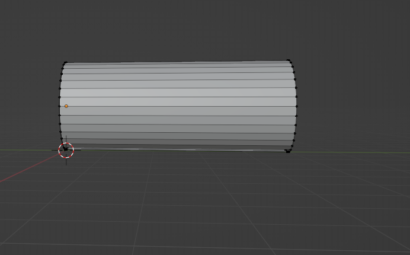
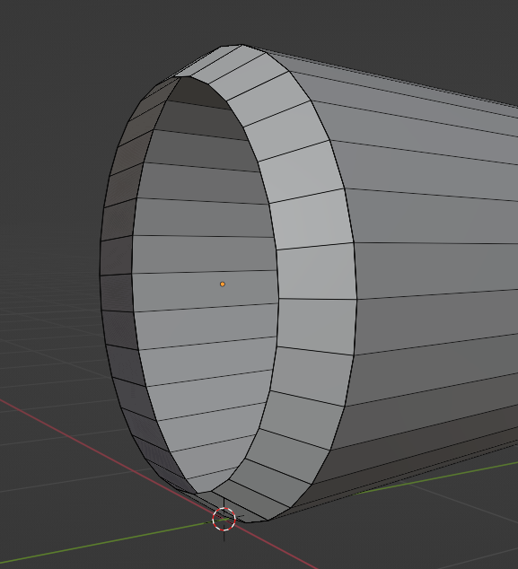
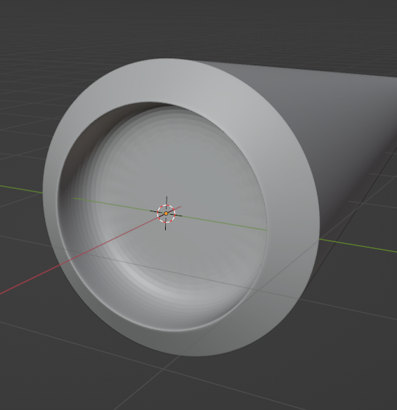
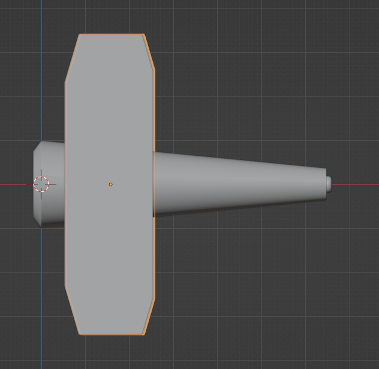

# Blender

## 界面布局

1. 注意编辑模式和物体模式之间的切换


2. 

   有这个标志：说明该物体处于编辑模式


## 快捷键

```
/  聚焦模式
Tab 切换物体模式or编辑模式
E 基础，在当前面的基础上，不改变当前面
G 修改高度，修改当前面
S 缩放，当前面
1 2 3 切换点线面
小键盘上的123则是三视图切换
ALT+E 沿着法向挤出
ALT+Z 切换透视模式
shift+a 添加物体

F 封口


全选物体——A
框选物体——B
反选物体——Ctrl+I
删除物体——X（可以直接单手操作好嘛，左手键盘，右手鼠标，不至于一直放开右手去Delete）
```


## 调整面的高度

1. 选择一个/多个面

   ```
   tab
   3
   alt+点击面的交线
   ```

2. 调整高度

   ```
   g	--调整高度
   z	--只在z方向改变
   ```

   

## 制作圆角

1. 选择一条边，也就是要做为圆角消失的边

   ```
   tab
   点击一条边
   ```

   

2. 制作角（立体）

   ```
   ctrl+b
   滚轮
   ```

   

## 小飞机

**一、制作筒子**

1. 创建圆环

```
shift+a
选择圆环
```

2. 绕某轴旋转

```
R
Z //绕z轴旋转
90 //旋转90°
```

3. 圆环拉伸

```
SHIFT+滚轮  //移动视图
1/2 //选择点/线
框选圆环
E //拉伸
```



4. 缩小一端

```
ALT+Z
选中尾端
S
缩小
```


5. 向内挤出（以缩放的形式）

```
E
S
```


6. 挤出+修改高度

   ```
   FUN1:
   点模式
   E
   S
   G
   Y
   FUN2:
   点模式
   G
   Y
   E
   S
   ```

   

7. 添加表面细分

    

8. 加入循环边

   可以使之更硬、软

   ```
   TAB
   CTRL+R
   ```

   

**二、制作机翼**

```
SHIFT+A
新建平面
E拉伸
CTRL+B制作倒角
```

```
SHIFT+A
新建平面
TAB
1 进入点模式
选择两个顶点
CTRL+SHIFT+B 平面做倒角
```



2. 创建支持架

   ```
   CTRL+J //创建连接体
   ```

3. 镜像

   选择要镜像的物体，添加镜像属性。然后选择镜像物体（对称物体）


4. 内插面

```
I
```

```
E
G
S
```

**三、涡轮扇叶制作**

1. 实现思路：将一个圆环拉伸，选中侧面，然后再把侧面线条拉伸、放大

2. 实现步骤

   ```
   新建圆环
   E  //拉伸
   ALT+Z
   选中侧面
   E
   S放大
   ```

   