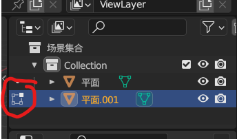
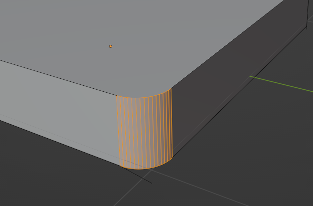

# Blender

## 界面布局

1. 注意编辑模式和物体模式之间的切换


2. 

   有这个标志：说明该物体处于编辑模式


## 快捷键

```
/  聚焦模式
Tab 切换物体模式or编辑模式
E 拉伸
1 2 3 切换点线面
ALT+E 沿着法向挤出
shift+a 添加物体

全选物体——A
框选物体——B
反选物体——Ctrl+I
删除物体——X（可以直接单手操作好嘛，左手键盘，右手鼠标，不至于一直放开右手去Delete）
```


## 调整面的高度

1. 选择一个/多个面

   ```
   tab
   3
   alt+点击面的交线
   ```

2. 调整高度

   ```
   g	--调整高度
   z	--只在z方向改变
   ```

   

## 制作圆角

1. 选择一条边，也就是要做为圆角消失的边

   ```
   tab
   点击一条边
   ```

   

2. 制作角

   ```
   ctrl+b
   滚轮
   ```

   