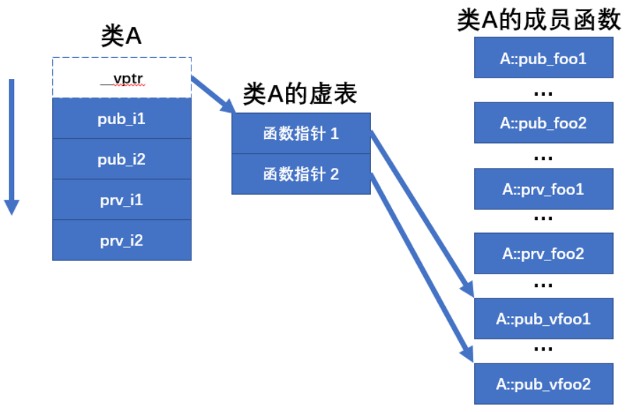

# C++ (二)

> 来自b站视频

## 0.一些名词

内存：memory

指针：pointer

内存池：memory arena

智能指针：custom allocator

移动语义：move semantics

模板：template

## 1.link

程序生成需要“编译”和“链接”，编译是生成二进制机器码，而链接则是将编译后的obj文件链接起来称为可执行的。

```cpp
#include<iostream>
int multi()
{

}
int hello()
{

}
```

如果只对代码进行编译，则不会有任何问题。但是在build时会出现link的错误，因为没有程序入口，错误如`link1561`.

> 如果是cxxx的错误，则是编译错误，应检查语法

**链接与头文件：**

有三个文件

```cpp
// log.h
void log()
{
cout <<"" <<endl;
}
```

```cpp
// log.cpp
#include <log.h>
void initlog()
{
log();
}
```

```cpp
// main.cpp
#include<iostream>
#include<log.h>
int main()
{

}
```

在经过编译之后，生成的obj文件如下：

```c++
// log.obj
void log()
{
cout <<"" <<endl;
}
void initlog()
{
log();
}
```

```cpp
// main.obj
#include<iostream>
void log()
{
cout <<"" <<endl;
}
int main()
{

}
```

但是在main.obj和log.obj之后都有log函数，在link阶段会出现问题

**如何解决这个问题呢？**

1. 只需要修改log.h

```cpp
// log.h
static void log()
{
cout <<"" <<endl;
}
```

这样，log函数只在对应的obj文件内起作用。其他的obj文件是看不到的，最后链接的时候也就不会出问题。

2. 使用inline

> inline是把对应的函数替换为函数内的语句

```cpp
// log.h
inline void log()
{
cout <<"" <<endl;
}
```


## 2.head files

头文件保护符：

> 告诉编译器，这个头文件只被include一次

```
#pragma once
```

```
#ifdef
```

**<>和“”**

区别就是<>引用的是环境里的，而引号引用相对目录里的

```cpp
#include"iostream"
//这样引用的是cpp的标准库
//而c的标准库是带后缀.h的
//为了区别c和cpp 的标准库
```

## 3.指针

> 指针是一个整数，一个数字，存储着一个内存地址

> ```cpp
> int var = 10;
> void* ptr = &var;
> *ptr = 20;
> ```
>
> 这样是错的，因为ptr指向了一个内存地址，但是void形的，所以编译器不知道要向这个内存地址处写入多少字节的数据

## 4.reference

```
int main()
{
	int a = 5;
	int b = 8;
	int* ref = &a;
	ref = 
}
```


## 5.classes

> 类与结构体的区别：
>
> 类可以指定成员是否可以被访问
>
> 使用public、private等关键词

1. 引用和类对象结合

   ```cpp
   class Player
   {
   public: 
   	int x,y;
   	int speed;
   };
   void move(Player& player,int x)
   {
   player.x = x;
   }
   ```

   **这里move函数传入了类Player的对象的引用**，相当于传入了一个实例化的player的别名（reference）

  ## 6.static in c++

使用static来指定变量，那么这个变量在link的时候只对这个编译单元（obj）里的东西可见

## 7.类中的继承

```cpp
class Entity
{
public:
	void move();
}
class player : public Entity
{
public: 
	int x;
	
}
int main()
{
	Player player;
	player.move();
	player.x = 5;
}

// player对象继承了父类entity的所有内容
```

## 8.虚函数与内存模型

### 虚函数

1. 例子

```cpp
#include<iostream>
#include<string>
using namespace std;
class Entity
{
public:
	std::string GetName(){ reuturn "Entity"; }
};
class Player : public Entity
{
private :
	std::string m_Name;
public:
	Player(const std::string& name)
	:m_Name(name){}
	std::string GetName(){ return  m_Name;}
}

int main()
{
	Entity* e = new Entity();
    // 这里是一个对象指针
	std::cout<<e->GetName() <<std::endl;
	
	Player* p = new Player("hello");
	std::cout << p->GetName() << std::endl;
	
}
// 此时会正常输出
```

```cpp
// 但是当把main函数改为
int main()
{
	Entity* e = new Entity();
	//std::cout<<e->GetName() <<std::endl;
	
	Player* p = new Player("hello");
	//std::cout << p->GetName() << std::endl;
	
	Entity* entity = p;
	cout<<entity->GetName()<<endl;
	
}
// 此时会输出entity
```

```cpp
void printName(Entity* entity)
{
	cout<< entity->GetName() <<endl;
}

// 但是当把main函数改为
int main()
{
	Entity* e = new Entity();
	printName(e);
	
	Player* p = new Player("hello");
	printName(p);
//按道理来说，printName(e);会打印entity
// printname(p)会打印hello
//  但是printName()这个函数入口的是 entity类的，所以会访问
//entity的方法，不会访问player的
}

```

但是！！ 改写了root类之后：

```cpp
#include<iostream>
#include<string>
using namespace std;
class Entity
{
public:
	virtual std::string GetName(){ reuturn "Entity"; }
};
class Player : public Entity
{
private :
	std::string m_Name;
public:
	Player(const std::string& name)
	:m_Name(name){}
	std::string GetName(){ return  m_Name;}
}
```

此时：

```cpp
void printName(Entity* entity)
{
	cout<< entity->GetName() <<endl;
}

// 但是当把main函数改为
int main()
{
	Entity* e = new Entity();
	printName(e);
	
	Player* p = new Player("hello");
	printName(p);
// 因为root类实用virtual,所以子类会对GetName()方法进行改  // 写。printName(e)会打印entity
// printname(p)会打印hello

}
```

**纯虚函数：**

```cpp
class Entity
{
public:
	virtual std::string GetName()=0;
}
// 令这个函数为零，则必须在子类里定义
//
Entity *e = new Entity();
// 也是错误的，因为GetName么有定义

```

2. **纯虚函数是为了多态而生，可以实现子类在继承的时候为虚函数创建虚函数表，进而实现即使强制转换，调用虚函数也会不同情况。**

   > 回调：把函数作为变量，进行调用

   那上面的例子来说，在基类entity中定义了函数getname，如果不定义为虚函数，那么子类player继承后，需要进行重写（or覆盖）才能够调用这个函数，并且在`Entity* entity = player`强制转换类型后，子类定义的函数也将无法使用。

3. 纯虚函数的实现

   ```c++
   // 1段
   class IRunner {
   private:
   	size_t a;
   public:
   	IRunner()
   		: a(0){
   	}
   	virtual void run() = 0;
   };
   
   class ISpeaker{
   protected:
   	size_t b;
   public:
   	ISpeaker( size_t _v )
   		: b(_v) 
   	{}
   	virtual void speak() = 0;
   };
   
   class Dog : public ISpeaker {
   public:
   	Dog()
   		: ISpeaker(1)
   	{}
   	//
   	virtual void speak() override {
   		printf("woof! %llu\n", b);
   	}
   };
   
   class RunnerDog : public IRunner, public Dog {
   public:
   	RunnerDog()
   	{}
   
   	virtual void run() override {
   		printf("run with 4 legs\n");
   	}
   };
   
   int main( int argc, char** _argv ) {
   	RunnerDog* pDog = new RunnerDog();
   	Dog* simpleDog = new Dog();
   	pDog->speak();
   	{ // 等价于
   		ISpeaker* speaker1 = static_cast<ISpeaker*>(pDog);
   		speaker1->speak();
   	}
   
   	ISpeaker* speaker = static_cast<ISpeaker*>( simpleDog );	
   	RunnerDog* runnerDog = dynamic_cast<RunnerDog*>(speaker);
   	// RTTI 信息
   	if(runnerDog){
   		runnerDog->run();
   	}
   	//
   	// 子类 -> 基类 （ static_cast<>() ）
   	// 基类 -> 子类 （ dynamic_cast<>() ）
   	// 有可能变化
   	// RunnerDog* runnerDog = (RunnerDog*)(speaker);
    	return 0;
   }
   ```

   ```c++
   // 2段
   extern "C" {
   
   	#define RTTI_INFORMATION
   
   	struct RunnerTable {
   		RTTI_INFORMATION
   		void(* run)(void* _ptr);
   	};
   
   	struct SpeakerTable {
   		RTTI_INFORMATION
   		void(* speak )( void* _ptr );
   	};
   
   	void __dog_run( void* _ptr ) {
   		printf("run with 4 legs");
   	}
   
   	void __dog_speak( void* _ptr ) {
   		uint8_t* p = (uint8_t*)_ptr;
   		p+=sizeof(SpeakerTable*);
   		size_t b = *((size_t*)p);
   		printf("woof! %llu\n", b);
   	}
   
   	const static RunnerTable __dogRunnerTable = {
   		RTTI_INFORMATION
   		__dog_run
   	};
   
   	const static SpeakerTable __dogSpeakTable = {
   		RTTI_INFORMATION
   		__dog_speak
   	};
   
   	struct __dog {
   		const SpeakerTable* vt;
   		size_t b;
   	};
   
   	struct __runner_dog {
   		const RunnerTable* vt1;
   		size_t a;
   		const SpeakerTable* vt2;
   		size_t b;
   	};
   
   	__dog * createDog() {
   		__dog* ptr = (__dog*)malloc(sizeof(__dog));
   		ptr->vt = &__dogSpeakTable;
   		ptr->b = 0;
   		return ptr;
   	}
   
   	__runner_dog* createRunnerDog() {
   		__runner_dog* ptr = (__runner_dog*)malloc(sizeof(__runner_dog));
   		ptr->vt1 = &__dogRunnerTable;
   		ptr->a = 0;
   		ptr->vt2 = &__dogSpeakTable;
   		ptr->b = 1;
   		return ptr;
   	}
   
   };
   
   int main( int _argc, char** _argv ) {
       __dog* dog = createDog();
   	__runner_dog* runnerDog = createRunnerDog();
   
   	SpeakerTable** speaker = nullptr;{
   		uint8_t* ptr = (uint8_t*)runnerDog;
   		union {
   			const SpeakerTable* __runner_dog::* memOffset;
   			size_t offset;
   		} u;
   		u.memOffset = &__runner_dog::vt2;
   		ptr += u.offset;
   		speaker = (SpeakerTable**)ptr;
   	}
   	(*speaker)->speak(speaker);
   	// 等价于
   	runnerDog->vt2->speak(speaker);
   	// 但不等价于
   	runnerDog->vt2->speak(runnerDog); // 这是错误的
   	//
   	return 0;
   }
   ```

   1段展示了纯虚函数的应用，2段则表示了纯虚函数的实现。

   - 如果一个基类中，有纯虚函数的定义，那么该基类的内存模型中，首先是虚函数表，然后是其他变量
   - 有个子类对基类进行了继承，则需要对虚函数进行定义，这时会给子类也分配一个**虚函数表**，该虚函数表指针指向该子类的函数定义，本质上是回调。
   - 对子类强转为基类指针，虚函数表并不会被修改，此时会出现：调用基类的函数，会出现不同情况

### 内存模型

> ref:[C++语言中的类在内存中的分布是怎样的？也是内存对齐的吗？对象的虚表指针存放在哪里？C++中类的内存模型，在内存中是如何存储的？虚函数是如何存储的 - 刘冲的博客 (popkx.com)](https://blog.popkx.com/what-is-the-memory-model-of-class-in-c-where-is-the-virtual-pointer/)

众所周知，但是我忘了。。

- char类型占用1个字节，即1b，1b=8bit
- int类型占用4个字节
- double占用8个字节
- 指针的大小为：$2^{电脑位数}$

1. 空类

   ```c++
   class A {
   };
   cout << sizeof(A) << endl; // 输出 1
   ```

2. 类型的成员变量

   ```c++
   class A {
   public:
       int pub_i1;
       int pub_i2;
   };
   A a;
   ```

   此时a的大小为8字节，即两个int相加

   

3. 类的成员函数

   ```c++
   class A {
   public:
       int pub_i1;
       int pub_i2;
   
       void pub_foo1() {}
       void pub_foo2() {}
   };
   
   A a;
   cout << "sizeof A: " << sizeof(A) << endl;
   cout << "a addr: " << &a << endl;
   cout << "A::pub_i1 addr: " << &a.pub_i1 << endl;
   cout << "A::pub_i2 addr: " << &a.pub_i2 << endl;
   
   printf("A::pub_foo1() addr: %p\n", (void *)&A::pub_foo1);
   printf("A::pub_foo2() addr: %p\n", (void *)&A::pub_foo2);
   ```

   此时输出为：

   ```
   sizeof A: 8
   a addr: 0x7ffe2dbc3120
   A::pub_i1 addr: 0x7ffe2dbc3128
   A::pub_i2 addr: 0x7ffe2dbc312c
   A::pub_foo1() addr: 0x400b28
   A::pub_foo2() addr: 0x400bc2
   ```

   根据a的大小可以看到，成员函数并没有加入到A类中，而是被分配到了很远的地方。

   

4. 类的私有成员

   ```c++
   class A {
   ...
   private:
       int prv_i1;
       int prv_i2;
   
       void pub_foo1() {
           cout << "A::prv_i1 addr: " << &prv_i1 << endl;
           cout << "A::prv_i2 addr: " << &prv_i2 << endl;
   
           printf("A::prv_foo1() addr: %p\n", (void *)&A::prv_foo1);
           printf("A::prv_foo2() addr: %p\n", (void *)&A::prv_foo2);
       }
       void prv_foo2() {}
   };
   ...
   a.pub_foo1();
   ```

   输出为：

   ```
   sizeof A: 16
   a addr: 0x7ffdbbfe6980
   A::pub_i1 addr: 0x7ffdbbfe6980
   A::pub_i2 addr: 0x7ffdbbfe6984
   A::pub_foo1() addr: 0x400ace
   A::pub_foo2() addr: 0x400bb0
   A::prv_i1 addr: 0x7ffdbbfe6988
   A::prv_i2 addr: 0x7ffdbbfe698c
   A::prv_foo1() addr: 0x400bba
   A::prv_foo2() addr: 0x400bc4
   ```

   可以看到：private类并没有特别之处，变量也是存储到对象内存中的。私有函数也是独立于对象a存储的。重点是非虚函数

   

5. 虚函数

   ```c++
   class A {
   public:
       ...
       void pub_foo2() {}
       virtual void pub_vfoo1() {}
       virtual void pub_vfoo2() {}
   private:
       ...
   };
   ...
   printf("A::pub_vfoo1() addr: %p\n", (void *)&A::pub_vfoo1);
   printf("A::pub_vfoo2() addr: %p\n", (void *)&A::pub_vfoo2);
   
   a.pub_foo1();
   ```

   输出为：

   ```
   sizeof A: 24
   a addr: 0x7fffb26a22a0
   A::pub_i1 addr: 0x7fffb26a22a8
   A::pub_i2 addr: 0x7fffb26a22ac
   A::pub_foo1() addr: 0x400b28
   A::pub_foo2() addr: 0x400bc2
   A::pub_vfoo1() addr: 0x400bcc
   A::pub_vfoo2() addr: 0x400bd6
   A::prv_i1 addr: 0x7fffb26a22b0
   A::prv_i2 addr: 0x7fffb26a22b4
   A::prv_foo1() addr: 0x400be0
   A::prv_foo2() addr: 0x400bea
   ```

   可以看到：2个虚函数增加了1个指针的大小（指针指向内存地址，在这里是64为机器位数，占用内存空间即2^64=8byte）。也就是说，**这个指针即虚函数表的地址**，这个地址指向的内存表空间中存储着两个虚函数。

   

根据内存地址，就可以解释：

```c++
class Entity{
public:
    Entity();
    int a;
    void getname()
    {
        cout<< "Entity" <<endl;
    }
};
class Player : public Entity{
public:
    Player();
    int b;
    void getname()
    {
        cout<< "player" <<endl;
    }
};
int main() {
    Player* p = new Player();
    Entity* e = new Entity();
    Entity* entity = dynamic_cast<Entity* >(p);
    entity->getname();
}
```

上面这一段输出的是Entity，因为getname不是虚函数，基类定义了该函数的地址，在进行类型转换`Entity* entity = dynamic_cast<Entity* >(p);`的时候，getname的地址是Entity类的，所以会输出“Entity”

---

```c++
class Entity{
public:
    Entity();
    int a;
    virtual void getname()
    {
        cout<< "Entity" <<endl;
    }
};
class Player : public Entity{
public:
    Player();
    int b;
    void getname()
    {
        cout<< "player" <<endl;
    }
};
int main() {
    Player* p = new Player();
    Entity* e = new Entity();
    Entity* entity = dynamic_cast<Entity* >(p);
    entity->getname();
}
```

上面这一种情况，因为基类包含virtual函数，则会有个虚函数表指针（大小为指针大小）。子类是继承的，所以也有。在执行`Entity* entity = dynamic_cast<Entity* >(p);`时，基类的虚函数表指针是在内存中的，属于类的成员变量，那么基类的虚函数表指针也会被赋值为子类的虚函数表指针，这时，就会执行子类的函数。进而输出“”

## 9.初始化 ：

```cpp
class example
{
private:
	int x,y,z;
	std::string m_Name;
public:
	example()
		// 这是初始化的操作
		:x(0),y(0),z(0),m_Name("hello")
		{
		
		}
}
```

但是，但我们将初始化不用：表示时，

```cpp
class example
{
private:
	int x,y,z;
	std::string m_Name;
	// 在这里构造了一次
public:
	example()
		// 这是初始化的操作
		:x(0),y(0),z(0)
		{
		m_Name = "hello";
		//不用：进行初始化，这里会把上面初始化的删除，
		// 然后再用“hello”覆盖掉上面的
		// 所以是构造了两次，浪费了性能
		}
}
```

## 10. new 关键词

> new 关键词返回指针！！！

```cpp
class Entity
{
public:
	Entity()
	{}
}

int main()
{
	Entity* entity = new Entity();
	// 这句话会执行类的初始化
    Entity* b = (Entity*)malloc(sizeof(Entity))
    // 仅仅申请Entity大小的空间，b指向这段空间。没有初始化过程
}
            
```


## 11.隐式转换


```cpp
class Entity
{
public:
	int m_age;
	Entity(int age)
		:m_age(age)
		{}
}

int main()
{
	Entity a = 22;
	// 此时会发生隐式转换
	Entity b(20);
	// 这样是显式转换
}
```

但是，如果在构造函数前放一个`explicit`关键词，那么隐式转换`implicit`就会被屏蔽，从而使用显式的构造函数

```
class Entity
{
public:
	int m_age;
	explicit Entity(int age)
		:m_age(age)
		{}
}

int main()
{
	Entity a = 22; //error
	// 此时隐式转换会错误
	
	Entity b(20);
	// 只能用显式转换
	Entity b = Entity(20);
	// 这样也可以
}
```


## 12.堆和栈(包含隐式转换的解释)

1. 栈的作用域：{}，所以一旦离开了栈的作用域，作用域内的内容会消失

2. 使用new关键词新建的内容是在**堆**上，所以即使是离开{}的作用域，指针也会继续存在 

**作用域指针(类)：**

> 这一类指针同样在**作用域内生效**，尽管使用new申请了堆上的内存，**但是离开作用域时，对象也会析构** 
>
> **这就是智能指针哦**

> ScopedPtr是一个智能指针，它包装了new操作符在堆上分配的动态对象，能够保证动态创建的对象在任何时候都可以被正确地删除。它与auto_ptr/unique_ptr类似，但是它不能被复制或赋值给其他指针
>
> e是一个ScopedPtr类型的变量，它指向一个Entity类的对象。当e离开作用域时（即大括号结束时），它会自动调用析构函数来删除指向的Entity对象。

> ScopedPtr e = new Entity(); 这段话会执行以下步骤：（**发生隐式转换**，new返回指针，然后赋值给m_Ptr）
>
> 1. 使用new表达式在堆上分配一个Entity类的对象，并返回一个指向它的指针。
> 2. 调用ScopedPtr的构造函数，将这个指针作为参数传递，并将它赋值给m_Ptr成员变量。
> 3. 创建一个ScopedPtr类型的变量e，它包装了这个指针，并管理它的生命周期

```cpp
class ScopedPtr
{
private:
	Enitty* m_Ptr;
public:
	ScopedPtr(Entity* ptr)
		:m_Ptr(ptr)
		{}
	~ScopedPtr()
	{
        delete m_Ptr;
    }
};

int main()
{
	{
	ScopedPtr e = new Entity();
	}
}
```


## 13.智能指针

> 智能指针实际上是对传统指针的包装，当创建智能指针时，会调用new并分配内存。在不适用时会自动删除。
>
> 也就是避免了new和delete的过程

**1.unique_ptr:**

作用域指针，超出作用域时，会被销毁，然后调用delete

【**warning**】unique_ptr不能够复制，一旦复制，当一个指针被释放，另一个指针会指向被释放的内存。所以叫做unique指针~独一无二的哈~

> unique_ptr是一个显示转换，所以不能用`unique_ptr<Entity> entity=new Enitty()`这种隐式转换
>
> 

```cpp
class Entity
{
public:
	Entity()
	{}
	~Entity()
	{}
}

int main()
{
	std::unique_ptr<Entity> entity(new Entity());
    // <>内的是模板参数
}
```

```cpp
int main()
{
	std::unique_ptr<Entity> entity = std::make_unique<Entity>();
	// c++14引入，这种构造方式更加安全，不会得到没引用的悬空指针，从而不会造成内存泄露
}
```

**2.shared_ptr**

通过引用计数，可以跟踪指针有多少引用，一旦引用计数为0，那么就被删除了

> 1. 在unique_ptr中，不直接调用new保证异常安全
> 2. 在shared_ptr中，需要分配另一块内存，叫做控制块，用来存储引用计数，可以用new

```cpp
int main()
{
	std::shared_ptr<Entity> sharedEntity = std::make_shared<Entity>();
	// OR:
	std::shared_ptr<Entity> sharedEntity1(new Entity())
        
    //此时shared_ptr也可以进行复制操作
    std::shared_ptr<Entity> e0 = sharedEntity;
}
```

```cpp
int main()
{
	{
	std::shared_ptr<Entity> e0;//执行完这句，创建了Entity类的空指针，没有执行构造函数
	{
	std::shared_ptr<Entity> sharedEntity = std::make_shared<Entity>();//执行这句，在堆上新建了Entity对象（执行构造函数），然后返回类的指针给sharedEntity
	e0 = sharedEntity; //将共享指针复制
	} //{}作用域内执行完毕，在{}的变量销毁，sharedEntity会被销毁，还保留e0，shared_ptr的引用数为1
	} //执行完后，e0被销毁，shared_ptr应用数为0，指针对象执行析构函数
}
```

