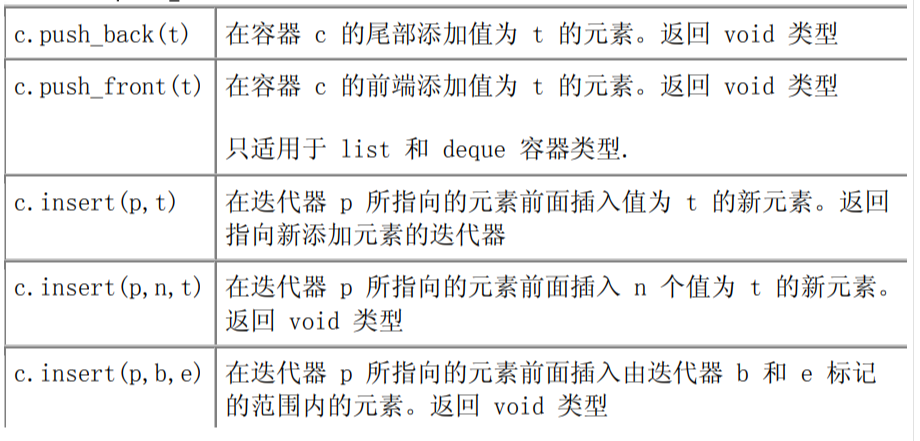
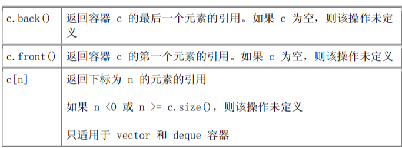
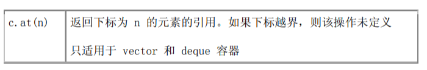
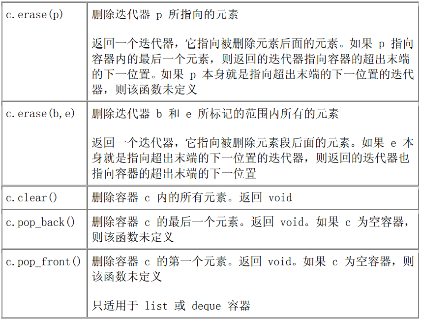
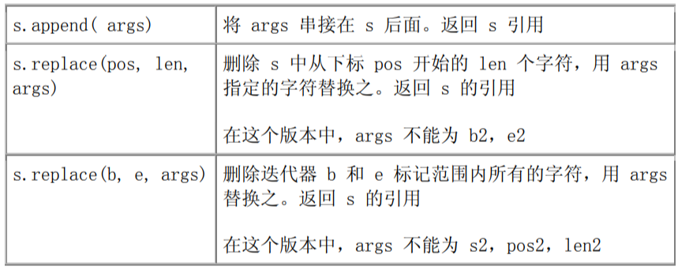
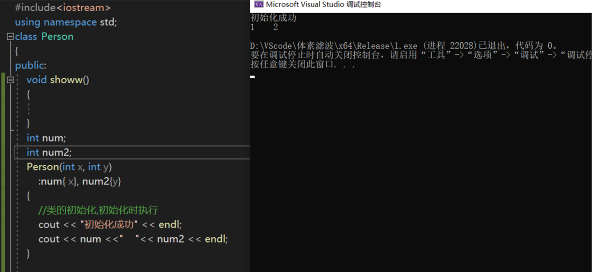
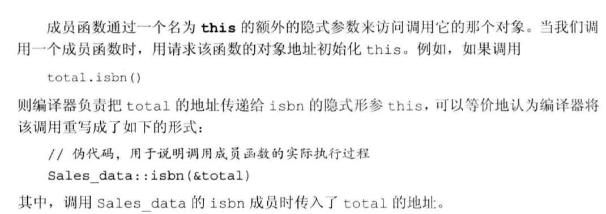

# C/C++

## 文件流

假设 ifile 和 ofile 是存储希望读写的文件名的 strings 对象，可如下编写代码： 

infile 和 outfile是两个string类型的,要用 .c_str()

 ifstream
infile(ifile.c_str());

ofstream outfile(ofile.c_str());

打开文件：

ifstream infile；

infile.open("")

## 容器

1.顺序容器 vector、list、queue

2.定义

```c
#include<vector>
vector<string> sver;
```

3.容器的容器

```c
vector<vector<string>>
```

4.1迭代器

  *iter 返回迭代器 iter 所指向的元素的引用

 iter->mem 对 iter 进行解引用，获取指定元素中名为 mem 的成员。等效于 (*iter).mem

++iter， iter++ 给 iter 加 1，使其指向容器里的下一个元素

4.2迭代器中点

vector::iterator iter = vec.begin() + vec.size()/2;

创建iter迭代器，指向容器中的元素

4.3迭代器  begin  end

begin 和 end 操作产生指向容器内第一个元素和最后一个元素的下一位置 的迭代器

c.begin()返回一个迭代器，指向容器c的第一个元素

c.end()返回一个迭代器，指向C最后一个元素的下一位置

c.rbegin()返回逆序迭代器，指向最后一个元素

c.rend()返回逆序迭代器，指向c的第一个元素前面的位置

4.4迭代器中增加元素  push_back

push_back向容器尾部插入一个元素

string txt;

container.push_back(txt);



4.5访问顺序容器内的元素





4.6 删除顺序容器内的元素



删除所有元素时：c.clear()

4.7 仅适用string容器的操作  append  replace



5.emplace

直接向构造函数传递参数

6.访问容器

```c
//1.1 iterator显示声明
for (std::map<int, std::string>::iterator iter = test.begin(); iter != test.end(); iter++)
{
    std::cout << iter->second << std::endl;
}

//1.2 iterator auto关键字自动推断类型
for (auto iter = test.begin(); iter != test.end(); iter++)
{
    std::cout << iter->second << std::endl;
}
```

```c
//2.1 for each，类型显示声明
for each (std::pair<int, std::string> tt in test)
{
    std::cout << tt.second << std::endl;
}

//2.2 for each, auto关键字自动推断类型
for each (auto tt in test)
{
    std::cout << tt.second << std::endl;
}
```

```c
//3.1 增强型for循环
for (auto iter : test)
{
    std::cout << iter.second << std::endl;
}
```

## 类型

1.类型转换

char *p = (char*)malloc(100); //molloc 返回的是void形

2.struct类型

可以不写struct关键字

```c
struct stu
{
    int a;
    int b;
}
int main()
{
    stu stu1;  //可以不加关键字
}
```

3.size_t是一种整形，可以与int型做运算

```c
#include<iostream>
using namespace std;
int main()
{
    size_t a = 10;
    int b = 20;
    cout << a + b << endl;
}
```

## 引用

c++中增加了一种给函数传递地址的途径，就是按引用传递，也存在于其他语言中

引用的本质是取别名

int &b = a; //给a取别名为b   &在左边为**取别名**，在右边为**地址**

**引用初始化之后不能改变**

**1.给数组取别名**

```c
int a[5] = [1,2,3,4,5];
int (&array) = a;  //给a取别名为array
//也可以：
int a[5] = [1,2,3,4,5];
typedef int ARR[5];
ARR & arr = a;
```

**2.函数引用**

```c
函数引用
void swap(int &x , int &y) //引用的方式 ，即int &x = a , int &y = b
{
    int tem = x;
    x = y;
    y = tmp;
}
void main()
{
    int a=10;
    int b=20;
    swap(x,y); //实现x，y的交换

}
// 通过引用改变了xy的
```

```c
函数引用返回：
int & test()
{
    static int b = 100;
    int a = 10;
    return a ; //是错误的  不能返回局部变量的应用
    return b； //可以返回静态的变量引用
}
```

**3.传递指向指针的引用**

```cpp
void ptrswap(int *&v1,int *&v2)
{
    int *tmp = v2;
    v2 = v1;
    v1 = tmp;
}
// 作用是使用“指向指针的引用”来交换两个指针
```

## 内联函数

```c
inline int add(int a,int b)
{
    return a+b;
}
//定义内联函数
void main()
{
    int a=5,b=5;
    c = add(a,b)*5; //替换发生在编译阶段
}
内联函数省去了函数调用时的压栈，跳转，返回的开销
可以理解为用空间换时间
```

## 函数重载

函数的名字是可以重名的，也就是可以有多个相同函数名的函数存在，名字相同，意义不同

条件：

**1.参数个数不同  // 调用相应的函数**

**2.参数类型不同**

**3.参数顺序不同**

**// 函数返回值不能作为函数重载的条件**

## 类

**1.  ：：**

双冒号 :: 操作符被称为域操作符(scope operator)，含义和用法如下：

- 在类外部声明成员函数。void
  Point::Area(){};

- 调用全局函数；表示引用成员函数变量及作用域，作用域成员运算符
  例：System::Math::Sqrt() 相当于System.Math.Sqrt()。

- 调用类的静态方法：
  如：CDisplay::display()。
  把域看作是一个可视窗口全局域的对象在它被定义的整个文件里，一直到文件末尾都是可见的。在一个函数内被定义的对象是局域的（local scope），
  它只在定义其的函数体内可见。每个类维持一个域，在这个域之外 ，它的成员是不可见的。类域操作符告诉编译器后面的标识符可在该类的范围内被找到。

**2 类的初始化，非静态成员的初始化**

与类同名的函数是构造函数，用于初始化类

```cpp
class     Person 
{
public:
    void showw();
    int num;
    int num2;
    Person(int num1, int num2)
        :num{ 1 }, num2{3}
    {
        //类的初始化
    }
};
```

```cpp
#include<iostream>
using namespace std;
class Person
{
    public :
        void showw()
            {}
        int num;
        int num2;
        Person (int x,int y)
            :num{x},num2{y}
            {
                //类的初始化，在初始化时进行
                cout <<"初始化成功"<<endl;
                cout << num <<" "<< num2 <<endl;
            }
}


int main()
{
    Person p1{1,2}
}
```



**3  委托函数**

使用函数重载，参数不同进行委托，不同的参数使用不同函数进行初始化

```cpp
#include<iostream>
using namespace std;
class    Person 
{
public:
        void showw()
        {
        }
        int num;
        int num2;
        Person(int x)
                :Person {20, 10}  //委托函数
        {
                //函数重载，一个参数
        }
        Person(int x, int y)
                :num{ x}, num2{y}
        {
                //类的初始化,初始化时执行
                cout << "初始化成功" << endl;
                cout << num <<"    "<< num2 << endl;
        }
};
int main()
{
        Person  p1{50,60}; //初始化类
        Person p2{2};  //调用委托函数
}
```

**4 析构函数**

**析构函数**是另一个特殊的类的成员函数的时那个类的一个对象被销毁时执行。构造函数旨在初始化类，而析构函数旨在帮助清除

> 当对象正常超出范围，或使用delete关键字显式删除动态分配的对象时，将自动调用类析构函数（如果存在）以进行必要的清理，然后将其从内存中删除。对于简单的类（那些仅初始化普通成员变量的值的类），不需要析构函数，因为C ++会自动为您清除内存。

**析构函数命名**

像构造函数一样，析构函数具有特定的命名规则：

1）析构函数必须与类具有相同的名称，后跟波浪号（〜）。

2）析构函数不能接受参数。

3）析构函数没有返回类型。

请注意，规则2暗示每个类只能存在一个析构函数，因为无法重载析构函数，因为无法根据参数将它们彼此区分开。

```cpp
#include<iostream>
using namespace std;
class    Person 
{
public:
        void showw()
        {
                cout << num << "  -showw-   " << num2 << endl;
        }
        int num;
        int num2;
        Person(int x)
                :Person {20, 10}  //委托函数
        {
                //函数重载，一个参数
        }
        Person(int x, int y)
                :num{ x}, num2{y}
        {
                //类的初始化,初始化时执行
                cout << "初始化成功" << endl;
                cout << num <<"    "<< num2 << endl;
        }
        ~Person()
        {
                cout << "删除对象" << endl;
        }
};
int main()
{
        Person* pp1{ new Person{30,40} }; //新建了一个指针
        pp1->showw(); //指针通过该方式调用类方法
        delete pp1; //删除时调用析构函数

}
```


**5 this**

新的面向对象的程序员经常问的关于类的问题之一是：“当调用成员函数时，C ++如何跟踪它在哪个对象上被调用？”。答案是C ++使用了一个名为“ this”的隐藏指针！让我们更详细地看一下“ this”。

放在一起：

1）当我们调用时simple.setID(2)，**编译器实际上会调用setID（＆simple，2）。**

2）在setID（）中，“ this”指针将对象的地址保持为简单。

3）setID（）中的任何成员变量都以“ this->”为前缀。因此，当我们说时m_id = id，编译器实际上正在执行this->m_id = id，在这种情况下，它将simple.m_id更新为id。

4)类方法setID（）定义时：

```cpp
void setID(Simple* const this, int id) { this->m_id = id; }
```

好消息是，所有这些操作都是自动发生的，而您是否记得它是如何工作的，这并不重要。您需要记住的是，所有普通成员函数都有一个“ this”指针，该指针指向调用该函数的对象。

显示使用this：

首先，如果您的构造函数（或成员函数）具有与成员变量同名的参数，则可以使用“this”消除它们的歧义:

```cpp
class Something
{
private:
    int data;

public:
    Something(int data)
    {
        this->data = data; // this->data is the member, data is the local parameter
    }
};
```



**6 链接成员函数**

```cpp
class Calc
{
private:
    int m_value{};

public:
    Calc& add(int value) { m_value += value; return *this; }
    Calc& sub(int value) { m_value -= value; return *this; }
    Calc& mult(int value) { m_value *= value; return *this; }

    int getValue() { return m_value; }
};
```

每个函数都返回 *this，即该对象的指针

## NEW

new其实就是告诉计算机开辟一段新的空间，但是和一般的声明不同的是，**new开辟的空间在堆上，而一般声明的变量存放在栈上**。通常来说，当在局部函数中new出一段新的空间，该段空间在局部函数调用结束后仍然能够使用，可以用来向主函数传递参数。另外需要注意的是，**new的使用格式，new出来的是一段空间的首地址**。

```cpp
因为new出来的时首地址，所以一般搭配着指针使用：
Person* pp1( new Person{30,40} );
///////////////////////////
pcl::PointCloud<pcl::PointXYZRGB>::Ptr cloud(new pcl::PointCloud<pcl::PointXYZRGB>);
```

使用`new`关键字来初始化对象：

1.类对象指针

```cpp
Person* pp1( new Person{30,40} );
// 此时pp1是指向类对象的一个指针
pp1->age;
(*pp1).age;
//可用这两种方法来查看类成员变量；
```

2.常规初始化

```cpp
Person pp1 = new Person{30,40};
// Person pp1( new Person{30,40} )；这样是错误的写法
```

## namespace

同名函数/类，要区分

```cpp
#include <iostream>
using namespace std;

// 第一个命名空间
namespace first_space{
   void func(){
      cout << "Inside first_space" << endl;
   }
}
// 第二个命名空间
namespace second_space{
   void func(){
      cout << "Inside second_space" << endl;
   }
}
int main ()
{

   // 调用第一个命名空间中的函数
   first_space::func();

   // 调用第二个命名空间中的函数
   second_space::func(); 

   return 0;
}
```

## 指针

```
double dval; 
double *pd=&dval;
double*pd2=pd;
```

这段c++代码中，pd指什么？

> 这段代码中，pd是一个指向double类型的指针，它指向了dval的地址。也就是说，pd存储了dval的内存位置，你可以通过*pd来访问或修改dval的值。pd2也是一个指向double类型的指针，它被赋值为pd，所以它也指向了dval的地址。你可以通过*pd2来访问或修改dval的值。

**指针声明：**

```cpp
int ival = 1024;
int *p = &ival;
int **p = &p;
// int *p说明p是指针
```

## 数组与指针

```cpp
int ia[] = {0,1,2,3,4,5};
int *ip = ia;
// ip自动指向ia[0]


int *p2 = ip+4;
// p2指向4
```

## 智能指针（shared_ptr）

[创建和使用shared_ptr的方法有以下几种](https://learn.microsoft.com/en-us/cpp/cpp/how-to-create-and-use-shared-ptr-instances?view=msvc-170)[1](https://learn.microsoft.com/en-us/cpp/cpp/how-to-create-and-use-shared-ptr-instances?view=msvc-170)[2](https://www.nextptr.com/tutorial/ta1358374985/shared_ptr-basics-and-internals-with-examples)[3](https://en.cppreference.com/w/cpp/memory/shared_ptr)：

- 使用make_shared函数创建shared_ptr。这种方法是异常安全的，它使用同一个调用来分配控制块和资源的内存，从而减少了构造开销。例如：`auto sp = make_shared<int>(42);`
- 使用new运算符创建shared_ptr。这种方法需要显式地指定要管理的对象类型，并且可能抛出异常。例如：`auto sp = shared_ptr<int>(new int(42));`
- 使用现有的shared_ptr或weak_ptr来初始化或赋值shared_ptr。这种方法会增加共享所有权的计数，并且可以实现别名构造，即让一个shared_ptr拥有另一个对象的所有权信息，但持有不相关的指针。例如：`auto sp1 = make_shared<int>(42); auto sp2 = sp1; auto sp3 = shared_ptr<int>(sp1, &x);`
- 使用unique_ptr或其他智能指针来初始化或赋值shared_ptr。这种方法会转移所有权，并且可以指定自定义删除器。例如：`auto up = unique_ptr<int>(new int(42)); auto sp = shared_ptr<int>(move(up));`

使用shared_ptr时，可以通过解引用运算符（*）或箭头运算符（->）来访问其所管理的对象，也可以通过get()函数来获取原始指针，或者通过use_count()函数来获取共享所有权的数量。
