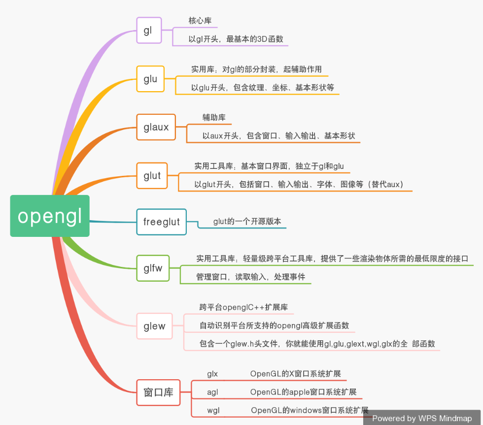
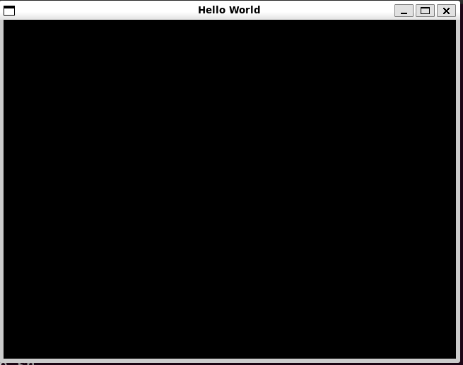
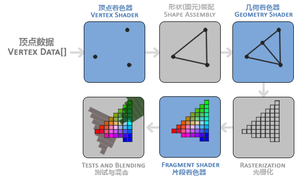
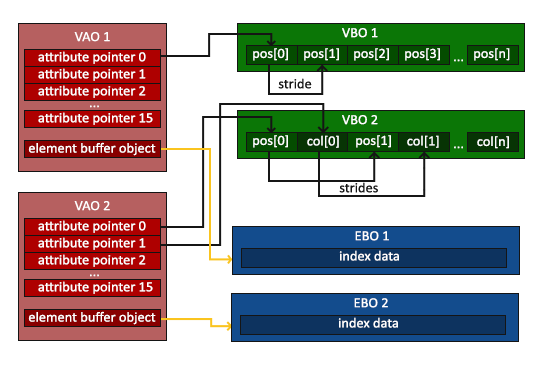

# OpenGL基础

## opengl简介

OpenGL是一套控制显卡的规范，没有具体的函数库。所以具体的函数实现主要是由gl、glu、glut这些库来实现



## 安装与测试

0. 可以使用apt-get

   ```
   sudo apt-get install libglew-dev
   sudo apt-get install libglm-dev
   sudo apt install libglfw3 libglfw3-dev
   ```

   

1. 在glfw官网下载zip格式的压缩包，然后解压编译

   ```
   cmake-gui
   (勾选构建动态库，即build_shared_lib)
   make
   sudo make install
   ```

2. 完成安装之后，会将动态库放到`usr/local/lib`中，因为在`etc/ld.so.conf`中已经添加了该路径，所以需要使用：

   ```
   sudo ldconfig
   ```

   使用这个命令更新以下，才能够找到这个动态库

3. 测试

   ```cpp
   #include <GLFW/glfw3.h>
   #include <stdio.h>
   
   int main(void)
   {
       GLFWwindow* window;
   
       /* Initialize the library */
       if (!glfwInit())
           return -1;
   
       /* Create a windowed mode window and its OpenGL context */
       window = glfwCreateWindow(640, 480, "Hello World", NULL, NULL);
       if (!window)
       {
           glfwTerminate();
           return -1;
       }
   
       /* Make the window's context current */
       glfwMakeContextCurrent(window);
   
       /* Loop until the user closes the window */
       while (!glfwWindowShouldClose(window))
       {
           /* Render here */
           glClear(GL_COLOR_BUFFER_BIT);
   
           /* Swap front and back buffers */
           glfwSwapBuffers(window);
   
           /* Poll for and process events */
           glfwPollEvents();
       }
   
       glfwTerminate();
       return 0;
   }
   ```

   然后编译下：

   ```
   g++ -o main ./main.cpp -lglfw -lGL -lX11 -lm
   ```

   运行生成的main文件即可。

   

## 在arm板子上使用opengl

1. 安装

   ```
   sudo apt-get install libglew-dev
   sudo apt-get install libglm-dev
   sudo apt install libglfw3 libglfw3-dev
   ```

2. 使用cmakelist

   ```
   cmake_minimum_required(VERSION 3.10)
   project(opengl)
   set(CMAKE_CXX_STANDARD 14)
   find_package(glfw3 REQUIRED)
   #find_package(glm REQUIRED)
   add_executable(opengl main.cpp)
   target_link_libraries(${PROJECT_NAME}
           -lGLEW -lglfw -lGL -lX11 -lpthread -lXrandr -lXi -ldl)
   ```

   > 或者使用g++编译命令
   >
   > ```
   > g++ -o main ./main.cpp -lglfw -lGL -lX11 -lm
   > ```
   >
   > 可以看到库使用的是lglfw，并不是glfw3

# Learn OpenGL

## 三角形

[你好，三角形 - LearnOpenGL CN (learnopengl-cn.github.io)](https://learnopengl-cn.github.io/01 Getting started/04 Hello Triangle/)

> 在学习此节之前，建议将这三个单词先记下来：
>
> - 顶点数组对象：Vertex Array Object，VAO
> - 顶点缓冲对象：Vertex Buffer Object，VBO
> - 元素缓冲对象：Element Buffer Object，EBO 或 索引缓冲对象 Index Buffer Object，IBO

在OpenGL中，任何事物都在3D空间中，而屏幕和窗口却是2D像素数组，这导致OpenGL的大部分工作都是关于把3D坐标转变为适应你屏幕的2D像素。3D坐标转为2D坐标的处理过程是由OpenGL的图形渲染管线（Graphics Pipeline，大多译为管线，实际上指的是一堆原始图形数据途经一个输送管道，期间经过各种变化处理最终出现在屏幕的过程）管理的。图形渲染管线可以被划分为两个主要部分：第一部分把你的3D坐标转换为2D坐标，第二部分是把2D坐标转变为实际的有颜色的像素。



1. 开始绘制图形之前，我们需要先给OpenGL输入一些顶点数据。OpenGL是一个3D图形库，所以在OpenGL中我们指定的所有坐标都是3D坐标（x、y和z）。定义这样的顶点数据以后，我们会把它作为输入发送给图形渲染管线的第一个处理阶段：顶点着色器。它会在GPU上创建内存用于储存我们的顶点数据，还要配置OpenGL如何解释这些内存，并且指定其如何发送给显卡。顶点着色器接着会处理我们在内存中指定数量的顶点。

**出现的bug：**

在编译后出现段错误，原因：是初始化失败了，如果你使用一个扩展加载器程序库（extension loader library）来访问现代[OpenGL](https://so.csdn.net/so/search?q=OpenGL&spm=1001.2101.3001.7020)，然后当需要初始化它时，加载器需要一个当前的上下文来加载。在调用glCreateShader先调用glewInit函数，代码如下：

```
GLenum glew_err = glewInit();
	if (glew_err != GLEW_OK)
	{
		throw std::runtime_error(std::string("Error initializing GLEW, error: ") + (const char*)glewGetErrorString(glew_err));
		return;
}
// Create and compile vertex shader
unsigned int vertex_shader = glCreateShader(GL_VERTEX_SHADER);

```

**用到的函数：**

1. glGenBuffers(1,&VBO)

   VBO是**顶点缓冲对象**，用于管理“顶点”的内存信息

   ```c++
   unsigned int VBO;
   glGenBuffers(1, &VBO); // 1是ID
   ```

2. glBindBuffer(GL_ARRAY_BUFFER, VBO); 其中GL_ARRAY_BUFFER是顶点缓冲对象缓冲类型，该函数可以把新创建的缓冲VBO绑定到GL_ARRAY_BUFFER目标上.

   那么使用GL_ARRAY_BUFFER上的缓冲调用都会来配置当前绑定的缓冲“VBO”

   ```
   glBindBuffer(GL_ARRAY_BUFFER, VBO);  
   ```

3. glBufferData

   该函数可以把定义的顶点数据复制到缓冲内存中

   ```
   glBufferData(GL_ARRAY_BUFFER, sizeof(vertices), vertices, GL_STATIC_DRAW);
   ```

   glBufferData是一个专门用来把用户定义的数据复制到当前绑定缓冲的函数。它的第一个参数是目标缓冲的类型：顶点缓冲对象当前绑定到GL_ARRAY_BUFFER目标上。第二个参数指定传输数据的大小(以字节为单位)；用一个简单的`sizeof`计算出顶点数据大小就行。第三个参数是我们希望发送的实际数据。

   第四个参数指定了我们希望显卡如何管理给定的数据。它有三种形式：

   - GL_STATIC_DRAW ：数据不会或几乎不会改变。
   - GL_DYNAMIC_DRAW：数据会被改变很多。
   - GL_STREAM_DRAW ：数据每次绘制时都会改变。

### 连接顶点属性

顶点数据会被解析为：


- 位置数据被储存为32位（4字节）浮点值。
- 每个位置包含3个这样的值。
- 在这3个值之间没有空隙（或其他值）。这几个值在数组中紧密排列(Tightly Packed)。
- 数据中第一个值在缓冲开始的位置。

glVertexAttribPointer函数的参数非常多，所以我会逐一介绍它们：

- 第一个参数指定我们要配置的顶点属性。还记得我们在顶点着色器中使用`layout(location = 0)`定义了position顶点属性的位置值(Location)吗？它可以把顶点属性的位置值设置为`0`。因为我们希望把数据传递到这一个顶点属性中，所以这里我们传入`0`。
- 第二个参数指定顶点属性的大小。顶点属性是一个`vec3`，它由3个值组成，所以大小是3。
- 第三个参数指定数据的类型，这里是GL_FLOAT(GLSL中`vec*`都是由浮点数值组成的)。
- 下个参数定义我们是否希望数据被标准化(Normalize)。如果我们设置为GL_TRUE，所有数据都会被映射到0（对于有符号型signed数据是-1）到1之间。我们把它设置为GL_FALSE。
- 第五个参数叫做步长(Stride)，它告诉我们在连续的顶点属性组之间的间隔。由于下个组位置数据在3个`float`之后，我们把步长设置为`3 * sizeof(float)`。要注意的是由于我们知道这个数组是紧密排列的（在两个顶点属性之间没有空隙）我们也可以设置为0来让OpenGL决定具体步长是多少（只有当数值是紧密排列时才可用）。一旦我们有更多的顶点属性，我们就必须更小心地定义每个顶点属性之间的间隔，我们在后面会看到更多的例子（译注: 这个参数的意思简单说就是从这个属性第二次出现的地方到整个数组0位置之间有多少字节）。
- 最后一个参数的类型是`void*`，所以需要我们进行这个奇怪的强制类型转换。它表示位置数据在缓冲中起始位置的偏移量(Offset)。由于位置数据在数组的开头，所以这里是0。我们会在后面详细解释这个参数。

> 每个顶点属性从一个VBO管理的内存中获得它的数据，而具体是从哪个VBO（程序中可以有多个VBO）获取则是通过在调用glVertexAttribPointer时绑定到GL_ARRAY_BUFFER的VBO决定的。
>
> **也就是VBO是一个int类型，存储着内存地址，然后内存地址指向的地方是顶点属性的数据。**

### 顶点数组对象

顶点数组对象（VAO）可以像VBO一样被绑定，随后的顶点数据会被存储在VAO中。

一个顶点数组对象会存储以下内容：

- glEnableVertexAttribArray和glDisableVertexAttribArray的调用。
- 通过glVertexAttribPointer设置的顶点属性配置。
- 通过glVertexAttribPointer调用与顶点属性关联的顶点缓冲对象。


**用法**

1. 创建VAO

   ```c++
   unsigned int VAO;
   glGenVertexArrays(1, &VAO);
   ```

2. 使用VAO

   使用`glBindVertexArray` 绑定VAO， 也就是有几个流程：0.绑定VAO；1.确定顶点数据；2.创建VBO，绑定GL_ARRAY_BUFFER；3.把顶点数据绑定到GL_ARRAY_BUFFER中

   ```c++
   // ..:: 初始化代码（只运行一次 (除非你的物体频繁改变)） :: ..
   // 1. 绑定VAO
   glBindVertexArray(VAO);
   // 2. 把顶点数组复制到缓冲中供OpenGL使用
   glBindBuffer(GL_ARRAY_BUFFER, VBO);
   glBufferData(GL_ARRAY_BUFFER, sizeof(vertices), vertices, GL_STATIC_DRAW);
   // 3. 设置顶点属性指针
   glVertexAttribPointer(0, 3, GL_FLOAT, GL_FALSE, 3 * sizeof(float), (void*)0);
   glEnableVertexAttribArray(0);
   
   [...]
   
   // ..:: 绘制代码（渲染循环中） :: ..
   // 4. 绘制物体
   glUseProgram(shaderProgram);
   glBindVertexArray(VAO);
   someOpenGLFunctionThatDrawsOurTriangle();
   ```

   ### 三角形画

   `glDrawArrays`函数：使用当前激活的着色器、定义的顶点属性、VBO的顶点数据（通过VAO间接绑定，通过VAO访问VBO）

   ```
   glUseProgram(shaderProgram);
   glBindVertexArray(VAO);
   glDrawArrays(GL_TRIANGLES, 0, 3);
   ```

   

### 元素缓冲对象（EBO,element Buffer Object）

> 又名"索引缓冲对象"

可以确定顶点的绘制顺序，opengl主要处理三角形，如果绘制矩形需要使用EBO来处理绘制顺序进而达到节省开支的目的：

```c++
float vertices[] = {
    0.5f, 0.5f, 0.0f,   // 右上角
    0.5f, -0.5f, 0.0f,  // 右下角
    -0.5f, -0.5f, 0.0f, // 左下角
    -0.5f, 0.5f, 0.0f   // 左上角
};

unsigned int indices[] = {
    // 注意索引从0开始! 
    // 此例的索引(0,1,2,3)就是顶点数组vertices的下标，
    // 这样可以由下标代表顶点组合成矩形

    0, 1, 3, // 第一个三角形
    1, 2, 3  // 第二个三角形
};
```

和VBO类似，需要将EBO绑定到`GL_ELEMENT_ARRAY_BUFFER`，然后将顶点数据复制到缓冲区`GL_ELEMENT_ARRAY_BUFFER`：

```c++
unsigned int EBO;
glGenBuffers(1, &EBO);
glBindBuffer(GL_ELEMENT_ARRAY_BUFFER, EBO);
glBufferData(GL_ELEMENT_ARRAY_BUFFER, sizeof(indices), indices, GL_STATIC_DRAW);

```

如下图所示，VAO在绑定VBO时会自动绑定EBO对象。**VAO存储了EBO对象**



```c++
// ..:: 初始化代码 :: ..
// 1. 绑定顶点数组对象
glBindVertexArray(VAO);
// 2. 把我们的顶点数组复制到一个顶点缓冲中，供OpenGL使用
glBindBuffer(GL_ARRAY_BUFFER, VBO);
glBufferData(GL_ARRAY_BUFFER, sizeof(vertices), vertices, GL_STATIC_DRAW);
// 3. 复制我们的索引数组到一个索引缓冲中，供OpenGL使用
glBindBuffer(GL_ELEMENT_ARRAY_BUFFER, EBO);
glBufferData(GL_ELEMENT_ARRAY_BUFFER, sizeof(indices), indices, GL_STATIC_DRAW);
// 4. 设定顶点属性指针
glVertexAttribPointer(0, 3, GL_FLOAT, GL_FALSE, 3 * sizeof(float), (void*)0);
glEnableVertexAttribArray(0);

[...]

// ..:: 绘制代码（渲染循环中） :: ..
glUseProgram(shaderProgram);
glBindVertexArray(VAO);
glDrawElements(GL_TRIANGLES, 6, GL_UNSIGNED_INT, 0);
glBindVertexArray(0);
```

