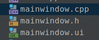
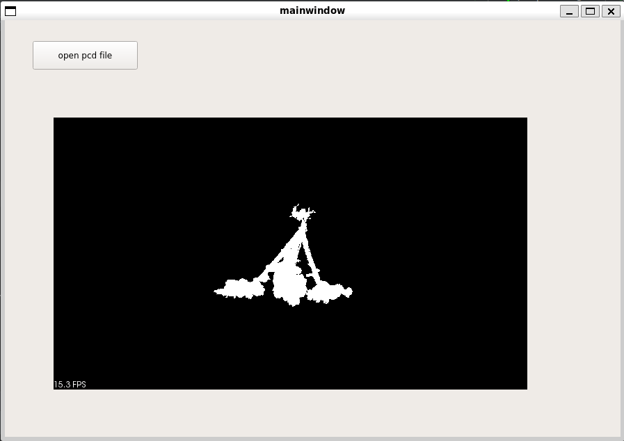

# QT

# 基础使用

## 在Clion中使用

1. 新建项目
   
   一般选择c++ 14，qt5

2. 更新cmakelist
   
   ```
   // 在原有基础上更新
   set(REQUIRED_LIBS Core Widgets )
   set(REQUIRED_LIBS_QUALIFIED Qt5::Core Qt5::Widgets )
   ```

3. **新建qt ui类**
   
   创建mainwindow类，此时会有三个文件
   
   

> 可以用qt designer编辑ui文件，在terminal中，输入`designer`，然后打开文件
> 
> 因为该项目是打开了qt的`auto generate`的，所以在构建项目的时候，会重新读入`mainwindow.ui`文件，然后在`/cmake-build-debug/qt_autogen/include/ui_mainwindow.h`中生成响应的头文件

4. 运行
   
   此时的`main.cpp`应为：
   
   ```cpp
   #include <QCoreApplication>
   #include <QDebug>
   #include <QApplication>
   #include "mainwindow.h"
   int main(int argc, char *argv[]) {
       QApplication a (argc, argv);
       mainwindow w;
       w.show ();
       return QApplication::exec ();
   }
   
   ```

## 显示点云项目

1. 更新`cmakelists`，需要用到`vtk pcl opencv`等库

```
cmake_minimum_required(VERSION 3.10)
project(qt)

set(CMAKE_CXX_STANDARD 14)
set(CMAKE_AUTOMOC ON)
set(CMAKE_AUTORCC ON)
set(CMAKE_AUTOUIC ON)

set(QT_VERSION 5)
set(REQUIRED_LIBS Core Widgets )
set(REQUIRED_LIBS_QUALIFIED Qt5::Core Qt5::Widgets )

add_executable(${PROJECT_NAME} main.cpp mainwindow.cpp mainwindow.h mainwindow.ui pcdProcess.cpp pcdProcess.h)

#if (NOT CMAKE_PREFIX_PATH)
#    message(WARNING "CMAKE_PREFIX_PATH is not defined, you may need to set it "
#            "(-DCMAKE_PREFIX_PATH=\"path/to/Qt/lib/cmake\" or -DCMAKE_PREFIX_PATH=/usr/include/{host}/qt{version}/ on Ubuntu)")
#endif ()
find_package(VTK REQUIRED)
find_package(Qt${QT_VERSION} COMPONENTS ${REQUIRED_LIBS} REQUIRED)
find_package(PCL REQUIRED)
find_package(OpenCV REQUIRED)
message(${PCL_LIBRARIES})

include(${VTK_USE_FILE})

#修改
#target_link_libraries(${PROJECT_NAME} Qt5::Widgets ${VTK_LIBRARIES})

target_link_libraries(${PROJECT_NAME} ${REQUIRED_LIBS_QUALIFIED} ${VTK_LIBRARIES} ${PCL_LIBRARIES} ${OpenCV_LIBS})

```


2. 新建一个qt ui类，命名为`mainwindow`，此时会生成三个文件。

3. 修改`mainwindow.h`,一般做类函数、类变量的声明

```cpp
//
// Created by sophda on 2/23/23.
//

#ifndef QT_MAINWINDOW_H
#define QT_MAINWINDOW_H

#include <QWidget>
#include <pcl/visualization/cloud_viewer.h>

#include <vtkRenderWindow.h>


QT_BEGIN_NAMESPACE
namespace Ui { class mainwindow; }
QT_END_NAMESPACE

class mainwindow : public QWidget {
Q_OBJECT

public:
    explicit mainwindow(QWidget *parent = nullptr);
    void btn_openpcd();
    ~mainwindow() override;

private:
    Ui::mainwindow *ui;

    pcl::visualization::PCLVisualizer::Ptr viewer;
};

#endif //QT_MAINWINDOW_H

```


4. 修改`mainwindow.cpp`,一般做类函数定义

> 1.信号与槽的连接：connect; `connect(ui->pushButton, &QPushButton::clicked,this, &mainwindow::btn_openpcd);`
> 
> `ui->pushButton`指：ui文件中的pushbutton控件，发出信号
> 
> `btn_openpcd`指：作为槽函数，响应信号。用connect连接起来

```cpp
//
// Created by sophda on 2/23/23.
//

// You may need to build the project (run Qt uic code generator) to get "ui_mainwindow.h" resolved

#include <pcl/io/pcd_io.h>
#include "mainwindow.h"
#include "ui_mainwindow.h"

mainwindow::mainwindow(QWidget *parent) :
        QWidget(parent), ui(new Ui::mainwindow) {
    ui->setupUi(this);
    // init signal and slot
    connect(ui->pushButton, &QPushButton::clicked,this, &mainwindow::btn_openpcd);


    // pcl function

    viewer.reset(new pcl::visualization::PCLVisualizer("viewer", false));
    ui->widget->SetRenderWindow(viewer->getRenderWindow());
    viewer->setupInteractor(ui->widget->GetInteractor(), ui->widget->GetRenderWindow());
    ui->widget->update();


}

mainwindow::~mainwindow() {
    delete ui;
}

void mainwindow::btn_openpcd() {

    pcl::PointCloud<pcl::PointXYZ>::Ptr cloud(new pcl::PointCloud<pcl::PointXYZ>);
    char strfilepath[256] = "../src/leaf.pcd";
    if (-1 == pcl::io::loadPCDFile(strfilepath, *cloud))
    {
        cout << "error input!" << endl;
        return;
    }

    std::cout << "read completed" << std::endl;
    cout << cloud->points.size() << endl;
    viewer->addPointCloud(cloud);


}
```


5. 在`qt designer`中修改控件

新建一个`widget`；然后右键**提升控件**，提升为：（注意头文件要大写）

> 在vtk控件中嵌套一个pcl中的viewer，然后就可以显示点云了


6. 然后就可以运行了哦~


