# SLAM

# ROS环境安装

## ros基础包（ros1/2看情况啊）

1. 按照对应的Ubuntu版本选择对应的ros版本。

2. 更新源

3. 设置ros下载源

4. 安装ros

# ros基础

## 概念

1. catkin 
   
   ros 定制的编译构建系统，是对cmake的扩展，catkin工作空间：组织和管理功能包的文件夹，以catkin工具编译，编译完后用source ~/catkin_ws/devel/setup.bash刷新环境

2. rosrun 启动node

```shell
rosrun [package_name] [node_name]


rosnode list 列出当前运行的node信息
rosnode info 显示某个node的详细信息
rosnode kill 结束某个node

oslaunch 启动master和多个node
roslaunch [pkg_name] [filename.launch]
```

3. rviz
   
   rqt用于图形化显示
   
   常用rqt_graph,显示通信架构
   
   rqt_plot,绘制曲线
   
   rqt_console 查看日志

4. rosbag 记录和回访数据流
   
   ```
   $ rosbag record <topic-names> 记录某些topic到bag中
   $ rosbag record -a            记录所有topic到bag中
   $ rosbag play <bag-files>     回放bag
   ```

5. client library
   
   提供ros编程的库，例如：建立node，发布消息，调用服务等
   
   提供的有roscpp,rospy,roslisp

## workspace

1. 工作空间
   
   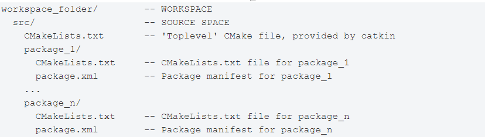

2. 创建工作空间
   
   

3. 使用`catkin_create_pkg`创建包，依赖于`std_msgs`,`rospy`，`roscpp`
   
   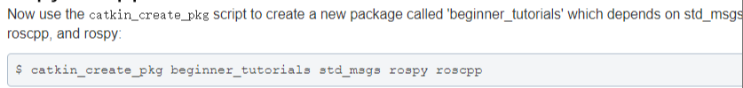
   
   执行上述命令后，会生成`beginer_turorials`文件夹，包含`cmakelists.txt`和`package.xml`

4. 编译包
   
   

5. 添加安装文件
   
   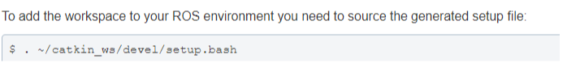

## 包依赖

- `fist-order dependencies`

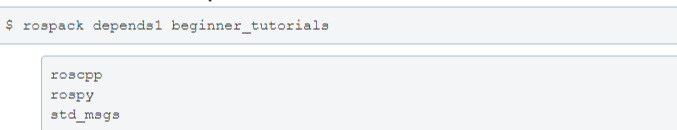

`rospack`列出了`catkin_create_pkg`使用的依赖，这些以来在`package.xml`文件中展示

- `indirect dependencies`间接依赖

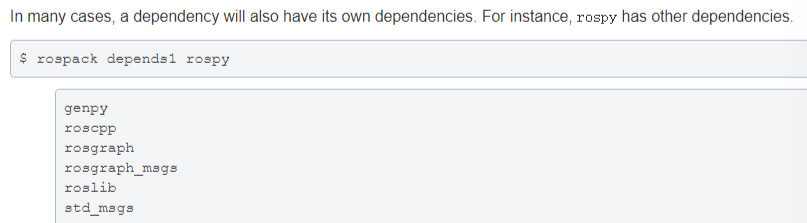

rospack可以递归地查找所有嵌套的依赖

## 定制包

1. 定制`package.xml`
   
   
   
   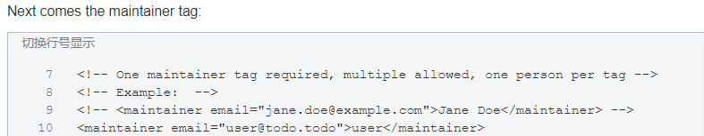
   
   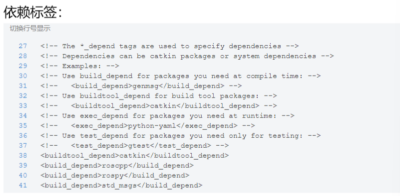
   
   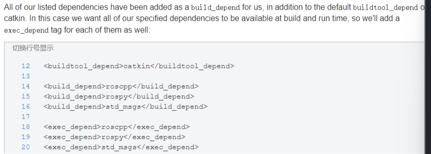

## catkin_ws

- 创建并初始化一个新的工作空间，
  
  ```shell
  mkdir -p ~/catkin_ws/src
  ```

- 编译该空间
  
  ```shell
  cd ~/catkin_ws
  catkin_make
  ```

- 定义catkin_ws空间所需的环境变量，执行此民工后，ros相关的命令可以找到此工作空间中的package
  
  ```shell
  source ~/catkin_ws/devel/setup.bash
  ```

- 验证ros空间添加到环境变量成功
  
  ```shell
  echo $ROS_PACKAGE_PATH
  ```

- 打开环境变量文件，加入
  
  ```shell
  source ~/catkin_ws/devel/setup.bash
  ```

## ros cpp

```
1 void ros::init()  解析ros参数，为本node命名
2 ros::NodeHandle Class
类成员函数：
  ros::Publisher advertise()
  ros::Subscriber subscribe()..

使用：
ros::NodeHandle nh;
ros::Publisher pub = nh.advertise();


3  ros::master Namespace  命名空间
常用函数：
bool check();
const string&getHost();

使用：
ros::master::check();

4 ros::service Namespace
常用函数：
bool call();
ServiceClient creatClient()
bool exist()
bool waitF

5 ros::names Namespace
常用函数：
string append()
sting clean()
const M_string & getRemapping()orService()
```

## ros topic

  功能描述：两个node，一个发布模拟GPS 信息（格式为自定义，包括坐标和工作状态），另有一个接受并处理该消息（计算到原点的距离）

  步骤：

package  包                        

```shell
cd catkin_ws/src    
catkin_create_pkg topic_demo roscpp rospy
std_msgs                          
```

msg  自定义消息格式

```shell
cd topic_demo

mkdir msg

cd msg

vi gps.msg
```

  定义好msg文件后，catkin编译，就会出现  `~/catkin_ws/devel/include/topic_demo/gps.h`，使用时直接:

```cpp
#include<gps.h>

topic_demo::gps msg;
```

talker.cpp

listener.cpp

CmakeList.txt & package.xml

# ORB_SALM 2

## 一些准备、编译

1. 编译：使用mkdir命令创建的ws需要编译一下，添加环境变量，将工作空间连接到ros运行环境

2. 相关模块安装
   
    sudo apt-get install libblas-dev liblapack-dev

3. opencv编译安装
   
   这步不多介绍，右手就行

4. pangolin安装
   
   编译安装：
   
   ```shell
   mkdir build
   cd build
   cmake -DCPP11_NO_BOOST=1 ..
   make
   ```

5. eigine
   
   - eigine使用3.2.10版本，否则orb-slam会失败
   
   - 下载源码，进入文件夹
     
     ```shell
     mkdir build 
     cd build 
     cmake ..
     make
     sudo make install
     ```

6. g2o

## orbslam编译

1. 解压`orb-slam`源码，打开终端
   
   ```shell
   chmod +x build.sh
   ./build.sh
   ```

2. `build_ros`编译使用
   
   ```shell
   chmod +x build_ros.sh
   ./build_ros.sh
   ```

3. `usb-cam`编译
   
   查看usb设备型号，（video0/video1），然后在`launch`中修改
   
   ```shell
   mkdir build 
   cd build
   cmake ..
   make
   catkin_make 
   #上面这句话在catkin_ws下进行
   ```

4. 编译后运行
   
   ```shell
   roscore
   roslaunch usb_cam usb_cam-test.launch
   rosrun ORB_SLAM2 Mono /home/sophyda/catkin_ws/src/ORB_SLAM2/Vocabulary/ORBvoc.txt /home/sophyda/catkin_ws/src/ORB_SLAM2/Examples/Monocular/TUM1.yaml
   ```

这时rviz应当是黑屏状态，原因是 orbslam并未订阅usb-cam的节点，所以：


## 问题

1. 提示

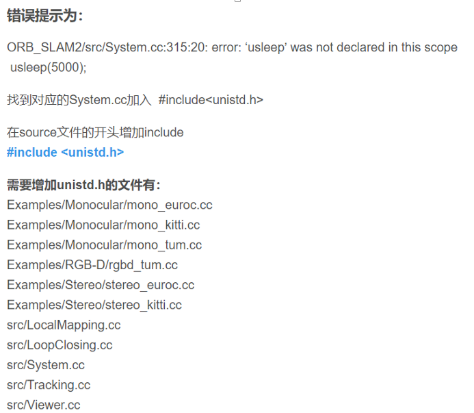

```cpp
#include<unistd.h>
```

2. 包问题
   
   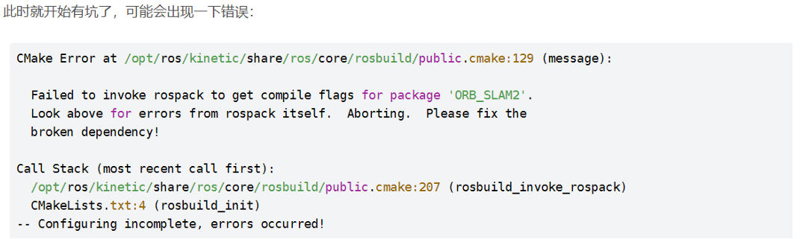
   
   ```shell
   sudo gedit /.bashrc
   export ROS_PACKAGE_PATH=${ROS_PACKAGE_PATH}:/home/sophyda/catkin_ws/ORB_SLAM2/Examples/ROS
   ```
   
   **注意：上述ros package在/.bashrc文件中添加**

***

如果还不行：

```shell
sudo rosdep fix-permissions
rosdep update
```

3. lboost问题
   
   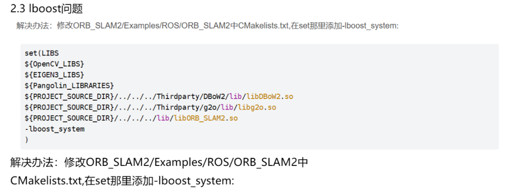
