# Unity

*COPYRIGHT @ SOPHDA *

## 使用vsc编写代码

在edit->preference中制定好vsc的路径，然后打开vsc，安装c#插件。如果想有代码提示，还需要安装.net框架，这部分按照vsc的提示来就好，在安装完成之后需要重新启动下windows。

> 如果还不行，可以使用下面的：把两项勾上
>
> 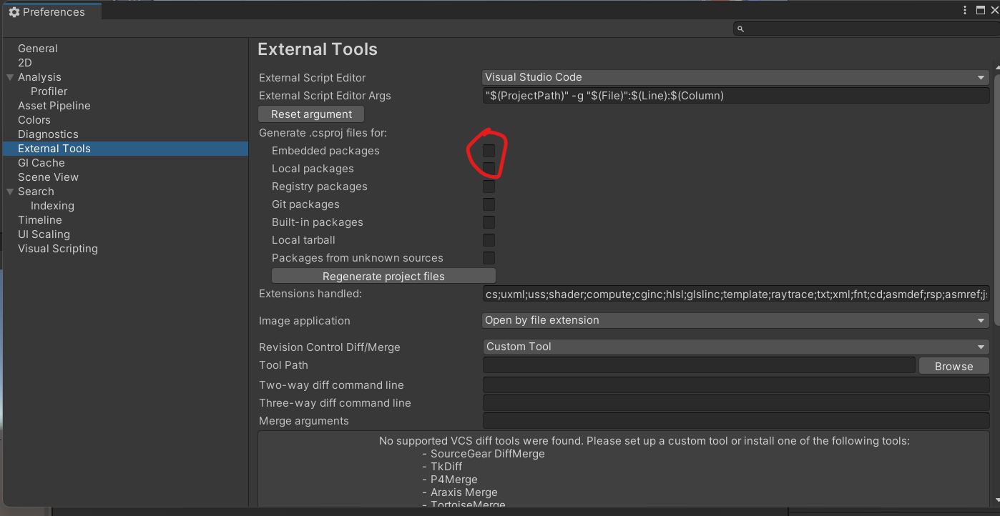
>
> 成功的标志是：有csproj这个文件
>
> 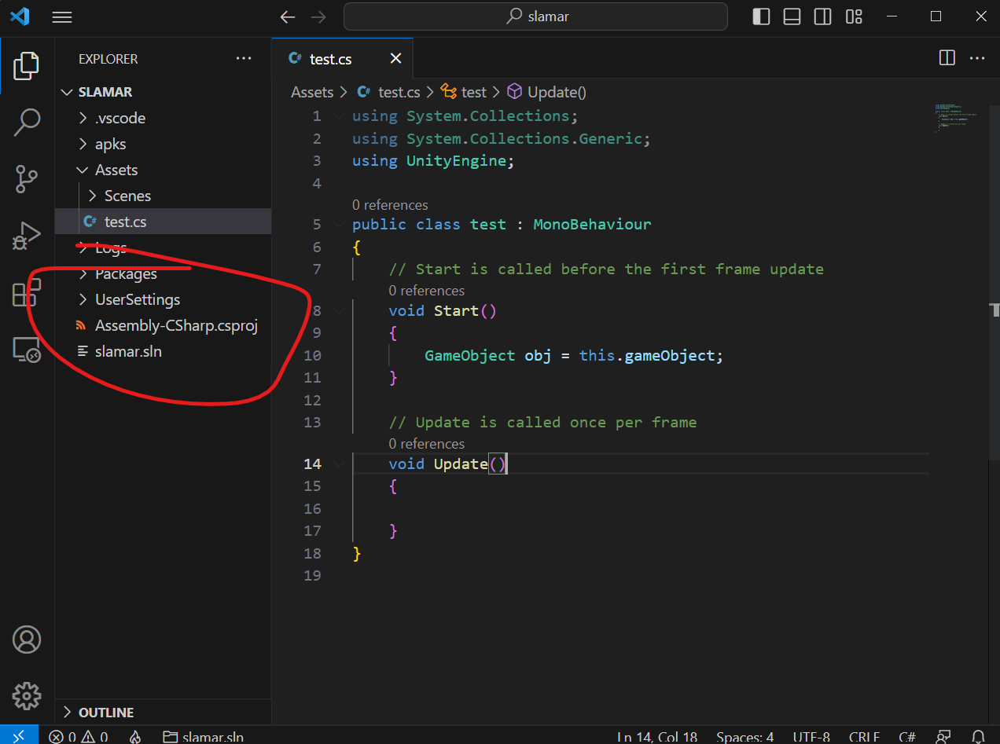

# Unity基础操作

使用unity个人版，教程链接：[2.3 Unity窗口布局_哔哩哔哩_bilibili](https://www.bilibili.com/video/BV1TZ4y1o76s?p=6&vd_source=bd4e6ed09b1d6487743fbfd26167e229)

## 窗口布局

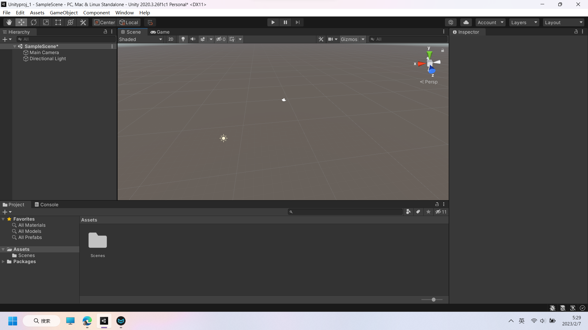

- Hierarchy 层级，双击层级里的对象可以放到视野中心
  
  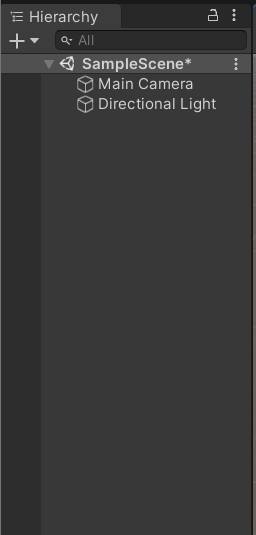

- 场景 可以理解为一个关卡
  
  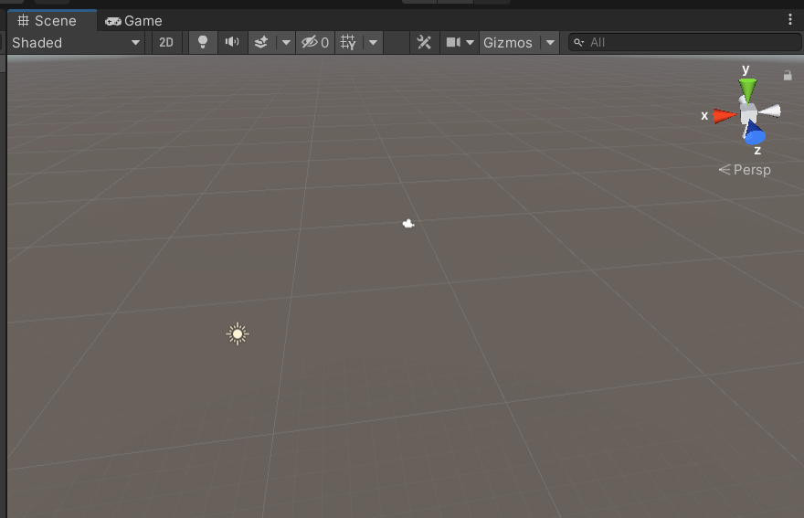

## 3D视图操作

- 导航器 gizmo 表示世界坐标的方向
  
  懒子（z）穿着红裤衩（x）
  
  >  1.点shift+小方块：重置，是y轴朝上
  > 
  > 2.点击x、y、z以不同视角来看
  
  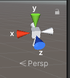

- 栅格 grid 表示xz坐标平面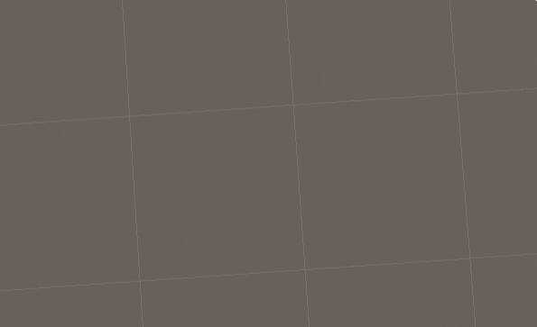

- 天空盒 skybox
  
  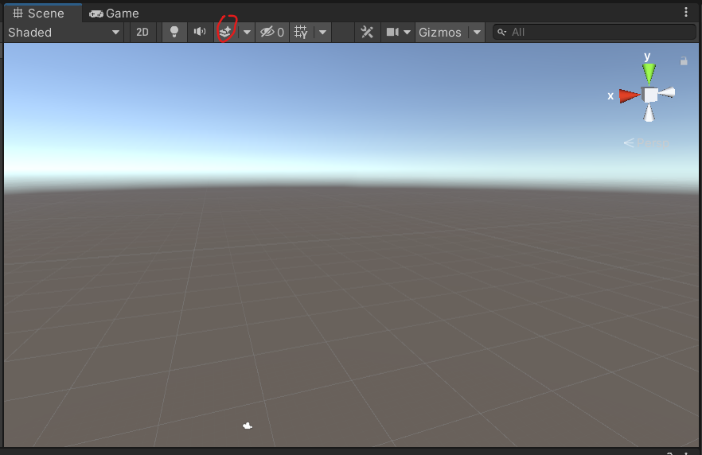

## 坐标系

左手坐标系，伸出你的左手

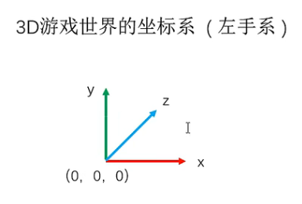

## 摄像机

调整摄像机到当前视角：align with view

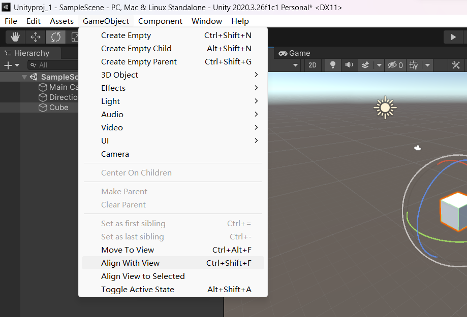

## 播放模式

点击play按钮后，会进入播放模式，值得注意的是：<u>在播放模式下做的任何修改都不会生效哦~</u>


# C#脚本

## 编写与挂载

> 设置脚本编辑器:
> 
> Unity：Edit->Preferences->ExternalTools->External Script Editor选择Visual Studio Code

1.在assets里面新建c#脚本

2.选择要挂载的对象，比如tube，然后将脚本拖到审查器（inspector）里，即可完成挂载

## 类操作

每一个函数都是一个类，类名与文件名必须一致

```csharp
using System.Collections;
using System.Collections.Generic;
using UnityEngine;

public class Basic_logic : MonoBehaviour
{
    // Start is called before the first frame update
    void Start()
    {
        Debug.Log("**hello");
        GameObject obj = this.gameObject;
// this表示本脚本，this.gameObject表示
// 本脚本挂载的对象
        string name = obj.name;
        Debug.Log(name);

        Transform trans = this.gameObject.transform;
// 读取transform值
        Vector3 pos = this.gameObject.transform.position;
        Debug.Log(pos);
    }

    // Update is called once per frame
    void Update()
    {

    }
}
```

## 物体坐标

> 父子关系：将一个对象移到另一个对象下面，构成父子关系。可以在移动父对象时，子对象也跟着动弹。
> 
> 如下图，cube和plane就构成了父子关系：
> 
> 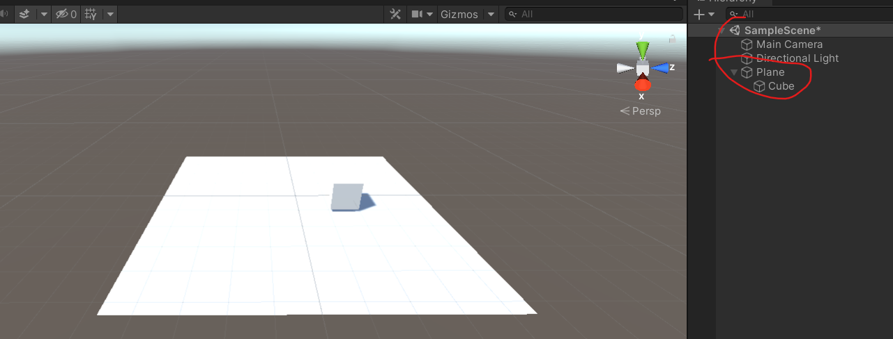

**1.作为子对象的cube就有两种坐标：**

- 全局坐标 transform.position

- 局部坐标 transform.localPosition

*只有transform对象才有这种属性*

```csharp
Transform trans = this.gameObject.transform;
Debug.Log("localpos: "+trans.localPosition+" position: "+trans.position);
```


**2.物体坐标设置**

```csharp
this.transform.localPosition = new Vector3(0, 10, 0);
// transform很常用,所以这句话就是指向了this.gameObject.transform
```

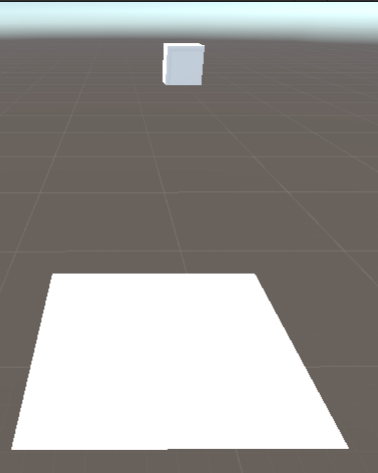

## 帧更新

update方法，在每一帧更新的时候都会调用这个方法。

**观察帧率：**

- Time.time 游戏当前帧的时间

- Time.deltatime 游戏距离上帧的时间

**设定期望帧率：**

```csharp
void Start()
{
Application.targetFrameRate = 60;
        // 期望的帧率
}
```

## 陀螺仪

> 使用的unity engine给的api，参考链接：[Unity的陀螺仪实现_J L-X的博客-CSDN博客_unity 陀螺仪](https://blog.csdn.net/weixin_43665612/article/details/115330643)(这里的蓝色栏表示的是补充说明哦~）

code:直接挂载到maincamera上就行

```csharp
// A code block
using UnityEngine;
using System.Collections;

public class camera : MonoBehaviour
{
    private const float lowPassFilterFactor = 0.8f;

    private Quaternion startQuaternion;

    private Quaternion originalQuaternion;

    private int frameCnt = 0;

    void Start()
    {
        //设置设备陀螺仪的开启/关闭状态，使用陀螺仪功能必须设置为 true  
        Input.gyro.enabled = true;
        //获取设备重力加速度向量  
        Vector3 deviceGravity = Input.gyro.gravity;
        //设备的旋转速度，返回结果为x，y，z轴的旋转速度，单位为（弧度/秒）  
        Vector3 rotationVelocity = Input.gyro.rotationRate;
        //获取更加精确的旋转  
        Vector3 rotationVelocity2 = Input.gyro.rotationRateUnbiased;
        //设置陀螺仪的更新检索时间，即隔 0.1秒更新一次  
        Input.gyro.updateInterval = 0.1f;
        //获取移除重力加速度后设备的加速度  
        Vector3 acceleration = Input.gyro.userAcceleration;
    }

    void Update()
    {
        frameCnt++;

        if (frameCnt > 5 && frameCnt <= 30)
        {
            originalQuaternion = transform.rotation;

            startQuaternion = new Quaternion(-1 * Input.gyro.attitude.x,
            -1 * Input.gyro.attitude.y,
            Input.gyro.attitude.z,
            Input.gyro.attitude.w);
            return;
        }

        Quaternion currentQuaternion = new Quaternion(-1 * Input.gyro.attitude.x, -1 * Input.gyro.attitude.y,
            Input.gyro.attitude.z, Input.gyro.attitude.w);

        //Quaternion deltaQuaternion = Quaternion.RotateTowards(startQuaternion, currentQuaternion, 180);

        //Input.gyro.attitude 返回值为 Quaternion类型，即设备旋转欧拉角  
        //transform.rotation = Quaternion.Slerp(transform.rotation, new Quaternion(-1*Input.gyro.attitude.x, -1*Input.gyro.attitude.y, Input.gyro.attitude.z, Input.gyro.attitude.w), lowPassFilterFactor);
        transform.rotation = Quaternion.Slerp(transform.rotation, originalQuaternion * Quaternion.Inverse(startQuaternion) * currentQuaternion, lowPassFilterFactor);
    }
}
```

## 镜头自由移动

```csharp
using System.Collections;
using System.Collections.Generic;
using UnityEngine;


public class movecam : MonoBehaviour
{
    private float speed = 4f;

    private Transform tr;

    private Vector3 mpStart;
    private Vector3 originalRotation;

    private float t = 0f;

    // 
    void Awake()
    {
        tr = GetComponent<Transform>();
        t = Time.realtimeSinceStartup;
    }

    // 
    void Update()
    {
        // Movement
        float forward = 0f;
        if (Input.GetKey(KeyCode.W) || Input.GetKey(KeyCode.UpArrow)) { forward += 1f; }
        if (Input.GetKey(KeyCode.S) || Input.GetKey(KeyCode.DownArrow)) { forward -= 1f; }

        float right = 0f;
        if (Input.GetKey(KeyCode.D) || Input.GetKey(KeyCode.RightArrow)) { right += 1f; }
        if (Input.GetKey(KeyCode.A) || Input.GetKey(KeyCode.LeftArrow)) { right -= 1f; }

        float up = 0f;
        if (Input.GetKey(KeyCode.E) || Input.GetKey(KeyCode.Space)) { up += 1f; }
        if (Input.GetKey(KeyCode.Q) || Input.GetKey(KeyCode.C)) { up -= 1f; }

        float dT = Time.realtimeSinceStartup - t;
        t = Time.realtimeSinceStartup;

        tr.position += tr.TransformDirection(new Vector3(right, up, forward) * speed * (Input.GetKey(KeyCode.LeftShift) ? 2f : 1f) * dT);

        // Rotation
        Vector3 mpEnd = Input.mousePosition;

        // Right Mouse Button Down
        if (Input.GetMouseButtonDown(1))
        {
            originalRotation = tr.localEulerAngles;
            mpStart = mpEnd;
        }

        // Right Mouse Button Hold
        if (Input.GetMouseButton(1))
        {
            Vector2 offs = new Vector2((mpEnd.x - mpStart.x) / Screen.width, (mpStart.y - mpEnd.y) / Screen.height);
            tr.localEulerAngles = originalRotation + new Vector3(offs.y * 360f, offs.x * 360f, 0f);
        }
    }
}
```


## 场景加载

加载场景的方式

```csharp
SceneManger.LoadScene("Myscene",LoadSceneMode.Single)
```

> LoadSceneMode.Single：覆盖之前的场景
> 
> LoadSceneMode.Additive:在原来场景的基础上加载

## 小地图与局部可见

### **小地图制作**

小地图也就是新建一个相机，然后将这个相机看到的渲染到canvas上面。

> 如果是将rendertexture制作成预制体（也就是在asset中新建一个texture，然后设置为camera的targettexture）会导致发布到Android手机上黑屏

需要使用动态创建的方式：

```csharp
    public Camera minicam;
    public RawImage rawImage;
    // Start is called before the first frame update
    void Start()
    {
        RenderTexture rt = new RenderTexture(256,256,24,RenderTextureFormat.ARGB32);

        minicam.targetTexture = rt;
        //这一部分只需要指定好，不需要更新
        rawImage.texture = rt;

    }
```

将camera设置为小地图需要看东西的那个相机，Rawimage设置为需要显示小地图的那个相机。

这个脚本随便挂载在一个地方即可。

### 局部可见

unity，你也不希望小地图里显示的乱七八糟的把~

可以使用层级，为**需要在小地图中显示的物体**设置一个独一无二的`layer`,然后使得主相机看不到这个，小地图相机可以看到。设置Camera中的**Culling Mask**选项

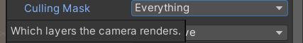

# 坐标

## transform

物体组件里的transform是表征的**物体相对于世界坐标的旋转和平移**。如果一个物体位于（0，10，0）的位置，修改他的rotation的角度，这个时候并不会围绕着世界坐标系进行旋转，而是围绕着自身的坐标系（这个坐标系不是欧拉角随着物体旋转的坐标系，而是与世界坐标系之间只有一个平移变换的那个）做变换。这样的效果就是：不管物体在什么地方，修改了rotation后，**等同于物体现在原处做好了rotate变换后在进行平移**

## 在物体正前方

```
Vector3 dir = cam.transform.forward*2.0f + cam.transform.position;
paimon.transform.position = dir;
```

cam.transform.forward表示指向cam前方的单位向量，*2后表示距离，然后再加上当前相机cam的世界坐标，即可表示在世界坐标系中cam正前方

## 旋转矩阵与向量

**就一般理性而言**，存在列向量a=(a1,a2,a3)与变换$R_1$，那么从列向量a变换到列向量b=(b1,b2,b3)为：$b=R_{1}a$.即a1,a2,a3在b1等上的分量

一般的向量即**列向量**，对应**左乘**一个旋转矩阵进行变换。

那么也存在$b^T=a^TR_1^T$，也就是同上，反过来的分量。总而言之，一般旋转矩阵变换一个列向量。

## 旋转矩阵转四元数

```c#
Matrix4x4 rot = new Matrix4x4();
rot.SetTRS(new Vector3(0,0,0),q,new Vector3(1,1,1));
		
Vector4 vy = rot.GetColumn(1);
Vector4 vz = rot.GetColumn(2);
		
Quaternion newQ = Quaternion.LookRotation(new Vector3(vz.x,vz.y,vz.z),new Vector3(vy.x,vy.y,vy.z));
```

我测你，原来有这种用法？拿到一个旋转矩阵rot，然后取他的1、2列构成vec4，使用`Quaternion.LookRotation`就可以把这个旋转矩阵转化为四元数了，我还好奇这他妈的是什么奇怪的变换。。

**注意！** `static Quaternion LookRotation(Vector3 forward,Vector3 upwards);`这个函数的1、2个参数含义不同，但是这只是改变了模型的方向，尽管两个参数的位置不同，他们都是可以确定一个坐标系的，进而实现完整的旋转。旋转的变化也会同步，只是模型的指向不同了而已。

## 与ORBSLAM 2

ORBSLAM2是给出了相机->世界坐标系的变换，而且是右手系。unity中是左手坐标系。

如何对齐呢，把orbslam看成是imu，最终的效果保持：手机怎么动，unity中的相机怎么动，管他的orbslam什么坐标系呢？！

至于左手系与右手系的关系，可以把旋转矩阵转换为欧拉角，然后对应到unity中，一个轴一个轴的对应。

平移的话，需要先获得orbslam中世界坐标系中的相机位置，参考《视觉SLAM十四讲》中的观点，对于$T_{cw}$需要做一下变换
$$
T_{cw}=\begin {bmatrix}
R & t \\
0 & 1
\end {bmatrix}
\\
P_{cam}=-R^{T}*t \\
R_{cam}=-R^T
$$
具体的还要根据unity中的坐标和旋转方向进行细调。（诸如：欧拉角取反等）

**还有一件事！**如果在unity中同步了相机的位姿和位移，但是相机移动起来感觉模型不是特别同步？这是因为相机的视野太广了，导致绕z轴旋转可以跟踪的很好，但是绕x、y旋转或平移就很出戏（相机视角太广，即使相机是的的确确移动了的，但是模型还是处在相机的视野中，看起来跟没动一样，导致体验不好）。所以**调小camera->field of view**

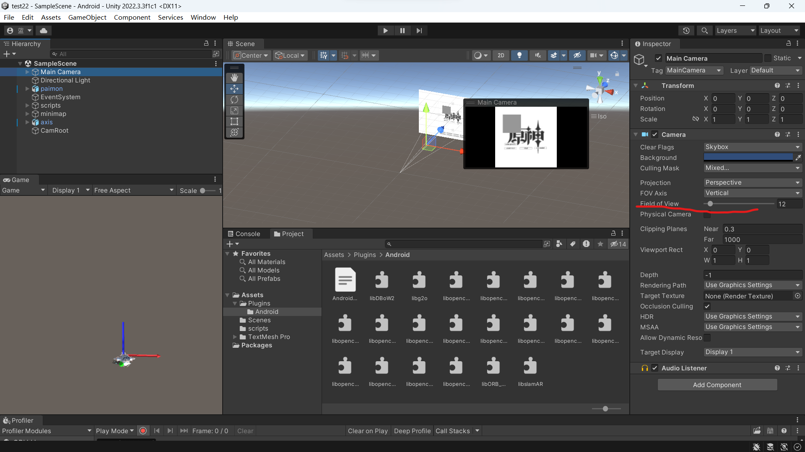

# CardBoard VR

您可以使用 Cardboard SDK 将智能手机转变成 VR 平台。智能手机可以呈现立体呈现的 3D 场景、跟踪头部移动并做出反应，还能通过检测用户何时按观看者按钮来与应用互动。

## 设置开发环境

- unity 2020.3.36f1,提供Android支持

- 安装git

## 导入SDK

1. 打开 Unity 并创建新的 **3D** 项目。

2. 在 Unity 中，依次转到 **Window** > **Package Manager**。

3. 点击 **+**，然后选择 **Add package from git 网址**。

4. 将 `https://github.com/googlevr/cardboard-xr-plugin.git` 粘贴到文本输入字段中。  
   应将软件包添加到已安装的软件包。

5. 转到**适用于 Unity 的 Google Cardboard XR 插件**软件包。在**示例**部分中，选择**导入到项目中**。  
   示例资源应加载到 `Assets/Samples/Google Cardboard/<version>/Hello Cardboard`。
   
   > 这一步直接在project里面选择

6. 转到 `Assets/Samples/Google Cardboard/<version>/Hello Cardboard/Scenes`，选择 **Add Open Scenes**，然后选择 **HelloCardboard** 以打开示例场景。

## 配置 Android 项目设置

依次转到 **File** &gt **Build Settings**。

1. 选择 **Android**，然后选择**切换平台**。
2. 选择 **Add Open Scenes**，然后选择 **HelloCardboard**。

依次转到 **Project Settings** > **Player** > **Resolution and Presentation**。

1. 将**默认方向**设为**横向**或**横向**。
2. 停用**经过优化的帧同步**。

**other settings**

> 这一步非常关键，正确配置sdk版本和架构

依次转到 **Project Settings** > **Player** > **Other Settings**。

1. 在 **Graphics API** 中选择 `OpenGLES2`、`OpenGLES3` 或 `Vulkan` 或它们的任意组合。
2. 在**最低 API 级别**中选择 `Android 7.0 'Nougat' (API level 24)` 或更高版本。
3. 在**目标 API 级别**中选择 `API level 31` 或更高版本。
4. 在 **Scripting Backend** 中选择 `IL2CPP`。
5. 在**目标架构**中选择 `ARMv7` 和/或 `ARM64`，以选择所需的架构。
6. 在**互联网访问**中选择 `Require`。
7. 在**软件包名称**下指定您的公司域名。
8. 如果选择 `Vulkan` 作为 **Graphics API**：
   - 取消选中 **Vulkan 设置**中的**在渲染过程中应用显示屏旋转**复选框。
   - 如果 Unity 版本为 2021.2 或更高版本，请选择**纹理压缩格式**中的 `ETC2`。

**发布设置**

依次转到 **Project Settings** &gt **Player** &**Publishing Settings**

1. 在 **Build** 部分中，选择 `Custom Main Gradle Template` 和 `Custom Gradle Properties Template`。

2. 将以下代码行添加到 `Assets/Plugins/Android/mainTemplate.gradle` 的依赖项部分：
   
   ```
   implementation 'androidx.appcompat:appcompat:1.4.2'  implementation 'com.google.android.gms:play-services-vision:20.1.3'  implementation 'com.google.android.material:material:1.6.1'implementation 'com.google.protobuf:protobuf-javalite:3.19.4'
   ```

3. 将以下几行代码添加到 `Assets/Plugins/Android/gradleTemplate.properties`：
   
   ```
   android.enableJetifier=true  
   android.useAndroidX=true
   ```

**XR插件管理**

依次转到 **Project Settings**（项目设置）和 **XR Plug-in Management**（XR 插件管理）。

1. 在**插件提供程序**下选择 `Cardboard XR Plugin`。

**构建您的项目**

依次转到 **File** &gt **Build Settings**。

1. 选择 **Build**，或选择设备并选择 **Build and Run**。

**其他**

依次转到 **Project Settings** > **Player** > **Other Settings**。

1. 在**相机使用说明**中，输入 `Cardboard SDK requires camera permission to read the QR code (required to get the encoded device parameters).`。
2. 在**目标 iOS 最低版本**中，输入 `12.0`。
3. 在**软件包名称**下指定您的公司域名。

**XR 插件管理设置**

依次转到 **Project Settings**（项目设置）和 **XR Plug-in Management**（XR 插件管理）。

1. 在**插件提供程序**下选择 `Cardboard XR Plugin`。

## 镜头移动--camera为root

> cardboard提供的是rotation和position的跟踪（加载默认的hello cardboard场景的情况下），我们要**使用手机跟踪rotation，用键盘的wasd来控制移动**

1. 将player中的camera移出来，然后删除player，然后将`camera->tracked pos driver->tracking type`中改为`rotation only`即可

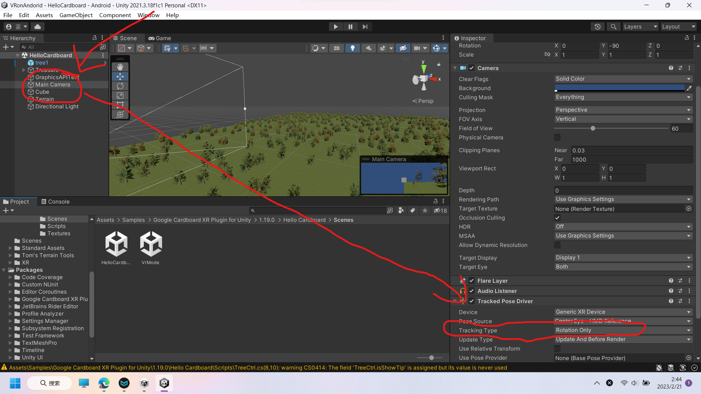

2. 然后要监听键盘wasd，只需要在camera脚本上添加监听即可。完整cs：

```csharp
//-----------------------------------------------------------------------
// <copyright file="CameraPointer.cs" company="Google LLC">
// Copyright 2020 Google LLC
//
// Licensed under the Apache License, Version 2.0 (the "License");
// you may not use this file except in compliance with the License.
// You may obtain a copy of the License at
//
//     http://www.apache.org/licenses/LICENSE-2.0
//
// Unless required by applicable law or agreed to in writing, software
// distributed under the License is distributed on an "AS IS" BASIS,
// WITHOUT WARRANTIES OR CONDITIONS OF ANY KIND, either express or implied.
// See the License for the specific language governing permissions and
// limitations under the License.
// </copyright>
//-----------------------------------------------------------------------

using System.Collections.Generic;
using System.Collections;
using UnityEngine;

/// <summary>
/// Sends messages to gazed GameObject.
/// </summary>
public class CameraPointer : MonoBehaviour
{
    private const float _maxDistance = 10;
    private GameObject _gazedAtObject = null;

    /// <summary>
    /// Update is called once per frame.
    /// </summary>
    /// 

    private float speed = 4f;

    private Transform tr;

    private Vector3 mpStart;
    private Vector3 originalRotation;
    private Vector3 rot;
    private Vector3 zero = new Vector3(0,0,0);

    private float t = 0f;

    // 
    void Awake()
    {
        tr = GetComponent<Transform>();
        t = Time.realtimeSinceStartup;


    }
    public void Start()
    {
       // tr.localEulerAngles = zero;
    }


    public void Update()
    {

        // Movement
        float forward = 0f;
        if (Input.GetKey(KeyCode.W) || Input.GetKey(KeyCode.UpArrow)) { forward += 1f; }
        if (Input.GetKey(KeyCode.S) || Input.GetKey(KeyCode.DownArrow)) { forward -= 1f; }

        float right = 0f;
        if (Input.GetKey(KeyCode.D) || Input.GetKey(KeyCode.RightArrow)) { right += 1f; }
        if (Input.GetKey(KeyCode.A) || Input.GetKey(KeyCode.LeftArrow)) { right -= 1f; }

        float up = 0f;
        if (Input.GetKey(KeyCode.E) || Input.GetKey(KeyCode.Space)) { up += 1f; }
        if (Input.GetKey(KeyCode.Q) || Input.GetKey(KeyCode.C)) { up -= 1f; }

        float dT = Time.realtimeSinceStartup - t;
        //float dT = Time.deltaTime;
        t = Time.realtimeSinceStartup;

        tr.position += tr.TransformDirection(new Vector3(right, up, forward) * speed * (Input.GetKey(KeyCode.LeftShift) ? 2f : 1f) * dT);

        Debug.Log(tr.position);

        // Casts ray towards camera's forward direction, to detect if a GameObject is being gazed
        // at.
        RaycastHit hit;
        if (Physics.Raycast(transform.position, transform.forward, out hit, _maxDistance))
        {
            // GameObject detected in front of the camera.
            if (_gazedAtObject != hit.transform.gameObject)
            {
                // New GameObject.
                _gazedAtObject?.SendMessage("OnPointerExit");
                _gazedAtObject = hit.transform.gameObject;
                _gazedAtObject.SendMessage("OnPointerEnter");
            }
        }
        else
        {
            // No GameObject detected in front of the camera.
            _gazedAtObject?.SendMessage("OnPointerExit");
            _gazedAtObject = null;
        }

        // Checks for screen touches.
        if (Google.XR.Cardboard.Api.IsTriggerPressed)
        {
            _gazedAtObject?.SendMessage("OnPointerClick");
        }


    }

}
```

## 镜头移动--player为root

> 在不断地debug过程中，发现cardboard改变的是localeula角度，所以给camera一个父级player，控制player和camera是不可取的。因为localeular是改变的。

所以，为了加入碰撞检测，需要给camera增加父对象player，但是不用添加任何控制脚本，只需要添加`Rigridbody`和`capsule collider`即可，前者刚体增加重力效果，后者增加碰撞检测效果。

然后将camera控制脚本放到player下面即可。相当于player只是起到了碰撞检测+重力的效果。

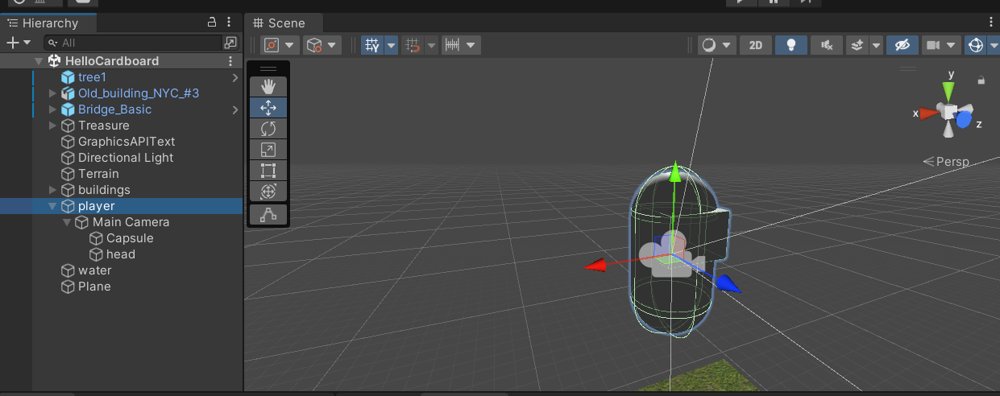

## canvas使用

> 应用场景：在物体的上文显示文字等内容。gui无法在vr模式中显示，所以使用canvas，将3D世界中的canvas作为一个ui界面。

1. 首先创建一个canvas，然后放到要显示的物体下面（比如tree上），然后调整好位置。因为要显示文字，还需要textmeshpro，同样放到canvas下面。层级关系为：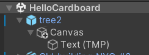

2. 设置canvas属性

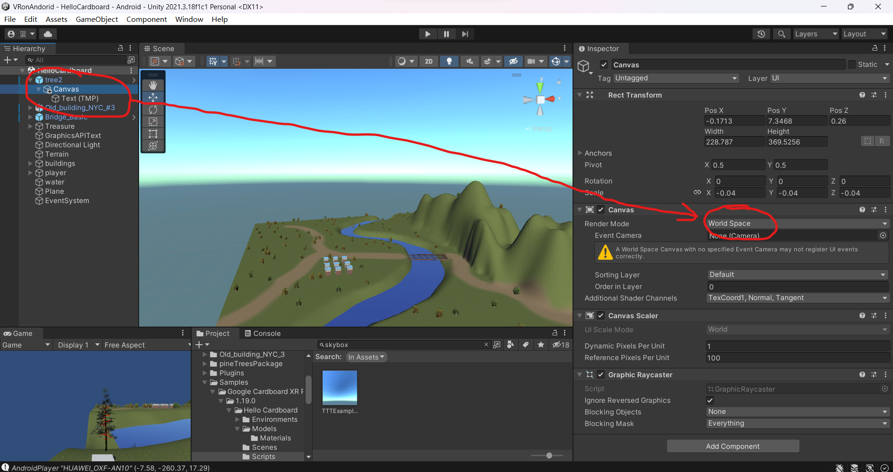

3. 为**tree2**编写脚本，设定功能为：**当检测到射线的时候，显示canvas。并把canvas的欧拉角设置为和camera相同，从而实现跟随视角移动**

> 相关api：
> 
> 1. transform.find("")  // 找孩子节点，返回的是transform
> 
> 2. transform.GetComponent<>();  //找到该transform下的组件，如rigridbody等
> 
> 3. Transform tr = GameObject.Find("Main Camera").transform;  //在全局内寻找对象，并返回transfrom对象

```csharp
using System.Collections;
using System.Collections.Generic;
using UnityEngine;
using UnityEngine.UI;
using TMPro;


public class TreeCtrl : MonoBehaviour
{

    private TextMeshProUGUI tm;
    private Transform canvas;
    private Transform cam;


    // Start is called before the first frame update
    void Start()
    {

        canvas = transform.Find("Canvas");
        tm = canvas.Find("Text (TMP)").GetComponent<TextMeshProUGUI>();
        tm.text = "hello";

        canvas.gameObject.SetActive(false);
    }

    private void Update()
    {
        //Debug.Log("tree "+ GameObject.Find("Main Camera").transform.position);
        cam = GameObject.Find("Main Camera").transform;
        canvas.localEulerAngles = cam.localEulerAngles;


    }

    // Update is called once per frame

    public void OnPointerEnter()
    {
        Debug.Log("HELLO");
        canvas.gameObject.SetActive(true);

    }

    /// <summary>
    /// This method is called by the Main Camera when it stops gazing at this GameObject.
    /// </summary>
    public void OnPointerExit()
    {
        canvas.gameObject.SetActive(false);
    }


}
```

## 一些坑

1.项目导出的时候会报错（build and run时），一般改下路径即可

2.直接在官方默认的hellocardboard里面开始折腾就可以了哦~

3.官方的light要调节一下，否则看不清地形的材质


## test


# 模型

## blender模型

可以直接导入fbx格式的模型，这个基本上包含了光照、纹理等

## 点云或者ply文件导入

1. ply文件，首先转换为pcd的点云格式
2. pcd文件，间接显示，主要是利用unity的粒子系统，把点云中的每个点用粒子系统渲染出来，一个个加进去
3. 有个插件叫做point cloud viewer，但是对vr支持不太行，盲猜是渲染引擎的问题，手机上用的是Vulcan

## mashroom等obj+mtl的

这就很方便了，obj是默认不带顶点颜色的，把所有文件（obj+mtl配置文件+贴图文件）导入到unity中，然后可以直接观察到带纹理的模型，这就很方便。这种方法可以同样导入到blender中，然后再纹理视图可以观察到有色的模型。

## pmx格式

> 比如说导入原神的pmx格式文件，需要使用到blender->cats插件，unity捯饬，真的麻烦。有的地方也是莫名其妙的。。不过能见到可爱的纳西妲、派蒙，嘿嘿嘿

1. 首先在“模之屋”上面下载模型，一般是.pmx文件+tex文件夹

2. 使用blender中的cats插件导入，即import model，导入成功后，在视图着色模式下是可以正常显示的。

3. 在cats插件中，fix model，这一步是对模型进行重新骨骼命名，删除一些顶点组等。在旁边的设置选项中**取消勾选keep upper chest**，这样是为了防止导入到unity中后头部骨骼弯曲

   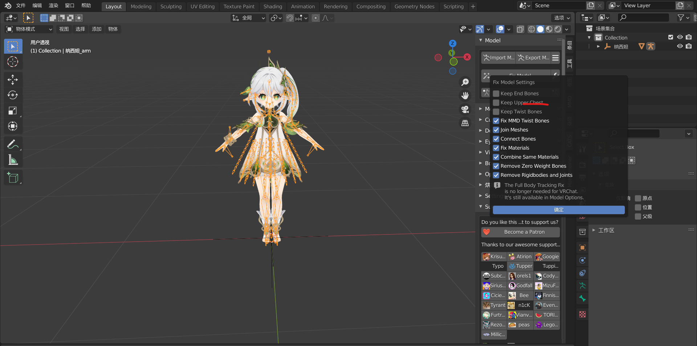

4. 在cats插件中选择export model为fbx文件

5. 将导出的**fbx文件+tex文件夹**拖拽进入unity，这样子导入的模型有几个问题：模型太亮了；头发是黑的；披风单面可见（面片材质）

   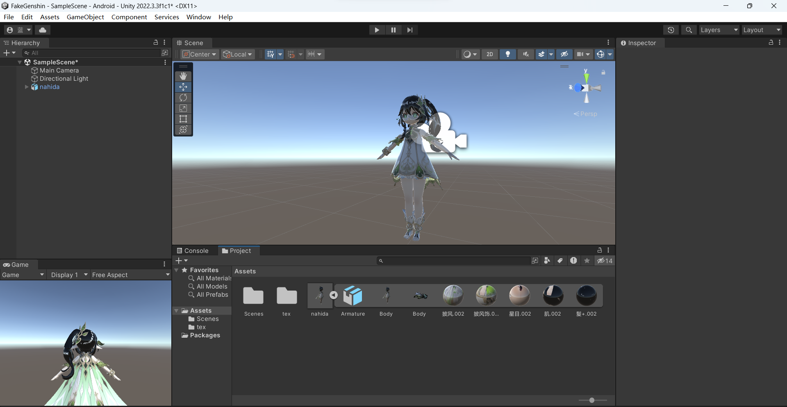

为了解决上述问题，需要具体**修改模型的材质**，但是fbx关联了tex文件夹，将材质固连到fbx内部了，所以需要将模型的材质**设置为外部进而方便修改**，如下所示：（在apply之后，就会出现一个materials的文件夹，里面就可以对模型材质进行具体修改了）

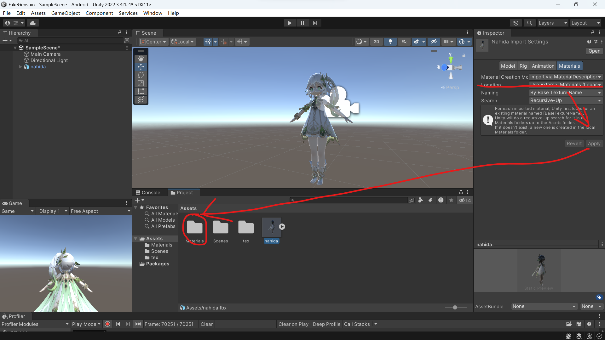

- 模型高光、反射问题：修改shader。将materials里的所有材质的shader修改为**unlit-texture**

  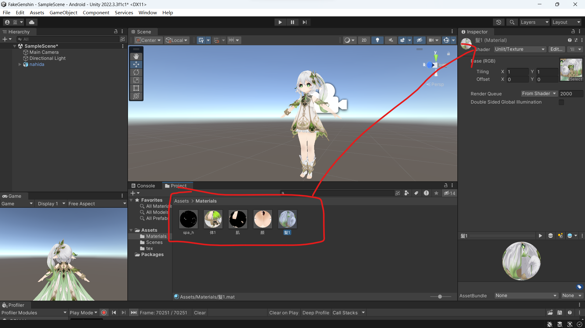

- 小披风问题：由于披风模型是个面片，所以需要修改为双面显示。通过观察，披风的材质是由头发的那个决定的，将shader修改为：

  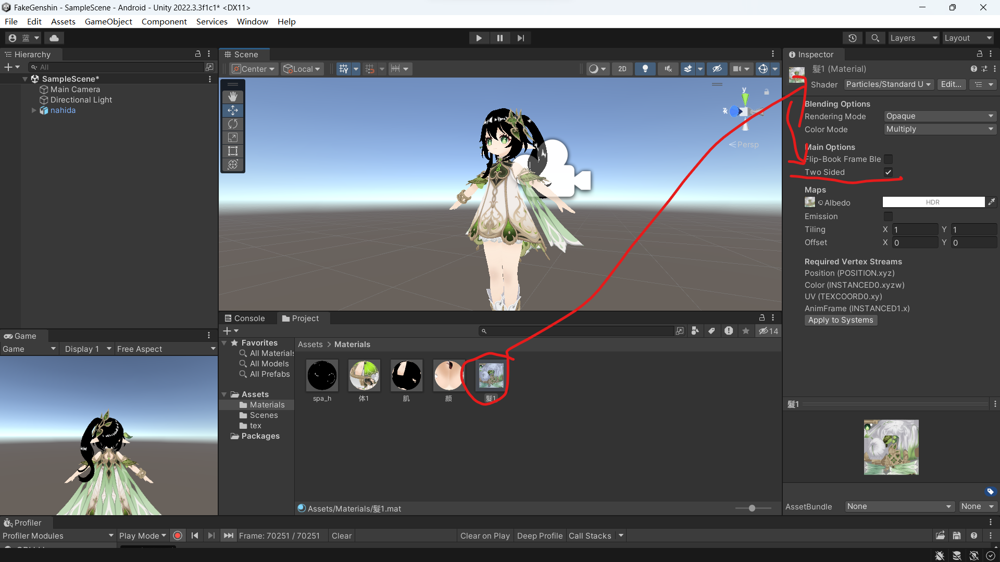

  好消息：披风看见了。坏消息：这个时候头发又变黑了！这时候需要**修改：rendering mode为cutout**，至于原理，咱也不知道这个模型的头发是怎么处理的。unity官方的rendering mode是：

  - opaque：不透明，默认值，适用于没有透明区域的普通实体对象。
  - cutout：剪切，允许您创建在不透明和透明区域之间具有硬边的透明效果。在此模式下，没有半透明区域，**纹理要么 100% 不透明，要么不可见。**当使用透明度创建材料（如树叶或带有孔洞和破烂的布）的形状时，这很有用。
  - 其他。。。。

  推测模型的头发可能有一层透明的，但是选择了不透明后就把头发的原材质给遮住了，选择了cutout后就把这一层给不可见了。

  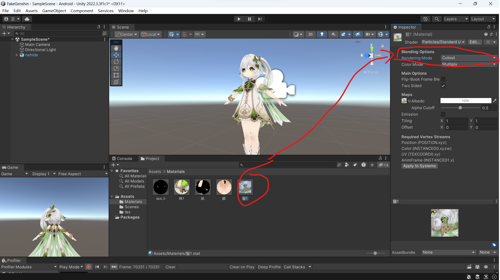

# Android开发

2023/7/14 想用unity开发安卓真的破大防，显示在2021年的两个版本中挣扎，他妈的一个导出的apk有毛病，一个不能导入fbx模型动画，最后还是换成了最新版的2022/3.3f1c1才行的，然后是安装额外的sdk和ndk卧槽，下了这么多没用的东西。不过比起java感觉好点哎~

## 动态库（so）

1. 首先配置好ndk，只需要ndk就可以了，然后再bashrc中配置好环境变量

2. 编写动态库源文件及CMakeList.txt，这里要注意几点，cmakelist中需要指定**输出为library**.**同时C要大写**

   ```c++
   #include <stdio.h>
   extern "C" {
   void HelloFunc()
   {
       printf("Hello World\n");
   }
   }
   extern "C" {
   int add(int a,int b)
   {
           return a+b;
   }
   }
   ```

   ```cmake
   # CMake最低版本号要求
   cmake_minimum_required(VERSION 3.6)
   
   # 项目信息
   project (libfun)
   # CMake最低版本号要求
   # CMake最低版本号要求
   SET(ANDROID_ABI armeabi-v7a)
   SET(ANDROID_ARM_MODE arm)
   
   SET(LIBHELLO_SRC libfun.cpp)
   ADD_LIBRARY(libfun SHARED ${LIBHELLO_SRC})
   ```

3. 编译，在尝试后，两种方式：

   - cmake-gui：只需要指定**编译工具链的cmake文件即可**，如下面的`android.toolchain.cmake`

     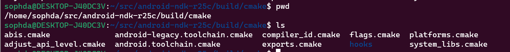

   - 使用命令行，如下，首先进入build文件夹，

     ```
     cmake  ..   -DCMAKE_TOOLCHAIN_FILE=$NDK/build/cmake/android.toolchain.cmake     -DANDROID_ABI=armeabi-v7a     -DANDROID_PLATFORM=android-$MINSDKVERSION  -DANDROID_ARM_MODE=arm -DANDROID_PLATFORM=android-23
     ```

     具体的参数解释为：

     - `ANDROID_ABI`：目标 ABI。如需了解支持的 ABI
     - `ANDROID_PLATFORM`：指定应用或库所支持的最低 API 级别。此值对应于应用的 `minSdkVersion`

4. 在unity中创建文件夹，**层级为Assets->Plugins->Android**，然后将动态库放到这个地方

5. 调用，有几点注意：

   - 调用动态库，需要引用`using System.Runtime.InteropServices;`
   - 在**每个**动态库函数声明前，需要用`[DllImport("liblibfun")]`

   ```csharp
   using System.Collections;
   using System.Collections.Generic;
   using UnityEngine;
   using System.Runtime.InteropServices;
   
   public class androidso : MonoBehaviour
   {
       [DllImport("liblibfun")]
       public static extern void HelloFunc();
   
       [DllImport("liblibfun")]
       public static extern int add(int a,int b);
       int  result;
       // Start is called before the first frame update
       // GameObject obj;
       Vector3 pos;
   
       void Start()
       {
           int x = 1;
           int y = 1;
           result = add(x,y);   
    
           this.transform.localPosition = new Vector3(0,result,0);
             Debug.Log("hello");
           Debug.Log(result);
       }
   
       // Update is called once per frame
       void Update()
       {
           Debug.Log("hello");
           Debug.Log(result);
   
       }
   }
   
   ```

6. 打包，这里没什么说的，就是so库运行不能再电脑上看到效果，必须要打包到手机上。不过可以用debug来看到打印输出：下面不要选这个折叠。

   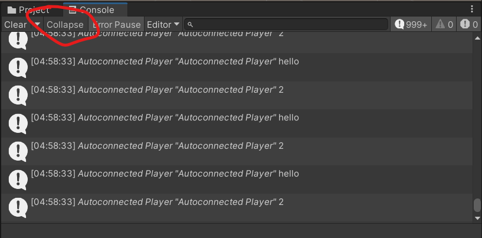

   在跳舞的派蒙，可爱，超了~

   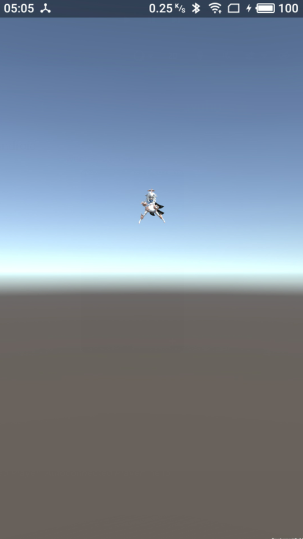

## Android11 强制存储分区

由于Android11强制进行存储分区，所以使用c++ jni获取根目录下的文件需要“获得所有文件读取权”。

1. 首先在Androidmanifest.xml中：

   ```xml
   <manifest xmlns:android="http://schemas.android.com/apk/res/android"
       xmlns:tools="http://schemas.android.com/tools"
       package="com.example.demo">
   
       <uses-permission android:name="android.permission.MANAGE_EXTERNAL_STORAGE"
           tools:ignore="ScopedStorage" />
   
   </manifest>
   ```

   指定“权限”为管理外部存储并忽略存储分区“ScopeStorage”。

   **在application中，加入**

   ```
   <application>
   	android:requestLegacyExternalStorage="true"
   	......
   	......
   </application>
   
   ```

   参考：

   ```xml
   <?xml version="1.0" encoding="utf-8"?>
   <manifest xmlns:android="http://schemas.android.com/apk/res/android" package="com.unity3d.player" xmlns:tools="http://schemas.android.com/tools">
     <uses-permission android:name="android.permission.WRITE_EXTERNAL_STORAGE" />
     <uses-permission android:name="android.permission.INTERNET" />
     <uses-permission android:name="android.permission.CAMERA" />
     <uses-permission android:name="android.permission.WRITE_EXTERNAL_STORAGE" />
     <uses-permission android:name="android.permission.READ_EXTERNAL_STORAGE" />
     <uses-permission android:name="android.permission.MANAGE_EXTERNAL_STORAGE" tools:ignore="ScopedStorage" />
     <uses-feature android:glEsVersion="0x00030001" />
     <uses-feature android:name="android.hardware.vulkan.version" android:required="false" />
     <uses-feature android:name="android.hardware.camera" android:required="false" />
     <uses-feature android:name="android.hardware.camera.autofocus" android:required="false" />
     <uses-feature android:name="android.hardware.camera.front" android:required="false" />
     <uses-feature android:name="android.hardware.touchscreen" android:required="false" />
     <uses-feature android:name="android.hardware.touchscreen.multitouch" android:required="false" />
     <uses-feature android:name="android.hardware.touchscreen.multitouch.distinct" android:required="false" />
     <application android:extractNativeLibs="true"
                  android:requestLegacyExternalStorage="true">
       <meta-data android:name="unity.splash-mode" android:value="0" />
       <meta-data android:name="unity.splash-enable" android:value="True" />
       <meta-data android:name="unity.launch-fullscreen" android:value="True" />
       <meta-data android:name="unity.allow-resizable-window" android:value="False" />
       <meta-data android:name="notch.config" android:value="portrait|landscape" />
       <meta-data android:name="unity.auto-report-fully-drawn" android:value="true" />
       <activity android:name="com.unity3d.player.UnityPlayerActivity" android:theme="@style/UnityThemeSelector" android:requestLegacyExternalStorage="true" android:screenOrientation="reverseLandscape" android:launchMode="singleTask" android:configChanges="mcc|mnc|locale|touchscreen|keyboard|keyboardHidden|navigation|orientation|screenLayout|uiMode|screenSize|smallestScreenSize|fontScale|layoutDirection|density" android:resizeableActivity="false" android:hardwareAccelerated="false" android:exported="true">
         <intent-filter>
           <category android:name="android.intent.category.LAUNCHER" />
           <action android:name="android.intent.action.MAIN" />
         </intent-filter>
         <meta-data android:name="unityplayer.UnityActivity" android:value="true" />
         <meta-data android:name="notch_support" android:value="true" />
       </activity>
     </application>
   </manifest>
   ```

   

2. 在unity中导出Android项目，在java文件中的onStart()中修改

   ```java
   if (Build.VERSION.SDK_INT < Build.VERSION_CODES.R ||
                   Environment.isExternalStorageManager()) {
               Toast.makeText(this, "已获得访问所有文件的权限", Toast.LENGTH_SHORT).show();
           } else {
               Intent intent = new Intent(Settings.ACTION_MANAGE_ALL_FILES_ACCESS_PERMISSION);
               startActivity(intent);
           }
   ```

   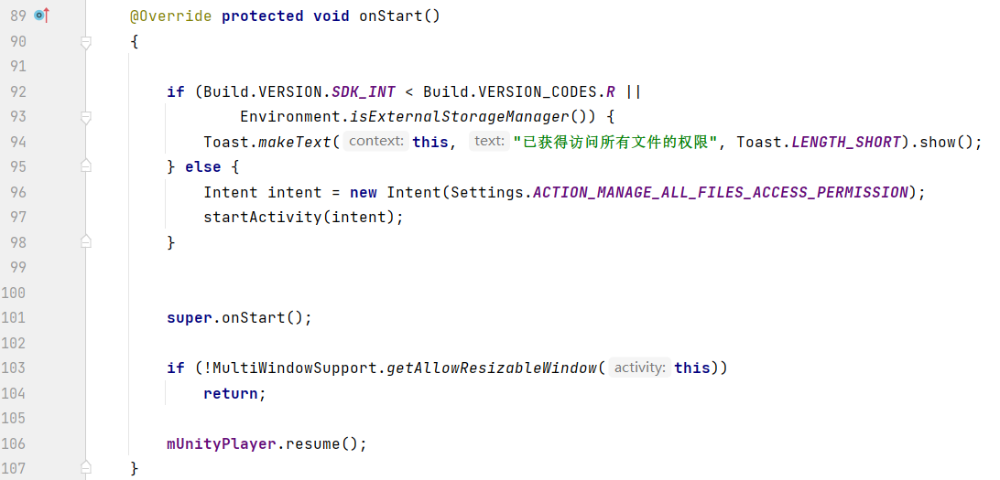


# AR ORBSLAM3-Based

## 动态库编译移植

和orbslam2移植其实没有太大的区别，唯一要注意的是移植boost依赖库相关的部分，尤其是archive中的，这一部分应该是刚需动态库移植的，但是并没有成功。因此保留serialization并且去除archive

## Boost库移植（static）

使用的是来自boost-for-Android的项目[moritz-wundke/Boost-for-Android: Android port of Boost C++ Libraries (github.com)](https://github.com/moritz-wundke/Boost-for-Android)，需要在虚拟机环境中，在wsl中会报错（File/NVidia的错误，so,nvidia ,fuck you! ）

相关配置：NDK:R25C    boost：1.82  Ubuntu18.04

按照GitHub博主给出的步骤，首先，额没有首先，就一步：

```
./build-android.sh $(NDK_ROOT)
```

然后就会在目录里面生成一个build文件，里面有你想要的~

**如果编译动态库的话，会有很多.so库带着版本号的后缀，如libxxx.so.1.80.0，这是不会被unity识别到的，因为这些还有.so库是这些库的软连接**

所以直接上静态库，.a格式的文件，需要修改的就是：

```
build-android.sh中：
修改：（默认情况就是这个）
link=static
```

然后：

```
./build-android.sh $(NDK_ROOT)
```

会产生一系列的a静态库，我们需要这几个，主要是序列化相关的：


同时，需要同步修改cmakelist文件，将生成的库orbslam库链接到这些静态库上，这里在实验中，只需要把cmakelist中的：

```
link_directories()
target_link_libraries()
```

这两个修改一下就可以，本质上跟动态库的链接方式一样的，但是你要是用`readeld -a xxx.so | grep "Shared"`来找的话，是不会显示静态库的哦~

> 其实在网上找到的链接静态库的例子中，是这样子的：(也就是说，即使是静态库，也是用target_link_libraries来链接的)
>
> 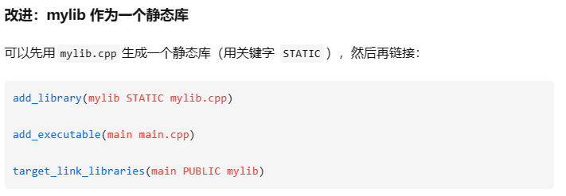

最后，在完成链接后，**保留slam源码的src/system.cc中的boost serialization部分，构建也不会出现符号找不到的情况，证明是成功链接上的**。复制到unity中，也可以找到静态库。

## 李群李代数

> 旋转矩阵自身带有约束，行列式为1.因为这个约束，当作为优化变量时会变得困难。

三维矩阵构成了特殊正交群SO(3),变换矩阵构成了特殊欧式群SE(3)
$$
SO(3)=R\in R^{3*3}|RR^T=I,det(R)=1
$$

$$
SE(3)=\{ R=
\begin {bmatrix}
R & t \\
0^T & 1

\end{bmatrix}
\in
R^{4*4} |
R \in SO(3),t \in R^3
\}
$$

对于两个旋转矩阵R1和R2，两个变换矩阵T1 T2，那么R1+R2不是SO(3);

T1+T2也不是SE(3)

但是乘法是封闭的：

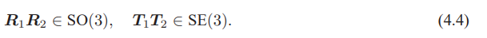

**群**

群是一种集合+一种运算的代数结构，集合记作A，运算记作 ·

那么群可以记作G=（A，·）  群要求运算满足：

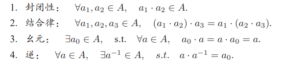

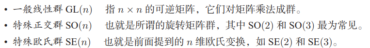

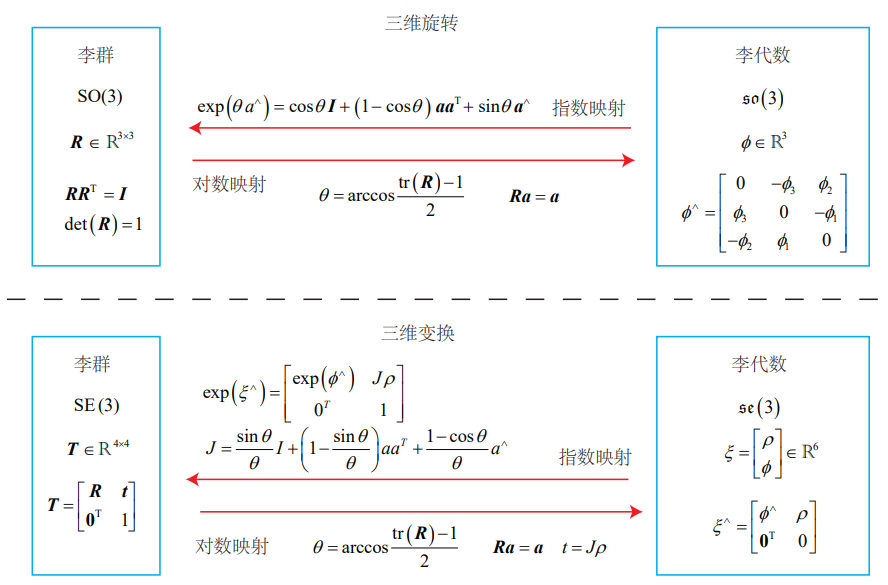

## Sophus库

> Sophus库支持SO(3)与SE(3)

可以由旋转矩阵进行构造SO:

```
Matrx3d R = AngelAxisd(PI/2,Vector3d(0,0,1).toRotationMatrix);
Sophus::SO3d SO3_R(R);

Quaterniond q(R);
Sophus::SO3d SO3_q(q);
```

对于SE(3):

```
Vector3d t(1,0,0); //沿x轴平移1
Sophus::SE3d SE3_Rt(R,t); //从R，t构造SE(3)
```

**SE(3)数据转Mat**

```
Sophus::SE3 se3=...;

// 将旋转矩阵转mat类型
cv::Mat R_cv(3,3,CV_32FC1,se3.rotationMatrix().data());

// 将4*4变换矩阵中的3*3旋转矩阵提取
cv::Mat R_cv(3,3,CV_32FC1,se3.matrix().block(0,0,3,3).data());

// 获取平移矩阵
cv::Mat t_cv(3,1,CV32FC1,se3.translation().data());
```

综上：

- rotationMatrix可以获取SE(3)中的旋转矩阵
- Matrix可以获取其中的平移矩阵
- translation可以获取平移矩阵

## 点云地图保存

非常好的一点在于，orbslam3的作者非常贴心地给这个系统加上了multi map，也就是我们可以获取当前的local map，做一些拟合相关的任务，而不用借助恶心的全局地图，那样子会很大的对吧~

所以捏，为了可爱的小草神能够站在桌面上，需要获得桌子的local map，需要将slam中的map引出。

```c++
// 在system.cc中加入函数，在相应的头文件中也要加入定义
void System::GetLocalMap(vector<MapPoint*> & localMap)
{
    // atlas = mpAtlas;
    Map *activeMap = mpAtlas->GetCurrentMap();
    if (!activeMap)
        return;
    const vector<MapPoint*> vpmaps = activeMap->GetAllMapPoints();
    localMap = vpmaps;
}

```

同时，在接口文件fun.cpp中，加入：（这个extern 的function并不是拟合平面用的，而是用来保存点云地图用的哈~）在skd呆的，说话都要崩洋文了是吧？😓

```c++
extern "C"
{
    void GetLocalMap()
    {
        ofstream out ;
        out.open("/storage/emulated/0/4DAR/cloud.txt");
        out << "# .PCD v0.7 - Point Cloud Data file format \n"
            << "VERSION 0.7\n"
            << "FIELDS x y z\n"
            << "SIZE 4 4 4 \n"
            << "TYPE F F F \n"
            << "COUNT 1 1 1\n"<<endl;
        // Atlas 这个类实在orbslam3作用域下声明的，所以要带上作用域或使用namespace
        // ORB_SLAM3::Atlas *atlas;
        vector<ORB_SLAM3::MapPoint*> vpmaps ;
        SLAM.GetLocalMap(vpmaps);

        
        vector<Point3f> mapPoints;

        out <<"WIDTH"<< " "<<vpmaps.size()<<"\n"
            <<"HEIGHT 1 \n" 
            << "VIEWPOINT 0 0 0 1 0 0 0\n"
            << "POINTS" << " "<< vpmaps.size() <<"\n"
            << "DATA ascii \n"
            << endl;

        for(size_t i = 0,iend = vpmaps.size();i<iend;i++)
        {
            if (vpmaps[i]->isBad())
                continue;
            Eigen::Matrix<float ,3,1> pos = vpmaps[i]->GetWorldPos();
            Point3f tmpPoint;
            tmpPoint.x = pos(0);
            tmpPoint.y = pos(1);
            tmpPoint.z = pos(2);
            mapPoints.push_back(tmpPoint);

            out<<pos(0)<< " " <<pos(1)<< " " <<pos(2)<<endl;
            
        }
        out.close();
    }
}
```

然后使用pcl读一下这个保存的点云文件：（只需要把后缀名改为pcd就可以了。。

```c++
#include <iostream>
#include <pcl/point_types.h>
#include <pcl/io/pcd_io.h>
#include <pcl/kdtree/kdtree_flann.h>
#include <pcl/common/common.h>
#include <pcl/io/vtk_lib_io.h>
#include <pcl/visualization/cloud_viewer.h>
#include <pcl/visualization/pcl_visualizer.h>
int main() {
//    std::cout << "Hello, World!" << std::endl;

    pcl::PointCloud<pcl::PointXYZ>::Ptr cloud(new pcl::PointCloud<pcl::PointXYZ>);
    pcl::io::loadPCDFile("./cloud.pcd",*cloud);

    boost::shared_ptr< pcl::visualization::PCLVisualizer > viewer(new pcl::visualization::PCLVisualizer("Ransac"));
    viewer->addCoordinateSystem(1.0);
    viewer->initCameraParameters();
    viewer->setBackgroundColor(0, 0, 0);

    viewer->addPointCloud(cloud, "cloud");
    viewer->spin();

    return 0;
}

```


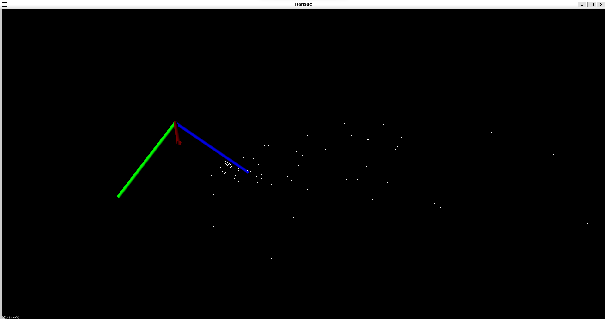

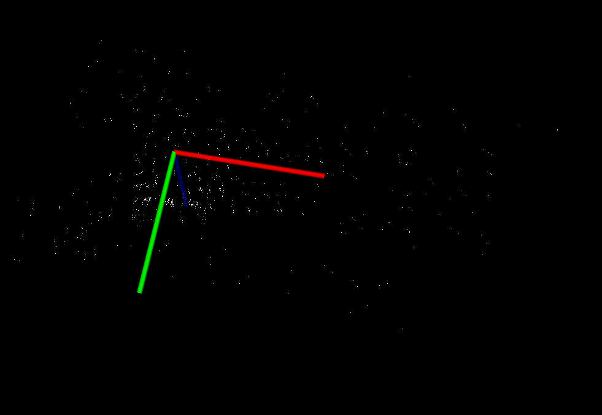

这个可以观察到，桌子的大体轮廓，那么这些点是从orbslam3的getposition得到的，可以推测slam系统的坐标轴，光轴方向是相机方向，手机朝下的方向是y轴的正方向，手机朝右的方向是x轴正方向。


## 平面拟合

> 使用ransac算法拟合

哼哼~

```c++
extern "C"
{
    void FitPlane(double plane_arg[])
    {
        double a,b,c,d;
        vector<ORB_SLAM3::MapPoint*> vpmaps ;
        SLAM.GetLocalMap(vpmaps);
        vector<Point3f> mapPoints;
        for(size_t i = 0,iend = vpmaps.size();i<iend;i++)
        {
            if (vpmaps[i]->isBad())
                continue;
            Eigen::Matrix<float ,3,1> pos = vpmaps[i]->GetWorldPos();
            Point3f tmpPoint;
            tmpPoint.x = pos(0);
            tmpPoint.y = pos(1);
            tmpPoint.z = pos(2);
            mapPoints.push_back(tmpPoint);
        }
        ransac(mapPoints,100,2,a,b,c,d);
        plane_arg[0] = a;
        plane_arg[1] = b;
        plane_arg[2] = c;
        plane_arg[3] = d;
    }
}

```


## unity（c#）

slam3.cs

```
using System.Collections;
using System.Collections.Generic;
using System.Runtime.InteropServices;
using UnityEngine;

using UnityEngine.UI;
using System;
using System.IO;
using System.Linq;
using System.Text;
using UnityEngine.SceneManagement;
using TMPro;
public class slam : MonoBehaviour
{


    // flag
    bool bool_startSlam = false;
    bool setModel=false;
    

    // TEMP data
    byte[] imgData;
    Color32[] data;
    
	float[] transform1 = new float[3];
	float[] rotation1 = new float[9];
    public int z;


    // game object
    // text
    public GameObject textMesh;
    public TextMeshProUGUI ui_text;


    // camera
    public Camera maincam;  

    // object
    public GameObject model;

    // BUTTON
    public Button btn_savepic;
    public Button btn_startSlam;
    public Button btn_setmodel;
    public Button btn_saveCloud;

    // raw image
    public RawImage rawImage;

    // WEBCAM
    public WebCamTexture webCamTexture = null;


    // dynamic libraries
    [DllImport("libslamAR")]
    private static extern int sum(int x,int y);
    [DllImport("libslamAR")]

    private static extern void ProcessImage(byte[] ImageData, float[] T, float[] R, int width,int height);
    
    [DllImport("libslamAR")]
    private static extern void SaveImage();
    [DllImport ("libslamAR")]
    private static extern void GetLocalMap();

 

    // Start is called before the first frame update
    void Start()
    {
        btn_startSlam.onClick.AddListener(()=>{StartCam();});
        btn_savepic.onClick.AddListener(()=>{Save();});
        btn_setmodel.onClick.AddListener(()=>{SetModel();});
        btn_saveCloud.onClick.AddListener(()=>{GetLocalMap();});


        ui_text = textMesh.GetComponent<TextMeshProUGUI>();
        
        // int x = 10;
        // int y = 20;
        // z  = sum(x,y);

    }

    public void SetModel()
    {
        setModel = true;

    }

    public void StartCam()
    {
        // clicked=true;isProcess=true;
        StartCoroutine(Call());
    }
    public IEnumerator Call()
    {

        // 请求权限
        yield return Application.RequestUserAuthorization(UserAuthorization.WebCam);
        if (!Application.HasUserAuthorization(UserAuthorization.WebCam))
        {
            yield return Application.RequestUserAuthorization(UserAuthorization.WebCam);//授权
        };
 
        if (Application.HasUserAuthorization(UserAuthorization.WebCam) && WebCamTexture.devices.Length > 0 )
        {
            Debug.Log(WebCamTexture.devices[0].name);
            
            // 创建相机贴图
            // webCamTexture = new WebCamTexture(WebCamTexture.devices[0].name, Screen.width, Screen.height, 60);
            webCamTexture = new WebCamTexture(WebCamTexture.devices[0].name,640,480,60);
            
            // webCamTexture.videoVerticallyMirrored  = true;
            rawImage.texture = webCamTexture;
            webCamTexture.Play();

            imgData = new byte[webCamTexture.height * webCamTexture.width * 4];
            data = new Color32[webCamTexture.height * webCamTexture.width];

            bool_startSlam = true;

            // Debug.Log("init");
                        // Debug.Log("cam length "+WebCamTexture.devices.Length+" "+WebCamTexture.devices[0].name+" "+webCamTexture.width+" "+webCamTexture.height);

            // clicked = true;


        }
    }
    private void OnApplicationPause(bool pause)
    {
        // 应用暂停的时候暂停camera，继续的时候继续使用
        if (webCamTexture !=null)
        {
            if (pause)
            {
                webCamTexture.Pause();
            }
            else
            {
                webCamTexture.Play();
            }
        }
        
    }
    private void OnDestroy()
    {
        if (webCamTexture != null)
        {
            webCamTexture.Stop();
        }
    }
    public void Color32ArrayToByteArray(Color32[] colors)
	{
		GCHandle handle = default(GCHandle);
		handle = GCHandle.Alloc(colors, GCHandleType.Pinned);
		IntPtr ptr = handle.AddrOfPinnedObject();
		Marshal.Copy(ptr, imgData, 0, webCamTexture.height * webCamTexture.width*4);

		if (handle != default(GCHandle))
			handle.Free();
	}
    public void Save()
    {
        SaveImage();
    }


    // Update is called once per frame
    void Update()
    {

        
        if (bool_startSlam)
        {
            // imgData = new byte[webCamTexture.height * webCamTexture.width * 4];
            // data = new Color32[webCamTexture.height * webCamTexture.width];
            Debug.Log("run");
            webCamTexture.GetPixels32(data);
            Color32ArrayToByteArray(data);
            // 得到数据
            ProcessImage(imgData, transform1, rotation1, webCamTexture.width,webCamTexture.height);

            // c++端的rotation是一列一列传过来的，
            Matrix4x4 ygx = Matrix4x4.identity;
			Vector4 y1 = new Vector4 (rotation1 [0], rotation1 [1], rotation1 [2], 0);
			Vector4 y2 = new Vector4 (rotation1 [3], rotation1 [4], rotation1 [5], 0);
			Vector4 y3 = new Vector4 (rotation1 [6], rotation1 [7], rotation1 [8], 0);
			Vector4 y4 = new Vector4 (0, 0, 0, 1);


            // set col 不进行转置
            ygx.SetColumn (0, y1);
            ygx.SetColumn (1, y2);
            ygx.SetColumn (2, y3);
			ygx.SetColumn (3, y4);


			Vector4 t = new Vector4 (-transform1 [0], transform1 [1], -transform1 [2], 1);
            // Vector4 t4 = new Vector4(-transform1 [0], transform1 [2], -transform1 [1],1);
			// cam.transform.position = ygx * t;
            // cam.transform.position = t;

            //tTranspose是转置矩阵。。。
            // y1是列数据，放置在第一行，也就是进行了转置
            Matrix4x4 tTranspose = Matrix4x4.identity;
            tTranspose.SetRow(0,y1);
            tTranspose.SetRow(1,y2);
            tTranspose.SetRow(2,y3);
            tTranspose.SetRow(3,y4);
            Vector4 w_y = tTranspose.GetColumn(1);
            Vector4 w_z = tTranspose.GetColumn(2);
            Quaternion w_quat = Quaternion.LookRotation(new Vector3(w_z.x,w_z.y,w_z.z),new Vector3(w_y.x,w_y.y,w_y.z));

            // Vector4 camPos = tTranspose*t;

            // 使用欧拉角
            Matrix4x4 matrix = ygx;  // 不转置的矩阵
            // Matrix4x4 matrix = tTranspose; // 获得转置的变换矩阵，其实就是3*3的旋转矩阵做了增广（这样做因为没有3*3数组）
            float x =57.3f*Mathf.Atan2(-matrix[1, 2], Mathf.Sqrt(matrix[1, 0] *matrix[1, 0] + matrix[1, 1] * matrix[1, 1]));
            float y =57.3f*Mathf.Atan2(matrix[0,2], matrix[2,2]);
            float z =57.3f*Mathf.Atan2(matrix[1,0],matrix[1,1]);

            if (setModel)
            {
                maincam.transform.eulerAngles = new Vector3(-x,y,-z);
                maincam.transform.position = t;
            }

            String text_out = 
            rotation1 [0].ToString("0.0")+" "+
            rotation1 [1].ToString("0.0")+" "+
            rotation1 [2].ToString("0.0")+" "+"\n"+
            rotation1 [3].ToString("0.0")+" "+
            rotation1 [4].ToString("0.0")+" "+
            rotation1 [5].ToString("0.0")+" "+"\n"+
            rotation1 [6].ToString("0.0")+" "+
            rotation1 [7].ToString("0.0")+" "+
            rotation1 [8].ToString("0.0")+" "+ "\n"+
            t[0].ToString("0.0")+" "+
            t[1].ToString("0.0")+" "+
            t[2].ToString("0.0");
            ui_text.text = text_out;

            
        

            
            
            // Debug.Log(z);

        }
    }
}

```

---

slam2.cs

```
using System.Collections;
using System.Collections.Generic;
using UnityEngine;
using UnityEngine.UI;
using System.Runtime.InteropServices;

using System;
using System.IO;
using System.Linq;
using System.Text;
using UnityEngine.SceneManagement;
using TMPro;
public class androidCam : MonoBehaviour
{
    // public GameObject surface;


    
    public string devicename;
    // public Texture2D t2d;
    bool clicked=false;


    	// Gyroscope gyro;
	float w,x,y,z;
	Quaternion quatMult;
	Quaternion quatMap;

	float[] transform1 = new float[3];
	float[] rotation1 = new float[9];

	float[] P = new float[3];
	float[] E = new float[3];
    float[] meanPoint = new float[3];
    int range=15;


	Color32[] data;
	// public WebCamTexture webcamTexture;
	// Texture2D tex;

	byte[] imgData;

	// bool isIMU;

	// bool isProcess;
	bool isshow = true ;
    bool syncModelPosition = false;
	// bool isFirst;
	// public GameObject fightman;

    public GameObject cam;
    // Start is called before the first frame update  

    public GameObject paimon; 
    public GameObject camroot;

    public WebCamTexture webCamTexture=null;
    // bool isFirst=true;
    public RawImage rawImage;
    public GameObject plane;
    public GameObject textMesh;
    public TextMeshProUGUI ui_text;


    //button
    public Button btn_start;
    public Button btn_setmodel;
    public Button btn_reset;
    public Button btn_savepic;
    public Vector3 initPosition=new(0,0,0);


    [DllImport ("libslamAR")]
	private static extern int process_Image (byte[] ImageData, float[] T, float[] wxyz, ref bool isShow,int width,int height);

	[DllImport("libslamAR")]
	private static extern void reset ();

    [DllImport("libslamAR")]
    private static extern int fun(int x,int y);

    [DllImport("libslamAR")]
    private static extern void savepic();

    [DllImport("libslamAR")]
    private static extern int GetPoint(float[] xyz);

    void Start()
    {

        // fun(1,1);
        btn_start.onClick.AddListener(()=>{Startcam();});
        btn_setmodel.onClick.AddListener(()=>{Setmodel();});
        btn_reset.onClick.AddListener(()=>{ResetSlam();});
        btn_savepic.onClick.AddListener(()=>{savepic();});
        plane.SetActive(false);
        ui_text = textMesh.GetComponent<TextMeshProUGUI>();
        // this.transform.position = new Vector3(0,0,1,0);

        // cam.transform.Rotate(new Vector3(90.0f,0,0));
        
    }


    public void ResetSlam()
    {
        Debug.Log("reset slam");
        // ui_text.text = "0 0 0";
        reset();
    }
    public void Setmodel()
    {
        int iend;
        iend = GetPoint(meanPoint);
        Debug.Log(iend);
        Vector3 vec = new Vector3(-meanPoint[0],-meanPoint[1],meanPoint[2]-1.6f);

        // Vector3 dir = cam.transform.forward*3.0f + cam.transform.position;
        // 把模型设置在点云的中心处，同时打开相机的跟踪：syncModelPosition
        initPosition = vec;
        // paimon.transform.position = vec;
        paimon.transform.position = vec;
        syncModelPosition = true;
        // cam.transform.Rotate(new Vector3(90.0f,0,0));
    }
    public void Startcam()
    {
        // clicked=true;isProcess=true;
        StartCoroutine(Call());
    }
 
    public IEnumerator Call()
    {

        // 请求权限
        yield return Application.RequestUserAuthorization(UserAuthorization.WebCam);
        if (!Application.HasUserAuthorization(UserAuthorization.WebCam))
        {
            yield return Application.RequestUserAuthorization(UserAuthorization.WebCam);//授权
        };
 
        if (Application.HasUserAuthorization(UserAuthorization.WebCam) && WebCamTexture.devices.Length > 0 )
        {
            Debug.Log(WebCamTexture.devices[0].name);
            
            // 创建相机贴图
            // webCamTexture = new WebCamTexture(WebCamTexture.devices[0].name, Screen.width, Screen.height, 60);
            webCamTexture = new WebCamTexture(WebCamTexture.devices[0].name,640,480,60);
            
            // webCamTexture.videoVerticallyMirrored  = true;
            rawImage.texture = webCamTexture;
            webCamTexture.Play();

            imgData = new byte[webCamTexture.height * webCamTexture.width * 4];
            data = new Color32[webCamTexture.height * webCamTexture.width];

            Debug.Log("init");
                        Debug.Log("cam length "+WebCamTexture.devices.Length+" "+WebCamTexture.devices[0].name+" "+webCamTexture.width+" "+webCamTexture.height);

            clicked = true;


        }
    }

    private void OnApplicationPause(bool pause)
    {
        // 应用暂停的时候暂停camera，继续的时候继续使用
        if (webCamTexture !=null)
        {
            if (pause)
            {
                webCamTexture.Pause();
            }
            else
            {
                webCamTexture.Play();
            }
        }
        
    }
    public void Color32ArrayToByteArray(Color32[] colors)
	{
		GCHandle handle = default(GCHandle);
		handle = GCHandle.Alloc(colors, GCHandleType.Pinned);
		IntPtr ptr = handle.AddrOfPinnedObject();
		Marshal.Copy(ptr, imgData, 0, webCamTexture.height * webCamTexture.width*4);

		if (handle != default(GCHandle))
			handle.Free();
	}
	
    
    private void OnDestroy()
    {
        if (webCamTexture != null)
        {
            webCamTexture.Stop();
        }
    }

    // Update is called once per frame
    void Update()
    {
        // webCamTexture.Stop();
        // webCamTexture.Play();
        // Color rgb = webCamTexture.GetPixel(10,10);
        // Debug.Log(rgb.r);
        if (clicked )
        {
            webCamTexture.GetPixels32(data);
            Color32ArrayToByteArray(data);

            process_Image(imgData, transform1, rotation1, ref isshow,webCamTexture.width,webCamTexture.height);
            Matrix4x4 ygx = Matrix4x4.identity;
			Vector4 y1 = new Vector4 (rotation1 [0], rotation1 [1], rotation1 [2], 0);
			ygx.SetColumn (0, y1);
			Vector4 y2 = new Vector4 (rotation1 [3], rotation1 [4], rotation1 [5], 0);
			ygx.SetColumn (1, y2);
			Vector4 y3 = new Vector4 (rotation1 [6], rotation1 [7], rotation1 [8], 0);
			ygx.SetColumn (2, y3);
			Vector4 y4 = new Vector4 (0, 0, 0, 1);
			ygx.SetColumn (3, y4);

			Vector4 vy = ygx.GetColumn (0);
			Vector4 vz = ygx.GetColumn (1);
			Quaternion newQ = Quaternion.LookRotation (new Vector3 (vz.x, vz.y, vz.z), new Vector3 (vy.x, vy.y, vy.z));

			Vector4 t = new Vector4 (transform1 [0], -transform1 [1], transform1 [2], 1);
            // Vector4 t4 = new Vector4(-transform1 [0], transform1 [2], -transform1 [1],1);
			// cam.transform.position = ygx * t;
            // cam.transform.position = t;

            //tTranspose是转置矩阵。。。
            // y1是列数据，放置在第一行，也就是进行了转置
            Matrix4x4 tTranspose = Matrix4x4.identity;
            tTranspose.SetRow(0,y1);
            tTranspose.SetRow(1,y2);
            tTranspose.SetRow(2,y3);
            tTranspose.SetRow(3,y4);
            Vector4 w_y = tTranspose.GetColumn(1);
            Vector4 w_z = tTranspose.GetColumn(2);
            Quaternion w_quat = Quaternion.LookRotation(new Vector3(w_z.x,w_z.y,w_z.z),new Vector3(w_y.x,w_y.y,w_y.z));

            Vector4 camPos = tTranspose*t;


            // 使用欧拉角
            Matrix4x4 matrix = tTranspose; // 获得转置的变换矩阵
            float x =57.3f*Mathf.Atan2(-matrix[1, 2], Mathf.Sqrt(matrix[1, 0] *matrix[1, 0] + matrix[1, 1] * matrix[1, 1]));
            float y =57.3f*Mathf.Atan2(matrix[0,2], matrix[2,2]);
            float z =57.3f*Mathf.Atan2(matrix[1,0],matrix[1,1]);
        


            if(!syncModelPosition)
            {
                // 点击Setmodel之前，设置模型的位姿与相机一致
                // y1 -y2 y3 刚好是在c++端乘矩阵后，剩下的y2乘-1，也就是-R^T
                // 实际测试中，可以表征相机位姿（世界坐标系中的相机）
			    // paimon.transform.rotation = w_quat;

            }
            if(syncModelPosition)
            {
                // 开启了模型同步，也就是点击了setmodel之后
                // 需要把相机设置为世界坐标and位姿
                // cam.transform.position = new Vector3(camPos[0],camPos[2],camPos[1]);
                // cam.transform.position = ;
                // cam.transform.rotation = w_quat;

			    // cam.transform.position = ygx * t;


                cam.transform.eulerAngles = new Vector3(-x,y,-z);
                cam.transform.position = t;

            }

            // Debug.Log("out"+ygx);
            String rotationMatrix = 
            "pose\n"+
            rotation1 [0].ToString("0.0")+" "+
            rotation1 [1].ToString("0.0")+" "+
            rotation1 [2].ToString("0.0")+" "+"\n"+
            rotation1 [3].ToString("0.0")+" "+
            rotation1 [4].ToString("0.0")+" "+
            rotation1 [5].ToString("0.0")+" "+"\n"+
            rotation1 [6].ToString("0.0")+" "+
            rotation1 [7].ToString("0.0")+" "+
            rotation1 [8].ToString("0.0")+" "+ "\n"+
            "model pos\n"+
            initPosition[0].ToString("0.0")+" "+
            initPosition[1].ToString("0.0")+" "+
            initPosition[2].ToString("0.0")+" "+"\n"+
            "current pos:\n"+
            t[0].ToString("0.0")+" "+
            t[1].ToString("0.0")+" "+
            t[2].ToString("0.0");


//          t[0] 1 2 
//          x y z
            if((t[0]<range && t[0]>-range)&&(t[1]<range && t[1]>-range)&&(t[2]<range && t[2]>-range))
            {
                paimon.SetActive(true);
            }
            else{
                paimon.SetActive(false);
            }


            ui_text.text = rotationMatrix;
            // ui_text.text = t[0].ToString("0.0")+" "+t[1].ToString("0.0")+" "+t[2].ToString("0.0");
            // if([0]!=0.0)
            // {
            //     plane.SetActive(true);
            // }

        }


    }

}
```

