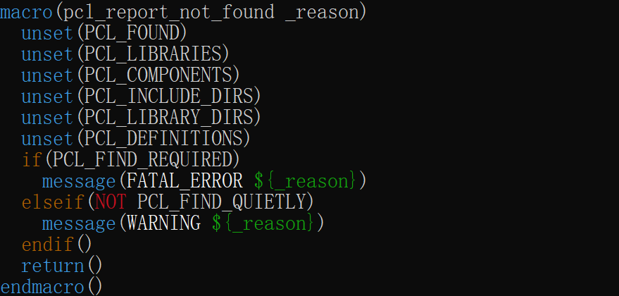
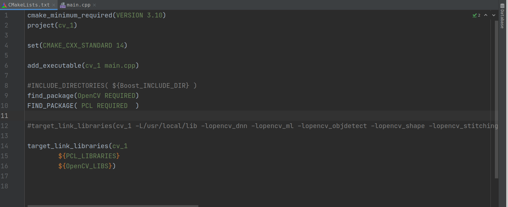

# cmake一些参数

主要是在Linux系统下使用到的一些cmake参数

## 1.set

## 2.find_package

该命令主要是引入项目所需要的包，主要工作方式有两种：module和config

**Module**

在Module模式中，cmake需要找到一个叫做`Find<LibraryName>.cmake`的文件。这个文件负责找到库所在的路径，为我们的项目引入头文件路径和库文件路径。cmake搜索这个文件的路径有两个，一个是上文提到的cmake安装目录下的`share/cmake-<version>/Modules`目录，另一个使我们指定的`CMAKE_MODULE_PATH`的所在目录。[Cmake之深入理解find_package()的用法 - 知乎 (zhihu.com)](https://zhuanlan.zhihu.com/p/97369704)

*这些find××.cmake一般由包项目提供，如opencv等，然后会复制到cmake的安装目录下面，在以后的项目构建中可能会用到*


***

**Config模式**

如果Module模式搜索失败，没有找到对应的`Find<LibraryName>.cmake`文件，则转入Config模式进行搜索。它主要通过`<LibraryName>Config.cmake` or `<lower-case-package-name>-config.cmake`这两个文件来引入我们需要的库。以我们刚刚安装的pcl库为例，在我们安装之后，它在`/usr/local/share/pcl-version`目录下生成了`PCLConfig.cmake`文件，而`/usr/local/lib/cmake/<LibraryName>/`正是find_package函数的搜索路径之一。（find_package的搜索路径是一系列的集合，而且在linux，windows，mac上都会有所区别，需要的可以参考官方文档[find_package](https://cmake.org/cmake/help/latest/command/find_package.html)）


搜索路径：


以pcl为例，prefix为`/usr/local`


***

**综上所述，使用find_package找到包的路径，然后在自己的项目中使用。一般找到了Config.cmake文件，通过查看里面的宏定义，即可查看包名：**



即`PCL_LIBRARIES`为包名字，然后再项目中使用时，即可引用这个宏：


opencv的Config.cmake则提供了更加详细的使用方式：（也就是在本项目中的cmakelist中包括了 `find_package` 之后，在cmakelist中的`OpenCv_LIBS` 才有了定义）


这样，cmakelist就很简洁，不用指定动态库了~~




# 方法

## find_package

**批量引入库文件和头文件**，需要通过.cmake为后缀的文件引入，配合关键字：

1. REQUIRED:必须找到库，否则就报错
2. COMPONENTS:从库中找到字库

以opencv为例子，opencv提供的是OpenCVConfig.cmake，只需要引用一次，就可以将opencv库所有的库文件和头文件引入到当前工程。

```cmake
find_package(OpenCV REQUIRED)
 
# OpenCV_INCLUDE_DIRS 是预定义变量，代表OpenCV库的头文件路径
include_directories(${OpenCV_INCLUDE_DIRS}) 
 
# OpenCV_LIBS 是预定义变量，代表OpenCV库的lib库文件
target_link_libraries(MY_TARGET_NAME ${OpenCV_LIBS})
```


## include_directories

**引入头文件目录**，即引入头文件搜索路径，当工程用到某个头文件时，就会去该路径下搜索。

```cmake
# 绝对路径引入
include_directories("D:\\ProgramFiles\\Qt\\qt5_7_lib_shared_64\\include")
 
# 普通变量引入(可以理解为把D:\\ProgramFiles\\Qt\\qt5_7_lib_shared_64放入一个集合INCLUDE_PATH)
# ${变量名} 可以获取集合内容，允许拼接
set (INCLUDE_PATH D:\\ProgramFiles\\Qt\\qt5_7_lib_shared_64)
include_directories(${INCLUDE_PATH}/include)       
 
# 环境变量引入
# 假设环境变量是INCLUDE_PATH = D:\\ProgramFiles\\Qt\\qt5_7_lib_shared_64
# #ENV{环境变量名} 可以获取环境变量的内容，允许拼接
include_directories($ENV{INCLUDE_PATH}/include)
```

一个cmake总工程可以包含多个子工程，总工程引入的头文件，并不代表子工程就可以用，就好比幼儿园老师（总工程）买来一箱苹果，小朋友（子工程）根据需求拿苹果。

引入的头文件如果需要了其他的文件，还需要使用add_executable把对应的文件包含进去

## link_directories

**引入库目录，添加库文件的搜索路径**，若工程在编译的时候会需要用到某个第三方库的 lib 文件，此时就可以使用 link_libraries 来添加搜索路径。

```cmake
# 绝对引入
link_libraries("D:\ProgramFiles\Qt\qt5_7_lib_shared_64\lib")
 
# 预定义变量引入
# PROJECT_SOURCE_DIR 是cmake的预定义变量，表示顶层CmakeList文件所在路径
link_libraries(${PROJECT_SOURCE_DIR}/ExtLib/ffmpeg/win64/lib)
 
# 环境变量引入
# 环境变量 QT_LIB = D:\\ProgramFiles\\Qt\\qt5_7_lib_shared_64
link_libraries($ENV{QT_LIB}/lib)
```


## link_libraries

**引入库文件**，表示将**具体的库文件**引入到当前工程中，所填写的必须为全路径

```
# 全路径引入
LINK_LIBRARIES("/opt/MATLAB/R2012a/bin/glnxa64/libeng.so")
```


## target_link_libraries

**引入库文件到子工程**，表示添加第三方库到目标子工程，**link_directories表示引入库目录到当前工程**，link_libraries表示引入到当前工程。**link_libraries 是引入库文件到当前工程**，具体是哪个工程并没有指明，就好比，货车把满载的货物运到幼儿园里，但是没分配。

**target_link_libraries 起的作用就是分发工作，分发xx库给指定工程，注意xx库必须是当前工程中有的或者 搜索路径里有的。**

```cmake
target_link_libraries(子工程名 库文件1 库文件2 ...)     # 注意子工程名和库文件名之间以空格隔开
```


## target_include_directories

**引入头文件目录到子工程**，


## find_library和findpath

- find_library 用于查找动态/静态库

  ```
  find_library(libvar mylib.so ./libs)
  add_executable(test test.cpp)
  target_link_libraries(test ${libvar})
  ```

- find_path 用于查找头文件

## add_subdirectory

add_subdirectory是Cmake命令中用于添加一个子目录并构建该子目录的函数，可以指定source_dir、binary_dir和EXCLUDE_FROM_ALL三个参数。

## set_target_properties

**用法：**set_target_properties(hello PROPERTIES ***)

**常用属性：**

- 设置输出目录

- 指定引用库：imported_location

  ```
  add_library(mylib SHARED mylib.cpp)
  set_target_properties(mylib PROPERTIES 
  					IMPORTED_LOCATION "path/mylib.so")
  					
  ```

  使用`add_library`创建了一个名为mylib的共享库，然后使用set_target_properties指定其IMPORTED_LOCATION属性，将其设置为"path/mylib.so"的位置。

  这样在cmake构建的过程中，就可以把这个路径作为mylib库的位置，以便进行链接。

  后面调用时，直接：

  ```
  target_link_libraries(${PROJECT_NAME} mylib)
  ```

  

# Example

## 构建和链接静态库和动态库

1. 编写库文件和cmakelist，其中库文件要列出函数，cmake要将源文件编译为库

   ```cmake
   add_library(message STATIC
   			fun.cpp fun.h)
   ```

2. 编写主函数，调用这个库

   ```cmake
   #可执行文件的目标不需要修改
   add_executable(${PROJECT_NAME} main.cpp)
   ```

   然后需要将目标库（编译好的库）**链接**到可执行目标

   ```cmake
   target_link_libraries(${PROJECT_NAME} message)
   ```

## 构建自己的库，同时依赖于第三方库

1. 使用工具链构建第三方动态库

2. 在自己的库中，cmakelists

   ```cmake
   cmake_minimum_required(VERSION 3.0)
   project(slamAR)
   
   include_directories("/home/sophda/src/opencv-3.4.16/build/install/sdk/native/jni/include")
   
   link_directories("/home/sophda/src/opencv-3.4.16/build/install/sdk/native/libs/armeabi-v7a")
   
   add_library(${PROJECT_NAME} SHARED fun.cpp)
   target_link_libraries(${PROJECT_NAME} libopencv_core.so libopencv_imgproc.so libopencv_imgcodecs.so)
   ```

   - include_directories，**编译**的过程中可以找到对应的函数定义
   - link_directories，**添加库的搜索路径**，供链接时使用。只有添加了这个路径，才能够在**链接**阶段找到对应的库文件，要不然他妈去哪儿找？
   - add_library，选择库的**类型**，动态or静态，以及源文件
   - target_link_libraries，将用到的动态库**链接到目标target**，因为使用link_directories指定了库的路径，因此在这个目录下进行寻找。

## orbslam3 安卓端构建

### 头文件 include_directories

include_dirctories包含的文件夹，会在里面找头文件。

比如在orbslam3的`keyframe.h`里面有：

```
#include "Thirdparty/DBoW2/DBoW2/BowVector.h"
#include "Thirdparty/DBoW2/DBoW2/FeatureVector.h"
```

如果在cmake里面写：

```
include_directories(***/ThirdParty/DBoW2)
```

这样子是找不到的，因为这样会使得cmake去DBoW2中寻找`Thirdparty/DBoW2/DBoW2/FeatureVector.h`显然无法找到。

因此需要写成：

```
include_directories(***/ThirdParty)
```

**同理，如果头文件是**：

```
#include "BowVector.h"
#include "FeatureVector.h"
```

在cmake中写：

```
include_directories(***/ThirdParty)
```

这样子也是找不到的
